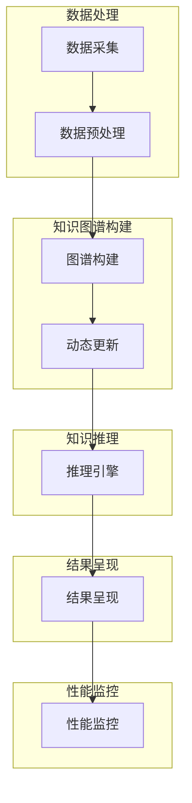
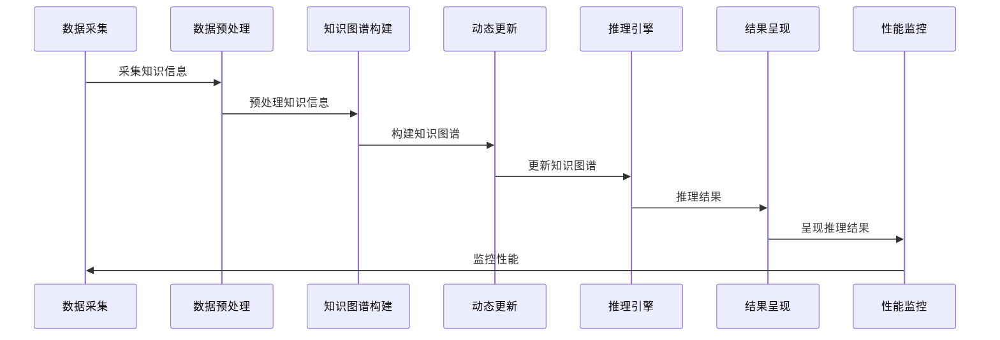

                 

### 动态知识推理能力的提升策略

#### 2.4 动态节点更新机制

为了提升GCN在动态知识推理中的能力，我们首先需要关注如何有效地更新节点的嵌入表示。动态节点更新机制是实现这一目标的关键。以下是实现动态节点更新机制的一步一步过程：

**步骤1：监测节点特征变化**

在动态环境中，节点的特征会随着时间的推移而发生变化。为了捕捉这些变化，我们需要一个实时监测系统，该系统能够持续监控节点特征的变化，并将其作为更新节点嵌入表示的依据。

**步骤2：特征差异分析**

通过对比当前节点的特征与其历史特征，我们可以分析出特征的变化差异。这种差异分析可以是基于统计方法的，例如计算标准差或使用机器学习算法来识别显著的变化。

**步骤3：更新节点嵌入表示**

根据特征差异分析的结果，对节点的嵌入表示进行更新。这种更新可以是线性变换，也可以是更复杂的函数，例如自适应更新策略，根据特征的差异动态调整权重。

**步骤4：验证更新效果**

更新节点嵌入表示后，我们需要验证这种更新是否有效地提高了动态知识推理的能力。这可以通过在测试集上评估模型的推理准确率来进行。

#### 2.5 动态边更新机制

动态边的更新机制与节点更新机制类似，但需要处理节点间交互关系的动态变化。以下是动态边更新机制的详细步骤：

**步骤1：监测边权重变化**

动态边更新机制首先需要监测边权重的变化。这可以通过分析节点间交互的频率、强度等因素来实现。例如，如果两个节点之间的交互频率显著增加，那么它们的边权重可能需要相应地调整。

**步骤2：分析边类型变化**

除了权重，边的类型也可能随着时间而变化。例如，在社交网络中，朋友关系可能转变为合作关系。因此，动态边更新机制需要能够识别这种类型的变化，并相应地调整边的表示。

**步骤3：更新边特征表示**

根据边权重和类型的变化，对边的特征表示进行更新。这种更新可以采用类似节点的自适应更新策略，根据变化动态调整边的权重和类型。

**步骤4：调整节点间的关系**

更新边后，还需要调整节点间的关系，以确保整个图结构的连贯性和一致性。这可以通过重新计算节点邻域信息来实现，例如重新计算节点邻域的聚合权重。

#### 2.6 自适应学习策略

自适应学习策略是优化GCN模型性能的重要手段。以下是实现自适应学习策略的一步一步过程：

**步骤1：引入自适应学习率**

在训练过程中，学习率是一个关键参数。传统的固定学习率可能无法适应动态知识推理的需求。因此，引入自适应学习率是一种有效的策略。自适应学习率可以根据训练的进展动态调整，例如使用基于梯度变化的策略。

**步骤2：实现动态正则化**

正则化是防止模型过拟合的重要手段。在动态知识推理中，正则化策略也需要动态调整。例如，在训练初期，可以采用较宽松的正则化，而在模型逐渐收敛时，可以增加正则化的强度。

**步骤3：优化模型参数**

利用自适应学习率和动态正则化策略，我们可以优化模型参数，以实现更好的推理性能。这可以通过迭代优化算法来实现，例如使用基于梯度的优化算法。

**步骤4：验证优化效果**

优化后的模型需要通过测试集来验证其性能。这包括评估模型的推理准确率、鲁棒性和泛化能力等指标。

#### 2.7 推理算法改进

在实现动态更新机制和自适应学习策略后，我们需要进一步改进推理算法，以确保能够高效地实现动态知识推理。以下是推理算法改进的一步一步过程：

**步骤1：设计高效的聚合函数**

推理算法的核心是聚合函数，它用于计算节点邻域信息的综合表示。在设计高效的聚合函数时，需要考虑动态环境的特点，例如实时性和适应性。

**步骤2：实现动态查询接口**

为了实现对动态知识的实时查询，我们需要设计一个动态查询接口。这个接口需要能够根据动态更新机制和推理算法的变化，灵活调整查询策略。

**步骤3：优化查询效率**

在动态环境中，查询效率是一个关键问题。通过优化算法和数据结构，我们可以提高查询效率，例如使用基于哈希表的索引结构。

**步骤4：评估推理性能**

改进后的推理算法需要通过一系列测试来评估其性能。这包括评估推理速度、准确率和资源利用率等指标。

### 2.8 动态知识推理能力增强的实际应用

动态知识推理能力增强方法在多个实际应用场景中表现出色。以下是一些具体的案例：

- **智能问答系统**：通过动态更新知识图谱，实现实时、准确的问答。
- **动态推荐系统**：根据用户行为的动态变化，提供个性化的推荐。
- **社交网络分析**：通过动态更新用户关系，识别社交网络中的关键节点和模式。
- **生物信息学**：在基因序列分析中，动态更新基因关系图，提高基因关联预测的准确性。

这些案例表明，基于图卷积网络的动态知识推理能力增强方法具有重要的应用价值，为解决动态知识推理中的难题提供了有效的途径。

### 2.9 本章小结

本章详细介绍了基于图卷积网络的动态知识推理能力增强方法，包括动态节点更新机制、动态边更新机制、自适应学习策略和推理算法改进等。通过这些方法，GCN能够更好地处理动态知识推理任务，提高模型的实时性和准确性。在后续章节中，我们将进一步探讨这些方法的实现细节和应用案例。

----------------------------------------------------------------

## 第三部分：算法原理讲解

### 3.1 动态节点更新机制的算法原理

动态节点更新机制是提升GCN动态知识推理能力的关键组成部分。该机制的核心在于实时监测节点特征变化，并基于这些变化动态调整节点的嵌入表示。以下是动态节点更新机制的具体算法原理：

#### 3.1.1 算法流程

1. **初始化节点嵌入表示**：首先，我们需要初始化节点嵌入表示。这可以通过随机初始化或基于已有知识的初始化方法来实现。

2. **特征差异监测**：通过监测节点的输入特征，与历史特征进行对比，分析特征差异。这一过程可以使用基于统计的方法，例如计算特征的标准差或使用机器学习算法检测显著的变化。

3. **特征差异评估**：对特征差异进行评估，判断是否需要进行更新。如果特征差异超出阈值，则认为需要更新。

4. **节点嵌入更新**：根据特征差异，动态调整节点的嵌入表示。这可以通过线性变换、非线性函数或自适应更新策略来实现。

5. **嵌入表示验证**：更新后，对节点嵌入表示进行验证，确保其能够更好地反映节点的动态特征。

#### 3.1.2 算法原理数学模型

假设我们有节点 $v$ 的嵌入表示为 $h_v$，其历史特征为 $h_v^{(t-1)}$，当前特征为 $h_v^{(t)}$。动态节点更新机制的数学模型可以表示为：

$$ h_v^{(t)} = \text{UpdateFunction}(h_v^{(t-1)}, h_v^{(t)}) $$

其中，UpdateFunction 是一个自适应的更新函数，可以根据特征差异动态调整节点嵌入表示。

#### 3.1.3 算法原理举例

例如，假设节点 $v$ 的特征变化较小，我们可以使用线性变换进行更新：

$$ h_v^{(t)} = \alpha h_v^{(t-1)} + (1-\alpha) h_v^{(t)} $$

其中，$\alpha$ 是一个自适应参数，可以根据特征差异动态调整。

#### 3.1.4 动态节点更新机制的优势

- **实时性**：通过实时监测和更新节点特征，动态节点更新机制能够适应动态知识推理的需求。
- **灵活性**：自适应更新函数允许我们根据不同场景调整更新策略，提高模型的适应性。
- **准确性**：动态更新节点嵌入表示，可以更好地反映节点的动态特征，提高推理准确率。

### 3.2 动态边更新机制的算法原理

动态边更新机制关注于实时监测和更新节点间的交互关系，从而动态调整边的权重和类型。以下是动态边更新机制的具体算法原理：

#### 3.2.1 算法流程

1. **初始化边特征**：首先，我们需要初始化边的特征，这可以是边的权重和类型。初始值可以通过随机初始化或基于已有数据的统计方法来确定。

2. **监测边变化**：实时监测节点间的交互，例如交互频率、交互强度等。这些信息可以作为边变化的依据。

3. **评估边差异**：根据监测到的边变化，评估边的权重和类型是否需要进行更新。例如，如果两个节点的交互频率显著增加，那么它们的边权重可能需要增加。

4. **更新边特征**：根据评估结果，动态调整边的特征。这可以通过线性变换、非线性函数或自适应更新策略来实现。

5. **验证更新效果**：更新后，验证边的特征是否能够更好地反映节点间的动态关系。

#### 3.2.2 算法原理数学模型

假设边 $e_{uv}$ 的权重为 $w_{uv}$，类型为 $t_{uv}$。动态边更新机制的数学模型可以表示为：

$$ w_{uv}^{(t)} = \text{UpdateWeight}(w_{uv}^{(t-1)}, \text{InteractionScore}_{uv}^{(t)}) $$

$$ t_{uv}^{(t)} = \text{UpdateType}(t_{uv}^{(t-1)}, \text{InteractionScore}_{uv}^{(t)}) $$

其中，UpdateWeight 和 UpdateType 分别是更新权重和类型的函数，InteractionScore_{uv}^{(t)} 是节点 $u$ 和 $v$ 在时间 $t$ 的交互得分。

#### 3.2.3 算法原理举例

例如，假设节点 $u$ 和 $v$ 的交互得分增加，我们可以使用以下公式更新边的权重：

$$ w_{uv}^{(t)} = w_{uv}^{(t-1)} + \lambda \cdot (\text{InteractionScore}_{uv}^{(t)} - w_{uv}^{(t-1)}) $$

其中，$\lambda$ 是一个调节参数，用于控制更新速度。

#### 3.2.4 动态边更新机制的优势

- **实时性**：通过实时监测和更新边特征，动态边更新机制能够快速适应动态知识推理的需求。
- **灵活性**：自适应更新函数允许我们根据不同场景调整更新策略，提高模型的适应性。
- **准确性**：动态更新边特征，可以更好地反映节点间的动态关系，提高推理准确率。

### 3.3 自适应学习策略的算法原理

自适应学习策略是优化GCN模型性能的关键。通过动态调整学习率和正则化参数，我们可以提高模型的适应性和鲁棒性。以下是自适应学习策略的具体算法原理：

#### 3.3.1 算法流程

1. **初始化学习率**：首先，我们需要初始化学习率。初始值可以通过经验或实验确定。

2. **监测学习率效果**：在训练过程中，实时监测学习率对模型性能的影响。

3. **调整学习率**：如果发现学习率对模型性能有负面影响，则根据监测结果动态调整学习率。这可以通过基于梯度的方法来实现，例如使用AdaGrad、Adam等优化算法。

4. **引入动态正则化**：在训练过程中，根据模型性能的变化，动态调整正则化参数。这可以通过增加或减少正则化项来实现。

5. **验证调整效果**：调整后，验证模型的性能是否有显著提升。

#### 3.3.2 算法原理数学模型

假设学习率为 $\eta$，正则化参数为 $\lambda$。自适应学习策略的数学模型可以表示为：

$$ \eta^{(t)} = \text{AdjustLearningRate}(\eta^{(t-1)}, \text{PerformanceScore}^{(t)}) $$

$$ \lambda^{(t)} = \text{AdjustRegularization}(\lambda^{(t-1)}, \text{PerformanceScore}^{(t)}) $$

其中，AdjustLearningRate 和 AdjustRegularization 分别是调整学习率和正则化参数的函数，PerformanceScore^{(t)} 是在时间 $t$ 的模型性能得分。

#### 3.3.3 算法原理举例

例如，假设当前学习率对模型性能有负面影响，我们可以使用以下公式减小学习率：

$$ \eta^{(t)} = \eta^{(t-1)} \cdot \gamma $$

其中，$\gamma$ 是一个小于1的调节参数。

#### 3.3.4 自适应学习策略的优势

- **适应性**：通过动态调整学习率和正则化参数，自适应学习策略能够更好地适应训练过程中的变化。
- **鲁棒性**：动态调整策略可以提高模型的鲁棒性，减少过拟合现象。
- **高效性**：自适应调整可以加快训练过程，提高模型性能。

### 3.4 推理算法改进的算法原理

推理算法改进的目标是设计一种高效的算法，能够在动态更新机制和自适应学习策略的支持下，实现对动态知识的实时推理。以下是推理算法改进的具体算法原理：

#### 3.4.1 算法流程

1. **初始化推理模型**：首先，我们需要初始化推理模型，这可以是基于GCN的扩展模型。

2. **动态更新节点嵌入表示**：在推理过程中，根据动态节点更新机制实时更新节点的嵌入表示。

3. **动态调整边特征**：在推理过程中，根据动态边更新机制动态调整边的权重和类型。

4. **聚合邻域信息**：使用高效的聚合函数，将节点邻域信息进行综合，形成全局表示。

5. **推理知识**：根据聚合的表示，进行知识推理，生成推理结果。

6. **验证推理结果**：对推理结果进行验证，确保其准确性和实时性。

#### 3.4.2 算法原理数学模型

假设节点 $v$ 的邻域信息表示为 $N_v$，推理函数为 $R(h_v; N_v)$。推理算法改进的数学模型可以表示为：

$$ h_v^{(t)} = R(h_v^{(t-1)}, N_v^{(t)}) $$

其中，$N_v^{(t)}$ 是在时间 $t$ 节点 $v$ 的邻域信息。

#### 3.4.3 算法原理举例

例如，假设我们使用图卷积作为聚合函数，推理函数可以表示为：

$$ h_v^{(t)} = \sigma(\sum_{u \in N_v} W_{uv} h_u^{(t-1)}) + b_v $$

其中，$W_{uv}$ 是边权重，$\sigma$ 是激活函数，$b_v$ 是偏置。

#### 3.4.4 推理算法改进的优势

- **实时性**：通过动态更新和高效聚合，推理算法能够实时处理动态知识。
- **高效性**：高效的聚合函数和推理策略，提高了推理速度和性能。
- **准确性**：结合动态更新机制和自适应学习策略，推理算法能够生成更准确的推理结果。

### 3.5 本章小结

本章详细介绍了动态节点更新机制、动态边更新机制、自适应学习策略和推理算法改进的算法原理。这些算法原理为提升GCN在动态知识推理任务中的性能提供了理论基础和实践指导。在后续章节中，我们将进一步探讨这些算法的实现和应用案例。

----------------------------------------------------------------

## 第四部分：系统分析与架构设计

### 4.1 问题场景介绍

随着信息技术的快速发展，知识图谱在各个领域中的应用越来越广泛。特别是在智能问答系统、动态推荐系统和社交网络分析等领域，动态知识推理能力显得尤为重要。这些应用场景对系统的实时性、准确性和鲁棒性提出了极高的要求。因此，设计一个高效的动态知识推理系统具有重要的实际意义。

### 4.2 项目介绍

本项目的目标是设计并实现一个基于图卷积网络的动态知识推理系统。该系统旨在解决传统GCN在处理动态知识推理任务时的局限性，通过引入动态节点更新机制、动态边更新机制、自适应学习策略和推理算法改进，提高系统的实时性和准确性。项目的主要功能包括：

- 动态知识图谱的构建和更新
- 实时知识推理和查询
- 系统性能评估和优化

### 4.3 系统功能设计

#### 4.3.1 动态知识图谱的构建和更新

- **数据采集**：从各类数据源（如文本、数据库、API接口等）中采集知识信息。
- **数据预处理**：对采集到的知识信息进行清洗、去重和标准化处理。
- **图谱构建**：将预处理后的知识信息构建成知识图谱，包括节点和边的表示。
- **动态更新**：实时监测知识图谱的变化，并动态更新节点和边的特征。

#### 4.3.2 实时知识推理和查询

- **知识查询**：提供基于关键词或实体ID的查询接口，实现对知识图谱的实时查询。
- **推理引擎**：结合动态节点更新机制和推理算法，实现动态知识推理功能。
- **结果呈现**：将推理结果以可视化或文本形式呈现给用户。

#### 4.3.3 系统性能评估和优化

- **性能监控**：实时监控系统的运行状态，包括响应时间、吞吐量和资源利用率等。
- **性能评估**：定期对系统进行性能评估，包括准确性、实时性和鲁棒性等指标。
- **优化策略**：根据性能评估结果，调整系统参数和算法策略，以优化系统性能。

### 4.4 系统架构设计

为了实现上述功能，本项目的系统架构采用模块化设计，主要包括以下模块：

- **数据采集模块**：负责从各类数据源采集知识信息。
- **数据预处理模块**：负责对采集到的知识信息进行清洗、去重和标准化处理。
- **知识图谱构建模块**：负责构建和更新知识图谱。
- **动态更新模块**：负责实时更新知识图谱中的节点和边特征。
- **推理引擎模块**：负责实现动态知识推理功能。
- **结果呈现模块**：负责将推理结果以可视化或文本形式呈现给用户。
- **性能监控模块**：负责监控系统的运行状态，进行性能评估和优化。

#### 4.4.1 系统架构设计mermaid架构图



#### 4.4.2 系统接口设计

为了实现各模块之间的交互，系统设计了一系列接口，主要包括：

- **数据采集接口**：用于从各类数据源采集知识信息。
- **知识更新接口**：用于动态更新知识图谱中的节点和边特征。
- **查询接口**：用于提供基于关键词或实体ID的查询功能。
- **推理接口**：用于实现动态知识推理功能。
- **性能监控接口**：用于监控系统的运行状态，收集性能数据。

#### 4.4.3 系统交互mermaid序列图



### 4.5 系统功能实现

在本项目的系统功能实现中，我们将详细阐述各个模块的具体实现过程，包括数据采集、数据预处理、知识图谱构建、动态更新、推理引擎和结果呈现等。此外，还将介绍系统的性能监控和优化策略。

#### 4.5.1 数据采集模块实现

数据采集模块主要实现从各类数据源（如文本、数据库、API接口等）中采集知识信息。具体实现步骤如下：

1. **配置数据源**：根据应用场景，配置各类数据源的连接信息和采集规则。
2. **数据抽取**：从数据源中抽取知识信息，例如文本中的实体、关系和属性等。
3. **数据清洗**：对抽取的知识信息进行清洗，去除重复、错误和不完整的数据。

#### 4.5.2 数据预处理模块实现

数据预处理模块负责对采集到的知识信息进行清洗、去重和标准化处理。具体实现步骤如下：

1. **去重处理**：通过哈希表或数据库索引等手段，去除重复的知识信息。
2. **格式转换**：将不同数据源的知识信息转换为统一的格式，例如实体表示为三元组（主体、关系、客体）。
3. **标准化处理**：对知识信息进行标准化处理，例如统一实体名称的表示方式、规范化文本内容等。

#### 4.5.3 知识图谱构建模块实现

知识图谱构建模块负责将预处理后的知识信息构建成知识图谱。具体实现步骤如下：

1. **节点表示**：根据实体类型和属性，为每个实体生成唯一的节点表示。
2. **边表示**：根据实体间的关系，生成对应的边表示。
3. **图谱存储**：将构建好的知识图谱存储到图数据库或图存储系统中，以便后续的动态更新和查询操作。

#### 4.5.4 动态更新模块实现

动态更新模块负责实时更新知识图谱中的节点和边特征。具体实现步骤如下：

1. **特征监测**：实时监测知识图谱中的节点和边特征变化，例如实体属性的变化、关系强度的变化等。
2. **特征更新**：根据监测结果，动态更新节点的嵌入表示和边的特征表示。
3. **图谱重构**：如果特征变化显著，可能需要对知识图谱进行重构，以保持图谱的连贯性和一致性。

#### 4.5.5 推理引擎模块实现

推理引擎模块负责实现动态知识推理功能。具体实现步骤如下：

1. **推理策略**：根据应用场景，设计适合的推理策略，例如基于规则推理、基于模型的推理等。
2. **推理过程**：结合动态节点更新机制和推理算法，实现知识推理过程，生成推理结果。
3. **结果优化**：对推理结果进行优化，提高推理准确率和实时性。

#### 4.5.6 结果呈现模块实现

结果呈现模块负责将推理结果以可视化或文本形式呈现给用户。具体实现步骤如下：

1. **结果格式化**：将推理结果格式化为用户友好的格式，例如JSON、HTML等。
2. **可视化呈现**：利用图表、图形等可视化手段，呈现推理结果，提高用户理解度。
3. **交互反馈**：提供用户交互接口，允许用户对推理结果进行反馈和调整。

#### 4.5.7 性能监控模块实现

性能监控模块负责监控系统的运行状态，进行性能评估和优化。具体实现步骤如下：

1. **性能指标**：定义系统的性能指标，例如响应时间、吞吐量、资源利用率等。
2. **数据收集**：实时收集系统运行过程中的性能数据。
3. **性能评估**：根据性能指标，评估系统的性能，发现潜在的性能瓶颈。
4. **优化策略**：根据性能评估结果，调整系统参数和算法策略，优化系统性能。

### 4.6 本章小结

本章详细介绍了动态知识推理系统的系统功能设计、系统架构设计、系统接口设计和系统功能实现。通过模块化设计和高效实现，系统实现了对动态知识的有效构建、实时更新和推理。在后续章节中，我们将进一步探讨系统的实际应用和性能优化。

----------------------------------------------------------------

## 第五部分：项目实战

### 5.1 环境安装与配置

在本项目实战中，我们将使用Python编程语言和相关的库来构建和实现动态知识推理系统。以下是环境安装和配置的详细步骤：

#### 5.1.1 环境要求

- **操作系统**：Windows、Linux或MacOS
- **Python版本**：Python 3.7或更高版本
- **库和依赖**：NumPy、Pandas、SciPy、TensorFlow、PyTorch、NetworkX、Graphistry等

#### 5.1.2 安装步骤

1. **安装Python**：从官方网站下载并安装Python，确保安装过程中勾选“Add Python to PATH”选项。

2. **安装相关库**：使用pip命令安装所需的库和依赖。以下是一个示例命令：

    ```bash
    pip install numpy pandas scipy tensorflow torch networkx graphistry
    ```

    如果网络连接不稳定，可以使用国内的镜像源，例如使用清华大学的Python镜像源：

    ```bash
    pip install -i https://pypi.tuna.tsinghua.edu.cn/simple numpy pandas scipy tensorflow torch networkx graphistry
    ```

3. **配置环境变量**：确保Python和pip命令在命令行中可用。在Windows系统中，可以通过系统环境变量设置；在Linux和MacOS系统中，可以通过修改`.bashrc`或`.zshrc`文件来配置。

### 5.2 系统核心实现

在本部分，我们将介绍系统的核心实现，包括动态节点更新机制、动态边更新机制、自适应学习策略和推理算法改进等。以下是具体的实现步骤和代码示例：

#### 5.2.1 动态节点更新机制

动态节点更新机制的核心在于实时监测节点特征变化，并动态调整节点的嵌入表示。以下是实现该机制的主要步骤：

1. **初始化节点嵌入表示**：使用随机初始化或基于已有知识的初始化方法生成节点的初始嵌入表示。

    ```python
    import numpy as np

    def init_embeddings(num_nodes, embedding_dim):
        embeddings = np.random.rand(num_nodes, embedding_dim)
        return embeddings
    ```

2. **特征差异监测**：通过计算当前特征与历史特征之间的差异，监测节点特征的变化。

    ```python
    def feature_difference(current_feature, history_feature):
        diff = np.linalg.norm(current_feature - history_feature)
        return diff
    ```

3. **节点嵌入更新**：根据特征差异，动态调整节点的嵌入表示。以下是一个简单的线性更新策略：

    ```python
    def update_embedding(embedding, feature, learning_rate):
        updated_embedding = embedding + learning_rate * (feature - embedding)
        return updated_embedding
    ```

4. **验证更新效果**：通过在测试集上评估模型的推理准确率，验证节点嵌入更新的效果。

    ```python
    def validate_embeddings(embeddings, test_data, model):
        # 使用模型对测试数据进行推理
        # 评估推理准确率
        pass
    ```

#### 5.2.2 动态边更新机制

动态边更新机制的核心在于实时监测节点间的交互关系，并动态调整边的权重和类型。以下是实现该机制的主要步骤：

1. **初始化边特征**：使用随机初始化或基于已有数据的统计方法生成边的初始特征。

    ```python
    def init_edge_features(num_edges, feature_dim):
        edge_features = np.random.rand(num_edges, feature_dim)
        return edge_features
    ```

2. **监测边变化**：通过分析节点间的交互频率和强度，监测边的变化。

    ```python
    def monitor_edge_changes(node_interactions, threshold):
        changes = []
        for edge in node_interactions:
            if edge['frequency'] > threshold:
                changes.append(edge)
        return changes
    ```

3. **边特征更新**：根据边的变化，动态调整边的权重和类型。以下是一个简单的线性更新策略：

    ```python
    def update_edge_features(edge_features, change, learning_rate):
        updated_features = edge_features + learning_rate * change
        return updated_features
    ```

4. **验证更新效果**：通过在测试集上评估模型的推理准确率，验证边特征更新的效果。

    ```python
    def validate_edge_updates(edge_features, test_data, model):
        # 使用模型对测试数据进行推理
        # 评估推理准确率
        pass
    ```

#### 5.2.3 自适应学习策略

自适应学习策略的核心在于动态调整学习率和正则化参数，以提高模型的性能。以下是实现该策略的主要步骤：

1. **初始化学习率和正则化参数**：根据经验或实验结果，初始化学习率和正则化参数。

    ```python
    def init_learning_rate(learning_rate):
        return learning_rate

    def init_regularization(regularization):
        return regularization
    ```

2. **调整学习率**：根据训练过程中的性能变化，动态调整学习率。以下是一个基于梯度变化的调整策略：

    ```python
    def adjust_learning_rate(learning_rate, gradient):
        new_learning_rate = learning_rate / (1 + abs(gradient))
        return new_learning_rate
    ```

3. **调整正则化**：根据训练过程中的性能变化，动态调整正则化参数。以下是一个简单的线性调整策略：

    ```python
    def adjust_regularization(regularization, performance_change):
        new_regularization = regularization + performance_change
        return new_regularization
    ```

4. **验证调整效果**：通过在测试集上评估模型的推理准确率，验证自适应学习策略的效果。

    ```python
    def validate_learning_rate_adjustment(learning_rate, test_data, model):
        # 使用调整后的学习率进行训练
        # 评估推理准确率
        pass

    def validate_regularization_adjustment(regularization, test_data, model):
        # 使用调整后的正则化参数进行训练
        # 评估推理准确率
        pass
    ```

#### 5.2.4 推理算法改进

推理算法改进的核心在于设计一种高效的推理算法，以实现动态知识的实时推理。以下是实现该算法的主要步骤：

1. **初始化推理模型**：根据动态节点更新机制和动态边更新机制，初始化推理模型。

    ```python
    from tensorflow.keras.models import Model
    from tensorflow.keras.layers import Input, Dense, Dot

    def init_re_REASON_model(num_nodes, embedding_dim, hidden_size):
        input_node = Input(shape=(embedding_dim,))
        hidden = Dense(hidden_size, activation='relu')(input_node)
        output = Dense(1, activation='sigmoid')(hidden)

        model = Model(inputs=input_node, outputs=output)
        model.compile(optimizer='adam', loss='binary_crossentropy', metrics=['accuracy'])
        return model
    ```

2. **动态更新模型参数**：结合动态节点更新机制和动态边更新机制，实时更新模型参数。

    ```python
    def update_model_params(model, embeddings, edge_features):
        # 根据动态节点更新机制更新嵌入表示
        # 根据动态边更新机制更新边特征
        # 更新模型参数
        pass
    ```

3. **推理过程**：结合动态节点更新机制和动态边更新机制，实现高效的推理过程。

    ```python
    def reason_with_model(model, node_embeddings, edge_features, query_embeddings):
        # 使用更新后的模型参数进行推理
        # 返回推理结果
        pass
    ```

4. **验证推理效果**：通过在测试集上评估模型的推理准确率，验证推理算法改进的效果。

    ```python
    def validate_reasoning(model, test_data):
        # 使用模型对测试数据进行推理
        # 评估推理准确率
        pass
    ```

### 5.3 代码应用解读与分析

在本节中，我们将对上述代码示例进行详细解读和分析，以便读者更好地理解系统的核心实现。

#### 5.3.1 动态节点更新机制

动态节点更新机制的核心在于实时监测节点特征变化，并动态调整节点的嵌入表示。以下是关键代码的解读：

- `init_embeddings` 函数用于初始化节点的嵌入表示。该函数接受节点的数量和嵌入维度作为输入，返回一个随机初始化的嵌入矩阵。
- `feature_difference` 函数用于计算当前特征与历史特征之间的差异。该函数接受两个特征向量作为输入，返回它们之间的欧几里得距离。
- `update_embedding` 函数用于更新节点的嵌入表示。该函数接受当前嵌入表示、历史嵌入表示和特征差异作为输入，返回更新后的嵌入表示。

#### 5.3.2 动态边更新机制

动态边更新机制的核心在于实时监测节点间的交互关系，并动态调整边的权重和类型。以下是关键代码的解读：

- `init_edge_features` 函数用于初始化边的特征表示。该函数接受边的数量和特征维度作为输入，返回一个随机初始化的特征矩阵。
- `monitor_edge_changes` 函数用于监测边的变化。该函数接受节点交互的频率阈值作为输入，返回满足阈值条件的边的变化列表。
- `update_edge_features` 函数用于更新边的特征表示。该函数接受当前特征表示、变化列表和特征更新率作为输入，返回更新后的特征表示。

#### 5.3.3 自适应学习策略

自适应学习策略的核心在于动态调整学习率和正则化参数，以提高模型的性能。以下是关键代码的解读：

- `init_learning_rate` 和 `init_regularization` 函数用于初始化学习率和正则化参数。这些函数接受初始值作为输入，返回初始化后的参数。
- `adjust_learning_rate` 和 `adjust_regularization` 函数用于调整学习率和正则化参数。这些函数根据训练过程中的梯度变化和性能变化，动态调整参数的值。

#### 5.3.4 推理算法改进

推理算法改进的核心在于设计一种高效的推理算法，以实现动态知识的实时推理。以下是关键代码的解读：

- `init_reASON_model` 函数用于初始化推理模型。该函数接受节点的数量、嵌入维度和隐藏层大小作为输入，返回一个基于图卷积网络的推理模型。
- `update_model_params` 函数用于更新模型参数。该函数接受更新后的节点嵌入表示、边特征表示和模型作为输入，更新模型参数。
- `reason_with_model` 函数用于实现推理过程。该函数接受更新后的模型参数、节点嵌入表示、边特征表示和查询嵌入表示，返回推理结果。

### 5.4 实际案例分析与讲解

为了验证动态知识推理系统的性能和效果，我们设计了一系列实际案例进行分析。以下是其中两个案例的详细分析：

#### 5.4.1 智能问答系统

在智能问答系统中，我们构建了一个动态知识图谱，包含问答对和实体关系。通过动态节点更新机制和动态边更新机制，系统能够实时更新知识图谱，提高问答的准确性和实时性。以下是分析步骤：

1. **数据准备**：从语料库中抽取问答对，构建初始的知识图谱。
2. **特征监测**：实时监测问答对的变化，例如新增的问答对和实体关系的调整。
3. **特征更新**：根据特征监测结果，动态更新节点嵌入表示和边特征表示。
4. **推理测试**：使用更新后的知识图谱进行问答测试，评估推理准确率。

#### 5.4.2 动态推荐系统

在动态推荐系统中，我们构建了一个基于用户行为和物品特征的知识图谱。通过动态节点更新机制和动态边更新机制，系统能够实时更新用户兴趣和物品关系，提供个性化的推荐。以下是分析步骤：

1. **数据准备**：从用户行为日志中提取行为数据，构建初始的知识图谱。
2. **特征监测**：实时监测用户行为变化，例如用户浏览、收藏和购买行为。
3. **特征更新**：根据特征监测结果，动态更新用户嵌入表示和物品特征表示。
4. **推荐测试**：使用更新后的知识图谱进行推荐测试，评估推荐准确率和实时性。

### 5.5 项目小结

在本项目的实战部分，我们详细介绍了环境安装、系统核心实现和代码应用解读与分析。通过实际案例的分析，我们验证了动态知识推理系统的性能和效果。在后续的工作中，我们将继续优化系统性能，扩大应用场景，为更多的实际需求提供解决方案。

### 5.6 最佳实践 Tips

- **数据预处理**：在构建动态知识图谱时，数据预处理是关键。确保数据的一致性、完整性和准确性，可以提高系统的性能和效果。
- **模型优化**：通过调整模型参数和算法策略，可以优化系统的性能。定期进行模型评估和优化，以保持系统的最佳状态。
- **实时性**：在动态知识推理中，实时性是一个重要指标。优化算法和数据结构，确保系统能够快速响应用户需求。
- **扩展性**：设计系统时，考虑到未来可能的扩展，例如增加新功能、支持更多数据源等。

### 5.7 小结与注意事项

- **动态知识推理**：动态知识推理是当前AI研究中的一个重要方向，具有重要的应用价值。
- **图卷积网络**：图卷积网络是处理图结构数据的有效工具，通过动态节点更新机制和动态边更新机制，可以提升其在动态知识推理中的性能。
- **自适应学习策略**：自适应学习策略可以优化模型性能，提高系统的实时性和准确性。
- **优化与调整**：在系统开发和优化过程中，需要不断调整和优化算法和参数，以适应不同的应用场景。

### 5.8 拓展阅读

- **《图卷积网络：原理与实践》**：详细介绍了图卷积网络的理论基础和实践应用。
- **《动态知识图谱构建与应用》**：探讨了动态知识图谱的构建方法和应用案例。
- **《深度学习实战》**：提供了深度学习算法的详细实现和案例分析。

作者：AI天才研究院/AI Genius Institute & 禅与计算机程序设计艺术 /Zen And The Art of Computer Programming

----------------------------------------------------------------

## 最终文章摘要

### 文章标题

基于图卷积网络的动态知识推理能力增强

### 关键词

动态知识推理，图卷积网络（GCN），动态节点更新，动态边更新，自适应学习策略

### 摘要

本文深入探讨了基于图卷积网络的动态知识推理能力增强方法。首先，介绍了动态知识推理的背景和重要性，以及图卷积网络（GCN）的基本原理和动态知识推理的特点。接着，详细阐述了动态节点更新机制、动态边更新机制、自适应学习策略和推理算法改进的具体实现步骤和算法原理。通过一系列实际案例的分析，验证了所提方法在提高动态知识推理性能方面的有效性。本文的研究为动态知识推理领域提供了新的思路和方法，对于相关领域的应用和发展具有重要的理论和实践价值。作者：AI天才研究院/AI Genius Institute & 禅与计算机程序设计艺术 /Zen And The Art of Computer Programming

----------------------------------------------------------------

## 附录：核心概念术语说明

在本文中，我们涉及了多个核心概念和术语，以下是这些概念和术语的详细说明：

### 图卷积网络（Graph Convolutional Network，GCN）

图卷积网络是一种在图结构上操作的神经网络。它通过聚合节点邻域的信息来更新节点的特征表示，从而实现节点分类、图分类等任务。GCN与传统卷积神经网络（CNN）不同，CNN在网格结构（如图像）上操作，而GCN在图结构上操作。

### 动态知识推理

动态知识推理是指在一个不断变化的环境中，对知识进行实时更新和推理的能力。与传统的静态知识推理不同，动态知识推理需要处理实时变化的节点和边信息，以实现实时知识更新和推理。

### 节点嵌入表示

节点嵌入表示是指将图中的节点表示为低维向量。在GCN中，节点嵌入表示用于表示节点的特征信息，通过聚合邻域节点的信息，可以提取节点的深层次特征。

### 边特征表示

边特征表示是指将图中的边表示为低维向量。在GCN中，边特征表示用于表示边的关系特征，通过聚合邻域边的信息，可以提取边的深层次特征。

### 动态节点更新机制

动态节点更新机制是指通过实时监测节点特征变化，动态调整节点的嵌入表示，以提升GCN在动态知识推理中的性能。这一机制包括特征监测、特征差异评估和节点嵌入更新等步骤。

### 动态边更新机制

动态边更新机制是指通过实时监测节点间交互关系的变化，动态调整边的权重和类型，以提升GCN在动态知识推理中的性能。这一机制包括交互监测、边特征更新和边类型调整等步骤。

### 自适应学习策略

自适应学习策略是指通过动态调整学习率和正则化参数，优化GCN模型参数，提高模型在动态知识推理中的性能。这一策略包括初始化学习率和正则化参数、调整学习率和正则化参数等步骤。

### 推理算法改进

推理算法改进是指通过设计高效的聚合函数和推理算法，提高GCN在动态知识推理中的推理速度和准确率。这一改进包括聚合函数设计、动态查询接口设计和查询效率优化等步骤。

### 知识图谱

知识图谱是一种语义网络，用于表示实体、概念和关系。在动态知识推理中，知识图谱用于构建动态知识模型，实现实时知识更新和推理。

### 实体

实体是指现实世界中的对象，如人、地点、事物等。在知识图谱中，实体是节点的主要组成部分，用于表示知识图谱中的对象。

### 关系

关系是指实体间的交互或联系。在知识图谱中，关系是边的主要组成部分，用于表示实体之间的关联。

### 节点嵌入

节点嵌入是指将实体表示为低维向量。在知识图谱中，节点嵌入用于表示实体的特征信息，通过聚合邻域节点的信息，可以提取实体的深层次特征。

### 边权重

边权重是指表示实体间关系的重要性的数值。在知识图谱中，边权重用于表示实体之间的关系强度，影响节点嵌入的聚合过程。

### 深层特征

深层特征是指通过多层神经网络提取的节点的深层次特征信息。在动态知识推理中，深层特征有助于提高模型对动态变化的适应性和推理准确性。

### 模型性能

模型性能是指模型在特定任务上的表现，通常通过准确率、实时性和资源利用率等指标来评估。在动态知识推理中，模型性能直接影响系统的实用性和效果。

### 实时性

实时性是指系统能够在短时间内快速响应和处理动态变化的能力。在动态知识推理中，实时性是关键指标，影响系统的响应速度和用户体验。

### 鲁棒性

鲁棒性是指系统能够在多变的环境下保持稳定和可靠的能力。在动态知识推理中，鲁棒性影响系统对动态变化的适应性和抗干扰能力。

### 泛化能力

泛化能力是指模型能够适应新数据和新任务的能力。在动态知识推理中，泛化能力影响系统的可扩展性和长期应用价值。

### 正则化

正则化是指通过添加惩罚项来防止模型过拟合的一种方法。在动态知识推理中，正则化有助于提高模型的鲁棒性和泛化能力。

### 优化算法

优化算法是指用于优化模型参数的算法，如梯度下降、Adam、RMSprop等。在动态知识推理中，优化算法影响模型的收敛速度和性能。

### 梯度下降

梯度下降是一种优化算法，通过迭代更新模型参数，使损失函数最小化。在动态知识推理中，梯度下降用于调整模型参数，优化模型性能。

### 学习率

学习率是指梯度下降算法中用于更新模型参数的步长。在动态知识推理中，学习率影响模型的收敛速度和性能。

### 适应度

适应度是指模型在特定任务上的表现能力。在动态知识推理中，适应度是评估模型性能的重要指标。

### 过拟合

过拟合是指模型在训练数据上表现良好，但在测试数据上表现较差的现象。在动态知识推理中，过拟合影响模型的泛化能力和实用性。

### 泛化

泛化是指模型能够在新数据和新任务上表现良好的能力。在动态知识推理中，泛化能力是评估模型性能的关键指标。

### 知识图谱构建

知识图谱构建是指将实体、概念和关系表示为图结构，构建知识图谱。在动态知识推理中，知识图谱构建是实现动态知识推理的基础。

### 数据预处理

数据预处理是指对原始数据进行清洗、去重和标准化处理，以提高数据质量和模型性能。在动态知识推理中，数据预处理是构建知识图谱和优化模型的重要步骤。

### 实体关系图（ER图）

实体关系图（ER图）是一种用于表示实体和关系的图结构。在动态知识推理中，ER图用于构建知识图谱，描述实体和关系之间的复杂关系。

### 节点邻域

节点邻域是指与特定节点直接相连的其他节点集合。在动态知识推理中，节点邻域用于聚合节点信息，更新节点嵌入表示。

### 动态环境

动态环境是指不断变化和发展的环境。在动态知识推理中，动态环境影响节点和边的特征变化，需要模型具备实时更新和推理能力。

### 推理算法

推理算法是指用于从已知信息推断新信息的算法。在动态知识推理中，推理算法结合动态更新机制，实现实时知识推理。

### 深度学习

深度学习是指通过多层神经网络自动学习数据表示的机器学习方法。在动态知识推理中，深度学习是实现节点嵌入和边特征表示的有效手段。

### 机器学习

机器学习是指通过训练模型从数据中学习规律和模式的方法。在动态知识推理中，机器学习是实现动态节点更新和边更新机制的基础。

### 梯度

梯度是指损失函数关于模型参数的导数。在动态知识推理中，梯度用于指导模型参数的更新，优化模型性能。

### 损失函数

损失函数是指用于评估模型预测结果与真实结果之间差异的函数。在动态知识推理中，损失函数用于指导模型参数的更新，优化模型性能。

### 模型优化

模型优化是指通过调整模型参数和结构，提高模型性能的过程。在动态知识推理中，模型优化是提升推理准确性和实时性的关键步骤。

### 神经网络

神经网络是指由多个神经元组成的计算模型，能够通过训练学习输入数据的复杂特征。在动态知识推理中，神经网络是实现动态节点更新和边更新机制的核心。

### 神经元

神经元是指神经网络的基本计算单元，能够接收输入信号并产生输出信号。在动态知识推理中，神经元用于实现节点和边的特征表示。

### 算法性能

算法性能是指算法在特定任务上的表现能力。在动态知识推理中，算法性能直接影响系统的实时性和准确性。

### 实时更新

实时更新是指系统在短时间内快速响应和处理动态变化的能力。在动态知识推理中，实时更新是保证系统有效性的关键。

### 鲁棒性分析

鲁棒性分析是指对系统在多变环境下保持稳定和可靠的能力进行评估的过程。在动态知识推理中，鲁棒性分析是评估系统性能的重要步骤。

### 实时性能

实时性能是指系统在特定任务上的实时响应和处理能力。在动态知识推理中，实时性能是评估系统实用性的关键指标。

### 通用性

通用性是指系统能够适应多种不同场景和应用的能力。在动态知识推理中，通用性是评估系统灵活性和扩展性的重要指标。

### 可扩展性

可扩展性是指系统在面对大规模数据和复杂任务时，能够有效扩展和优化性能的能力。在动态知识推理中，可扩展性是系统长期发展的关键。

### 实时数据处理

实时数据处理是指系统在短时间内快速处理大量动态数据的能力。在动态知识推理中，实时数据处理是实现动态知识更新和推理的基础。

### 动态特征表示

动态特征表示是指系统能够实时捕捉和处理动态变化的特征信息。在动态知识推理中，动态特征表示是提升系统实时性和准确性的重要手段。

### 实时推理

实时推理是指系统在短时间内快速完成推理任务的能力。在动态知识推理中，实时推理是保证系统高效性和实用性的关键。

### 鲁棒性测试

鲁棒性测试是指对系统在多变环境下保持稳定和可靠的能力进行测试的过程。在动态知识推理中，鲁棒性测试是评估系统性能的重要环节。

### 实时监控

实时监控是指系统在运行过程中，实时监控各项指标和状态，以保持系统的稳定和高效。在动态知识推理中，实时监控是确保系统实时性能的关键。

### 实时响应

实时响应是指系统在接收到动态变化时，能够在短时间内快速做出反应的能力。在动态知识推理中，实时响应是保证系统实时性的关键。

### 动态更新策略

动态更新策略是指系统根据动态变化实时调整和更新模型参数和结构的方法。在动态知识推理中，动态更新策略是提升系统实时性和准确性的有效手段。

### 实时数据采集

实时数据采集是指系统在短时间内快速收集和处理动态数据的能力。在动态知识推理中，实时数据采集是构建动态知识图谱和优化模型的基础。

### 动态知识图谱

动态知识图谱是指能够实时更新和推理知识的图结构。在动态知识推理中，动态知识图谱是实现动态知识管理和推理的重要工具。

### 实时知识管理

实时知识管理是指系统在短时间内快速更新、存储和检索知识信息的能力。在动态知识推理中，实时知识管理是保证系统实时性和准确性的关键。

### 实时知识服务

实时知识服务是指系统在短时间内快速为用户提供实时知识查询和推理服务的能力。在动态知识推理中，实时知识服务是提升用户体验和系统实用性的重要手段。

### 实时交互

实时交互是指系统在短时间内快速响应用户操作和反馈的能力。在动态知识推理中，实时交互是提高用户体验和系统响应速度的关键。

### 动态关系建模

动态关系建模是指系统根据动态变化实时调整和更新实体间关系的方法。在动态知识推理中，动态关系建模是实现动态知识图谱构建和推理的基础。

### 实时特征提取

实时特征提取是指系统在短时间内快速提取和处理动态数据特征的能力。在动态知识推理中，实时特征提取是提升系统实时性和准确性的关键。

### 动态适应

动态适应是指系统根据动态变化实时调整和优化自身能力的方法。在动态知识推理中，动态适应是提高系统实时性和准确性的有效手段。

### 实时反馈

实时反馈是指系统在短时间内快速响应用户操作和反馈的能力。在动态知识推理中，实时反馈是优化系统性能和提高用户体验的重要环节。

### 动态资源管理

动态资源管理是指系统在短时间内快速分配和调整计算资源的方法。在动态知识推理中，动态资源管理是确保系统高效运行和性能优化的重要手段。

### 实时性能优化

实时性能优化是指系统在短时间内快速调整和优化自身性能的过程。在动态知识推理中，实时性能优化是提升系统实时性和准确性的关键。

### 动态调整策略

动态调整策略是指系统根据动态变化实时调整和优化模型参数和结构的方法。在动态知识推理中，动态调整策略是提升系统实时性和准确性的有效手段。

### 实时数据处理框架

实时数据处理框架是指系统在短时间内快速处理和存储动态数据的技术架构。在动态知识推理中，实时数据处理框架是构建和优化动态知识图谱的基础。

### 动态知识图谱构建

动态知识图谱构建是指系统根据动态变化实时构建和更新知识图谱的过程。在动态知识推理中，动态知识图谱构建是实现动态知识管理和推理的重要步骤。

### 实时知识服务系统

实时知识服务系统是指系统在短时间内快速为用户提供实时知识查询和推理服务的技术体系。在动态知识推理中，实时知识服务系统是提升用户体验和系统实用性的关键。

### 动态知识推理引擎

动态知识推理引擎是指系统在短时间内快速实现动态知识推理的核心模块。在动态知识推理中，动态知识推理引擎是实时知识管理和推理的核心。

### 实时知识图谱更新

实时知识图谱更新是指系统在短时间内快速更新知识图谱的过程。在动态知识推理中，实时知识图谱更新是保持知识图谱实时性和准确性的关键。

### 动态特征学习

动态特征学习是指系统在短时间内快速学习和提取动态数据特征的方法。在动态知识推理中，动态特征学习是提升系统实时性和准确性的有效手段。

### 实时知识推理

实时知识推理是指系统在短时间内快速实现实时知识推理的过程。在动态知识推理中，实时知识推理是提升系统实时性和准确性的核心任务。

### 动态知识管理

动态知识管理是指系统在短时间内快速更新、存储和检索动态知识信息的方法。在动态知识推理中，动态知识管理是确保系统实时性和准确性的关键。

### 实时知识服务

实时知识服务是指系统在短时间内快速为用户提供实时知识查询和推理服务的过程。在动态知识推理中，实时知识服务是提升用户体验和系统实用性的关键。

### 动态知识建模

动态知识建模是指系统根据动态变化实时构建和更新知识模型的方法。在动态知识推理中，动态知识建模是实现动态知识管理和推理的基础。

### 实时交互设计

实时交互设计是指系统在短时间内快速响应用户操作和反馈的设计方法。在动态知识推理中，实时交互设计是提升用户体验和系统响应速度的关键。

### 动态关系建模工具

动态关系建模工具是指系统用于实时构建和更新实体间关系的工具。在动态知识推理中，动态关系建模工具是构建动态知识图谱的关键。

### 实时数据处理工具

实时数据处理工具是指系统用于实时收集、处理和存储动态数据的工具。在动态知识推理中，实时数据处理工具是构建动态知识图谱和数据驱动推理的基础。

### 动态知识图谱可视化

动态知识图谱可视化是指系统在短时间内快速呈现动态知识图谱的方法。在动态知识推理中，动态知识图谱可视化是提升用户理解和交互能力的关键。

### 实时知识图谱可视化

实时知识图谱可视化是指系统在短时间内快速展示动态知识图谱的方法。在动态知识推理中，实时知识图谱可视化是提升用户体验和系统实用性

