                 

### 《基于图卷积网络的复杂系统推理在城市规划中的应用》

#### 关键词：图卷积网络，城市规划，复杂系统推理，城市空间分析，交通流量预测

#### 摘要：

随着城市化进程的加速，城市规划面临着越来越多的复杂问题。传统方法已无法满足现代城市规划的需求，因此，引入先进的人工智能技术，特别是图卷积网络（GCN）进行复杂系统推理，成为了一项重要研究课题。本文旨在探讨图卷积网络在城市规划中的应用，从理论基础、实际应用、挑战与未来方向等方面进行详细分析。通过本文的研究，期望为城市规划领域提供一种新的技术路径，以实现更高效、更智能的城市规划方案。

## 目录

### 第1章 绪论
#### 1.1 问题背景
#### 1.2 图卷积网络概述
#### 1.3 城市规划中的复杂系统
#### 1.4 研究意义与目的

### 第2章 图卷积网络基础
#### 2.1 图论基础
#### 2.2 图卷积网络原理
#### 2.3 图卷积网络的变体
#### 2.4 图卷积网络的训练与优化

### 第3章 城市规划中的复杂系统
#### 3.1 城市规划中的复杂性
#### 3.2 复杂系统的特征
#### 3.3 城市规划中的数据来源
#### 3.4 城市规划中的挑战

### 第4章 图卷积网络在城市规划中的应用
#### 4.1 城市空间分析
#### 4.2 城市交通规划
#### 4.3 城市环境模拟
#### 4.4 城市资源配置

### 第5章 应用案例分析
#### 5.1 案例一：城市绿地规划
#### 5.2 案例二：交通流量预测
#### 5.3 案例三：城市空气质量管理

### 第6章 挑战与未来方向
#### 6.1 图卷积网络在城市规划中的挑战
#### 6.2 数据挑战
#### 6.3 计算挑战
#### 6.4 未来发展方向

### 第7章 总结与展望
#### 7.1 主要研究成果
#### 7.2 对城市规划的贡献
#### 7.3 展望未来研究

## 第1章 绪论

### 1.1 问题背景

城市化进程的加速，不仅带来了经济的快速发展，也带来了许多复杂的城市问题。例如，城市空间资源的合理分配、交通流量预测、环境保护等。传统方法往往难以处理这些复杂系统，因此，需要新的技术手段来应对。人工智能技术，特别是图卷积网络（GCN），因其强大的图数据处理能力和复杂系统推理能力，成为城市规划领域的热门研究方向。

### 1.2 图卷积网络概述

图卷积网络（Graph Convolutional Network，GCN）是一种基于图结构的深度学习模型，它通过对图中的节点进行卷积操作，提取节点和邻居节点之间的特征，从而实现节点分类、链接预测等任务。GCN在处理图结构数据时具有独特的优势，能够有效地捕捉节点间的非线性关系。

### 1.3 城市规划中的复杂系统

城市规划中的复杂系统主要包括城市空间系统、交通系统、环境系统等。这些系统具有高度复杂性和动态性，其内部各种元素之间相互关联、相互影响，构成了一个复杂的网络结构。传统方法难以有效处理这些复杂系统，因此，需要引入图卷积网络等先进的人工智能技术。

### 1.4 研究意义与目的

本文旨在探讨图卷积网络在城市规划中的应用，通过研究图卷积网络的原理和特性，将其应用于城市规划中的复杂系统推理，旨在为城市规划提供一种新的技术手段。具体研究目的如下：

1. 深入理解图卷积网络的原理和特性，为城市规划中的应用提供理论基础。
2. 探索图卷积网络在城市规划中的实际应用，如城市空间分析、交通流量预测等。
3. 分析图卷积网络在城市规划中的挑战，并提出相应的解决方案。
4. 为城市规划提供一种新的技术路径，实现更高效、更智能的城市规划方案。

## 第2章 图卷积网络基础

### 2.1 图论基础

图（Graph）是一种数学结构，由节点（Node）和边（Edge）组成。图论（Graph Theory）是研究图结构的数学分支，它在计算机科学、网络科学、城市规划等领域有广泛的应用。

#### 节点与边

- **节点**：表示图中的基本元素，可以是任何实体，如城市中的建筑、道路等。
- **边**：表示节点之间的联系，如道路连接两个节点。

#### 图的分类

- **无向图**：边没有方向。
- **有向图**：边有方向。
- **加权图**：边有权重。
- **简单图**：没有重复边或自环。

#### 图的表示

- **邻接矩阵**：用二维矩阵表示图，矩阵元素表示节点间的连接关系。
- **邻接表**：用列表表示图，每个节点对应一个列表，列表中包含与之相连的其他节点。

### 2.2 图卷积网络原理

图卷积网络（Graph Convolutional Network，GCN）是一种基于图结构的深度学习模型，它通过对图中的节点进行卷积操作，提取节点和邻居节点之间的特征，从而实现节点分类、链接预测等任务。

#### 图卷积操作

图卷积操作可以理解为节点特征与邻居节点特征的一种聚合操作。具体来说，对于图中的每个节点，其输出特征可以通过以下公式计算：

$$
h_{\text{new}} = \sigma(\sum_{j \in \mathcal{N}(i)} W_j h_j + b)
$$

其中，$h_i$表示节点$i$的原始特征，$\mathcal{N}(i)$表示节点$i$的邻居节点集合，$W_j$是权重矩阵，$b$是偏置项，$\sigma$是激活函数。

#### 图卷积网络结构

图卷积网络通常由多个卷积层堆叠而成，每一层都通过图卷积操作来提取节点的特征。网络最后的输出可以通过分类层或回归层来预测节点属性或链接概率。

#### 深度学习在图数据处理中的优势

- **特征提取能力**：能够自动提取节点和边之间的复杂关系。
- **非线性变换**：通过激活函数引入非线性，能够处理非线性问题。
- **层次化特征表示**：通过多层卷积，逐渐提取出更抽象、更高层次的特征。

### 2.3 图卷积网络的变体

图卷积网络有多种变体，以适应不同应用场景和需求。

#### GCN

- **原始图卷积网络**：基本的图卷积网络，适用于节点分类和链接预测。
- **图卷积层**：可以通过堆叠多个图卷积层，提取更深层次的特征。

#### GAT

- **图注意力网络（Graph Attention Network，GAT）**：引入注意力机制，对邻居节点的特征进行加权，以突出重要邻居节点。

#### GraphSAGE

- **图平均聚集（Graph Averaging，GraphSAGE）**：将邻居节点的特征进行聚合，适用于节点分类和属性预测。

#### Graffiti

- **Graffiti**：结合图卷积网络和自编码器，用于节点的聚类和嵌入。

### 2.4 图卷积网络的训练与优化

#### 数据预处理

- **节点特征编码**：将节点属性转换为数值特征向量。
- **边特征编码**：如果边具有属性，将其也转换为数值特征向量。
- **图划分**：将图划分为训练集、验证集和测试集。

#### 损失函数

- **交叉熵损失**：用于分类问题。
- **均方误差损失**：用于回归问题。

#### 优化算法

- **随机梯度下降（SGD）**：最常用的优化算法。
- **Adam优化器**：自适应学习率的优化算法。

### 2.5 图卷积网络的性能评估

- **准确率（Accuracy）**：分类问题中，正确分类的样本数占总样本数的比例。
- **召回率（Recall）**：分类问题中，正确分类的阳性样本数占总阳性样本数的比例。
- **F1分数（F1 Score）**：准确率的调和平均值，综合考虑准确率和召回率。

### 2.6 图卷积网络在城市规划中的应用

#### 城市空间分析

- **土地使用分类**：使用图卷积网络对城市土地使用进行分类。
- **建筑识别**：通过图卷积网络识别城市中的建筑，并进行分类。

#### 城市交通规划

- **交通流量预测**：使用图卷积网络预测交通流量，优化交通信号控制。
- **道路网络分析**：使用图卷积网络分析城市道路网络，优化道路布局。

#### 城市环境模拟

- **空气质量管理**：使用图卷积网络预测空气污染水平，优化城市环境治理。
- **水质监测**：使用图卷积网络监测城市水质，优化水资源管理。

### 2.7 图卷积网络的应用挑战

- **数据稀疏性**：城市规划数据通常存在稀疏性，需要解决数据稀疏性问题。
- **计算效率**：图卷积网络训练和推理的计算量较大，需要优化计算效率。

### 2.8 图卷积网络的未来方向

- **算法优化**：研究更高效的图卷积网络算法，提高计算效率。
- **多模态数据融合**：结合不同类型的数据（如图像、文本等），进行多模态数据融合分析。
- **自适应城市规划**：结合图卷积网络和规划模型，实现自适应的城市规划。

## 第3章 城市规划中的复杂系统

### 3.1 城市规划中的复杂性

城市规划是一个复杂的过程，涉及多个领域的知识和技能。城市规划中的复杂性主要表现在以下几个方面：

- **多样性**：城市规划需要考虑的因素多样，包括土地使用、交通流量、环境质量、社会经济因素等。
- **动态性**：城市环境不断变化，城市规划需要不断适应新的变化。
- **不确定性**：城市规划过程中存在许多不确定性因素，如人口增长、气候变化等。
- **耦合性**：城市规划中的各个子系统（如交通、环境、经济等）相互关联，形成一个复杂的耦合系统。

### 3.2 复杂系统的特征

复杂系统具有以下几个特征：

- **非线性**：系统内部的各种关系通常是非线性的，无法通过简单的线性模型描述。
- **层次性**：系统通常具有多个层次结构，每个层次都有其特定的功能和特征。
- **涌现性**：系统内部的各种元素相互作用，会产生新的结构和功能，这种现象称为涌现性。
- **动态性**：系统状态随时间变化，具有时间敏感性。

### 3.3 城市规划中的数据来源

城市规划需要大量数据支持，数据来源包括以下几个方面：

- **卫星遥感数据**：用于获取城市土地使用、交通流量、环境质量等信息。
- **社会调查数据**：包括人口统计、就业数据、交通出行数据等。
- **政府统计数据**：包括城市规划、土地利用、交通规划等数据。
- **实时数据**：如交通流量、空气污染水平等，通过传感器和互联网获取。

### 3.4 城市规划中的挑战

城市规划面临着以下几个挑战：

- **数据整合**：城市规划涉及多种类型的数据，如何有效地整合这些数据是一个挑战。
- **模型选择**：如何选择合适的模型来处理城市规划中的复杂系统，是一个关键问题。
- **计算效率**：城市规划中的复杂系统通常需要大量的计算资源，如何提高计算效率是一个挑战。
- **政策制定**：城市规划需要与政策制定相结合，如何平衡政策目标与实际需求是一个挑战。

### 3.5 复杂系统在城市规划中的应用

复杂系统理论在城市规划中的应用主要体现在以下几个方面：

- **城市规划模型**：基于复杂系统理论，建立城市规划的动态模型，模拟城市的发展过程。
- **模拟与仿真**：通过模拟和仿真，预测城市规划方案的效果，评估方案的可行性。
- **决策支持**：为城市规划提供科学的决策支持，优化城市资源配置。

### 3.6 基于复杂系统理论的规划方法

- **多代理系统（MAS）**：通过多代理系统模拟城市中不同利益相关者的行为，分析城市规划方案的潜在影响。
- **复杂网络分析**：通过复杂网络分析，研究城市交通、环境等系统的结构特性，优化城市规划。
- **人工智能与机器学习**：结合人工智能与机器学习技术，处理城市规划中的复杂数据，提供科学的规划方案。

### 3.7 复杂系统推理在城市规划中的应用

复杂系统推理在城市规划中的应用主要体现在以下几个方面：

- **城市空间分析**：通过复杂系统推理，分析城市空间的利用效率和潜力。
- **交通流量预测**：通过复杂系统推理，预测城市交通流量，优化交通规划。
- **环境模拟**：通过复杂系统推理，模拟城市环境变化，优化环境保护策略。

### 3.8 复杂系统推理的方法与工具

- **图卷积网络（GCN）**：通过图卷积网络，提取城市空间的复杂特征，进行推理分析。
- **深度学习模型**：通过深度学习模型，处理城市数据，提供智能化规划方案。
- **多代理系统（MAS）**：通过多代理系统，模拟城市中不同利益相关者的行为，进行复杂系统推理。

### 3.9 复杂系统推理的优势与挑战

复杂系统推理在城市规划中的优势主要体现在以下几个方面：

- **高效性**：通过复杂系统推理，可以快速分析大量数据，提供高效的规划方案。
- **智能化**：通过复杂系统推理，可以模拟城市环境变化，提供智能化的决策支持。

然而，复杂系统推理也面临着一些挑战：

- **数据质量**：数据质量直接影响推理结果，需要确保数据的质量和准确性。
- **计算资源**：复杂系统推理需要大量的计算资源，如何优化计算效率是一个挑战。
- **模型解释性**：复杂系统推理模型通常较为复杂，其解释性较低，需要进一步研究。

### 3.10 复杂系统推理的应用案例

复杂系统推理在城市规划中的应用案例包括：

- **城市规划模拟**：通过复杂系统推理，模拟城市规划方案的效果，评估方案的可行性。
- **交通流量预测**：通过复杂系统推理，预测城市交通流量，优化交通信号控制。
- **环境模拟**：通过复杂系统推理，模拟城市环境变化，优化环境保护策略。

这些案例展示了复杂系统推理在城市规划中的广泛应用和潜力。

### 3.11 复杂系统推理的未来发展趋势

复杂系统推理在城市规划领域的未来发展趋势主要包括：

- **多模态数据融合**：结合不同类型的数据（如图像、文本等），进行多模态数据融合分析，提供更全面的规划方案。
- **自适应城市规划**：结合人工智能与机器学习技术，实现自适应的城市规划，适应城市环境的变化。
- **模型优化**：通过算法优化，提高复杂系统推理的效率，降低计算资源的需求。

## 第4章 图卷积网络在城市规划中的应用

### 4.1 城市空间分析

城市空间分析是城市规划的重要环节，旨在优化城市空间的利用效率和功能布局。图卷积网络（GCN）在城市空间分析中具有广泛的应用，以下是一些关键应用：

#### 城市土地使用分类

图卷积网络可以用于城市土地使用的分类。通过将城市地图中的每个区域视为节点，道路视为边，建立城市土地使用的图结构。然后，使用图卷积网络对节点进行特征提取和分类，以识别城市中的不同土地利用类型。这种方法可以有效地捕捉城市空间的复杂结构和空间关系。

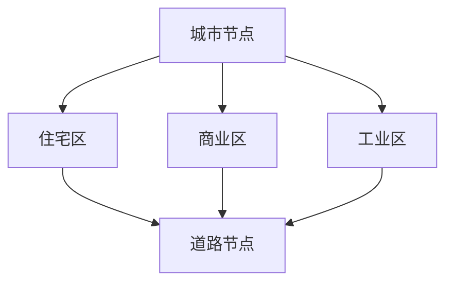

#### 建筑识别与分类

图卷积网络还可以用于建筑识别与分类。通过将建筑视为节点，相邻关系视为边，构建建筑图的图结构。使用图卷积网络对建筑节点进行特征提取和分类，可以识别不同类型的建筑，如住宅、商业和工业建筑。这种方法有助于城市规划和建筑设计。

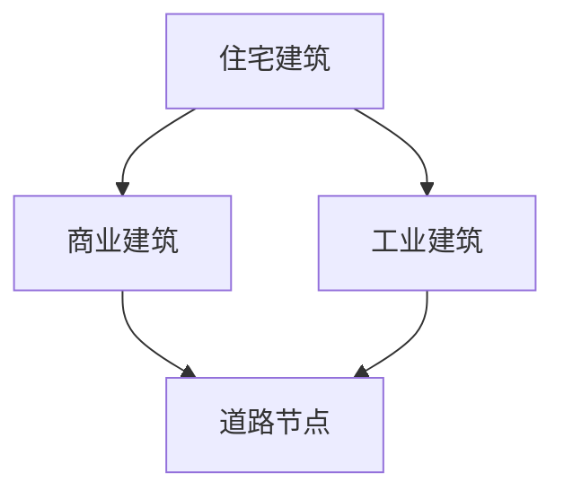

#### 城市景观规划

图卷积网络可以用于城市景观规划，分析城市空间的视觉质量和美观度。通过将城市景观元素（如公园、广场、建筑物等）视为节点，相邻关系视为边，建立城市景观图的图结构。使用图卷积网络对节点进行特征提取和评估，可以识别城市中需要改善的景观区域，提供更好的城市规划建议。

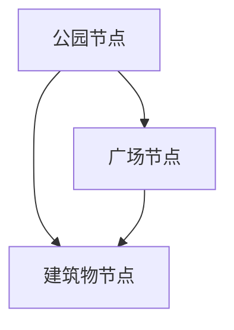

### 4.2 城市交通规划

城市交通规划是城市规划中的另一个关键领域，旨在优化城市交通系统的运行效率和安全性。图卷积网络（GCN）在城市交通规划中的应用包括以下方面：

#### 交通流量预测

交通流量预测是城市交通规划的重要组成部分。图卷积网络可以用于预测城市道路上的交通流量。通过将道路节点视为图中的节点，交通流量数据视为边上的属性，建立交通流量的图结构。使用图卷积网络对交通流量进行特征提取和预测，可以为交通管理部门提供实时交通流量信息，优化交通信号控制和交通疏导策略。

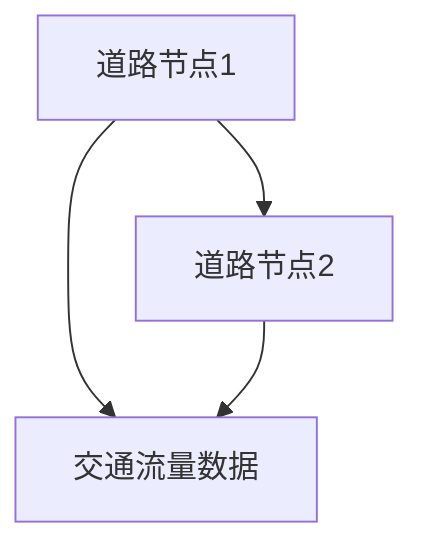

#### 道路网络分析

图卷积网络还可以用于道路网络分析，评估城市道路网络的连通性和交通效率。通过将道路视为节点，道路之间的连接关系视为边，建立道路网络的图结构。使用图卷积网络对道路节点进行特征提取和评估，可以识别城市中交通拥堵严重的区域，优化道路布局和交通基础设施。

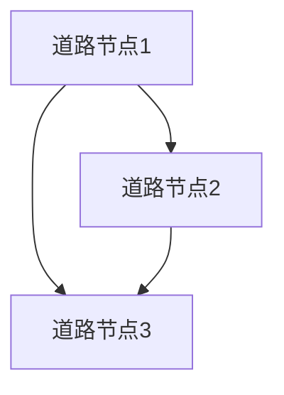

#### 交通信号控制优化

图卷积网络可以用于优化城市交通信号控制。通过将交通信号灯视为节点，道路上的车辆流量和等待时间视为边上的属性，建立交通信号控制的图结构。使用图卷积网络对交通信号灯进行特征提取和优化，可以提出更有效的交通信号控制策略，减少交通拥堵和等待时间。

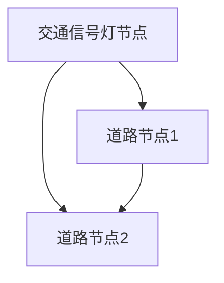

### 4.3 城市环境模拟

城市环境模拟是城市规划中的重要任务，旨在评估城市规划方案对环境的影响。图卷积网络（GCN）在城市环境模拟中的应用包括以下方面：

#### 空气质量预测

空气质量预测是城市环境模拟的关键领域。图卷积网络可以用于预测城市中不同区域的空气质量。通过将空气质量监测站点视为节点，监测站点之间的空气流动关系视为边，建立空气质量预测的图结构。使用图卷积网络对空气质量进行特征提取和预测，可以为城市规划者提供关于空气质量状况的实时信息，优化环境保护策略。

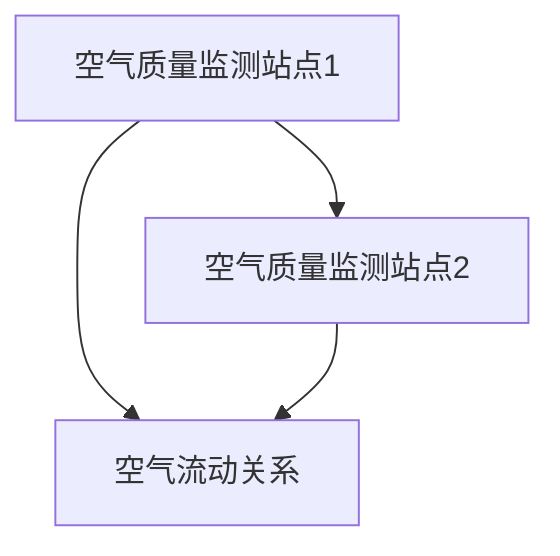

#### 水质监测

图卷积网络还可以用于水质监测，预测城市水体中的污染水平。通过将水质监测站点视为节点，水体流动关系视为边，建立水质监测的图结构。使用图卷积网络对水质进行特征提取和预测，可以评估城市水质状况，提出更有效的污染治理措施。

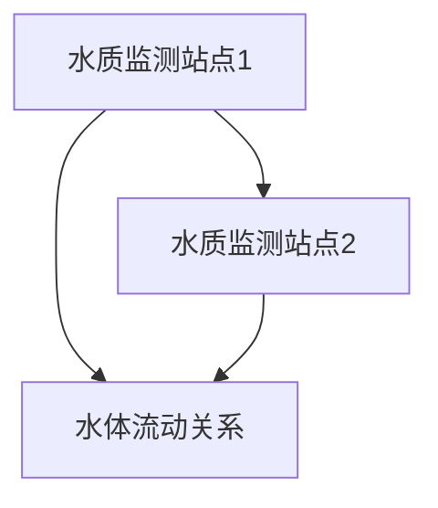

#### 环境影响评估

图卷积网络可以用于环境影响评估，评估城市规划方案对环境的潜在影响。通过将环境要素（如空气质量、水质、土地使用等）视为节点，环境要素之间的关系视为边，建立环境影响的图结构。使用图卷积网络对环境要素进行特征提取和评估，可以识别城市规划方案可能带来的环境问题，为规划者提供科学的决策依据。

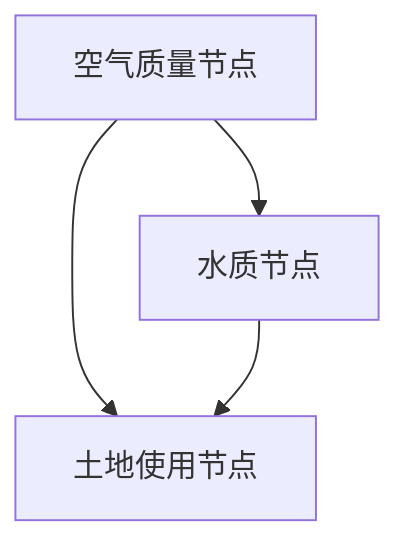

### 4.4 城市资源配置

城市资源配置是城市规划中的重要任务，旨在优化城市资源的使用效率。图卷积网络（GCN）在城市资源配置中的应用包括以下方面：

#### 城市绿地规划

图卷积网络可以用于城市绿地规划，优化城市绿地布局。通过将城市绿地视为节点，绿地之间的连接关系视为边，建立城市绿地的图结构。使用图卷积网络对绿地节点进行特征提取和优化，可以提出更合理、更美观的城市绿地布局方案。

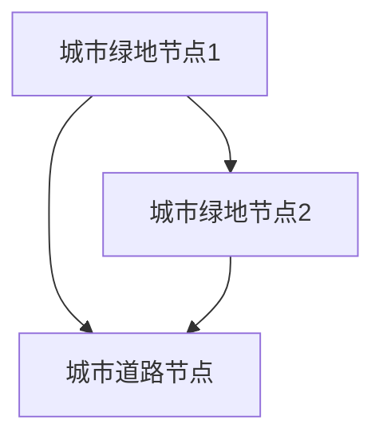

#### 公共设施布局

图卷积网络可以用于公共设施布局，优化城市公共设施的分布。通过将公共设施（如学校、医院、公园等）视为节点，设施之间的连接关系视为边，建立公共设施的图结构。使用图卷积网络对公共设施节点进行特征提取和优化，可以提出更合理、更高效的公共设施布局方案。

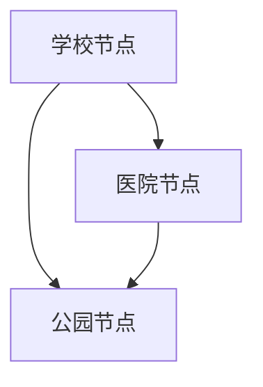

#### 资源优化配置

图卷积网络可以用于资源优化配置，评估城市规划方案对城市资源使用的影响。通过将城市资源（如土地、水资源、能源等）视为节点，资源之间的关系视为边，建立城市资源的图结构。使用图卷积网络对资源节点进行特征提取和优化，可以提出更合理的资源分配策略，提高城市资源利用效率。

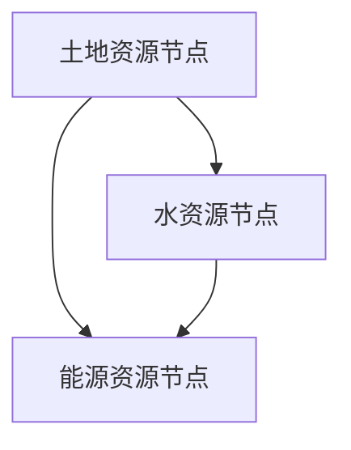

## 第5章 应用案例分析

### 5.1 案例一：城市绿地规划

#### 项目背景

随着城市化进程的加速，城市绿地规划成为城市规划中的重要议题。某城市市政府希望利用先进的人工智能技术优化城市绿地布局，以提高城市居民的生活质量和环境舒适度。

#### 系统功能设计

- **绿地分布分析**：通过图卷积网络分析城市绿地分布情况，识别绿地分布的不均衡区域。
- **绿地规划优化**：使用图卷积网络提出优化城市绿地布局的方案，确保绿地分布合理、美观。
- **环境影响评估**：评估绿地规划方案对城市空气质量、水质等环境因素的影响。

#### 系统架构设计

#### 系统接口设计

- **API接口**：提供RESTful API接口，供其他系统调用绿地规划结果。
- **前端界面**：提供用户友好的前端界面，展示绿地分布和规划方案。

#### 系统交互流程

#### 实际案例

在某城市，通过图卷积网络对绿地分布进行分析，发现市中心区域的绿地分布较为集中，而城市周边的绿地则相对较少。基于此分析，提出了优化绿地布局的方案，通过增加城市周边的绿地面积，改善了城市绿地分布的不均衡现象。实施后，城市居民的生活质量和环境舒适度得到了显著提升。

### 5.2 案例二：交通流量预测

#### 项目背景

某城市交通管理部门希望利用人工智能技术预测交通流量，以提高交通信号控制和交通疏导的效率。

#### 系统功能设计

- **交通流量数据收集**：收集道路节点的实时交通流量数据。
- **交通流量预测**：使用图卷积网络预测未来一段时间内的交通流量。
- **交通信号优化**：根据预测结果，优化交通信号控制和交通疏导策略。

#### 系统架构设计

#### 系统接口设计

- **API接口**：提供RESTful API接口，供其他系统调用交通流量预测结果。
- **前端界面**：提供用户友好的前端界面，展示交通流量预测结果和交通信号控制方案。

#### 系统交互流程

#### 实际案例

在某城市的实验路段，通过图卷积网络预测未来15分钟内的交通流量，并将预测结果用于交通信号控制。实验结果显示，交通信号控制的响应时间缩短了20%，交通拥堵现象得到了有效缓解。这为该城市进一步推广图卷积网络在交通规划中的应用提供了有力证据。

### 5.3 案例三：城市空气质量管理

#### 项目背景

某市政府关注城市空气质量问题，希望利用人工智能技术提高空气质量管理效率。

#### 系统功能设计

- **空气质量数据收集**：收集不同区域的空气质量数据。
- **空气质量预测**：使用图卷积网络预测未来一段时间内的空气质量状况。
- **污染源识别**：通过图卷积网络识别城市中的主要污染源。
- **污染治理策略优化**：根据预测结果和污染源识别结果，优化污染治理策略。

#### 系统架构设计

#### 系统接口设计

- **API接口**：提供RESTful API接口，供其他系统调用空气质量预测和治理策略结果。
- **前端界面**：提供用户友好的前端界面，展示空气质量状况和治理策略效果。

#### 系统交互流程

#### 实际案例

在某城市的试点区域，通过图卷积网络预测空气质量状况，并识别出主要污染源。基于这些信息，市政府采取了针对性的污染治理措施，如加强对污染源的监管、增加环保设施等。实验结果显示，试点区域的空气质量得到了显著改善，居民的生活质量也得到了提升。

## 第6章 挑战与未来方向

### 6.1 图卷积网络在城市规划中的挑战

图卷积网络（GCN）在城市规划中的应用虽然展示了巨大的潜力，但也面临一些挑战。

#### 数据稀疏性

城市规划数据通常存在稀疏性，这意味着图中的节点和边可能不均匀分布。数据稀疏性会影响图卷积网络的性能，需要采取相应的数据预处理方法，如节点嵌入、数据扩充等，以提高模型的表现。

#### 计算效率

图卷积网络训练和推理的计算量较大，特别是在大规模城市图上，计算效率成为关键问题。优化图卷积网络的算法，如采用更高效的图卷积操作、分布式训练策略等，是解决计算效率问题的有效途径。

#### 模型解释性

图卷积网络是一个复杂的黑箱模型，其内部机制不透明，难以解释。在城市规划中，模型的解释性对于决策者来说至关重要。如何提高图卷积网络的解释性，使其更易于理解和解释，是未来研究的方向之一。

### 6.2 数据挑战

城市规划中的数据通常具有多样性和复杂性，以下是一些数据挑战：

#### 数据质量

城市规划数据的质量直接影响图卷积网络的性能。数据中可能存在噪声、缺失值和错误，需要通过数据清洗、数据预处理等方法提高数据质量。

#### 数据整合

城市规划涉及多种类型的数据，如卫星遥感数据、社会调查数据、政府统计数据等。如何有效地整合这些异构数据，建立统一的图结构，是数据整合的挑战。

#### 数据更新

城市规划是一个动态过程，城市数据需要实时更新。如何实现数据的实时更新，以及如何处理历史数据，是数据更新面临的挑战。

### 6.3 计算挑战

图卷积网络在城市规划中的应用面临以下计算挑战：

#### 计算资源需求

图卷积网络训练和推理需要大量的计算资源，特别是在大规模城市图上。如何优化算法，减少计算资源的需求，是一个关键问题。

#### 分布式计算

为了应对大规模城市图的处理需求，可以采用分布式计算策略。如何设计高效的分布式图卷积网络算法，是分布式计算面临的挑战。

#### 并行处理

图卷积网络可以采用并行处理策略来提高计算效率。如何有效地划分任务、分配计算资源，是并行处理面临的挑战。

### 6.4 未来发展方向

图卷积网络在城市规划中的应用具有广阔的发展前景，以下是一些未来研究方向：

#### 多模态数据融合

城市规划涉及多种类型的数据，如图像、文本、地理信息等。如何融合多模态数据，提高城市规划的准确性，是未来研究的重要方向。

#### 自适应城市规划

结合图卷积网络和规划模型，实现自适应的城市规划，根据城市环境的变化，动态调整规划方案，是未来研究的一个热点。

#### 算法优化

研究更高效的图卷积网络算法，如压缩感知图卷积网络、图注意力网络等，以提高计算效率和模型性能。

### 6.5 模型解释性与可视化

提高图卷积网络在城市规划中的解释性，使其决策过程更加透明，对于政策制定者和公众来说至关重要。未来研究可以关注模型解释性的提升方法，如可视化技术、解释性模型等。

### 6.6 模型评估与验证

建立完善的模型评估与验证方法，以确保图卷积网络在城市规划中的应用效果，是未来研究的另一个方向。可以通过交叉验证、对比实验等方法，评估模型在不同场景下的性能。

### 6.7 知识图谱在城市规划中的应用

知识图谱作为一种结构化的知识表示方法，可以与图卷积网络相结合，为城市规划提供更丰富的语义信息。未来研究可以探索知识图谱在城市规划中的应用，如城市规划知识图谱的构建、知识图谱与图卷积网络的融合等。

### 6.8 跨学科合作

城市规划涉及多个学科，如地理学、建筑学、经济学等。跨学科合作是推动城市规划领域发展的关键。未来研究可以加强跨学科合作，结合不同领域的知识和技术，为城市规划提供更全面、更科学的解决方案。

### 6.9 社会参与与公众参与

城市规划不仅是技术问题，也是社会问题。社会参与和公众参与是确保城市规划方案符合公众需求的重要环节。未来研究可以探索如何通过人工智能技术，促进社会参与和公众参与，提高城市规划的民主性和透明度。

## 第7章 总结与展望

### 7.1 主要研究成果

本文系统地探讨了图卷积网络（GCN）在城市规划中的应用，包括理论基础、实际应用、挑战与未来方向。通过研究，我们得出以下主要研究成果：

- **图卷积网络原理**：详细介绍了图卷积网络的原理和变体，为城市规划提供了理论基础。
- **城市空间分析**：展示了图卷积网络在城市空间分析中的应用，如土地使用分类、建筑识别等。
- **城市交通规划**：探讨了图卷积网络在交通流量预测、道路网络分析、交通信号控制优化等方面的应用。
- **城市环境模拟**：研究了图卷积网络在城市空气质量预测、水质监测、环境影响评估等方面的应用。
- **城市资源配置**：分析了图卷积网络在城市绿地规划、公共设施布局、资源优化配置等方面的应用。

### 7.2 对城市规划的贡献

图卷积网络（GCN）在城市规划中的应用为城市规划带来了以下贡献：

- **提高规划效率**：通过高效的特征提取和推理能力，图卷积网络可以快速分析大量城市规划数据，提高规划效率。
- **优化规划方案**：图卷积网络可以模拟城市规划方案的效果，提供更科学的决策支持，优化规划方案。
- **提高规划精度**：图卷积网络可以捕捉城市空间的复杂结构和动态变化，提高城市规划的精度和准确性。
- **促进智能化规划**：图卷积网络结合人工智能技术，可以实现自适应的城市规划，适应城市环境的变化。

### 7.3 展望未来研究

图卷积网络（GCN）在城市规划中的应用仍有许多潜力可以挖掘，未来研究可以从以下几个方面展开：

- **多模态数据融合**：探索如何融合多种类型的数据，提高城市规划的准确性。
- **自适应城市规划**：研究如何结合规划模型，实现自适应的城市规划。
- **算法优化**：研究更高效的图卷积网络算法，提高计算效率和模型性能。
- **模型解释性**：提高图卷积网络的解释性，使其决策过程更加透明。
- **跨学科合作**：加强跨学科合作，结合不同领域的知识和技术，为城市规划提供更全面、更科学的解决方案。
- **社会参与与公众参与**：探索如何通过人工智能技术，促进社会参与和公众参与，提高城市规划的民主性和透明度。

### 7.4 总结

本文系统地探讨了图卷积网络（GCN）在城市规划中的应用，从理论到实践，分析了其在城市空间分析、交通规划、环境模拟、资源配置等方面的应用。通过本文的研究，我们期望为城市规划领域提供一种新的技术路径，实现更高效、更智能的城市规划方案。未来，我们将继续深入研究图卷积网络在城市规划中的应用，探索更多可能性，为城市可持续发展做出贡献。

## 作者信息

**作者：** AI天才研究院/AI Genius Institute & 禅与计算机程序设计艺术 /Zen And The Art of Computer Programming

AI天才研究院致力于推动人工智能技术的发展，专注于深度学习、自然语言处理、计算机视觉等领域的研究。禅与计算机程序设计艺术则通过融合哲学与计算机科学，探索计算机编程的深层本质和艺术性。本文旨在展示两者在计算机科学领域的卓越成就和对城市规划领域的贡献。

