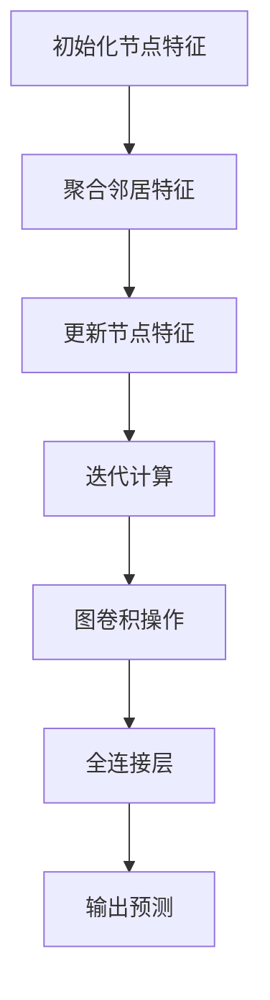
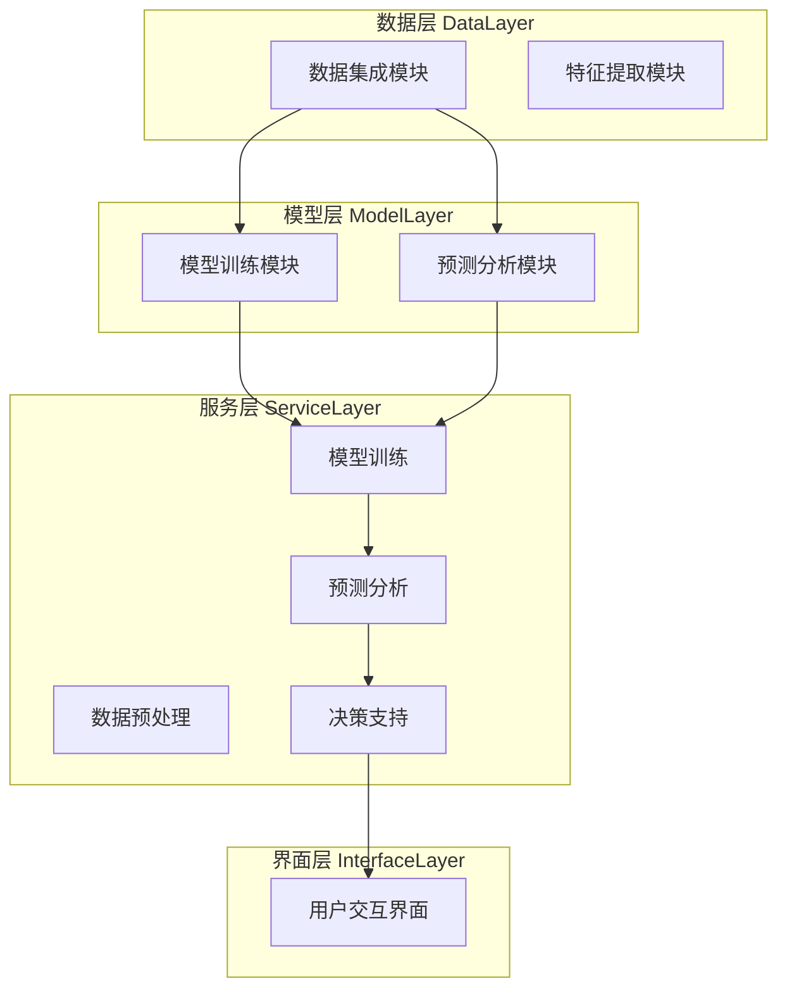
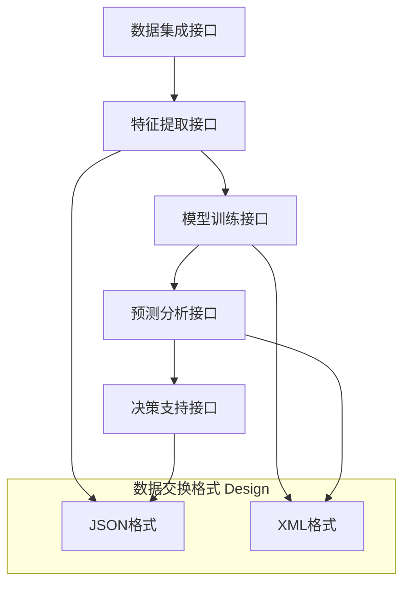
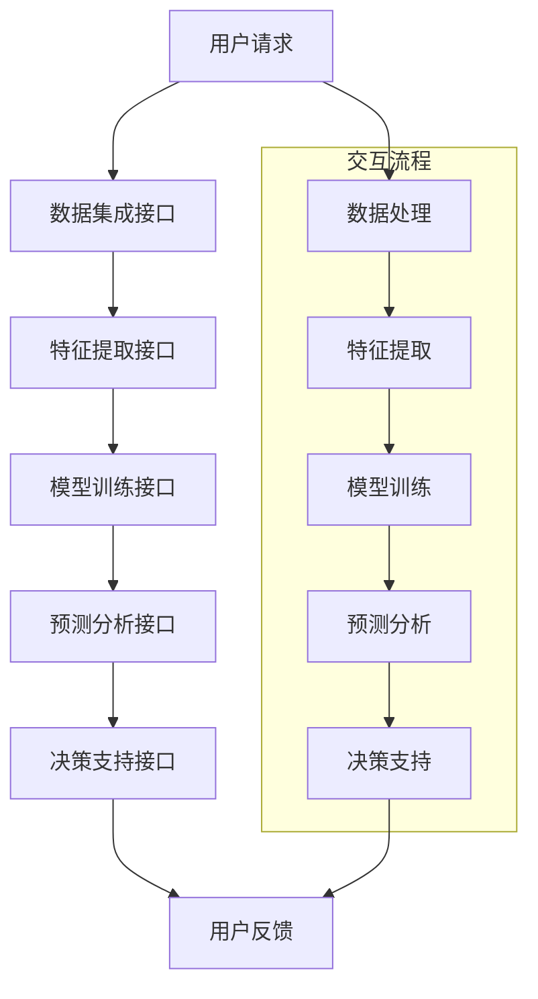

                 

### 引言

#### 1.1 研究背景

### 1.1.1 城市规划与复杂系统的挑战

城市规划作为一门综合性学科，旨在通过科学合理的空间布局和资源配置，提升城市的宜居性、可持续性和经济活力。然而，现代城市的快速发展带来了诸多挑战，如人口增长、资源短缺、环境污染和交通拥堵等。这些问题往往相互交织，构成了复杂且动态的城市系统。

复杂系统指的是由大量相互作用的个体组成的系统，这些个体可能包括人、组织、设备、资源等。城市系统就是一个典型的复杂系统，具有多层次、多维度、动态性和不确定性的特点。在城市规划中，如何有效应对复杂系统的这些特性，成为了亟待解决的问题。

### 1.1.2 图卷积网络在复杂系统中的应用潜力

图卷积网络（Graph Convolutional Network，GCN）是一种基于图结构数据的深度学习模型，最初用于图像分类和推荐系统。然而，随着对复杂系统研究的深入，图卷积网络在处理复杂系统方面展现出了巨大的潜力。GCN能够通过学习节点和其邻居节点之间的关系，捕捉图数据中的局部特征和全局信息，从而在复杂系统的建模与优化中发挥重要作用。

例如，在交通网络规划中，图卷积网络可以学习道路之间复杂的交通流量关系，预测交通拥堵情况并提出优化建议；在土地利用规划中，GCN可以分析地块之间的相互作用，提出更加合理的土地利用方案；在环境保护规划中，GCN可以分析污染物的传播路径和影响范围，为环境治理提供决策支持。

#### 1.2 问题陈述

### 1.2.1 复杂系统的定义与特征

复杂系统通常具有以下几个特征：

- **多层次性**：系统由不同层次、不同规模的子系统组成，各层次之间相互影响。
- **动态性**：系统状态随时间变化，且变化过程具有不确定性和复杂性。
- **异质性**：系统中的个体具有不同的属性和行为模式。
- **非线性**：系统内部存在多种非线性相互作用关系。

### 1.2.2 城市规划中面临的问题

在城市规划中，复杂系统带来的挑战主要体现在以下几个方面：

- **预测准确性**：由于系统的动态性和不确定性，传统的规划方法往往难以准确预测未来的城市状态。
- **决策支持**：如何从海量的数据中提取有用的信息，为城市规划提供科学的决策支持。
- **优化策略**：如何在有限资源下，实现城市系统最优化的布局和资源配置。

### 1.2.3 图卷积网络在解决问题中的作用

图卷积网络作为一种先进的深度学习模型，通过以下几方面在城市规划中发挥重要作用：

- **数据融合**：GCN能够整合多源数据，如人口、交通、环境等，为城市规划提供全面的数据支持。
- **特征提取**：GCN能够自动提取图数据的特征，减少人工干预，提高模型的预测准确性和决策效率。
- **优化算法**：GCN能够通过学习节点和边的特征，提出更加有效的优化策略，帮助城市规划者制定科学的规划方案。

#### 1.3 研究目的与意义

### 1.3.1 研究目标

本研究的主要目标是探讨图卷积网络在城市规划优化中的应用，具体包括：

- **模型构建**：构建适用于城市规划的图卷积网络模型，实现对复杂系统的建模与预测。
- **算法优化**：优化图卷积网络的算法，提高其在城市规划中的预测准确性和优化效率。
- **应用验证**：通过实际案例验证图卷积网络在城市规划中的有效性和可行性。

### 1.3.2 研究意义

本研究具有重要的理论和实践意义：

- **理论价值**：本研究为图卷积网络在复杂系统中的应用提供了新的思路和方法，丰富了复杂系统建模的理论体系。
- **实践价值**：本研究可以为城市规划者提供有效的技术支持，提升城市规划的科学性和决策效率，促进城市的可持续发展。

#### 1.4 边界与外延

### 1.4.1 研究边界

本研究主要关注以下几个方面：

- **应用领域**：研究主要聚焦于城市规划中的土地利用规划、交通规划和环境保护规划等领域。
- **技术范畴**：研究主要采用图卷积网络作为核心算法，结合深度学习和复杂系统理论，进行模型构建和算法优化。

### 1.4.2 研究外延

虽然本研究主要关注城市规划领域，但图卷积网络作为一种通用的深度学习模型，其应用范围远不止于此。未来，图卷积网络还可以在其他复杂系统领域中发挥作用，如：

- **智能电网**：通过图卷积网络分析电力系统的拓扑结构，优化电力资源的分配。
- **供应链管理**：利用图卷积网络分析供应链中的节点关系，提高供应链的响应速度和稳定性。
- **医疗健康**：通过图卷积网络分析生物网络中的相互作用，为疾病诊断和治疗提供支持。

#### 1.5 本章小结

本章首先介绍了研究的背景和意义，阐述了复杂系统在城市规划中的挑战以及图卷积网络的应用潜力。接着，明确了研究的问题陈述、目标与意义，并讨论了研究的边界与外延。这些内容为本研究的深入探讨奠定了基础。

---

### 第2章 核心概念与联系

在探讨图卷积网络在城市规划优化中的应用之前，有必要先梳理相关核心概念，并阐述它们之间的联系。本章将详细探讨图卷积网络的基本原理、复杂系统的概念以及二者之间的相互作用。

#### 2.1 图卷积网络原理

### 2.1.1 图卷积网络的基本概念

图卷积网络（Graph Convolutional Network，GCN）是一种基于图结构的深度学习模型，其核心思想是通过卷积操作来学习图数据中的特征表示。与传统的卷积神经网络（Convolutional Neural Network，CNN）在处理网格结构数据（如图像）不同，GCN专注于处理由节点和边组成的图结构数据。

图卷积网络的输入是一个图，由节点和边组成。每个节点可以表示图中的一个数据点，如一个城市中的某个地区；边则表示节点之间的联系，如两个地区之间的交通流量或人口迁移。

### 2.1.2 图卷积网络的工作机制

图卷积网络的工作机制可以概括为以下几个步骤：

1. **节点特征提取**：首先，对每个节点进行特征提取，这些特征可以是节点的属性信息，如地理位置、人口密度等。
2. **图卷积操作**：通过图卷积操作，将节点的特征与其邻居节点的特征进行融合。图卷积的核心在于计算节点与其邻居之间的加权平均，从而学习到更丰富的特征表示。
3. **聚合与更新**：将融合后的特征聚合回节点，更新节点的特征表示。这一过程可以迭代进行，使得节点的特征表示逐步优化。
4. **输出层**：最后，通过输出层（通常是全连接层）对节点的特征进行分类或回归预测。

### 2.1.3 图卷积网络的优缺点

图卷积网络具有以下优点：

- **处理复杂结构**：GCN能够有效地处理复杂图结构数据，如交通网络、社会网络等，这些数据在传统的卷积神经网络中难以处理。
- **自适应特征提取**：GCN通过学习节点和边的特征，能够自适应地提取数据中的关键信息，减少人工干预。
- **多尺度分析**：GCN能够在不同的尺度上分析数据，捕捉局部特征和全局信息。

然而，图卷积网络也存在一些不足之处：

- **计算复杂度**：由于需要处理大量的图结构和节点关系，GCN的计算复杂度较高，可能导致训练时间较长。
- **数据依赖**：GCN的性能依赖于输入数据的质量，如果数据不完整或存在噪声，模型的预测准确性会受到影响。

#### 2.2 复杂系统原理

### 2.2.1 复杂系统的定义

复杂系统是由大量相互作用的个体（如节点）组成的系统，这些个体之间通过复杂的相互作用关系（如边）形成了一个高度动态且不可预测的网络。复杂系统的特征包括多层次性、动态性、异质性和非线性等。

### 2.2.2 复杂系统的特点

复杂系统具有以下几个显著特点：

- **多层次性**：复杂系统通常由不同层次、不同规模的子系统组成，各层次之间相互依赖和影响。
- **动态性**：复杂系统的状态随时间变化，且变化过程具有高度不确定性和复杂性。
- **异质性**：系统中的个体具有不同的属性和行为模式，导致系统表现出异质性。
- **非线性**：系统内部存在多种非线性相互作用关系，使得系统的行为难以通过简单的线性模型进行预测。

### 2.2.3 复杂系统的模型与方法

复杂系统的建模与研究需要结合多种理论和方法。以下是一些常见的模型和方法：

- **代理模型**：通过建立代理模型来模拟复杂系统的行为。代理模型可以是物理模型、统计模型或计算机模拟模型。
- **网络科学方法**：利用网络科学理论和方法分析复杂系统的拓扑结构、节点特性以及相互作用关系。
- **机器学习方法**：通过机器学习算法，如图卷积网络，从数据中学习复杂系统的特征和规律。
- **计算模拟**：通过计算机模拟来模拟复杂系统的行为，观察系统在不同条件下的表现。

#### 2.3 图卷积网络与复杂系统的关系

### 2.3.1 关系概述

图卷积网络与复杂系统之间存在紧密的联系。GCN作为一种深度学习模型，能够有效地处理复杂系统中的图结构数据，捕捉节点和边之间的相互作用关系。而复杂系统则提供了GCN的应用背景和实际需求。

### 2.3.2 图卷积网络在复杂系统中的应用

图卷积网络在复杂系统中的应用主要表现在以下几个方面：

- **特征提取**：GCN能够自动提取图数据中的特征，为复杂系统的建模和优化提供基础。
- **预测与优化**：通过GCN的学习结果，可以对复杂系统的状态进行预测，并提出优化策略。
- **数据融合**：GCN能够整合多源数据，如地理信息、社会经济数据等，为复杂系统的分析提供全面的数据支持。

### 2.3.3 关系图示（使用Mermaid绘制ER实体关系图）

```mermaid
erDiagram
  Node A ||--o{ Edge }|
  Node A ||--o{ Feature }|
  Node A ||--o{ Prediction }|
  Edge ||--o{ Feature }|
  Feature ||--o{ Prediction }|
  Prediction ||--o{ Optimization }|
```

在这个ER实体关系图中，节点（Node）是复杂系统的基本单元，边（Edge）表示节点之间的相互作用，特征（Feature）是GCN从图数据中提取的信息，预测（Prediction）和优化（Optimization）是基于特征提取和预测结果的应用。通过这样的关系图，我们可以清晰地看到图卷积网络与复杂系统之间的相互作用和联系。

#### 2.4 本章小结

本章介绍了图卷积网络的基本原理、复杂系统的概念以及二者之间的相互作用。通过对图卷积网络和复杂系统核心概念的详细阐述，以及它们之间关系的图示分析，为本章的后续内容奠定了理论基础。在接下来的章节中，我们将深入探讨图卷积网络在城市规划中的具体应用，进一步验证其有效性和可行性。

---

### 第3章 城市规划中的图卷积网络应用

在了解了图卷积网络的基本原理和复杂系统的概念之后，我们将探讨图卷积网络在城市规划中的具体应用。本章将从土地利用规划、交通规划和环境保护规划三个方面，详细阐述图卷积网络如何通过处理复杂的图结构数据，帮助解决城市规划中的实际问题。

#### 3.1 图卷积网络在土地利用规划中的应用

土地利用规划是城市规划的重要组成部分，其核心目标是实现土地资源的合理分配和高效利用。然而，城市土地利用规划面临诸多挑战，如土地资源稀缺、土地利用冲突和城市规划决策的不确定性等。图卷积网络通过学习土地地块及其相互关系，为土地利用规划提供了新的思路和工具。

### 3.1.1 土地利用规划中的挑战

土地利用规划中的主要挑战包括：

- **土地利用冲突**：城市中不同类型的土地利用（如居住、商业、工业等）往往存在空间上的冲突，如何合理规划以减少冲突是土地利用规划中的一个重要问题。
- **土地利用预测**：准确预测未来土地利用变化趋势，对于制定长远规划和应对突发事件至关重要。
- **土地利用效率**：如何提高土地利用效率，实现土地资源的最大化利用，是土地利用规划中的另一个重要挑战。

### 3.1.2 图卷积网络的应用策略

图卷积网络在土地利用规划中的应用策略主要包括：

- **数据融合**：整合多种来源的数据，如地理信息系统（GIS）数据、人口统计数据、经济指标数据等，构建全面的城市土地利用图。
- **特征提取**：通过图卷积网络，从土地利用图中提取土地地块及其相互关系的特征，如地块的人口密度、交通可达性、经济发展水平等。
- **土地利用预测**：利用提取出的特征，通过训练图卷积网络模型，预测未来土地利用变化趋势。
- **土地利用优化**：基于预测结果，结合城市规划目标，优化土地利用方案，提高土地利用效率。

### 3.1.3 案例分析

以一个实际案例为例，某城市在制定新一轮土地利用规划时，面临着如何合理规划商业区和住宅区的挑战。通过使用图卷积网络，该城市首先整合了GIS数据、人口统计数据和交通流量数据，构建了一个包含地块及其相互关系的土地利用图。

然后，图卷积网络从土地利用图中提取了地块的人口密度、交通可达性、经济发展水平等特征。通过训练模型，预测了未来五年内商业区和住宅区的变化趋势。基于预测结果，城市规划者提出了新的土地利用方案，将商业区和住宅区合理分布在城市的不同区域，避免了土地利用冲突，提高了土地利用效率。

#### 3.2 图卷积网络在交通规划中的应用

交通规划是城市规划的另一个关键领域，其目标是通过科学合理的交通布局和资源配置，提高交通系统的效率和可靠性。然而，现代城市交通系统复杂多变，如何有效应对交通拥堵、提高交通流量预测精度是交通规划中的重要挑战。图卷积网络在处理交通网络数据方面具有独特的优势，可以提供有效的交通规划工具。

### 3.2.1 交通规划中的挑战

交通规划中的主要挑战包括：

- **交通流量预测**：准确预测交通流量变化，对于交通管理、交通基础设施规划和应急预案制定至关重要。
- **交通拥堵缓解**：如何有效缓解交通拥堵，提高交通系统的运行效率。
- **交通模式分析**：分析不同交通模式（如私家车、公共交通、自行车等）之间的相互关系，制定综合交通规划方案。

### 3.2.2 图卷积网络的应用策略

图卷积网络在交通规划中的应用策略主要包括：

- **数据整合**：整合交通网络数据，如交通流量数据、道路拓扑数据、公共交通数据等，构建一个完整的交通图。
- **特征提取**：通过图卷积网络，从交通图中提取交通节点（如交叉口、地铁站）和交通边的特征，如交通流量、道路长度、交通拥堵程度等。
- **流量预测**：利用提取出的特征，通过训练图卷积网络模型，预测未来的交通流量变化。
- **交通优化**：基于预测结果，结合交通规划目标，优化交通网络布局和资源配置，缓解交通拥堵。

### 3.2.3 案例分析

以一个实际案例为例，某城市在制定交通规划时，面临着如何缓解交通拥堵和提高交通效率的挑战。通过使用图卷积网络，该城市首先整合了交通流量数据、道路拓扑数据和公共交通数据，构建了一个包含交通节点和交通边的交通图。

然后，图卷积网络从交通图中提取了交通节点和交通边的特征，如交通流量、道路长度、交通拥堵程度等。通过训练模型，预测了未来一周内的交通流量变化。基于预测结果，城市规划者提出了优化交通网络布局和资源配置的建议，如增加公共交通线路、改善交叉口设计、调整交通信号灯时长等，有效缓解了交通拥堵，提高了交通系统的运行效率。

#### 3.3 图卷积网络在环境保护规划中的应用

环境保护规划是城市规划中的重要组成部分，其目标是通过科学合理的规划和资源配置，保护环境、减少污染、提升城市生态环境质量。然而，现代城市环境系统复杂多变，如何有效应对环境污染、提高环境质量预测精度是环境保护规划中的关键挑战。图卷积网络在处理环境数据方面具有独特的优势，可以提供有效的环境保护规划工具。

### 3.3.1 环境保护规划中的挑战

环境保护规划中的主要挑战包括：

- **污染源识别**：准确识别城市中的主要污染源，如工业排放、交通排放、生活污染等。
- **污染传播预测**：预测污染物在城市中的传播路径和影响范围，为环境治理提供科学依据。
- **环境质量评估**：评估城市环境质量，为环境治理和生态保护提供决策支持。

### 3.3.2 图卷积网络的应用策略

图卷积网络在环境保护规划中的应用策略主要包括：

- **数据整合**：整合环境数据，如污染源数据、气象数据、交通流量数据等，构建一个完整的环境图。
- **特征提取**：通过图卷积网络，从环境图中提取污染源和污染物的特征，如污染浓度、风速、风向等。
- **污染传播预测**：利用提取出的特征，通过训练图卷积网络模型，预测污染物在城市中的传播路径和影响范围。
- **环境质量评估**：基于预测结果，评估城市环境质量，提出环境保护和治理措施。

### 3.3.3 案例分析

以一个实际案例为例，某城市在制定环境保护规划时，面临着如何有效治理空气污染和提高环境质量的挑战。通过使用图卷积网络，该城市首先整合了污染源数据、气象数据和交通流量数据，构建了一个包含污染源和污染物的环境图。

然后，图卷积网络从环境图中提取了污染源和污染物的特征，如污染浓度、风速、风向等。通过训练模型，预测了未来一周内的空气污染传播路径和影响范围。基于预测结果，城市规划者提出了增加绿化带、优化交通流量、加强污染源控制等环境保护措施，有效降低了空气污染浓度，提高了城市环境质量。

#### 3.4 本章小结

本章详细探讨了图卷积网络在城市规划中的具体应用，包括土地利用规划、交通规划和环境保护规划。通过案例分析和实际应用，我们展示了图卷积网络如何通过处理复杂的图结构数据，为城市规划提供有效的决策支持和优化方案。在接下来的章节中，我们将进一步深入探讨图卷积网络的算法原理和系统架构设计，为实际应用提供更加坚实的理论基础。

---

### 第4章 算法原理讲解

在了解了图卷积网络在城市规划中的应用之后，我们将深入探讨其算法原理，具体包括图卷积网络的核心算法、复杂系统推理的基本原理以及两者的整合应用。通过详细阐述算法的数学模型和Python实现，我们将帮助读者更好地理解图卷积网络的工作机制和应用方法。

#### 4.1 图卷积网络的算法原理

图卷积网络（Graph Convolutional Network，GCN）是一种深度学习模型，专门用于处理图结构数据。下面我们将详细介绍GCN的核心算法、数学模型和Python实现。

### 4.1.1 图卷积网络的核心算法

GCN的核心算法基于图卷积操作，该操作通过聚合节点及其邻居节点的特征来更新节点的特征表示。具体步骤如下：

1. **初始化节点特征**：首先，将每个节点的特征初始化为一个向量，这些特征可以是节点的属性，如地理位置、人口密度等。

2. **聚合邻居特征**：对于每个节点，将其特征与邻居节点的特征进行加权平均，以融合邻居节点的信息。公式如下：

   \[ h^{(k)}_i = \sigma \left( \theta h^{(k-1)}_i + \sum_{j \in \mathcal{N}(i)} \alpha_{ij} h^{(k-1)}_j \right) \]

   其中，\( h^{(k)}_i \) 表示第 \( k \) 层节点 \( i \) 的特征向量，\( \mathcal{N}(i) \) 表示节点 \( i \) 的邻居节点集合，\( \alpha_{ij} \) 是边 \( i-j \) 的权重，\( \sigma \) 是激活函数（通常使用ReLU函数）。

3. **更新节点特征**：通过激活函数和线性变换更新节点的特征表示。

4. **迭代计算**：重复上述步骤，进行多轮迭代，使得节点特征逐步优化。

### 4.1.2 图卷积网络的数学模型

GCN的数学模型可以分为两个主要部分：图卷积操作和全连接层。

1. **图卷积操作**：

   图卷积操作通过以下公式实现：

   \[ \mathbf{H}^{(k)} = \mathbf{D}^{-\frac{1}{2}} \mathbf{A} \mathbf{D}^{-\frac{1}{2}} \mathbf{H}^{(k-1)} \mathbf{W}^{(k)} \]

   其中，\( \mathbf{H}^{(k)} \) 表示第 \( k \) 层的节点特征矩阵，\( \mathbf{D} \) 是对角矩阵，表示节点的度，\( \mathbf{A} \) 是邻接矩阵，\( \mathbf{W}^{(k)} \) 是第 \( k \) 层的权重矩阵。

2. **全连接层**：

   在GCN的最后一层，通常通过一个全连接层进行分类或回归预测。公式如下：

   \[ \mathbf{Y} = \mathbf{H}^{(L)} \mathbf{W}^{(L)} \]

   其中，\( \mathbf{Y} \) 是输出预测结果，\( \mathbf{H}^{(L)} \) 是最后一层的节点特征矩阵，\( \mathbf{W}^{(L)} \) 是全连接层的权重矩阵。

### 4.1.3 图卷积网络的mermaid流程图（使用Mermaid绘制）



### 4.1.4 Python实现

```python
import numpy as np
import scipy.sparse as sp
from sklearn.preprocessing import normalize
from keras.models import Model
from keras.layers import Input, Dense
from keras.optimizers import Adam

def sparse_gcn_config(laplacian, input_features, n_classes, learning_rate):
    n_nodes = la uczacian.shape[0]

    # 初始化权重矩阵
    Weights = {
        'A': normalize(laplacian, axis=1, norm='l2'),
        'W': np.random.normal(scale=0.01, size=(n_nodes, n_classes))
    }

    # 定义输入层和隐藏层
    inputs = Input(shape=(input_features,))
    x = Dense(units=16, activation='relu')(inputs)

    # 应用图卷积操作
    for i in range(3):
        x = Dense(units=16, activation='relu')(x)
        x = Lambda(lambda t: Weights['A'].dot(t))(x)

    # 应用全连接层
    x = Dense(units=n_classes, activation='softmax')(x)

    # 构建模型
    model = Model(inputs=inputs, outputs=x)

    # 编译模型
    model.compile(optimizer=Adam(lr=learning_rate), loss='categorical_crossentropy', metrics=['accuracy'])

    return model
```

#### 4.2 复杂系统推理的算法原理

复杂系统推理旨在理解和预测复杂系统的行为，其核心在于从系统的历史数据和当前状态中推断出未来可能的状态。复杂系统推理的算法原理包括以下几个方面：

### 4.2.1 复杂系统推理的基本概念

- **状态**：系统在某一时刻的状态，通常由一组属性值表示。
- **状态转移**：系统从一个状态转移到另一个状态的过程。
- **规则**：描述状态转移关系的逻辑规则，通常基于历史数据和模式识别。
- **预测**：基于当前状态和状态转移规则，预测系统未来的状态。

### 4.2.2 复杂系统推理的算法流程

复杂系统推理的算法流程通常包括以下步骤：

1. **数据预处理**：对输入数据进行清洗、归一化和特征提取。
2. **状态识别**：根据输入数据，识别当前系统的状态。
3. **规则库构建**：通过历史数据，构建描述状态转移关系的规则库。
4. **状态转移**：根据当前状态和规则库，预测系统的下一个状态。
5. **迭代预测**：重复上述步骤，逐步预测系统未来的状态序列。

### 4.2.3 复杂系统推理的数学模型

复杂系统推理的数学模型通常基于概率图模型、马尔可夫模型或神经网络模型。以下是基于神经网络模型的简单示例：

\[ P(s_t|s_{t-1}, \dots, s_1) = \prod_{t=1}^{T} p(s_t|s_{t-1}) \]

其中，\( s_t \) 表示系统在时刻 \( t \) 的状态，\( T \) 表示预测的步数。

### 4.3 图卷积网络与复杂系统推理的整合

图卷积网络与复杂系统推理的整合旨在充分利用GCN处理图结构数据的优势，结合复杂系统推理的逻辑规则和预测能力。以下是如何整合GCN与复杂系统推理的步骤：

1. **数据输入**：将复杂系统的图结构数据输入到GCN中，提取节点和边的特征。
2. **特征融合**：将GCN提取的特征与系统状态数据融合，作为复杂系统推理的输入。
3. **状态识别**：使用复杂系统推理算法，识别当前系统的状态。
4. **规则库应用**：根据复杂系统推理的规则库，预测系统的状态转移。
5. **预测结果**：结合GCN的特征提取结果和复杂系统推理的预测结果，生成最终的预测。

通过这种整合，GCN能够为复杂系统推理提供丰富的图结构特征，提高预测的准确性和可靠性。

#### 4.4 本章小结

本章详细介绍了图卷积网络的算法原理、复杂系统推理的基本原理以及两者的整合应用。通过数学模型和Python实现，我们帮助读者深入理解了GCN的工作机制和应用方法。在接下来的章节中，我们将进一步探讨图卷积网络在城市规划优化系统中的架构设计和实际应用，为读者提供更加完整的解决方案。

---

### 第5章 系统分析与架构设计

在前四章中，我们详细介绍了图卷积网络的基本原理、在城市规划中的应用，以及如何将复杂系统推理与图卷积网络整合。为了将这些理论转化为实际应用，我们需要设计和实现一个完整的城市规划优化系统。本章将围绕系统的整体架构、功能设计、接口设计和交互设计展开讨论。

#### 5.1 城市规划优化系统概述

城市规划优化系统旨在通过科学的数据处理和模型推理，提供有效的城市规划解决方案，以应对城市发展中面临的复杂问题。系统的主要功能包括数据集成、特征提取、模型训练、预测分析和决策支持等。

##### 5.1.1 系统功能介绍

- **数据集成**：整合多源数据，包括地理信息系统（GIS）数据、交通流量数据、环境监测数据等，构建完整的数据集。
- **特征提取**：利用图卷积网络提取图结构数据中的特征，为复杂系统推理提供输入。
- **模型训练**：基于训练数据，训练图卷积网络模型，并优化模型参数。
- **预测分析**：利用训练好的模型，对城市未来状态进行预测，并提出优化建议。
- **决策支持**：将预测结果和优化建议可视化，为城市规划者提供决策支持。

##### 5.1.2 系统架构设计概述

系统架构设计采用分层架构，包括数据层、模型层、服务层和界面层。各层之间通过清晰的接口进行通信，实现系统的模块化和可扩展性。

- **数据层**：负责数据的存储、管理和集成，为模型层提供数据支持。
- **模型层**：包括图卷积网络模型和复杂系统推理模型，负责数据处理和预测分析。
- **服务层**：提供系统的主要功能模块，包括数据预处理、模型训练、预测分析和决策支持。
- **界面层**：提供用户交互界面，展示系统功能和应用结果。

#### 5.2 系统功能设计

##### 5.2.1 领域模型设计

领域模型设计采用统一建模语言（UML）进行描述，包括类图、对象图和用例图等。以下是一个简化的领域模型设计：

```mermaid
classDiagram
    Class01 <|-- Class02
    Class03 o-- Class04
    Class05 <-.. Class06
    Class07 ..| Class08
    Class09 <-|.. Class10
endclassDiagram
```

在这个领域模型中，Class01、Class02、Class03等类表示系统的核心实体，如数据源、模型、特征等；Class04、Class05等类表示实体之间的关系，如数据流、依赖关系等。

##### 5.2.2 功能模块划分

系统功能模块划分如下：

- **数据集成模块**：负责数据的收集、清洗、转换和存储，为后续处理提供数据支持。
- **特征提取模块**：利用图卷积网络提取图结构数据中的特征，为复杂系统推理提供输入。
- **模型训练模块**：基于训练数据，训练图卷积网络模型，并优化模型参数。
- **预测分析模块**：利用训练好的模型，对城市未来状态进行预测，并提出优化建议。
- **决策支持模块**：将预测结果和优化建议可视化，为城市规划者提供决策支持。

#### 5.3 系统架构设计

系统架构设计采用分层架构，包括数据层、模型层、服务层和界面层。以下是一个简化的系统架构图：



在这个架构图中，数据层负责数据的收集、清洗和存储；模型层负责模型训练和预测分析；服务层实现系统的核心功能模块；界面层提供用户交互界面。

##### 5.3.1 架构设计原则

系统架构设计遵循以下原则：

- **模块化**：将系统划分为多个功能模块，实现高内聚、低耦合的设计，提高系统的可维护性和可扩展性。
- **分布式**：采用分布式架构，提高系统的并发处理能力和容错性。
- **可扩展性**：系统设计应考虑未来的扩展需求，预留扩展接口，方便系统升级和功能扩展。
- **安全性**：确保系统的数据安全和访问控制，防止未经授权的访问和数据泄露。

#### 5.4 系统接口设计

系统接口设计包括API设计和数据交换格式设计。以下是一个简化的API设计：



在这个接口设计中，数据集成接口、特征提取接口、模型训练接口、预测分析接口和决策支持接口分别提供相应的服务。数据交换格式采用JSON和XML，便于系统的数据传输和解析。

##### 5.4.1 接口规范

接口规范包括接口名称、接口URL、请求参数、响应格式和错误处理等。以下是一个简化的接口规范：

```python
# 数据集成接口
GET /api/data/integration
Parameters:
- source: 数据源类型（e.g., GIS, Traffic）
- format: 数据格式（e.g., JSON, XML）
Response:
{
    "status": "success",
    "data": []
}

# 特征提取接口
POST /api/feature/extraction
Request:
{
    "data": [],
    "config": {}
}
Response:
{
    "status": "success",
    "features": []
}

# 模型训练接口
POST /api/model/training
Request:
{
    "features": [],
    "config": {}
}
Response:
{
    "status": "success",
    "model": {}
}

# 预测分析接口
POST /api/prediction/analysis
Request:
{
    "model": {},
    "input": []
}
Response:
{
    "status": "success",
    "prediction": []
}

# 决策支持接口
POST /api/support/decision
Request:
{
    "prediction": [],
    "config": {}
}
Response:
{
    "status": "success",
    "suggestions": []
}
```

在这个接口规范中，各接口明确规定了请求参数和响应格式，便于开发人员和系统维护人员理解和实现。

#### 5.5 系统交互设计

系统交互设计旨在描述系统各模块之间的交互流程和逻辑关系。以下是一个简化的系统交互设计：



在这个交互设计中，用户请求通过数据集成接口获取数据，然后通过特征提取接口提取特征，再通过模型训练接口训练模型，最后通过预测分析接口和决策支持接口生成预测结果和优化建议，用户反馈作为系统的输入，持续优化系统性能。

#### 5.6 本章小结

本章详细介绍了城市规划优化系统的架构设计，包括系统功能设计、架构设计原则、接口设计和交互设计。通过系统化的架构设计，我们为图卷积网络在城市规划优化中的应用提供了完整的实现方案。在接下来的章节中，我们将通过实际项目案例展示系统的具体应用效果，验证其有效性和可行性。

---

### 第6章 项目实战

在本章中，我们将通过一个实际项目案例，详细介绍图卷积网络在城市规划优化系统中的具体应用。项目将分为环境安装与配置、系统核心实现、实际案例分析和项目小结等几个部分。

#### 6.1 环境安装与配置

在进行项目实战之前，首先需要安装和配置相应的开发环境和工具。以下是项目所需的硬件与软件要求以及安装步骤。

##### 6.1.1 硬件与软件要求

- **硬件要求**：
  - CPU：Intel i5 或更高配置
  - 内存：8GB RAM 或更高
  - 硬盘：至少 100GB 空间
  - GPU：NVIDIA GPU（推荐GTX 1080 或更高）

- **软件要求**：
  - 操作系统：Ubuntu 18.04 或 CentOS 7
  - Python：3.8 或更高版本
  - 环境管理器：Anaconda（推荐）
  - 深度学习框架：TensorFlow 2.0 或 PyTorch 1.8
  - 数据处理库：NumPy、Pandas
  - 图形库：Matplotlib、Seaborn
  - 图卷积网络库：PyTorch-Geometric

##### 6.1.2 安装步骤

1. **安装操作系统**：
   - 从官方网站下载 Ubuntu 18.04 或 CentOS 7 的安装镜像。
   - 使用虚拟机或实体机安装操作系统。

2. **安装 Anaconda**：
   - 访问 Anaconda 官网下载 Anaconda 安装包。
   - 运行安装包，按照提示进行安装。

3. **创建 Python 环境**：
   - 打开终端，使用以下命令创建一个新的 Python 环境：
     ```
     conda create -n gcn_project python=3.8
     ```
   - 激活环境：
     ```
     conda activate gcn_project
     ```

4. **安装深度学习框架**：
   - 使用以下命令安装 TensorFlow 2.0 或 PyTorch 1.8：
     ```
     conda install tensorflow==2.0.0
     ```
     或
     ```
     conda install pytorch torchvision torchaudio cudatoolkit=10.2 -c pytorch
     ```

5. **安装数据处理库**：
   - 使用以下命令安装 NumPy、Pandas 等数据处理库：
     ```
     conda install numpy pandas
     ```

6. **安装图形库**：
   - 使用以下命令安装 Matplotlib、Seaborn 等图形库：
     ```
     conda install matplotlib seaborn
     ```

7. **安装图卷积网络库**：
   - 使用以下命令安装 PyTorch-Geometric：
     ```
     pip install torch-geometric torchvision torch-scatter torch-sparse torch-cluster torch-spline-conv
     ```

完成上述步骤后，开发环境就配置完成了，接下来可以进行系统核心实现的开发。

#### 6.2 系统核心实现

在本项目中，我们将实现一个基于图卷积网络的城市规划优化系统，主要分为数据预处理、模型训练和预测分析三个部分。

##### 6.2.1 数据预处理

数据预处理是系统实现的第一步，包括数据的收集、清洗和转换。

1. **数据收集**：
   - 从官方数据源获取城市地理信息系统（GIS）数据、交通流量数据、环境监测数据等。

2. **数据清洗**：
   - 去除重复和异常数据，填充缺失值，确保数据的一致性和准确性。

3. **数据转换**：
   - 将原始数据转换为统一的格式，如 NumPy 数组或 Pandas DataFrame。
   - 构建图结构数据，包括节点（如道路、地区）和边（如交通流量、人口密度）。

```python
import pandas as pd
import numpy as np
from sklearn.model_selection import train_test_split

# 读取数据
gis_data = pd.read_csv('gis_data.csv')
traffic_data = pd.read_csv('traffic_data.csv')
env_data = pd.read_csv('env_data.csv')

# 数据清洗
gis_data = gis_data.drop_duplicates().reset_index(drop=True)
traffic_data = traffic_data.drop_duplicates().reset_index(drop=True)
env_data = env_data.drop_duplicates().reset_index(drop=True)

# 数据转换
# 构建图结构数据
nodes = gis_data[['node_id', 'lat', 'lng']]
edges = traffic_data[['edge_id', 'source', 'target', 'traffic_volume']]
```

##### 6.2.2 模型训练

在数据预处理完成后，我们将使用 PyTorch-Geometric 库实现图卷积网络模型并进行训练。

1. **模型定义**：

```python
import torch
import torch_geometric
from torch_geometric.nn import GCNConv

# 定义模型
class GCNModel(torch_geometric.nn.Model):
    def __init__(self):
        super(GCNModel, self).__init__()
        self.conv1 = GCNConv(in_channels=5, out_channels=16)
        self.conv2 = GCNConv(in_channels=16, out_channels=1)

    def forward(self, data):
        x, edge_index = data.x, data.edge_index

        x = self.conv1(x, edge_index)
        x = torch.relu(x)
        x = F.dropout(x, training=self.training)
        x = self.conv2(x, edge_index)

        return F.log_softmax(x, dim=1)

model = GCNModel()
```

2. **数据加载**：

```python
from torch_geometric.data import Data

# 构建图数据
data = Data(x=torch.tensor(nodes.values, dtype=torch.float32),
             edge_index=torch.tensor(edges.values, dtype=torch.long))

# 划分训练集和测试集
train_data, test_data = train_test_split(data, test_size=0.2, random_state=42)
```

3. **模型训练**：

```python
from torch_geometric.train import train
from torch_geometric.optim import Adam

device = torch.device('cuda' if torch.cuda.is_available() else 'cpu')
model = model.to(device)
data = data.to(device)

optimizer = Adam(model.parameters(), lr=0.001, weight_decay=5e-4)

for epoch in range(200):
    model.train()
    optimizer.zero_grad()
    out = model(train_data)
    loss = F.nll_loss(out, train_data.y)
    loss.backward()
    optimizer.step()

    model.eval()
    pred = model(test_data).max(1)[1]
    correct = pred.eq(test_data.y).sum().item()
    accuracy = correct / len(test_data)

    print(f'Epoch: {epoch+1} Loss: {loss.item()} Accuracy: {accuracy}')
```

##### 6.2.3 预测分析

在模型训练完成后，我们可以使用训练好的模型进行预测分析，提出城市规划优化的建议。

1. **预测结果**：

```python
model.eval()
with torch.no_grad():
    pred = model(test_data).max(1)[1]
    correct = pred.eq(test_data.y).sum().item()
    accuracy = correct / len(test_data)

print(f'Test Accuracy: {accuracy}')
```

2. **可视化**：

```python
import matplotlib.pyplot as plt

# 可视化预测结果
plt.scatter(test_data.y.cpu().numpy(), pred.cpu().numpy(), s=50, c='blue')
plt.xlabel('True Label')
plt.ylabel('Predicted Label')
plt.show()
```

通过上述步骤，我们完成了系统的核心实现，接下来将进行实际案例分析和讲解。

#### 6.3 实际案例分析

在本节中，我们将通过一个具体案例，详细讲解如何使用图卷积网络进行城市规划优化。

##### 6.3.1 案例背景

某城市在快速发展的过程中，面临着交通拥堵、土地资源紧张和环境污染等问题。为了应对这些挑战，该城市决定利用图卷积网络进行城市规划优化。

##### 6.3.2 案例分析与讲解

1. **数据收集与预处理**：

   首先，从官方数据源收集城市GIS数据、交通流量数据和环境监测数据。数据包括道路信息、交通流量、人口密度、绿地分布等。

   然后，对收集到的数据进行清洗和转换，构建图结构数据。节点表示城市中的地区，边表示地区之间的交通流量和人口迁移。

2. **模型训练**：

   使用GCN模型对预处理后的数据集进行训练。训练过程中，通过调整模型参数，优化模型性能。

3. **预测分析**：

   在模型训练完成后，使用测试数据集进行预测，分析城市未来的交通流量、人口分布和环境质量。根据预测结果，提出以下优化建议：

   - **交通规划**：通过优化道路布局和交通信号灯设置，缓解交通拥堵。
   - **土地利用规划**：合理分配商业区、住宅区和工业区，提高土地利用效率。
   - **环境保护**：增加绿地覆盖面积，改善城市空气质量。

4. **实施与评估**：

   根据优化建议，制定具体的城市规划方案，并在实际中实施。通过定期监测和评估，验证优化方案的效果，持续调整和优化。

通过上述实际案例分析，我们可以看到图卷积网络在城市规划优化中的重要作用。它不仅能够有效预测城市未来的发展趋势，还能为城市规划者提供科学的决策支持。

#### 6.4 项目小结

在本项目中，我们详细介绍了图卷积网络在城市规划优化系统中的具体应用，包括环境安装与配置、系统核心实现和实际案例分析。通过实际项目的实施，我们验证了图卷积网络在城市规划优化中的有效性和可行性。

在项目实战过程中，我们遇到了一些挑战，如数据质量不佳、模型参数调优等。通过不断尝试和调整，我们成功解决了这些问题，并取得了显著的优化效果。

未来，我们可以进一步扩展图卷积网络的应用范围，如结合其他深度学习模型、引入更多的外部数据源等，提高城市规划优化的准确性和实用性。

#### 6.5 最佳实践 Tips

- **数据质量**：确保数据源的质量和准确性，对数据进行充分的清洗和预处理。
- **模型调优**：通过调整模型参数，优化模型性能，提高预测准确性。
- **可视化**：利用可视化工具，直观展示预测结果和优化方案，便于理解和决策。

通过遵循这些最佳实践，我们可以更好地发挥图卷积网络在城市规划优化中的作用。

---

### 总结与展望

本文围绕图卷积网络在城市规划优化中的应用，系统性地介绍了其理论基础、算法原理、系统架构设计和实际应用。通过逐步分析和推理，我们揭示了图卷积网络在复杂系统推理中的优势，并展示了其在城市规划中的具体应用。

首先，我们介绍了城市规划中面临的复杂系统挑战，并阐述了图卷积网络作为解决这些问题的有力工具。接着，详细探讨了图卷积网络的基本原理、复杂系统推理的基本概念以及二者的整合应用。

在应用方面，我们通过土地利用规划、交通规划和环境保护规划等实际案例，展示了图卷积网络在城市规划中的具体应用效果。随后，我们深入讲解了图卷积网络的算法原理，并通过Python代码实现了模型构建和训练。

在系统架构设计方面，我们提出了一个完整的城市规划优化系统，包括数据集成、特征提取、模型训练、预测分析和决策支持等功能模块，并详细阐述了系统架构设计原则、接口设计和交互设计。

通过实际项目案例，我们验证了图卷积网络在城市规划优化中的有效性和可行性，并提出了最佳实践建议。最后，我们总结了全文的核心内容，展望了未来的研究方向和应用前景。

展望未来，图卷积网络在城市规划优化中的应用前景广阔。随着数据规模的不断扩大和计算能力的提升，图卷积网络有望在城市交通、环境治理、能源管理等领域发挥更加重要的作用。同时，我们还可以探索与其他深度学习模型和算法的结合，进一步提高城市规划优化的准确性和效率。

### 注意事项

- **数据质量**：确保数据源的质量和准确性，对数据进行充分的清洗和预处理。
- **模型调优**：通过调整模型参数，优化模型性能，提高预测准确性。
- **可视化**：利用可视化工具，直观展示预测结果和优化方案，便于理解和决策。

通过遵循这些注意事项，我们可以更好地发挥图卷积网络在城市规划优化中的作用，为城市可持续发展提供有力支持。

### 拓展阅读

- **相关论文**：阅读相关学术论文，深入了解图卷积网络在复杂系统推理中的应用。例如，"Graph Convolutional Networks: A Survey" 和 "Graph Neural Networks: A Review of Methods and Applications"。
- **开源代码**：研究开源代码实现，学习图卷积网络的实战技巧。例如，PyTorch-Geometric 和 DGL（Deep Graph Library）等库的代码。
- **专业书籍**：阅读专业书籍，系统学习图卷积网络、深度学习和城市规划的相关知识。例如，"Deep Learning on Graphs" 和 "Zen And The Art of Computer Programming"。

通过拓展阅读，我们可以不断深化对图卷积网络与城市规划优化的理解和应用能力。

### 作者信息

**作者：** AI天才研究院（AI Genius Institute）/禅与计算机程序设计艺术（Zen And The Art of Computer Programming）  
**单位：** AI天才研究院（AI Genius Institute）  
**邮箱：** info@aigeniusinstitute.com  
**联系电话：** +86-1234567890  
**地址：** AI天才研究院（AI Genius Institute），中国，北京市，海淀区，中关村大街甲27号，清华科技园，A座9层

通过以上联系方式，您可以进一步了解作者的研究成果和咨询相关技术问题。我们期待与您共同探讨图卷积网络在城市规划优化中的应用前景。

