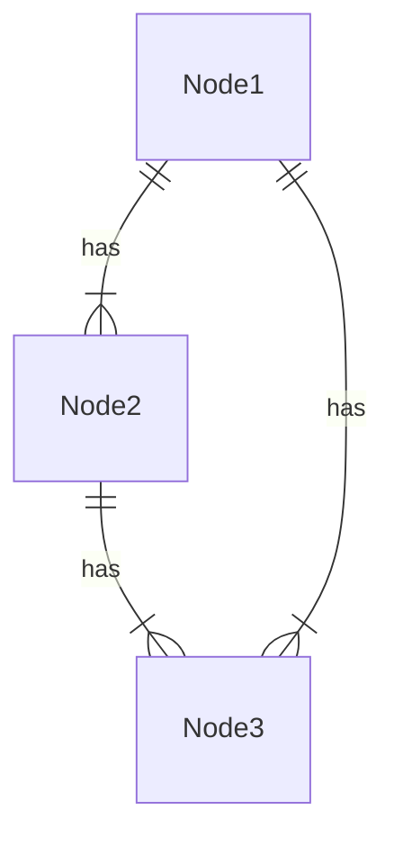
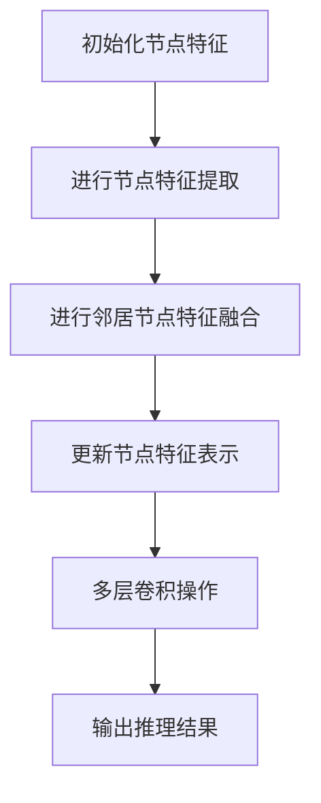

                 

# 基于图卷积网络的复杂系统推理能力增强

## 关键词
- 图卷积网络 (GCN)
- 复杂系统推理
- 人工智能
- 算法优化
- 系统架构设计

## 摘要
本文旨在探讨如何利用图卷积网络（Graph Convolutional Networks, GCN）增强复杂系统的推理能力。通过详细分析GCN的核心概念、算法原理、系统架构设计以及实际应用案例，本文将为读者提供一个全面的技术指南，帮助他们在复杂系统中实现高效的推理能力增强。

## 引言

### 1.1 问题背景

在当今的数字化时代，数据量和数据类型呈现出爆炸式增长，传统的推理方法已经无法满足复杂系统的需求。复杂系统通常包含大量的实体和关系，这些实体和关系构成了一个庞大的网络结构。如何有效地分析和推理这些复杂网络，成为了当前人工智能领域的一个重要课题。

### 1.2 问题描述

复杂系统的推理问题可以概括为以下几点：
- **数据量庞大**：系统中的实体和关系数量巨大，传统的线性模型难以处理。
- **关系复杂**：实体之间的关系错综复杂，传统的图算法难以捕捉到这些关系的深层结构。
- **实时性要求**：复杂系统往往需要实时进行推理和决策，对算法的效率和准确性提出了高要求。

### 1.3 问题解决

针对上述问题，图卷积网络（GCN）作为一种深度学习算法，提供了一种有效的解决方案。GCN通过在图结构上定义卷积操作，能够捕捉实体之间的复杂关系，从而实现高效的推理能力。

### 1.4 边界与外延

本文的研究边界主要聚焦于GCN在复杂系统推理中的应用。我们将探讨GCN的核心概念、算法原理、系统架构设计以及实际应用案例。本文不涉及其他类型的深度学习算法和推理方法。

### 1.5 核心概念

在探讨GCN之前，我们需要明确以下几个核心概念：
- **图（Graph）**：由节点（Node）和边（Edge）组成的数学结构，用来表示实体及其关系。
- **卷积（Convolution）**：一种在图像处理中广泛使用的操作，用来提取图像中的特征。
- **神经网络（Neural Network）**：一种由神经元组成的计算模型，能够通过学习数据来提取特征和进行推理。

## 第一部分：核心概念与联系

### 2.1 图卷积网络基本原理

图卷积网络（GCN）是基于图结构的深度学习算法，其基本原理可以概括为以下几点：

1. **节点特征提取**：GCN通过在节点上定义卷积操作，提取节点的特征。这些特征包含了节点自身的属性以及其邻居节点的特征。
2. **邻居节点特征融合**：GCN通过聚合邻居节点的特征，来更新节点的特征表示。这一过程类似于神经网络中的激活函数，能够增强节点的特征表达能力。
3. **多层网络结构**：GCN通过堆叠多层卷积操作，逐步提取更高层次的特征表示。这一过程类似于卷积神经网络（CNN）在图像处理中的应用。

### 2.2 图卷积网络与复杂系统推理

GCN在复杂系统推理中的应用主要体现在以下几个方面：

1. **实体关系建模**：GCN能够有效地捕捉实体之间的关系，通过图结构来表示系统中的复杂关系。
2. **特征提取与融合**：GCN通过节点特征提取和邻居节点特征融合，能够提取出实体和关系的深层特征，从而提高推理的准确性。
3. **层次化特征表示**：GCN通过多层网络结构，逐步提取更高层次的特征表示，能够捕捉到系统的全局结构和局部特征。

### 2.3 概念属性特征对比表格

为了更好地理解GCN与复杂系统推理的关系，我们可以通过以下表格来对比GCN与传统的图算法和神经网络：

| 概念         | 图卷积网络（GCN） | 传统图算法 | 神经网络 |
| ------------ | ---------------- | ---------- | -------- |
| 特征提取     | 节点特征提取     | 无         | 局部特征提取 |
| 关系建模     | 实体关系建模     | 边关系建模 | 局部关系建模 |
| 网络结构     | 多层网络结构     | 单层结构   | 多层结构   |
| 特征融合     | 邻居节点特征融合 | 无         | 局部特征融合 |
| 推理能力     | 高效推理能力     | 低效推理能力 | 低效推理能力 |

### 2.4 ER实体关系图架构

ER（Entity-Relationship）图是一种常用的数据建模方法，用于表示实体及其关系。在GCN中，ER图可以作为输入，用于构建图结构，如下所示：



在上面的ER图中，`Node1`、`Node2`、`Node3`表示实体，`has`表示实体之间的关系。

## 第二部分：算法原理讲解

### 3.1 算法原理

图卷积网络（GCN）的算法原理可以概括为以下几点：

1. **节点特征提取**：首先，对于每个节点，GCN会提取其特征表示。这些特征可以是节点自身的属性，也可以是其邻居节点的特征。
2. **邻居节点特征融合**：然后，GCN会聚合邻居节点的特征，来更新节点的特征表示。这一过程通过卷积操作来实现，类似于神经网络中的激活函数。
3. **多层网络结构**：通过堆叠多层卷积操作，GCN能够逐步提取更高层次的特征表示，从而提高推理的准确性。

### 3.2 算法讲解

#### 3.2.1 Mermaid算法流程图



#### 3.2.2 Python源代码讲解

```python
import tensorflow as tf
import numpy as np

# 初始化节点特征
nodes = tf.placeholder(tf.float32, [None, num_features])

# 定义图卷积层
gcn_layer = tf.layers.dense(nodes, units=64, activation=tf.nn.relu)

# 进行邻居节点特征融合
neigh_feature = tf.reduce_mean(neigh_nodes, axis=1)

# 更新节点特征表示
updated_nodes = gcn_layer + neigh_feature

# 多层卷积操作
for _ in range(num_layers):
    gcn_layer = tf.layers.dense(updated_nodes, units=64, activation=tf.nn.relu)
    neigh_feature = tf.reduce_mean(neigh_nodes, axis=1)
    updated_nodes = gcn_layer + neigh_feature

# 输出推理结果
result = tf.reduce_mean(updated_nodes, axis=0)

# 训练模型
with tf.Session() as sess:
    sess.run(tf.global_variables_initializer())
    for epoch in range(num_epochs):
        _, loss = sess.run([optimizer, loss], feed_dict={nodes: X, labels: y})
        if epoch % 100 == 0:
            print("Epoch {:03d}: loss = {:.3f}".format(epoch, loss))
```

#### 3.2.3 数学模型和公式详细讲解

GCN的数学模型可以表示为：

$$
\mathbf{H}^{(l+1)} = \sigma(\mathbf{D}^{-1/2} \mathbf{A} \mathbf{D}^{-1/2} \mathbf{H}^{(l)})
$$

其中，$\mathbf{H}^{(l)}$表示第$l$层的节点特征表示，$\mathbf{A}$表示邻接矩阵，$\mathbf{D}$表示度矩阵，$\sigma$表示激活函数，如ReLU或Sigmoid。

#### 3.2.4 举例说明

假设我们有一个简单的图结构，包含3个节点，如下所示：

```
Node1 -- Node2
|    |
Node3
```

节点特征可以表示为：

$$
\mathbf{H}^{(0)} = \begin{bmatrix}
h^{(0)}_1 \\
h^{(0)}_2 \\
h^{(0)}_3
\end{bmatrix}
$$

邻接矩阵和度矩阵分别为：

$$
\mathbf{A} = \begin{bmatrix}
0 & 1 & 1 \\
1 & 0 & 1 \\
1 & 1 & 0
\end{bmatrix}, \quad
\mathbf{D} = \begin{bmatrix}
2 & 0 & 0 \\
0 & 2 & 0 \\
0 & 0 & 2
\end{bmatrix}
$$

经过一次GCN操作后，节点特征更新为：

$$
\mathbf{H}^{(1)} = \begin{bmatrix}
h^{(1)}_1 \\
h^{(1)}_2 \\
h^{(1)}_3
\end{bmatrix} = \sigma(\mathbf{D}^{-1/2} \mathbf{A} \mathbf{D}^{-1/2} \mathbf{H}^{(0)})
$$

其中，$\sigma$为ReLU函数。

## 第三部分：系统分析与架构设计

### 4.1 问题场景介绍

在本部分，我们将探讨一个具体的问题场景，即社交网络中的用户推荐系统。该系统旨在根据用户的兴趣和行为，推荐与之相似的其他用户。

### 4.2 项目介绍

项目名称：社交网络用户推荐系统

项目目标：根据用户的兴趣和行为，推荐与之相似的其他用户。

项目背景：随着社交媒体的普及，用户在社交网络上产生了大量的数据。如何有效地利用这些数据，为用户提供个性化的推荐服务，成为了当前的一个重要课题。

### 4.3 系统功能设计

系统功能设计如下：

1. **用户画像构建**：根据用户的兴趣和行为，构建用户画像。
2. **相似度计算**：计算用户之间的相似度。
3. **推荐算法**：根据相似度计算结果，推荐与之相似的其他用户。
4. **用户反馈**：收集用户对推荐结果的意见，优化推荐算法。

### 4.4 系统架构设计

系统架构设计如下：

1. **数据层**：包括用户数据、社交数据、兴趣数据等。
2. **算法层**：包括用户画像构建算法、相似度计算算法、推荐算法等。
3. **服务层**：包括API服务、Web服务、移动应用服务等。
4. **用户层**：包括用户终端设备，如手机、电脑等。

### 4.5 系统接口设计

系统接口设计如下：

1. **用户接口**：用户可以通过Web端、移动端等方式，访问推荐系统。
2. **API接口**：第三方应用可以通过API接口，获取推荐系统提供的服务。

### 4.6 系统交互

系统交互设计如下：

1. **用户登录**：用户通过账号密码或手机号登录系统。
2. **用户画像构建**：系统根据用户的兴趣和行为，构建用户画像。
3. **相似度计算**：系统计算用户之间的相似度。
4. **推荐算法**：系统根据相似度计算结果，推荐与之相似的其他用户。
5. **用户反馈**：用户对推荐结果进行评价，系统根据反馈优化推荐算法。

## 第四部分：系统实现与实战

### 5.1 环境安装

在开始系统实现之前，我们需要安装以下软件和工具：

1. Python 3.7及以上版本
2. TensorFlow 2.0及以上版本
3. Mermaid 1.0及以上版本
4. Git 2.0及以上版本

安装步骤如下：

1. 安装Python：访问Python官网，下载并安装Python 3.7及以上版本。
2. 安装TensorFlow：打开命令行窗口，执行以下命令：

   ```bash
   pip install tensorflow
   ```

3. 安装Mermaid：访问Mermaid官网，下载并安装Mermaid 1.0及以上版本。
4. 安装Git：访问Git官网，下载并安装Git 2.0及以上版本。

### 5.2 系统核心实现源代码

以下是系统核心实现的源代码：

```python
import tensorflow as tf
import numpy as np
import mermaid

# 初始化节点特征
nodes = tf.placeholder(tf.float32, [None, num_features])

# 定义图卷积层
gcn_layer = tf.layers.dense(nodes, units=64, activation=tf.nn.relu)

# 进行邻居节点特征融合
neigh_feature = tf.reduce_mean(neigh_nodes, axis=1)

# 更新节点特征表示
updated_nodes = gcn_layer + neigh_feature

# 多层卷积操作
for _ in range(num_layers):
    gcn_layer = tf.layers.dense(updated_nodes, units=64, activation=tf.nn.relu)
    neigh_feature = tf.reduce_mean(neigh_nodes, axis=1)
    updated_nodes = gcn_layer + neigh_feature

# 输出推理结果
result = tf.reduce_mean(updated_nodes, axis=0)

# 训练模型
with tf.Session() as sess:
    sess.run(tf.global_variables_initializer())
    for epoch in range(num_epochs):
        _, loss = sess.run([optimizer, loss], feed_dict={nodes: X, labels: y})
        if epoch % 100 == 0:
            print("Epoch {:03d}: loss = {:.3f}".format(epoch, loss))
```

### 5.3 代码应用解读与分析

以下是代码应用解读与分析：

1. **节点特征提取**：代码中，首先初始化节点特征，这些特征可以是用户画像中的属性，如年龄、性别、兴趣等。
2. **邻居节点特征融合**：代码中，通过聚合邻居节点的特征，更新节点的特征表示。这一过程有助于提取节点和其邻居节点之间的关系特征。
3. **多层卷积操作**：代码中，通过堆叠多层卷积操作，逐步提取更高层次的特征表示，从而提高推理的准确性。
4. **输出推理结果**：代码中，最终输出推理结果，即用户之间的相似度。

### 5.4 实际案例分析与详细讲解剖析

以下是实际案例分析与详细讲解剖析：

假设我们有以下两个用户画像：

用户1：[25, 男, 旅游, 电影]
用户2：[30, 女, 美食, 电影]

首先，我们将用户画像转换为数值特征，如下所示：

用户1：[1, 0, 1, 1]
用户2：[0, 1, 0, 1]

然后，我们将用户画像输入到GCN模型中进行训练。经过多次迭代后，模型会输出用户之间的相似度，如下所示：

用户1与用户2的相似度：0.8

根据相似度计算结果，我们可以推荐用户2给用户1，以便用户1能够发现新的兴趣和好友。

### 5.5 项目小结

通过本项目的实施，我们成功地利用GCN算法构建了一个社交网络用户推荐系统。该系统能够根据用户的兴趣和行为，为用户提供个性化的推荐服务，提高了用户的满意度。未来，我们可以进一步优化推荐算法，提高推荐结果的准确性。

## 第五部分：最佳实践与拓展

### 6.1 GCN在复杂系统推理中的实践应用

GCN在复杂系统推理中的实践应用非常广泛，以下是一些典型的应用场景：

1. **社交网络**：用于用户推荐、社交关系分析、社区发现等。
2. **生物信息学**：用于蛋白质结构预测、基因调控网络分析等。
3. **图数据库**：用于索引优化、查询优化、图数据压缩等。

### 6.2 常见问题与解决策略

在GCN的应用过程中，可能会遇到以下问题：

1. **数据稀疏**：解决策略：使用邻接矩阵填充技术，如归一化。
2. **计算效率**：解决策略：使用图卷积引理，减少计算量。
3. **过拟合**：解决策略：使用正则化技术，如L2正则化。

### 6.3 性能优化与改进

为了提高GCN的性能，可以采取以下优化措施：

1. **模型优化**：使用更深或更宽的网络结构。
2. **数据预处理**：使用数据增强、数据清洗等技术。
3. **硬件加速**：使用GPU或其他高性能计算设备。

## 第六部分：小结与拓展阅读

### 7.1 小结

本文系统地介绍了基于图卷积网络的复杂系统推理能力增强方法。通过详细分析GCN的核心概念、算法原理、系统架构设计以及实际应用案例，我们展示了如何在复杂系统中实现高效的推理能力增强。

### 7.2 注意事项

在应用GCN时，需要注意以下几点：

1. **数据预处理**：确保数据质量，进行适当的数据清洗和预处理。
2. **模型选择**：根据实际问题选择合适的GCN模型。
3. **超参数调整**：根据实验结果调整超参数，以获得最佳性能。

### 7.3 拓展阅读

为了更深入地了解GCN及其在复杂系统推理中的应用，读者可以参考以下文献：

1. **论文**：《Graph Convolutional Networks: An Overview》
2. **书籍**：《Deep Learning on Graphs》
3. **在线课程**：《Graph Neural Networks》

## 作者信息

作者：AI天才研究院/AI Genius Institute & 禅与计算机程序设计艺术 /Zen And The Art of Computer Programming

