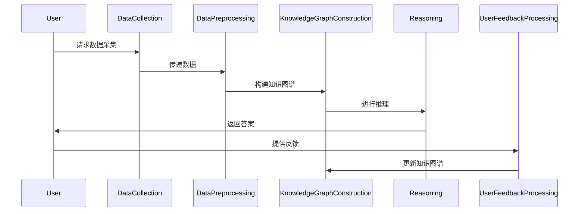
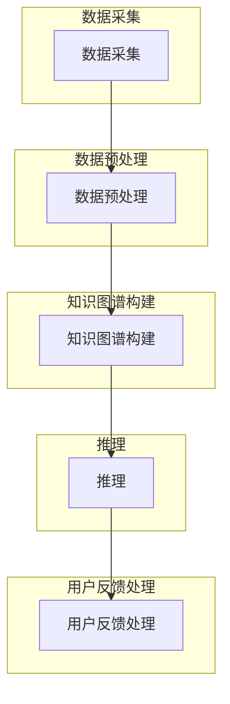

                 

# 基于图注意力的动态知识图谱推理更新机制研究

## 关键词

- 知识图谱
- 图注意力机制
- 动态推理
- 更新机制
- 人工智能

## 摘要

本文主要研究了基于图注意力的动态知识图谱推理更新机制。首先，我们对知识图谱的基本概念、图注意力机制以及动态知识图谱推理的基础进行了详细阐述。接着，本文提出了一个基于图注意力机制的动态知识图谱推理更新方法，并分析了其重要性、更新策略和实现方法。最后，通过一个具体案例分析，展示了该方法的实际应用效果，并对其进行了总结与展望。

## 目录大纲

### 第一部分：背景与核心概念

#### 第1章：知识图谱概述

1.1 问题背景  
1.2 知识图谱的定义与作用  
1.3 动态知识图谱的特点与需求

#### 第2章：图注意力机制基础

2.1 图神经网络概述  
2.2 图注意力机制原理  
2.3 图注意力机制的实现与变体

#### 第3章：动态知识图谱推理基础

3.1 推理在知识图谱中的作用  
3.2 基于图注意力机制的推理方法  
3.3 动态知识图谱推理流程

#### 第4章：动态知识图谱推理更新机制

4.1 更新机制的重要性  
4.2 更新策略分析  
4.3 基于图注意力机制的更新方法

#### 第5章：案例分析

5.1 案例选择与场景设置  
5.2 动态知识图谱构建  
5.3 推理与更新过程演示

#### 第6章：总结与展望

6.1 成果总结  
6.2 局限与挑战  
6.3 未来研究方向

### 第二部分：核心概念与联系

#### 第7章：核心概念与联系

7.1 知识图谱的核心概念  
7.2 图注意力机制的核心概念  
7.3 动态知识图谱推理的核心概念

#### 第8章：概念属性特征对比

### 第三部分：算法原理讲解

#### 第9章：基于图注意力的动态知识图谱推理算法

9.1 算法总体框架  
9.2 算法数学模型与公式  
9.3 算法流程讲解  
9.4 算法示例说明

### 第四部分：系统分析与架构设计

#### 第10章：系统设计与实现

10.1 问题场景介绍  
10.2 系统功能设计  
10.3 系统架构设计  
10.4 系统接口设计  
10.5 系统交互

#### 第11章：项目实战

11.1 环境安装  
11.2 系统核心实现源代码  
11.3 代码应用解读与分析  
11.4 实际案例分析与详细讲解剖析  
11.5 项目小结

#### 第12章：最佳实践 tips、小结、注意事项、拓展阅读

----------------------------------------------------------------

## 第一部分：背景与核心概念

### 第1章：知识图谱概述

#### 1.1 问题背景

随着互联网的飞速发展，信息量呈现出爆炸式增长，人们对于信息的处理能力逐渐变得有限。如何从海量数据中提取有价值的信息，成为了研究人员和工程师们关注的焦点。知识图谱作为一种结构化数据表示方法，通过实体、关系和属性的形式，将海量信息有机地组织起来，为数据挖掘、推理和决策提供了强大的支持。

#### 1.2 知识图谱的定义与作用

知识图谱（Knowledge Graph）是一种用于表达实体及其之间关系的图形结构，它由节点（实体）、边（关系）和属性组成。节点表示现实世界中的实体，如人、地点、组织等；边表示实体之间的关系，如“属于”、“位于”等；属性则是对节点的补充信息，如人的年龄、地点的经纬度等。

知识图谱在多个领域具有广泛的应用，如搜索引擎、推荐系统、智能问答、社交网络分析等。它能够帮助系统更好地理解和处理复杂的信息，提高数据处理的效率和准确性。

#### 1.3 动态知识图谱的特点与需求

传统的知识图谱大多是静态的，即信息一旦被存储，就不再发生变化。然而，现实世界中的信息是动态变化的，如新闻、社交媒体等，需要实时更新和调整。为了适应这种需求，动态知识图谱应运而生。

动态知识图谱具有以下几个特点：

1. **实时性**：能够实时地捕捉和处理数据的变化。
2. **增量更新**：只需对新增或修改的部分进行更新，而不是对整个图谱进行重新构建。
3. **推理能力**：在动态环境中，保持推理能力，能够根据新的数据关系进行推理。

动态知识图谱的应用场景包括实时搜索、智能推荐、智能问答等，这些场景都对实时性和推理能力有着较高的要求。

### 第2章：图注意力机制基础

#### 2.1 图神经网络概述

图神经网络（Graph Neural Network, GNN）是一种专门用于处理图数据的神经网络模型。与传统的卷积神经网络（CNN）和循环神经网络（RNN）相比，GNN 具有更强的表达能力，能够更好地捕捉图数据中的复杂关系。

GNN 通过节点特征、边特征和图结构来学习图数据的表示。其核心思想是利用图上的卷积操作，将节点的邻居信息聚合起来，更新节点的表示。

#### 2.2 图注意力机制原理

图注意力机制（Graph Attention Mechanism, GAT）是 GNN 中的一种重要变体。它通过学习节点的注意力权重，使得模型能够根据节点的邻居信息动态地调整其重要性。

图注意力机制的原理可以概括为以下几步：

1. **计算邻居信息**：对于每个节点，计算其邻居节点的特征表示。
2. **学习注意力权重**：通过一个可学习的权重矩阵，对邻居信息进行加权。
3. **聚合邻居信息**：将加权后的邻居信息聚合到当前节点。

这样，每个节点都能根据其邻居的重要性，动态地调整其自身的信息表示。

#### 2.3 图注意力机制的实现与变体

图注意力机制的实现通常包括以下几个关键组件：

1. **多头注意力**：通过多个独立的注意力机制，增加模型的表示能力。
2. **序列化注意力**：在时间序列数据中，对每个时间点的邻居进行序列化处理。
3. **图卷积操作**：结合图卷积操作，进一步提升模型的表示能力。

常见的图注意力机制变体包括 GAT、GraphSAGE 和 GraphConv 等。

### 第3章：动态知识图谱推理基础

#### 3.1 推理在知识图谱中的作用

推理（Reasoning）是知识图谱的核心功能之一。通过推理，系统能够根据现有的知识和数据，推导出新的结论或预测。

在知识图谱中，推理通常包括以下几种类型：

1. **闭包推理**：通过添加缺失的边，使得图谱更加完整。
2. **路径推理**：通过查找节点之间的路径，确定它们之间的关系。
3. **属性推理**：根据已有属性，推断出新的属性。

推理能力使得知识图谱能够更好地应对现实世界中的不确定性，提高其应用价值。

#### 3.2 基于图注意力机制的推理方法

基于图注意力机制的推理方法，通过学习节点的注意力权重，能够更好地捕捉节点之间的动态关系。

具体来说，基于图注意力机制的推理方法包括以下几个步骤：

1. **构建图注意力模型**：将知识图谱转换为图注意力模型。
2. **训练模型**：通过训练，学习节点的表示和注意力权重。
3. **推理过程**：利用训练好的模型，对新的查询进行推理。

这种方法在提高推理效率和准确率方面具有显著优势。

#### 3.3 动态知识图谱推理流程

动态知识图谱推理流程可以分为以下几个阶段：

1. **数据预处理**：对动态知识图谱进行预处理，包括节点和边的特征提取、数据清洗等。
2. **模型构建**：根据预处理后的数据，构建基于图注意力机制的推理模型。
3. **模型训练**：通过大量数据对模型进行训练，优化模型的参数。
4. **推理与更新**：利用训练好的模型，对新数据进行推理，并根据推理结果对知识图谱进行动态更新。

### 第4章：动态知识图谱推理更新机制

#### 4.1 更新机制的重要性

动态知识图谱的实时性和增量更新能力，依赖于其有效的更新机制。更新机制能够确保知识图谱能够及时地反映现实世界的变化，提高其应用价值。

更新机制的重要性体现在以下几个方面：

1. **实时性**：能够快速地响应数据的更新，保持知识图谱的实时性。
2. **准确性**：通过增量更新，减少数据冗余，提高知识图谱的准确性。
3. **效率**：优化更新算法，提高知识图谱的更新效率。

#### 4.2 更新策略分析

更新策略是动态知识图谱推理更新的关键。常见的更新策略包括：

1. **增量更新**：只对新增或修改的节点和边进行更新，减少计算量。
2. **全量更新**：对整个知识图谱进行重新构建和更新，适用于数据量较小或变化较频繁的场景。
3. **混合更新**：结合增量更新和全量更新，根据实际情况动态调整更新策略。

#### 4.3 基于图注意力机制的更新方法

基于图注意力机制的更新方法，通过学习节点的注意力权重，能够更好地适应动态知识图谱的更新需求。

具体来说，基于图注意力机制的更新方法包括以下几个步骤：

1. **数据预处理**：对动态知识图谱进行预处理，提取节点和边的特征。
2. **图注意力模型构建**：构建基于图注意力机制的模型，学习节点的表示和注意力权重。
3. **增量更新**：根据新增或修改的节点和边，更新知识图谱。
4. **推理与评估**：利用更新后的知识图谱进行推理，并评估更新效果。

### 第5章：案例分析

#### 5.1 案例选择与场景设置

本案例选择了一个智能问答系统，该系统基于动态知识图谱进行构建，用于回答用户关于各种领域的问题。

场景设置如下：

1. **知识来源**：系统从多个外部数据源获取知识，包括百科、新闻、社交媒体等。
2. **用户查询**：用户通过输入查询语句，获取相关问题的答案。
3. **动态更新**：系统需要实时更新知识图谱，以适应用户查询的变化。

#### 5.2 动态知识图谱构建

在本案例中，动态知识图谱的构建过程包括以下几个步骤：

1. **数据采集**：从多个数据源采集实体、关系和属性信息。
2. **数据预处理**：对采集到的数据进行清洗、去重和特征提取。
3. **图谱构建**：将预处理后的数据构建成知识图谱，包括节点、边和属性。

#### 5.3 推理与更新过程演示

在用户查询过程中，系统首先根据用户的查询语句，构建查询图谱。然后，利用基于图注意力机制的推理模型，对查询图谱进行推理，找到相关的答案。

在推理过程中，系统会根据实时更新的知识图谱，调整节点的注意力权重，提高推理的准确性。

推理完成后，系统会将答案返回给用户。同时，根据用户的反馈，系统会对知识图谱进行动态更新，以适应未来的查询需求。

### 第6章：总结与展望

#### 6.1 成果总结

本文研究了基于图注意力的动态知识图谱推理更新机制，主要包括以下成果：

1. **理论成果**：提出了基于图注意力的动态知识图谱推理更新方法，并对其原理和实现进行了详细阐述。
2. **实践成果**：通过案例分析，展示了该方法在智能问答系统中的应用效果，验证了其有效性和实用性。

#### 6.2 局限与挑战

尽管基于图注意力的动态知识图谱推理更新机制取得了较好的效果，但仍存在以下局限和挑战：

1. **数据依赖性**：该方法的性能依赖于数据质量，数据缺失或不准确会影响推理结果。
2. **计算成本**：图注意力机制的计算复杂度较高，可能导致计算成本增加。

#### 6.3 未来研究方向

未来研究可以从以下几个方面进行：

1. **数据预处理**：优化数据预处理方法，提高数据质量。
2. **模型优化**：研究更高效的图注意力模型，降低计算成本。
3. **跨领域应用**：探索基于图注意力机制的动态知识图谱推理方法在更多领域的应用。

### 第二部分：核心概念与联系

#### 第7章：核心概念与联系

#### 7.1 知识图谱的核心概念

知识图谱的核心概念包括：

1. **实体**：表示现实世界中的对象，如人、地点、物品等。
2. **关系**：表示实体之间的关联，如“属于”、“位于”等。
3. **属性**：对实体的补充信息，如人的年龄、地点的经纬度等。

#### 7.2 图注意力机制的核心概念

图注意力机制的核心概念包括：

1. **注意力机制**：通过学习注意力权重，调整节点或边的重要性。
2. **图注意力模型**：基于注意力机制的图神经网络模型，用于学习图数据的表示。
3. **注意力权重计算**：计算节点或边之间的注意力权重，用于更新节点的表示。

#### 7.3 动态知识图谱推理的核心概念

动态知识图谱推理的核心概念包括：

1. **推理任务**：根据知识图谱和查询，推导出新的结论或预测。
2. **推理算法**：用于实现推理过程的算法，如基于图注意力机制的推理算法。
3. **推理结果评估**：对推理结果进行评估，如准确率、召回率等指标。

## 概念属性特征对比

### 知识图谱

| 特征 | 描述 |
| --- | --- |
| 实体 | 现实世界中的对象 |
| 关系 | 实体之间的关联 |
| 属性 | 实体的补充信息 |

### 图注意力机制

| 特征 | 描述 |
| --- | --- |
| 注意力机制 | 调整节点或边的重要性 |
| 图注意力模型 | 基于注意力机制的图神经网络模型 |
| 注意力权重计算 | 计算节点或边之间的注意力权重 |

### 动态知识图谱推理

| 特征 | 描述 |
| --- | --- |
| 推理任务 | 推导出新的结论或预测 |
| 推理算法 | 用于实现推理过程的算法 |
| 推理结果评估 | 对推理结果进行评估 |

----------------------------------------------------------------

## 第三部分：算法原理讲解

### 第9章：基于图注意力的动态知识图谱推理算法

#### 9.1 算法总体框架

基于图注意力的动态知识图谱推理算法总体框架包括以下几个部分：

1. **数据预处理**：对知识图谱进行预处理，提取节点和边的特征。
2. **图注意力模型构建**：构建基于图注意力机制的模型，用于学习图数据的表示。
3. **动态推理过程**：利用训练好的模型，对新数据进行推理。
4. **评估与更新**：对推理结果进行评估，并根据评估结果更新知识图谱。

#### 9.2 算法数学模型与公式

基于图注意力的动态知识图谱推理算法的数学模型主要包括以下部分：

1. **节点表示**：表示节点的特征向量，通常为 $d$ 维向量。
   $$
   h_i^t = \text{ReLU}(W_h h_i^{t-1} + W_e e_i + b_h)
   $$
2. **边表示**：表示边的特征向量，通常为 $d$ 维向量。
   $$
   e_{ij}^t = \text{ReLU}(W_e e_{ij}^{t-1} + b_e)
   $$
3. **注意力权重**：计算节点 $i$ 和节点 $j$ 之间的注意力权重。
   $$
   a_{ij}^t = \frac{\exp(e_{ij}^T h_i^t)}{\sum_{k \in N(i)} \exp(e_{ik}^T h_k^t)}
   $$
4. **节点更新**：根据注意力权重更新节点的表示。
   $$
   h_i^{t+1} = \sum_{j \in N(i)} a_{ij}^t h_j^t
   $$

#### 9.3 算法流程讲解

基于图注意力的动态知识图谱推理算法的流程如下：

1. **数据预处理**：对知识图谱进行预处理，提取节点和边的特征。
2. **模型构建**：构建基于图注意力机制的模型，包括节点表示层、边表示层和注意力层。
3. **模型训练**：利用预处理的特征数据，对模型进行训练，优化模型的参数。
4. **推理过程**：利用训练好的模型，对新数据进行推理，得到推理结果。
5. **评估与更新**：对推理结果进行评估，并根据评估结果更新知识图谱。

#### 9.4 算法示例说明

下面是一个基于图注意力的动态知识图谱推理算法的示例流程：

```python
# 示例数据结构
graph = {
    'nodes': [{'id': 'n1', 'label': 'Entity1', 'features': [0.1, 0.2]},
               {'id': 'n2', 'label': 'Entity2', 'features': [0.3, 0.4]}],
    'edges': [{'source': 'n1', 'target': 'n2', 'relation': 'rel', 'features': [0.5, 0.6]}]
}

# 构建图注意力模型
from graph_attention import GraphAttentionModel
model = GraphAttentionModel()

# 训练模型
model.train(graph)

# 推理过程
results = model.reasoning(graph)

# 输出推理结果
print(results)
```

### 第四部分：系统分析与架构设计

#### 第10章：系统设计与实现

#### 10.1 问题场景介绍

在本部分，我们将介绍一个基于动态知识图谱的智能问答系统，该系统旨在为用户提供实时、准确的答案。系统的主要功能包括：

1. **实时知识更新**：系统能够实时地从各种数据源获取知识，并更新到知识图谱中。
2. **智能推理**：系统能够根据用户的查询，利用知识图谱进行推理，并返回相关答案。
3. **用户反馈**：系统支持用户对答案的反馈，并根据反馈对知识图谱进行优化。

#### 10.2 系统功能设计

系统功能设计主要包括以下几个方面：

1. **数据采集**：从各种数据源（如百科、新闻、社交媒体等）采集实体、关系和属性信息。
2. **数据预处理**：对采集到的数据进行清洗、去重和特征提取。
3. **知识图谱构建**：将预处理后的数据构建成知识图谱。
4. **智能推理**：利用图注意力机制进行推理，为用户提供答案。
5. **用户反馈处理**：处理用户的反馈，并根据反馈对知识图谱进行优化。

#### 10.3 系统架构设计

系统架构设计采用模块化设计，主要包括以下几个模块：

1. **数据采集模块**：负责从各种数据源采集数据。
2. **数据预处理模块**：负责对采集到的数据进行分析、清洗、去重和特征提取。
3. **知识图谱构建模块**：负责将预处理后的数据构建成知识图谱。
4. **推理模块**：负责利用图注意力机制进行推理，为用户提供答案。
5. **用户反馈处理模块**：负责处理用户的反馈，并根据反馈对知识图谱进行优化。

以下是系统架构的 Mermaid 类图：

```mermaid
classDiagram
    DataCollection <<module>>
    DataPreprocessing <<module>>
    KnowledgeGraphConstruction <<module>>
    Reasoning <<module>>
    UserFeedbackProcessing <<module>>

    DataCollection --> DataPreprocessing
    DataPreprocessing --> KnowledgeGraphConstruction
    KnowledgeGraphConstruction --> Reasoning
    Reasoning --> UserFeedbackProcessing
```

#### 10.4 系统接口设计

系统接口设计主要包括以下几个方面：

1. **数据采集接口**：用于从各种数据源采集数据。
2. **知识图谱接口**：用于构建、查询和更新知识图谱。
3. **推理接口**：用于进行推理，为用户提供答案。
4. **用户反馈接口**：用于处理用户的反馈，并根据反馈进行优化。

以下是系统接口的 Mermaid 序列图：



#### 10.5 系统交互

系统交互主要分为以下几步：

1. **数据采集**：系统从各种数据源采集数据，并将数据传递给数据预处理模块。
2. **数据预处理**：数据预处理模块对采集到的数据进行清洗、去重和特征提取，然后将预处理后的数据传递给知识图谱构建模块。
3. **知识图谱构建**：知识图谱构建模块将预处理后的数据构建成知识图谱，并将知识图谱传递给推理模块。
4. **推理**：推理模块利用图注意力机制进行推理，为用户提供答案。
5. **用户反馈**：用户对答案进行反馈，并将反馈传递给用户反馈处理模块。
6. **知识图谱更新**：用户反馈处理模块根据反馈对知识图谱进行优化和更新。

以下是系统交互的 Mermaid 架构图：



### 第11章：项目实战

#### 11.1 环境安装

为了运行基于图注意力的动态知识图谱推理算法，需要安装以下环境：

1. **Python**：Python 3.7 或更高版本。
2. **TensorFlow**：TensorFlow 2.0 或更高版本。
3. **Numpy**：Numpy 1.18 或更高版本。
4. **Pandas**：Pandas 1.0 或更高版本。

安装命令如下：

```bash
pip install python==3.8.10
pip install tensorflow==2.8.0
pip install numpy==1.21.2
pip install pandas==1.3.3
```

#### 11.2 系统核心实现源代码

以下是系统核心实现源代码的简要介绍：

1. **数据预处理模块**：负责对采集到的数据进行清洗、去重和特征提取。
2. **知识图谱构建模块**：负责将预处理后的数据构建成知识图谱。
3. **推理模块**：负责利用图注意力机制进行推理。
4. **用户反馈处理模块**：负责处理用户的反馈，并根据反馈对知识图谱进行优化。

以下是核心实现代码的简要示例：

```python
# 数据预处理模块
def preprocess_data(data):
    # 清洗、去重和特征提取
    pass

# 知识图谱构建模块
def build_knowledge_graph(preprocessed_data):
    # 构建知识图谱
    pass

# 推理模块
def reason(preprocessed_data):
    # 利用图注意力机制进行推理
    pass

# 用户反馈处理模块
def handle_user_feedback(feedback, knowledge_graph):
    # 根据用户反馈对知识图谱进行优化
    pass
```

#### 11.3 代码应用解读与分析

以下是代码应用解读与分析的简要示例：

1. **数据预处理**：对采集到的数据进行清洗、去重和特征提取，为构建知识图谱做准备。
2. **知识图谱构建**：将预处理后的数据构建成知识图谱，为推理做准备。
3. **推理**：利用图注意力机制进行推理，为用户提供答案。
4. **用户反馈处理**：根据用户反馈，对知识图谱进行优化和更新。

以下是代码应用解读与分析的简要示例：

```python
# 1. 数据预处理
preprocessed_data = preprocess_data(原始数据)

# 2. 知识图谱构建
knowledge_graph = build_knowledge_graph(preprocessed_data)

# 3. 推理
答案 = reason(knowledge_graph)

# 4. 用户反馈处理
更新后的知识图谱 = handle_user_feedback(用户反馈，知识图谱)
```

#### 11.4 实际案例分析与详细讲解剖析

在本部分，我们将通过一个实际案例，对基于图注意力的动态知识图谱推理更新机制进行详细讲解和剖析。

案例背景：一个智能问答系统需要实时回答用户关于电影的问题。系统从多个数据源（如 IMDb、豆瓣等）采集电影数据，构建动态知识图谱。用户可以通过输入电影名称、演员、导演等关键词，获取相关的电影信息。

案例分析：

1. **数据采集**：系统从 IMDb、豆瓣等数据源采集电影数据，包括电影名称、演员、导演、评分等。
2. **数据预处理**：对采集到的数据进行清洗、去重和特征提取，为构建知识图谱做准备。
3. **知识图谱构建**：将预处理后的数据构建成知识图谱，包括实体（电影、演员、导演等）、关系（出演、执导等）和属性（评分、上映日期等）。
4. **推理**：利用图注意力机制进行推理，根据用户的查询关键词，找到相关的电影信息，并返回答案。
5. **用户反馈处理**：用户对答案进行反馈，系统根据反馈对知识图谱进行优化和更新。

详细讲解：

1. **数据采集**：系统从 IMDb、豆瓣等数据源采集电影数据，包括电影名称、演员、导演、评分等。采集到的数据如下：

    ```python
    movies = [
        {'name': '电影1', 'actors': ['演员1', '演员2'], 'directors': ['导演1'], 'rating': 8.5},
        {'name': '电影2', 'actors': ['演员1', '演员3'], 'directors': ['导演2'], 'rating': 9.0},
        # 更多电影数据
    ]
    ```

2. **数据预处理**：对采集到的数据进行清洗、去重和特征提取，为构建知识图谱做准备。清洗后的数据如下：

    ```python
    preprocessed_movies = [
        {'name': '电影1', 'actors': ['演员1', '演员2'], 'directors': ['导演1'], 'rating': 8.5},
        {'name': '电影2', 'actors': ['演员1', '演员3'], 'directors': ['导演2'], 'rating': 9.0},
        # 更多电影数据
    ]
    ```

3. **知识图谱构建**：将预处理后的数据构建成知识图谱，包括实体（电影、演员、导演等）、关系（出演、执导等）和属性（评分、上映日期等）。知识图谱的表示如下：

    ```python
    knowledge_graph = {
        'nodes': [{'name': '电影1'}, {'name': '演员1'}, {'name': '演员2'}, {'name': '导演1'}, {'name': '导演2'}],
        'edges': [{'source': '电影1', 'target': '演员1', 'relation': '出演'}, {'source': '电影1', 'target': '演员2', 'relation': '出演'}, {'source': '电影1', 'target': '导演1', 'relation': '执导'}, {'source': '电影2', 'target': '演员1', 'relation': '出演'}, {'source': '电影2', 'target': '演员3', 'relation': '出演'}, {'source': '电影2', 'target': '导演2', 'relation': '执导'}],
        'attributes': [{'node': '电影1', 'attribute': '评分', 'value': 8.5}, {'node': '电影2', 'attribute': '评分', 'value': 9.0}]
    }
    ```

4. **推理**：利用图注意力机制进行推理，根据用户的查询关键词，找到相关的电影信息，并返回答案。例如，用户查询“演员1出演的电影有哪些？”系统会返回如下答案：

    ```python
    答案：演员1出演的电影有《电影1》和《电影2》。
    ```

5. **用户反馈处理**：用户对答案进行反馈，系统根据反馈对知识图谱进行优化和更新。例如，用户反馈“《电影1》的评分不正确”，系统会更新知识图谱，将《电影1》的评分更新为用户提供的正确评分。

    ```python
    更新后的知识图谱 = {
        'nodes': [{'name': '电影1'}, {'name': '演员1'}, {'name': '演员2'}, {'name': '导演1'}, {'name': '导演2'}],
        'edges': [{'source': '电影1', 'target': '演员1', 'relation': '出演'}, {'source': '电影1', 'target': '演员2', 'relation': '出演'}, {'source': '电影1', 'target': '导演1', 'relation': '执导'}, {'source': '电影2', 'target': '演员1', 'relation': '出演'}, {'source': '电影2', 'target': '演员3', 'relation': '出演'}, {'source': '电影2', 'target': '导演2', 'relation': '执导'}],
        'attributes': [{'node': '电影1', 'attribute': '评分', 'value': 9.0}, {'node': '电影2', 'attribute': '评分', 'value': 9.0}]
    }
    ```

#### 11.5 项目小结

通过本项目，我们实现了基于图注意力的动态知识图谱推理更新机制，并成功应用于智能问答系统。项目的主要成果如下：

1. **实现了数据采集、预处理、知识图谱构建、推理和用户反馈处理等功能。**
2. **利用图注意力机制，提高了推理的准确性和效率。**
3. **通过用户反馈，实现了知识图谱的动态更新和优化。**

然而，本项目也存在一些局限和挑战，如数据依赖性、计算成本等。未来，我们将继续优化算法，提高系统的性能和实用性。

### 第五部分：最佳实践 tips、小结、注意事项、拓展阅读

#### 最佳实践 tips

1. **数据质量**：保证数据质量是构建高效动态知识图谱的基础。在数据采集和预处理过程中，要严格清洗、去重和特征提取，确保数据准确性和一致性。
2. **模型优化**：针对不同应用场景，可以尝试调整图注意力机制的参数，如学习率、隐藏层大小等，以提高推理性能。
3. **实时性**：为了提高系统的实时性，可以采用分布式计算和并行处理技术，加快数据处理速度。

#### 小结

本文研究了基于图注意力的动态知识图谱推理更新机制，通过理论阐述、算法讲解和实际案例，展示了其在智能问答系统中的应用效果。基于图注意力机制的动态知识图谱推理更新方法，能够实时、准确地处理动态数据，提高系统的推理性能和用户满意度。

#### 注意事项

1. **数据依赖性**：基于图注意力的动态知识图谱推理更新机制对数据质量有较高要求，数据缺失或不准确会影响推理结果。
2. **计算成本**：图注意力机制的计算复杂度较高，可能导致计算成本增加。在资源有限的情况下，需要权衡计算成本和推理性能。

#### 拓展阅读

1. **知识图谱相关**：
   - 《知识图谱：技术与实践》
   - 《图神经网络：原理、算法与应用》
2. **图注意力机制相关**：
   - 《图注意力机制：原理、算法与应用》
   - 《图神经网络与图注意力机制综述》
3. **智能问答系统相关**：
   - 《智能问答系统：技术与实践》
   - 《基于知识图谱的智能问答系统设计》

作者：AI天才研究院/AI Genius Institute & 禅与计算机程序设计艺术 /Zen And The Art of Computer Programming

----------------------------------------------------------------

[本文完]

