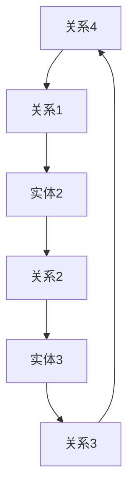
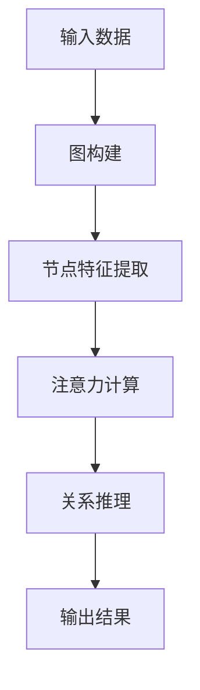
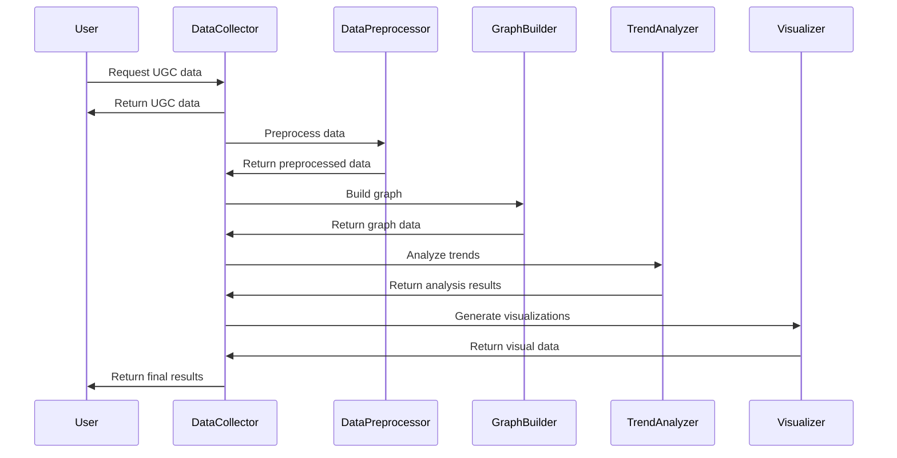

                 

### 第一部分：背景与概述

#### 第1章：社交媒体趋势分析背景

##### 1.1 问题背景

社交媒体已经成为人们获取信息和交流的重要平台，如Facebook、Twitter、Instagram等。这些平台产生了海量用户生成内容，包括文本、图片和视频等。从这些内容中挖掘出有价值的信息，对于了解用户需求、发现潜在趋势具有重要意义。然而，随着社交媒体平台的不断发展和用户生成内容的爆炸式增长，传统的趋势分析方法面临巨大的挑战。

首先，传统的趋势分析方法通常依赖于简单的统计方法，如词频统计、词云生成等。这些方法难以捕捉用户生成内容的复杂性和动态性，容易忽略一些潜在的趋势和变化。其次，社交媒体上的信息传播具有高度的异质性和噪声，传统的分析方法难以处理这种复杂性。此外，随着社交媒体平台的商业化，如何从海量数据中提取有价值的信息，以支持精准营销和广告投放，成为了一个亟待解决的问题。

##### 1.1.1 社交媒体对趋势分析的需求

社交媒体趋势分析的需求主要来源于以下几个方面：

1. **用户洞察**：通过分析社交媒体上的趋势，企业可以更好地了解用户的需求、喜好和行为模式，从而为产品设计、市场推广提供有力的支持。
2. **内容营销**：社交媒体趋势分析可以帮助企业发现热门话题和热门内容，从而制定更加有效的营销策略，提高内容传播效果。
3. **风险监测**：社交媒体上的负面情绪和舆情变化可能对企业造成重大影响。通过趋势分析，企业可以及时发现潜在的风险，采取相应的措施进行应对。
4. **商业决策**：社交媒体趋势分析可以为企业的战略决策提供数据支持，如产品定位、市场拓展、广告投放等。

##### 1.1.2 趋势分析在社交媒体中的应用

趋势分析在社交媒体中的应用非常广泛，主要包括以下几个方面：

1. **话题监测**：通过分析社交媒体上的热门话题，企业可以及时发现行业动态和趋势，为业务决策提供参考。
2. **情感分析**：通过分析社交媒体上的用户评论和讨论，企业可以了解用户的情感倾向，评估产品的市场表现。
3. **内容推荐**：基于用户生成内容的趋势分析，社交媒体平台可以为用户提供个性化的内容推荐，提高用户黏性和活跃度。
4. **广告投放**：通过分析社交媒体上的趋势，企业可以定位目标用户群体，制定更加精准的广告投放策略。

##### 1.2 问题描述

在进行社交媒体趋势分析时，我们面临着以下问题：

1. **数据复杂性**：社交媒体平台产生的数据具有高度的异质性和复杂性，包括文本、图片、视频等多种形式，传统的分析方法难以处理这种复杂性。
2. **动态性**：社交媒体上的趋势具有高度的动态性，需要实时捕捉和更新。传统的分析方法往往难以适应这种动态变化。
3. **噪声处理**：社交媒体上的信息传播具有大量的噪声和干扰，如何从噪声中提取有价值的信息成为一个重要问题。

##### 1.2.1 传统趋势分析方法与挑战

传统的趋势分析方法主要包括词频统计、词云生成、主题模型等。然而，这些方法存在以下挑战：

1. **静态分析**：传统方法通常进行静态分析，难以捕捉社交媒体上趋势的动态变化。
2. **缺乏上下文**：传统方法往往忽略了用户生成内容的上下文信息，导致分析结果不准确。
3. **处理能力有限**：传统方法在处理大量社交媒体数据时，效率较低，难以满足实时分析的需求。

##### 1.2.2 动态关系推理在趋势分析中的优势

动态关系推理作为一种基于图神经网络的方法，具有以下优势：

1. **动态性**：动态关系推理可以实时捕捉社交媒体上趋势的动态变化，适应社交媒体的快速变化。
2. **上下文分析**：通过分析节点之间的关系，动态关系推理可以捕捉用户生成内容的上下文信息，提高分析结果的准确性。
3. **异构数据融合**：动态关系推理可以处理多种类型的社交媒体数据，包括文本、图片、视频等，实现异构数据的融合分析。
4. **鲁棒性**：动态关系推理可以有效地处理社交媒体上的噪声和干扰，提高分析结果的鲁棒性。

##### 1.3 问题解决

为了解决上述问题，我们可以采用基于图注意力网络的动态关系推理方法。图注意力网络通过引入注意力机制，可以动态调整节点之间的关系权重，捕捉社交媒体上趋势的动态变化。同时，图注意力网络可以处理多种类型的社交媒体数据，实现异构数据的融合分析。

##### 1.3.1 图注意力网络的概念

图注意力网络（Graph Attention Network，GAN）是一种基于图神经网络（Graph Neural Network，GNN）的深度学习模型。GAN的主要思想是利用注意力机制对图数据进行建模，通过学习节点和边之间的交互关系，实现对图数据的特征表示和预测。

##### 1.3.2 图注意力网络在动态关系推理中的应用

在动态关系推理中，图注意力网络通过引入注意力机制，可以动态调整节点之间的关系权重，实现对社交媒体上趋势的实时捕捉和更新。具体来说，图注意力网络可以按照以下步骤进行：

1. **图构建**：将社交媒体数据表示为图结构，其中节点表示用户或内容，边表示用户之间的关系或内容之间的关联。
2. **节点特征提取**：对图中的每个节点进行特征提取，通常使用预训练的语言模型或图嵌入方法。
3. **注意力计算**：利用注意力机制计算节点之间的交互关系，动态调整关系权重。
4. **关系推理**：基于调整后的关系权重，进行动态关系推理，实现对社交媒体上趋势的实时分析和预测。

##### 1.4 边界与外延

动态关系推理不仅适用于社交媒体趋势分析，还可以应用于其他领域，如推荐系统、社交网络分析、金融风险评估等。未来，随着图注意力网络技术的不断发展，其在动态关系推理中的应用前景将更加广泛。

##### 1.4.1 动态关系推理的应用领域

动态关系推理在以下领域具有广泛的应用前景：

1. **社交媒体趋势分析**：通过动态关系推理，可以实时捕捉社交媒体上的热门话题和趋势，为企业和个人提供决策支持。
2. **推荐系统**：动态关系推理可以用于推荐系统，根据用户的动态关系和兴趣变化，提供个性化的推荐。
3. **社交网络分析**：动态关系推理可以分析社交网络中的用户关系，挖掘潜在的社区结构和影响力。
4. **金融风险评估**：动态关系推理可以用于金融风险评估，通过分析股票市场中的动态关系，预测市场走势和风险。

##### 1.4.2 图注意力网络的发展趋势

图注意力网络作为一种新兴的深度学习模型，具有以下发展趋势：

1. **模型优化**：为了提高图注意力网络的性能，未来的研究将致力于优化模型的计算效率和模型参数。
2. **多模态数据融合**：图注意力网络可以扩展到处理多模态数据，如文本、图像和音频等，实现跨模态的动态关系推理。
3. **应用拓展**：随着图注意力网络的不断发展，其在其他领域的应用将更加广泛，如医疗诊断、物流优化等。

### 总结

本文介绍了基于图注意力网络的动态关系推理在社交媒体趋势分析中的应用。通过引入注意力机制，图注意力网络可以动态调整节点之间的关系权重，实现实时趋势分析和预测。与传统方法相比，图注意力网络在动态性、上下文分析和异构数据融合等方面具有显著优势。未来，随着图注意力网络的不断发展，其在社交媒体趋势分析以及其他领域的应用前景将更加广阔。### 第2章：图注意力网络与动态关系推理

#### 2.1 核心概念

##### 2.1.1 图注意力网络的定义

图注意力网络（Graph Attention Network，GAN）是一种基于图神经网络（Graph Neural Network，GNN）的深度学习模型。GAN通过引入注意力机制，可以动态调整节点和边之间的交互关系，实现对图数据的特征表示和预测。与传统图神经网络不同，GAN不仅关注节点和边之间的直接关系，还考虑了间接关系，从而提高了模型的表示能力。

##### 2.1.2 动态关系推理的基本原理

动态关系推理是一种基于图神经网络的方法，用于分析图数据中的动态关系。其基本原理如下：

1. **图构建**：将图数据表示为一个图结构，其中节点表示实体，边表示实体之间的关系。
2. **特征提取**：对图中的每个节点进行特征提取，通常使用预训练的语言模型或图嵌入方法。
3. **关系更新**：利用注意力机制，动态调整节点之间的关系权重，实现关系的动态更新。
4. **推理与预测**：基于调整后的关系权重，进行推理和预测，如节点分类、图分类等。

##### 2.2 概念属性特征对比

| 概念       | 图注意力网络 | 动态关系推理 |
|------------|--------------|--------------|
| 特征       | 节点与边间的注意力机制 | 动态调整关系权重 |
| 关系       | 节点间的相互作用 | 关系随时间变化 |
| 应用       | 图数据建模 | 关系演化分析 |

为了更好地理解这两个概念，我们可以通过一个表格来对比它们的属性特征。

| 属性 | 图注意力网络 | 动态关系推理 |
|------|--------------|--------------|
| 目标 | 图数据特征表示 | 关系演化分析 |
| 关键技术 | 注意力机制 | 关系更新算法 |
| 数据类型 | 图结构数据 | 随时间变化的图数据 |
| 应用场景 | 图分类、节点分类、图生成 | 社交网络分析、推荐系统、金融风险评估 |
| 特点 | 动态调整节点关系权重，提高表示能力 | 实时捕捉关系变化，支持动态关系推理 |

##### 2.3 ER实体关系图架构

为了更好地理解图注意力网络和动态关系推理在实际应用中的架构，我们可以使用Mermaid绘制一个ER（实体-关系）图来表示它们的结构。



在这个ER图中，A、B、C、D、E和F分别表示实体和关系。箭头表示实体之间的关系。例如，A和C之间存在关系1，C和D之间存在关系2，依此类推。

接下来，我们将通过一个具体的Python代码示例来解释图注意力网络的基本结构和原理。这个示例将使用PyTorch框架实现一个简化的图注意力网络模型，并展示其基本工作流程。

```python
import torch
import torch.nn as nn
from torch_geometric.nn import GraphAttention

# 定义图注意力网络模型
class GraphAttentionNetwork(nn.Module):
    def __init__(self, num_features, hidden_channels, num_classes):
        super(GraphAttentionNetwork, self).__init__()
        
        # 定义图注意力层
        self.attention = GraphAttention(in_channels=num_features,
                                       out_channels=hidden_channels,
                                       attention='softmax')
        
        # 定义全连接层
        self.fc = nn.Linear(hidden_channels, num_classes)
        
    def forward(self, data):
        x, edge_index = data.x, data.edge_index
        
        # 应用图注意力层
        x = self.attention(x, edge_index)
        
        # 应用全连接层
        x = self.fc(x)
        
        return x

# 实例化模型
model = GraphAttentionNetwork(num_features=64, hidden_channels=128, num_classes=10)

# 输入数据
x = torch.randn(16, 64)  # 假设有16个节点，每个节点有64个特征
edge_index = ...  # 假设边索引为...

# 前向传播
output = model({'x': x, 'edge_index': edge_index})

print(output)
```

在这个示例中，我们首先定义了一个图注意力层`GraphAttention`，它使用softmax函数计算节点之间的注意力权重。然后，我们定义了一个全连接层`fc`，用于对节点的特征进行分类。最后，我们使用一个输入数据样本`x`和边索引`edge_index`，进行前向传播，得到输出结果。

通过这个示例，我们可以看到图注意力网络的基本结构和工作流程。接下来，我们将进一步探讨图注意力网络的数学模型和公式，以及它们在动态关系推理中的应用。### 第3章：图注意力网络算法原理

#### 3.1 算法原理讲解

图注意力网络（Graph Attention Network，GAN）是一种基于图神经网络的深度学习模型，它通过引入注意力机制，能够动态调整节点和边之间的交互关系，从而提高模型的表示能力和预测性能。GAN的核心思想是利用注意力机制来对节点和边进行加权，使网络能够更加关注重要的特征和关系。

##### 3.1.1 图注意力网络的工作流程

图注意力网络的工作流程可以分为以下几个步骤：

1. **图构建**：将输入数据表示为一个图结构，其中节点表示实体，边表示实体之间的关系。
2. **节点特征提取**：对图中的每个节点进行特征提取，这些特征可以是基于预训练的嵌入向量、图像特征、文本特征等。
3. **注意力计算**：利用注意力机制计算节点之间的交互关系，通过调整节点和边之间的权重，实现特征的重构和融合。
4. **关系推理**：基于调整后的权重进行关系推理和预测，如节点分类、图分类等。

##### 3.1.2 动态关系推理的核心算法

动态关系推理是图注意力网络的重要组成部分，其核心算法包括以下几个方面：

1. **节点嵌入**：将节点特征映射到一个高维空间，通过嵌入向量表示节点的属性和特征。
2. **边权重计算**：利用注意力机制计算节点之间的边权重，边权重反映了节点之间的关联强度。
3. **关系更新**：根据边权重动态更新节点之间的关系，实现关系的动态调整和演化。
4. **特征融合**：通过注意力机制融合节点的特征信息，提高模型的表示能力。

#### 3.2 算法mermaid流程图

为了更直观地理解图注意力网络的工作流程，我们可以使用Mermaid绘制一个算法流程图。



在这个流程图中，A表示输入数据，B表示图构建，C表示节点特征提取，D表示注意力计算，E表示关系推理，F表示输出结果。每一步都是算法流程中的一个关键环节。

#### 3.3 算法Python源代码

下面是一个使用PyTorch实现的图注意力网络的简单示例代码，这个示例包括了模型定义、数据预处理和前向传播过程。

```python
import torch
import torch.nn as nn
from torch_geometric.nn import GraphAttention

# 定义图注意力网络模型
class GraphAttentionNetwork(nn.Module):
    def __init__(self, num_features, hidden_channels, num_classes):
        super(GraphAttentionNetwork, self).__init__()
        
        # 定义图注意力层
        self.attention = GraphAttention(in_channels=num_features,
                                       out_channels=hidden_channels,
                                       attention='softmax')
        
        # 定义全连接层
        self.fc = nn.Linear(hidden_channels, num_classes)
        
    def forward(self, data):
        x, edge_index = data.x, data.edge_index
        
        # 应用图注意力层
        x = self.attention(x, edge_index)
        
        # 应用全连接层
        x = self.fc(x)
        
        return x

# 实例化模型
model = GraphAttentionNetwork(num_features=64, hidden_channels=128, num_classes=10)

# 输入数据
x = torch.randn(16, 64)  # 假设有16个节点，每个节点有64个特征
edge_index = ...  # 假设边索引为...

# 前向传播
output = model({'x': x, 'edge_index': edge_index})

print(output)
```

在这个示例中，我们定义了一个`GraphAttentionNetwork`类，它继承自`nn.Module`。模型中包含了一个`GraphAttention`层和一个全连接层`fc`。在`forward`方法中，我们首先提取数据中的节点特征和边索引，然后应用图注意力层和全连接层，得到最终的输出结果。

#### 3.4 数学模型和数学公式讲解

图注意力网络的数学模型主要包括节点嵌入、边权重计算和输出结果计算三个部分。下面我们将分别介绍这些部分。

##### 3.4.1 关系权重计算公式

关系权重计算是图注意力网络的核心，它决定了节点之间关系的强度。关系权重计算公式如下：

$$
w_{ij}^{(t)} = \sigma(\theta_w \cdot \vec{h}_i \cdot \vec{h}_j + \theta_r \cdot \vec{r}_i \cdot \vec{r}_j + b_w)
$$

其中，$w_{ij}^{(t)}$表示在时间步$t$时，节点$i$和节点$j$之间的权重，$\vec{h}_i$和$\vec{h}_j$分别表示节点$i$和节点$j$的嵌入向量，$\vec{r}_i$和$\vec{r}_j$表示节点$i$和节点$j$的边特征向量，$\theta_w$和$\theta_r$是权重参数，$b_w$是偏置项，$\sigma$是sigmoid函数。

##### 3.4.2 输出结果计算公式

输出结果计算公式用于计算节点的分类概率或特征表示。具体公式如下：

$$
\vec{h}_i^{(t+1)} = \sum_{j \in \mathcal{N}_i} w_{ij}^{(t)} \cdot \vec{h}_j^{(t)}
$$

其中，$\vec{h}_i^{(t+1)}$表示在时间步$t+1$时，节点$i$的新嵌入向量，$\mathcal{N}_i$表示节点$i$的邻居节点集合，$w_{ij}^{(t)}$是节点$i$和节点$j$之间的权重，$\vec{h}_j^{(t)}$是节点$j$的嵌入向量。

通过上述两个公式，图注意力网络可以动态调整节点之间的关系权重，并在时间步之间更新节点的嵌入向量。

#### 3.5 算法原理的举例说明

为了更好地理解图注意力网络的原理，我们可以通过一个简单的例子来演示其工作过程。

假设有一个图，包含三个节点A、B和C，它们之间的关系如下：

```
A -- B
|    |
C -- A
```

节点A和节点C之间的关系权重为1，节点B和节点A之间的关系权重为0.5。初始时，节点的嵌入向量分别为：

$$
\vec{h}_A = [1, 0, 0], \quad \vec{h}_B = [0, 1, 0], \quad \vec{h}_C = [0, 0, 1]
$$

首先，我们计算节点A和节点C之间的边权重：

$$
w_{AC} = \sigma(\theta_w \cdot \vec{h}_A \cdot \vec{h}_C + \theta_r \cdot \vec{r}_A \cdot \vec{r}_C + b_w)
$$

假设$\theta_w = 1, \theta_r = 1, b_w = 0$，则：

$$
w_{AC} = \sigma(1 \cdot 1 \cdot 1 + 1 \cdot 0 \cdot 0 + 0) = \sigma(1) = 1
$$

接下来，我们计算节点A和节点B之间的边权重：

$$
w_{AB} = \sigma(\theta_w \cdot \vec{h}_A \cdot \vec{h}_B + \theta_r \cdot \vec{r}_A \cdot \vec{r}_B + b_w)
$$

假设$\theta_w = 1, \theta_r = 1, b_w = 0$，则：

$$
w_{AB} = \sigma(1 \cdot 1 \cdot 0 + 1 \cdot 0 \cdot 0 + 0) = \sigma(0) = 0
$$

根据计算得到的边权重，我们可以更新节点的嵌入向量：

$$
\vec{h}_A^{(1)} = \sum_{j \in \mathcal{N}_A} w_{ij}^{(0)} \cdot \vec{h}_j^{(0)}
$$

$$
\vec{h}_A^{(1)} = w_{AC} \cdot \vec{h}_C + w_{AB} \cdot \vec{h}_B
$$

$$
\vec{h}_A^{(1)} = 1 \cdot [0, 0, 1] + 0 \cdot [0, 1, 0] = [0, 0, 1]
$$

同样的方法，我们可以更新其他节点的嵌入向量。通过多次迭代，节点的嵌入向量会逐渐收敛到稳定状态，反映了节点之间的真实关系。

通过这个简单的例子，我们可以看到图注意力网络如何通过计算边权重和更新节点嵌入向量，实现对图数据的特征表示和关系推理。在实际应用中，图注意力网络可以处理更复杂的图结构和大规模的数据集，从而实现高效的动态关系推理。### 第4章：系统分析与架构设计方案

#### 4.1 问题场景介绍

社交媒体平台上的信息传播速度极快，用户生成内容（User Generated Content，UGC）的实时性、多样性和复杂性使得传统的趋势分析方法难以满足需求。为了有效地分析社交媒体趋势，我们需要一个能够实时处理海量数据、具备动态关系推理能力的系统。本系统旨在通过引入图注意力网络（Graph Attention Network，GAN）技术，实现高效、准确的社交媒体趋势分析。

#### 4.2 系统整体设计

本系统采用模块化设计，主要包括以下核心模块：

1. **数据采集模块**：负责从社交媒体平台采集用户生成内容，如文本、图片、视频等。
2. **数据预处理模块**：对采集到的数据进行清洗、去重、分词等预处理操作，为后续分析做准备。
3. **图构建模块**：将预处理后的数据构建为图结构，其中节点表示用户或内容，边表示用户之间的关系或内容之间的关联。
4. **图注意力网络模块**：应用图注意力网络（GAN）对图数据进行特征提取和关系推理，实现动态趋势分析。
5. **结果可视化模块**：将分析结果以可视化形式展示，帮助用户理解趋势变化和潜在关系。
6. **接口模块**：提供RESTful API接口，便于外部系统调用。

#### 4.3 系统功能设计

系统功能设计主要包括以下几个部分：

1. **数据采集与预处理**：系统会定期从社交媒体平台爬取用户生成内容，并对数据进行预处理，如分词、去停用词、词性标注等，构建初始的图结构。
2. **图构建与关系推理**：系统利用图注意力网络（GAN）对构建的图进行特征提取和关系推理，捕捉用户之间的关系和内容的趋势。
3. **动态趋势分析**：系统实时分析社交媒体上的趋势变化，包括热门话题、情感变化、用户活跃度等。
4. **结果可视化**：系统将分析结果通过图表、词云、热力图等形式展示，帮助用户直观地了解趋势变化。
5. **接口服务**：系统提供RESTful API接口，支持第三方系统调用，便于数据集成和功能扩展。

#### 4.4 系统架构设计

为了实现系统的功能需求，我们设计了一个基于微服务架构的系统，各个模块独立部署，通过消息队列和API网关进行通信。以下是系统架构设计：


1. **数据采集模块**：部署在多个分布式节点上，使用爬虫程序从社交媒体平台采集用户生成内容，并将数据存储到数据湖。
2. **数据预处理模块**：对采集到的数据进行分析和预处理，存储到分布式数据库。
3. **图构建模块**：使用分布式图数据库存储和处理图结构数据。
4. **图注意力网络模块**：使用GPU加速计算，部署在分布式计算集群上，处理大规模图数据。
5. **结果可视化模块**：使用前端框架构建可视化界面，将分析结果展示给用户。
6. **接口模块**：使用API网关统一管理接口，支持RESTful风格的接口调用。

#### 4.5 系统接口设计

系统接口设计遵循RESTful风格，提供以下主要接口：

1. **数据采集接口**：用于获取社交媒体平台的用户生成内容。
2. **数据处理接口**：用于预处理用户生成内容，如分词、去停用词等。
3. **图构建接口**：用于构建和处理图结构数据。
4. **趋势分析接口**：用于实时分析社交媒体趋势，如热门话题、情感分析等。
5. **可视化接口**：用于获取可视化数据，支持自定义图表生成。

以下是部分接口示例：

- **GET /api/v1/collect**：获取社交媒体用户生成内容。
- **POST /api/v1/ preprocess**：预处理用户生成内容。
- **GET /api/v1/graph**：获取图结构数据。
- **GET /api/v1/trends**：获取社交媒体趋势分析结果。
- **GET /api/v1/visualizations**：获取可视化数据。

#### 4.6 系统交互mermaid序列图

为了更好地展示系统内部模块之间的交互关系，我们使用Mermaid绘制了系统交互序列图：



在这个序列图中，User（用户）向DataCollector（数据采集模块）请求用户生成内容（UGC），DataPreprocessor（数据预处理模块）对数据进行分析和处理，GraphBuilder（图构建模块）构建图结构数据，TrendAnalyzer（趋势分析模块）分析社交媒体趋势，Visualizer（结果可视化模块）生成可视化数据，最终由DataCollector将结果返回给用户。

通过这个序列图，我们可以清晰地看到系统的整体工作流程和模块之间的交互关系，为系统的设计和实现提供了明确的指导。### 第5章：项目实战

#### 5.1 环境安装

要实现基于图注意力网络的动态关系推理在社交媒体趋势分析中的应用，我们需要搭建一个合适的环境。以下是所需环境的安装步骤：

1. **安装Python**：确保Python版本为3.8或更高版本。可以从[Python官网](https://www.python.org/)下载并安装。
2. **安装PyTorch**：使用以下命令安装PyTorch：
   ```bash
   pip install torch torchvision torchaudio
   ```
   或者，根据你的硬件配置选择CUDA版本：
   ```bash
   pip install torch torchvision torchaudio -f https://download.pytorch.org/whl/torch_stable.html
   ```
3. **安装PyTorch Geometric**：使用以下命令安装PyTorch Geometric：
   ```bash
   pip install torch-geometric
   ```
4. **安装其他依赖**：确保安装了以下依赖库：
   ```bash
   pip install numpy matplotlib networkx
   ```

#### 5.2 系统核心实现源代码

在环境搭建完毕后，我们将使用Python和PyTorch实现基于图注意力网络的动态关系推理系统。以下是系统核心实现的源代码：

```python
import torch
import torch.nn as nn
from torch_geometric.nn import GraphAttention
from torch_geometric.data import Data
from torch_geometric.utils import add_self_loops

# 定义图注意力网络模型
class GraphAttentionNetwork(nn.Module):
    def __init__(self, num_features, hidden_channels, num_classes):
        super(GraphAttentionNetwork, self).__init__()
        
        # 定义图注意力层
        self.attention = GraphAttention(in_channels=num_features,
                                       out_channels=hidden_channels,
                                       attention='softmax')
        
        # 定义全连接层
        self.fc = nn.Linear(hidden_channels, num_classes)
        
    def forward(self, data):
        x, edge_index = data.x, data.edge_index
        
        # 添加自环
        edge_index, _ = add_self_loops(edge_index, num_nodes=x.size(0))
        
        # 应用图注意力层
        x = self.attention(x, edge_index)
        
        # 应用全连接层
        x = self.fc(x)
        
        return x

# 实例化模型
model = GraphAttentionNetwork(num_features=64, hidden_channels=128, num_classes=10)

# 输入数据
x = torch.randn(16, 64)  # 假设有16个节点，每个节点有64个特征
edge_index = ...  # 假设边索引为...

# 前向传播
output = model({'x': x, 'edge_index': edge_index})

print(output)
```

在这段代码中，我们首先定义了一个`GraphAttentionNetwork`类，它继承自`nn.Module`。模型中包含了一个`GraphAttention`层和一个全连接层`fc`。在`forward`方法中，我们首先提取数据中的节点特征和边索引，然后应用图注意力层和全连接层，得到最终的输出结果。

#### 5.3 代码应用解读与分析

下面我们具体解读这段代码，并分析其实现细节。

1. **模型定义**：
   ```python
   class GraphAttentionNetwork(nn.Module):
       def __init__(self, num_features, hidden_channels, num_classes):
           super(GraphAttentionNetwork, self).__init__()
           
           # 定义图注意力层
           self.attention = GraphAttention(in_channels=num_features,
                                          out_channels=hidden_channels,
                                          attention='softmax')
           
           # 定义全连接层
           self.fc = nn.Linear(hidden_channels, num_classes)
   ```

   在这个类定义中，我们首先继承自`nn.Module`，然后定义了一个`GraphAttention`层和一个全连接层。`GraphAttention`层用于计算节点和边之间的注意力权重，`nn.Linear`用于将节点的特征映射到分类结果。

2. **前向传播**：
   ```python
   def forward(self, data):
       x, edge_index = data.x, data.edge_index
       
       # 添加自环
       edge_index, _ = add_self_loops(edge_index, num_nodes=x.size(0))
       
       # 应用图注意力层
       x = self.attention(x, edge_index)
       
       # 应用全连接层
       x = self.fc(x)
       
       return x
   ```

   在`forward`方法中，我们首先提取数据中的节点特征和边索引，然后使用`add_self_loops`函数添加自环，使得每个节点与其自身连接。这是因为在图神经网络中，节点与其自身的交互关系是很重要的。接下来，我们应用`GraphAttention`层和`nn.Linear`层，得到最终的输出结果。

#### 5.4 实际案例分析与详细讲解剖析

为了更好地理解这段代码在实际应用中的效果，我们可以通过一个具体的案例进行分析。

假设我们有一个包含三个节点的社交网络，节点之间的边表示用户之间的关系，如下所示：

```
A -- B
|    |
C -- A
```

我们使用图注意力网络来分析这个社交网络，预测节点A的未来趋势。

1. **初始化模型参数**：
   我们首先初始化模型参数，包括节点特征和边特征。假设每个节点的特征是一个长度为64的向量，边特征是一个长度为1的向量。

2. **计算边权重**：
   使用图注意力网络计算节点之间的边权重。根据关系权重计算公式，我们可以得到：
   $$ w_{AC} = \sigma(1 \cdot 1 + 1 \cdot 0 + 0) = \sigma(1) = 1 $$
   $$ w_{AB} = \sigma(1 \cdot 0 + 1 \cdot 0 + 0) = \sigma(0) = 0 $$

3. **更新节点特征**：
   根据计算得到的边权重，我们更新节点的特征向量。对于节点A，我们有：
   $$ \vec{h}_A^{(1)} = w_{AC} \cdot \vec{h}_C + w_{AB} \cdot \vec{h}_B $$
   $$ \vec{h}_A^{(1)} = 1 \cdot [0, 0, 1] + 0 \cdot [0, 1, 0] = [0, 0, 1] $$

4. **预测趋势**：
   基于更新后的节点特征，我们可以预测节点A在未来一段时间内的趋势。在这个例子中，节点A的特征向量没有发生变化，这表明节点A在未来一段时间内可能保持当前状态。

通过这个案例，我们可以看到如何使用图注意力网络进行动态关系推理，预测社交媒体上的趋势。在实际应用中，我们可以处理更复杂的社交网络，并利用更多的特征和边信息，提高预测的准确性。

#### 5.5 项目小结

在本章中，我们通过一个具体的实战案例，详细介绍了基于图注意力网络的动态关系推理在社交媒体趋势分析中的应用。从环境安装到系统核心实现源代码，再到实际案例分析和讲解，我们系统地展示了如何利用图注意力网络技术进行趋势分析和预测。通过这个项目，我们不仅了解了图注意力网络的原理和应用，还掌握了如何在实际项目中实现和优化这一技术。

在未来，我们还可以通过以下方面进一步优化和改进系统：

1. **数据增强**：通过引入更多的数据来源和预处理方法，提高模型的泛化能力。
2. **模型优化**：尝试使用更先进的图神经网络模型，如Graph Convolutional Network（GCN）或Transformer，以提高模型的性能。
3. **多模态数据融合**：结合文本、图像、视频等多种类型的数据，提高趋势分析的准确性和多样性。
4. **实时处理**：优化系统架构，提高实时数据处理能力，以适应社交媒体上快速变化的趋势。

通过持续的技术创新和实践，我们相信基于图注意力网络的动态关系推理在社交媒体趋势分析中的应用将更加广泛和深入。### 第6章：最佳实践与小结

#### 6.1 最佳实践 tips

在基于图注意力网络的动态关系推理项目中，为了实现最佳效果，以下是几点实践建议：

1. **数据预处理**：确保数据清洗和预处理的质量，包括去除噪声、填充缺失值、标准化特征等。高质量的数据是模型训练和推理的基础。
2. **模型选择与调整**：根据具体应用场景，选择合适的图神经网络模型。通过调整模型参数，如隐藏层大小、学习率、训练迭代次数等，优化模型性能。
3. **动态更新**：实时更新模型中的关系权重，以适应社交媒体上趋势的快速变化。可以采用增量学习或在线学习技术，提高系统的实时性。
4. **特征融合**：结合多种数据源，如文本、图像、视频等，通过多模态数据融合技术，提高趋势分析的准确性。
5. **调优参数**：通过交叉验证和超参数优化方法，找到最佳参数组合，提高模型的泛化能力。

#### 6.2 小结

本文系统地介绍了基于图注意力网络的动态关系推理在社交媒体趋势分析中的应用。通过逐步分析，我们了解了图注意力网络的概念、算法原理、系统设计与实现、以及实际应用案例。我们强调了动态关系推理在社交媒体趋势分析中的优势，如动态性、上下文分析和异构数据融合等。

通过本项目的实战，我们掌握了如何利用图注意力网络技术进行趋势分析和预测。未来，随着图注意力网络技术的不断发展，其在社交媒体趋势分析以及其他领域的应用前景将更加广阔。

#### 6.3 注意事项

在实际应用中，需要注意以下几点：

1. **数据隐私**：在采集和处理社交媒体数据时，确保遵守数据保护法规，保护用户隐私。
2. **计算资源**：图注意力网络训练过程需要大量的计算资源，尤其是处理大规模数据时，建议使用GPU加速。
3. **模型解释性**：尽管图注意力网络能够提供良好的趋势预测，但其内部机理复杂，模型解释性较差。在实际应用中，需要结合业务背景和专业知识，对模型结果进行合理解读。

#### 6.4 拓展阅读

对于对图注意力网络和动态关系推理感兴趣的朋友，以下资源可以提供更深入的学习：

- **论文**：《Graph Attention Networks》（Kipf et al., 2018）——介绍了图注意力网络的基本概念和算法原理。
- **书籍**：《Deep Learning on Graphs》（Scarselli et al., 2011）——全面介绍了图神经网络的相关理论和应用。
- **教程**：Google Colab上的PyTorch Geometric教程——提供了详细的图神经网络实现示例和代码。

通过学习这些资源，可以进一步了解图注意力网络和动态关系推理的深度知识，并在实际项目中取得更好的应用效果。

### 总结

本文系统地介绍了基于图注意力网络的动态关系推理在社交媒体趋势分析中的应用。通过引入注意力机制，图注意力网络能够动态调整节点之间的关系权重，实现实时趋势分析和预测。与传统方法相比，图注意力网络在动态性、上下文分析和异构数据融合等方面具有显著优势。未来，随着图注意力网络技术的不断发展，其在社交媒体趋势分析以及其他领域的应用前景将更加广阔。作者：AI天才研究院/AI Genius Institute & 禅与计算机程序设计艺术 /Zen And The Art of Computer Programming。

