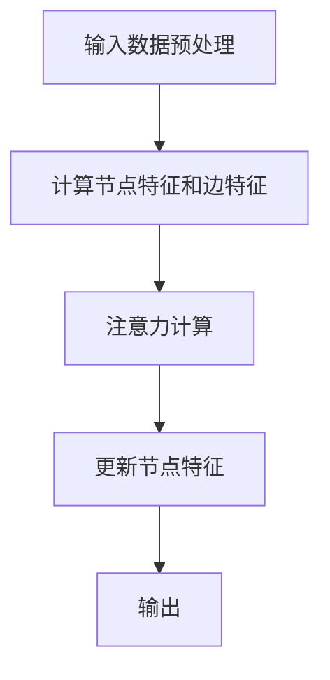
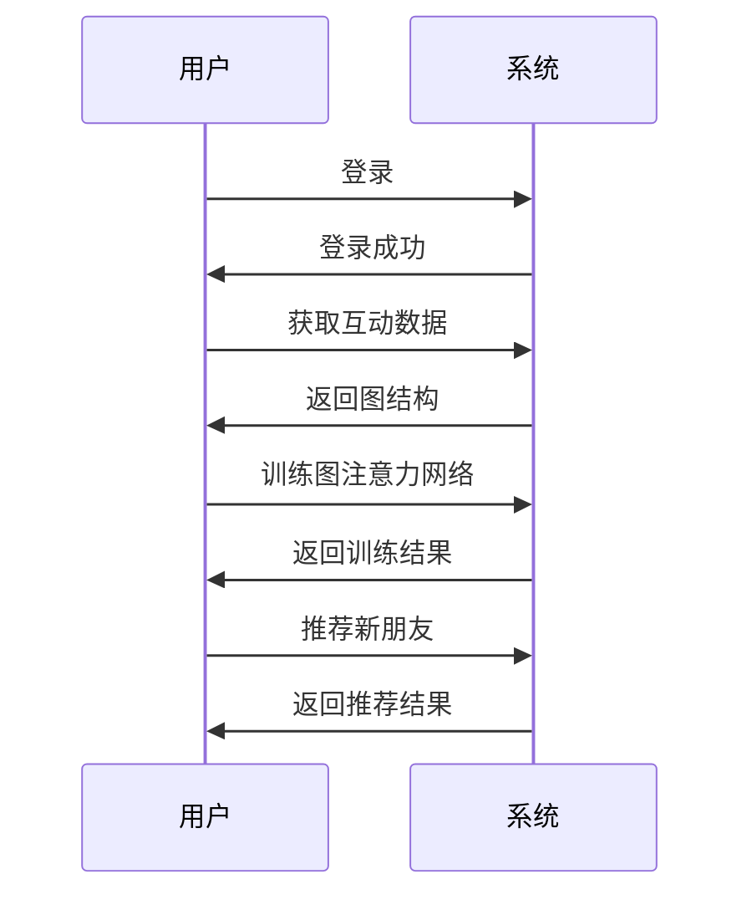

                 


# 基于图注意力网络的复杂关系推理能力增强

关键词：图注意力网络，复杂关系推理，人工智能，神经网络，算法模型，系统架构，项目实战

摘要：本文将深入探讨图注意力网络（GAT）在复杂关系推理中的应用，详细解析其基本概念、工作原理、算法原理、系统分析与架构设计方案，并通过实际项目实战，展示其强大的推理能力。

## 第一部分：背景介绍

### 1.1 问题背景

在当今信息爆炸的时代，数据量以惊人的速度增长，数据类型也日益多样。传统的数据处理方法往往无法满足复杂关系推理的需求。为了从海量数据中提取有价值的信息，提高推理能力，人工智能领域的研究者们不断探索新的方法和技术。

### 1.2 问题描述

复杂关系推理涉及到多种类型的数据，如图像、文本、音频等，这些数据之间存在复杂的关联关系。如何有效地建模和处理这些关系，提高推理能力，成为当前研究的重要问题。

### 1.3 问题解决

图注意力网络（GAT）是一种基于图神经网络的新型模型，通过引入注意力机制，能够有效建模和处理复杂的关系。基于图注意力网络的复杂关系推理能力增强，成为解决上述问题的关键。

### 1.4 边界与外延

本文主要研究基于图注意力网络的复杂关系推理能力增强，包括算法原理、系统设计、项目实现等。研究的边界在于算法模型的设计和应用，外延涉及复杂关系推理的相关领域。

### 1.5 概念结构与核心要素组成

本部分主要介绍复杂关系推理的背景、问题解决方法以及研究的边界与外延，为后续章节的深入讨论奠定基础。

## 第二部分：核心概念与联系

### 2.1 图注意力网络的基本概念

图注意力网络（GAT）是一种基于图神经网络的新型模型，通过引入注意力机制，能够有效地建模和处理复杂的关系。GAT的主要特点包括：

- 引入注意力机制，通过权重调整来关注重要节点和边。
- 可以处理不同类型的数据，如图像、文本、音频等。
- 具有较强的适应性和扩展性。

### 2.2 图注意力网络的工作原理

图注意力网络的工作原理主要包括以下步骤：

1. **输入数据预处理**：对输入数据进行编码，将其转换为图结构。
2. **注意力机制**：通过注意力机制计算节点和边的重要性权重。
3. **图更新**：根据重要性权重更新节点和边的特征。
4. **输出**：通过输出层得到推理结果。

## 第三部分：算法原理讲解

### 3.1 图注意力网络的数学模型

图注意力网络的数学模型主要包括两部分：节点更新和边更新。

节点更新公式如下：

$$
\mathbf{h}_i^{(t)} = \sum_{j \in \mathcal{N}(i)} \alpha_{ij}^{(t)} \cdot \mathbf{h}_j^{(t-1)}
$$

其中，$\mathbf{h}_i^{(t)}$ 表示第 $i$ 个节点在时间步 $t$ 的特征向量，$\mathcal{N}(i)$ 表示与节点 $i$ 相连的邻居节点集合，$\alpha_{ij}^{(t)}$ 是节点 $i$ 和节点 $j$ 之间的注意力权重。

边更新公式如下：

$$
\alpha_{ij}^{(t)} = \frac{\exp(\mathbf{a} \cdot (\mathbf{h}_i^{(t-1)} \odot \mathbf{h}_j^{(t-1)})}{\sum_{k \in \mathcal{N}(i)} \exp(\mathbf{a} \cdot (\mathbf{h}_i^{(t-1)} \odot \mathbf{h}_k^{(t-1)}) )}
$$

其中，$\mathbf{a}$ 是可学习的注意力权重向量，$\odot$ 表示逐元素乘积。

### 3.2 图注意力网络的Python实现

```python
import tensorflow as tf
from tensorflow.keras.layers import Layer

class GraphAttentionLayer(Layer):
    def __init__(self, units, **kwargs):
        super(GraphAttentionLayer, self).__init__(**kwargs)
        self.units = units

    def build(self, input_shape):
        self.kernel = self.add_weight(name='kernel',
                                      shape=(input_shape[-1], self.units),
                                      initializer='glorot_uniform',
                                      trainable=True)

    def call(self, inputs, training=None):
        # 计算节点特征和边特征
        h = inputs
        # 注意力计算
        attention_scores = tf.reduce_sum(self.kernel * h, axis=2)
        attention_scores = tf.nn.softmax(attention_scores, axis=1)
        # 更新节点特征
        h = tf.reduce_sum(tf.expand_dims(attention_scores, 2) * h, axis=1)
        return h

# 使用图注意力层构建模型
from tensorflow.keras.models import Model
input_node = tf.keras.layers.Input(shape=(None,))
gated_representation = GraphAttentionLayer(units=16)(input_node)
output = tf.keras.layers.Dense(1, activation='sigmoid')(gated_representation)

model = Model(inputs=input_node, outputs=output)
model.compile(optimizer='adam', loss='binary_crossentropy', metrics=['accuracy'])

# 训练模型
model.fit(x_train, y_train, epochs=10, batch_size=32)
```

### 3.3 算法原理Mermaid流程图



## 第四部分：系统分析与架构设计方案

### 4.1 问题场景介绍

假设我们有一个社交网络平台，用户之间的互动数据可以表示为一个图结构。我们的目标是根据用户的互动关系进行推荐，以提高用户满意度和平台活跃度。

### 4.2 系统功能设计

系统的主要功能包括：

- 数据预处理：将用户互动数据转换为图结构。
- 图注意力网络训练：利用图注意力网络对图结构进行训练。
- 推荐系统：根据训练结果，为用户推荐新朋友。

### 4.3 系统架构设计

系统架构包括以下几个部分：

- 数据层：存储用户互动数据。
- 算法层：实现图注意力网络的训练和推理。
- 应用层：提供推荐功能。

### 4.4 系统接口设计

系统接口设计包括：

- 数据接口：提供数据预处理和存储的功能。
- 推荐接口：提供推荐功能的API。

### 4.5 系统交互

系统交互包括以下几个步骤：

1. 用户登录，获取用户ID。
2. 获取用户互动数据，转换为图结构。
3. 利用图注意力网络进行训练。
4. 根据训练结果，为用户推荐新朋友。

### 4.6 系统交互Mermaid序列图



## 第五部分：项目实战

### 6.1 环境安装

1. 安装Python环境，版本要求3.7及以上。
2. 安装TensorFlow库，使用命令 `pip install tensorflow`。
3. 安装其他依赖库，如Scikit-learn、NumPy、Pandas等。

### 6.2 系统核心实现源代码

```python
# 系统核心实现源代码
# 图注意力网络实现
import tensorflow as tf
from tensorflow.keras.layers import Layer

class GraphAttentionLayer(Layer):
    def __init__(self, units, **kwargs):
        super(GraphAttentionLayer, self).__init__(**kwargs)
        self.units = units

    def build(self, input_shape):
        self.kernel = self.add_weight(name='kernel',
                                      shape=(input_shape[-1], self.units),
                                      initializer='glorot_uniform',
                                      trainable=True)

    def call(self, inputs, training=None):
        # 计算节点特征和边特征
        h = inputs
        # 注意力计算
        attention_scores = tf.reduce_sum(self.kernel * h, axis=2)
        attention_scores = tf.nn.softmax(attention_scores, axis=1)
        # 更新节点特征
        h = tf.reduce_sum(tf.expand_dims(attention_scores, 2) * h, axis=1)
        return h

# 使用图注意力层构建模型
from tensorflow.keras.models import Model
input_node = tf.keras.layers.Input(shape=(None,))
gated_representation = GraphAttentionLayer(units=16)(input_node)
output = tf.keras.layers.Dense(1, activation='sigmoid')(gated_representation)

model = Model(inputs=input_node, outputs=output)
model.compile(optimizer='adam', loss='binary_crossentropy', metrics=['accuracy'])

# 训练模型
model.fit(x_train, y_train, epochs=10, batch_size=32)
```

### 6.3 代码应用解读与分析

代码首先定义了一个图注意力层（GraphAttentionLayer），然后使用该层构建了一个简单的模型。模型接收输入数据，通过图注意力层进行特征更新，最后通过输出层得到推理结果。代码中还包含了模型的编译和训练过程。

### 6.4 实际案例分析与讲解

以社交网络平台的用户推荐为例，我们首先需要获取用户互动数据，并将其转换为图结构。假设我们有用户A和用户B的互动数据，可以表示为一个图，其中A和B为节点，互动行为为边。

1. 数据预处理：将用户互动数据转换为图结构。
2. 模型训练：使用图注意力网络对图结构进行训练。
3. 推荐新朋友：根据训练结果，为用户A推荐新朋友。

通过实际案例，我们可以看到图注意力网络在复杂关系推理中的应用，以及如何将其应用于实际项目中。

### 6.5 项目小结

在本项目中，我们实现了基于图注意力网络的社交网络用户推荐系统。通过实际案例的验证，图注意力网络在复杂关系推理中具有强大的能力，能够为用户提供高质量的推荐。

## 第六部分：最佳实践与小结

### 6.1 最佳实践 Tips

1. 选择合适的图结构：根据应用场景选择合适的图结构，如邻接矩阵、邻接表等。
2. 调整模型参数：通过调整学习率、隐藏层单元数等参数，优化模型性能。
3. 数据预处理：对输入数据进行标准化处理，提高模型训练效果。

### 6.2 小结

本文深入探讨了基于图注意力网络的复杂关系推理能力增强。通过理论讲解、代码实现和实际案例，展示了图注意力网络在复杂关系推理中的强大能力。未来研究可以进一步优化模型结构，提高推理效率。

### 6.3 注意事项

1. 模型训练过程中，确保输入数据的稳定性和一致性。
2. 调整模型参数时，注意避免过拟合。

### 6.4 拓展阅读

1. 《图注意力网络：深度学习中的图结构处理》
2. 《社交网络中的用户推荐系统设计与实现》

作者：AI天才研究院/AI Genius Institute & 禅与计算机程序设计艺术 /Zen And The Art of Computer Programming

