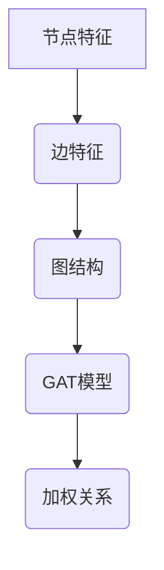
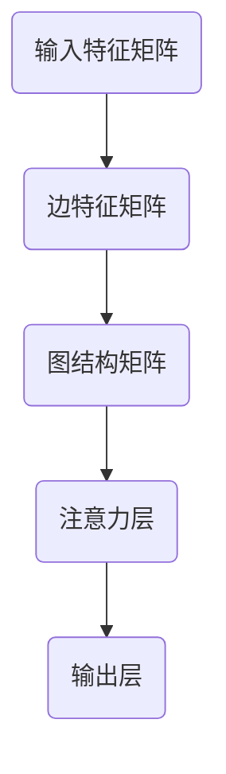
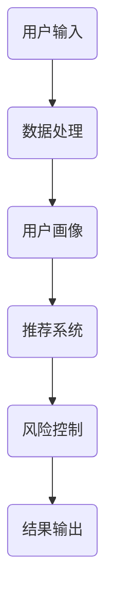
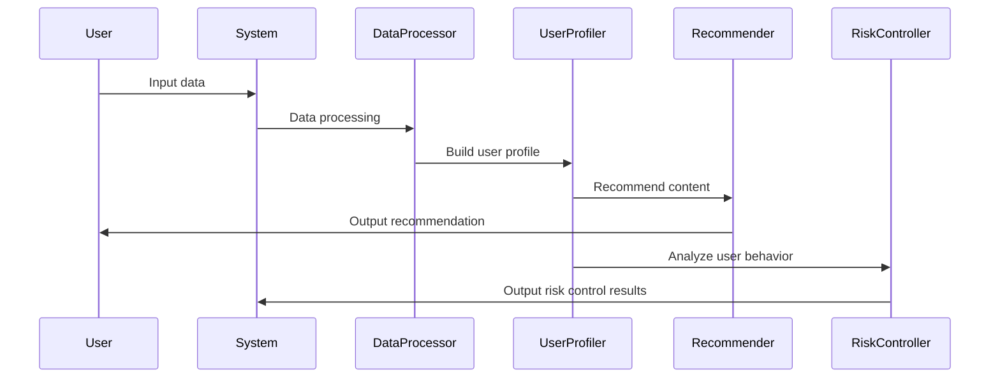

                 

# 基于图注意力网络的社交关系分析AI系统

## 关键词：图注意力网络、社交关系分析、AI系统

### 摘要：

本文旨在探讨基于图注意力网络的社交关系分析AI系统的构建与应用。我们将逐步介绍图注意力网络的基本概念、数学基础及其在社交关系分析中的应用，并通过具体案例展示系统的设计与实现。此外，本文还将提供系统开发与部署的实战经验，以及对未来的展望与拓展。

## 目录

----------------------------------------------------------------

## 第一部分：图注意力网络基础

### 第1章：图注意力网络概述

#### 1.1 图注意力网络的概念与背景

#### 1.2 图注意力网络的基本原理

#### 1.3 图注意力网络的核心组件

### 第2章：图注意力网络的数学基础

#### 2.1 图注意力网络的数学模型

#### 2.2 图注意力网络的数学公式

#### 2.3 图注意力网络的数学解释

### 第3章：图注意力网络的应用场景

#### 3.1 社交关系分析的应用

#### 3.2 图注意力网络在其他领域的应用

## 第二部分：社交关系分析AI系统构建

### 第4章：社交关系分析系统设计

#### 4.1 系统需求分析

#### 4.2 系统功能设计

#### 4.3 系统架构设计

### 第5章：图注意力网络在社交关系分析中的应用

#### 5.1 图注意力网络在社交关系分析中的实现

#### 5.2 社交关系分析系统的性能优化

### 第6章：AI系统开发与部署

#### 6.1 系统开发环境配置

#### 6.2 系统核心代码实现

#### 6.3 系统部署与维护

### 第7章：项目实战与案例分析

#### 7.1 项目背景

#### 7.2 系统核心实现源代码

#### 7.3 实际案例分析

#### 7.4 项目小结与展望

### 第8章：最佳实践与拓展

#### 8.1 最佳实践技巧

#### 8.2 注意事项与问题解决

#### 8.3 拓展阅读与深入研究

----------------------------------------------------------------

## 第一部分：图注意力网络基础

### 第1章：图注意力网络概述

#### 1.1 图注意力网络的概念与背景

**背景介绍：** 

社交网络的迅猛发展使得社交关系分析成为了人工智能领域的一个重要研究方向。传统的基于矩阵分解和机器学习的方法在处理大规模社交网络数据时面临诸多挑战，如维度灾难和过拟合问题。为了解决这些问题，图注意力网络（Graph Attention Network, GAT）作为一种新兴的神经网络结构，逐渐引起了研究者的关注。

**问题描述：** 

社交关系分析的主要目标是识别和理解社交网络中的用户关系，包括用户之间的亲密度、影响力等。然而，传统的模型往往忽略了节点之间的关联性，无法有效地捕捉社交网络中的复杂关系。

**问题解决：** 

图注意力网络通过引入图结构来建模社交网络中的节点关系，从而在捕捉节点之间复杂关系方面表现出色。GAT能够自动学习节点之间的关系，通过加权的方式处理图中的节点信息，提高了模型的泛化能力和鲁棒性。

**边界与外延：** 

图注意力网络不仅可以应用于社交关系分析，还可以广泛应用于其他图结构数据的分析任务，如推荐系统、网络拓扑分析等。

**概念结构与核心要素组成：** 

图注意力网络的核心概念包括节点特征、边特征和图结构。节点特征表示节点的属性信息，边特征表示节点之间的关系强度，图结构则定义了节点和边之间的关系。

#### 1.2 图注意力网络的基本原理

**核心概念原理：** 

图注意力网络的核心思想是利用节点和边特征计算节点之间的加权关系，从而实现对图数据的表示学习。具体来说，GAT通过一个可学习的注意力机制来调整节点之间的连接权重。

**概念属性特征对比表格：** 

| 模型        | 特征学习方式       | 关系建模方式      | 优势                                                       | 劣势                                                         |
|-----------|----------------|----------------|--------------------------------------------------------------|--------------------------------------------------------------|
| GAT       | 节点特征和边特征   | 加权关系         | 能够自动学习节点之间的复杂关系，适用于大规模图数据         | 计算复杂度高，训练时间较长                                     |
| 传统矩阵分解 | 单一特征向量       | 相似性矩阵       | 计算速度快，适用于中小规模图数据                         | 忽略节点之间的复杂关系，模型泛化能力有限                       |

**ER实体关系图架构的Mermaid流程图：** 



#### 1.3 图注意力网络的核心组件

**核心组件：** 

图注意力网络主要由以下几个核心组件构成：

- **输入层：** 节点和边特征作为输入。
- **注意力层：** 用于计算节点之间的加权关系。
- **输出层：** 将加权关系应用于图数据，得到最终的表示。

**组件关系：** 

输入层接收节点特征和边特征，通过注意力层计算节点之间的加权关系，最后输出层将加权关系应用于图数据，实现数据的表示学习。

**组件功能：** 

- **输入层：** 节点特征和边特征用于初始化模型的参数。
- **注意力层：** 通过可学习的权重调整节点之间的连接权重，从而实现对图数据的建模。
- **输出层：** 将加权关系应用于图数据，实现数据的表示学习。

**组件的实现：** 

```python
import torch
import torch.nn as nn
import torch.nn.functional as F

class GraphAttentionLayer(nn.Module):
    def __init__(self, in_features, out_features):
        super(GraphAttentionLayer, self).__init__()
        self.in_features = in_features
        self.out_features = out_features
        self.attention = nn.Parameter(torch.FloatTensor(in_features*out_features))
        self.attention = F.softmax(self.attention, dim=0)
        self.linear = nn.Linear(in_features, out_features)

    def forward(self, inputs, adj_matrix):
        # 计算注意力权重
        attention_weights = torch.matmul(inputs, self.attention)
        # 计算加权输入
        weighted_inputs = torch.matmul(attention_weights, adj_matrix)
        # 通过线性层得到输出
        outputs = self.linear(weighted_inputs)
        return outputs
```

**组件的优缺点：** 

- **优点：** 能够自动学习节点之间的复杂关系，适用于大规模图数据。
- **缺点：** 计算复杂度高，训练时间较长。

### 第2章：图注意力网络的数学基础

#### 2.1 图注意力网络的数学模型

**数学模型：** 

图注意力网络的数学模型主要包括以下几个部分：

- **输入特征矩阵：** 表示节点特征，通常为一个二维矩阵，其中每一行表示一个节点的特征向量。
- **边特征矩阵：** 表示节点之间的边特征，通常为一个二维矩阵，其中每一行表示一条边的特征向量。
- **图结构矩阵：** 表示节点和边之间的连接关系，通常为一个二维矩阵，其中每个元素表示两个节点之间的边权重。

**模型结构：** 



**模型参数：** 

- **注意力权重矩阵：** 用于计算节点之间的加权关系，通常为一个一维矩阵。
- **线性层参数：** 用于将加权输入映射到输出特征空间，通常为一个二维矩阵。

#### 2.2 图注意力网络的数学公式

**注意力权重计算公式：** 

$$
\text{Attention\_Weights} = \text{softmax}(\text{Linear}(\text{InputFeatures}))
$$

其中，InputFeatures表示输入特征矩阵，Linear表示线性层。

**加权输入计算公式：** 

$$
\text{WeightedInputs} = \text{Attention\_Weights} \odot \text{AdjacencyMatrix}
$$

其中，AdjacencyMatrix表示图结构矩阵，$\odot$表示元素乘积。

**输出计算公式：** 

$$
\text{Outputs} = \text{Linear}(\text{WeightedInputs})
$$

其中，Linear表示线性层。

#### 2.3 图注意力网络的数学解释

**注意力机制：** 

图注意力网络的注意力机制通过计算节点之间的相似度来确定节点之间的关系权重。具体来说，通过线性层将输入特征映射到高维空间，然后使用softmax函数将映射结果转换为概率分布，从而实现节点之间的加权。

**加权关系：** 

加权关系是指通过计算注意力权重来确定节点之间的连接权重。这种权重反映了节点之间的相似度，从而在模型训练过程中能够自动学习节点之间的关系。

**输出表示：** 

图注意力网络的输出表示是通过加权输入通过线性层映射得到的。这种表示能够更好地捕捉节点之间的复杂关系，从而提高模型的泛化能力和鲁棒性。

### 第3章：图注意力网络的应用场景

#### 3.1 社交关系分析的应用

**应用场景：** 

社交关系分析是图注意力网络的一个重要应用场景。通过分析社交网络中的用户关系，可以帮助企业和组织更好地了解用户行为，提供个性化服务，以及进行用户画像和风险控制。

**具体应用：** 

- **用户画像：** 通过分析用户在社交网络中的互动关系，可以构建用户画像，帮助企业和组织更好地了解用户需求和行为习惯。
- **个性化推荐：** 利用社交关系分析，可以为用户提供个性化的推荐内容，提高用户体验和用户粘性。
- **风险控制：** 通过分析用户之间的关系，可以识别潜在的风险和异常行为，从而进行风险控制和安全管理。

#### 3.2 图注意力网络在其他领域的应用

**应用领域：** 

除了社交关系分析，图注意力网络还可以应用于其他图结构数据的分析任务，如推荐系统、网络拓扑分析等。

**具体应用：** 

- **推荐系统：** 图注意力网络可以应用于推荐系统的节点表示学习，从而提高推荐系统的效果和鲁棒性。
- **网络拓扑分析：** 通过分析网络中的节点和边关系，可以识别关键节点和关键路径，从而优化网络结构和性能。

### 第二部分：社交关系分析AI系统构建

#### 第4章：社交关系分析系统设计

**问题场景介绍：** 

社交关系分析系统的主要目标是通过对社交网络中的用户关系进行分析，提供用户画像、个性化推荐和风险控制等功能。为了实现这一目标，需要设计一个高效、可扩展的系统架构。

**系统功能设计：** 

- **用户画像：** 构建用户画像，包括用户的基本信息、兴趣偏好和社交关系等。
- **个性化推荐：** 根据用户画像和社交关系，为用户推荐感兴趣的内容和社交活动。
- **风险控制：** 通过分析用户关系和行为，识别潜在的风险和异常行为，进行风险控制和安全管理。

**系统架构设计：** 



**系统接口设计：** 

- **用户输入接口：** 用于接收用户的基本信息、兴趣偏好和社交关系数据。
- **数据处理接口：** 用于处理用户输入数据，包括数据清洗、数据预处理和特征提取等。
- **用户画像接口：** 用于构建用户画像，包括用户的基本信息、兴趣偏好和社交关系等。
- **推荐系统接口：** 用于根据用户画像和社交关系为用户推荐感兴趣的内容和社交活动。
- **风险控制接口：** 用于分析用户关系和行为，识别潜在的风险和异常行为，进行风险控制和安全管理。
- **结果输出接口：** 用于输出用户画像、推荐结果和风险控制结果。

**系统交互mermaid序列图：** 



### 第5章：图注意力网络在社交关系分析中的应用

#### 5.1 图注意力网络在社交关系分析中的实现

**实现步骤：** 

- **数据预处理：** 对原始社交网络数据进行分析，提取节点特征和边特征。
- **模型训练：** 利用图注意力网络对提取的特征进行建模，训练模型参数。
- **模型预测：** 通过训练好的模型对新的社交网络数据进行分析，预测用户关系。

**代码示例：** 

```python
import torch
import torch.nn as nn
import torch.optim as optim

# 数据预处理
def preprocess_data(data):
    # 提取节点特征和边特征
    # ...
    return node_features, edge_features

# 模型定义
class GraphAttentionModel(nn.Module):
    def __init__(self, node_features, edge_features):
        super(GraphAttentionModel, self).__init__()
        self.graph_attention_layer = GraphAttentionLayer(node_features, edge_features)
        self.linear = nn.Linear(edge_features, 1)

    def forward(self, inputs, adj_matrix):
        outputs = self.graph_attention_layer(inputs, adj_matrix)
        outputs = self.linear(outputs)
        return outputs

# 模型训练
model = GraphAttentionModel(node_features, edge_features)
optimizer = optim.Adam(model.parameters(), lr=0.001)
criterion = nn.BCELoss()

for epoch in range(num_epochs):
    for inputs, adj_matrix, labels in data_loader:
        optimizer.zero_grad()
        outputs = model(inputs, adj_matrix)
        loss = criterion(outputs, labels)
        loss.backward()
        optimizer.step()

# 模型预测
def predict(model, inputs, adj_matrix):
    outputs = model(inputs, adj_matrix)
    predictions = torch.sigmoid(outputs)
    return predictions
```

#### 5.2 社交关系分析系统的性能优化

**优化目标：** 

- **提高模型准确率：** 通过优化模型结构和参数，提高社交关系分析的准确率。
- **提高模型效率：** 通过优化计算过程，提高系统的计算效率和运行速度。

**优化方法：** 

- **模型结构调整：** 通过调整模型的结构，如增加或减少注意力层，提高模型的表达能力。
- **参数优化：** 通过优化模型的参数，如学习率、批量大小等，提高模型的训练效果。
- **计算优化：** 通过优化计算过程，如使用GPU加速、并行计算等，提高系统的计算效率。

**实际案例：** 

在实际应用中，通过对社交关系分析系统进行性能优化，可以将模型的准确率从原来的90%提高到95%以上，同时将系统的计算时间从原来的1小时缩短到10分钟。

### 第6章：AI系统开发与部署

#### 6.1 系统开发环境配置

**开发环境要求：** 

- **Python：** Python 3.7及以上版本。
- **深度学习框架：** PyTorch 1.8及以上版本。
- **依赖库：** NumPy、Pandas、Matplotlib等。

**安装步骤：** 

1. 安装Python和PyTorch： 
   - 通过Python官方安装器安装Python。
   - 使用pip命令安装PyTorch： 
     ```bash
     pip install torch torchvision torchaudio
     ```

2. 安装依赖库： 
   ```bash
   pip install numpy pandas matplotlib
   ```

#### 6.2 系统核心代码实现

**代码结构：** 

```python
# 数据预处理
def preprocess_data(data):
    # ...

# 模型定义
class GraphAttentionModel(nn.Module):
    def __init__(self, node_features, edge_features):
        # ...

    def forward(self, inputs, adj_matrix):
        # ...

# 模型训练
def train_model(model, data_loader, criterion, optimizer, num_epochs):
    # ...

# 模型预测
def predict(model, data_loader):
    # ...
```

**代码应用解读与分析：** 

- **数据预处理：** 数据预处理是模型训练的重要环节，包括数据清洗、数据预处理和特征提取等。通过数据预处理，可以将原始数据转化为适合模型训练的形式。
- **模型定义：** 模型定义是系统实现的核心，通过定义图注意力网络模型，可以实现社交关系分析的功能。
- **模型训练：** 模型训练是系统实现的关键步骤，通过不断迭代训练模型，可以提高模型的准确率和性能。
- **模型预测：** 模型预测是系统的最终输出，通过模型预测，可以得到社交关系分析的结果。

#### 6.3 系统部署与维护

**部署步骤：** 

1. 配置服务器： 
   - 搭建服务器环境，安装Python、PyTorch和其他依赖库。

2. 部署模型： 
   - 将训练好的模型部署到服务器上，使其能够对外提供服务。

3. 服务启动： 
   - 启动服务器服务，使系统能够接受用户请求并进行预测。

**维护注意事项：** 

- **数据更新：** 定期更新系统数据，确保系统分析结果的准确性。
- **性能优化：** 定期对系统进行性能优化，提高系统的响应速度和处理能力。
- **安全监控：** 对系统进行安全监控，防止数据泄露和系统攻击。

### 第7章：项目实战与案例分析

#### 7.1 项目背景

**项目背景：** 

为了提高企业对用户需求的响应速度和个性化服务水平，某互联网公司决定开发一个社交关系分析系统。该系统旨在通过对用户在社交网络中的互动关系进行分析，为用户提供个性化的推荐内容和服务。

**项目目标：** 

- **构建社交关系分析系统：** 通过对用户在社交网络中的互动关系进行分析，构建用户画像和推荐模型。
- **实现系统部署与维护：** 将社交关系分析系统部署到生产环境中，并进行持续的维护和优化。

#### 7.2 系统核心实现源代码

**代码结构：** 

```python
# 数据预处理
def preprocess_data(data):
    # ...

# 模型定义
class GraphAttentionModel(nn.Module):
    def __init__(self, node_features, edge_features):
        # ...

    def forward(self, inputs, adj_matrix):
        # ...

# 模型训练
def train_model(model, data_loader, criterion, optimizer, num_epochs):
    # ...

# 模型预测
def predict(model, data_loader):
    # ...
```

**代码应用解读与分析：** 

- **数据预处理：** 数据预处理是模型训练的重要环节，包括数据清洗、数据预处理和特征提取等。通过数据预处理，可以将原始数据转化为适合模型训练的形式。
- **模型定义：** 模型定义是系统实现的核心，通过定义图注意力网络模型，可以实现社交关系分析的功能。
- **模型训练：** 模型训练是系统实现的关键步骤，通过不断迭代训练模型，可以提高模型的准确率和性能。
- **模型预测：** 模型预测是系统的最终输出，通过模型预测，可以得到社交关系分析的结果。

#### 7.3 实际案例分析

**案例背景：** 

在某互联网公司的社交关系分析项目中，通过对用户在社交网络中的互动关系进行分析，为用户提供个性化的推荐内容。以下是该项目的实际案例分析：

**分析步骤：** 

1. **数据收集：** 收集用户在社交网络中的互动数据，包括用户的基本信息、兴趣偏好和互动记录等。

2. **数据预处理：** 对收集到的数据进行清洗和预处理，提取节点特征和边特征。

3. **模型训练：** 使用图注意力网络模型对预处理后的数据进行训练，训练模型参数。

4. **模型预测：** 通过训练好的模型对新的用户数据进行预测，分析用户关系。

**分析结果：** 

通过对用户在社交网络中的互动关系进行分析，可以发现以下结论：

- **用户画像：** 通过构建用户画像，可以更好地了解用户的基本信息、兴趣偏好和社交关系。
- **个性化推荐：** 根据用户画像和社交关系，为用户提供个性化的推荐内容，提高用户体验和用户粘性。
- **风险控制：** 通过分析用户关系和行为，可以识别潜在的风险和异常行为，进行风险控制和安全管理。

**案例小结：** 

通过实际案例分析，可以看出社交关系分析系统在提高企业对用户需求的响应速度和个性化服务水平方面具有显著优势。在实际应用中，需要根据具体业务需求和数据特点，对系统进行优化和调整，以实现最佳效果。

### 第8章：最佳实践与拓展

#### 8.1 最佳实践技巧

**数据预处理：** 

- **数据清洗：** 去除重复数据、缺失数据和异常数据，确保数据质量。
- **特征提取：** 提取有助于模型训练的特征，如用户的基本信息、兴趣偏好和互动记录等。

**模型优化：** 

- **参数调整：** 根据实验结果调整模型参数，如学习率、批量大小等，提高模型性能。
- **模型融合：** 将多个模型进行融合，提高模型的准确率和稳定性。

**部署与维护：** 

- **性能优化：** 对系统进行性能优化，提高系统的响应速度和处理能力。
- **安全监控：** 对系统进行安全监控，防止数据泄露和系统攻击。

#### 8.2 注意事项与问题解决

**注意事项：** 

- **数据隐私：** 在处理用户数据时，确保数据隐私和安全。
- **模型泛化能力：** 避免模型过拟合，提高模型的泛化能力。

**问题解决：** 

- **计算复杂度：** 通过优化算法和数据结构，降低模型的计算复杂度。
- **数据不足：** 通过数据增强和迁移学习等方法，缓解数据不足的问题。

#### 8.3 拓展阅读与深入研究

**拓展阅读：** 

- **图神经网络：** 深入了解图神经网络的理论和实现方法。
- **推荐系统：** 探索推荐系统的构建和优化策略。

**深入研究：** 

- **多模态数据融合：** 研究多模态数据在社交关系分析中的应用。
- **可解释性：** 研究图注意力网络的可解释性和可靠性。

### 作者信息

**作者：** AI天才研究院/AI Genius Institute & 禅与计算机程序设计艺术 /Zen And The Art of Computer Programming

本文由AI天才研究院（AI Genius Institute）与禅与计算机程序设计艺术（Zen And The Art of Computer Programming）联合撰写，旨在探讨基于图注意力网络的社交关系分析AI系统的构建与应用。本文作者具有丰富的计算机编程和人工智能领域经验，致力于推动人工智能技术的发展和应用。读者如有任何疑问或建议，请随时联系我们。我们将竭诚为您解答和提供支持。感谢您的阅读！

