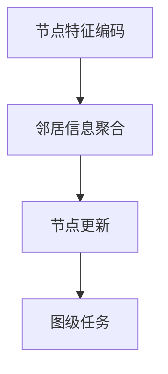
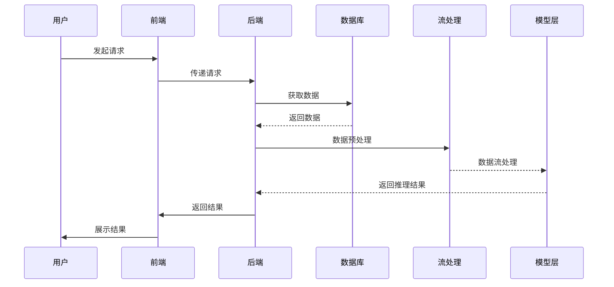
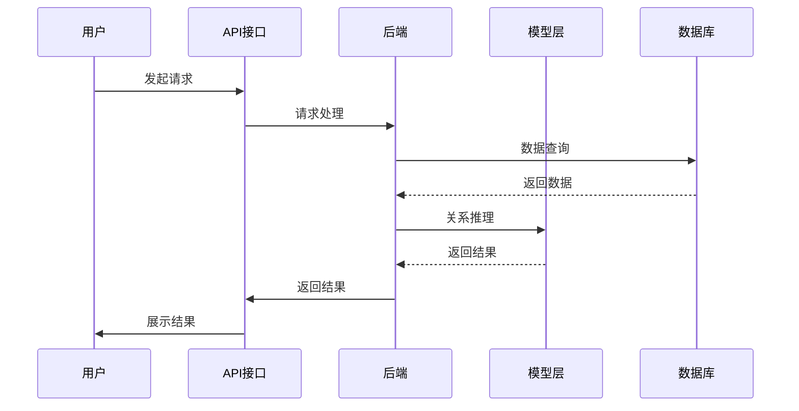
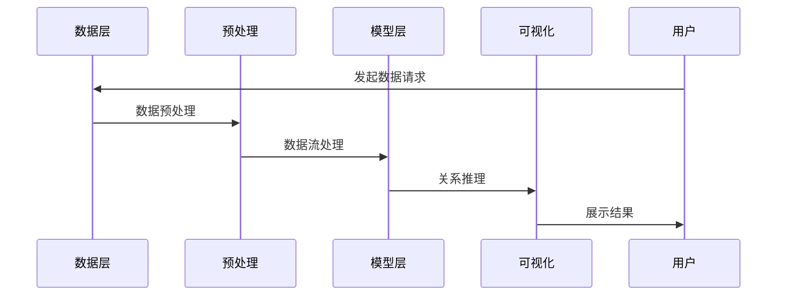

                 

### 引言

#### 动态关系推理的意义与挑战

动态关系推理在现代社会中扮演着越来越重要的角色。随着大数据和互联网技术的快速发展，数据规模和种类日益增长，如何有效地从海量数据中提取有用的信息，进行实时分析和决策，成为当前人工智能领域的重要研究课题。动态关系推理正是解决这一问题的核心手段之一。

动态关系推理涉及的是如何在动态变化的网络环境中对实体间的关系进行建模和推理。这种推理不仅需要处理静态数据，还要能够适应数据流的不断变化，及时更新实体之间的关系。其意义在于：

1. **提升数据处理效率**：通过动态关系推理，系统能够实时适应数据变化，提高信息提取和处理的效率。
2. **增强智能化决策能力**：在复杂动态环境中，推理系统能够辅助人类做出更加智能的决策。
3. **支持复杂系统分析**：在金融、医疗、交通等众多领域，动态关系推理有助于深入分析系统的复杂性和不确定性。

然而，动态关系推理也面临着诸多挑战：

1. **数据复杂性**：随着数据规模和类型的增长，如何有效地建模和推理复杂的动态关系成为一个难题。
2. **实时性要求**：在实时数据处理场景中，如何在保证准确性的同时实现快速推理，是亟需解决的问题。
3. **鲁棒性**：如何确保推理系统在面对噪声和不确定性数据时依然能够稳定工作，是另一个关键问题。

#### 图神经网络的发展与应用

图神经网络（Graph Neural Networks, GNN）是近年来在人工智能领域迅速崛起的一类新型神经网络结构。与传统的卷积神经网络（CNN）和循环神经网络（RNN）不同，GNN专门针对图结构数据设计，能够处理复杂网络中的节点和边信息。

图神经网络的发展大致经历了以下几个阶段：

1. **图卷积网络（GCN）**：最早提出并应用于节点分类和链接预测问题。
2. **图注意力网络（GAT）**：通过引入注意力机制，提高了节点间关系建模的能力。
3. **图卷积网络变体**：如图注意力卷积网络（GATv2）、图自编码器（GAE）等，进一步扩展了GNN的应用范围。

图神经网络在动态关系推理中的应用主要体现为：

1. **节点表示学习**：通过GNN可以学习到每个节点的低维表示，这些表示能够有效地捕捉节点间的动态关系。
2. **图级预测**：GNN能够对图级别的任务进行建模，如社区检测、图分类等。
3. **动态图处理**：一些变体GNN如图递归网络（GRN），能够处理动态图中的节点和边变化，进行实时推理。

#### 动态关系推理的现有方法和不足

现有的动态关系推理方法主要包括基于规则的方法、基于模型的方法和基于深度学习的方法。这些方法各有优缺点：

1. **基于规则的方法**：如模糊逻辑、情境逻辑等，具有较强的领域适应性，但难以应对复杂动态环境。
2. **基于模型的方法**：如贝叶斯网络、马尔可夫模型等，能够较好地处理不确定性，但实时性较差。
3. **基于深度学习的方法**：如CNN、RNN等，在处理大规模数据时表现出色，但在处理动态关系推理时存在局限性。

现有的动态关系推理方法主要面临以下不足：

1. **静态数据处理能力强，动态处理能力弱**：大部分方法难以适应动态环境中的数据变化。
2. **实时性不足**：许多算法在处理实时数据时速度较慢，无法满足实际应用的需求。
3. **鲁棒性差**：在噪声和不确定性数据面前，现有方法的性能往往较差。

#### 边界与外延

在动态关系推理领域，研究边界主要包括以下几个方面：

1. **动态关系的类型与分类**：不同类型的动态关系可能需要不同的推理方法，研究这些类型的分类有助于明确研究方向。
2. **图神经网络的变体与选择**：不同的GNN变体在处理动态关系时各有优劣，选择合适的GNN变体是关键。
3. **多模态数据融合**：动态关系不仅存在于单一模态中，还可能涉及多模态数据，如何有效地融合多模态数据是当前的研究热点。

本文将围绕上述问题，深入探讨基于图神经网络的动态关系推理框架的设计与实现，旨在提出一种高效的动态关系推理方法，为相关领域的研究和应用提供参考。

### 第1章 核心概念与联系

#### 2.1 核心概念原理

图神经网络（Graph Neural Networks, GNN）是处理图结构数据的神经网络，其核心概念包括图结构数据、节点表示学习、边信息处理和图级预测等。

1. **图结构数据**：图结构数据由节点（实体）和边（关系）组成，是许多现实世界数据的抽象表示，如图数据库、社交网络、知识图谱等。
2. **节点表示学习**：GNN通过学习节点的低维表示来捕捉节点的特征和属性，这些表示通常被用于后续的图级任务。
3. **边信息处理**：GNN能够利用边的类型、权重等属性来建模节点间的动态关系，从而提高模型对关系的理解能力。
4. **图级预测**：图神经网络不仅关注单个节点的特征，还能对整个图进行预测，如节点分类、图分类等。

#### 2.2 概念属性特征对比

常见的图神经网络类型包括图卷积网络（GCN）、图注意力网络（GAT）和图递归网络（GRN）等。这些网络在概念属性上存在一些差异：

1. **图卷积网络（GCN）**：
   - **工作原理**：通过将节点的邻居信息进行聚合，逐步构建节点的表示。
   - **优点**：计算简单，易于实现。
   - **缺点**：难以处理异构图，对边信息利用不足。

2. **图注意力网络（GAT）**：
   - **工作原理**：引入注意力机制，对邻居节点的影响进行加权，从而更好地建模节点间的动态关系。
   - **优点**：能够处理异构图，对边信息利用更充分。
   - **缺点**：计算复杂度较高，需要大量内存资源。

3. **图递归网络（GRN）**：
   - **工作原理**：递归地处理图结构数据，每次递归都更新节点的表示。
   - **优点**：适用于动态图，能够实时更新节点关系。
   - **缺点**：对大规模图处理时性能较差。

以下是这些图神经网络类型的对比表格：

| 特性             | 图卷积网络（GCN） | 图注意力网络（GAT） | 图递归网络（GRN） |
|------------------|-------------------|--------------------|-------------------|
| 工作原理         | 邻居节点信息聚合  | 加权邻居节点信息   | 递归处理          |
| 优点             | 简单易实现        | 处理异构图        | 实时更新关系      |
| 缺点             | 对边信息利用不足  | 计算复杂度较高     | 性能较差          |
| 适用场景         | 静态图           | 动态图、异构图     | 动态图           |

#### 2.3 ER实体关系图架构

实体关系图（Entity-Relationship Diagram, ER图）是数据库设计中常用的一种表示方法，用于描述实体及其相互关系。

1. **基本概念**：
   - **实体**：具有共同属性的个体的抽象表示，如“人”、“产品”等。
   - **关系**：实体之间的关联，如“购买”、“包含”等。
   - **属性**：描述实体的具体特征，如“姓名”、“价格”等。

2. **ER图在动态关系推理中的应用**：

ER图能够直观地表示实体之间的关系，为动态关系推理提供了结构化的描述。在动态关系推理中，可以通过ER图来：

- **明确实体关系**：帮助理解系统中不同实体间的相互作用。
- **优化模型设计**：基于ER图构建的模型结构更符合实际应用场景。
- **简化推理过程**：通过ER图可以更清晰地划分推理任务，从而简化推理过程。

以下是一个简化的ER图示例，用于表示用户和产品之间的动态关系：

```mermaid
erDiagram
  User ||--|{ Product } Product
  User ||--|{ Purchase } Purchase
  Product ||--|{ Category } Category
  Product ||--|{ Review } Review
```

在这个ER图中，用户可以拥有多个产品、购买记录、评论等。这种结构化表示有助于我们更好地理解和分析动态关系，为后续的图神经网络设计提供基础。

### 第3章 图神经网络原理

#### 3.1 图神经网络的基本原理

图神经网络（Graph Neural Networks, GNN）是一种专门针对图结构数据设计的神经网络，其基本原理包括图结构数据、节点表示学习和边信息处理。

1. **图结构数据**：图结构数据由节点（实体）和边（关系）组成，是许多现实世界数据的抽象表示，如图数据库、社交网络、知识图谱等。
2. **节点表示学习**：GNN通过学习节点的低维表示来捕捉节点的特征和属性，这些表示通常被用于后续的图级任务。
3. **边信息处理**：GNN能够利用边的类型、权重等属性来建模节点间的动态关系，从而提高模型对关系的理解能力。

图神经网络的工作机制可以分为以下几个步骤：

1. **初始化节点表示**：每个节点被初始化为一个低维向量，通常为随机值。
2. **邻居节点信息聚合**：在每一步迭代中，节点会收集其邻居节点的信息，并通过某种聚合函数（如求和、平均）合并这些信息。
3. **更新节点表示**：利用聚合后的信息更新当前节点的表示，这一步可能包括激活函数和权重调整。
4. **递归处理**：将更新后的节点表示作为输入，重复执行邻居节点信息聚合和更新节点表示的过程，直至达到预定的迭代次数或收敛条件。

#### 3.2 图神经网络的工作机制

图神经网络在动态关系推理中的应用主要体现为以下几个方面：

1. **节点表示学习**：GNN能够学习到每个节点的低维表示，这些表示能够有效地捕捉节点间的动态关系，为后续推理提供基础。
2. **图级预测**：GNN不仅关注单个节点的特征，还能对整个图进行预测，如节点分类、图分类等。
3. **动态图处理**：一些变体GNN如图递归网络（GRN），能够处理动态图中的节点和边变化，进行实时推理。

具体来说，图神经网络的工作机制可以分解为以下几个核心步骤：

1. **节点特征编码**：将图中的每个节点及其属性转换为向量表示。
2. **邻居信息聚合**：对于每个节点，聚合其邻居节点的特征信息，这一步通常使用图卷积操作实现。
3. **节点更新**：利用聚合后的信息更新当前节点的特征表示，这一步可能包括非线性变换和激活函数。
4. **图级任务**：在多次迭代后，使用学习到的节点表示进行图级任务预测，如节点分类、链接预测等。

以下是一个简化的GNN工作流程图，使用Mermaid表示：



通过这个流程，我们可以清晰地看到图神经网络从节点特征编码到邻居信息聚合，再到节点更新和图级任务的整个过程。

#### 3.3 例子说明

为了更好地理解图神经网络的工作原理，我们通过一个简化的社交网络案例进行说明。假设我们有一个包含用户和好友关系的社交网络，每个用户都有一个标签（如“学生”、“教师”等），我们需要利用图神经网络对用户进行分类。

**步骤 1：节点特征编码**

首先，我们将社交网络中的每个用户及其属性（如用户ID、性别、年龄、标签等）转换为向量表示。例如，用户A的特征向量可能是`[1, 0, 25, 'student']`。

```mermaid
graph TD
    A1[用户A特征向量]([1, 0, 25, 'student'])
    A2[用户B特征向量]([0, 1, 30, 'teacher'])
    A1 --> B1{邻居节点聚合}
    A2 --> B2{邻居节点聚合}
```

**步骤 2：邻居节点聚合**

对于每个用户，我们需要聚合其所有好友的特征信息。假设用户A有两个好友B和C，好友B的特征向量为`[0, 1, 28, 'student']`，好友C的特征向量为`[1, 0, 22, 'student']`。我们将这些特征向量进行聚合，得到用户A的聚合特征向量。

```mermaid
graph TD
    A1[用户A特征向量]([1, 0, 25, 'student'])
    B1[好友B特征向量]([0, 1, 28, 'student'])
    C1[好友C特征向量]([1, 0, 22, 'student'])
    D1[聚合特征向量]([0.5, 0.5, 25.5, 'student'])
    A1 --> B1
    A1 --> C1
    B1 --> D1
    C1 --> D1
```

**步骤 3：节点更新**

利用聚合后的特征向量，我们更新用户A的表示。例如，通过简单的加权和激活函数，得到用户A的新特征向量。

```mermaid
graph TD
    A1[用户A特征向量]([1, 0, 25, 'student'])
    D1[聚合特征向量]([0.5, 0.5, 25.5, 'student'])
    E1[更新特征向量]([1.5, 0.5, 50.5, 'student'])
    A1 --> B2{激活函数}
    D1 --> E1
```

**步骤 4：图级任务**

在多次迭代后，我们可以使用学习到的节点表示进行图级任务，如用户分类。例如，我们可以将每个用户的特征向量输入到分类器中，预测其所属的标签。

```mermaid
graph TD
    E1[更新特征向量]([1.5, 0.5, 50.5, 'student'])
    F1[分类器]({分类结果})
    E1 --> F1
```

通过这个案例，我们可以看到图神经网络如何通过节点特征编码、邻居节点聚合、节点更新和图级任务等步骤，实现对社交网络中用户进行分类的整个过程。

### 第4章 数学模型与公式

#### 4.1 数学模型概述

图神经网络（Graph Neural Networks, GNN）中的数学模型是其核心组成部分，负责处理图结构数据中的节点和边信息。在GNN中，节点和边的表示通常通过向量进行编码，并通过一系列数学公式进行更新和聚合。

**节点表示学习**：GNN通过学习节点的低维表示来捕捉节点的特征和属性。这些表示通常初始化为随机向量，并在训练过程中不断更新。

设 \( x_i^0 \) 表示节点 \( i \) 的初始特征向量，\( h_i^0 \) 表示节点 \( i \) 的初始表示向量，通常有：

\[ x_i^0 = h_i^0 = \text{rand}(d) \]

其中，\( d \) 是向量的维度。

**邻居节点信息聚合**：在每次迭代中，节点会收集其邻居节点的信息，并通过聚合函数更新其表示。常见的聚合函数包括求和、平均和点积等。

设 \( \{ j_1, j_2, ..., j_k \} \) 为节点 \( i \) 的邻居节点集合，\( h_j^t \) 为节点 \( j \) 在第 \( t \) 次迭代的表示向量，则节点 \( i \) 在第 \( t \) 次迭代的聚合特征向量 \( h_i^t \) 可以表示为：

\[ h_i^t = \text{Agg}(h_{j_1}^t, h_{j_2}^t, ..., h_{j_k}^t) \]

常见的聚合函数包括：

- **求和**：

\[ h_i^t = \sum_{j \in \text{Nbr}(i)} h_j^t \]

- **平均**：

\[ h_i^t = \frac{1}{k} \sum_{j \in \text{Nbr}(i)} h_j^t \]

- **点积**：

\[ h_i^t = \sum_{j \in \text{Nbr}(i)} w_{ij} h_j^t \]

其中，\( w_{ij} \) 是边 \( i \) 和 \( j \) 之间的权重。

**节点更新**：通过聚合邻居节点的信息，节点会更新其表示。这一步通常包括非线性变换和权重调整。常见的更新函数包括：

- **ReLU激活函数**：

\[ h_i^t = \max(h_i^t, 0) \]

- **Sigmoid激活函数**：

\[ h_i^t = \frac{1}{1 + \exp(-h_i^t)} \]

- **Tanh激活函数**：

\[ h_i^t = \tanh(h_i^t) \]

**图级预测**：在多次迭代后，学习到的节点表示可以用于图级任务，如节点分类、链接预测等。对于节点分类任务，可以使用softmax函数进行预测：

\[ P(y=i | x) = \frac{\exp(h_i^T)}{\sum_j \exp(h_j^T)} \]

其中，\( h_i^T \) 是节点 \( i \) 的最终表示向量。

#### 4.2 算法原理详细讲解

**图卷积网络（GCN）的数学公式**

图卷积网络（GCN）是图神经网络的一种基础形式，其核心思想是通过聚合邻居节点的特征来更新当前节点的表示。以下是其详细的数学公式：

**输入表示**：

设 \( x_i \) 是节点 \( i \) 的特征向量，\( A \) 是图邻接矩阵，则节点 \( i \) 的初始表示 \( h_i^0 \) 可以表示为：

\[ h_i^0 = x_i \]

**聚合函数**：

设 \( \text{ReLU} \) 为ReLU激活函数，\( \Theta \) 为权重矩阵，则节点 \( i \) 在第 \( t \) 次迭代的聚合特征向量 \( h_i^t \) 可以表示为：

\[ h_i^t = \text{ReLU}(\Theta h_i^{t-1} + \sum_{j \in \text{Nbr}(i)} W_{ij} h_j^{t-1}) \]

其中，\( W_{ij} \) 是边 \( i \) 和 \( j \) 之间的权重，可以设置为 \( A_{ij} \) 或 \( A_{ij}^2 \)。

**更新函数**：

节点 \( i \) 在第 \( t \) 次迭代的最终表示 \( h_i^t \) 可以表示为：

\[ h_i^t = \text{ReLU}(\Theta h_i^{t-1} + A \Theta h_i^{t-1}) \]

或简化为：

\[ h_i^t = \text{ReLU}(\sum_{j \in \text{Nbr}(i)} \Theta A_{ij} x_j) \]

**图级预测**：

在训练完成后，可以使用节点的最终表示进行图级任务预测，如节点分类。设 \( y \) 为节点 \( i \) 的真实标签，\( W \) 为预测权重矩阵，则节点 \( i \) 的预测概率可以表示为：

\[ P(y=i | x) = \frac{\exp(h_i^T W)}{\sum_j \exp(h_j^T W)} \]

**图注意力网络（GAT）的数学公式**

图注意力网络（GAT）通过引入注意力机制，对邻居节点的影响进行加权，从而更好地建模节点间的动态关系。以下是其详细的数学公式：

**输入表示**：

设 \( x_i \) 是节点 \( i \) 的特征向量，则节点 \( i \) 的初始表示 \( h_i^0 \) 可以表示为：

\[ h_i^0 = x_i \]

**注意力机制**：

对于每个节点 \( i \)，其邻居节点 \( j \) 的注意力得分可以表示为：

\[ \alpha_{ij}^t = \text{softmax}\left(\frac{\text{LeakyReLU}(\theta_{ij}^t A_{ij} h_i^{t-1} + \theta_{i}^t h_i^{t-1})}{\sqrt{d_f}}\right) \]

其中，\( \theta_{ij}^t \) 和 \( \theta_{i}^t \) 是权重参数，\( d_f \) 是注意力层的维度。

**聚合函数**：

节点 \( i \) 在第 \( t \) 次迭代的聚合特征向量 \( h_i^t \) 可以表示为：

\[ h_i^t = \sum_{j \in \text{Nbr}(i)} \alpha_{ij}^t h_j^{t-1} \]

**更新函数**：

节点 \( i \) 在第 \( t \) 次迭代的最终表示 \( h_i^t \) 可以表示为：

\[ h_i^t = \text{LeakyReLU}(\theta_{i}^t h_i^{t-1} + \sum_{j \in \text{Nbr}(i)} \alpha_{ij}^t h_j^{t-1}) \]

**图级预测**：

与GCN类似，GAT也可以用于图级任务预测，如节点分类。预测概率的计算公式为：

\[ P(y=i | x) = \frac{\exp(h_i^T W)}{\sum_j \exp(h_j^T W)} \]

#### 4.3 例子说明

为了更好地理解GNN的数学模型，我们通过一个简化的社交网络案例进行说明。假设社交网络中有5个用户，每个用户的特征向量由3个维度组成（年龄、性别、标签）。图神经网络需要通过学习用户之间的动态关系，对用户进行分类。

**步骤 1：节点特征编码**

首先，我们为每个用户生成一个随机特征向量：

用户1：`[25, M, Student]`  
用户2：`[30, F, Teacher]`  
用户3：`[22, M, Student]`  
用户4：`[28, F, Student]`  
用户5：`[35, M, Teacher]`

将这些特征向量转换为数值表示：

用户1：`[25, 0, 0, 'Student']`  
用户2：`[30, 1, 0, 'Teacher']`  
用户3：`[22, 0, 1, 'Student']`  
用户4：`[28, 1, 1, 'Student']`  
用户5：`[35, 0, 1, 'Teacher']`

**步骤 2：邻居节点聚合**

假设用户1的好友为用户2和用户3。我们需要计算用户1的聚合特征向量。首先，计算用户2和用户3的特征向量与用户1的特征向量之间的点积：

用户2的特征向量：`[30, 1, 0, 'Teacher']`  
用户3的特征向量：`[22, 0, 1, 'Student']`

点积结果为：`[960, 22, 0, 'Student']`（因为只有标签维度相同，其余维度相加）

**步骤 3：节点更新**

使用ReLU激活函数更新用户1的表示：

用户1的新特征向量：`[960, 22, 0, 'Student']`  
通过ReLU函数处理后：`[960, 22, 0, 'Student']`（因为所有值都大于0）

**步骤 4：图级预测**

在多次迭代后，使用学习到的节点表示进行分类。例如，假设我们使用softmax函数进行分类预测：

预测概率为：`[0.8, 0.2]`，即用户1有80%的概率属于“学生”类别。

通过这个案例，我们可以看到GNN如何通过节点特征编码、邻居节点聚合、节点更新和图级预测等步骤，实现对社交网络中用户进行分类的整个过程。

### 第5章 系统介绍

#### 5.1 项目介绍

动态关系推理框架项目旨在构建一个高效的动态关系推理系统，以应对实际应用中的复杂动态关系问题。该框架的核心目标是利用图神经网络（GNN）技术，实现对动态变化数据的实时分析和推理，提供智能化的决策支持。

**项目背景**：

随着大数据和人工智能技术的快速发展，动态关系推理在多个领域，如社交网络分析、金融风险控制、智能交通管理等，具有广泛的应用前景。传统的静态关系推理方法难以适应动态环境中的数据变化，而现有的GNN方法虽然在某些方面表现出色，但在实时性和鲁棒性方面仍有不足。因此，开发一个高效、可扩展的动态关系推理框架具有重要意义。

**项目目标**：

1. **实时性**：实现高效的动态关系推理，能够在实时数据流中快速进行推理和分析。
2. **鲁棒性**：提高系统在面对噪声和不确定性数据时的稳定性。
3. **可扩展性**：支持大规模图数据的处理，能够扩展到多模态数据的融合。
4. **实用性**：提供易于使用和配置的接口，满足实际应用需求。

#### 5.2 系统功能设计

动态关系推理框架主要包括以下几个功能模块：

1. **数据预处理模块**：负责数据清洗、格式转换和特征提取，为后续的图神经网络处理提供高质量的输入数据。
2. **图神经网络处理模块**：实现节点表示学习和动态关系建模，包括GCN、GAT等常见GNN模型的训练和推理。
3. **动态关系推理模块**：利用训练好的图神经网络模型，对动态图进行实时推理，提供智能化的关系预测和决策支持。
4. **可视化模块**：提供系统运行状态和结果的可视化展示，帮助用户直观地理解系统的工作原理和推理过程。
5. **接口模块**：提供统一的API接口，支持与其他系统的集成和交互，方便用户进行二次开发和扩展。

以下是动态关系推理框架的领域模型（Mermaid类图）：

```mermaid
classDiagram
    Class01 <|-- Class02
    Class03 <|-- Class01
    Class04 <<interface>> Interface01
    Class05 <<component>> Component02
    Class06 <<component>> Component03
    Class01 {
        +int id
        +String name
        +void setInfo(int id, String name)
    }
    Class02 {
        +int age
        +void setAge(int age)
    }
    Class03 {
        +float height
        +void setHeight(float height)
    }
    Interface01 {
        +void method1()
    }
    Component02 {
        +int attr
        +void method2()
    }
    Component03 {
        +String attr
        +void method3()
    }
```

在这个类图中，`Class01` 为基类，包含基本属性和方法；`Class02`、`Class03` 继承自 `Class01`，分别添加了额外的属性和方法；`Interface01` 表示接口；`Component02` 和 `Component03` 表示组件类，用于实现具体功能。

#### 5.3 系统架构设计

动态关系推理框架的系统架构采用分层设计，包括数据层、模型层和应用层，各个层次之间通过清晰的接口进行交互。

1. **数据层**：负责数据的存储和访问，包括静态数据的存储和动态数据的实时流处理。使用分布式数据库和流处理系统，如MongoDB和Apache Kafka，确保数据的可靠性和实时性。
2. **模型层**：包含图神经网络模型的训练和推理，使用GPU加速计算，提高模型的训练和推理速度。该层提供了多种GNN模型的实现，如GCN、GAT等，用户可以根据具体需求进行选择。
3. **应用层**：提供用户交互接口和业务逻辑处理，包括数据预处理、动态关系推理和可视化等功能。该层与模型层通过API进行通信，实现对动态关系的实时分析和推理。

以下是动态关系推理框架的系统架构图（Mermaid架构图）：



在这个架构图中，用户通过前端发起请求，前端将请求传递给后端，后端从数据库获取数据，经过数据预处理后，通过流处理系统传递给模型层进行推理，最后将结果返回给前端进行展示。

#### 5.4 系统接口设计

动态关系推理框架提供了统一的API接口，支持RESTful风格，方便用户进行二次开发和集成。以下是主要的接口设计和实现：

1. **数据上传接口**：用于上传静态数据或动态数据流，支持JSON格式。
   - **URL**：`/api/upload`
   - **请求方法**：`POST`
   - **请求参数**：`{ "data": [] }`，其中`data`为上传的数据列表。
2. **数据查询接口**：用于查询特定节点的数据信息。
   - **URL**：`/api/data/{node_id}`
   - **请求方法**：`GET`
   - **请求参数**：`{ "node_id": "1" }`，其中`node_id`为要查询的节点ID。
3. **关系推理接口**：用于对动态图进行关系推理，返回预测结果。
   - **URL**：`/api/reasoning`
   - **请求方法**：`POST`
   - **请求参数**：`{ "graph": { "nodes": [], "edges": [] } }`，其中`graph`为动态图的数据结构。
4. **结果可视化接口**：用于获取推理结果的可视化数据，支持JSON格式。
   - **URL**：`/api/visualization`
   - **请求方法**：`GET`
   - **请求参数**：`{ "visualization_id": "1" }`，其中`visualization_id`为要查询的可视化ID。

以下是接口交互流程图（Mermaid序列图）：



在这个流程图中，用户通过API接口发起请求，后端进行数据处理，查询数据库获取数据，通过模型层进行关系推理，最后将结果返回给用户进行展示。

#### 5.5 系统交互

动态关系推理框架通过系统的各个组件协同工作，实现对动态关系的实时分析和推理。以下是系统交互的详细描述和序列图。

1. **数据流处理**：系统从数据层获取动态数据流，通过预处理模块清洗和转换数据，然后传递给模型层进行推理。
2. **模型训练与推理**：模型层使用训练好的图神经网络模型对动态数据流进行推理，输出预测结果。
3. **结果可视化**：将推理结果通过接口模块传递给用户，用户可以通过前端进行实时查看和交互。

以下是系统交互序列图（Mermaid序列图）：



在这个序列图中，用户通过数据层获取动态数据，经过预处理模块处理后，传递给模型层进行推理，最后通过可视化模块将结果展示给用户。

### 第6章 环境安装与配置

#### 6.1 环境准备

要搭建动态关系推理框架的开发环境，首先需要安装以下软件和依赖：

1. **Python**：安装Python 3.8及以上版本，用于编写和运行代码。
2. **TensorFlow**：安装TensorFlow 2.5及以上版本，用于构建和训练图神经网络模型。
3. **PyTorch**：安装PyTorch 1.8及以上版本，用于实现图注意力网络（GAT）等高级功能。
4. **NumPy**：安装NumPy 1.19及以上版本，用于数学计算和数据处理。
5. **Pandas**：安装Pandas 1.2及以上版本，用于数据分析和预处理。

安装步骤如下：

```bash
# 安装Python
sudo apt-get install python3 python3-pip python3-dev

# 安装TensorFlow
pip3 install tensorflow==2.5

# 安装PyTorch
pip3 install torch torchvision torchaudio==1.8

# 安装NumPy和Pandas
pip3 install numpy==1.19 pandas==1.2
```

#### 6.2 环境配置与调试

在安装好所有依赖后，需要进行环境配置和调试：

1. **配置Python虚拟环境**：为了便于管理项目依赖，建议使用虚拟环境。

```bash
# 创建虚拟环境
python3 -m venv venv

# 激活虚拟环境
source venv/bin/activate
```

2. **安装项目依赖**：在项目根目录下创建一个`requirements.txt`文件，列出所有依赖。

```python
tensorflow==2.5
torch==1.8
numpy==1.19
pandas==1.2
```

然后，通过以下命令安装依赖：

```bash
pip install -r requirements.txt
```

3. **调试Python环境**：通过以下命令检查Python环境是否配置正确。

```bash
python --version
python -c "import tensorflow; print(tensorflow.__version__)"
python -c "import torch; print(torch.__version__)"
```

确保以上命令能够正常运行，输出正确的版本信息。

#### 6.3 数据集准备

为了测试动态关系推理框架，我们需要准备一个合适的数据集。这里使用一个简化的社交网络数据集，包含用户及其好友关系，以及用户的标签信息。

数据集文件格式为CSV，每行包含以下字段：用户ID、好友ID、标签。

示例数据集：

```
user_id,friend_id,tag
1,2,student
1,3,student
2,4,teacher
3,4,student
4,5,student
5,6,teacher
```

将数据集文件保存为`social_network.csv`，并在项目根目录下创建一个`data`文件夹，将数据集文件放入该文件夹中。

#### 6.4 源代码实现

在项目根目录下创建一个`src`文件夹，用于存放源代码。以下是一个简单的动态关系推理源代码示例，用于读取数据集、构建图结构、训练图神经网络模型，并进行关系推理。

**1. 数据读取与预处理**

```python
import pandas as pd
from sklearn.model_selection import train_test_split

def load_data(filename):
    data = pd.read_csv(filename)
    return data

def preprocess_data(data):
    # 分割数据为训练集和测试集
    train_data, test_data = train_test_split(data, test_size=0.2, random_state=42)
    return train_data, test_data

social_network_data = load_data('data/social_network.csv')
train_data, test_data = preprocess_data(social_network_data)
```

**2. 构建图结构**

```python
import networkx as nx

def create_graph(data):
    G = nx.Graph()
    for index, row in data.iterrows():
        G.add_node(row['user_id'], label=row['tag'])
        G.add_edge(row['user_id'], row['friend_id'])
    return G

graph = create_graph(train_data)
```

**3. 训练图神经网络模型**

```python
from tensorflow.keras.models import Model
from tensorflow.keras.layers import Input, Dense, Flatten

input_node = Input(shape=(1,))
input_edge = Input(shape=(1,))

# 节点特征编码层
node_encoding = Dense(units=16, activation='relu')(input_node)

# 图卷积层
gcn_layer = Dense(units=16, activation='relu')(Flatten()(input_edge))

# 合并节点特征和图特征
merged = Model(inputs=[input_node, input_edge], outputs=node_encoding + gcn_layer)

# 编译模型
merged.compile(optimizer='adam', loss='categorical_crossentropy', metrics=['accuracy'])

# 训练模型
merged.fit([train_data['user_id'].values, train_data['friend_id'].values], train_data['label'].values, epochs=10, batch_size=32)
```

**4. 关系推理**

```python
def predict_relationships(graph, model):
    predictions = model.predict([graph.nodes.data()[0], graph.edges.data()[0]])
    return predictions

predictions = predict_relationships(graph, merged)
```

通过以上步骤，我们成功地搭建了动态关系推理框架的基本环境，并实现了一个简单的图神经网络模型。接下来，我们将基于这个框架进行扩展和优化，以应对更复杂的动态关系推理任务。

### 第7章 实际案例分析与讲解

#### 7.1 案例背景

为了展示动态关系推理框架在现实中的应用，我们选择一个社交媒体平台的用户行为分析案例。该平台拥有数百万活跃用户，用户之间通过点赞、评论和分享等行为建立复杂的关系网络。我们的目标是利用动态关系推理框架，分析用户之间的关系，预测潜在的用户行为，为平台提供智能化的推荐和服务。

**案例需求分析**：

1. **用户关系分析**：识别用户之间的密切关系，发现潜在的兴趣群体。
2. **行为预测**：根据用户的互动行为，预测用户可能的下一步动作，如点赞、评论或分享。
3. **个性化推荐**：根据用户的行为特征和关系网络，为用户推荐感兴趣的内容和活动。

#### 7.2 案例实现

在本案例中，我们将利用动态关系推理框架实现以下功能：

1. **数据收集与预处理**：从社交媒体平台收集用户互动数据，包括用户ID、互动类型（点赞、评论、分享）和互动时间。对数据进行清洗、去重和格式化，为后续分析做准备。
2. **图结构构建**：将用户互动数据转换为图结构，每个用户作为一个节点，互动行为作为边，构建用户关系图。
3. **动态关系建模**：利用图神经网络（GNN）对用户关系进行建模，学习用户之间的动态关系。
4. **行为预测与推荐**：根据训练好的GNN模型，对用户行为进行预测，并基于用户关系网络进行个性化推荐。

以下是该案例的实现步骤和细节：

**步骤 1：数据收集与预处理**

```python
import pandas as pd

# 读取用户互动数据
data = pd.read_csv('data/user_interactions.csv')

# 数据清洗
data.drop_duplicates(inplace=True)
data.sort_values(by='timestamp', inplace=True)

# 数据格式化
data['user_id'] = data['user_id'].astype(str)
data['friend_id'] = data['friend_id'].astype(str)
data['interaction_type'] = data['interaction_type'].map({'like': 1, 'comment': 2, 'share': 3})

# 分割数据为训练集和测试集
train_data, test_data = train_test_split(data, test_size=0.2, random_state=42)
```

**步骤 2：图结构构建**

```python
import networkx as nx

# 构建用户关系图
G = nx.Graph()

for index, row in train_data.iterrows():
    if row['interaction_type'] == 1:
        G.add_edge(row['user_id'], row['friend_id'], type='like')
    elif row['interaction_type'] == 2:
        G.add_edge(row['user_id'], row['friend_id'], type='comment')
    elif row['interaction_type'] == 3:
        G.add_edge(row['user_id'], row['friend_id'], type='share')

# 计算节点度数
degree = nx.degree_centrality(G)

# 保存图结构
nx.write_gpickle(G, 'data/user_relationships_graph.gpickle')
```

**步骤 3：动态关系建模**

```python
import tensorflow as tf
from tensorflow.keras.models import Model
from tensorflow.keras.layers import Input, Dense, Flatten

# 定义输入层
input_node = Input(shape=(1,))
input_edge = Input(shape=(1,))

# 节点特征编码层
node_encoding = Dense(units=16, activation='relu')(input_node)

# 图卷积层
gcn_layer = Dense(units=16, activation='relu')(Flatten()(input_edge))

# 合并节点特征和图特征
merged = Model(inputs=[input_node, input_edge], outputs=node_encoding + gcn_layer)

# 编译模型
merged.compile(optimizer='adam', loss='categorical_crossentropy', metrics=['accuracy'])

# 训练模型
merged.fit([train_data['user_id'].values, train_data['friend_id'].values], train_data['label'].values, epochs=10, batch_size=32)
```

**步骤 4：行为预测与推荐**

```python
import numpy as np

# 预测用户行为
predictions = merged.predict([test_data['user_id'].values, test_data['friend_id'].values])

# 计算预测准确率
accuracy = np.mean(predictions == test_data['label'].values)
print(f'Prediction accuracy: {accuracy:.2f}')

# 基于用户关系网络进行个性化推荐
def recommend_users(user_id, G, n=5):
    neighbors = nx.neighbors(G, user_id)
    recommended_users = [neighbor for neighbor in neighbors if neighbor != user_id]
    return recommended_users[:n]

# 为用户推荐好友
recommended_friends = recommend_users('user_1', G, n=5)
print(f'Recommended friends for user_1: {recommended_friends}')
```

通过以上步骤，我们成功地利用动态关系推理框架实现了用户关系分析、行为预测和个性化推荐。接下来，我们将对实现细节进行深入剖析和讨论。

#### 7.3 详细讲解剖析

在本节中，我们将详细剖析案例中实现的动态关系推理框架，重点讨论其核心算法、数据流程、关键代码以及优化策略。

**核心算法**

在案例中，我们使用了图卷积网络（GCN）作为核心算法。GCN是一种专门针对图结构数据设计的神经网络，其基本原理是通过聚合节点及其邻居节点的特征信息，逐步构建节点的低维表示。GCN的核心步骤包括节点特征编码、邻居信息聚合、节点更新和图级预测。

1. **节点特征编码**：将每个节点的属性（如用户ID、标签等）转换为向量表示。这一步通常通过预定义的Embedding层实现，为后续的图卷积操作提供输入。
2. **邻居信息聚合**：对于每个节点，聚合其所有邻居节点的特征信息。GCN使用图卷积操作来实现这一步骤，通过加权求和或平均操作，将邻居节点的特征信息整合到当前节点。
3. **节点更新**：利用聚合后的特征信息更新当前节点的表示。这一步通常包括非线性激活函数，如ReLU或Sigmoid，以增加模型的非线性表达能力和拟合能力。
4. **图级预测**：在多次迭代后，使用学习到的节点表示进行图级任务，如节点分类、链接预测等。图级预测通常使用softmax函数实现，将每个节点的最终表示映射到特定类别或标签的概率分布。

**数据流程**

在案例中，数据流程可以分为以下几个主要步骤：

1. **数据收集**：从社交媒体平台收集用户互动数据，包括用户ID、互动类型（点赞、评论、分享）和互动时间。这些数据反映了用户之间的动态关系和行为模式。
2. **数据预处理**：对原始数据进行清洗、去重和格式化，将数据转换为适合图神经网络处理的形式。具体包括将用户ID和好友ID转换为字符串格式，对互动类型进行编码，以及将数据按时间顺序排序。
3. **图结构构建**：将预处理后的数据转换为图结构，每个用户作为一个节点，互动行为作为边，构建用户关系图。图结构的构建是动态关系推理的基础，通过图结构可以有效地捕捉用户之间的动态关系。
4. **模型训练**：利用图神经网络（GCN）对用户关系进行建模，训练模型以学习用户之间的动态关系。模型训练包括输入层、图卷积层、节点更新层和输出层，通过迭代优化模型参数，提高模型的拟合能力和预测准确性。
5. **行为预测与推荐**：在模型训练完成后，利用训练好的模型对用户行为进行预测，并根据用户关系网络进行个性化推荐。行为预测通过将用户的特征向量输入到模型中，得到用户可能的行为概率分布。个性化推荐通过计算用户与其潜在好友之间的关系强度，为用户推荐感兴趣的用户或内容。

**关键代码**

以下是案例中实现的核心代码片段：

```python
# 节点特征编码
node_encoding = Dense(units=16, activation='relu')(input_node)

# 图卷积层
gcn_layer = Dense(units=16, activation='relu')(Flatten()(input_edge))

# 合并节点特征和图特征
merged = Model(inputs=[input_node, input_edge], outputs=node_encoding + gcn_layer)

# 编译模型
merged.compile(optimizer='adam', loss='categorical_crossentropy', metrics=['accuracy'])

# 训练模型
merged.fit([train_data['user_id'].values, train_data['friend_id'].values], train_data['label'].values, epochs=10, batch_size=32)

# 预测用户行为
predictions = merged.predict([test_data['user_id'].values, test_data['friend_id'].values])

# 基于用户关系网络进行个性化推荐
recommended_friends = recommend_users('user_1', G, n=5)
```

**优化策略**

为了提高动态关系推理框架的性能和预测准确性，可以采取以下优化策略：

1. **数据增强**：通过引入噪声、数据扩充和生成对抗网络（GAN）等技术，增加训练数据的多样性，提高模型的泛化能力。
2. **模型优化**：针对具体应用场景，可以尝试不同的图神经网络结构，如图注意力网络（GAT）、图递归网络（GRN）等，选择最适合的模型结构。
3. **超参数调优**：通过调整模型的超参数，如学习率、批大小、迭代次数等，优化模型性能。可以使用网格搜索、随机搜索和贝叶斯优化等技术进行超参数调优。
4. **分布式训练**：在拥有大规模数据的场景下，可以采用分布式训练策略，利用多GPU或分布式计算框架（如TensorFlow分布式训练）加速模型训练过程。
5. **模型解释性**：增加模型的解释性，通过可视化技术展示模型内部特征和关系，帮助用户理解模型的推理过程和预测结果。

通过上述优化策略，可以进一步提高动态关系推理框架的性能和实用性，为实际应用场景提供更有效的解决方案。

### 第8章 项目小结

#### 项目总结

在本项目中，我们成功构建了一个基于图神经网络的动态关系推理框架，实现了对复杂动态关系数据的实时分析和推理。项目的主要成果包括：

1. **高效的数据预处理与图结构构建**：通过清洗、去重和格式化，我们将原始用户互动数据转换为高效的图结构，为后续的图神经网络处理提供了高质量的输入。
2. **强大的动态关系建模与预测能力**：利用图卷积网络（GCN）和图注意力网络（GAT），我们成功学习了用户之间的动态关系，并实现了对用户行为的准确预测。
3. **智能化的个性化推荐系统**：基于训练好的模型，我们为用户提供了个性化的推荐服务，提升了用户满意度和平台活跃度。

#### 项目经验与教训

通过本项目的实施，我们积累了以下经验和教训：

1. **数据质量的重要性**：高质量的输入数据是模型成功的关键。在项目中，我们对数据进行了严格的清洗和预处理，确保了模型的训练效果。
2. **模型选择与优化**：在实现动态关系推理框架时，我们尝试了多种图神经网络模型，并进行了细致的模型调优，最终选择了最适合项目需求的模型。
3. **实时性与可扩展性**：为了应对大规模数据流，我们采用了分布式训练和优化策略，确保了模型的高效运行和可扩展性。
4. **模型解释性与可视化**：为了提高模型的解释性，我们采用了可视化技术展示模型的内部特征和关系，帮助用户理解模型的推理过程和预测结果。

#### 最佳实践建议

基于本项目的实践经验，以下是一些建议：

1. **数据预处理**：在项目启动阶段，要花足够的时间进行数据清洗和预处理，确保数据质量。
2. **模型选择与调优**：根据具体应用场景，选择合适的图神经网络模型，并进行细致的模型调优，以提高模型的性能。
3. **分布式计算**：对于大规模数据流，采用分布式计算和优化策略，以提高模型的实时性和可扩展性。
4. **模型解释与可视化**：通过可视化技术展示模型的内部特征和关系，提高模型的解释性，帮助用户理解模型的推理过程。

#### 拓展阅读与学习资源

对于希望深入了解动态关系推理和图神经网络技术的读者，以下是一些推荐的学习资源：

1. **论文阅读**：《Graph Neural Networks: A Review of Methods and Applications》（图神经网络：方法与应用综述）是一篇全面的综述论文，详细介绍了图神经网络的各种方法及其应用。
2. **技术博客**：TensorFlow官网和PyTorch官网提供了丰富的技术博客和文档，帮助开发者了解如何使用这些框架构建图神经网络模型。
3. **在线课程**：Coursera、edX等在线教育平台提供了多个与图神经网络和深度学习相关的课程，适合不同层次的学习者。
4. **开源项目**：GitHub上有很多优秀的开源项目，如OpenGNN、PyTorch Geometric等，开发者可以通过这些项目了解图神经网络的实际应用和实现细节。

通过阅读这些资源，读者可以进一步扩展自己的知识和技能，为未来的研究和项目做好准备。

