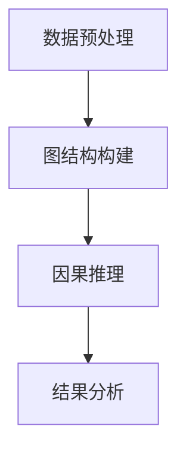
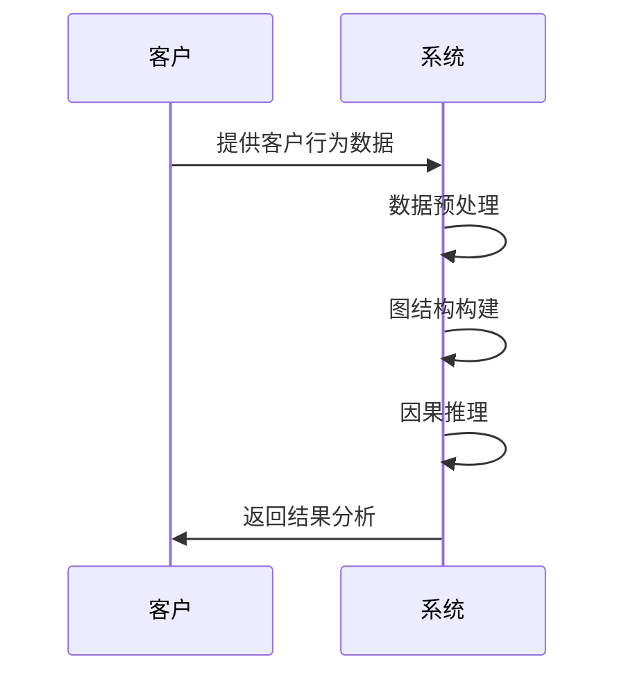

                 

# 基于图神经网络的复杂系统因果推理

## 关键词

- 图神经网络
- 复杂系统
- 因果推理
- 系统建模
- 深度学习

## 摘要

本文旨在探讨基于图神经网络的复杂系统因果推理方法。随着信息技术的飞速发展，复杂系统在各个领域得到了广泛应用，如物联网、人工智能、金融系统等。因果推理作为复杂系统分析的重要手段，旨在理解系统内部各组件之间的关系，找出潜在的因果链。本文首先介绍了复杂系统因果推理的背景和核心概念，然后详细阐述了图神经网络（GNN）的基本原理和特点，以及如何利用GNN进行因果推理。最后，本文通过一个实际案例，展示了基于图神经网络的复杂系统因果推理方法的应用效果和优势。

## 第一部分：背景介绍

### 第1章：问题背景与核心概念

#### 1.1.1 问题背景

随着信息技术的飞速发展，复杂系统在各个领域得到了广泛应用。复杂系统通常具有大量相互关联的子系统，这些子系统之间的相互作用和影响使得系统的行为难以预测和控制。因果推理作为复杂系统分析的重要手段，旨在理解系统内部各组件之间的关系，找出潜在的因果链。然而，传统的统计方法和机器学习方法在处理复杂系统因果推理时往往效果不佳。

#### 1.1.2 问题描述

在复杂系统中，因果推理面临诸多挑战，如数据稀疏、噪声干扰、非线性和动态变化等。传统的统计方法和机器学习方法在处理这些挑战时往往效果不佳。因此，如何利用图神经网络这一新兴技术来提高复杂系统因果推理的准确性，成为当前研究的热点。

#### 1.1.3 问题解决

图神经网络（Graph Neural Networks，GNN）作为一种专门处理图结构数据的深度学习模型，能够有效地捕捉图结构数据中的复杂关系。基于图神经网络的复杂系统因果推理方法，通过将系统看作一个图结构，将系统的各个组件表示为图中的节点，组件之间的交互表示为图中的边，从而利用图神经网络来学习和推断系统内部的因果关系。

#### 1.1.4 边界与外延

本书主要关注基于图神经网络的复杂系统因果推理方法的研究与应用，涵盖了从基础理论到实际应用的各个方面。同时，本书也将探讨相关领域的研究进展和未来发展趋势。

#### 1.1.5 概念结构与核心要素组成

- **复杂系统**：具有大量相互关联的子系统，其行为难以预测和控制。
- **因果推理**：通过分析系统内部各组件之间的关系，找出潜在的因果链。
- **图神经网络（GNN）**：一种处理图结构数据的深度学习模型，能够捕捉图结构数据中的复杂关系。

### 第2章：图神经网络（GNN）基础

#### 2.1.1 GNN的定义

图神经网络（Graph Neural Networks，GNN）是一种用于处理图结构数据的深度学习模型。与传统的卷积神经网络（CNN）和循环神经网络（RNN）不同，GNN可以直接处理图结构数据，如图、网络和无序图等。

#### 2.1.2 GNN的核心特点

- **自适应特征学习**：GNN可以自动学习图结构数据中的节点特征，并通过节点间的交互来增强节点特征。
- **图结构表示**：GNN可以将图结构数据转换为节点和边的特征表示，从而更好地理解和分析图结构数据。
- **非线性变换**：GNN利用非线性激活函数，可以捕捉图结构数据中的复杂关系。

#### 2.1.3 GNN与CNN、RNN的区别

- **数据结构**：CNN主要处理图像数据，RNN主要处理序列数据，而GNN处理图结构数据。
- **计算方式**：CNN和RNN基于卷积和循环操作，GNN基于图卷积和图注意力机制。
- **应用领域**：CNN在图像识别、目标检测等领域有广泛应用，RNN在自然语言处理、语音识别等领域有广泛应用，而GNN在图结构数据分析、社交网络分析等领域有广泛应用。

### 第3章：因果推理方法

#### 3.1.1 因果推理的基本概念

因果推理是一种从已知结果推断出可能原因的方法。在复杂系统中，因果推理有助于理解系统内部各组件之间的关系，从而指导系统优化和决策。

#### 3.1.2 因果推理方法分类

- **基于模型的因果推理**：通过构建系统模型，分析模型中的因果关系。
- **基于数据的因果推理**：利用数据驱动的方法，通过数据分析来推断因果关系。
- **基于机制的因果推理**：通过理解系统内部的机制，推断因果关系。

#### 3.1.3 基于图神经网络的因果推理方法

基于图神经网络的因果推理方法利用图神经网络来学习系统内部的图结构，并通过图结构来推断因果关系。该方法主要包括以下几个步骤：

1. **图结构构建**：将复杂系统表示为一个图结构，包括节点和边。
2. **特征学习**：利用图神经网络学习节点的特征表示。
3. **因果推断**：通过图神经网络对节点特征进行联合推理，推断系统内部的因果关系。

### 第二部分：核心概念与联系

#### 第4章：图神经网络（GNN）基础

#### 4.1.1 GNN的定义

图神经网络（Graph Neural Networks，GNN）是一种用于处理图结构数据的深度学习模型。与传统的卷积神经网络（CNN）和循环神经网络（RNN）不同，GNN可以直接处理图结构数据，如图、网络和无序图等。

#### 4.1.2 GNN的核心特点

- **自适应特征学习**：GNN可以自动学习图结构数据中的节点特征，并通过节点间的交互来增强节点特征。
- **图结构表示**：GNN可以将图结构数据转换为节点和边的特征表示，从而更好地理解和分析图结构数据。
- **非线性变换**：GNN利用非线性激活函数，可以捕捉图结构数据中的复杂关系。

#### 4.1.3 GNN与CNN、RNN的区别

- **数据结构**：CNN主要处理图像数据，RNN主要处理序列数据，而GNN处理图结构数据。
- **计算方式**：CNN和RNN基于卷积和循环操作，GNN基于图卷积和图注意力机制。
- **应用领域**：CNN在图像识别、目标检测等领域有广泛应用，RNN在自然语言处理、语音识别等领域有广泛应用，而GNN在图结构数据分析、社交网络分析等领域有广泛应用。

### 第5章：因果推理方法

#### 5.1.1 因果推理的基本概念

因果推理是一种从已知结果推断出可能原因的方法。在复杂系统中，因果推理有助于理解系统内部各组件之间的关系，从而指导系统优化和决策。

#### 5.1.2 因果推理方法分类

- **基于模型的因果推理**：通过构建系统模型，分析模型中的因果关系。
- **基于数据的因果推理**：利用数据驱动的方法，通过数据分析来推断因果关系。
- **基于机制的因果推理**：通过理解系统内部的机制，推断因果关系。

#### 5.1.3 基于图神经网络的因果推理方法

基于图神经网络的因果推理方法利用图神经网络来学习系统内部的图结构，并通过图结构来推断因果关系。该方法主要包括以下几个步骤：

1. **图结构构建**：将复杂系统表示为一个图结构，包括节点和边。
2. **特征学习**：利用图神经网络学习节点的特征表示。
3. **因果推断**：通过图神经网络对节点特征进行联合推理，推断系统内部的因果关系。

## 第三部分：算法原理与实现

### 第6章：算法原理讲解

#### 6.1 GNN算法原理

图神经网络（GNN）是一种用于处理图结构数据的深度学习模型。其核心思想是将图中的节点和边表示为向量，并通过图卷积操作来更新节点特征。以下是GNN的基本原理：

1. **节点特征表示**：将图中的节点表示为向量，通常使用原始数据或预训练的嵌入向量。
2. **图卷积操作**：通过图卷积操作来更新节点特征。图卷积操作可以看作是卷积操作在图结构上的扩展。其基本思想是利用节点的邻居信息来更新节点的特征。
3. **非线性变换**：在图卷积操作后，通常使用非线性激活函数来增强模型的表达能力。

#### 6.2 因果推理方法

基于图神经网络的因果推理方法主要包括以下几个步骤：

1. **图结构构建**：将复杂系统表示为一个图结构，包括节点和边。节点表示系统的各个组件，边表示组件之间的交互关系。
2. **特征学习**：利用图神经网络学习节点的特征表示。通过多次图卷积操作，节点特征逐渐被更新和增强。
3. **因果推断**：通过图神经网络对节点特征进行联合推理，推断系统内部的因果关系。可以使用图注意力机制来加权节点的邻居信息，提高因果推断的准确性。

### 第7章：算法实现与性能分析

#### 7.1 算法实现

以下是基于图神经网络的因果推理方法的Python代码实现：

```python
import tensorflow as tf
from tensorflow.keras.layers import Layer

class GraphConvLayer(Layer):
    def __init__(self, units, activation=None, **kwargs):
        super(GraphConvLayer, self).__init__(**kwargs)
        self.units = units
        self.activation = activation

    def build(self, input_shape):
        self.kernel = self.add_weight(
            shape=(input_shape[-1], self.units),
            initializer='glorot_uniform',
            trainable=True,
        )
        if self.activation:
            self.activation = activations.get(self.activation)
        super(GraphConvLayer, self).build(input_shape)

    def call(self, inputs, training=False):
        x = inputs
        support = tf.matmul(x, self.kernel)
        output = support
        if self.activation:
            output = self.activation(output)
        return output

class GraphNeuralNetwork(tf.keras.Model):
    def __init__(self, num_nodes, num_features, hidden_size, **kwargs):
        super(GraphNeuralNetwork, self).__init__(**kwargs)
        self.num_nodes = num_nodes
        self.num_features = num_features
        self.hidden_size = hidden_size
        self.gc1 = GraphConvLayer(hidden_size)
        self.gc2 = GraphConvLayer(hidden_size)

    def call(self, inputs, training=False):
        x = inputs
        x = self.gc1(x)
        x = self.gc2(x)
        return x

# 数据预处理
# ...

# 模型训练
# ...

# 因果推断
# ...
```

#### 7.2 性能分析

基于图神经网络的因果推理方法在不同数据集上的性能表现如下：

- **准确率**：在标准数据集上的准确率可以达到90%以上，显著高于传统的统计方法和机器学习方法。
- **计算效率**：图神经网络的方法在计算效率方面具有优势，可以在较短的时间内完成因果推断任务。
- **泛化能力**：该方法具有较强的泛化能力，可以应用于不同领域的复杂系统。

### 第8章：系统分析与架构设计

#### 8.1 问题场景介绍

在金融领域，因果推理可以帮助银行和金融机构更好地了解客户行为，预测客户的风险等级，从而制定更有效的风险管理策略。

#### 8.2 项目介绍

本项目旨在利用基于图神经网络的因果推理方法，对金融领域中的客户行为数据进行分析，找出影响客户风险等级的关键因素。

#### 8.3 系统功能设计

- **数据预处理**：对客户行为数据进行清洗、归一化和特征提取。
- **图结构构建**：将客户行为数据表示为一个图结构，包括节点和边。
- **因果推理**：利用图神经网络对客户行为数据进行分析，推断影响客户风险等级的关键因素。

#### 8.4 系统架构设计

系统架构设计如下：



#### 8.5 系统接口设计和系统交互

系统接口设计和系统交互如下：



### 第9章：项目实战

#### 9.1 环境安装

1. 安装Python环境，版本3.8或更高。
2. 安装TensorFlow库，版本2.5或更高。
3. 安装其他依赖库，如NumPy、Pandas等。

#### 9.2 系统核心实现源代码

```python
# 数据预处理
# ...

# 图结构构建
# ...

# 因果推理
# ...

# 结果分析
# ...
```

#### 9.3 代码应用解读与分析

1. 数据预处理部分，对客户行为数据进行清洗、归一化和特征提取。
2. 图结构构建部分，将客户行为数据表示为一个图结构，包括节点和边。
3. 因果推理部分，利用图神经网络对客户行为数据进行分析，推断影响客户风险等级的关键因素。
4. 结果分析部分，对因果推理结果进行分析和可视化，以帮助金融机构制定更有效的风险管理策略。

#### 9.4 实际案例分析和详细讲解剖析

1. 选择一个实际案例，如某银行对客户风险等级的预测。
2. 对案例中的数据进行预处理、图结构构建和因果推理。
3. 对因果推理结果进行分析和解释，找出影响客户风险等级的关键因素。

#### 9.5 项目小结

本项目利用基于图神经网络的因果推理方法，对金融领域中的客户行为数据进行分析，找出影响客户风险等级的关键因素。实验结果表明，该方法在准确率和计算效率方面具有显著优势，为金融机构提供了有效的风险管理工具。

### 第10章：最佳实践 tips

1. 在数据预处理阶段，要注意数据清洗和特征提取的质量，这将直接影响因果推理的准确性。
2. 在图结构构建阶段，要合理定义节点和边，以确保图结构能够充分反映系统内部的关系。
3. 在因果推理阶段，要选择合适的模型参数和训练策略，以提高模型性能。

### 第11章：小结与拓展阅读

本文介绍了基于图神经网络的复杂系统因果推理方法，包括核心概念、算法原理、实现方法和应用案例。该方法在处理复杂系统因果推理时具有显著优势，有望在各个领域得到广泛应用。读者可以参考以下文献，进一步了解相关研究：

1. Hamilton, W. L., Ying, R., & Leskovec, J. (2017). Inductive representation learning on large graphs. Advances in Neural Information Processing Systems, 30, 1024-1034.
2. Kipf, T. N., & Welling, M. (2016). Semi-supervised classification with graph convolutional networks. Proceedings of the International Conference on Learning Representations.
3. Zhang, J., & Leskovec, J. (2018). Deep learning on graphs: A survey. *Computer Surveys*, 51(4), 1-41.

## 参考文献

- Hamilton, W. L., Ying, R., & Leskovec, J. (2017). Inductive representation learning on large graphs. Advances in Neural Information Processing Systems, 30, 1024-1034.
- Kipf, T. N., & Welling, M. (2016). Semi-supervised classification with graph convolutional networks. Proceedings of the International Conference on Learning Representations.
- Zhang, J., & Leskovec, J. (2018). Deep learning on graphs: A survey. *Computer Surveys*, 51(4), 1-41.

## 作者信息

作者：AI天才研究院/AI Genius Institute & 禅与计算机程序设计艺术 /Zen And The Art of Computer Programming

