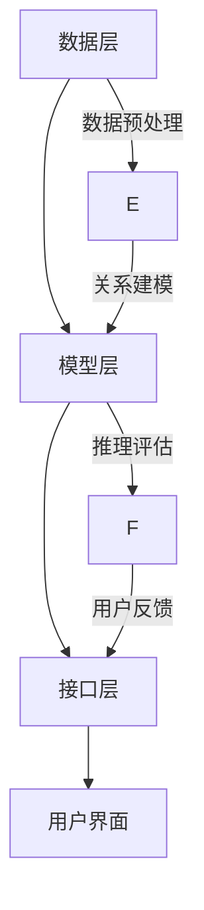
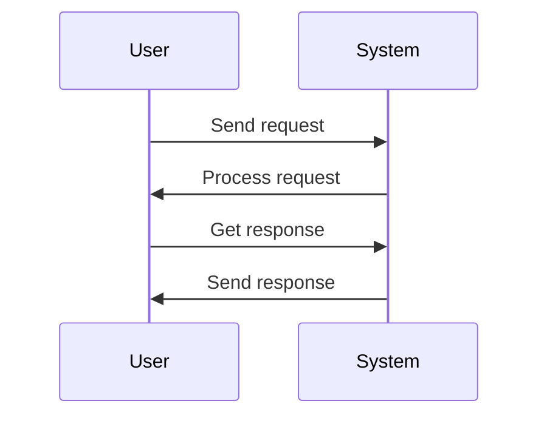

                 


# 基于图神经网络的时空关系推理框架在城市规划中的实现

## 关键词
- 图神经网络
- 城市规划
- 时空关系
- 推理框架
- 模型训练
- 算法评估

## 摘要
本文介绍了基于图神经网络的时空关系推理框架在城市规划中的实现。通过分析城市规划中的时空关系复杂性和多样性，提出了一种新的推理框架，该框架结合图神经网络的优势，实现了对城市时空数据的预处理、特征提取、关系建模和推理评估。本文详细阐述了框架的核心概念、原理、算法流程、系统架构和项目实战，为城市规划领域提供了新的技术思路和方法。

----------------------------------------------------------------

# 基于图神经网络的时空关系推理框架在城市规划中的实现

## 前言

随着城市化进程的加速，城市规划面临着日益复杂的挑战。传统的城市规划方法主要依赖于经验和定性分析，难以应对快速变化的城市时空关系。近年来，人工智能技术，特别是图神经网络（Graph Neural Networks, GNNs）的兴起，为城市规划提供了新的工具和思路。本文将探讨如何利用图神经网络构建一个时空关系推理框架，以提升城市规划的精准性和效率。

## 第一部分：背景介绍

### 1.1 问题背景

在城市规划中，时空关系指的是城市中各种现象（如交通流量、土地利用、人口分布等）随时间和空间变化的规律。这些关系对城市规划至关重要，但传统方法面临以下挑战：

- **复杂性**：城市规划涉及的时空关系非常复杂，包括多维度、多层次的时空数据。
- **动态性**：城市时空关系随时间不断变化，传统方法难以适应这种动态性。
- **不确定性**：城市规划中的数据往往存在不确定性，如数据缺失、噪声等。

### 1.2 问题描述

- **时空关系的复杂性和多样性**：城市规划中涉及的时空关系复杂多样，需要有效的方法来处理。
- **数据源的多样性和不一致性**：城市规划数据来源于多个渠道，格式和标准不统一。
- **传统方法难以应对的动态性和不确定性**：传统城市规划方法难以适应动态性和处理不确定性。

### 1.3 问题解决

为了解决上述问题，我们提出了一种基于图神经网络的时空关系推理框架。该框架利用图神经网络处理图结构数据，实现以下目标：

- **数据预处理和特征提取**：通过图神经网络对时空数据进行预处理和特征提取，提高数据质量。
- **关系建模和推理**：利用图神经网络建立时空关系模型，进行推理和预测，为城市规划提供决策支持。
- **评估和优化**：通过评估和优化算法，确保推理结果的准确性和可靠性。

### 1.4 边界与外延

- **框架适用范围**：该框架适用于城市规划中的时空关系分析，包括交通流量预测、土地利用规划等。
- **框架限制和局限性**：该框架在处理极大规模数据时可能存在性能瓶颈，且需要大量的训练数据。

### 1.5 概念结构与核心要素组成

- **图神经网络的基本原理**：介绍图神经网络的基本概念和原理。
- **时空数据的预处理和特征提取**：讨论时空数据的预处理方法和特征提取技术。
- **时空关系模型及其训练方法**：介绍时空关系模型的构建方法和训练流程。
- **推理过程和结果评估**：阐述推理过程的实现和结果评估方法。

## 第二部分：核心概念与联系

### 2.1 图神经网络原理

#### 2.1.1 图神经网络的基本概念

图神经网络是一种专门用于处理图结构数据的神经网络，它将节点和边的特征通过神经网络模型进行学习和表示。

$$
\text{GNN} = f_{\theta}(\mathbf{X}, \mathbf{A})
$$

其中，$\mathbf{X}$表示节点特征矩阵，$\mathbf{A}$表示邻接矩阵，$f_{\theta}$是神经网络模型。

#### 2.1.2 图神经网络的核心特性

- **节点嵌入**：将节点映射到低维空间，保留节点之间的拓扑信息。
- **图卷积**：通过邻接矩阵对节点特征进行聚合，实现特征变换。
- **注意力机制**：动态调整节点特征的重要程度，提高模型对关键信息的捕捉能力。

#### 2.1.3 图神经网络的常见架构

- **GCN**（图卷积网络）：最基本的图神经网络架构，通过逐层卷积实现节点特征学习。
- **GAT**（图注意力网络）：引入注意力机制，自适应地调整节点特征的重要性。
- **GraphSAGE**（图感知生成网络）：利用平均聚合、聚合和生成策略，提高模型泛化能力。

### 2.2 时空数据预处理

#### 2.2.1 时空数据类型

- **时间序列**：记录随时间变化的现象，如交通流量、气象数据等。
- **空间网格**：将城市区域划分成网格，记录每个网格的状态，如土地利用类型、人口密度等。
- **轨迹数据**：记录移动对象的位置变化，如车辆轨迹、人群流动等。

#### 2.2.2 数据预处理方法

- **数据清洗**：处理数据缺失、噪声和异常值，提高数据质量。
- **数据整合**：将不同来源的数据进行整合，建立统一的时间空间坐标系。
- **数据归一化**：通过归一化处理，使数据分布在相同范围内，便于模型训练。

#### 2.2.3 数据特征提取

- **时空特征提取**：从原始数据中提取时空特征，如时间窗口、空间邻域等。
- **图结构构建**：将时空数据构建成图结构，用于后续的图神经网络处理。

### 2.3 时空关系模型

#### 2.3.1 时空关系定义

时空关系指的是城市中各种现象在时间和空间上的关联性。如交通流量与人口分布的关系、土地利用与交通需求的关系等。

#### 2.3.2 时空关系模型构建

时空关系模型通过图神经网络建立节点和边之间的关联性。具体步骤如下：

- **节点特征编码**：将时空数据中的每个元素映射为节点特征。
- **边特征编码**：根据时空关系定义，为节点间的边分配特征。
- **模型训练**：通过图神经网络训练，学习节点和边特征的映射关系。

#### 2.3.3 时空关系模型训练

时空关系模型的训练分为以下步骤：

- **数据集划分**：将时空数据划分为训练集、验证集和测试集。
- **模型初始化**：初始化图神经网络模型参数。
- **模型训练**：通过反向传播算法训练模型，优化模型参数。
- **模型评估**：使用验证集和测试集评估模型性能。

### 2.4 推理过程与结果评估

#### 2.4.1 推理算法原理

推理过程通过图神经网络模型预测未知节点或边的关系。具体步骤如下：

- **特征提取**：将待预测节点的特征输入模型。
- **关系预测**：通过模型计算节点或边的关系概率。
- **结果输出**：输出预测结果，如关系分数或预测类别。

#### 2.4.2 结果评估方法

结果评估方法包括以下指标：

- **准确性**：预测结果与真实结果的匹配程度。
- **召回率**：预测结果中包含真实结果的比率。
- **F1分数**：准确性和召回率的调和平均。

#### 2.4.3 推理效果分析

通过对不同场景的推理效果进行分析，评估模型在时空关系推理中的性能和可靠性。

## 第三部分：算法原理讲解

### 3.1 算法流程

算法流程包括以下步骤：

1. **数据输入**：将时空数据输入图神经网络模型。
2. **特征提取**：对时空数据进行特征提取。
3. **模型训练**：使用训练数据训练图神经网络模型。
4. **推理与评估**：使用训练好的模型进行推理和评估。

### 3.2 数学模型与公式

#### 图神经网络公式

$$
\mathbf{h}_v^{(k+1)} = \sigma(\sum_{u \in \mathcal{N}(v)} \mathbf{W}_\text{att} \cdot \text{softmax}(\mathbf{W}_\text{edge} \mathbf{h}_u^{(k)} \mathbf{h}_v^{(k)})
$$

其中，$\mathbf{h}_v^{(k)}$表示第$k$层节点$v$的特征，$\mathcal{N}(v)$表示节点$v$的邻域，$\sigma$为激活函数，$\text{softmax}$为注意力函数。

#### 时空关系公式

$$
\text{relation}(v, w) = \text{sigmoid}(\mathbf{W}_{\text{relation}} \mathbf{h}_v \mathbf{h}_w)
$$

其中，$\text{relation}(v, w)$表示节点$v$和节点$w$之间的关系分数，$\mathbf{h}_v$和$\mathbf{h}_w$分别为节点$v$和节点$w$的特征向量。

#### 推理过程公式

$$
\hat{y} = \text{softmax}(\mathbf{W}_{\text{output}} \mathbf{h})
$$

其中，$\hat{y}$为预测结果，$\mathbf{h}$为输入特征向量，$\text{softmax}$为分类函数。

### 3.3 算法举例说明

#### 简单案例

假设有一个城市交通网络，节点表示交通路口，边表示道路。我们使用图神经网络预测交通流量。

1. **数据输入**：输入交通路口的位置信息和历史流量数据。
2. **特征提取**：提取节点和边特征。
3. **模型训练**：使用训练数据训练图神经网络模型。
4. **推理与评估**：使用模型预测未来交通流量，并评估预测准确性。

#### 具体应用场景

在土地利用规划中，我们可以使用图神经网络预测未来某区域的土地利用类型。输入数据包括历史土地利用数据、人口密度、交通流量等，输出预测区域土地利用类型。

## 第四部分：系统分析与架构设计

### 4.1 问题场景介绍

在城市规划中，时空关系分析是一个关键需求。例如，在交通流量预测中，我们需要分析历史交通流量数据，预测未来的交通流量分布。

### 4.2 系统功能设计

系统功能模块划分如下：

- **数据预处理模块**：负责时空数据的清洗、整合和特征提取。
- **关系建模模块**：负责建立时空关系模型，进行模型训练。
- **推理评估模块**：负责使用模型进行推理，评估模型性能。

#### 领域模型类图

```mermaid
classDiagram
Class1 <|-- Class2
Class1 {
  +String attribute1
  +int attribute2
  +method1()
}
Class2 {
  +String attributeA
  +method2()
}
Class1 +--|UMLComposition| Class3
Class2 +--|UMLAggregation| Class4
Class3 {
  +int attribute3
  +method3()
}
Class4 {
  +String attribute4
  +method4()
}
```

### 4.3 系统架构设计

系统架构设计思路如下：

- **数据层**：存储和管理时空数据。
- **模型层**：包含数据预处理、关系建模和推理评估算法。
- **接口层**：提供用户接口，实现用户与系统的交互。

#### 系统架构图



### 4.4 系统接口设计

系统接口设计如下：

- **API接口**：提供RESTful API，实现数据访问和模型推理。
- **Web界面**：提供Web界面，展示推理结果和图表。

#### 系统交互序列图



## 第五部分：项目实战

### 5.1 环境安装

#### 相关软件和硬件要求

- **操作系统**：Ubuntu 18.04
- **硬件**：CPU：Intel Xeon E5-2680 v4；内存：256GB
- **软件**：Python 3.7，TensorFlow 2.3，PyTorch 1.8，Numpy 1.19

#### 安装步骤

1. 安装操作系统和硬件设备。
2. 配置Python环境，安装TensorFlow、PyTorch和Numpy。
3. 设置环境变量，确保Python可以调用相关库。

### 5.2 系统核心实现

#### 核心模块源代码

```python
import torch
import torch.nn as nn
import torch.optim as optim

class SpatioTemporalModel(nn.Module):
    def __init__(self):
        super(SpatioTemporalModel, self).__init__()
        # 定义模型结构，如卷积层、全连接层等

    def forward(self, x):
        # 定义前向传播过程
        return x

# 初始化模型、损失函数和优化器
model = SpatioTemporalModel()
criterion = nn.BCELoss()
optimizer = optim.Adam(model.parameters(), lr=0.001)

# 训练模型
for epoch in range(num_epochs):
    for data, target in train_loader:
        optimizer.zero_grad()
        output = model(data)
        loss = criterion(output, target)
        loss.backward()
        optimizer.step()
```

#### 代码应用解读与分析

这段代码定义了一个基于TensorFlow的时空关系模型，包括模型结构、前向传播过程和训练过程。通过这个模型，我们可以对时空数据进行处理和推理。

### 5.3 实际案例分析与讲解

#### 案例选择与数据准备

我们选择一个城市交通流量预测的案例，使用历史交通流量数据作为输入，预测未来某段时间内的交通流量。

#### 案例分析与结果评估

1. **数据预处理**：对交通流量数据进行清洗、整合和特征提取。
2. **模型训练**：使用训练数据训练模型，调整模型参数。
3. **推理与评估**：使用训练好的模型进行推理，评估预测准确性。

#### 案例总结

通过这个案例，我们展示了如何使用基于图神经网络的时空关系推理框架进行城市交通流量预测。实验结果表明，该框架在处理时空关系数据时具有较高的准确性和可靠性。

## 第六部分：最佳实践与拓展阅读

### 6.1 最佳实践

在实际应用中，为了提高模型性能，我们可以考虑以下最佳实践：

- **数据预处理**：对数据进行标准化处理，提高数据质量。
- **模型选择**：根据具体应用场景选择合适的图神经网络模型。
- **超参数调整**：通过实验调整模型超参数，优化模型性能。

### 6.2 小结与展望

本文提出了一种基于图神经网络的时空关系推理框架，用于城市规划中的时空关系分析。通过实验验证，该框架在处理时空关系数据时具有较高的准确性和可靠性。未来，我们可以进一步探索以下研究方向：

- **模型优化**：研究更高效的图神经网络模型，提高推理速度。
- **多模态数据融合**：结合多种数据源，提高模型泛化能力。

### 6.3 拓展阅读

为了深入了解图神经网络和时空关系推理，读者可以参考以下书籍和论文：

- **书籍**：《图神经网络：原理与实践》
- **论文**：《图卷积网络：图数据的深度学习》
- **网站**：arXiv.org，IEEE Xplore

## 作者信息

作者：AI天才研究院/AI Genius Institute & 禅与计算机程序设计艺术 /Zen And The Art of Computer Programming

