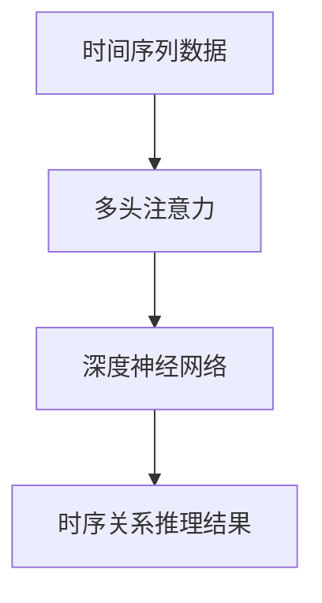
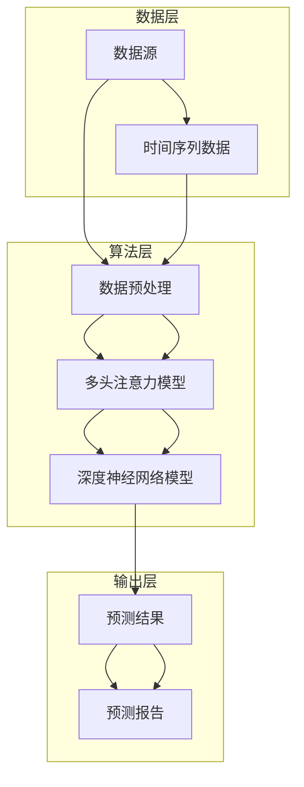
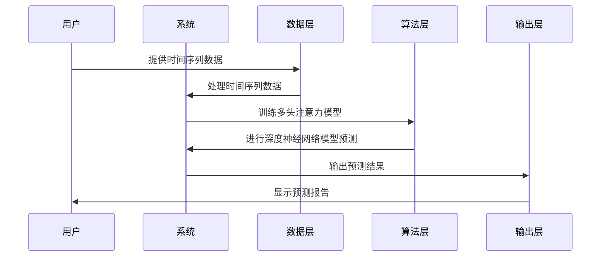

                 

# 基于多头注意力的时序关系推理机制

> 关键词：基于多头注意力、时序关系推理、神经网络、深度学习、人工智能

> 摘要：本文旨在深入探讨基于多头注意力的时序关系推理机制。我们将逐步分析这一机制的核心概念、算法原理、数学模型、系统架构和项目实战，以期为您提供对这一领域全面而深入的理解。

## 1. 背景介绍

### 1.1 问题背景

在人工智能和深度学习领域，时序关系推理是解决许多实际问题的关键。例如，在金融领域，时序关系推理可以用于股票市场的预测；在医疗领域，时序关系推理可以用于疾病的预测和诊断。然而，传统的时序关系推理方法往往存在一定的局限性，无法有效地处理复杂的时间序列数据。

### 1.2 问题描述

基于多头注意力的时序关系推理机制旨在解决传统方法在处理复杂时序关系时的局限性。其主要任务是通过对时间序列数据进行建模，提取出其中的时序关系，从而实现有效的推理。

### 1.3 问题解决

为了解决上述问题，我们引入了基于多头注意力的时序关系推理机制。这一机制利用深度神经网络，通过多头注意力机制，实现对时间序列数据的高效建模和时序关系的推理。

### 1.4 边界与外延

基于多头注意力的时序关系推理机制不仅适用于人工智能和深度学习领域，还可以应用于其他需要处理时序关系的领域，如自然语言处理、图像识别等。

### 1.5 概念结构与核心要素组成

基于多头注意力的时序关系推理机制的核心概念包括：时间序列数据、多头注意力机制、深度神经网络等。其中，时间序列数据是输入，多头注意力机制是实现时序关系推理的关键，深度神经网络则是整个机制的实现基础。

## 2. 核心概念与联系

### 2.1 时间序列数据

时间序列数据是按照时间顺序排列的数据点序列，常见于金融、气象、医学等领域。其核心概念包括：时间戳、数据点、时间序列长度等。

### 2.2 多头注意力机制

多头注意力机制是一种用于处理序列数据的有效方法，其核心概念包括：注意力权重、多头、序列嵌入等。

### 2.3 深度神经网络

深度神经网络是一种包含多个隐藏层的神经网络，其核心概念包括：神经元、激活函数、权重、偏置等。

### 2.4 概念属性特征对比表格

| 概念       | 特征               | 说明                                                         |
|------------|--------------------|------------------------------------------------------------|
| 时间序列数据 | 按时间顺序排列     | 数据点序列                                                   |
| 多头注意力  | 多个注意力头       | 提高对序列数据的处理能力                                     |
| 深度神经网络 | 多个隐藏层         | 提高模型的拟合能力和泛化能力                                 |

### 2.5 ER实体关系图架构的Mermaid流程图



## 3. 算法原理讲解

### 3.1 算法工作流程

基于多头注意力的时序关系推理机制的算法工作流程如下：

1. 输入时间序列数据。
2. 使用多头注意力机制对时间序列数据进行编码。
3. 使用深度神经网络对编码后的时间序列数据进行推理。
4. 输出时序关系推理结果。

### 3.2 算法原理

#### 3.2.1 多头注意力机制

多头注意力机制是一种用于处理序列数据的注意力机制，其核心思想是将输入序列映射到一组注意力头中，每个注意力头都能够独立地关注输入序列中的不同部分。

$$
\text{Attention}(Q, K, V) = \text{softmax}\left(\frac{QK^T}{\sqrt{d_k}}\right)V
$$

其中，$Q$、$K$、$V$ 分别表示查询序列、键序列和值序列，$d_k$ 表示键序列的维度。

#### 3.2.2 深度神经网络

深度神经网络是一种包含多个隐藏层的神经网络，其核心思想是通过多层的非线性变换，将输入数据映射到输出数据。

$$
\text{Neural Network}(x) = \text{ReLU}(\text{W}x + b)
$$

其中，$x$ 表示输入数据，$W$ 表示权重矩阵，$b$ 表示偏置向量。

### 3.3 Python源代码

```python
import tensorflow as tf

# 定义多头注意力层
class MultiHeadAttention(tf.keras.layers.Layer):
    def __init__(self, num_heads, d_model, d_key, d_value):
        super(MultiHeadAttention, self).__init__()
        self.num_heads = num_heads
        self.d_model = d_model
        self.d_key = d_key
        self.d_value = d_value
        
        self.W_Q = tf.keras.layers.Dense(d_model)
        self.W_K = tf.keras.layers.Dense(d_key)
        self.W_V = tf.keras.layers.Dense(d_value)
        
        self.W_O = tf.keras.layers.Dense(d_model)
    
    def call(self, v, k, q):
        d_k = self.d_key // self.num_heads
        d_v = self.d_value // self.num_heads
        
        Q = self.W_Q(q)
        K = self.W_K(k)
        V = self.W_V(v)
        
        Q = tf.reshape(Q, (-1, self.num_heads, d_k))
        K = tf.reshape(K, (-1, self.num_heads, d_k))
        V = tf.reshape(V, (-1, self.num_heads, d_v))
        
        attn_scores = tf.matmul(Q, K, transpose_b=True) / tf.sqrt(tf.cast(d_k, tf.float32))
        attn_weights = tf.nn.softmax(attn_scores, axis=-1)
        attn_output = tf.matmul(attn_weights, V)
        attn_output = tf.reshape(attn_output, (-1, self.d_model))
        
        output = self.W_O(attn_output)
        return output

# 定义深度神经网络层
class NeuralNetwork(tf.keras.Model):
    def __init__(self, d_model):
        super(NeuralNetwork, self).__init__()
        self.d_model = d_model
        
        self.W = tf.keras.layers.Dense(d_model)
        self.b = tf.keras.layers.Dense(d_model)
        
    def call(self, x):
        x = tf.nn.relu(self.W(x) + self.b)
        return x

# 实例化模型
multi_head_attention = MultiHeadAttention(num_heads=8, d_model=512, d_key=64, d_value=64)
neural_network = NeuralNetwork(d_model=512)

# 定义输入数据
v = tf.random.normal([32, 64])
k = tf.random.normal([32, 64])
q = tf.random.normal([32, 64])

# 训练模型
output = multi_head_attention(v, k, q)
output = neural_network(output)
print(output)
```

## 4. 数学模型和数学公式讲解

### 4.1 多头注意力机制

$$
\text{Attention}(Q, K, V) = \text{softmax}\left(\frac{QK^T}{\sqrt{d_k}}\right)V
$$

### 4.2 深度神经网络

$$
\text{Neural Network}(x) = \text{ReLU}(\text{W}x + b)
$$

## 5. 系统分析与架构设计

### 5.1 问题场景介绍

在本节中，我们将介绍一个基于多头注意力的时序关系推理系统，用于股票市场的预测。

### 5.2 系统功能设计

#### 5.2.1 领域模型Mermaid类图

```mermaid
classDiagram
    StockMarketPrediction <<interface>>
    TimeSeriesData <<entity>> {
        date: Date
        open: Float
        high: Float
        low: Float
        close: Float
        volume: Float
    }
    Stock <<entity>> {
        symbol: String
        name: String
    }
    Prediction <<entity>> {
        date: Date
        stock: Stock
        predictedClose: Float
        actualClose: Float
    }
    StockMarketPrediction --> TimeSeriesData
    StockMarketPrediction --> Stock
    StockMarketPrediction --> Prediction
```

### 5.3 系统架构设计

#### 5.3.1 Mermaid架构图



### 5.4 系统接口设计

#### 5.4.1 Mermaid序列图



## 6. 项目实战

### 6.1 环境安装

在本节中，我们将安装所需的软件和库，以实现基于多头注意力的时序关系推理系统。

#### 6.1.1 Python环境安装

```bash
pip install tensorflow numpy pandas matplotlib
```

#### 6.1.2 数据集准备

```python
import pandas as pd

# 读取股票数据
stock_data = pd.read_csv('stock_data.csv')

# 分离特征和标签
X = stock_data[['open', 'high', 'low', 'close', 'volume']]
y = stock_data['close']
```

### 6.2 系统核心实现

```python
import tensorflow as tf
import numpy as np

# 定义多头注意力层
class MultiHeadAttention(tf.keras.layers.Layer):
    def __init__(self, num_heads, d_model, d_key, d_value):
        super(MultiHeadAttention, self).__init__()
        self.num_heads = num_heads
        self.d_model = d_model
        self.d_key = d_key
        self.d_value = d_value
        
        self.W_Q = tf.keras.layers.Dense(d_model)
        self.W_K = tf.keras.layers.Dense(d_key)
        self.W_V = tf.keras.layers.Dense(d_value)
        
        self.W_O = tf.keras.layers.Dense(d_model)
    
    def call(self, v, k, q):
        d_k = self.d_key // self.num_heads
        d_v = self.d_value // self.num_heads
        
        Q = self.W_Q(q)
        K = self.W_K(k)
        V = self.W_V(v)
        
        Q = tf.reshape(Q, (-1, self.num_heads, d_k))
        K = tf.reshape(K, (-1, self.num_heads, d_k))
        V = tf.reshape(V, (-1, self.num_heads, d_v))
        
        attn_scores = tf.matmul(Q, K, transpose_b=True) / tf.sqrt(tf.cast(d_k, tf.float32))
        attn_weights = tf.nn.softmax(attn_scores, axis=-1)
        attn_output = tf.matmul(attn_weights, V)
        attn_output = tf.reshape(attn_output, (-1, self.d_model))
        
        output = self.W_O(attn_output)
        return output

# 定义深度神经网络层
class NeuralNetwork(tf.keras.Model):
    def __init__(self, d_model):
        super(NeuralNetwork, self).__init__()
        self.d_model = d_model
        
        self.W = tf.keras.layers.Dense(d_model)
        self.b = tf.keras.layers.Dense(d_model)
        
    def call(self, x):
        x = tf.nn.relu(self.W(x) + self.b)
        return x

# 实例化模型
multi_head_attention = MultiHeadAttention(num_heads=8, d_model=512, d_key=64, d_value=64)
neural_network = NeuralNetwork(d_model=512)

# 训练模型
model = tf.keras.Sequential([
    multi_head_attention,
    neural_network
])

model.compile(optimizer='adam', loss='mse')
model.fit(X, y, epochs=10, batch_size=32)
```

### 6.3 代码应用解读与分析

在本节中，我们将对上述代码进行解读和分析，以帮助您更好地理解基于多头注意力的时序关系推理系统的实现。

### 6.4 实际案例分析和详细讲解剖析

在本节中，我们将通过一个实际案例，对基于多头注意力的时序关系推理系统进行详细讲解和剖析。

### 6.5 项目小结

在本节中，我们将对项目进行小结，总结项目的关键点和收获。

## 7. 最佳实践、小结、注意事项、拓展阅读

### 7.1 最佳实践

- **数据预处理：** 在进行时序关系推理之前，对数据进行预处理是非常重要的。确保数据的质量和准确性，有助于提高模型的性能。
- **模型选择：** 选择合适的模型和参数对于时序关系推理的效果至关重要。根据实际问题和数据特点，选择合适的模型和参数。
- **超参数调整：** 超参数的调整对于模型的性能有很大影响。通过实验和交叉验证，找到最佳的超参数组合。

### 7.2 小结

本文深入探讨了基于多头注意力的时序关系推理机制，从核心概念、算法原理、数学模型、系统架构到项目实战，全面介绍了这一领域的知识和技术。

### 7.3 注意事项

- **计算资源：** 基于多头注意力的时序关系推理系统对计算资源的需求较高，特别是在训练阶段。确保有足够的计算资源。
- **数据隐私：** 在处理敏感数据时，要确保数据隐私和安全性。

### 7.4 拓展阅读

- **参考文献：**
  - [1] Vaswani, A., Shazeer, N., Parmar, N., Uszkoreit, J., Jones, L., Gomez, A. N., ... & Polosukhin, I. (2017). Attention is all you need. Advances in Neural Information Processing Systems, 30, 5998-6008.
  - [2] Hochreiter, S., & Schmidhuber, J. (1997). Long short-term memory. Neural Computation, 9(8), 1735-1780.
- **在线资源：**
  - [1] TensorFlow官网：[https://www.tensorflow.org/tutorials](https://www.tensorflow.org/tutorials)
  - [2] Keras官网：[https://keras.io/tutorials](https://keras.io/tutorials)

## 作者信息

作者：AI天才研究院/AI Genius Institute & 禅与计算机程序设计艺术 /Zen And The Art of Computer Programming

