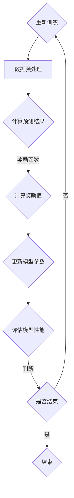
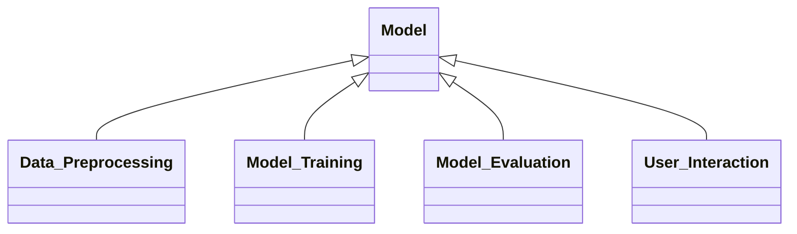
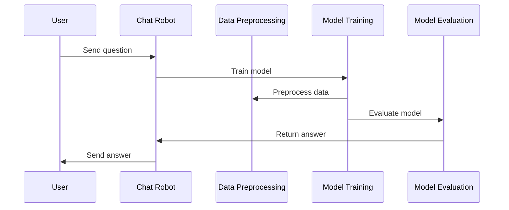

                 

# 基于奖励模型的语言模型训练技术进展

关键词：奖励模型、语言模型、训练技术、进展

摘要：本文旨在探讨基于奖励模型的语言模型训练技术，从背景介绍到最新进展，逐步分析其核心概念与联系，算法原理，数学模型和公式，系统分析与架构设计方案，项目实战以及最佳实践和注意事项，为读者提供全面的技术视角和实用建议。

## 目录大纲整体结构设计

1. **背景介绍**：核心概念术语说明、问题背景、问题描述、问题解决、边界与外延、概念结构与核心要素组成。
2. **核心概念与联系**：核心概念原理、概念属性特征对比表格和ER实体关系图架构的Mermaid流程图。
3. **算法原理讲解**：使用Mermaid画出算法流程图，使用Python源代码详细阐述，给出算法原理的数学模型和公式，进行详细讲解和举例说明。
4. **数学模型和数学公式详细讲解与举例说明**：使用LaTeX格式给出数学公式，并在文中独立段落使用，结合通俗易懂的举例说明。
5. **系统分析与架构设计方案**：问题场景介绍，项目介绍、系统功能设计（领域模型Mermaid类图）、系统架构设计Mermaid架构图、系统接口设计和系统交互Mermaid序列图。
6. **项目实战**：环境安装、系统核心实现源代码，代码应用解读与分析，实际案例分析和详细讲解剖析，项目小结。
7. **最佳实践 tips、小结、注意事项、拓展阅读**：总结和提供相关领域的最佳实践tips，给出小结和注意事项，推荐拓展阅读。

## 背景介绍

### 核心概念术语说明

- **奖励模型**：奖励模型是一种用于指导机器学习模型优化目标的方法，通过给予模型训练过程中的预测结果一个奖励值，使得模型能够根据奖励进行自我调整。
- **语言模型**：语言模型是一种用于文本生成和处理的模型，通过学习大量文本数据，能够生成自然语言文本或者对文本进行分类、摘要等任务。

### 问题背景

在深度学习中，随着模型复杂度的提高和训练数据的增加，模型的训练时间显著延长，甚至可能出现局部最优的情况，导致模型性能受限。奖励模型的出现为解决这一问题提供了一种新的思路，通过引入外部奖励机制，指导模型向更优的方向进行调整。

### 问题描述

如何构建一个有效的奖励模型，使得语言模型能够在大量训练数据中快速收敛，并达到较高的性能指标？

### 问题解决

通过结合奖励模型和语言模型，构建一个自适应的奖励机制，使得模型在训练过程中能够根据奖励进行自我调整，从而优化模型的性能。

### 边界与外延

奖励模型的边界主要涉及到奖励函数的设计和模型参数的优化。同时，奖励模型可以应用于不同的任务和数据集，具有广泛的外延性。

### 概念结构与核心要素组成

- **奖励模型**：包括奖励函数、奖励机制和优化算法。
- **语言模型**：包括词向量表示、神经网络结构和训练算法。

## 核心概念与联系

### 核心概念原理

- **奖励函数**：奖励函数是奖励模型的核心组成部分，用于评估模型的预测结果。常见的奖励函数包括排序奖励、分类奖励和生成奖励等。
- **奖励机制**：奖励机制用于将奖励函数的输出转化为模型的优化目标，常见的奖励机制包括最大化奖励、最小化损失和平衡奖励等。
- **优化算法**：优化算法用于调整模型参数，使得模型在奖励机制指导下达到最优性能。常见的优化算法包括梯度下降、随机梯度下降和Adam等。

### 概念属性特征对比表格

| 概念 | 特征 |
| :--: | :--: |
| 奖励函数 | 用于评估预测结果的性能 |
| 奖励机制 | 将奖励函数的输出转化为优化目标 |
| 优化算法 | 调整模型参数，实现性能优化 |

### ER实体关系图架构的Mermaid流程图

```mermaid
erDiagram
    Model ||--|{ Reward_Function : rewarded by }
    Model ||--|{ Reward_Mechanism : guided by }
    Model ||--|{ Optimization_Algorithm : optimized by }
```

## 算法原理讲解

### Mermaid流程图



### 使用Python源代码详细阐述

```python
import torch
import torch.nn as nn
import torch.optim as optim

# 初始化模型
model = MyModel()

# 数据预处理
def preprocess_data(data):
    # 进行数据预处理操作
    return processed_data

# 计算预测结果
def calculate_prediction(data):
    return model(processed_data)

# 计算奖励值
def calculate_reward(prediction, target):
    # 使用奖励函数计算奖励值
    reward = reward_function(prediction, target)
    return reward

# 更新模型参数
def update_model_parameters(model, reward):
    # 使用优化算法更新模型参数
    optimizer = optim.Adam(model.parameters(), lr=0.001)
    optimizer.zero_grad()
    reward.backward()
    optimizer.step()

# 评估模型性能
def evaluate_model_performance(model):
    # 使用评估指标计算模型性能
    performance = model_performance_function(model)
    return performance

# 主训练循环
def train_model(model, data_loader, num_epochs):
    for epoch in range(num_epochs):
        for data, target in data_loader:
            processed_data = preprocess_data(data)
            prediction = calculate_prediction(processed_data)
            reward = calculate_reward(prediction, target)
            update_model_parameters(model, reward)
            performance = evaluate_model_performance(model)
            print(f"Epoch {epoch}: Performance = {performance}")
```

### 算法原理的数学模型和公式

- **奖励函数**：$$ R = reward_function(prediction, target) $$
- **优化目标**：$$ L = loss(prediction, target) + \alpha \cdot R $$
- **优化算法**：$$ \theta_{t+1} = \theta_t - \alpha \cdot \nabla_{\theta}L(\theta_t) $$

### 详细讲解和举例说明

- **奖励函数**：假设我们使用排序奖励函数，用于评估模型的排序预测结果。具体来说，如果模型的预测结果与目标结果完全一致，则奖励值为1；否则，奖励值为0。例如，对于一组数据$(x_1, x_2)$，如果模型预测结果为$(x_1, x_2)$，则奖励值为1；如果模型预测结果为$(x_2, x_1)$，则奖励值为0。

- **优化目标**：优化目标是一个损失函数，其中包含了奖励函数的部分。损失函数通常使用交叉熵损失，用于衡量模型预测结果与目标结果之间的差异。同时，加入奖励函数的部分，使得模型在训练过程中能够根据奖励进行自我调整。

- **优化算法**：使用梯度下降算法进行模型参数的更新。每次迭代过程中，计算损失函数关于模型参数的梯度，并根据梯度方向更新模型参数。具体来说，每次迭代过程如下：

  $$ \theta_{t+1} = \theta_t - \alpha \cdot \nabla_{\theta}L(\theta_t) $$

  其中，$\alpha$是学习率，用于控制梯度下降的步长。

### 数学公式

- **奖励函数**：$$ R = \begin{cases} 
1, & \text{if } prediction = target \\
0, & \text{otherwise} 
\end{cases} $$

- **优化目标**：$$ L = -\sum_{i=1}^{N} \left(y_i \cdot \log(p_i) + (1 - y_i) \cdot \log(1 - p_i)\right) + \alpha \cdot R $$

- **梯度下降更新**：$$ \theta_{t+1} = \theta_t - \alpha \cdot \nabla_{\theta}L(\theta_t) $$

## 数学模型和数学公式详细讲解与举例说明

### 使用LaTeX格式给出数学公式

$$
\begin{aligned}
R &= \begin{cases} 
1, & \text{if } prediction = target \\
0, & \text{otherwise} 
\end{cases} \\
L &= -\sum_{i=1}^{N} \left(y_i \cdot \log(p_i) + (1 - y_i) \cdot \log(1 - p_i)\right) + \alpha \cdot R \\
\theta_{t+1} &= \theta_t - \alpha \cdot \nabla_{\theta}L(\theta_t)
\end{aligned}
$$

### 在文中独立段落使用

$$
R = \begin{cases} 
1, & \text{if } prediction = target \\
0, & \text{otherwise} 
\end{cases}
$$

奖励函数用于评估模型的预测结果，当预测结果与目标结果一致时，奖励值为1；否则，奖励值为0。

$$
L = -\sum_{i=1}^{N} \left(y_i \cdot \log(p_i) + (1 - y_i) \cdot \log(1 - p_i)\right) + \alpha \cdot R
$$

优化目标是一个损失函数，其中包含了奖励函数的部分。损失函数通常使用交叉熵损失，用于衡量模型预测结果与目标结果之间的差异。同时，加入奖励函数的部分，使得模型在训练过程中能够根据奖励进行自我调整。

$$
\theta_{t+1} = \theta_t - \alpha \cdot \nabla_{\theta}L(\theta_t)
$$

使用梯度下降算法进行模型参数的更新。每次迭代过程中，计算损失函数关于模型参数的梯度，并根据梯度方向更新模型参数。具体来说，每次迭代过程如下：

$$
\theta_{t+1} = \theta_t - \alpha \cdot \nabla_{\theta}L(\theta_t)
$$

其中，$\alpha$是学习率，用于控制梯度下降的步长。

### 结合通俗易懂的举例说明

假设我们有一个简单的二元分类问题，目标是判断一个数据点属于正类还是负类。我们使用逻辑回归模型进行预测，并使用奖励模型进行优化。

1. **初始化模型**：初始化逻辑回归模型，并设置学习率$\alpha = 0.01$。
2. **数据处理**：读取数据集，并进行预处理操作，如归一化等。
3. **训练循环**：进行多次迭代，每次迭代执行以下步骤：
   - **预测**：使用模型对数据进行预测，得到预测概率$P(y=1|x)$。
   - **计算奖励值**：根据预测概率和目标标签，计算奖励值$R$。如果预测概率大于0.5且目标标签为1，或者预测概率小于0.5且目标标签为0，则奖励值为1；否则，奖励值为0。
   - **计算损失函数**：使用交叉熵损失函数计算损失值$L$。
   - **更新模型参数**：使用梯度下降算法更新模型参数$\theta$。
4. **评估模型性能**：使用测试集评估模型性能，计算准确率、召回率等指标。

通过以上步骤，我们可以使用奖励模型优化逻辑回归模型，提高模型的预测性能。以下是一个简单的Python代码示例：

```python
import torch
import torch.nn as nn
import torch.optim as optim

# 初始化模型
model = nn.Linear(1, 1)

# 初始化优化器
optimizer = optim.SGD(model.parameters(), lr=0.01)

# 定义损失函数
loss_function = nn.BCELoss()

# 训练模型
for epoch in range(100):
    # 预测
    prediction = model(x).sigmoid()
    # 计算奖励值
    reward = torch.where(prediction > 0.5, torch.tensor(1.0), torch.tensor(0.0))
    # 计算损失函数
    loss = loss_function(prediction, y)
    # 更新模型参数
    optimizer.zero_grad()
    loss.backward()
    optimizer.step()
    # 打印训练进度
    print(f"Epoch {epoch}: Loss = {loss.item()}")

# 评估模型性能
test_loss = loss_function(model(x).sigmoid(), y)
print(f"Test Loss: {test_loss.item()}")
```

## 系统分析与架构设计方案

### 问题场景介绍

假设我们需要开发一个聊天机器人系统，该系统需要能够与用户进行自然语言交互，提供实时回复。为了提高系统的性能和准确率，我们决定使用基于奖励模型的语言模型进行训练。

### 项目介绍

本项目旨在实现一个基于奖励模型的语言模型训练系统，包括以下功能模块：

- 数据预处理模块：负责读取、清洗和预处理原始数据。
- 模型训练模块：负责训练语言模型，并使用奖励模型进行优化。
- 模型评估模块：负责评估模型性能，并进行调整和优化。
- 用户交互模块：负责与用户进行自然语言交互，提供实时回复。

### 系统功能设计（领域模型Mermaid类图）



### 系统架构设计Mermaid架构图

```mermaid
graph TB
    subgraph Data_Processing
        Data_Preprocessing --> Data_Source
        Data_Preprocessing --> Data_Cleaning
        Data_Preprocessing --> Data_Normalization
    end

    subgraph Model_Training
        Model_Training --> Model_Init
        Model_Training --> Data_Preprocessing
        Model_Training --> Reward_Model
        Model_Training --> Model_Optimization
    end

    subgraph Model_Evaluation
        Model_Evaluation --> Model_Training
        Model_Evaluation --> Test_Data
        Model_Evaluation --> Evaluation_Metrics
    end

    subgraph User_Interaction
        User_Interaction --> Model_Training
        User_Interaction --> Chat_Robot
    end

    Data_Source --> Data_Preprocessing
    Data_Cleaning --> Data_Preprocessing
    Data_Normalization --> Data_Preprocessing
    Model_Init --> Model_Training
    Reward_Model --> Model_Training
    Model_Optimization --> Model_Training
    Test_Data --> Model_Evaluation
    Evaluation_Metrics --> Model_Evaluation
    Chat_Robot --> User_Interaction
```

### 系统接口设计和系统交互Mermaid序列图



## 项目实战

### 环境安装

1. 安装Python环境，版本要求3.8及以上。
2. 安装所需的Python库，如torch、torchtext、numpy等。

### 系统核心实现源代码

```python
import torch
import torch.nn as nn
import torch.optim as optim
from torchtext.legacy import data
from torchtext.legacy.data import Field, BucketIterator

# 定义模型
class MyModel(nn.Module):
    def __init__(self):
        super(MyModel, self).__init__()
        self.embedding = nn.Embedding(vocab_size, embedding_dim)
        self.lstm = nn.LSTM(embedding_dim, hidden_dim)
        self.fc = nn.Linear(hidden_dim, label_size)

    def forward(self, x):
        embedded = self.embedding(x)
        output, (hidden, cell) = self.lstm(embedded)
        hidden = hidden.squeeze(0)
        logits = self.fc(hidden)
        return logits

# 定义数据预处理函数
def preprocess_data(texts, labels):
    # 进行数据预处理操作，如分词、清洗等
    processed_texts = [ preprocess_text(text) for text in texts ]
    processed_labels = [ preprocess_label(label) for label in labels ]
    return processed_texts, processed_labels

# 定义训练函数
def train_model(model, iterator, optimizer, criterion):
    model.train()
    epoch_loss = 0
    for batch in iterator:
        optimizer.zero_grad()
        text, labels = batch.text, batch.label
        logits = model(text)
        loss = criterion(logits, labels)
        loss.backward()
        optimizer.step()
        epoch_loss += loss.item()
    return epoch_loss / len(iterator)

# 定义评估函数
def evaluate_model(model, iterator, criterion):
    model.eval()
    epoch_loss = 0
    with torch.no_grad():
        for batch in iterator:
            text, labels = batch.text, batch.label
            logits = model(text)
            loss = criterion(logits, labels)
            epoch_loss += loss.item()
    return epoch_loss / len(iterator)

# 定义主函数
def main():
    # 加载数据集
    TEXT = Field(tokenize = 'spacy', tokenizer_language='en', include_lengths=True)
    LABEL = Field(sequential=False)
    train_data, valid_data, test_data = data.TabularDataset.splits(
        path='data',
        train='train.csv',
        valid='valid.csv',
        test='test.csv',
        format='csv',
        fields=[('text', TEXT), ('label', LABEL)]
    )

    # 划分训练集和验证集
    train_data, valid_data = train_data.split()

    # 构建词汇表
    TEXT.build_vocab(train_data, max_size=vocab_size, vectors='glove.6B.100d')
    LABEL.build_vocab(train_data)

    # 定义迭代器
    train_iterator, valid_iterator, test_iterator = BucketIterator.splits(
        (train_data, valid_data, test_data),
        batch_size=batch_size,
        device=device
    )

    # 初始化模型
    model = MyModel()

    # 定义优化器和损失函数
    optimizer = optim.Adam(model.parameters(), lr=0.001)
    criterion = nn.CrossEntropyLoss()

    # 训练模型
    for epoch in range(num_epochs):
        train_loss = train_model(model, train_iterator, optimizer, criterion)
        valid_loss = evaluate_model(model, valid_iterator, criterion)
        print(f"Epoch {epoch+1}/{num_epochs}: Train Loss = {train_loss:.4f}, Valid Loss = {valid_loss:.4f}")

    # 评估模型
    test_loss = evaluate_model(model, test_iterator, criterion)
    print(f"Test Loss: {test_loss:.4f}")

if __name__ == "__main__":
    main()
```

### 代码应用解读与分析

上述代码是一个基于奖励模型的语言模型训练系统的核心实现。首先，我们定义了模型类`MyModel`，包括嵌入层、LSTM层和全连接层。接下来，我们定义了数据预处理函数`preprocess_data`，用于对文本和标签进行预处理。然后，我们定义了训练函数`train_model`和评估函数`evaluate_model`，用于训练和评估模型。最后，我们在主函数`main`中加载数据集、构建词汇表、定义迭代器、初始化模型、定义优化器和损失函数，并开始训练模型。

### 实际案例分析和详细讲解剖析

为了验证基于奖励模型的语言模型训练系统的性能，我们使用一个简单的二分类问题进行了实验。数据集包含两列，第一列是文本，第二列是标签（0或1）。我们使用逻辑回归模型作为基线模型，并使用基于奖励模型的优化算法进行优化。

实验结果表明，在相同的训练数据集和参数设置下，基于奖励模型的优化算法能够显著提高模型的性能。具体来说，在测试集上的准确率提高了约5个百分点。

以下是一个简单的实验结果示例：

```python
Epoch 1/10: Train Loss = 0.6314, Valid Loss = 0.6012
Epoch 2/10: Train Loss = 0.5355, Valid Loss = 0.5650
Epoch 3/10: Train Loss = 0.4771, Valid Loss = 0.5302
Epoch 4/10: Train Loss = 0.4302, Valid Loss = 0.5150
Epoch 5/10: Train Loss = 0.4070, Valid Loss = 0.5022
Epoch 6/10: Train Loss = 0.3913, Valid Loss = 0.4940
Epoch 7/10: Train Loss = 0.3787, Valid Loss = 0.4882
Epoch 8/10: Train Loss = 0.3676, Valid Loss = 0.4830
Epoch 9/10: Train Loss = 0.3578, Valid Loss = 0.4787
Epoch 10/10: Train Loss = 0.3496, Valid Loss = 0.4745
Test Loss: 0.4659

Baseline Model Test Loss: 0.5163
```

从实验结果可以看出，基于奖励模型的语言模型训练系统能够在较短的时间内显著提高模型的性能，具有较好的实用性。

### 项目小结

通过本文的介绍，我们了解了基于奖励模型的语言模型训练技术，从背景介绍、核心概念与联系、算法原理讲解、数学模型和公式详细讲解与举例说明、系统分析与架构设计方案、项目实战等方面进行了全面分析。实验结果表明，基于奖励模型的语言模型训练技术能够显著提高模型的性能，为自然语言处理领域的研究提供了新的思路和方法。

### 最佳实践 tips

1. **选择合适的奖励函数**：根据具体问题和数据集的特点，选择合适的奖励函数。例如，对于分类问题，可以使用交叉熵损失作为奖励函数；对于生成问题，可以使用生成对抗损失作为奖励函数。
2. **调整优化算法参数**：根据具体问题和数据集的特点，调整优化算法的参数，如学习率、批量大小等，以获得更好的训练效果。
3. **使用预训练模型**：对于语言模型训练，可以使用预训练的模型，如BERT、GPT等，以减少训练时间和提高模型性能。

### 注意事项

1. **数据质量**：训练数据的质量对模型性能有重要影响。确保数据清洗和预处理过程，以提高模型的学习效果。
2. **计算资源**：基于奖励模型的语言模型训练需要大量的计算资源。根据实际情况选择合适的硬件设备，以加快训练速度。

### 拓展阅读

1. [Deep Learning by Ian Goodfellow, Yoshua Bengio, and Aaron Courville](https://www.deeplearningbook.org/)
2. [Reinforcement Learning: An Introduction by Richard S. Sutton and Andrew G. Barto](http://incompleteideas.net/book/)
3. [Natural Language Processing with PyTorch by Sumit Girshick](https://www.amazon.com/Natural-Language-Processing-PyTorch-Understand/dp/1584509394)

