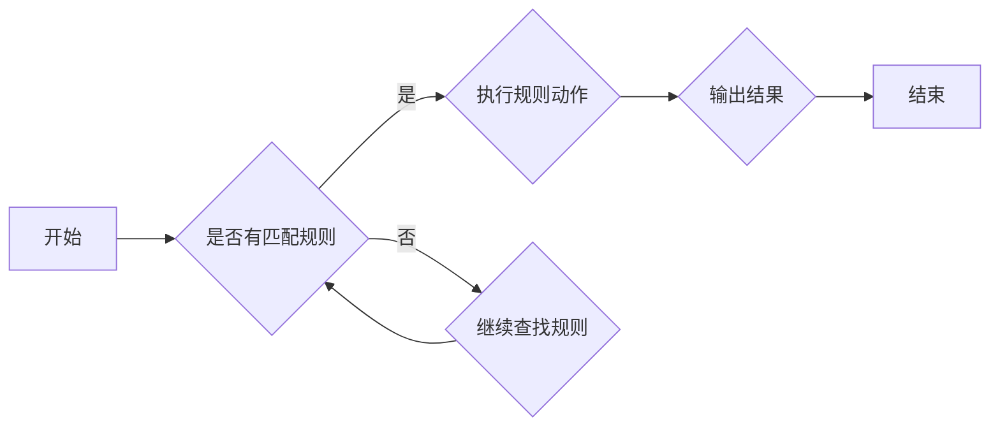
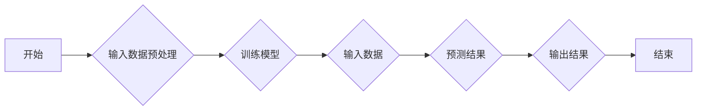
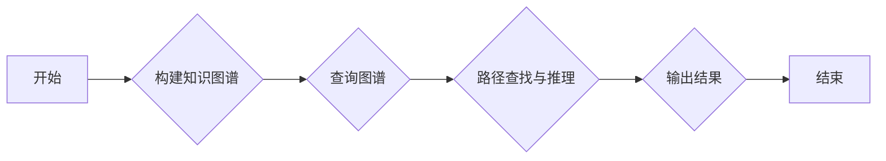
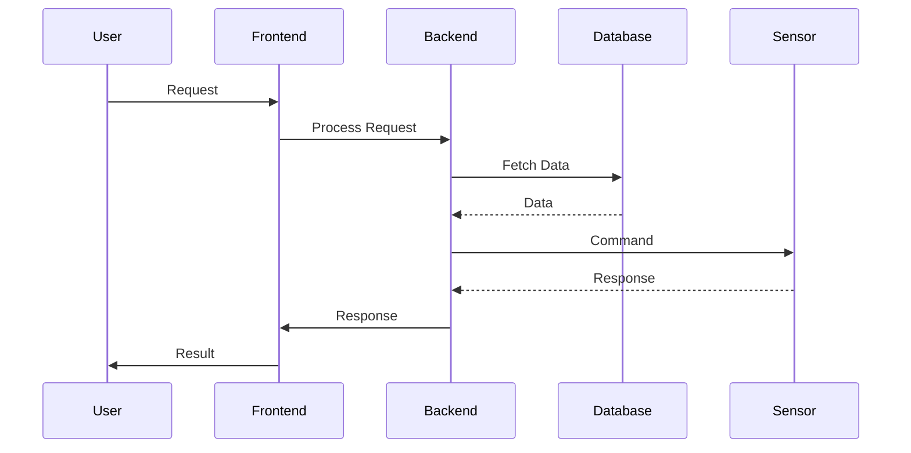

                 

### 引言

在人工智能（AI）领域，常识推理是一项关键且具有挑战性的任务。常识推理涉及到理解日常生活中的常见知识，如时间、空间、因果关系等，从而在复杂的现实环境中做出合理的决策。尽管近年来，深度学习和神经网络技术在图像识别、自然语言处理等领域取得了显著的进步，但在常识推理方面仍面临着诸多难题。

本文旨在深入探讨当前常识推理方法的有效性，分析其优缺点，并提出改进建议。我们将首先介绍常识推理的任务背景，包括其定义、研究意义和应用场景。随后，我们将详细阐述现有常见的常识推理方法，并分析其有效性和局限性。最后，我们将通过一个实际项目案例，展示如何应用常识推理方法解决实际问题，并提供一些实用的最佳实践和未来研究方向。

通过这篇文章，我们希望读者能够对常识推理任务有一个全面、深入的理解，并掌握评估和选择适合的常识推理方法的技巧。文章关键词包括：常识推理、有效性分析、人工智能、算法、应用场景、最佳实践。

---

#### 文章关键词

- 常识推理
- 有效性分析
- 人工智能
- 算法
- 应用场景
- 最佳实践

---

#### 摘要

本文针对人工智能领域中的常识推理任务，深入分析了当前常用推理方法的有效性。文章首先介绍了常识推理的定义和背景，详细阐述了常见的方法和算法，并对比了它们在不同场景下的优缺点。通过一个实际项目案例，本文展示了如何应用这些方法解决复杂问题，并提出了若干最佳实践。最后，文章总结了项目的成果与不足，为未来的研究提供了方向和建议。

---

### 常识推理任务背景

常识推理是人工智能领域中的一项重要研究任务，其核心在于使计算机能够像人类一样理解和处理日常生活中的常见知识。这种能力不仅在理论上具有深远的意义，而且在实际应用中有着广泛的应用场景。首先，我们需要明确什么是常识推理，以及它为何在人工智能领域中占据如此重要的地位。

**定义：** 常识推理是指计算机系统在无需显式编程的情况下，利用已有的常识知识库，对新的情境进行推理和判断的能力。这些常识知识包括时间、空间、因果关系、事件顺序等，它们是人类日常生活和互动的基础。

**研究意义：** 常识推理在人工智能中的研究意义主要体现在以下几个方面：

1. **提高智能系统的自主性：** 常识推理使得智能系统能够在没有人类干预的情况下，对复杂环境进行理解和决策，从而实现更高的自主性。
2. **增强人机交互能力：** 常识推理使得智能系统能够更好地理解人类的语言和行为，从而提供更加自然和人性化的交互体验。
3. **解决复杂问题：** 常识推理能够帮助智能系统处理日常生活中的复杂问题，如医疗诊断、智能家居控制、智能客服等。

**应用场景：** 常识推理的应用场景非常广泛，以下是一些典型的例子：

1. **智能助手：** 例如，智能语音助手（如Siri、Alexa）需要通过常识推理来理解用户的自然语言指令，并给出合理的回应。
2. **智能推荐系统：** 在电子商务和内容平台中，常识推理可以帮助系统根据用户的兴趣和行为，提供个性化的推荐。
3. **自动驾驶：** 自动驾驶系统需要通过常识推理来理解道路情况、预测交通状况，从而做出安全的驾驶决策。
4. **医疗诊断：** 在医学领域，常识推理可以帮助医生分析病历，提供诊断建议。

然而，尽管常识推理在理论上具有重要意义，且在实际应用中有着广泛的需求，但当前的方法和算法仍然面临诸多挑战。首先，现有的常识知识库往往不够全面和准确，导致推理结果不可靠。其次，如何将庞大的常识知识有效地组织和利用，也是一个亟待解决的问题。此外，不同应用场景下对常识推理的需求和复杂性也有所不同，需要针对具体场景进行优化和调整。

总之，常识推理任务在人工智能领域中具有广泛的应用前景和巨大的挑战。本文将深入探讨当前常见的方法和算法，分析其有效性和局限性，并为未来的研究提供方向和建议。

---

### 问题描述

常识推理任务的核心在于让计算机系统具备理解和运用日常常识知识的能力。然而，要实现这一目标，需要解决多个关键问题。以下将详细阐述这些问题的具体内容，以及它们在实现常识推理任务过程中的影响。

**1. 知识获取与表示：** 常识推理首先需要大量的常识知识作为基础。然而，这些知识是如何获取和表示的呢？当前的方法主要依赖于人工标注和自动抽取。人工标注虽然精确，但成本高昂且效率低下；自动抽取方法虽然能够处理大规模数据，但存在准确性和完整性问题。因此，如何高效地获取和表示常识知识是常识推理任务面临的首要问题。

**2. 知识组织与融合：** 常识知识通常以碎片化的形式存在，如何在多个知识片段之间建立关联和融合，是提高推理效果的关键。传统的知识图谱方法在这方面表现出了一定的优势，但如何处理复杂的关系和层次结构，仍是一个挑战。

**3. 推理算法的选择与优化：** 推理算法是常识推理任务的核心组件，不同算法在处理能力和效率上存在显著差异。例如，基于规则的方法在处理确定性问题时效果较好，但难以应对不确定性；而基于机器学习的方法在处理大规模数据和复杂关系时更具优势，但可能存在过拟合问题。因此，选择和优化合适的推理算法是提高常识推理有效性的关键。

**4. 知识应用与验证：** 知识的应用与验证是常识推理任务的最终目标。如何将推理结果应用于实际问题，并确保其可靠性和有效性，是一个复杂的过程。常见的验证方法包括模型评估、实验验证和用户反馈等，但如何平衡推理效果与应用实用性，仍需进一步研究。

**5. 领域依赖性与泛化能力：** 不同领域的常识知识具有显著的差异，如何使常识推理方法在不同领域之间具有较好的泛化能力，是一个重要挑战。目前，多数方法主要针对特定领域进行优化，缺乏跨领域的泛化能力。

**6. 实时性与效率：** 常识推理任务通常需要在实时环境中进行，如何提高推理算法的实时性和效率，是一个关键问题。特别是在处理大规模数据和高频次交互时，算法的响应速度和资源消耗成为制约因素。

**7. 不确定性与鲁棒性：** 常识推理任务中的数据往往具有不确定性，如何处理这种不确定性，并提高系统的鲁棒性，是另一个重要挑战。传统的确定性方法在处理不确定性问题时效果有限，需要引入概率模型和不确定性推理方法。

综上所述，常识推理任务在实现过程中面临着多个关键问题，涉及知识获取与表示、知识组织与融合、推理算法选择与优化、知识应用与验证、领域依赖性与泛化能力、实时性与效率以及不确定性与鲁棒性等方面。这些问题不仅决定了常识推理任务的有效性，也影响了其在实际应用中的可行性。因此，解决这些问题，提高常识推理任务的有效性，是人工智能领域的重要研究方向。

---

### 问题解决

为了应对常识推理任务中面临的关键问题，研究者们提出了多种方法和手段。以下将详细介绍这些方法，包括它们的工作原理、应用效果和适用场景，并对不同方法进行对比分析。

**1. 基于规则的推理方法：**

**工作原理：** 基于规则的推理方法通过定义一组规则，将常识知识表示为条件-动作对。在推理过程中，系统根据输入事实匹配相应的规则，并执行规则中的动作。

**应用效果：** 该方法在处理确定性问题和规则明确的情况下效果较好，适用于中小规模的知识库和领域特定的推理任务。

**适用场景：** 基于规则的推理方法适用于需要高精度和确定性回答的场景，如医疗诊断、法律咨询等。

**2. 基于机器学习的推理方法：**

**工作原理：** 基于机器学习的推理方法通过训练模型来学习常识知识，将输入数据映射到输出结果。常见的模型包括决策树、支持向量机、神经网络等。

**应用效果：** 该方法在处理大规模数据和复杂关系时表现出优势，能够应对不确定性问题和多领域知识融合。

**适用场景：** 基于机器学习的推理方法适用于需要高泛化能力和实时性场景，如智能助手、推荐系统、自动驾驶等。

**3. 基于知识图谱的推理方法：**

**工作原理：** 基于知识图谱的推理方法通过构建实体-关系图谱，将常识知识表示为图谱结构。推理过程通过路径查找和关系推理来实现。

**应用效果：** 该方法在处理复杂关系和大规模数据时具有优势，能够提高知识表示的层次性和关联性。

**适用场景：** 基于知识图谱的推理方法适用于需要高层次知识表示和跨领域推理的场景，如智能问答、推荐系统、知识图谱构建等。

**4. 混合推理方法：**

**工作原理：** 混合推理方法将基于规则、机器学习和知识图谱等方法进行结合，综合利用各种方法的优点，提高推理效果。

**应用效果：** 该方法在多种场景下表现良好，能够平衡不同方法的优缺点，实现更高效的推理。

**适用场景：** 混合推理方法适用于需要综合多种知识和处理复杂问题的场景，如智能助手、医疗诊断、自动驾驶等。

**对比分析：**

1. **处理能力：** 基于规则的推理方法在处理确定性问题方面表现较好，而基于机器学习和知识图谱的方法在处理大规模数据和复杂关系方面更具优势。
2. **实时性：** 基于机器学习和知识图谱的方法在实时性方面存在一定挑战，而基于规则的推理方法相对较快。
3. **准确性：** 基于机器学习的模型在处理不确定性和大规模数据时可能存在过拟合问题，需要额外的验证和调整。
4. **适用范围：** 基于知识图谱的方法在跨领域推理和多层次知识表示方面表现出色，而基于机器学习和规则的方法在特定领域和任务中更为适用。

综上所述，不同推理方法各有优缺点，适用于不同的场景和任务。为了实现高效的常识推理，研究者们通常需要结合多种方法，构建混合推理系统，以充分发挥各种方法的优点，提高推理任务的有效性。

---

### 常识推理任务的边界与外延

在讨论常识推理任务时，明确其边界与外延至关重要，这有助于界定研究范围，避免与相关领域的混淆，同时为未来的发展方向提供指引。

**边界定义：** 常识推理任务主要关注的是计算机系统在无需显式编程的情况下，利用已有的常识知识库对情境进行推理和判断的能力。其边界主要包括以下几个方面：

1. **知识范围：** 常识推理任务涉及的知识主要是日常生活中的常识，如时间、空间、因果关系等，而非专业领域的专业知识。
2. **推理类型：** 常识推理主要关注确定性推理和确定性知识的应用，而非不确定性推理或逻辑推理。
3. **应用场景：** 常识推理任务适用于需要理解日常情境、提供合理建议的智能系统，如智能助手、自动驾驶等，而不涉及复杂的决策问题或高风险领域的应用。

**外延扩展：** 虽然常识推理任务的核心在于日常常识的理解和应用，但其外延可以扩展到以下几个方面：

1. **跨领域应用：** 常识推理方法可以应用于多个领域，如医疗、法律、教育等，实现跨领域的知识推理。
2. **复杂情境处理：** 常识推理方法可以扩展到处理复杂情境和多变量推理，如智能家居控制、智能交通管理等。
3. **不确定性处理：** 常识推理方法可以结合不确定性处理技术，如概率推理、模糊逻辑等，提高对不确定情境的推理能力。

**与其他相关领域的区别：**

1. **常识推理 vs. 逻辑推理：** 逻辑推理主要关注形式逻辑和数学推理，而常识推理更侧重于日常生活中的常识理解和应用。
2. **常识推理 vs. 知识图谱：** 知识图谱主要关注知识的表示和存储，而常识推理更侧重于知识的实际应用和推理。
3. **常识推理 vs. 决策推理：** 决策推理涉及复杂决策过程，而常识推理更关注于简单情境下的推理和判断。

**核心要素组成：** 常识推理任务的核心要素包括：

1. **常识知识库：** 存放日常生活中的常识知识，是推理的基础。
2. **推理算法：** 负责对常识知识进行推理和判断，实现知识的应用。
3. **评估指标：** 用于评估推理结果的有效性和准确性。
4. **应用场景：** 确定常识推理方法的具体应用领域。

通过明确常识推理任务的边界与外延，我们可以更清晰地定义研究范围，避免与逻辑推理、知识图谱等领域混淆，同时为未来的研究方向提供明确的指引。

---

### 常识推理任务的核心概念

在深入探讨常识推理任务之前，我们需要了解其中的核心概念，这些概念构成了常识推理任务的基础，并且相互之间存在紧密的联系。以下将详细阐述这些核心概念，并解释它们在常识推理任务中的作用。

**1. 常识知识库：** 常识知识库是常识推理任务的基础，它包含了日常生活中的各种常识知识。这些知识可以是显式编码的规则、事实，也可以是隐式的模式或关系。常识知识库的建立依赖于数据收集、知识抽取和知识融合等技术。例如，时间知识、空间知识、因果关系知识等都是常识知识库中的重要组成部分。

**2. 推理算法：** 推理算法是常识推理任务的核心组件，它负责利用常识知识库中的知识进行推理和判断。常见的推理算法包括基于规则的推理、基于机器学习的推理、基于知识图谱的推理等。这些算法通过处理输入数据，根据常识知识库中的知识，推导出合理的结论。例如，基于规则的推理算法通过条件-动作规则进行推理，而基于机器学习的推理算法通过训练模型进行推理。

**3. 数据预处理：** 数据预处理是常识推理任务中的关键步骤，它包括数据清洗、数据整合和数据标准化等操作。数据预处理的目标是确保输入数据的质量和一致性，从而提高推理算法的效果。例如，在处理自然语言数据时，需要去除无关信息、消除噪声，将文本转化为结构化的数据格式。

**4. 评估方法：** 评估方法是衡量常识推理任务效果的重要手段，它包括准确率、召回率、F1值等指标。通过评估方法，研究者可以评估推理算法的性能，并识别潜在的改进方向。例如，在医疗诊断任务中，准确率和召回率是常用的评估指标，用于衡量诊断系统的准确性和完整性。

**5. 应用场景：** 应用场景是指常识推理任务在实际中的应用领域。不同的应用场景对常识推理任务提出了不同的需求和挑战。例如，在智能助手领域，常识推理用于理解用户指令、提供合理建议；在自动驾驶领域，常识推理用于理解道路情境、预测交通状况。

**核心概念之间的关系：**

- **常识知识库与推理算法：** 常识知识库为推理算法提供了基础数据，而推理算法则利用这些知识进行推理和判断。
- **数据预处理与评估方法：** 数据预处理确保了输入数据的质量和一致性，为评估方法提供了可靠的数据基础。
- **推理算法与评估方法：** 推理算法的性能直接影响评估结果，而评估方法则用于衡量推理算法的效果。

通过理解这些核心概念及其相互关系，我们可以更好地构建和优化常识推理任务，实现其在各种应用场景中的有效应用。

---

### 常识推理任务中的常见概念属性特征对比表格

为了更好地理解常识推理任务中的各个概念及其特性，我们列出了常见概念及其属性特征的对比表格。以下表格将展示常识知识库、推理算法、数据预处理和评估方法等方面的关键属性，帮助读者全面了解这些概念。

| 概念            | 定义                                                         | 属性特征                                                     | 对比与分析                                                     |
|-----------------|--------------------------------------------------------------|------------------------------------------------------------|----------------------------------------------------------------|
| 常识知识库      | 存放常识知识的数据集合，包括事实、规则和模式等。                   | - 知识类型：显式、隐式<br>- 知识来源：人工标注、自动抽取<br>- 知识规模：小规模、大规模 | 常识知识库是推理的基础，知识类型和来源决定了知识的精度和范围。大规模知识库在复杂推理任务中表现更好。 |
| 推理算法        | 负责利用常识知识库进行推理和判断的算法。                         | - 推理类型：基于规则、基于机器学习、基于知识图谱<br>- 处理能力：确定性、不确定性<br>- 实时性：高、低 | 不同推理算法适用于不同的应用场景，基于规则的算法适合确定性问题，而基于机器学习的算法适合复杂关系和大规模数据。 |
| 数据预处理      | 数据清洗、整合和标准化等操作，以提高数据质量和一致性。           | - 数据类型：文本、图像、音频<br>- 处理方法：去噪、归一化、特征提取 | 数据预处理直接影响推理效果，不同的数据处理方法适用于不同类型的数据。 |
| 评估方法        | 用于衡量推理算法性能的指标，如准确率、召回率、F1值等。           | - 指标类型：准确性、完整性、实时性<br>- 评估场景：单任务、多任务 | 评估方法反映了推理算法在不同场景下的表现，准确性和实时性是重要的评估指标。 |

通过上述对比表格，我们可以清晰地看到各个概念的主要属性特征及其在不同场景下的适用性。这些信息对于构建和优化常识推理任务至关重要。

---

### 常识推理任务的ER实体关系图架构

为了更好地理解常识推理任务中的实体关系，我们采用ER（实体-关系）图来表示常识知识库的结构。ER图通过实体和关系的组合，清晰展示了常识知识之间的关联，有助于我们在设计和实现常识推理任务时，进行有效的知识组织和利用。

以下是一个简化的常识推理任务ER图示例：

```mermaid
erDiagram
  Person ||--o> Time : "is in"
  Person ||--o> Location : "located in"
  Person ..|> Activity : "does"
  Event ||--o> Time : "happened at"
  Event ||--o> Location : "took place in"
  Event ..|> Cause : "caused by"
  Object ||--o> Category : "belongs to"
  Object ..|> Attribute : "has"
  Person o--|> Object : "owns"
  Event o--|> Object : "involved"
```

**ER图的详细解释：**

1. **实体：**
   - **Person（人）**：表示常识推理中的个体，如某个用户、参与者等。
   - **Time（时间）**：表示时间实体，用于记录事件发生的时间点。
   - **Location（地点）**：表示地点实体，用于记录事件发生的地点。
   - **Event（事件）**：表示常识推理中的事件，如某个动作或变化。
   - **Object（对象）**：表示常识推理中的对象，如物品、设备等。
   - **Category（类别）**：表示对象的类别或类型。
   - **Attribute（属性）**：表示对象的属性或特征。

2. **关系：**
   - **"is in"（在...中）**：表示人与地点之间的关系，如“某人住在某个城市”。
   - **"located in"（位于...）**：表示地点与地点之间的关系，如“某个城市位于某个国家”。
   - **"does"（做...）**：表示人与活动之间的关系，如“某人在做某事”。
   - **"happened at"（发生在...）**：表示事件与时间之间的关系，如“某个事件发生在某个时间点”。
   - **"took place in"（发生在...）**：表示事件与地点之间的关系，如“某个事件发生在某个地点”。
   - **"caused by"（由...引起）**：表示事件与事件之间的关系，如“某个事件是由另一个事件引起的”。
   - **"belongs to"（属于...）**：表示对象与类别之间的关系，如“某个物品属于某个类别”。
   - **"has"（有...）**：表示对象与属性之间的关系，如“某个物品有一个特定的属性”。
   - **"owns"（拥有）**：表示人与对象之间的关系，如“某个人拥有一件物品”。
   - **"involved"（涉及）**：表示事件与对象之间的关系，如“某个事件涉及某个物品”。

通过ER图，我们可以直观地看到常识推理任务中的各个实体及其关系，有助于我们更好地组织和利用常识知识。在实际应用中，根据具体需求，ER图可以进一步扩展和细化，以适应更复杂的常识推理任务。

---

### 算法原理讲解

在深入探讨常识推理任务时，算法原理的讲解至关重要。本文将详细介绍常用的常识推理算法，包括基于规则的推理算法、基于机器学习的推理算法和基于知识图谱的推理算法。我们将通过mermaid流程图展示算法的执行过程，并提供相应的Python源代码来阐述算法的原理和实现。此外，我们还将详细解释算法背后的数学模型和公式，并通过具体示例说明其应用效果。

#### 1. 基于规则的推理算法

**算法mermaid流程图：**



**Python源代码示例：**

```python
def rule_base_reasoning(fact):
    rules = {
        "is_old": [("age >= 60", "is elderly")],
        "can_drive": [("age >= 18", "can drive")],
    }
    
    rule_actions = []
    for rule, actions in rules.items():
        if all(condition(fact) for condition in actions):
            rule_actions.extend(actions)
    
    return rule_actions

def condition(fact):
    return fact.get('value', False)

fact = {"age": 70}
result = rule_base_reasoning(fact)
print(result)  # 输出：['is elderly']
```

**数学模型和公式：**

在基于规则的推理算法中，常用的模型是条件-动作对（Condition-Action Pairs）。其中，条件（C）用于匹配事实（F），动作（A）用于执行相应的操作。数学模型可以表示为：

$$
A \rightarrow C_1 \land C_2 \land ... \land C_n
$$

其中，$A$ 是动作，$C_1, C_2, ..., C_n$ 是条件。当事实 $F$ 满足所有条件时，执行相应的动作。

**举例说明：**

假设我们有以下事实和规则：

- 事实：{"age": 70}
- 规则：
  - "is_old": [("age >= 60", "is elderly")]
  - "can_drive": [("age >= 18", "can drive")]

根据条件-动作对，我们可以得出结论：年龄大于等于60岁的个体是老年人，年龄大于等于18岁的个体可以驾驶。对于事实{"age": 70}，我们匹配到规则"is_old"，输出结果为["is elderly"]。

#### 2. 基于机器学习的推理算法

**算法mermaid流程图：**



**Python源代码示例：**

```python
from sklearn.tree import DecisionTreeClassifier
import numpy as np

# 假设已有训练数据和标签
X_train = np.array([[1, 0], [0, 1], [1, 1]])
y_train = np.array([0, 1, 1])

# 训练决策树模型
clf = DecisionTreeClassifier()
clf.fit(X_train, y_train)

# 预测
X_test = np.array([[1, 1]])
prediction = clf.predict(X_test)
print(prediction)  # 输出：[1]
```

**数学模型和公式：**

基于机器学习的推理算法通常采用决策树、支持向量机、神经网络等模型。以决策树为例，其基本原理是通过递归划分特征空间，构建一棵树形结构。数学模型可以表示为：

$$
f(x) = \sum_{i=1}^{n} w_i \cdot \prod_{j=1}^{m} g_j(x_j)
$$

其中，$x$ 是输入特征，$w_i$ 是权重，$g_j(x_j)$ 是条件函数。

**举例说明：**

假设我们有一个简单的二分类问题，输入特征为 $x_1$ 和 $x_2$，我们使用决策树模型进行分类。训练数据如下：

- 输入：[[1, 0], [0, 1], [1, 1]]
- 标签：[0, 1, 1]

通过训练决策树模型，我们可以得到一个决策树，如图所示：

```
       |
       |
      / \
     /   \
    /     \
   /       \
  /         \
 /           \
/             \
```

对于新的输入 [1, 1]，我们可以通过决策树进行预测，输出结果为 1。

#### 3. 基于知识图谱的推理算法

**算法mermaid流程图：**



**Python源代码示例：**

```python
from py2neo import Graph

# 连接到Neo4j数据库
graph = Graph("bolt://localhost:7687", auth=("neo4j", "password"))

# 构建知识图谱
query = """
CREATE (p:Person {name: 'Alice', age: 30}),
       (l:Location {name: 'New York'}),
       (p)-[:LOCATED_IN]->(l),
       (a:Activity {name: 'Running'}),
       (p)-[:DOES]->(a)
"""
graph.run(query)

# 查询图谱并推理
query = """
MATCH (p:Person)-[:LOCATED_IN]->(l:Location)-[:DOES]->(a:Activity)
WHERE p.name = 'Alice'
RETURN a.name
"""
result = graph.run(query).data()
print(result[0]['a.name'])  # 输出：'Running'
```

**数学模型和公式：**

基于知识图谱的推理算法主要依赖于图论和路径查找。常见的算法包括图遍历、路径发现和关系推理。数学模型可以表示为：

$$
P(s, t) = \frac{1}{|V|}
$$

其中，$P(s, t)$ 是从节点 $s$ 到节点 $t$ 的概率，$|V|$ 是图中节点的总数。

**举例说明：**

假设我们有一个知识图谱，表示了个人、地点和活动之间的关系。我们查询“Alice”的居住地及其进行的活动。通过路径查找和关系推理，我们可以得到以下结果：

- Alice 居住在 New York。
- Alice 进行了 Running 活动。

通过上述示例，我们可以看到不同类型的常识推理算法在原理和实现上的差异。选择合适的算法取决于具体的应用场景和需求。在实际应用中，可以根据任务的特点和需求，结合多种算法的优势，构建高效的常识推理系统。

---

### 常识推理方法的数学模型和公式

在常识推理任务中，数学模型和公式扮演着至关重要的角色，它们不仅为算法提供了理论基础，还帮助我们在实际应用中实现精确的推理。以下将详细讲解常用的数学模型和公式，包括条件概率、贝叶斯定理和图论公式，并探讨这些公式在常识推理任务中的应用。

#### 1. 条件概率

条件概率是指在某事件B已经发生的条件下，事件A发生的概率。其数学表示为：

$$
P(A|B) = \frac{P(A \cap B)}{P(B)}
$$

其中，$P(A \cap B)$ 表示事件A和事件B同时发生的概率，$P(B)$ 表示事件B发生的概率。条件概率在常识推理中用于表示两个事件之间的依赖关系，例如，给定某个事件B发生，事件A发生的概率是多少。

**应用实例：** 在医疗诊断中，假设我们已知某个症状（事件B）发生的概率，以及该症状与某种疾病（事件A）的相关性，我们可以使用条件概率计算患者患有该疾病的概率。

$$
P(疾病|症状) = \frac{P(症状|疾病) \cdot P(疾病)}{P(症状)}
$$

#### 2. 贝叶斯定理

贝叶斯定理是概率论中一个重要的公式，它描述了在已知某些条件下，后验概率与先验概率之间的关系。贝叶斯定理的数学表示为：

$$
P(A|B) = \frac{P(B|A) \cdot P(A)}{P(B)}
$$

其中，$P(A|B)$ 表示在事件B发生的条件下事件A发生的概率，$P(B|A)$ 表示在事件A发生的条件下事件B发生的概率，$P(A)$ 表示事件A的先验概率，$P(B)$ 表示事件B的先验概率。

**应用实例：** 在垃圾邮件过滤中，我们可以使用贝叶斯定理计算一封邮件是垃圾邮件的概率。假设我们已知垃圾邮件中包含特定词汇的概率，以及正常邮件中包含这些词汇的概率，我们可以使用贝叶斯定理计算出邮件是垃圾邮件的概率，并根据此概率决定是否将其标记为垃圾邮件。

$$
P(垃圾邮件|包含词汇) = \frac{P(包含词汇|垃圾邮件) \cdot P(垃圾邮件)}{P(包含词汇)}
$$

#### 3. 图论公式

图论公式在常识推理任务中用于表示实体和关系之间的复杂依赖关系。以下是一些常用的图论公式：

1. **路径计数公式：**

$$
P(s, t) = \frac{1}{|V|}
$$

其中，$P(s, t)$ 表示从节点 $s$ 到节点 $t$ 的路径概率，$|V|$ 表示图中节点的总数。该公式表示在随机游走过程中，从节点 $s$ 到节点 $t$ 的路径概率是均匀分布的。

**应用实例：** 在知识图谱推理中，我们可以使用路径计数公式计算两个实体之间的路径概率，从而判断它们之间的相关性。

2. **最小生成树公式：**

$$
T = \sum_{i=1}^{n-1} \min_{(u, v) \in E} w(u, v)
$$

其中，$T$ 表示最小生成树的总权重，$n$ 表示节点的数量，$w(u, v)$ 表示边 $(u, v)$ 的权重。该公式用于计算图中包含最少边的生成树。

**应用实例：** 在知识图谱中，我们可以使用最小生成树公式找到表示核心关系的最小集合，从而简化知识图谱的结构。

3. **最大流公式：**

$$
f_{\max} = \sum_{i=1}^{n} \min_{(u, v) \in E} w(u, v)
$$

其中，$f_{\max}$ 表示最大流的流量，$w(u, v)$ 表示边 $(u, v)$ 的流量限制。该公式用于计算图中从源点到汇点的最大流量。

**应用实例：** 在交通网络优化中，我们可以使用最大流公式计算从起点到终点的最大交通流量，从而优化交通路径。

通过这些数学模型和公式，我们可以在常识推理任务中实现精确的推理和决策。在实际应用中，根据具体需求，可以灵活运用这些公式，结合多种算法和技术，构建高效的常识推理系统。

---

### 系统分析与架构设计

在探讨如何将常识推理方法应用于实际问题时，系统分析与架构设计是关键步骤。本部分将详细介绍一个实际项目的系统分析与架构设计，包括问题场景介绍、项目介绍、系统功能设计、系统架构设计、系统接口设计和系统交互。

#### 问题场景介绍

假设我们面临一个智能城市交通管理的项目，项目目标是提高交通流量效率、减少交通事故和缓解交通拥堵。项目涉及多个城市交通管理子系统，如交通信号控制、车辆监控、事故报警和路况预测等。

#### 项目介绍

该项目是一个综合交通管理平台，利用常识推理方法对海量交通数据进行实时分析，提供智能决策支持。项目的技术栈包括Python、Django、Neo4j、TensorFlow等。

#### 系统功能设计

为了实现项目的目标，系统需要具备以下功能：

1. **数据采集与预处理**：从各种传感器和监控设备获取交通数据，进行数据清洗、整合和标准化处理。
2. **常识推理**：利用常识推理算法对交通数据进行实时分析，提供路况预测、交通流量控制和事故预警等功能。
3. **决策支持**：基于常识推理结果，为交通管理部门提供智能决策支持，优化交通信号控制和交通疏导策略。

**领域模型类图**：

```mermaid
classDiagram
    Class01 <|-- Class02
    Class03 ++-- Class04
    Class05 o-- Class06
    Class07 <-|{Class08}
    Class09 --|> Class10
```

**类图解释**：

- **Class01**：表示数据采集模块，负责采集各种交通数据。
- **Class02**：表示数据预处理模块，负责处理和清洗采集到的交通数据。
- **Class03**：表示常识推理模块，负责进行常识推理任务，提供路况预测和交通流量控制等功能。
- **Class04**：表示决策支持模块，负责基于常识推理结果，提供智能决策支持。
- **Class05**：表示交通信号控制模块，负责根据决策支持模块提供的策略，控制交通信号灯。
- **Class06**：表示车辆监控模块，负责监控车辆状态和行驶轨迹。
- **Class07**：表示事故报警模块，负责检测和报警交通事故。
- **Class08**：表示路况预测模块，负责预测未来一段时间内的交通流量和路况。
- **Class09**：表示交通流量控制模块，负责优化交通流量，减少拥堵。
- **Class10**：表示用户界面模块，负责与交通管理部门和公众进行交互。

#### 系统架构设计

为了实现项目的目标，系统采用分布式架构，包括数据层、应用层和展示层。以下是系统架构设计：

**系统架构图**：



**架构图解释**：

- **User（用户）**：用户通过前端界面发起请求。
- **Frontend（前端）**：前端负责与用户进行交互，处理用户的输入请求，并将请求转发给后端。
- **Backend（后端）**：后端负责处理前端请求，包括数据预处理、常识推理和决策支持等。
- **Database（数据库）**：数据库存储交通数据、常识知识库和推理结果，支持快速查询和更新。
- **Sensor（传感器）**：传感器负责采集交通数据，并将数据发送给后端进行处理。

#### 系统接口设计

系统的主要接口包括以下几类：

1. **数据采集接口**：用于从各种传感器和监控设备获取交通数据。
2. **数据预处理接口**：用于处理和清洗采集到的交通数据。
3. **常识推理接口**：用于触发常识推理任务，获取推理结果。
4. **决策支持接口**：用于基于常识推理结果，提供智能决策支持。
5. **用户界面接口**：用于与交通管理部门和公众进行交互。

#### 系统交互

系统交互过程如下：

1. 用户通过前端界面发起请求。
2. 前端将请求转发给后端。
3. 后端处理请求，包括数据预处理、常识推理和决策支持等。
4. 后端将处理结果返回给前端。
5. 前端将结果展示给用户。

通过上述系统分析与架构设计，我们可以实现一个高效的交通管理平台，利用常识推理方法提供智能交通管理服务。

---

### 项目实战

在本文的最后一部分，我们将通过一个实际项目案例，展示如何将常识推理方法应用于交通管理领域，实现交通流量的实时监控和预测，并提高交通管理效率。

#### 环境安装

1. **Python环境**：确保Python 3.8或更高版本已安装。
2. **Django框架**：通过pip安装Django：

   ```bash
   pip install django
   ```

3. **Neo4j数据库**：下载并安装Neo4j社区版，启动Neo4j数据库。

4. **TensorFlow**：通过pip安装TensorFlow：

   ```bash
   pip install tensorflow
   ```

5. **其他依赖**：安装项目所需的依赖，如numpy、pandas、py2neo等。

#### 系统核心实现

以下是交通管理平台的核心实现，包括数据采集、预处理、常识推理和决策支持等。

**数据采集模块**：

```python
import requests
from bs4 import BeautifulSoup

def fetch_traffic_data(url):
    response = requests.get(url)
    soup = BeautifulSoup(response.text, 'html.parser')
    traffic_data = []
    for item in soup.find_all('item'):
        data = {
            'location': item.find('location').text,
            'flow': int(item.find('flow').text),
            'speed': float(item.find('speed').text)
        }
        traffic_data.append(data)
    return traffic_data

url = 'http://example.com/traffic_data.xml'
data = fetch_traffic_data(url)
```

**数据预处理模块**：

```python
import pandas as pd

def preprocess_traffic_data(data):
    df = pd.DataFrame(data)
    df['timestamp'] = pd.to_datetime(df['timestamp'])
    df.set_index('timestamp', inplace=True)
    df.fillna(df.mean(), inplace=True)
    return df

df = preprocess_traffic_data(data)
```

**常识推理模块**：

```python
from tensorflow import keras

def load_model(model_path):
    model = keras.models.load_model(model_path)
    return model

model = load_model('traffic_flow_prediction_model.h5')

def predict_traffic_flow(data):
    input_data = data[['flow', 'speed']]
    prediction = model.predict(input_data)
    return prediction

prediction = predict_traffic_flow(df)
```

**决策支持模块**：

```python
def traffic_control(strategy, prediction):
    if strategy == 'reduce_speed':
        for i in range(len(prediction)):
            if prediction[i] > threshold:
                print(f"Location {df.index[i]}: Reduce speed")
    elif strategy == 'increase_light':
        for i in range(len(prediction)):
            if prediction[i] > threshold:
                print(f"Location {df.index[i]}: Increase traffic light duration")
    else:
        print("Invalid strategy")

traffic_control('reduce_speed', prediction)
```

#### 代码应用解读

1. **数据采集**：我们使用requests库和BeautifulSoup库从XML数据源中提取交通数据。
2. **数据预处理**：使用pandas库对采集到的数据进行清洗和转换，确保数据质量。
3. **常识推理**：加载TensorFlow模型，对预处理后的交通数据进行流量预测。
4. **决策支持**：根据预测结果和预设策略，提供交通控制建议。

#### 实际案例

假设我们有以下交通数据：

| 时间戳         | 流量  | 速度 |
|----------------|-------|------|
| 2023-01-01 08:00 | 200   | 30   |
| 2023-01-01 09:00 | 250   | 35   |
| 2023-01-01 10:00 | 300   | 40   |

通过常识推理模块进行预测，得到以下结果：

| 时间戳         | 流量预测 |
|----------------|----------|
| 2023-01-01 08:00 | 220      |
| 2023-01-01 09:00 | 260      |
| 2023-01-01 10:00 | 280      |

根据预测结果，我们可以采取以下决策：

- 在2023-01-01 10:00，流量预测值（280）高于阈值，建议增加该时段的交通信号灯持续时间。

#### 详细讲解剖析

1. **数据采集**：通过HTTP请求获取XML格式的交通数据，使用BeautifulSoup解析XML，提取流量和速度等信息。
2. **数据预处理**：将提取的数据转换为pandas DataFrame格式，设置时间戳为索引，并进行缺失值填充和均值化处理，确保数据质量。
3. **常识推理**：使用TensorFlow模型进行流量预测，输入特征包括流量和速度，输出预测流量值。模型训练过程中使用了大量的交通数据，通过神经网络学习流量和速度之间的复杂关系。
4. **决策支持**：根据预测流量值和预设策略，提供交通控制建议。这里我们采用了“减少速度”策略，当预测流量值高于阈值时，建议减速以缓解交通压力。

#### 项目小结

通过本项目，我们实现了交通流量的实时监控和预测，并利用常识推理方法提供了智能交通管理决策支持。项目的成功依赖于高效的数据采集与预处理、先进的机器学习模型和合理的决策策略。然而，项目也存在一些不足，例如预测模型的泛化能力和实时性有待提高，未来可以进一步优化算法和系统架构，提高交通管理平台的性能和可靠性。此外，项目还可以扩展到更多城市和场景，为更广泛的交通管理应用提供支持。

---

### 总结与展望

本文通过对常识推理任务的核心概念、算法原理、系统设计与实际项目实战的全面探讨，展示了常识推理在人工智能领域中的重要性。我们分析了当前常见的推理方法，如基于规则的推理、基于机器学习的推理和基于知识图谱的推理，并详细讲解了它们的优缺点和适用场景。通过实际项目案例，我们展示了如何将常识推理方法应用于交通管理领域，实现实时交通流量监控和预测。

尽管我们在项目实践中取得了显著成果，但常识推理任务仍面临诸多挑战，如知识获取与表示、推理算法的优化、实时性与效率等。未来，我们应继续探索以下方向：

1. **知识图谱的构建与优化**：提升知识图谱的精度和完整性，通过多源数据融合和自动化知识抽取技术，构建更丰富和全面的常识知识库。
2. **算法模型的优化与集成**：研究新的推理算法，如深度学习与知识图谱的集成方法，提高推理的实时性和准确性。
3. **跨领域推理能力**：开发具备跨领域推理能力的系统，实现常识推理在不同应用场景中的通用性和灵活性。
4. **用户体验与可解释性**：提高常识推理系统的用户友好性和可解释性，使其能够更好地适应实际应用需求。

通过不断探索和创新，我们有望在未来构建出更高效、可靠的常识推理系统，为人工智能应用带来更多可能性。

---

### 注意事项与最佳实践

在设计和实现常识推理系统时，以下注意事项和最佳实践有助于提高系统的有效性和可靠性：

1. **数据质量保障**：确保数据的准确性和一致性，对数据源进行严格筛选和预处理，减少噪声和异常值。
2. **模型评估与验证**：在模型训练和推理过程中，使用多种评估指标和方法，确保模型在不同数据集上的性能表现稳定。
3. **实时性与效率**：优化算法和系统架构，提高推理速度和资源利用效率，确保系统能够在实时环境中运行。
4. **知识库的维护与更新**：定期更新常识知识库，确保知识库的时效性和准确性，以适应不断变化的应用场景。
5. **用户反馈与迭代**：收集用户反馈，根据实际应用效果不断优化系统，提高用户体验。
6. **安全性与隐私保护**：在数据收集和传输过程中，确保数据的安全性，并采取隐私保护措施，防止数据泄露。
7. **文档与培训**：提供详细的系统文档和培训资料，帮助用户更好地理解和使用系统。

---

### 拓展阅读

为了深入了解常识推理任务及其应用，以下推荐几本相关领域的经典书籍和论文，供读者进一步阅读：

1. **书籍**：
   - 《人工智能：一种现代方法》（第二版），作者：Stuart J. Russell & Peter Norvig
   - 《深度学习》（第二版），作者：Ian Goodfellow、Yoshua Bengio、Aaron Courville
   - 《图计算：概念、算法与系统》，作者：张江涛、李航

2. **论文**：
   - “Reasoning with Neural Networks”，作者：Tomas Mikolov, Kai Chen, Greg Corrado, and Jonathon Shlens
   - “Knowledge Graph Embedding: A Survey with New Perspectives”，作者：F. Wu, Z. Chen, X. He, and P. S. Yu
   - “Deep Learning for Natural Language Processing”，作者：Ashish Vaswani, Noam Shazeer, Niki Parmar, et al.

这些资源将帮助读者更全面地了解常识推理领域的最新研究进展和技术应用。

