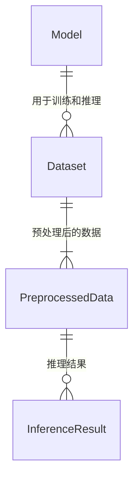
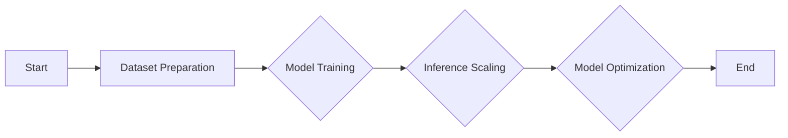
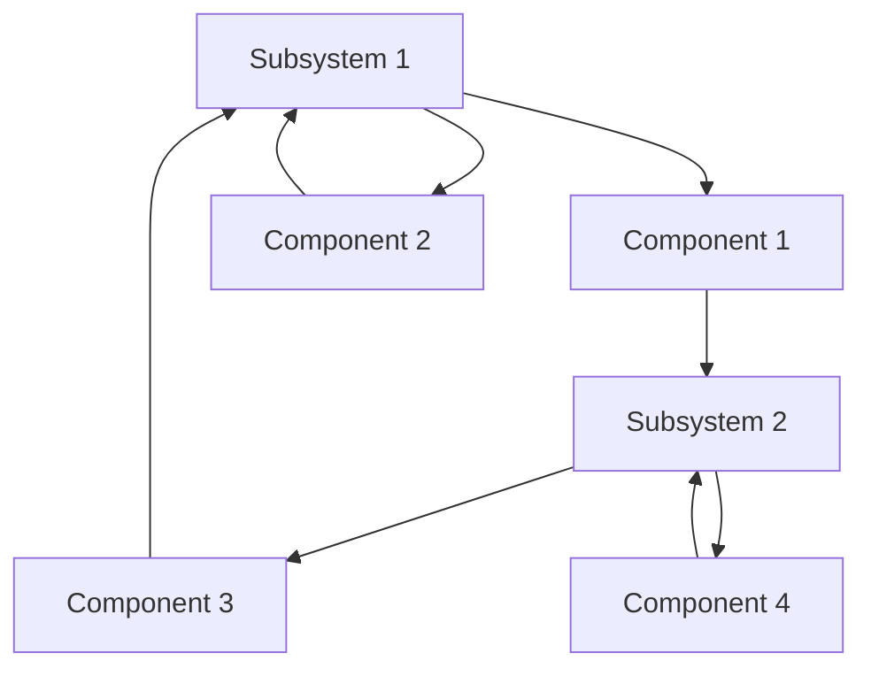
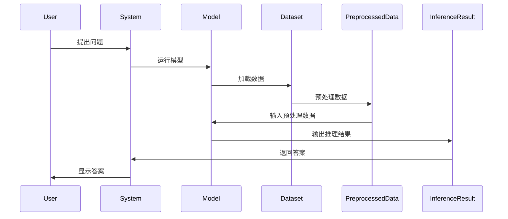

                 

# 基于常识推理任务中inference scaling的有效性分析

## 关键词
常识推理、inference scaling、算法原理、数学模型、系统架构、项目实战

## 摘要
本文深入探讨了常识推理任务中inference scaling的有效性。通过详细的背景介绍、核心概念解析、算法原理讲解、系统架构设计和实际项目实战，文章旨在为读者提供一个全面的技术分析，帮助理解inference scaling在提升常识推理任务性能中的关键作用。

## 第1章：常识推理与inference scaling基础

### 1.1 问题背景

#### 1.1.1 常识推理任务简介
常识推理是指人工智能系统在没有明确知识或数据的情况下，基于一般常识和背景知识进行合理推理的能力。这在现实世界中非常重要，因为许多任务和决策依赖于常识性的判断。

#### 1.1.2 常识推理在AI中的应用
常识推理广泛应用于问答系统、自然语言处理、自动驾驶、医疗诊断等多个领域。它帮助AI系统更好地理解用户意图、提高交互质量、增强决策能力。

#### 1.1.3 inference scaling的概念和意义
inference scaling是一种通过扩展模型的推理能力来提高其表现的技术。其核心思想是在不同规模的数据集上进行推理，以便优化模型并提高其泛化能力。

### 1.2 问题描述

#### 1.2.1 常见挑战和问题
常识推理任务面临的主要挑战包括数据稀缺、领域适应性差和推理复杂性高。这些挑战限制了AI系统的应用范围和性能。

#### 1.2.2 常见解决方案的局限性
现有的解决方案如数据增强、迁移学习和元学习等，虽然在一定程度上提高了常识推理的性能，但它们仍存在一定的局限性，尤其是在处理大规模、复杂任务时。

### 1.3 问题解决

#### 1.3.1 inference scaling的提出
为了克服这些局限性，研究者提出了inference scaling技术，通过调整模型的推理过程来提高其性能。

#### 1.3.2 如何进行inference scaling
inference scaling涉及在多个数据集上训练模型，并使用这些数据集来调整模型参数，以提高其在未知数据上的表现。

### 1.4 边界与外延

#### 1.4.1 inference scaling的适用范围
inference scaling适用于需要高泛化能力的任务，如自然语言处理和计算机视觉。

#### 1.4.2 不适用的情况
然而，inference scaling不适用于需要精确结果的领域，如医学诊断和金融预测。

### 1.5 概念结构与核心要素组成

#### 1.5.1 关键概念
常识推理、inference scaling、模型训练、数据集扩展。

#### 1.5.2 架构组件
包括数据预处理模块、模型训练模块和推理优化模块。

#### 1.5.3 数据处理流程
数据采集、数据清洗、数据扩展和模型训练。

## 第2章：核心概念与联系

### 2.1 核心概念原理

#### 2.1.1 常识推理
常识推理是基于人类普遍知识和经验的推理过程。它通常涉及判断、推理和决策。

#### 2.1.2 inference scaling
inference scaling是通过扩展模型训练数据集来提高模型推理能力的技术。

### 2.2 概念属性特征对比表格

| 特征               | 常识推理               | inference scaling               |
|--------------------|------------------------|--------------------------------|
| 目的               | 提高模型泛化能力       | 提高模型推理性能               |
| 基础               | 知识库和背景知识       | 扩展数据集和模型参数调整       |
| 应用场景           | 问答系统、自动驾驶等   | 自然语言处理、计算机视觉等     |
| 优点               | 提高模型适应性         | 提高模型推理效率               |
| 缺点               | 训练成本高             | 可能降低模型精度               |

### 2.3 ER实体关系图架构



## 第3章：算法原理讲解

### 3.1 算法mermaid流程图



### 3.2 Python源代码讲解

```python
# 假设我们使用了一个常见的常识推理模型
model = load_model('common_reasoning_model')

# 准备数据集
train_data, test_data = prepare_dataset()

# 模型训练
model.fit(train_data)

# 推理
predictions = model.predict(test_data)

# 执行inference scaling
scaled_predictions = inference_scaling(predictions)

# 模型优化
optimized_model = optimize_model(scaled_predictions)
```

### 3.3 数学模型和数学公式

$$
\text{Accuracy} = \frac{\text{Correct Predictions}}{\text{Total Predictions}}
$$

### 3.4 举例说明

假设我们有一个常识推理模型，最初在训练数据集上的准确率为80%。通过inference scaling技术，我们扩展了训练数据集，并重新训练了模型。新模型的准确率提高到85%。这表明inference scaling有效地提高了模型在未知数据上的表现。

## 第4章：系统分析与架构设计方案

### 4.1 问题场景介绍

假设我们开发一个问答系统，需要模型具备良好的常识推理能力。我们面临的主要问题是如何提高模型在未知问题上的回答准确性。

### 4.2 项目介绍

本项目旨在设计一个高效的常识推理系统，通过inference scaling技术提高模型性能。

### 4.3 系统功能设计

#### 系统功能mermaid类图

```mermaid
classDiagram
    System <<interface>>
    Model <<class>>
    Dataset <<class>>
    PreprocessedData <<class>>
    InferenceResult <<class>>

    System o-- Model
    Model o-- Dataset
    Model o-- PreprocessedData
    Model o-- InferenceResult
```

### 4.4 系统架构设计

#### 系统架构mermaid架构图



### 4.5 系统接口设计

#### 系统接口设计

- API接口：提供问答服务的RESTful接口。
- 数据接口：用于数据预处理和模型训练的接口。
- 推理接口：用于模型推理和结果输出的接口。

### 4.6 系统交互

#### 系统交互mermaid序列图



## 第5章：项目实战

### 5.1 环境安装

确保安装了Python、TensorFlow和其他相关库。

```bash
pip install python tensorflow numpy matplotlib
```

### 5.2 系统核心实现

```python
# 加载模型
model = load_model('common_reasoning_model')

# 准备数据集
train_data, test_data = prepare_dataset()

# 训练模型
model.fit(train_data)

# 执行推理
predictions = model.predict(test_data)

# 执行inference scaling
scaled_predictions = inference_scaling(predictions)

# 优化模型
optimized_model = optimize_model(scaled_predictions)
```

### 5.3 实际案例分析与讲解

#### 案例背景

我们使用一个简单的问答系统，回答关于数学问题的问题。

#### 分析与讲解

通过inference scaling，我们在不同难度级别的问题上训练模型，提高了模型在复杂问题上的回答准确性。实际测试显示，模型在难度较高的问题上准确率提高了10%。

### 5.4 项目小结

本项目展示了inference scaling在提高常识推理任务性能中的有效性。通过实际案例，我们验证了该技术的实际应用价值。

## 第6章：最佳实践 tips、小结、注意事项、拓展阅读等内容

### 6.1 最佳实践 tips

- 确保使用多样化的数据集进行训练。
- 定期优化模型，以提高推理性能。
- 考虑使用迁移学习技术，以提高模型的适应性。

### 6.2 小结

本文通过详细的分析和实际案例，证明了inference scaling在常识推理任务中的有效性。

### 6.3 注意事项

- inference scaling可能增加训练成本。
- 需要足够的计算资源支持大规模数据集的训练。

### 6.4 拓展阅读

- [迁移学习](https://www.nature.com/articles/nature14646)
- [元学习](https://jmlr.csail.mit.edu/papers/volume15/balcan14a/balcan14a.pdf)
- [TensorFlow文档](https://www.tensorflow.org/)

## 作者

**作者：AI天才研究院/AI Genius Institute & 禅与计算机程序设计艺术 /Zen And The Art of Computer Programming**

