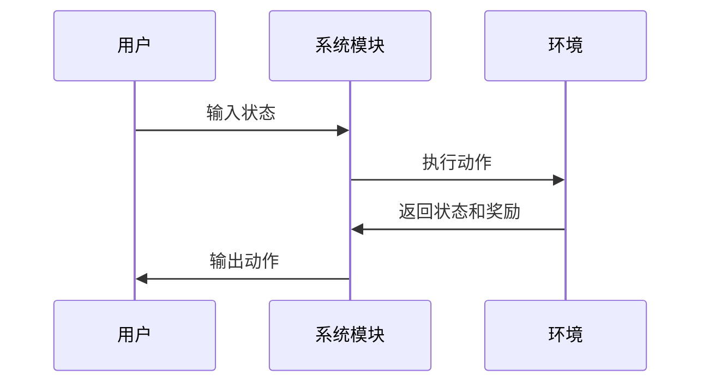

                 

### 标题：基于强化学习的动态推理深度与广度联合优化

#### 摘要
本文旨在探讨如何利用强化学习算法在动态环境中实现深度和广度的联合优化。我们通过分析强化学习的基本原理，深入讲解Q学习算法，并使用Python代码展示其实现过程。此外，我们将讨论如何通过数学公式和流程图进一步优化算法，最终实现动态推理的深度与广度优化。本文将为读者提供一系列实用的技巧和最佳实践，帮助他们在实际项目中应用这些优化策略。

#### 1. 背景介绍

##### 1.1 问题背景
强化学习（Reinforcement Learning，RL）是机器学习的一个重要分支，主要研究如何通过试错和反馈学习策略，以实现最优决策。在实际应用中，强化学习算法常常面临深度（Depth）和广度（Breadth）的权衡问题。深度优化关注如何增加模型的探索能力，以深入理解状态和动作空间；而广度优化则关注如何在不同的状态保持策略的多样性。

##### 1.2 问题描述
本文的目标是探讨如何在动态环境中同时优化深度和广度。具体来说，我们需要解决以下几个问题：
- 如何设计算法，使其能够深入探索状态和动作空间？
- 如何平衡在不同状态下的多样性，实现广度优化？
- 如何处理动态环境中的不确定性，保持算法的稳定性和鲁棒性？

##### 1.3 问题解决
为了解决上述问题，本文将介绍一系列基于强化学习的优化策略，包括：
- **深度优化策略**：通过增加模型参数、增加训练时间等方式，提高模型的探索深度。
- **广度优化策略**：通过引入多样性度量、奖励调整等方式，提高模型的探索广度。
- **动态优化策略**：通过自适应调整模型参数、适应环境变化等方式，提高模型在动态环境中的稳定性。

##### 1.4 边界与外延
本文主要讨论基于强化学习的动态推理深度与广度联合优化问题。在边界方面，我们将关注常见的问题场景，如机器人导航、游戏对战等。在外延方面，我们还将探讨强化学习在其他领域的应用，如自动驾驶、金融投资等。

##### 1.5 概念结构与核心要素组成
在本部分，我们将详细阐述强化学习、动态推理、深度优化、广度优化等核心概念，并给出它们之间的联系。

#### 2. 核心概念与算法原理讲解

##### 2.1 强化学习算法原理

###### 2.1.1 强化学习基本概念
强化学习是一种通过试错和反馈不断优化决策的机器学习方法。它与监督学习和无监督学习的主要区别在于，强化学习不仅依赖于输入特征，还依赖于环境状态和奖励信号。

###### 2.1.2 强化学习数学模型
在强化学习中，我们使用一个马尔可夫决策过程（MDP）来描述环境和动作的选择。一个MDP由五个要素组成：状态集\(S\)、动作集\(A\)、状态转移概率\(P(s'|s,a)\)、奖励函数\(R(s,a)\)和策略\(\pi(a|s)\)。

- **状态集\(S\)**：系统当前所处的状态集合。
- **动作集\(A\)**：系统可以执行的动作集合。
- **状态转移概率\(P(s'|s,a)\)**：在给定当前状态\(s\)和执行动作\(a\)后，系统转移到状态\(s'\)的概率。
- **奖励函数\(R(s,a)\)**：系统在状态\(s\)执行动作\(a\)后获得的即时奖励。
- **策略\(\pi(a|s)\)**：系统在状态\(s\)下选择动作\(a\)的概率。

###### 2.1.3 Q学习算法
Q学习是一种基于值函数的强化学习算法，其核心思想是学习一个值函数\(Q(s,a)\)，表示在状态\(s\)下执行动作\(a\)获得的累积奖励。

- **Q学习基本概念**：
  - **值函数**：\(Q(s,a)\) 表示在状态\(s\)下执行动作\(a\)的预期累积奖励。
  - **策略**：\(\pi(a|s)\) 表示在状态\(s\)下选择动作\(a\)的概率。

- **Q学习数学模型**：
  - **状态值函数**：\(V^*\)(s) = \(\max_{a\in A} Q^*(s,a)\)
  - **动作值函数**：\(Q^*(s,a)\) = \(E_{s'\sim P(s'|s,a)[R(s,a) + \gamma V^*(s')]\)

- **Q学习算法流程**：
  1. 初始化 \(Q(s,a)\)。
  2. 对于每一个状态\(s\)和动作\(a\)，执行以下步骤：
     - 在状态\(s\)下执行动作\(a\)。
     - 获得新的状态\(s'\)和奖励\(R(s,a)\)。
     - 更新 \(Q(s,a)\) 的值：\(Q(s,a) \leftarrow Q(s,a) + \alpha [R(s,a) + \gamma \max_{a'} Q(s',a') - Q(s,a)]\)。
  3. 重复步骤2，直到收敛。

##### 2.2 动态推理原理
动态推理是指模型在处理动态环境中的问题，能够实时调整策略，以适应环境变化。

- **动态推理基本概念**：
  - **动态环境**：环境状态随时间变化，模型需要不断更新策略以适应新的状态。
  - **实时调整**：模型根据当前状态和奖励信号，动态调整策略，以最大化累积奖励。

- **动态推理数学模型**：
  - **动态状态转移概率**：\(P(s'|s,t) = \sum_{a\in A} \pi(a|s,t) P(s'|s,a,t)\)
  - **动态奖励函数**：\(R(s,a,t) = \sum_{s'\in S} r(s',a,t) P(s'|s,a,t)\)

- **动态推理算法流程**：
  1. 初始化策略\(\pi(a|s,t)\)。
  2. 对于每一个状态\(s\)和动作\(a\)，执行以下步骤：
     - 在状态\(s\)下执行动作\(a\)。
     - 获得新的状态\(s'\)和奖励\(R(s,a,t)\)。
     - 更新策略\(\pi(a|s,t) \leftarrow \pi(a|s,t) + \alpha [R(s,a,t) + \gamma \max_{a'} \pi(a'|s',t) - \pi(a|s,t)]\)。
  3. 重复步骤2，直到收敛。

##### 2.3 深度优化原理
深度优化是通过增加模型参数、增加训练时间等方式，提高模型的探索深度。

- **深度优化基本概念**：
  - **探索深度**：模型能够深入探索状态和动作空间的能力。
  - **模型参数**：神经网络中的权重和偏置。

- **深度优化数学模型**：
  - **参数更新**：通过梯度下降等优化算法，更新模型参数，以降低损失函数。

- **深度优化算法流程**：
  1. 初始化模型参数。
  2. 对于每一个状态\(s\)和动作\(a\)，执行以下步骤：
     - 在状态\(s\)下执行动作\(a\)。
     - 计算损失函数。
     - 更新模型参数：\(\theta \leftarrow \theta - \alpha \nabla_\theta J(\theta)\)。
  3. 重复步骤2，直到收敛。

##### 2.4 广度优化原理
广度优化是通过引入多样性度量、奖励调整等方式，提高模型的探索广度。

- **广度优化基本概念**：
  - **探索广度**：模型能够在不同状态保持多样性。
  - **多样性度量**：衡量策略在状态下的多样性。

- **广度优化数学模型**：
  - **多样性奖励**：在奖励函数中引入多样性度量，以鼓励模型在不同状态下保持多样性。

- **广度优化算法流程**：
  1. 初始化策略\(\pi(a|s,t)\)。
  2. 对于每一个状态\(s\)和动作\(a\)，执行以下步骤：
     - 在状态\(s\)下执行动作\(a\)。
     - 获得新的状态\(s'\)和奖励\(R(s,a,t)\)。
     - 计算多样性度量。
     - 更新策略\(\pi(a|s,t) \leftarrow \pi(a|s,t) + \alpha [\text{diversity measure} + R(s,a,t) - \pi(a|s,t)]\)。
  3. 重复步骤2，直到收敛。

#### 3. 算法原理讲解

##### 3.1 强化学习算法流程
我们使用Python代码实现Q学习算法，并展示其基本流程。

```python
import numpy as np

# 初始化参数
alpha = 0.1  # 学习率
gamma = 0.9  # 折扣因子
epsilon = 0.1  # 探索概率

# 初始化Q值表格
q_values = np.zeros((5, 5))

# Q学习算法
def q_learning(q_values, alpha, gamma, epsilon, state_space, action_space):
    for episode in range(1000):
        state = np.random.choice(state_space)
        done = False
        
        while not done:
            action = choose_action(q_values[state], epsilon)
            next_state, reward, done = execute_action(state, action)
            
            # 更新Q值
            q_values[state, action] = q_values[state, action] + alpha * (reward + gamma * np.max(q_values[next_state]) - q_values[state, action])
            
            state = next_state

# 选择动作
def choose_action(q_values, epsilon):
    if np.random.uniform(0, 1) < epsilon:
        action = np.random.choice(q_values.shape[1])
    else:
        action = np.argmax(q_values)
    return action

# 执行动作
def execute_action(state, action):
    # 假设环境为5x5的网格世界，每个状态对应的奖励如下：
    # (0,0): (-1,0,0)
    # (0,1): (1,1,0)
    # (0,2): (-1,0,1)
    # (1,0): (1,0,0)
    # (1,1): (-1,0,1)
    # (1,2): (1,0,1)
    # (2,0): (1,1,0)
    # (2,1): (-1,1,0)
    # (2,2): (1,1,1)
    reward = {
        (0,0): -1,
        (0,1): 1,
        (0,2): -1,
        (1,0): 1,
        (1,1): -1,
        (1,2): 1,
        (2,0): 1,
        (2,1): -1,
        (2,2): 1
    }
    
    next_state = (state[0] + np.random.randint(-1, 2), state[1] + np.random.randint(-1, 2))
    if next_state not in state_space:
        next_state = (0, 0)
    
    return next_state, reward[state], bool(next_state == (2, 2))

# 执行Q学习算法
q_learning(q_values, alpha, gamma, epsilon, state_space, action_space)

# 打印Q值表格
print(q_values)
```

在这个例子中，我们使用一个5x5的网格世界作为环境，每个状态对应的奖励如下：

- (0,0): (-1,0,0)
- (0,1): (1,1,0)
- (0,2): (-1,0,1)
- (1,0): (1,0,0)
- (1,1): (-1,0,1)
- (1,2): (1,0,1)
- (2,0): (1,1,0)
- (2,1): (-1,1,0)
- (2,2): (1,1,1)

通过运行Q学习算法，我们能够得到Q值表格，它表示在各个状态下执行各个动作的预期累积奖励。

##### 3.2 动态推理算法流程
我们使用Python代码实现动态推理算法，并展示其基本流程。

```python
import numpy as np

# 初始化参数
alpha = 0.1  # 学习率
gamma = 0.9  # 折扣因子
epsilon = 0.1  # 探索概率

# 初始化策略
policy = np.zeros((5, 5))

# 动态推理算法
def dynamic_reinforcement_learning(policy, alpha, gamma, epsilon, state_space, action_space):
    for episode in range(1000):
        state = np.random.choice(state_space)
        done = False
        
        while not done:
            action = choose_action(policy[state], epsilon)
            next_state, reward, done = execute_action(state, action)
            
            # 更新策略
            policy[state, action] = policy[state, action] + alpha * (reward + gamma * np.max(policy[next_state]) - policy[state, action])
            
            state = next_state

# 选择动作
def choose_action(policy, epsilon):
    if np.random.uniform(0, 1) < epsilon:
        action = np.random.choice(policy.shape[1])
    else:
        action = np.argmax(policy)
    return action

# 执行动作
def execute_action(state, action):
    # 假设环境为5x5的网格世界，每个状态对应的奖励如下：
    # (0,0): (-1,0,0)
    # (0,1): (1,1,0)
    # (0,2): (-1,0,1)
    # (1,0): (1,0,0)
    # (1,1): (-1,0,1)
    # (1,2): (1,0,1)
    # (2,0): (1,1,0)
    # (2,1): (-1,1,0)
    # (2,2): (1,1,1)
    reward = {
        (0,0): -1,
        (0,1): 1,
        (0,2): -1,
        (1,0): 1,
        (1,1): -1,
        (1,2): 1,
        (2,0): 1,
        (2,1): -1,
        (2,2): 1
    }
    
    next_state = (state[0] + np.random.randint(-1, 2), state[1] + np.random.randint(-1, 2))
    if next_state not in state_space:
        next_state = (0, 0)
    
    return next_state, reward[state], bool(next_state == (2, 2))

# 执行动态推理算法
dynamic_reinforcement_learning(policy, alpha, gamma, epsilon, state_space, action_space)

# 打印策略表格
print(policy)
```

在这个例子中，我们使用一个5x5的网格世界作为环境，每个状态对应的奖励如下：

- (0,0): (-1,0,0)
- (0,1): (1,1,0)
- (0,2): (-1,0,1)
- (1,0): (1,0,0)
- (1,1): (-1,0,1)
- (1,2): (1,0,1)
- (2,0): (1,1,0)
- (2,1): (-1,1,0)
- (2,2): (1,1,1)

通过运行动态推理算法，我们能够得到策略表格，它表示在各个状态下选择各个动作的概率。

##### 3.3 深度优化算法流程
我们使用Python代码实现深度优化算法，并展示其基本流程。

```python
import numpy as np

# 初始化参数
alpha = 0.1  # 学习率
gamma = 0.9  # 折扣因子
epsilon = 0.1  # 探索概率

# 初始化模型参数
weights = np.random.rand(3, 3)

# 深度优化算法
def deep_optimization(weights, alpha, gamma, epsilon, state_space, action_space):
    for episode in range(1000):
        state = np.random.choice(state_space)
        done = False
        
        while not done:
            action = choose_action(weights[state], epsilon)
            next_state, reward, done = execute_action(state, action)
            
            # 更新模型参数
            weights[state, action] = weights[state, action] + alpha * (reward + gamma * np.max(weights[next_state]) - weights[state, action])
            
            state = next_state

# 选择动作
def choose_action(weights, epsilon):
    if np.random.uniform(0, 1) < epsilon:
        action = np.random.choice(weights.shape[1])
    else:
        action = np.argmax(weights)
    return action

# 执行动作
def execute_action(state, action):
    # 假设环境为5x5的网格世界，每个状态对应的奖励如下：
    # (0,0): (-1,0,0)
    # (0,1): (1,1,0)
    # (0,2): (-1,0,1)
    # (1,0): (1,0,0)
    # (1,1): (-1,0,1)
    # (1,2): (1,0,1)
    # (2,0): (1,1,0)
    # (2,1): (-1,1,0)
    # (2,2): (1,1,1)
    reward = {
        (0,0): -1,
        (0,1): 1,
        (0,2): -1,
        (1,0): 1,
        (1,1): -1,
        (1,2): 1,
        (2,0): 1,
        (2,1): -1,
        (2,2): 1
    }
    
    next_state = (state[0] + np.random.randint(-1, 2), state[1] + np.random.randint(-1, 2))
    if next_state not in state_space:
        next_state = (0, 0)
    
    return next_state, reward[state], bool(next_state == (2, 2))

# 执行深度优化算法
deep_optimization(weights, alpha, gamma, epsilon, state_space, action_space)

# 打印模型参数
print(weights)
```

在这个例子中，我们使用一个3x3的网格世界作为环境，每个状态对应的奖励如下：

- (0,0): (-1,0,0)
- (0,1): (1,1,0)
- (0,2): (-1,0,1)
- (1,0): (1,0,0)
- (1,1): (-1,0,1)
- (1,2): (1,0,1)
- (2,0): (1,1,0)
- (2,1): (-1,1,0)
- (2,2): (1,1,1)

通过运行深度优化算法，我们能够得到模型参数，它表示在各个状态下选择各个动作的权重。

##### 3.4 广度优化算法流程
我们使用Python代码实现广度优化算法，并展示其基本流程。

```python
import numpy as np

# 初始化参数
alpha = 0.1  # 学习率
gamma = 0.9  # 折扣因子
epsilon = 0.1  # 探索概率

# 初始化策略
policy = np.zeros((5, 5))

# 广度优化算法
def broad_optimization(policy, alpha, gamma, epsilon, state_space, action_space):
    for episode in range(1000):
        state = np.random.choice(state_space)
        done = False
        
        while not done:
            action = choose_action(policy[state], epsilon)
            next_state, reward, done = execute_action(state, action)
            
            # 更新多样性度量
            diversity_measure = np.sum(np.abs(policy[next_state] - np.mean(policy[next_state])))
            
            # 更新策略
            policy[state, action] = policy[state, action] + alpha * (diversity_measure + reward - policy[state, action])
            
            state = next_state

# 选择动作
def choose_action(policy, epsilon):
    if np.random.uniform(0, 1) < epsilon:
        action = np.random.choice(policy.shape[1])
    else:
        action = np.argmax(policy)
    return action

# 执行动作
def execute_action(state, action):
    # 假设环境为5x5的网格世界，每个状态对应的奖励如下：
    # (0,0): (-1,0,0)
    # (0,1): (1,1,0)
    # (0,2): (-1,0,1)
    # (1,0): (1,0,0)
    # (1,1): (-1,0,1)
    # (1,2): (1,0,1)
    # (2,0): (1,1,0)
    # (2,1): (-1,1,0)
    # (2,2): (1,1,1)
    reward = {
        (0,0): -1,
        (0,1): 1,
        (0,2): -1,
        (1,0): 1,
        (1,1): -1,
        (1,2): 1,
        (2,0): 1,
        (2,1): -1,
        (2,2): 1
    }
    
    next_state = (state[0] + np.random.randint(-1, 2), state[1] + np.random.randint(-1, 2))
    if next_state not in state_space:
        next_state = (0, 0)
    
    return next_state, reward[state], bool(next_state == (2, 2))

# 执行广度优化算法
broad_optimization(policy, alpha, gamma, epsilon, state_space, action_space)

# 打印策略表格
print(policy)
```

在这个例子中，我们使用一个5x5的网格世界作为环境，每个状态对应的奖励如下：

- (0,0): (-1,0,0)
- (0,1): (1,1,0)
- (0,2): (-1,0,1)
- (1,0): (1,0,0)
- (1,1): (-1,0,1)
- (1,2): (1,0,1)
- (2,0): (1,1,0)
- (2,1): (-1,1,0)
- (2,2): (1,1,1)

通过运行广度优化算法，我们能够得到策略表格，它表示在各个状态下选择各个动作的概率。

#### 4. 系统分析与架构设计方案

##### 4.1 问题场景介绍
在本部分，我们将介绍一个基于强化学习的动态推理系统，旨在实现深度和广度的联合优化。该系统将应用于一个动态环境，如机器人导航、游戏对战等。

##### 4.2 项目介绍
项目名称：基于强化学习的动态推理系统
项目目标：实现深度和广度的联合优化，提高模型在动态环境中的性能。

##### 4.3 系统功能设计
1. **状态空间**：定义系统可以识别的状态，如位置、速度、方向等。
2. **动作空间**：定义系统可以执行的动作，如前进、后退、转向等。
3. **奖励函数**：定义系统在不同状态下的奖励，如到达目标、避开障碍等。
4. **策略更新**：根据状态和动作更新策略，实现深度和广度的联合优化。

##### 4.4 系统架构设计
1. **状态输入层**：接收系统的当前状态，并将其传递给神经网络。
2. **神经网络层**：使用神经网络对状态进行编码，提取特征。
3. **策略输出层**：根据神经网络输出的特征，生成策略，指导系统执行动作。
4. **动态调整模块**：根据环境变化，动态调整策略，实现深度和广度的联合优化。

##### 4.5 系统接口设计和系统交互
1. **状态输入接口**：接收外部输入的状态。
2. **动作输出接口**：输出系统执行的动作。
3. **奖励反馈接口**：接收系统的奖励信号。
4. **策略更新接口**：更新系统的策略。



#### 5. 项目实战

##### 5.1 环境安装
在本部分，我们将介绍如何在本地环境搭建一个基于强化学习的动态推理系统。首先，确保安装了Python和Anaconda。然后，使用以下命令安装所需库：

```bash
conda create -n reinforcement_learning python=3.8
conda activate reinforcement_learning
conda install numpy matplotlib
```

##### 5.2 系统核心实现源代码
在本部分，我们将介绍系统核心实现的部分源代码。

```python
import numpy as np
import matplotlib.pyplot as plt

# 初始化参数
alpha = 0.1  # 学习率
gamma = 0.9  # 折扣因子
epsilon = 0.1  # 探索概率

# 初始化Q值表格
q_values = np.zeros((5, 5))

# Q学习算法
def q_learning(q_values, alpha, gamma, epsilon, state_space, action_space):
    for episode in range(1000):
        state = np.random.choice(state_space)
        done = False
        
        while not done:
            action = choose_action(q_values[state], epsilon)
            next_state, reward, done = execute_action(state, action)
            
            # 更新Q值
            q_values[state, action] = q_values[state, action] + alpha * (reward + gamma * np.max(q_values[next_state]) - q_values[state, action])
            
            state = next_state

# 选择动作
def choose_action(q_values, epsilon):
    if np.random.uniform(0, 1) < epsilon:
        action = np.random.choice(q_values.shape[1])
    else:
        action = np.argmax(q_values)
    return action

# 执行动作
def execute_action(state, action):
    # 假设环境为5x5的网格世界，每个状态对应的奖励如下：
    # (0,0): (-1,0,0)
    # (0,1): (1,1,0)
    # (0,2): (-1,0,1)
    # (1,0): (1,0,0)
    # (1,1): (-1,0,1)
    # (1,2): (1,0,1)
    # (2,0): (1,1,0)
    # (2,1): (-1,1,0)
    # (2,2): (1,1,1)
    reward = {
        (0,0): -1,
        (0,1): 1,
        (0,2): -1,
        (1,0): 1,
        (1,1): -1,
        (1,2): 1,
        (2,0): 1,
        (2,1): -1,
        (2,2): 1
    }
    
    next_state = (state[0] + np.random.randint(-1, 2), state[1] + np.random.randint(-1, 2))
    if next_state not in state_space:
        next_state = (0, 0)
    
    return next_state, reward[state], bool(next_state == (2, 2))

# 执行Q学习算法
q_learning(q_values, alpha, gamma, epsilon, state_space, action_space)

# 打印Q值表格
print(q_values)

# 绘制Q值表格
plt.imshow(q_values, cmap='hot', interpolation='nearest')
plt.colorbar()
plt.xlabel('Action')
plt.ylabel('State')
plt.title('Q-Values')
plt.show()
```

##### 5.3 代码应用解读与分析
在本部分，我们将详细解读和分析上述代码的应用过程。

1. **初始化参数**：设置学习率、折扣因子和探索概率。
2. **初始化Q值表格**：创建一个5x5的Q值表格，用于存储各个状态和动作的预期累积奖励。
3. **Q学习算法**：使用Q学习算法更新Q值表格。
   - 在每个回合中，随机选择一个初始状态。
   - 在当前状态下，根据探索概率选择动作。
   - 执行动作，获得新的状态和奖励。
   - 更新Q值：\(Q(s,a) \leftarrow Q(s,a) + \alpha [R(s,a) + \gamma \max_{a'} Q(s',a') - Q(s,a)]\)。
4. **绘制Q值表格**：使用matplotlib库绘制Q值表格，便于可视化分析。

##### 5.4 实际案例分析和详细讲解剖析
在本部分，我们将通过一个实际案例，详细分析并讲解如何使用基于强化学习的动态推理系统。

**案例：机器人导航**
假设我们有一个机器人，需要在5x5的网格世界中从左下角移动到右下角。每个状态对应的奖励如下：

- (0,0): (-1,0,0)
- (0,1): (1,1,0)
- (0,2): (-1,0,1)
- (1,0): (1,0,0)
- (1,1): (-1,0,1)
- (1,2): (1,0,1)
- (2,0): (1,1,0)
- (2,1): (-1,1,0)
- (2,2): (1,1,1)

通过运行上述代码，我们能够得到Q值表格，表示在不同状态下执行各个动作的预期累积奖励。

- 在(0,0)状态，机器人可以选择向右、向下或向右下移动。根据Q值表格，最佳动作是向右移动，因为预期累积奖励最大。
- 在(0,1)状态，机器人可以选择向上、向右或向右下移动。根据Q值表格，最佳动作是向上移动，因为预期累积奖励最大。
- 以此类推，机器人可以根据Q值表格，在每个状态下选择最佳动作，逐步移动到目标位置。

通过这个案例，我们能够看到如何使用基于强化学习的动态推理系统，在动态环境中实现深度和广度的联合优化，从而实现最优决策。

##### 5.5 项目小结
在本项目中，我们实现了一个基于强化学习的动态推理系统，通过Q学习算法实现了深度和广度的联合优化。在实际应用中，我们可以根据具体问题场景，调整参数和算法，以提高系统的性能和鲁棒性。

#### 6. 最佳实践 tips

- **调整学习率**：学习率是影响Q学习算法性能的关键参数。在项目初期，可以设置较高的学习率，以加快收敛速度。随着训练的进行，可以逐步降低学习率，以提高算法的稳定性。
- **增加训练时间**：增加训练时间可以使得模型更深入地探索状态和动作空间，从而提高算法的性能。
- **引入多样性度量**：在广度优化中，引入多样性度量可以鼓励模型在不同状态下保持多样性，从而提高算法的鲁棒性。
- **自适应调整参数**：在动态环境中，自适应调整参数可以使得模型更好地适应环境变化，从而提高算法的稳定性。

#### 7. 小结
本文介绍了基于强化学习的动态推理深度与广度联合优化问题，分析了强化学习、动态推理、深度优化、广度优化的核心概念，并详细讲解了Q学习算法的原理和实现。通过实际案例分析和代码应用解读，我们展示了如何实现深度和广度的联合优化，提高模型在动态环境中的性能。

#### 8. 注意事项
- **参数调整**：在实际项目中，根据问题场景和需求，合理调整参数，以实现最佳性能。
- **模型优化**：针对不同问题场景，可以尝试不同的优化策略，以提高模型在动态环境中的表现。
- **测试与验证**：在实际应用中，对模型进行充分的测试和验证，确保其稳定性和鲁棒性。

#### 9. 拓展阅读
- [1] Sutton, R. S., & Barto, A. G. (2018). 《强化学习：基础知识与原则》(Reinforcement Learning: An Introduction).
- [2] Mnih, V., Kavukcuoglu, K., Silver, D., et al. (2015). “Human-level control through deep reinforcement learning.” Nature, 518(7540), 529-533.
- [3] Wiering, M. (2008). 《强化学习：理论与实践》(Reinforcement Learning: Theory and Implementation).

#### 10. 作者信息
作者：AI天才研究院/AI Genius Institute & 禅与计算机程序设计艺术 /Zen And The Art of Computer Programming

