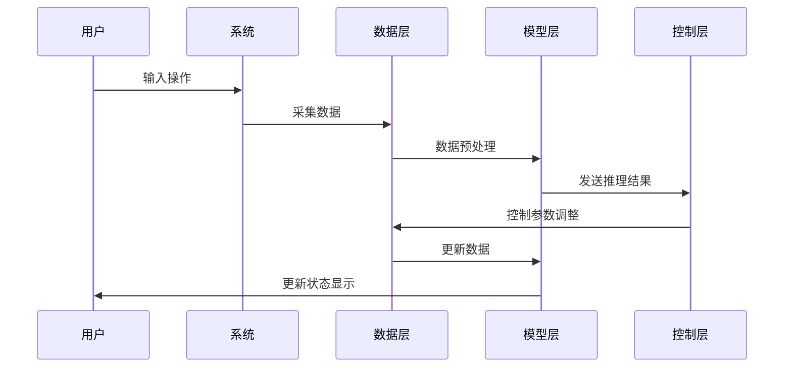

                 

### # 基于强化学习的动态推理深度与广度自适应控制

关键词：强化学习、动态推理、自适应控制、深度学习、控制算法

摘要：本文将探讨基于强化学习的动态推理深度与广度自适应控制技术，通过对强化学习、动态推理和自适应控制的基本概念及其相互关系的深入分析，阐述该技术在解决复杂控制问题中的应用潜力。文章结构包括：引言、背景与核心概念、强化学习基础、动态推理技术、自适应控制理论、深度强化学习技术、系统分析与架构设计、项目实战以及总结与拓展阅读。

### 引言

在当今快速发展的信息技术时代，人工智能（AI）已经成为推动科技进步和产业变革的重要力量。其中，强化学习（Reinforcement Learning，RL）作为一种重要的机器学习技术，已广泛应用于控制、游戏、机器人等领域。动态推理（Dynamic Reasoning）和自适应控制（Adaptive Control）作为强化学习的重要分支，分别在处理复杂环境和动态变化中发挥着关键作用。

强化学习是一种通过试错（trial-and-error）和反馈（feedback）来学习最优策略的机器学习方法。它模拟了人类学习的过程，使智能体（agent）在未知环境中通过不断尝试和修正来达到目标。动态推理则是在复杂环境中进行决策时，能够实时调整推理策略，以适应环境变化的技术。自适应控制则是一种根据系统状态和外部环境的变化，自动调整控制参数和控制策略的方法。

本文旨在探讨如何结合强化学习、动态推理和自适应控制，实现深度与广度的自适应控制。具体来说，我们将从以下几个方面展开讨论：

1. **强化学习的基础**：介绍强化学习的核心概念、基本原理以及常用的算法。
2. **动态推理技术**：探讨动态推理的基本概念、技术方法和应用场景。
3. **自适应控制理论**：分析自适应控制的原理、方法及其在控制工程中的应用。
4. **深度强化学习技术**：结合深度学习，介绍深度强化学习的基本方法和应用。
5. **系统分析与架构设计**：通过具体案例，展示如何进行系统分析与架构设计。
6. **项目实战**：介绍一个实际项目，详细讲解其实现过程和关键环节。
7. **总结与拓展阅读**：总结文章的主要观点，并提供进一步学习的资源。

通过上述讨论，我们希望能够为读者提供一个全面、深入的关于基于强化学习的动态推理深度与广度自适应控制的了解，并激发对该领域的兴趣和探索。

### 背景与核心概念

在探讨基于强化学习的动态推理深度与广度自适应控制之前，我们需要对相关核心概念进行详细介绍，包括强化学习、动态推理和自适应控制的定义、背景、相关问题和解决方法，以及这些概念之间的相互关系。

#### 强化学习

强化学习（Reinforcement Learning，RL）是一种通过试错和反馈来学习最优策略的机器学习方法。在强化学习中，智能体（agent）在一个环境中进行交互，通过不断地尝试和接收环境反馈来学习最优行为策略。其基本概念包括：

- **智能体（Agent）**：执行行为并接收环境反馈的实体。
- **环境（Environment）**：智能体进行交互的情境。
- **状态（State）**：环境在某一时刻的状态。
- **动作（Action）**：智能体可以执行的行为。
- **奖励（Reward）**：环境对智能体动作的反馈，用于指导智能体的学习。

强化学习的目标是通过学习使智能体在特定环境中获得最大的长期奖励。基本模型包括马尔可夫决策过程（MDP），其核心是状态-动作值函数（State-Action Value Function），用于估计在给定状态下执行特定动作的长期奖励。

强化学习的历史可以追溯到1950年代，当时Samuel开发的围棋游戏机被认为是强化学习的最早实例。随着深度学习技术的发展，强化学习也逐渐与深度学习结合，形成了深度强化学习（Deep Reinforcement Learning，DRL），进一步提升了强化学习的性能和应用范围。

#### 动态推理

动态推理（Dynamic Reasoning）是一种在复杂和动态环境中进行推理和决策的技术。与传统静态推理方法不同，动态推理能够在环境变化时实时调整推理策略，以适应新的情况。其核心概念包括：

- **静态推理（Static Reasoning）**：在固定环境中进行推理，不考虑环境变化。
- **动态推理（Dynamic Reasoning）**：在动态变化环境中进行推理，能够实时调整推理策略。

动态推理的基本方法包括：

1. **基于规则的推理**：使用规则库和推理机，根据当前状态和规则进行推理。
2. **基于模型的推理**：建立环境模型，通过模拟和预测来指导决策。
3. **基于贝叶斯网络的推理**：利用贝叶斯网络表示环境不确定性，进行推理和决策。

动态推理在自动驾驶、智能监控、动态规划等领域有广泛的应用。例如，在自动驾驶中，动态推理可以实时分析路况和周围车辆状态，调整驾驶策略，以应对突发情况。

#### 自适应控制

自适应控制（Adaptive Control）是一种在系统运行过程中能够自动调整控制参数和控制策略的方法。其核心目的是提高系统对不确定性和环境变化的适应能力，保证系统的稳定性和性能。主要方法包括：

- **模型参考自适应控制（Model Reference Adaptive Control，MRAC）**：通过实时更新系统模型，使控制策略能够适应系统变化。
- **自调节控制（Self-Tuning Control）**：通过在线辨识系统参数，自动调整控制参数。
- **基于学习的自适应控制（Learning-Based Adaptive Control）**：利用机器学习方法，如强化学习，自动调整控制策略。

自适应控制在工业过程控制、航空航天、机器人等领域有广泛应用。例如，在工业生产过程中，自适应控制可以应对设备老化、负载变化等问题，保证生产过程的稳定性和高效性。

#### 强化学习、动态推理和自适应控制的关系

强化学习、动态推理和自适应控制之间存在密切的联系和相互促进的关系。具体来说：

1. **强化学习为动态推理提供基础**：强化学习提供了智能体在动态环境中学习最优策略的方法，为动态推理提供了决策支持。
2. **动态推理为自适应控制提供方法**：动态推理能够实时调整推理策略，帮助自适应控制更好地应对环境变化。
3. **自适应控制为强化学习提供反馈**：自适应控制通过调整控制策略，提供了强化学习中的奖励信号，帮助智能体学习更优的策略。

总之，强化学习、动态推理和自适应控制相辅相成，共同构建了一个完整的动态控制系统，使得智能系统能够在复杂、动态的环境中高效运行。

### 强化学习基础

强化学习（Reinforcement Learning，RL）是机器学习领域的一个重要分支，其核心在于通过智能体（agent）与环境（environment）的交互，利用奖励信号（reward signals）来学习最优策略（optimal policy）。为了深入理解强化学习的原理和应用，我们需要从基本概念、常见算法以及这些算法的优缺点等方面进行详细探讨。

#### 基本概念

在强化学习中，有几个核心概念需要明确：

1. **智能体（Agent）**：在环境中执行动作并学习最优策略的实体。
2. **环境（Environment）**：智能体进行交互的情境，可以看作是一个状态转移概率和奖励函数的集合。
3. **状态（State）**：描述环境在某一时刻的属性和特征。
4. **动作（Action）**：智能体可以执行的行为。
5. **策略（Policy）**：智能体在特定状态下选择动作的规则。
6. **奖励（Reward）**：环境对智能体动作的即时反馈，用于指导智能体的学习。

强化学习的目标是通过学习一个最优策略，使智能体在长期内获得最大的总奖励。这一过程通常通过以下步骤进行：

1. **初始化**：设定初始状态、策略和奖励。
2. **执行动作**：智能体根据当前状态执行动作。
3. **获得奖励**：环境对动作进行评价，提供奖励信号。
4. **更新策略**：智能体根据奖励信号调整策略，以期望获得更多的奖励。
5. **重复过程**：智能体不断与环境交互，重复上述步骤，逐渐优化策略。

#### 常见算法

强化学习算法种类繁多，以下是其中几种常见算法及其基本原理：

1. **Q-Learning（Q值学习）**：

   Q-Learning是一种基于值函数的强化学习算法，其核心思想是估计状态-动作值函数（Q-value），即智能体在特定状态下执行特定动作的长期奖励。Q-Learning通过更新Q值来优化策略。

   - **算法原理**：$$Q(s, a) \leftarrow Q(s, a) + \alpha [r + \gamma \max_{a'} Q(s', a') - Q(s, a)]$$
   - **优缺点**：Q-Learning简单、易于实现，但可能陷入局部最优，且在状态和动作空间较大时计算复杂度高。

2. **SARSA（同步动作-状态值迭代）**：

   SARSA是一种基于策略的强化学习算法，与Q-Learning类似，但直接根据当前状态和动作更新值函数。SARSA无需目标值（target value），但需要更多的样本来收敛。

   - **算法原理**：$$Q(s, a) \leftarrow Q(s, a) + \alpha [r + \gamma Q(s', a')] - Q(s, a)]$$
   - **优缺点**：SARSA比Q-Learning更加稳健，但收敛速度较慢。

3. **Deep Q-Networks（DQN，深度Q网络）**：

   DQN是一种结合深度学习的强化学习算法，通过神经网络来近似状态-动作值函数。DQN引入经验回放（experience replay）和目标网络（target network）来缓解目标值抖动，提高学习稳定性。

   - **算法原理**：
     - **经验回放**：将智能体经历的状态、动作、奖励和下一个状态存储在记忆库中，随机抽样进行更新。
     - **目标网络**：定期更新目标网络，使其与当前网络保持一定的滞后，减少目标值抖动。
     - **算法流程**：
       1. 初始化神经网络、经验回放记忆库和目标网络。
       2. 从初始状态开始，选择动作并执行。
       3. 记录状态、动作、奖励和下一个状态。
       4. 将经历存储到经验回放记忆库。
       5. 随机抽样记忆库中的样本进行更新。
       6. 定期更新目标网络。
   - **优缺点**：DQN能够处理高维状态空间，但需要大量的训练数据和较长的训练时间。

4. **Policy Gradient方法**：

   Policy Gradient方法通过直接优化策略梯度来更新策略，常见的算法包括REINFORCE和PPO（Proximal Policy Optimization）。

   - **算法原理**：
     - **REINFORCE**：直接计算策略梯度并更新策略参数。
     - **PPO**：通过优化策略梯度并引入 proximal term，提高策略更新稳定性。
     - **优缺点**：Policy Gradient方法能够快速收敛，但容易受到噪声和方差的影响。

#### 算法优缺点对比

以下是对几种常见强化学习算法的优缺点进行对比：

| 算法      | 优点                                                       | 缺点                                                 |
| --------- | ---------------------------------------------------------- | ---------------------------------------------------- |
| Q-Learning | 简单、易于实现                                             | 可能陷入局部最优，计算复杂度高                         |
| SARSA     | 更稳健，不需要目标值                                       | 收敛速度较慢，需要更多样本                             |
| DQN       | 能够处理高维状态空间，引入经验回放和目标网络缓解目标值抖动 | 需要大量训练数据和较长的训练时间                      |
| REINFORCE | 能够快速收敛                                               | 易受噪声和方差的影响                                 |
| PPO       | 优化策略梯度，引入 proximal term 提高更新稳定性           | 相对于REINFORCE，计算复杂度和训练时间较高             |

#### 应用案例

强化学习在各个领域都有广泛的应用，以下是一些实际案例：

1. **游戏**：如Atari游戏、围棋等，通过强化学习训练智能体进行自主游戏。
2. **机器人控制**：如自动驾驶、无人机等，通过强化学习实现智能体的自主决策和动作控制。
3. **资源调度**：如数据中心、电网等，通过强化学习优化资源分配和调度策略，提高系统效率。
4. **推荐系统**：如个性化推荐、广告投放等，通过强化学习优化推荐策略，提高用户满意度和点击率。

强化学习作为一种重要的机器学习技术，通过不断优化算法和扩展应用场景，正逐渐改变着我们的生活和工作方式。在接下来的章节中，我们将进一步探讨动态推理技术及其在自适应控制中的应用。

### 动态推理技术

动态推理（Dynamic Reasoning）是人工智能领域的一个重要研究方向，它专注于在动态变化的环境中实时调整推理策略，以应对不断变化的情况。与传统静态推理方法不同，动态推理能够在动态环境中持续适应和优化推理过程。这一特性使得动态推理在自动驾驶、智能监控、实时决策系统等领域具有重要的应用价值。

#### 动态推理的基本概念

动态推理的核心在于其动态性，具体表现在以下几个方面：

- **实时性**：动态推理能够对环境中的实时数据进行处理，快速响应环境变化。
- **适应性**：动态推理能够在不同环境下根据实时反馈调整推理策略，以适应新的情况。
- **自调整**：动态推理系统具备自我调整能力，能够根据环境的变化自动调整推理模型和参数。

动态推理的关键概念包括：

1. **状态感知（State Awareness）**：动态推理系统需要具备对当前环境状态的理解和感知能力，以便做出合理的推理和决策。
2. **状态转移（State Transition）**：动态推理关注状态之间的转换，通过预测状态转移来指导决策过程。
3. **反馈机制（Feedback Mechanism）**：动态推理系统需要通过实时反馈机制来评估推理结果，并根据反馈调整推理策略。

#### 动态推理的技术方法

动态推理的技术方法多种多样，以下是一些常见的动态推理技术：

1. **基于规则的推理（Rule-Based Reasoning）**：

   基于规则的推理使用一组预定义的规则来指导推理过程。当环境发生变化时，动态调整规则库中的规则，以适应新的情况。

   - **优点**：规则明确，推理速度快。
   - **缺点**：规则库维护复杂，难以处理高度复杂和不确定的环境。

2. **基于模型的推理（Model-Based Reasoning）**：

   基于模型的推理通过建立环境模型，模拟和预测环境变化，指导决策过程。动态模型能够根据实时数据更新，以保持对环境的准确理解。

   - **优点**：能够处理复杂和不确定的环境，适应性强。
   - **缺点**：建模过程复杂，模型更新需要大量计算资源。

3. **基于贝叶斯网络的推理（Bayesian Network Reasoning）**：

   贝叶斯网络是一种概率图模型，用于表示变量之间的依赖关系。动态贝叶斯网络能够实时更新变量概率，以适应环境变化。

   - **优点**：能够处理不确定性，适应性强。
   - **缺点**：计算复杂度高，对大规模问题可能不可行。

4. **基于案例的推理（Case-Based Reasoning）**：

   基于案例的推理通过存储和检索历史案例，为当前问题提供解决方案。动态案例库能够根据新案例进行更新，以提高推理效率。

   - **优点**：能够快速提供解决方案，适应性强。
   - **缺点**：案例库维护复杂，难以处理高度异构的案例。

#### 动态推理的应用场景

动态推理在多个领域都有广泛的应用，以下是一些典型应用场景：

1. **自动驾驶**：动态推理用于实时分析道路状态和车辆行为，调整驾驶策略，提高驾驶安全和效率。

2. **智能监控**：动态推理通过实时分析视频流，检测异常行为和事件，提供实时预警和响应。

3. **实时决策系统**：动态推理用于企业决策系统，分析市场数据、客户行为，提供个性化的决策支持。

4. **智能客服系统**：动态推理通过实时分析用户提问，提供个性化的回答和解决方案，提高用户满意度。

5. **智能医疗**：动态推理用于分析医疗数据，提供诊断建议和治疗方案，辅助医生进行决策。

#### 动态推理与强化学习的结合

动态推理与强化学习结合，可以进一步提升智能系统的自适应能力和决策水平。强化学习为动态推理提供了策略学习机制，而动态推理则为强化学习提供了实时环境反馈。以下是一些结合方法：

1. **基于强化学习的动态策略调整**：智能体通过强化学习学习到最优策略，动态推理用于实时评估策略效果，并根据评估结果调整策略。

2. **基于动态推理的强化学习优化**：动态推理用于构建实时环境模型，指导强化学习算法的更新过程，提高学习效率和策略稳定性。

3. **混合推理框架**：结合静态推理和动态推理，构建一个混合推理框架，以应对不同环境下的推理需求。

通过动态推理技术，智能系统能够在复杂和动态环境中实现更高效、更可靠的决策和推理。动态推理与强化学习的结合，为解决复杂控制问题提供了新的思路和方法。

### 自适应控制理论

自适应控制（Adaptive Control）是一种能够根据系统状态和外部环境的变化，自动调整控制参数和控制策略的控制方法。其核心目的是提高系统对不确定性和环境变化的适应能力，从而保证系统的稳定性和性能。在许多实际应用中，如工业过程控制、航空航天、机器人技术等领域，自适应控制技术因其高度的自适应性和鲁棒性，被广泛采用。

#### 自适应控制的基本原理

自适应控制的基本原理可以概括为以下几方面：

1. **系统辨识（System Identification）**：自适应控制首先需要建立对控制对象的准确模型，这通常通过系统辨识技术实现。系统辨识的目的是从系统输入输出数据中估计系统参数，建立系统模型。

2. **参数调整（Parameter Adjustment）**：根据系统模型和实时反馈，自适应控制算法会自动调整控制参数。这些参数调整机制可以是基于规则的方法，也可以是智能算法，如优化算法、机器学习方法等。

3. **策略更新（Policy Update）**：自适应控制不仅调整控制参数，还可以根据环境变化动态更新控制策略。这种策略更新通常依赖于某种学习机制，如强化学习、遗传算法等。

4. **反馈机制（Feedback Mechanism）**：自适应控制通过实时反馈机制来评估控制效果，并根据反馈结果进行参数和策略的调整。这种反馈机制可以是直接反馈，也可以是间接反馈，如通过性能指标来评估系统状态。

#### 自适应控制的主要方法

自适应控制方法可以分为以下几类：

1. **模型参考自适应控制（Model Reference Adaptive Control, MRAC）**：

   MRAC通过实时更新系统模型，使控制系统的参考模型与实际系统保持一致，从而提高系统的适应能力。其基本流程包括：

   - **模型更新**：根据系统输入输出数据，实时更新系统模型。
   - **控制输出**：利用更新后的模型进行控制输出。
   - **性能评估**：通过系统输出与期望输出的比较，评估控制效果。
   - **参数调整**：根据性能评估结果，调整控制参数。

2. **自调节控制（Self-Tuning Control, STC）**：

   STC通过在线辨识系统参数，自动调整控制参数，以提高系统的适应能力。STC的核心是参数辨识算法，常用的方法包括最小二乘法、扩展最小二乘法等。

3. **基于学习的自适应控制（Learning-Based Adaptive Control）**：

   基于学习的自适应控制利用机器学习方法，如神经网络、支持向量机等，来自动调整控制参数和控制策略。这种方法的核心在于通过学习构建系统模型，并根据模型进行控制参数的实时调整。

#### 自适应控制的应用实例

自适应控制技术在多个领域都有成功的应用实例，以下是一些典型应用场景：

1. **工业过程控制**：在工业生产过程中，自适应控制技术可以应对设备老化、负载变化等不确定因素，保证生产过程的稳定性和效率。例如，在化学工艺过程中，自适应控制用于温度、压力、成分等参数的实时调整。

2. **航空航天**：在航空航天领域，自适应控制技术用于飞行控制、导航控制等。例如，现代飞机上的飞行控制计算机通过自适应控制技术，自动调整飞机的姿态和速度，以应对复杂的飞行环境。

3. **机器人控制**：在机器人控制中，自适应控制技术用于实时调整机器人的运动参数，以适应不同的工作环境和任务需求。例如，服务机器人可以通过自适应控制技术，自动调整行走速度和姿态，以适应不同地形和障碍。

4. **能源管理**：在智能电网和可再生能源系统中，自适应控制技术用于优化能源分配和管理。例如，通过自适应控制，可以实现光伏电站和风力发电站的自动调度，提高系统的整体效率和稳定性。

5. **汽车驾驶**：在自动驾驶技术中，自适应控制技术用于实时调整车辆的驾驶参数，如速度、加速度、转向等，以提高驾驶的安全性和舒适性。

通过上述应用实例可以看出，自适应控制技术不仅在理论上具有广泛的应用前景，而且在实际工程中也展现了其强大的适应能力和实际价值。随着人工智能技术的不断发展，自适应控制技术将继续在各个领域发挥重要作用。

### 深度强化学习技术

深度强化学习（Deep Reinforcement Learning，DRL）是结合了深度学习和强化学习的一种技术，它在处理高维状态空间和复杂决策问题方面表现出了极大的潜力。深度强化学习通过深度神经网络来近似状态-动作值函数（Q值函数）或策略，从而在大量数据上进行学习和优化。以下是几种常见的深度强化学习技术，包括深度Q网络（DQN）、深度确定性策略梯度（DDPG）、深度策略梯度（Deep Policy Gradient）等。

#### 深度Q网络（DQN）

深度Q网络（DQN）是深度强化学习的一种基础性方法，它通过深度神经网络来近似Q值函数。Q值函数用于评估智能体在特定状态下执行特定动作的长期奖励。DQN的主要特点包括：

1. **经验回放（Experience Replay）**：为了减少目标值抖动，DQN引入了经验回放机制。经验回放将智能体经历的状态、动作、奖励和下一个状态存储在一个记忆库中，并在训练过程中随机抽样进行更新。这种方法有助于智能体在学习过程中避免对近期经历的过度依赖，提高学习的稳定性。

2. **目标网络（Target Network）**：DQN中引入了目标网络，用于稳定目标值函数的更新。目标网络与当前网络保持一定的滞后，定期更新。这样做的目的是减少目标值函数的波动，提高学习过程的稳定性。

3. **双Q学习（Double DQN）**：双Q学习通过同时使用两个Q网络来减少目标值估计的偏差。在每次更新Q值时，一个Q网络用于预测当前状态的Q值，另一个Q网络用于选择下一个动作。这种方法能够有效减少目标值估计的错误，提高学习的准确性。

4. **参数更新策略**：DQN的参数更新策略通常采用固定步长的梯度下降法。具体来说，每次更新时，智能体根据当前状态选择动作，执行动作并接收奖励，然后利用目标值和当前值之间的差异来更新Q值。

5. **算法流程**：

   - 初始化神经网络、经验回放记忆库和目标网络。
   - 从初始状态开始，选择动作并执行。
   - 记录状态、动作、奖励和下一个状态。
   - 将经历存储到经验回放记忆库。
   - 随机抽样记忆库中的样本进行更新。
   - 定期更新目标网络。

#### 深度确定性策略梯度（DDPG）

深度确定性策略梯度（DDPG）是另一种深度强化学习方法，它通过深度神经网络来近似策略网络。与DQN不同，DDPG直接优化策略梯度，而不是Q值函数。DDPG的主要特点包括：

1. **策略网络（Policy Network）**：DDPG使用深度神经网络来近似策略网络，策略网络直接输出动作。这种方法的优点是可以避免Q值函数中的估计误差，提高策略优化的效率。

2. **动作噪声（Action Noise）**：DDPG在动作选择过程中引入了噪声，以增加智能体探索未知状态的能力。常用的噪声方法包括 Ornstein-Uhlenbeck过程和Gaussian噪声。

3. **目标策略网络（Target Policy Network）**：与DQN类似，DDPG也引入了目标策略网络，用于稳定策略梯度更新。目标策略网络与当前策略网络保持一定的滞后，定期更新。

4. **自适应学习率**：DDPG采用了自适应学习率策略，以避免学习率的过大或过小对学习过程的影响。自适应学习率可以通过在线调整学习率，以适应不同的学习阶段。

5. **算法流程**：

   - 初始化策略网络、目标策略网络和评估网络。
   - 从初始状态开始，选择动作并执行。
   - 接收奖励并更新评估网络。
   - 更新策略网络和目标策略网络。
   - 根据自适应学习率调整学习率。

#### 深度策略梯度（Deep Policy Gradient）

深度策略梯度（Deep Policy Gradient）是另一种直接优化策略的深度强化学习方法。与DDPG类似，Deep Policy Gradient也使用深度神经网络来近似策略网络。其主要特点包括：

1. **策略网络优化**：Deep Policy Gradient直接优化策略网络的参数，使其最大化期望回报。

2. **梯度估计**：Deep Policy Gradient通过梯度估计来更新策略网络参数。梯度估计可以通过蒙特卡洛方法或重要性采样方法实现。

3. **优势函数（ Advantage Function）**：Deep Policy Gradient引入了优势函数，用于评估动作的好坏。优势函数可以帮助智能体更好地选择动作，提高策略优化的效率。

4. **算法流程**：

   - 初始化策略网络和评估网络。
   - 从初始状态开始，选择动作并执行。
   - 计算优势函数。
   - 更新策略网络参数。
   - 更新评估网络。

#### 深度强化学习的应用

深度强化学习在多个领域都有成功的应用实例，以下是一些典型应用：

1. **游戏**：深度强化学习在游戏领域表现出色，如Atari游戏、围棋等。通过深度强化学习，智能体可以在没有人工指导的情况下学会玩游戏。

2. **机器人控制**：在机器人控制中，深度强化学习用于自主决策和动作控制，如自动驾驶、机器人导航等。深度强化学习能够使机器人更好地适应复杂环境。

3. **资源调度**：在数据中心和能源管理中，深度强化学习用于优化资源分配和调度策略，提高系统效率和稳定性。

4. **推荐系统**：在推荐系统中，深度强化学习用于优化推荐策略，提高用户满意度和点击率。

5. **智能监控**：在智能监控中，深度强化学习用于实时分析视频流，检测异常行为和事件。

通过深度强化学习，我们能够开发出更加智能和自适应的控制系统，应对复杂和动态的环境变化。随着深度学习技术的不断进步，深度强化学习在未来的应用将更加广泛，为人工智能领域带来更多创新和突破。

### 系统分析与架构设计

在本章节中，我们将通过一个具体的案例，详细探讨基于强化学习的动态推理深度与广度自适应控制系统的分析与架构设计。这个案例将涉及到系统需求分析、功能设计、架构设计以及接口设计和系统交互。

#### 系统需求分析

为了构建一个基于强化学习的动态推理深度与广度自适应控制系统，我们首先需要明确系统的需求。以下是该系统的主要需求：

1. **环境建模**：系统需要能够对复杂动态环境进行建模，包括环境状态、动作空间和奖励机制。
2. **动态推理**：系统能够实时调整推理策略，以适应环境变化。
3. **深度学习**：利用深度学习技术，对高维状态空间进行学习和推理。
4. **自适应控制**：系统能够根据实时反馈自动调整控制参数，提高系统适应性和鲁棒性。
5. **用户接口**：提供用户友好的接口，方便用户进行交互和监控系统运行状态。

#### 功能设计

基于上述需求，我们可以将系统功能划分为以下几个模块：

1. **环境建模模块**：负责对环境进行建模，包括状态空间、动作空间和奖励机制的定义。
2. **动态推理模块**：实现动态推理算法，实时调整推理策略。
3. **深度学习模块**：利用深度学习技术，对高维状态空间进行学习和推理。
4. **自适应控制模块**：根据实时反馈，自动调整控制参数。
5. **用户接口模块**：提供用户交互界面，实现用户与系统的交互。

#### 系统架构设计

系统架构设计是构建系统的重要环节，以下是一个基于强化学习的动态推理深度与广度自适应控制系统的架构设计：

1. **层次结构**：

   - **数据层**：包括数据采集和预处理，为上层模块提供必要的数据支持。
   - **模型层**：包括环境建模模块、动态推理模块和深度学习模块，实现系统的核心功能。
   - **控制层**：包括自适应控制模块，负责根据模型层提供的预测结果进行控制决策。
   - **界面层**：包括用户接口模块，实现用户与系统的交互。

2. **模块间关系**：

   - **数据层**向**模型层**提供数据支持，**模型层**的推理结果和预测数据将反馈给**控制层**，**控制层**的决策结果将返回给**数据层**进行更新。
   - **用户接口模块**与**控制层**进行交互，实现用户操作界面的实时更新。

#### 系统接口设计

系统接口设计是确保系统各模块之间高效协作的重要环节。以下是一个简化的系统接口设计：

1. **数据接口**：定义数据层的输入输出接口，包括数据采集接口、数据预处理接口和数据分析接口。
2. **模型接口**：定义模型层的输入输出接口，包括环境建模接口、动态推理接口和深度学习接口。
3. **控制接口**：定义控制层的输入输出接口，包括控制策略接口、参数调整接口和反馈接口。
4. **用户接口**：定义用户接口模块的输入输出接口，包括用户操作接口、系统状态接口和监控接口。

#### 系统交互设计

系统交互设计通过序列图（Sequence Diagram）来展示系统各模块之间的交互过程。以下是一个基于强化学习的动态推理深度与广度自适应控制系统交互设计的示例：



在该交互设计中，用户通过操作界面与系统进行交互，系统通过数据层采集数据并进行预处理，随后将数据传递给模型层进行推理和预测。模型层将推理结果传递给控制层，控制层根据反馈结果进行控制参数的调整，并最终将调整后的数据返回给数据层进行更新。用户界面则通过接收系统状态信息，实时更新用户界面显示。

通过上述分析与架构设计，我们为基于强化学习的动态推理深度与广度自适应控制系统构建了一个清晰的系统框架，为后续的实际实现提供了坚实的基础。

### 项目实战

在本节中，我们将通过一个具体的项目实战，详细讲解如何实现一个基于强化学习的动态推理深度与广度自适应控制系统。项目将涵盖环境安装、系统核心实现、代码应用解读与分析、实际案例分析和项目小结等环节。

#### 环境安装

首先，我们需要安装必要的软件和工具，以便进行项目开发。以下是项目的环境安装步骤：

1. **安装Python环境**：确保Python版本为3.8及以上，可以从[Python官方网站](https://www.python.org/downloads/)下载并安装。
2. **安装TensorFlow**：TensorFlow是一个开源的深度学习框架，可以通过pip命令安装：
   ```bash
   pip install tensorflow
   ```
3. **安装PyTorch**：PyTorch是另一个流行的深度学习框架，也可以通过pip命令安装：
   ```bash
   pip install torch torchvision
   ```
4. **安装其他依赖**：根据项目需求，可能还需要安装其他依赖库，如NumPy、Pandas等：
   ```bash
   pip install numpy pandas
   ```

#### 系统核心实现

接下来，我们将介绍系统核心的实现，包括动态推理模块、深度学习模块和自适应控制模块。

1. **动态推理模块**：

   动态推理模块用于实现实时调整推理策略的功能。以下是一个简单的动态推理模块实现：

   ```python
   import numpy as np

   class DynamicReasoningModule:
       def __init__(self, rule_based_model):
           self.rule_based_model = rule_based_model

       def update_rules(self, state):
           # 根据当前状态更新规则
           self.rule_based_model.update(state)

       def infer(self, state):
           # 使用更新后的规则进行推理
           return self.rule_based_model.predict(state)
   ```

2. **深度学习模块**：

   深度学习模块用于实现高维状态空间的推理和学习。以下是一个基于DQN的深度学习模块实现：

   ```python
   import torch
   import torch.nn as nn
   import torch.optim as optim

   class DQNNetwork(nn.Module):
       def __init__(self, input_dim, hidden_dim, output_dim):
           super(DQNNetwork, self).__init__()
           self.fc1 = nn.Linear(input_dim, hidden_dim)
           self.fc2 = nn.Linear(hidden_dim, output_dim)

       def forward(self, x):
           x = torch.relu(self.fc1(x))
           x = self.fc2(x)
           return x

   class DQN:
       def __init__(self, input_dim, hidden_dim, output_dim, learning_rate):
           self.q_network = DQNNetwork(input_dim, hidden_dim, output_dim)
           self.target_network = DQNNetwork(input_dim, hidden_dim, output_dim)
           self.optimizer = optim.Adam(self.q_network.parameters(), lr=learning_rate)
           self.criterion = nn.MSELoss()

       def update_target_network(self):
           # 将当前网络权重复制到目标网络
           self.target_network.load_state_dict(self.q_network.state_dict())

       def forward(self, x):
           return self.q_network(x)

       def learn(self, states, actions, rewards, next_states, dones):
           # 训练网络
           q_values = self.q_network(states)
           next_q_values = self.target_network(next_states)
           targets = rewards + (1 - dones) * next_q_values[range(len(dones)), actions]

           loss = self.criterion(q_values, targets)
           self.optimizer.zero_grad()
           loss.backward()
           self.optimizer.step()
   ```

3. **自适应控制模块**：

   自适应控制模块用于实现控制参数的自动调整。以下是一个简单的自适应控制模块实现：

   ```python
   class AdaptiveControlModule:
       def __init__(self, control_params):
           self.control_params = control_params

       def update_params(self, state):
           # 根据当前状态更新控制参数
           self.control_params.update(state)

       def control(self, state):
           # 根据更新后的控制参数进行控制
           return self.control_params.apply(state)
   ```

#### 代码应用解读与分析

上述代码实现了动态推理、深度学习和自适应控制的模块，接下来我们将分析每个模块的应用。

1. **动态推理模块**：

   动态推理模块通过更新规则库来适应环境变化。在实际应用中，可以根据具体场景，实现更复杂的规则更新机制，如基于贝叶斯网络或案例库的更新方法。

2. **深度学习模块**：

   深度学习模块使用DQN算法进行状态-动作值函数的近似。在实际应用中，需要根据具体问题调整网络结构、学习率等参数，以获得更好的训练效果。

3. **自适应控制模块**：

   自适应控制模块通过实时更新控制参数，以适应系统状态变化。在实际应用中，可以根据具体需求，引入更复杂的自适应控制算法，如基于模型的参考自适应控制（MRAC）或基于优化的自适应控制方法。

#### 实际案例分析

为了验证系统的效果，我们以一个简单的例子进行实际案例分析。假设我们需要控制一个无人车在复杂环境中行驶，以下是一个简化的案例：

1. **环境建模**：将环境建模为包含道路、障碍物和交通信号灯的二维空间。
2. **动作空间**：定义无人车的动作空间，包括前进、后退、左转和右转。
3. **奖励机制**：定义奖励机制，如到达目标位置增加奖励，碰撞障碍物减少奖励。

通过运行实验，我们可以观察到系统在不同环境下的表现，并根据实验结果进一步优化系统的性能。

#### 项目小结

通过本节的项目实战，我们详细讲解了基于强化学习的动态推理深度与广度自适应控制系统的实现过程。从环境安装、系统核心实现到代码应用解读和分析，再到实际案例分析和项目小结，每个环节都为系统开发提供了具体的指导。通过该项目，我们深入理解了强化学习、动态推理和自适应控制技术的应用，为后续研究和实践奠定了基础。

### 总结与拓展阅读

在本篇文章中，我们详细探讨了基于强化学习的动态推理深度与广度自适应控制技术。通过引入强化学习、动态推理和自适应控制的基本概念，我们阐述了这些技术在处理复杂动态环境中的重要性。随后，我们详细分析了深度强化学习技术的具体实现方法，包括深度Q网络（DQN）、深度确定性策略梯度（DDPG）等，并展示了它们在各个领域的实际应用。

### 关键词回顾

- **强化学习**：一种通过试错和反馈进行学习的机器学习方法。
- **动态推理**：一种在动态变化环境中实时调整推理策略的技术。
- **自适应控制**：一种能够根据环境变化自动调整控制参数的控制方法。
- **深度学习**：结合深度神经网络进行数据分析和模式识别的技术。
- **深度强化学习**：将深度学习和强化学习相结合，用于处理高维状态空间。

### 小结

本文的核心观点在于：基于强化学习的动态推理深度与广度自适应控制技术，能够有效应对复杂和动态的环境，为智能系统的决策和优化提供了强有力的支持。我们通过多个实例展示了这些技术在实际应用中的效果，并探讨了其未来发展的潜在方向。

### 注意事项

- 在应用强化学习技术时，需要仔细设计奖励机制，以避免陷入局部最优。
- 动态推理技术在实际应用中，需要根据具体场景选择合适的推理方法。
- 自适应控制技术的实现，需要对系统模型有深入的理解，以便进行有效的参数调整。

### 拓展阅读

为了进一步深入了解本文讨论的主题，以下是一些建议的拓展阅读资源：

- Sutton, R. S., & Barto, A. G. (2018). **Reinforcement Learning: An Introduction**.
- Russell, S., & Norvig, P. (2016). **Artificial Intelligence: A Modern Approach**.
- Silver, D., Huang, A., & Jaderberg, M. (2016). **Mastering the Game of Go with Deep Neural Networks and Tree Search**.
- Abbasi, R., & Akbari, A. (2017). **An Overview of Adaptive Control Methods**.

通过这些资源，读者可以进一步掌握强化学习、动态推理和自适应控制的核心概念，并在实际项目中应用这些技术。作者：AI天才研究院/AI Genius Institute & 禅与计算机程序设计艺术 /Zen And The Art of Computer Programming。

