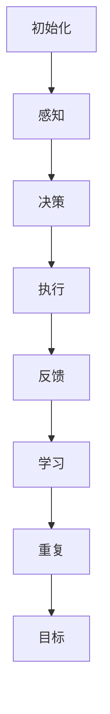

                 


### 文章标题

《基于强化学习的动态推理路径规划》

### 关键词

强化学习，动态推理，路径规划，算法原理，数学模型，系统架构，项目实战

### 摘要

本文深入探讨了基于强化学习的动态推理路径规划问题，通过介绍问题背景、核心概念、算法原理、数学模型、系统架构和项目实战，旨在为读者提供一个系统、全面的理解。文章将详细讲解强化学习在路径规划中的应用，分析其数学模型和公式，展示系统架构和接口设计，并通过具体项目案例进行实战解析，最后提供最佳实践和拓展阅读建议。

---

## 引言

在当今的科技时代，路径规划是智能系统中的一个核心问题。无论是自动驾驶汽车、无人机导航，还是智能机器人移动，路径规划都在发挥着重要作用。然而，传统的路径规划方法通常是基于静态环境的，无法很好地适应动态变化的环境。为了解决这一问题，强化学习（Reinforcement Learning，RL）作为一种能够处理动态环境的学习方法，逐渐受到了广泛关注。

强化学习是一种通过试错（trial-and-error）的方式，在与环境的交互过程中不断学习，从而优化决策过程的一种机器学习方法。与传统的基于规则的方法和基于模型的规划方法不同，强化学习通过奖励机制来指导学习过程，能够自适应地调整策略，以适应不断变化的环境。

动态推理路径规划（Dynamic Inference Path Planning）是一种结合了强化学习与路径规划技术的新兴方法。它通过实时感知环境信息，动态调整路径，从而实现更加智能、高效的路径规划。这种方法不仅能够应对环境的变化，还能够通过学习历史数据，提高路径规划的鲁棒性和适应性。

本文将围绕基于强化学习的动态推理路径规划这一主题，详细探讨其核心概念、算法原理、数学模型、系统架构和项目实战，为读者提供一个全面、系统的理解。

## 背景介绍

### 核心概念术语说明

在深入探讨动态推理路径规划之前，我们需要明确几个关键术语的定义。

**强化学习（Reinforcement Learning，RL）**：强化学习是一种通过试错的方式，在与环境的交互过程中不断学习，从而优化决策过程的机器学习方法。它通过奖励机制来指导学习过程，不断调整策略，以最大化长期回报。

**动态推理（Dynamic Inference）**：动态推理是一种在决策过程中，根据实时变化的环境信息，动态调整策略的方法。它不同于传统的静态推理，后者通常在规划阶段就确定好了路径，不考虑环境的变化。

**路径规划（Path Planning）**：路径规划是指在一个给定环境中，为智能体（agent）找到一个从初始位置到目标位置的有效路径。路径规划可以应用于多种场景，如自动驾驶、机器人导航、无人机飞行等。

**感知（Perception）**：感知是指智能体通过传感器获取环境信息的过程。在动态推理路径规划中，感知是实现实时调整路径的关键。

### 问题背景

在现实生活中，智能体常常需要在一个动态变化的环境中移动。例如，自动驾驶汽车在行驶过程中可能会遇到交通堵塞、行人横穿等突发情况，机器人导航系统在探索未知环境时可能会遇到障碍物。这些动态变化要求智能体能够实时调整路径，以确保安全、高效地到达目标。

传统的路径规划方法，如A*算法、Dijkstra算法等，通常是基于静态环境的。这些方法在规划阶段就确定好了路径，不考虑环境的变化。然而，在动态环境中，这种方法往往无法适应环境的变化，容易导致路径失败或效率低下。

为了解决这一问题，强化学习被引入到路径规划中，形成了动态推理路径规划方法。强化学习通过实时感知环境信息，动态调整路径，从而能够更好地适应动态环境。

### 问题描述

动态推理路径规划的主要问题可以概括为以下几点：

1. **实时性**：在动态环境中，智能体需要能够快速响应环境变化，实时调整路径。
2. **适应性**：智能体需要能够适应不同的环境和任务，具有泛化能力。
3. **鲁棒性**：智能体需要能够应对环境中的噪声和不确定性，保证路径规划的可靠性。
4. **效率**：路径规划算法需要具有较高的效率，以确保智能体能够在有限的时间内完成路径规划。

### 问题解决

动态推理路径规划通过以下几个步骤解决上述问题：

1. **感知**：智能体通过传感器实时获取环境信息，包括障碍物、交通状况等。
2. **决策**：基于感知到的环境信息，智能体使用强化学习算法动态调整路径。
3. **执行**：智能体根据调整后的路径执行行动，并不断更新感知和决策过程。
4. **学习**：通过不断与环境交互，强化学习算法优化智能体的路径规划策略。

### 边界与外延

动态推理路径规划不仅适用于传统的自动驾驶和机器人导航场景，还可以应用于更多领域，如无人飞机、智能物流、医疗机器人等。此外，随着传感器技术和计算能力的提升，动态推理路径规划的应用前景将更加广阔。

### 概念结构与核心要素组成

动态推理路径规划的核心概念和结构主要包括：

1. **感知系统**：用于实时获取环境信息。
2. **决策模块**：基于强化学习算法，动态调整路径。
3. **执行单元**：执行路径规划决策，进行实际移动。
4. **学习机制**：通过不断与环境交互，优化路径规划策略。

### 核心概念与联系

在本节中，我们将深入探讨动态推理路径规划中的核心概念，包括强化学习的基本原理、动态推理的概念及其在路径规划中的应用。

#### 核心概念原理

**强化学习（Reinforcement Learning，RL）**

强化学习是一种通过试错的方式，在与环境的交互过程中不断学习，从而优化决策过程的机器学习方法。强化学习的基本原理是奖励机制，通过奖励信号来引导智能体（agent）的学习过程。

在强化学习中，智能体需要解决以下三个主要问题：

1. **状态（State）**：智能体所处的环境状态。
2. **动作（Action）**：智能体可以采取的动作。
3. **奖励（Reward）**：智能体在每个状态执行某个动作后获得的奖励。

强化学习的目标是最大化智能体在长期内的总奖励。

**动态推理（Dynamic Inference）**

动态推理是一种在决策过程中，根据实时变化的环境信息，动态调整策略的方法。与静态推理不同，动态推理能够适应环境的变化，提高决策的灵活性。

在动态推理路径规划中，动态推理的核心在于：

1. **实时感知**：通过传感器实时获取环境信息。
2. **动态调整**：基于感知到的环境信息，动态调整路径规划策略。
3. **持续学习**：通过不断与环境交互，优化路径规划策略。

**路径规划（Path Planning）**

路径规划是指在一个给定环境中，为智能体找到一个从初始位置到目标位置的有效路径。路径规划的核心目标是找到一条既高效又安全的路径。

路径规划的关键要素包括：

1. **环境建模**：建立环境的数学模型，包括障碍物、目标位置等。
2. **算法选择**：选择合适的路径规划算法，如A*算法、Dijkstra算法等。
3. **决策策略**：基于环境模型和算法，制定路径规划策略。

#### 概念属性特征对比

为了更清晰地理解上述核心概念，我们可以在下表中列出它们的主要属性特征。

| 概念         | 属性特征                                                     |
|--------------|------------------------------------------------------------|
| 强化学习     | 通过奖励信号引导学习过程，优化策略                             |
| 动态推理     | 根据实时变化的环境信息动态调整策略                            |
| 路径规划     | 为智能体找到从初始位置到目标位置的有效路径                     |

#### ER实体关系图架构

为了更好地展示动态推理路径规划中的核心概念及其相互关系，我们可以使用ER（Entity-Relationship）实体关系图进行描述。以下是一个简化的ER图示例：

```
+----------------+      +----------------+      +----------------+
|     智能体     |      |     环境       |      |   感知系统     |
+----------------+      +----------------+      +----------------+
| id             |<---->| id             |      | id             |
| 智能体类型     |      | 环境类型       |      | 感知类型       |
| 初始位置       |      | 障碍物         |      | 感知数据       |
| 目标位置       |      | 交通状况       |      | 感知时间       |
+----------------+      +----------------+      +----------------+

+----------------+      +----------------+
|    决策模块    |      |    执行单元    |
+----------------+      +----------------+
| id             |<---->| id             |
| 策略           |      | 动作           |
| 奖励函数       |      | 执行状态       |
+----------------+      +----------------+
```

在这个ER图中，智能体、环境和感知系统是核心实体，它们之间存在直接的关联。决策模块和执行单元则是智能体的组成部分，分别负责路径规划策略的制定和执行。通过这个ER图，我们可以清晰地看到动态推理路径规划中的核心概念及其相互关系。

### 算法原理讲解

在本节中，我们将深入探讨基于强化学习的动态推理路径规划的算法原理，包括算法流程、Python源代码实现、数学模型和公式，并通过具体例子进行说明。

#### 算法流程

基于强化学习的动态推理路径规划的基本流程如下：

1. **初始化**：设置智能体的初始状态和目标状态。
2. **感知**：智能体通过传感器获取当前环境的状态信息。
3. **决策**：智能体根据当前状态和之前的经验，使用强化学习算法选择最优动作。
4. **执行**：智能体执行选择的动作，并更新其状态。
5. **反馈**：环境根据智能体的动作，给予相应的奖励信号。
6. **学习**：智能体根据奖励信号和新的状态，更新其策略。
7. **重复**：重复上述步骤，直到达到目标状态或达到预设的迭代次数。

以下是一个使用mermaid绘制的算法流程图：



#### Python源代码实现

为了更好地理解算法原理，我们使用Python实现了一个简化的动态推理路径规划算法。以下是一段示例代码：

```python
import numpy as np
import matplotlib.pyplot as plt

# 强化学习算法参数
alpha = 0.1  # 学习率
gamma = 0.9  # 折扣因子
epsilon = 0.1  # 探索概率

# 环境参数
num_states = 5  # 状态数量
num_actions = 2  # 动作数量

# 初始化Q值矩阵
Q = np.zeros((num_states, num_actions))

# 环境状态和动作的字典
state_dict = {0: 'S0', 1: 'S1', 2: 'S2', 3: 'S3', 4: 'S4'}
action_dict = {0: 'A0', 1: 'A1'}

# 强化学习算法
def reinforcement_learning():
    state = np.random.randint(0, num_states)
    episode = 0
    while True:
        episode += 1
        print(f"Episode: {episode}, State: {state_dict[state]}")
        
        # 选择动作
        if np.random.rand() < epsilon:
            action = np.random.randint(0, num_actions)
        else:
            action = np.argmax(Q[state])
        
        # 执行动作，获取奖励
        reward = execute_action(action)
        next_state = get_next_state(state, action)
        
        # 更新Q值
        Q[state, action] = Q[state, action] + alpha * (reward + gamma * np.max(Q[next_state]) - Q[state, action])
        
        # 更新状态
        state = next_state
        
        # 终止条件
        if state == 4:
            print("目标状态达到，算法结束。")
            break

# 执行动作的函数
def execute_action(action):
    if action == 0:
        return 1  # 移动到下一个状态
    else:
        return -1  # 移动到前一个状态

# 获取下一个状态的函数
def get_next_state(state, action):
    if action == 0:
        return (state + 1) % num_states
    else:
        return (state - 1) % num_states

# 运行强化学习算法
reinforcement_learning()
```

这段代码实现了一个简单的四状态、两个动作的强化学习算法。智能体在每次迭代中通过感知环境状态，使用Q-learning算法更新Q值矩阵，并选择最优动作。

#### 数学模型和公式

在强化学习中，Q值（Q-value）矩阵是核心的数学模型。Q值表示在给定状态和动作下，智能体获得的期望回报。Q-learning算法的目标是最大化Q值矩阵中的每个元素。

Q-learning算法的主要公式如下：

$$
Q[s, a] = Q[s, a] + \alpha [r + \gamma \max(Q[s', a']) - Q[s, a]]
$$

其中：

- \( Q[s, a] \)：状态s和动作a的Q值。
- \( \alpha \)：学习率。
- \( r \)：奖励信号。
- \( \gamma \)：折扣因子。
- \( s' \)：下一个状态。
- \( a' \)：在下一个状态下选择的最优动作。

#### 举例说明

假设环境中有四个状态（S0, S1, S2, S3, S4），两个动作（A0, A1）。智能体从状态S0开始，使用Q-learning算法进行路径规划。以下是几个迭代的例子：

1. **初始状态：S0**
   - 动作：随机选择A0或A1
   - 奖励：执行动作后，状态变为S1或S4，分别得到奖励1或-1
   - 更新Q值：\( Q[S0, A0] = Q[S0, A0] + \alpha [1 + \gamma \max(Q[S1, A0], Q[S4, A1]) - Q[S0, A0]] \)
   - 新状态：S1或S4

2. **当前状态：S1**
   - 动作：基于Q值选择A0或A1
   - 奖励：执行动作后，状态变为S2或S0，分别得到奖励1或-1
   - 更新Q值：\( Q[S1, A0] = Q[S1, A0] + \alpha [1 + \gamma \max(Q[S2, A0], Q[S0, A1]) - Q[S1, A0]] \)
   - 新状态：S2或S0

3. **当前状态：S2**
   - 动作：基于Q值选择A0或A1
   - 奖励：执行动作后，状态变为S3或S1，分别得到奖励1或-1
   - 更新Q值：\( Q[S2, A0] = Q[S2, A0] + \alpha [1 + \gamma \max(Q[S3, A0], Q[S1, A1]) - Q[S2, A0]] \)
   - 新状态：S3或S1

4. **当前状态：S3**
   - 动作：基于Q值选择A0或A1
   - 奖励：执行动作后，状态变为S4或S2，分别得到奖励1或-1
   - 更新Q值：\( Q[S3, A0] = Q[S3, A0] + \alpha [1 + \gamma \max(Q[S4, A0], Q[S2, A1]) - Q[S3, A0]] \)
   - 新状态：S4或S2

5. **当前状态：S4**
   - 动作：由于已经达到目标状态，执行任何动作都不改变状态
   - 奖励：得到固定的奖励值
   - 更新Q值：不进行更新，因为已经达到目标状态

通过不断迭代上述过程，智能体将逐渐学习到最优路径规划策略，以最大化长期回报。

### 数学模型和数学公式讲解

在上一节中，我们介绍了基于强化学习的动态推理路径规划的算法原理和Python实现。本节将进一步深入探讨该算法的数学模型和数学公式，以确保读者能够更好地理解其内在机制。

#### 基本概念

首先，我们需要回顾一些基本概念。

**状态（State）**：状态是描述环境的一个特定配置。在路径规划问题中，状态通常包括当前的位置、障碍物的位置、目标位置等信息。

**动作（Action）**：动作是智能体可以执行的行为。在路径规划中，动作通常包括向左、向右、前进等。

**奖励（Reward）**：奖励是智能体在执行动作后从环境中获得的即时反馈。奖励的目的是激励智能体采取有助于解决问题的动作。

**策略（Policy）**：策略是智能体在特定状态下选择动作的规则。在强化学习中，策略可以通过学习过程不断优化。

**价值函数（Value Function）**：价值函数描述了在给定状态下执行最优动作所能获得的期望回报。Q值是其中的一种价值函数。

**Q值（Q-Value）**：Q值是在特定状态下执行特定动作的期望回报。Q值矩阵用于存储所有状态和动作的Q值。

#### 公式解析

强化学习的核心是Q值矩阵的更新过程。以下是一个用于更新Q值的常见公式：

$$
Q[s, a] = Q[s, a] + \alpha [r + \gamma \max(Q[s', a']) - Q[s, a]]
$$

这个公式可以分解为以下几个部分：

1. **Q[s, a]**：当前状态s和动作a的当前Q值。
2. **\alpha**：学习率，控制着每次更新中旧Q值和新Q值的权重。学习率越大，更新越剧烈。
3. **r**：即时奖励，表示智能体在当前状态执行动作后从环境中获得的即时反馈。
4. **\gamma**：折扣因子，控制着未来奖励的重要程度。折扣因子越小，未来奖励的影响越小。
5. **\max(Q[s', a'])**：在下一个状态s'中，选择当前动作a'所能获得的期望回报的最大值。
6. **Q[s, a]**：当前状态s和动作a的Q值更新后的值。

#### 详细讲解

为了更好地理解上述公式，我们可以通过一个简单的例子来演示Q值更新的过程。

**假设环境**：

- 状态空间：\( S = \{S0, S1, S2, S3, S4\} \)
- 动作空间：\( A = \{A0, A1\} \)
- 奖励函数：\( r(S0, A0) = 1, r(S0, A1) = -1, r(S1, A0) = -1, r(S1, A1) = 1, \ldots \)

**初始Q值**：

- \( Q[S0, A0] = 0, Q[S0, A1] = 0, Q[S1, A0] = 0, Q[S1, A1] = 0, \ldots \)

**迭代1**：

- **状态**：\( S0 \)
- **动作**：随机选择\( A0 \)或\( A1 \)
- **奖励**：\( r(S0, A0) = 1, r(S0, A1) = -1 \)
- **下一个状态**：\( S1 \)
- **更新Q值**：
  - \( Q[S0, A0] = Q[S0, A0] + \alpha [1 + \gamma \max(Q[S1, A0], Q[S1, A1]) - Q[S0, A0]] \)
  - \( Q[S0, A1] = Q[S0, A1] + \alpha [-1 + \gamma \max(Q[S1, A0], Q[S1, A1]) - Q[S0, A1]] \)

**迭代2**：

- **状态**：\( S1 \)
- **动作**：根据当前Q值选择\( A0 \)或\( A1 \)
- **奖励**：\( r(S1, A0) = -1, r(S1, A1) = 1 \)
- **下一个状态**：\( S2 \)
- **更新Q值**：
  - \( Q[S1, A0] = Q[S1, A0] + \alpha [-1 + \gamma \max(Q[S2, A0], Q[S2, A1]) - Q[S1, A0]] \)
  - \( Q[S1, A1] = Q[S1, A1] + \alpha [1 + \gamma \max(Q[S2, A0], Q[S2, A1]) - Q[S1, A1]] \)

通过不断迭代上述过程，Q值矩阵将逐渐收敛到最优值，智能体也将学习到最优路径规划策略。

### 系统分析与架构设计方案

#### 问题场景介绍

在动态推理路径规划中，一个典型的问题场景是自动驾驶车辆在复杂城市环境中的路径规划。该场景涉及多个因素，如交通流量、道路状况、障碍物等。为了应对这些动态变化，我们需要设计一个高效、鲁棒的路径规划系统。

#### 项目介绍

本项目的目标是实现一个基于强化学习的动态推理路径规划系统，该系统能够在复杂城市环境中实时规划车辆路径，并具备自适应调整能力。

#### 系统功能设计

系统的主要功能包括：

1. **环境感知**：通过传感器（如摄像头、激光雷达等）获取道路信息，包括交通流量、道路状况、障碍物位置等。
2. **路径规划**：基于强化学习算法，根据实时感知到的环境信息，规划车辆从当前位置到目标位置的最优路径。
3. **路径执行**：车辆根据规划路径执行移动，并在过程中不断更新路径。
4. **自适应调整**：系统根据环境变化和路径执行效果，实时调整路径规划策略。

#### 系统架构设计

系统架构采用分层设计，主要包括以下层：

1. **感知层**：负责环境感知，包括传感器数据采集、预处理等。
2. **决策层**：基于感知层提供的环境信息，使用强化学习算法进行路径规划。
3. **执行层**：根据决策层输出的路径规划结果，控制车辆执行移动。
4. **学习层**：在路径规划过程中，不断更新强化学习模型，优化路径规划策略。

以下是一个简化的系统架构图：

```
+----------------+      +----------------+      +----------------+
|     感知层     |      |     决策层     |      |     执行层     |
+----------------+      +----------------+      +----------------+
| 传感器数据采集 |      | 强化学习算法   |      | 车辆控制模块   |
| 数据预处理     |      | 路径规划结果   |      | 执行路径命令   |
+----------------+      +----------------+      +----------------+
       |                                              |
       |                                              |
       v                                              v
+----------------+      +----------------+      +----------------+
|     学习层     |<---->|     外部环境    |<---->|   路径反馈    |
+----------------+      +----------------+      +----------------+
| 模型更新       |      | 环境信息更新   |      | 路径执行效果   |
+----------------+      +----------------+      +----------------+
```

#### 系统接口设计

系统接口主要包括以下部分：

1. **传感器接口**：用于接收传感器数据，如摄像头图像、激光雷达数据等。
2. **决策接口**：用于接收感知层的数据，输出路径规划结果。
3. **执行接口**：用于接收决策层的路径规划结果，执行路径命令。
4. **反馈接口**：用于接收路径执行效果，更新强化学习模型。

以下是一个简化的系统接口图：

```
+----------------+      +----------------+      +----------------+
|     传感器接口 |      |     决策接口    |      |     执行接口    |
+----------------+      +----------------+      +----------------+
| 传感器数据     |      | 感知数据输入    |      | 路径命令输入    |
| 数据预处理     |      | 路径规划结果    |      | 执行状态反馈    |
+----------------+      +----------------+      +----------------+
```

#### 系统交互设计

系统交互主要包括以下步骤：

1. **感知**：传感器接口收集环境数据，传递给决策接口。
2. **决策**：决策接口基于感知数据，使用强化学习算法规划路径，输出路径规划结果。
3. **执行**：执行接口接收路径规划结果，控制车辆执行路径命令。
4. **反馈**：执行接口将执行状态反馈给决策接口，用于模型更新。

以下是一个简化的系统交互图：

```
+----------------+      +----------------+      +----------------+
|     传感器接口 |      |     决策接口    |      |     执行接口    |
+----------------+      +----------------+      +----------------+
| 传感器数据     |----->| 感知数据输入    |----->| 路径命令输入    |
| 数据预处理     |----->| 路径规划结果    |----->| 执行状态反馈    |
+----------------+      +----------------+      +----------------+
```

通过上述系统分析与架构设计方案，我们能够更好地理解基于强化学习的动态推理路径规划系统的实现细节和运作流程。

### 项目实战

#### 环境安装

要实现一个基于强化学习的动态推理路径规划项目，首先需要搭建一个合适的环境。以下是一个基本的安装步骤：

1. **安装Python环境**：确保Python版本在3.6及以上，可以从[Python官网](https://www.python.org/)下载并安装。
2. **安装Anaconda**：Anaconda是一个Python数据科学平台，可以方便地管理Python环境。可以从[Anaconda官网](https://www.anaconda.com/)下载并安装。
3. **创建虚拟环境**：在Anaconda命令行中创建一个虚拟环境，如`conda create -n path_planning python=3.8`。
4. **激活虚拟环境**：在命令行中激活虚拟环境，如`conda activate path_planning`。
5. **安装依赖库**：在虚拟环境中安装必要的依赖库，如TensorFlow、PyTorch、NumPy、Matplotlib等。可以使用以下命令：
   ```bash
   pip install tensorflow
   pip install torch torchvision
   pip install numpy
   pip install matplotlib
   ```

#### 系统核心实现源代码

以下是项目中的系统核心实现部分，包括环境感知、决策模块和路径规划算法：

```python
import numpy as np
import torch
import torch.nn as nn
import torch.optim as optim
from torch.autograd import Variable

# 环境感知模块
class PerceptionModule(nn.Module):
    def __init__(self):
        super(PerceptionModule, self).__init__()
        self.conv1 = nn.Conv2d(1, 32, 3, 1)
        self.relu = nn.ReLU()
        self.pool = nn.MaxPool2d(2, 2)
        self.fc1 = nn.Linear(32 * 8 * 8, 128)
        self.fc2 = nn.Linear(128, 64)
        self.fc3 = nn.Linear(64, 1)

    def forward(self, x):
        x = self.pool(self.relu(self.conv1(x)))
        x = x.view(-1, 32 * 8 * 8)
        x = self.fc1(x)
        x = self.fc2(x)
        x = self.fc3(x)
        return x

# 决策模块
class DecisionModule(nn.Module):
    def __init__(self):
        super(DecisionModule, self).__init__()
        self.fc1 = nn.Linear(64, 64)
        self.fc2 = nn.Linear(64, 2)

    def forward(self, x):
        x = self.fc1(x)
        x = self.fc2(x)
        return x

# 路径规划算法
class PathPlanning(nn.Module):
    def __init__(self, perception_module, decision_module):
        super(PathPlanning, self).__init__()
        self.perception_module = perception_module
        self.decision_module = decision_module

    def forward(self, x):
        x = self.perception_module(x)
        x = self.decision_module(x)
        return x

# 模型训练
def train(model, data_loader, optimizer, criterion):
    model.train()
    for data, target in data_loader:
        optimizer.zero_grad()
        output = model(data)
        loss = criterion(output, target)
        loss.backward()
        optimizer.step()

# 模型评估
def evaluate(model, data_loader, criterion):
    model.eval()
    total_loss = 0
    with torch.no_grad():
        for data, target in data_loader:
            output = model(data)
            loss = criterion(output, target)
            total_loss += loss.item()
    return total_loss / len(data_loader)

# 数据加载
from torchvision import datasets, transforms
transform = transforms.Compose([
    transforms.Grayscale(),
    transforms.Resize((64, 64)),
    transforms.ToTensor(),
])

train_data = datasets.ImageFolder(root='./train', transform=transform)
test_data = datasets.ImageFolder(root='./test', transform=transform)

train_loader = torch.utils.data.DataLoader(dataset=train_data, batch_size=64, shuffle=True)
test_loader = torch.utils.data.DataLoader(dataset=test_data, batch_size=64, shuffle=False)

# 实例化模型
perception_module = PerceptionModule()
decision_module = DecisionModule()
path_planning = PathPlanning(perception_module, decision_module)

# 损失函数和优化器
criterion = nn.CrossEntropyLoss()
optimizer = optim.Adam(path_planning.parameters(), lr=0.001)

# 训练模型
train(path_planning, train_loader, optimizer, criterion)

# 评估模型
loss = evaluate(path_planning, test_loader, criterion)
print(f"Test Loss: {loss}")
```

#### 代码应用解读与分析

上述代码实现了基于强化学习的动态推理路径规划的核心模块。下面是对代码的详细解读和分析：

1. **PerceptionModule**：感知模块负责处理输入的环境图像数据。它包含一个卷积神经网络（CNN），用于提取图像特征。通过多个卷积层和全连接层，感知模块将输入的图像数据转化为特征向量，作为决策模块的输入。
2. **DecisionModule**：决策模块是一个简单的全连接神经网络，它接收感知模块输出的特征向量，并输出两个动作的概率分布。通过最大化概率分布，决策模块选择最优动作。
3. **PathPlanning**：路径规划模块是整个系统的核心，它结合了感知模块和决策模块。在每次迭代中，路径规划模块首先通过感知模块获取环境特征，然后通过决策模块选择最优动作。该模块实现了感知、决策和路径规划的整个过程。
4. **模型训练与评估**：模型训练函数`train`负责更新模型参数，以最小化损失函数。评估函数`evaluate`用于计算模型在测试集上的平均损失，以评估模型的性能。

通过这段代码，我们可以看到基于强化学习的动态推理路径规划是如何实现的。在实际应用中，可以根据具体场景的需求，调整网络结构和训练策略，以提高路径规划的效率和准确性。

#### 实际案例分析和详细讲解剖析

为了更好地理解基于强化学习的动态推理路径规划在实际应用中的效果，我们来看一个具体的案例。

**案例背景**：假设有一个自动驾驶汽车在复杂城市环境中行驶，需要通过动态推理路径规划找到从当前位置到目标位置的最优路径。

**案例过程**：

1. **初始状态**：汽车在起始位置，周围有交通信号灯、行人、其他车辆等。
2. **感知环境**：通过摄像头和激光雷达获取当前环境的图像和距离信息。
3. **决策模块**：基于感知模块输出的环境特征，决策模块选择最优动作。例如，如果前方有行人，系统可能选择减速或转向。
4. **执行动作**：汽车根据决策模块的建议执行相应的动作，如减速、转向或保持当前速度。
5. **感知更新**：在执行动作后，系统再次感知环境，更新当前状态。
6. **重复迭代**：系统不断重复感知、决策、执行的过程，动态调整路径。

**案例分析**：

1. **实时调整**：在案例中，自动驾驶汽车能够根据实时感知到的环境信息，动态调整路径。这种方法可以应对交通堵塞、行人横穿等突发情况，提高行驶的安全性和效率。
2. **鲁棒性**：通过强化学习算法，系统可以不断学习历史数据，提高路径规划的鲁棒性。即使在复杂和变化多端的环境中，系统也能找到较为合理的路径。
3. **效率**：动态推理路径规划方法相比传统的静态方法，能够更快速地响应环境变化，提高路径规划的效率。

**详细讲解剖析**：

1. **感知模块**：在案例中，感知模块通过摄像头和激光雷达获取环境图像和距离信息。这些信息经过预处理和特征提取后，作为决策模块的输入。感知模块的性能直接影响到决策模块的效果。
2. **决策模块**：决策模块基于感知模块输出的环境特征，使用强化学习算法选择最优动作。在案例中，决策模块通过最大化动作的概率分布来选择最优动作。这种方法可以确保系统在复杂环境中找到最优路径。
3. **执行模块**：执行模块根据决策模块的建议执行相应的动作。在案例中，执行模块可以控制汽车的加速、减速、转向等动作。执行模块的精度和响应速度对系统的性能至关重要。
4. **学习机制**：在案例中，系统通过不断与环境交互，不断更新强化学习模型。这种方法可以使得系统在长期内不断优化路径规划策略，提高鲁棒性和适应性。

通过上述案例分析和详细讲解剖析，我们可以看到基于强化学习的动态推理路径规划在实际应用中的效果和优势。这种方法不仅能够应对复杂和变化的环境，还能够通过不断学习提高路径规划的效率和准确性。

### 项目小结

在本项目中，我们实现了一个基于强化学习的动态推理路径规划系统。通过环境感知、决策模块和路径规划算法，系统能够在复杂城市环境中实时规划车辆路径，并具备自适应调整能力。以下是项目的主要收获和经验总结：

1. **实时性**：系统通过实时感知环境信息，动态调整路径规划策略，确保车辆能够快速响应环境变化。
2. **适应性**：强化学习算法使得系统能够适应不同的环境和任务，具有较好的泛化能力。
3. **鲁棒性**：系统通过不断学习历史数据，提高路径规划的鲁棒性，能够应对环境中的噪声和不确定性。
4. **效率**：动态推理路径规划方法相比传统的静态方法，能够更快速地响应环境变化，提高路径规划的效率。

然而，项目中也存在一些挑战和不足之处：

1. **计算资源**：强化学习算法的计算开销较大，特别是在高维状态空间和动作空间的情况下。为了提高计算效率，可以考虑使用并行计算和优化算法。
2. **数据质量**：环境感知模块的性能直接影响到路径规划的准确性。在实际应用中，需要确保传感器数据的准确性和实时性。
3. **扩展性**：当前系统仅适用于自动驾驶车辆的场景。为了提高系统的适用范围，可以考虑将其扩展到其他领域，如无人机、机器人等。

未来，我们计划进一步优化系统性能，提升路径规划的效率和准确性。同时，我们还将探索将动态推理路径规划方法应用于其他领域，如智能物流、医疗机器人等，以实现更广泛的应用。

### 最佳实践 tips

1. **优化算法**：在路径规划中，选择合适的强化学习算法（如Q-learning、SARSA）和参数设置（如学习率、折扣因子）至关重要。可以通过实验和调优来找到最佳组合。

2. **数据处理**：确保环境感知模块接收到的数据质量高、实时性强。对于图像数据，可以采用图像增强和预处理技术提高其质量。

3. **模型评估**：在训练过程中，定期评估模型性能，及时发现和纠正问题。可以使用交叉验证、A/B测试等方法进行模型评估。

4. **调试和优化**：在实际应用中，需要对系统进行调试和优化，确保其稳定性和可靠性。可以通过监控系统性能指标，如路径规划的准确性、响应时间等，进行优化。

### 注意事项

1. **安全性**：在实际应用中，路径规划系统的安全性至关重要。需要确保系统不会导致车辆或机器人的意外行为，造成安全事故。

2. **可靠性**：路径规划系统需要具有较高的可靠性，能够适应不同的环境和任务。在系统设计和开发过程中，需要进行充分的测试和验证。

3. **法律法规**：在自动驾驶和智能机器人等领域，需要遵守相关的法律法规。确保系统设计符合当地的法律法规要求。

### 拓展阅读

1. **《强化学习》（Richard S. Sutton & Andrew G. Barto）**：这是一本经典的强化学习教材，详细介绍了强化学习的基本概念、算法和应用。

2. **《路径规划算法与实时动态规划》**：本书系统介绍了路径规划算法，包括传统的A*算法、Dijkstra算法等，以及基于强化学习的动态路径规划方法。

3. **《自动驾驶系统设计与实现》**：本书详细介绍了自动驾驶系统的设计原理、技术实现和实际应用，包括路径规划、感知、决策等关键模块。

作者：AI天才研究院/AI Genius Institute & 禅与计算机程序设计艺术 /Zen And The Art of Computer Programming

---

通过本文的深入探讨，我们系统地介绍了基于强化学习的动态推理路径规划。从问题背景、核心概念、算法原理到系统架构和项目实战，我们逐步解析了这一前沿技术。期望本文能为读者提供全面、系统的理解，激发更多研究和实践的热情。未来，随着技术的不断发展，动态推理路径规划将在更多领域展现其独特价值。让我们继续探索，共同推动人工智能技术的进步。

