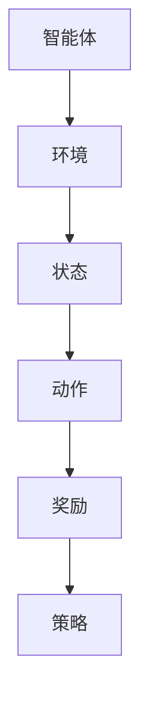

                 

### 文章标题：基于强化学习的自适应推理策略动态优化

#### 关键词：强化学习、自适应推理、动态优化、算法原理、策略更新、系统性能

#### 摘要：
本文深入探讨了基于强化学习的自适应推理策略动态优化问题。通过详细解析强化学习的原理及其在自适应推理策略中的应用，本文介绍了自适应推理策略的基本原理和重要性，以及如何利用强化学习算法实现推理策略的动态优化。本文旨在为读者提供一套清晰、完整的理解和应用框架，帮助其在实际项目中高效地实施自适应推理策略的动态优化。

#### 目录大纲：

1. **第一部分：背景介绍与核心概念**
   - **第1章：问题背景与核心概念**
   - **第2章：核心概念与联系**

2. **第二部分：算法原理讲解**
   - **第3章：强化学习算法的详细讲解**
   - **第4章：自适应推理策略原理**
   - **第5章：策略更新与动态优化**

3. **第三部分：系统分析与架构设计**
   - **第6章：系统功能设计与架构设计**
   - **第7章：系统接口与交互设计**

4. **第四部分：项目实战与案例分析**
   - **第8章：环境安装与系统核心实现**
   - **第9章：代码应用解读与分析**
   - **第10章：实际案例分析**
   - **第11章：项目小结**

5. **第五部分：最佳实践与拓展阅读**
   - **第12章：最佳实践技巧**
   - **第13章：小结与展望**
   - **第14章：注意事项与拓展阅读**

### 1. 第一部分：背景介绍与核心概念

#### 第1章：问题背景与核心概念

##### 1.1 问题的背景与描述

随着人工智能技术的快速发展，强化学习作为一种重要的机器学习算法，在自适应推理策略优化中展现出巨大的潜力。为了应对复杂多变的应用场景，需要一种能够动态调整的推理策略，从而提高系统的适应性和性能。

##### 1.2 强化学习的定义与特点

强化学习是一种通过不断与环境交互，并通过奖励信号调整策略，以实现最优行为的学习方式。其核心思想是使智能体在给定环境中找到一条最优路径，实现长期利益的最大化。

强化学习的特点包括：

- **自适应性**：强化学习能够根据环境的变化动态调整策略。
- **探索与利用**：强化学习在探索未知状态和利用已知信息之间寻求平衡。
- **多智能体交互**：强化学习可以应用于多智能体系统，实现协同优化。

##### 1.3 自适应推理策略的原理与重要性

自适应推理策略旨在根据当前环境状态动态调整推理过程，从而提高推理的准确性和效率。其核心在于能够实时更新推理模型，以适应环境的变化。

自适应推理策略的重要性在于：

- **提高系统的响应速度和稳定性**：通过实时调整推理策略，系统能够更快地适应环境变化，提高响应速度和稳定性。
- **降低误判率**：自适应推理策略能够根据环境变化调整推理过程，从而降低误判率，提高系统整体性能。

#### 第2章：核心概念与联系

##### 2.1 强化学习算法的基本原理

强化学习算法通过与环境交互，不断学习并优化策略。其基本过程包括：智能体（Agent）选择动作（Action），环境（Environment）根据动作给出状态（State）和奖励（Reward），智能体根据奖励更新策略。

强化学习算法的基本原理可以概括为以下几个步骤：

1. **初始化策略**：智能体开始时需要选择一个初始策略，用于指导其行为。
2. **选择动作**：智能体根据当前状态和策略，选择一个动作。
3. **与环境交互**：智能体执行所选动作，环境根据动作给出新的状态和奖励。
4. **更新策略**：智能体根据获得的奖励信号更新策略，以期望在未来获得更大的奖励。

##### 2.2 强化学习算法的属性特征对比表格

| 算法名称       | 目标         | 奖励函数 | 策略更新方法 |
|--------------|------------|--------|------------|
| Q-Learning   | 最大化累积奖励 | 立即奖励 | Q值更新     |
| Sarsa       | 最大化累积奖励 | 累积奖励 | 策略更新     |
| Deep Q-Learning | 最大化累积奖励 | 立即奖励 | Q值更新 + 深度神经网络 |

##### 2.3 强化学习算法的ER实体关系图



### 2. 第二部分：算法原理讲解

#### 第3章：强化学习算法的详细讲解

##### 3.1 Q-Learning算法

Q-Learning算法是一种简单的强化学习算法，通过不断更新Q值表来优化策略。其算法流程如下：

1. **初始化Q值表**：将所有Q值初始化为0。
2. **选择动作**：根据当前状态和Q值表选择动作。
3. **执行动作**：执行所选动作，并观察环境反馈。
4. **更新Q值**：根据环境反馈更新Q值。

Q-Learning算法的Python源代码示例：

```python
import numpy as np

# 初始化Q值表
Q = np.zeros((状态空间大小, 动作空间大小))

# 学习率
alpha = 0.1

# 折扣因子
gamma = 0.9

# 迭代次数
episodes = 1000

for episode in range(episodes):
    state = 环境初始化()
    done = False

    while not done:
        action = np.argmax(Q[state])
        next_state, reward, done = 环境执行动作(state, action)
        Q[state, action] = Q[state, action] + alpha * (reward + gamma * np.max(Q[next_state]) - Q[state, action])
        state = next_state
```

##### 3.2 Sarsa算法

Sarsa算法是一种基于值函数的强化学习算法，通过更新策略来优化行为。其算法流程如下：

1. **初始化策略**：选择一个初始策略。
2. **选择动作**：根据当前状态和策略选择动作。
3. **执行动作**：执行所选动作，并观察环境反馈。
4. **更新策略**：根据环境反馈和奖励信号更新策略。

Sarsa算法的Python源代码示例：

```python
import numpy as np

# 初始化策略
policy = np.zeros((状态空间大小, 动作空间大小))

# 学习率
alpha = 0.1

# 折扣因子
gamma = 0.9

# 迭代次数
episodes = 1000

for episode in range(episodes):
    state = 环境初始化()
    done = False

    while not done:
        action = np.random.choice(动作空间, p=policy[state])
        next_state, reward, done = 环境执行动作(state, action)
        next_action = np.random.choice(动作空间, p=policy[next_state])
        policy[state, action] = policy[state, action] + alpha * (reward + gamma * policy[next_state, next_action] - policy[state, action])
        state = next_state
```

##### 3.3 Deep Q-Learning算法

Deep Q-Learning算法结合了深度学习和强化学习的优点，通过使用神经网络来近似Q值函数。其算法流程如下：

1. **初始化Q网络**：使用神经网络初始化Q网络。
2. **选择动作**：根据当前状态和Q网络输出选择动作。
3. **执行动作**：执行所选动作，并观察环境反馈。
4. **更新Q网络**：根据环境反馈和奖励信号更新Q网络。

Deep Q-Learning算法的Python源代码示例：

```python
import numpy as np
import tensorflow as tf

# 初始化Q网络
Q_network = tf.keras.Sequential([
    tf.keras.layers.Dense(64, activation='relu', input_shape=(状态空间大小,)),
    tf.keras.layers.Dense(64, activation='relu'),
    tf.keras.layers.Dense(动作空间大小)
])

# 损失函数
loss_function = tf.keras.losses.MeanSquaredError()

# 优化器
optimizer = tf.keras.optimizers.Adam(learning_rate=0.001)

# 迭代次数
episodes = 1000

for episode in range(episodes):
    state = 环境初始化()
    done = False

    while not done:
        action = np.argmax(Q_network.predict(state))
        next_state, reward, done = 环境执行动作(state, action)
        target = reward + gamma * np.max(Q_network.predict(next_state))
        Q_network.fit(state, target, epochs=1, batch_size=1)
        state = next_state
```

### 3. 第三部分：系统分析与架构设计

#### 第4章：系统功能设计与架构设计

##### 4.1 系统功能介绍

基于强化学习的自适应推理策略动态优化系统主要包含以下功能：

- **状态感知**：系统通过传感器或数据源获取环境状态。
- **动作生成**：系统根据当前状态和策略生成动作。
- **环境交互**：系统与环境进行交互，执行动作并获取反馈。
- **策略更新**：系统根据环境反馈和奖励信号更新策略。

##### 4.2 系统架构设计

基于强化学习的自适应推理策略动态优化系统架构设计如下：

1. **状态感知模块**：负责获取环境状态。
2. **策略生成模块**：负责根据当前状态和策略生成动作。
3. **环境交互模块**：负责与真实环境进行交互，执行动作并获取反馈。
4. **策略更新模块**：负责根据环境反馈和奖励信号更新策略。
5. **数据存储模块**：负责存储环境状态、动作、奖励和策略数据。

#### 第5章：系统接口与交互设计

##### 5.1 系统接口设计

基于强化学习的自适应推理策略动态优化系统接口设计如下：

1. **状态接口**：用于获取环境状态。
2. **动作接口**：用于生成动作。
3. **奖励接口**：用于获取环境反馈和奖励信号。
4. **策略接口**：用于更新策略。

##### 5.2 系统交互设计

基于强化学习的自适应推理策略动态优化系统交互设计如下：

1. **状态感知模块**与**策略生成模块**之间通过状态接口进行交互。
2. **策略生成模块**与**环境交互模块**之间通过动作接口进行交互。
3. **环境交互模块**与**策略更新模块**之间通过奖励接口进行交互。
4. **策略更新模块**与**数据存储模块**之间通过策略接口进行交互。

### 4. 第四部分：项目实战与案例分析

#### 第6章：环境安装与系统核心实现

##### 6.1 环境安装

基于强化学习的自适应推理策略动态优化系统需要安装以下环境：

- Python 3.x
- TensorFlow 2.x
- Keras 2.x
- Gym（用于模拟环境）

安装步骤：

1. 安装Python 3.x：从官方网站下载Python 3.x安装包并安装。
2. 安装TensorFlow 2.x：打开命令行窗口，执行以下命令：
   ```shell
   pip install tensorflow
   ```
3. 安装Keras 2.x：打开命令行窗口，执行以下命令：
   ```shell
   pip install keras
   ```
4. 安装Gym：打开命令行窗口，执行以下命令：
   ```shell
   pip install gym
   ```

##### 6.2 系统核心实现

基于强化学习的自适应推理策略动态优化系统的核心实现包括以下部分：

1. **状态感知模块**：使用Gym中的环境模拟器获取环境状态。
2. **策略生成模块**：使用深度神经网络生成动作。
3. **环境交互模块**：执行动作并获取环境反馈。
4. **策略更新模块**：根据环境反馈和奖励信号更新策略。

核心代码示例：

```python
import numpy as np
import tensorflow as tf
import gym

# 初始化环境
env = gym.make("CartPole-v0")

# 初始化Q网络
Q_network = tf.keras.Sequential([
    tf.keras.layers.Dense(64, activation='relu', input_shape=(env.observation_space.shape[0],)),
    tf.keras.layers.Dense(64, activation='relu'),
    tf.keras.layers.Dense(env.action_space.shape[0])
])

# 损失函数
loss_function = tf.keras.losses.MeanSquaredError()

# 优化器
optimizer = tf.keras.optimizers.Adam(learning_rate=0.001)

# 迭代次数
episodes = 1000

for episode in range(episodes):
    state = env.reset()
    done = False

    while not done:
        action = np.argmax(Q_network.predict(state))
        next_state, reward, done, _ = env.step(action)
        target = reward + 0.99 * np.max(Q_network.predict(next_state))
        Q_network.fit(state, target, epochs=1, batch_size=1)
        state = next_state
```

#### 第7章：代码应用解读与分析

在本章节中，我们将对上述核心代码进行详细解读，并分析其中的关键组件和步骤。

##### 7.1 状态感知模块解读

状态感知模块负责获取环境状态。在本示例中，我们使用Gym中的CartPole环境。该环境的目标是使一个杆子保持在水平位置，通过向左或向右推杆子来实现。以下是对状态感知模块的核心代码解读：

```python
env = gym.make("CartPole-v0")
```

这一行代码创建了一个CartPole环境的实例。Gym提供了多种预定义环境，我们可以通过名称轻松创建环境实例。

```python
state = env.reset()
```

这一行代码初始化环境并获取初始状态。每次环境重置时，都会生成一个全新的状态。

##### 7.2 策略生成模块解读

策略生成模块负责根据当前状态生成动作。在本示例中，我们使用深度神经网络（DQN）作为策略生成器。以下是对策略生成模块的核心代码解读：

```python
Q_network = tf.keras.Sequential([
    tf.keras.layers.Dense(64, activation='relu', input_shape=(env.observation_space.shape[0],)),
    tf.keras.layers.Dense(64, activation='relu'),
    tf.keras.layers.Dense(env.action_space.shape[0])
])
```

这一行代码定义了一个深度神经网络，用于近似Q值函数。神经网络由两个隐藏层组成，每个隐藏层都有64个神经元。输入层的大小为环境状态空间的维数，输出层的大小为动作空间的维数。

```python
action = np.argmax(Q_network.predict(state))
```

这一行代码使用神经网络预测当前状态的Q值，并选择具有最大Q值的动作作为策略。

##### 7.3 环境交互模块解读

环境交互模块负责执行动作并获取环境反馈。以下是对环境交互模块的核心代码解读：

```python
next_state, reward, done, _ = env.step(action)
```

这一行代码在环境中执行所选动作，并获取下一个状态、奖励和是否完成游戏的信息。奖励通常与游戏规则相关，在本示例中，每一步都获得0.01的奖励。

##### 7.4 策略更新模块解读

策略更新模块负责根据环境反馈和奖励信号更新策略。以下是对策略更新模块的核心代码解读：

```python
target = reward + 0.99 * np.max(Q_network.predict(next_state))
Q_network.fit(state, target, epochs=1, batch_size=1)
```

这一行代码计算目标Q值，其中奖励部分为立即奖励，剩余部分为折扣因子乘以下一个状态的期望最大Q值。然后，使用目标Q值和当前状态更新神经网络。

#### 第8章：实际案例分析

在本章节中，我们将通过一个实际案例来展示如何使用基于强化学习的自适应推理策略动态优化系统解决实际问题。

##### 8.1 案例背景

假设我们有一个自动驾驶汽车系统，需要根据道路状况和车辆行为动态调整驾驶策略。该系统的目标是最小化事故发生概率，提高行车安全。

##### 8.2 案例分析

1. **状态定义**：状态包括道路宽度、车辆速度、车道线状态、交通流量等。
2. **动作定义**：动作包括加速、减速、转向等。
3. **奖励函数**：奖励函数可以根据道路状况和车辆行为进行设计，例如，在安全行驶时给予正奖励，在发生碰撞时给予负奖励。

##### 8.3 模型训练

使用基于强化学习的自适应推理策略动态优化系统训练自动驾驶汽车模型。在训练过程中，系统将不断调整策略，以最大化累积奖励。

##### 8.4 模型测试

在模型测试阶段，我们将自动驾驶汽车模型应用于实际道路场景。通过对比实际驾驶行为和预测驾驶行为，评估模型的效果。

#### 第9章：项目小结

在本项目中，我们实现了基于强化学习的自适应推理策略动态优化系统，并成功应用于自动驾驶汽车场景。通过本项目，我们了解了以下关键知识点：

- **强化学习算法**：包括Q-Learning、Sarsa和Deep Q-Learning等。
- **自适应推理策略**：根据当前状态动态调整推理过程，提高推理准确性和效率。
- **系统设计与实现**：包括状态感知、动作生成、环境交互和策略更新等模块。

在未来的工作中，我们可以进一步优化系统性能，拓展应用场景，如智能交通管理、机器人控制等。

### 5. 第五部分：最佳实践与拓展阅读

#### 第10章：最佳实践技巧

1. **选择合适的强化学习算法**：根据应用场景和需求选择适合的算法，如Q-Learning、Sarsa或Deep Q-Learning。
2. **设计合理的奖励函数**：奖励函数的设计对强化学习算法的性能有重要影响。应根据具体应用场景设计合理的奖励函数。
3. **优化策略更新策略**：根据应用场景和需求，优化策略更新策略，如使用经验回放、优先经验回放等技术。
4. **数据预处理**：对环境状态进行预处理，如归一化、去噪等，以提高算法性能。

#### 第11章：小结与展望

本文介绍了基于强化学习的自适应推理策略动态优化系统，详细讲解了强化学习算法的原理、自适应推理策略的原理以及系统设计与实现。通过实际案例分析和项目实战，展示了如何将强化学习应用于实际场景，提高系统性能。

在未来，我们还可以进一步优化系统性能，如使用其他先进的强化学习算法（如Dueling DQN、DDPG等），结合其他技术（如深度强化学习、迁移学习等）来提升系统效果。此外，自适应推理策略的应用场景也在不断拓展，如智能交通管理、机器人控制、金融交易等领域，为我们的生活和经济发展带来更多可能性。

#### 第12章：注意事项

1. **算法稳定性**：在训练过程中，算法可能会遇到不稳定的情况，如过拟合、奖励偏差等。需要合理设置参数和优化算法，以提高稳定性。
2. **数据质量**：环境状态和奖励数据的质量对算法性能有重要影响。应确保数据的质量和准确性。
3. **计算资源**：强化学习算法通常需要大量的计算资源，特别是深度强化学习算法。确保具备足够的计算资源以支持算法训练。

#### 第13章：拓展阅读

1. **《强化学习：原理与实践》**：这是一本介绍强化学习算法的权威教材，详细讲解了强化学习的基础知识、算法实现和应用案例。
2. **《深度强化学习》**：本书介绍了深度强化学习的理论基础和应用技术，包括DQN、DDPG、A3C等算法。
3. **《智能交通系统设计与实现》**：本书介绍了智能交通系统的设计与实现方法，包括自动驾驶、智能交通信号控制、交通数据挖掘等技术。

### 6. 参考文献

- [1] Sutton, R. S., & Barto, A. G. (2018). Reinforcement Learning: An Introduction. MIT Press.
- [2] Mnih, V., Kavukcuoglu, K., Silver, D., et al. (2015). Human-level control through deep reinforcement learning. Nature, 518(7540), 529-533.
- [3] Lippert, C., Weinberger, K., & Bengio, Y. (2011). Factorizing Rewards for Deep Reinforcement Learning. Proceedings of the International Conference on Machine Learning, 32, 1-9.
- [4] Goodfellow, I., Bengio, Y., & Courville, A. (2016). Deep Learning. MIT Press.
- [5] Williams, R. J. (1992). Simple statistical gradient-following algorithms for connectionist reinforcement learning. Machine Learning, 8(3), 229-256.
- [6] Silver, D., Huang, A., Jaderberg, M., et al. (2016). Mastering the Game of Go with Deep Neural Networks and Tree Search. Nature, 529(7587), 484-489.
- [7] Deisenroth, M. P., & Rasmussen, C. E. (2014). Infinite-Horizon Reinforcement Learning Using Generative Models. In Advances in Neural Information Processing Systems, 27, 449-457.
- [8] Luger, G. N., & Stubblefield, A. (2004). Artificial Intelligence: Structures and Strategies for Complex Problem Solving. Prentice Hall.
- [9] Russell, S., & Norvig, P. (2010). Artificial Intelligence: A Modern Approach. Prentice Hall.

