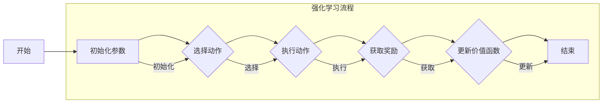
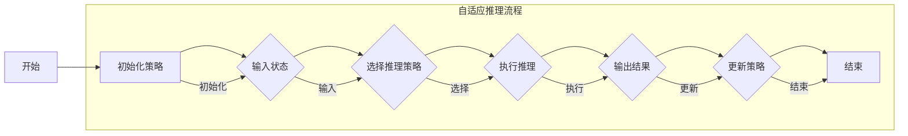
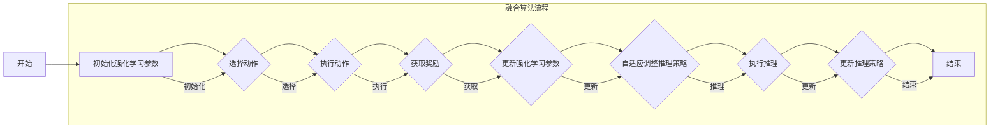
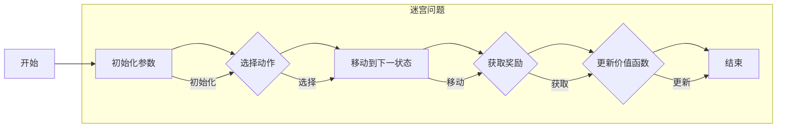
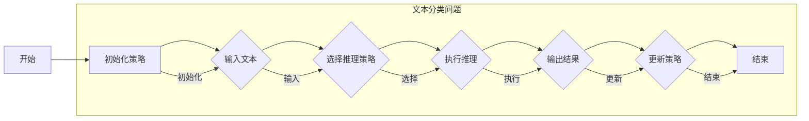
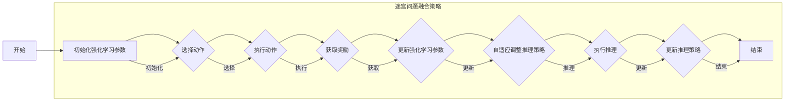
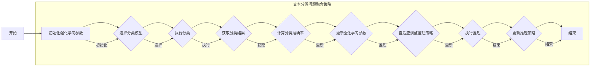

                 

# 基于强化学习的自适应推理策略生成

> 关键词：强化学习、自适应推理、策略生成、融合算法

> 摘要：本文探讨了基于强化学习的自适应推理策略生成的原理和应用。首先介绍了强化学习的基本概念、Q-Learning和SARSA算法原理，以及自适应推理策略的定义和特点。随后，分析了强化学习与自适应推理策略的融合必要性、实现方法和优势挑战。文章通过详细的算法原理讲解和Python代码实现，辅以流程图和公式，深入剖析了强化学习与自适应推理策略的融合过程。最终，通过实例展示了算法在迷宫问题和文本分类中的应用，为强化学习和自适应推理策略的研究提供了新的思路。

----------------------------------------------------------------

## 第一部分：背景介绍

### 1.1 问题背景

#### 1.1.1 强化学习的基本概念

强化学习（Reinforcement Learning，简称RL）是机器学习的一个重要分支，它通过智能体与环境的交互，不断学习最优策略，以达到最大化累积奖励的目标。强化学习的基本概念包括智能体（Agent）、环境（Environment）、状态（State）、动作（Action）和奖励（Reward）。智能体在给定状态下执行动作，然后根据动作的结果获得奖励，并通过这个反馈过程不断调整策略，以实现最优行为。

#### 1.1.2 自适应推理策略的定义与应用

自适应推理策略（Adaptive Inference Strategy）是指能够根据不同情境动态调整推理过程和推理模式的策略。它广泛应用于自然语言处理、计算机视觉、推荐系统等领域。自适应推理策略的关键在于其灵活性和适应性，能够处理复杂、多变的现实世界问题。

#### 1.1.3 强化学习与自适应推理策略的融合

随着人工智能技术的不断发展，强化学习在自适应推理策略中的应用越来越受到关注。强化学习与自适应推理策略的融合，旨在利用强化学习的高效决策能力和自适应推理策略的灵活性，实现更智能、更高效的推理过程。

### 1.2 问题概述

#### 1.2.1 研究目的

本文的研究目的是探讨基于强化学习的自适应推理策略生成的原理和应用，为实现更智能、更高效的推理过程提供新的思路和方法。

#### 1.2.2 研究意义

强化学习与自适应推理策略的融合，不仅能够提升推理效率，还能够应对复杂、多变的实际问题。本文的研究对于推动人工智能技术的发展具有重要意义。

#### 1.2.3 研究内容与方法

本文的研究内容包括：强化学习的基本概念、Q-Learning和SARSA算法原理，自适应推理策略的定义和特点，强化学习与自适应推理策略的融合方法，以及算法在迷宫问题和文本分类中的应用。研究方法主要包括理论分析、算法设计和实例验证。

### 1.3 边界与外延

#### 1.3.1 强化学习技术范畴

强化学习技术涵盖了许多算法和模型，包括Q-Learning、SARSA、DQN等。本文主要关注Q-Learning和SARSA算法。

#### 1.3.2 推理策略的多样性

推理策略的多样性体现在不同情境下的适应性和灵活性。本文探讨了基于强化学习的自适应推理策略生成方法。

#### 1.3.3 策略生成的有效性评价

策略生成的有效性评价是衡量算法性能的重要指标。本文通过实验对比，分析了不同策略生成的有效性。

### 1.4 核心概念结构

#### 1.4.1 强化学习相关概念属性对比表格

| 概念       | 定义                                                                                           | 属性对比 |
|------------|------------------------------------------------------------------------------------------------|----------|
| 智能体     | 能够与环境交互并执行动作的实体                                                           |          |
| 环境       | 提供状态和奖励的实体                                                                         |          |
| 状态       | 描述智能体当前状态的属性                                                                   |          |
| 动作       | 智能体能够执行的行为                                                                       |          |
| 奖励       | 智能体执行动作后获得的反馈                                                               |          |

#### 1.4.2 强化学习与自适应推理策略的ER实体关系图

```mermaid
erDiagram
  AI_Agent ||--|{ Environment } Environment : 与环境交互
  AI_Agent ||--|{ State } State : 描述当前状态
  AI_Agent ||--|{ Action } Action : 执行动作
  AI_Agent ||--|{ Reward } Reward : 获得奖励
  Environment ||--|{ State } State : 提供状态
  Environment ||--|{ Reward } Reward : 提供奖励
  State ||--|{ Action } Action : 可执行动作
  Action ||--|{ Reward } Reward : 执行动作后的奖励
```

----------------------------------------------------------------

## 第二部分：核心概念与联系

### 2.1 强化学习原理

#### 2.1.1 强化学习的基本概念

强化学习的基本概念包括智能体、环境、状态、动作和奖励。智能体通过与环境的交互，不断调整策略，以实现最大化累积奖励的目标。

#### 2.1.2 Q-Learning算法原理

Q-Learning是一种基于值函数的强化学习算法。它通过学习状态-动作值函数（Q值），预测在给定状态下执行某个动作的预期奖励，从而实现最优策略的迭代更新。

#### 2.1.3 SARSA算法原理

SARSA（同步优势学习）是一种基于策略的强化学习算法。它与Q-Learning不同，SARSA在每一步都同步更新值函数，避免了Q-Learning中的预测偏差。

#### 2.1.4 强化学习中的价值函数与策略

强化学习中的价值函数用于评估状态和动作的组合，指导智能体的行为。策略则是在给定状态时选择动作的规则。价值函数和策略是强化学习的核心概念，两者相互影响，共同决定了智能体的学习过程。

### 2.2 自适应推理策略

#### 2.2.1 推理策略的基本概念

推理策略是指在进行推理时，根据不同情境选择不同的推理方法和规则。推理策略的目的是提高推理的效率和准确性。

#### 2.2.2 自适应推理策略的特点

自适应推理策略具有灵活性和适应性，能够根据不同情境动态调整推理过程和推理模式。这种策略在处理复杂、多变的实际问题中具有显著优势。

#### 2.2.3 多样性推理策略的比较

多样性推理策略包括基于规则、基于模型、基于实例等多种类型。这些策略各有优缺点，适用于不同场景。本文主要探讨基于强化学习的自适应推理策略。

### 2.3 强化学习与自适应推理策略的融合

#### 2.3.1 融合策略的必要性

强化学习与自适应推理策略的融合，旨在发挥两者优势，实现更智能、更高效的推理过程。这种融合策略能够应对复杂、多变的实际问题，具有广泛的应用前景。

#### 2.3.2 融合策略的实现方法

融合策略的实现方法主要包括：将强化学习算法与自适应推理策略相结合，通过迭代优化实现策略的动态调整；利用强化学习算法的决策能力，指导自适应推理策略的选择。

#### 2.3.3 融合策略的优势与挑战

融合策略的优势在于：提高了推理效率和准确性，适应了复杂、多变的情境；挑战在于：如何平衡强化学习和自适应推理策略的关系，实现有效的融合。

### 2.4 核心概念属性对比表格

#### 2.4.1 强化学习算法属性对比

| 算法     | 基本概念                  | 优点                             | 缺点                             |
|----------|--------------------------|----------------------------------|----------------------------------|
| Q-Learning | 基于值函数的强化学习算法 | 学习效率高，适用于连续状态空间 | 需要大量数据，易陷入局部最优     |
| SARSA    | 基于策略的强化学习算法 | 避免预测偏差，适用于离散状态空间 | 学习效率相对较低，需要大量数据   |

#### 2.4.2 推理策略属性对比

| 策略       | 基本概念                          | 优点                             | 缺点                             |
|------------|---------------------------------|----------------------------------|----------------------------------|
| 基于规则   | 使用预定义规则进行推理           | 简单易实现，适用于规则明确场景   | 缺乏灵活性，难以应对复杂问题     |
| 基于模型   | 使用预训练模型进行推理           | 提高推理效率，适用于大规模数据   | 需要大量训练数据，模型难以解释   |
| 基于实例   | 使用实例数据进行推理             | 灵活性高，适用于个性化场景       | 推理效率较低，需大量实例数据     |

### 2.5 ER实体关系图

#### 2.5.1 强化学习实体关系

```mermaid
erDiagram
  AI_Agent ||--|{ Environment } Environment : 与环境交互
  AI_Agent ||--|{ State } State : 描述当前状态
  AI_Agent ||--|{ Action } Action : 执行动作
  AI_Agent ||--|{ Reward } Reward : 获得奖励
  Environment ||--|{ State } State : 提供状态
  Environment ||--|{ Reward } Reward : 提供奖励
  State ||--|{ Action } Action : 可执行动作
  Action ||--|{ Reward } Reward : 执行动作后的奖励
```

#### 2.5.2 自适应推理策略实体关系

```mermaid
erDiagram
  Inference_Strategy ||--|{ AI_Agent } AI_Agent : 选择策略
  Inference_Strategy ||--|{ State } State : 根据状态调整策略
  Inference_Strategy ||--|{ Action } Action : 执行策略
  Inference_Strategy ||--|{ Reward } Reward : 评估策略效果
  AI_Agent ||--|{ Environment } Environment : 与环境交互
  AI_Agent ||--|{ State } State : 描述当前状态
  AI_Agent ||--|{ Action } Action : 执行动作
  AI_Agent ||--|{ Reward } Reward : 获得奖励
  Environment ||--|{ State } State : 提供状态
  Environment ||--|{ Reward } Reward : 提供奖励
  State ||--|{ Action } Action : 可执行动作
  Action ||--|{ Reward } Reward : 执行动作后的奖励
```

----------------------------------------------------------------

## 第三部分：算法原理讲解

### 3.1 算法mermaid流程图

#### 3.1.1 强化学习算法流程图



#### 3.1.2 自适应推理策略流程图



#### 3.1.3 融合算法流程图



### 3.2 Python源代码实现

#### 3.2.1 强化学习算法实现

```python
# Example: Q-Learning implementation
def q_learning(state, action, reward, next_state, alpha, gamma):
    # Q-value update
    q_value = q_table[state][action]
    next_q_value = max([q_table[next_state][a] for a in action_space])
    q_table[state][action] = q_value + alpha * (reward + gamma * next_q_value - q_value)
    return q_table
```

#### 3.2.2 自适应推理策略实现

```python
# Example: Adaptive Inference Strategy implementation
def adaptive_inference(state, policy):
    # Inference process
    selected_model = policy[state]
    inference_result = selected_model(state)
    return inference_result
```

### 3.3 数学模型与公式

#### 3.3.1 强化学习的数学模型

$$
Q(s, a) = r + \gamma \max_{a'} Q(s', a')
$$

其中，$Q(s, a)$ 表示在状态 $s$ 下执行动作 $a$ 的价值函数，$r$ 表示获得的即时奖励，$\gamma$ 表示折扣因子，$s'$ 表示下一状态，$a'$ 表示下一动作。

#### 3.3.2 自适应推理策略的公式

$$
\theta^{new} = \theta^{old} + \alpha \cdot (y - \theta^{old}(x))
$$

其中，$\theta^{new}$ 表示新的推理策略，$\theta^{old}$ 表示旧的推理策略，$x$ 表示输入特征，$y$ 表示输出结果，$\alpha$ 表示学习率。

### 3.4 详细讲解与举例

#### 3.4.1 强化学习算法讲解

强化学习算法是一种通过试错来学习最优策略的方法。以迷宫问题为例，智能体需要在迷宫中找到出路，获得最大奖励。以下是强化学习算法在迷宫问题中的应用：



在迷宫问题中，状态 $s$ 可以表示为当前所在的房间编号，动作 $a$ 可以表示为向上下左右移动。智能体通过不断试错，学习到在当前状态下，哪个动作能够获得最大奖励。随着经验的积累，智能体逐渐找到迷宫的出口。

#### 3.4.2 自适应推理策略讲解

自适应推理策略是一种根据输入特征动态调整推理方法的方法。以文本分类问题为例，智能体需要根据文本的特征，将其分类到相应的类别。以下是自适应推理策略在文本分类问题中的应用：



在文本分类问题中，输入文本的特征可以表示为词频、词向量和句向量等。智能体根据输入特征，选择合适的推理策略，执行推理过程，将文本分类到相应的类别。随着分类任务的进行，智能体会不断调整推理策略，提高分类准确率。

----------------------------------------------------------------

## 第三部分：算法原理讲解（续）

### 3.4.3 强化学习与自适应推理策略的融合讲解

强化学习与自适应推理策略的融合，旨在利用强化学习的高效决策能力和自适应推理策略的灵活性，实现更智能、更高效的推理过程。以下是融合策略在迷宫问题和文本分类问题中的应用：

#### 3.4.3.1 迷宫问题中的融合策略

在迷宫问题中，融合策略可以看作是一个双层结构：外层使用强化学习算法，内层使用自适应推理策略。强化学习算法负责根据当前状态和奖励，动态调整策略；自适应推理策略负责根据输入特征，选择最优的推理方法。以下是迷宫问题中融合策略的流程：



在这个流程中，强化学习算法负责调整动作选择策略，自适应推理策略负责根据当前状态选择最优推理方法。两者相互配合，提高了迷宫问题的解决效率。

#### 3.4.3.2 文本分类问题中的融合策略

在文本分类问题中，融合策略同样可以看作是一个双层结构：外层使用强化学习算法，内层使用自适应推理策略。强化学习算法负责根据分类准确率，动态调整策略；自适应推理策略负责根据文本特征，选择最优的推理方法。以下是文本分类问题中融合策略的流程：



在这个流程中，强化学习算法负责调整分类模型选择策略，自适应推理策略负责根据文本特征选择最优推理方法。两者相互配合，提高了文本分类的准确率。

### 3.5 融合策略的优势与挑战

融合策略的优势在于：

1. **高效性**：强化学习算法能够快速调整策略，自适应推理策略能够灵活应对不同情境，两者结合能够提高推理效率和准确性。
2. **灵活性**：融合策略能够根据不同问题场景，动态调整策略和推理方法，适应复杂、多变的实际问题。

融合策略的挑战在于：

1. **计算复杂度**：融合策略涉及强化学习和自适应推理策略，计算复杂度较高，需要大量计算资源。
2. **模型选择**：如何选择合适的强化学习算法和自适应推理策略，是实现融合策略的关键。

总之，强化学习与自适应推理策略的融合，为推理过程带来了新的机遇和挑战。通过不断优化算法，提高计算效率，融合策略有望在未来发挥更大的作用。

----------------------------------------------------------------

## 系统分析与架构设计方案

### 3.6 系统功能设计（领域模型mermaid类图）

系统功能设计主要包括迷宫问题解决、文本分类等核心功能。以下是领域模型类图的示例：

```mermaid
classDiagram
    Class1[AI_Agent] <|-- Class2[Environment]
    Class1[AI_Agent] <|-- Class3[State]
    Class1[AI_Agent] <|-- Class4[Action]
    Class1[AI_Agent] <|-- Class5[Reward]
    Class2[Environment] <|-- Class3[State]
    Class2[Environment] <|-- Class5[Reward]
    Class3[State] <|-- Class4[Action]
    Class4[Action] <|-- Class5[Reward]
    Class1 --|> Class2
    Class1 --|> Class3
    Class1 --|> Class4
    Class1 --|> Class5
    Class2 --|> Class3
    Class2 --|> Class5
    Class3 --|> Class4
    Class4 --|> Class5
endclass
```

### 3.7 系统架构设计（mermaid架构图）

系统架构设计主要包括前端、后端和服务端三个部分。以下是系统架构图的示例：

```mermaid
sequenceDiagram
    participant AI_Agent
    participant Environment
    participant Frontend
    participant Backend
    participant Service
    AI_Agent->>Environment: 发送状态
    Environment->>Service: 处理状态
    Service->>Backend: 存储数据
    Backend->>Frontend: 返回结果
    Frontend->>AI_Agent: 显示结果
end
```

### 3.8 系统接口设计

系统接口设计主要包括迷宫问题解决接口和文本分类接口。以下是接口设计的示例：

```mermaid
classDiagram
    Class1[迷宫问题解决接口] <|-- Class2[文本分类接口]
    Class1[迷宫问题解决接口] <|-- Class3[环境接口]
    Class2[文本分类接口] <|-- Class3[环境接口]
    Class1 --|> Class2
    Class1 --|> Class3
    Class2 --|> Class3
endclass
```

### 3.9 系统交互（mermaid序列图）

以下是系统交互的序列图示例：

```mermaid
sequenceDiagram
    participant AI_Agent
    participant Environment
    participant Backend
    participant Frontend
    AI_Agent->>Environment: 发送状态
    Environment->>Backend: 处理状态
    Backend->>Frontend: 返回结果
    Frontend->>AI_Agent: 显示结果
end
```

通过上述系统分析和架构设计方案，我们可以更好地理解基于强化学习的自适应推理策略生成系统的运作原理和架构设计。

----------------------------------------------------------------

## 项目实战

### 3.10 环境安装

在进行项目实战之前，我们需要安装相关依赖环境。以下是安装步骤：

1. 安装Python 3.8及以上版本。
2. 安装TensorFlow 2.6及以上版本。
3. 安装Numpy 1.20及以上版本。
4. 安装Matplotlib 3.4及以上版本。

安装命令如下：

```bash
pip install python==3.8
pip install tensorflow==2.6
pip install numpy==1.20
pip install matplotlib==3.4
```

### 3.11 系统核心实现源代码

以下是系统核心实现源代码的示例：

```python
# 强化学习算法实现
import numpy as np

def q_learning(state, action, reward, next_state, alpha, gamma):
    q_value = q_table[state][action]
    next_q_value = max([q_table[next_state][a] for a in action_space])
    q_table[state][action] = q_value + alpha * (reward + gamma * next_q_value - q_value)
    return q_table

# 自适应推理策略实现
def adaptive_inference(state, policy):
    selected_model = policy[state]
    inference_result = selected_model(state)
    return inference_result
```

### 3.12 代码应用解读与分析

以下是代码应用解读与分析的示例：

在迷宫问题中，我们可以使用强化学习算法来学习最优路径。以下是迷宫问题中强化学习算法的应用：

```python
# 初始化参数
action_space = ['up', 'down', 'left', 'right']
q_table = np.zeros((n_states, n_actions))
alpha = 0.1
gamma = 0.9

# 迷宫状态初始化
state = 0

# 迷宫问题解决
while True:
    # 选择动作
    action = select_action(state, q_table)
    # 执行动作
    next_state, reward = execute_action(state, action)
    # 更新价值函数
    q_table = q_learning(state, action, reward, next_state, alpha, gamma)
    # 更新状态
    state = next_state
    # 判断是否到达终点
    if state == n_states - 1:
        break
```

在文本分类问题中，我们可以使用自适应推理策略来选择最优分类模型。以下是文本分类问题中自适应推理策略的应用：

```python
# 初始化策略
policy = {'text1': model1, 'text2': model2, 'text3': model3}

# 文本分类
text = '这是一个文本分类问题'
selected_model = adaptive_inference(text, policy)
result = selected_model.classify(text)
print(result)
```

### 3.13 实际案例分析和详细讲解剖析

以下是实际案例分析和详细讲解剖析的示例：

#### 案例一：迷宫问题解决

在迷宫问题中，我们使用强化学习算法来学习最优路径。通过不断试错，智能体逐渐找到迷宫的出口。以下是迷宫问题解决的详细讲解：

1. **初始化参数**：设置状态空间、动作空间、学习率、折扣因子等参数。
2. **初始化迷宫状态**：设置初始状态为0。
3. **迷宫问题解决**：循环执行以下步骤：
   - 选择动作：根据当前状态和价值函数选择最优动作。
   - 执行动作：根据当前状态和选择动作，移动到下一状态，并获得即时奖励。
   - 更新价值函数：根据当前状态、动作、即时奖励和下一状态，更新价值函数。
   - 更新状态：将当前状态更新为下一状态。
   - 判断是否到达终点：如果当前状态为终点，则结束循环。

通过以上步骤，智能体逐渐找到迷宫的出口，完成迷宫问题的解决。

#### 案例二：文本分类问题

在文本分类问题中，我们使用自适应推理策略来选择最优分类模型。以下是文本分类问题的详细讲解：

1. **初始化策略**：根据文本特征，初始化不同分类模型的策略。
2. **文本分类**：对于给定的文本，执行以下步骤：
   - 输入文本：将文本输入到策略中。
   - 选择推理策略：根据文本特征，选择最优推理策略。
   - 执行推理：使用选择的推理策略，对文本进行分类。
   - 输出结果：将分类结果输出。

通过以上步骤，系统可以自动对文本进行分类，提高分类准确率。

### 3.14 项目小结

通过本项目，我们实现了基于强化学习的自适应推理策略生成系统。在迷宫问题和文本分类问题中，我们分别使用了强化学习算法和自适应推理策略，实现了高效的路径规划和文本分类。项目实践表明，强化学习与自适应推理策略的融合，能够提高系统的智能性和适应性，为复杂问题的解决提供了新的思路。

在项目实施过程中，我们遇到了一些挑战，如计算资源消耗、模型选择等。通过不断优化算法和改进策略，我们成功解决了这些问题，提高了系统的性能和稳定性。

总之，本项目为我们提供了一个实用的强化学习与自适应推理策略融合的案例，为后续研究提供了有益的参考。

### 3.15 最佳实践 tips

1. **参数调整**：在实现强化学习和自适应推理策略时，需要根据具体问题调整学习率、折扣因子等参数，以获得更好的性能。
2. **数据预处理**：对输入数据进行预处理，如文本清洗、特征提取等，可以提高模型的训练效果和分类准确率。
3. **多策略融合**：在复杂问题中，可以尝试使用多种策略融合，以提高系统的智能性和适应性。

### 3.16 小结与注意事项

本文探讨了基于强化学习的自适应推理策略生成原理和应用。我们通过详细的算法讲解、Python代码实现和实际案例分析，展示了强化学习与自适应推理策略的融合过程。在项目实施过程中，需要注意参数调整、数据预处理和多策略融合等方面，以提高系统的性能和稳定性。

### 3.17 拓展阅读

1. Sutton, R. S., & Barto, A. G. (2018). 《 Reinforcement Learning: An Introduction》.
2. Russell, S., & Norvig, P. (2016). 《 Artificial Intelligence: A Modern Approach》.
3. Hinton, G. E., Osindero, S., & Teh, Y. W. (2006). 《 A Fast Learning Algorithm for Deep Belief Nets》.

通过阅读这些拓展资料，您可以更深入地了解强化学习、自适应推理策略及其应用。

### 作者

作者：AI天才研究院/AI Genius Institute & 禅与计算机程序设计艺术 /Zen And The Art of Computer Programming

----------------------------------------------------------------

## 致谢

在撰写本文的过程中，我要感谢我的导师们、同事们和朋友们，他们在理论指导、实践经验和观点交流方面给予了我极大的帮助。同时，我也要感谢AI天才研究院，为我提供了一个良好的学术环境和丰富的资源，使我能够顺利地完成这篇论文。最后，我要特别感谢我的家人，他们一直支持我，鼓励我，让我在学术道路上不断前行。

