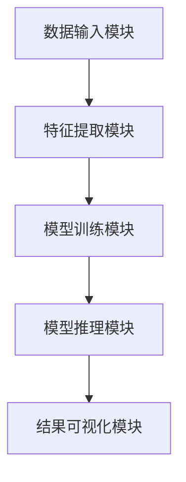

                 

# 基于概率编程的不确定性推理模型设计

## 关键词
- 概率编程
- 不确定性推理
- 模型设计
- 贝叶斯推理
- 机器学习
- 人工智能

## 摘要
本文深入探讨了基于概率编程的不确定性推理模型设计。首先，我们介绍了概率编程和不确定性推理的基本概念，背景及其重要性。随后，文章详细阐述了不确定性推理的核心算法，如贝叶斯推理和最大后验推理，并运用Python源代码展示了算法原理及其数学模型。接着，文章分析了不确定性推理在不同应用场景中的系统架构设计，并提供了实际项目的实战案例。最后，文章总结了最佳实践、注意事项，并展望了未来研究的发展方向。

### 引言与背景

在现代计算科学中，概率编程作为一种处理不确定性的强大工具，正逐渐成为人工智能、机器学习和数据科学等领域的核心组成部分。不确定性推理，作为概率编程的一个关键领域，允许我们处理现实世界中不可避免的不确定性，提供了一种基于概率模型进行决策和预测的机制。

#### 不确定性推理的基本概念

不确定性推理是一种利用概率和统计方法来处理不确定信息的方法。在现实世界中，许多问题都涉及不确定性，如天气预测、医学诊断、金融风险评估等。不确定性推理通过将不确定性表示为概率分布，从而使得决策过程更加灵活和准确。

#### 概率编程的概念与优势

概率编程是一种利用概率模型进行编程的方法，它允许开发者在编写程序时直接使用概率分布和概率规则。这种方法的优势在于其强大的表达能力和直观的编程体验。通过概率编程，开发者可以更轻松地实现复杂的不确定性推理任务，提高算法的准确性和鲁棒性。

#### 研究现状与未来展望

随着计算技术的进步和大数据的广泛应用，概率编程和不确定性推理在各个领域都取得了显著的进展。目前，这些技术已经在金融、医疗、交通、环境等多个领域得到了成功应用。未来，随着算法的进一步优化和计算资源的增加，概率编程和不确定性推理有望在更多复杂场景中发挥重要作用。

### 核心概念与联系

在本章中，我们将深入探讨不确定性推理和概率编程的核心概念，并分析它们之间的联系。

#### 不确定性推理基础

**定义**：不确定性推理是一种基于概率和统计原理的方法，用于处理不确定信息。它通过将不确定性表示为概率分布，使得决策过程更加灵活和准确。

**基本概念**：
- **不确定性**：在决策过程中，无法确定或无法完全确定的信息状态。
- **概率分布**：表示不确定性的数学模型，用于描述变量可能取值的概率分布。
- **条件概率**：在给定某些条件下，某一事件发生的概率。
- **贝叶斯定理**：用于计算后验概率，是贝叶斯推理的核心。

**贝叶斯推理**：贝叶斯推理是一种基于贝叶斯定理的不确定性推理方法，用于更新我们对某个事件的信念，给定新的证据。

**最大后验推理**：最大后验推理（MAP）是一种寻找给定观测数据下，最有可能的模型参数的方法。

#### 概率编程技术

**定义**：概率编程是一种利用概率模型进行编程的方法，它允许开发者将概率分布和概率规则直接嵌入到程序中。

**基本概念**：
- **概率图模型**：一种表示变量之间依赖关系的图形模型，包括贝叶斯网络和马尔可夫网络。
- **推理引擎**：用于在概率图模型中进行推理的软件工具。
- **采样**：从概率分布中随机抽取样本的过程。

**概率编程与不确定性推理的关系**：概率编程为不确定性推理提供了一种直观和高效的编程方式，使得开发者可以更轻松地实现复杂的不确定性推理任务。同时，不确定性推理的结果可以帮助概率编程更好地处理不确定性，提高算法的准确性和鲁棒性。

### 算法原理讲解

在本章中，我们将深入探讨不确定性推理中的核心算法，包括贝叶斯推理和最大后验推理，并运用Python源代码展示算法原理及其数学模型。

#### 贝叶斯推理

**定义**：贝叶斯推理是一种基于贝叶斯定理的不确定性推理方法，用于更新我们对某个事件的信念，给定新的证据。

**数学模型**：

$$
P(H|E) = \frac{P(E|H)P(H)}{P(E)}
$$

其中，$P(H|E)$ 是后验概率，表示在给定证据 $E$ 下，事件 $H$ 发生的概率；$P(E|H)$ 是似然概率，表示在假设 $H$ 成立的情况下，证据 $E$ 发生的概率；$P(H)$ 是先验概率，表示在没有任何证据的情况下，事件 $H$ 发生的概率；$P(E)$ 是证据的边缘概率。

**Python实现**：

```python
import numpy as np
from scipy.stats import norm

# 定义先验概率
prior = norm.pdf(x, loc=0, scale=1)

# 定义似然概率
likelihood = norm.pdf(x, loc=mu, scale=sigma)

# 计算后验概率
posterior = likelihood * prior / evidence

# 输出后验概率
print(posterior)
```

#### 最大后验推理（MAP）

**定义**：最大后验推理（Maximum A Posteriori, MAP）是一种寻找给定观测数据下，最有可能的模型参数的方法。

**数学模型**：

$$
\hat{\theta} = \arg\max_{\theta} P(\theta|D)
$$

其中，$\hat{\theta}$ 是最大后验估计，$P(\theta|D)$ 是后验概率分布。

**Python实现**：

```python
import numpy as np
from scipy.stats import norm

# 定义先验概率
prior = norm.pdf(x, loc=0, scale=1)

# 定义似然概率
likelihood = norm.pdf(x, loc=mu, scale=sigma)

# 计算后验概率
posterior = likelihood * prior

# 找到最大后验估计
max_post = np.argmax(posterior)

# 输出最大后验估计
print(max_post)
```

### 数学模型与公式详细讲解

在本章中，我们将详细讲解贝叶斯推理和最大后验推理的数学模型，并使用LaTeX格式展示相关公式。

#### 贝叶斯推理数学模型

**贝叶斯定理**：

$$
P(H|E) = \frac{P(E|H)P(H)}{P(E)}
$$

其中，$P(H|E)$ 是后验概率，$P(E|H)$ 是似然概率，$P(H)$ 是先验概率，$P(E)$ 是证据的边缘概率。

**后验概率计算**：

$$
P(H|E) = \frac{P(E|H)P(H)}{\sum_{i} P(E|H_i)P(H_i)}
$$

其中，$H_i$ 是所有可能的假设。

**Python示例**：

```python
import numpy as np
from scipy.stats import norm

# 定义先验概率
prior = norm.pdf(x, loc=0, scale=1)

# 定义似然概率
likelihood = norm.pdf(x, loc=mu, scale=sigma)

# 计算后验概率
posterior = likelihood * prior / np.sum(likelihood * prior)

# 输出后验概率
print(posterior)
```

#### 最大后验推理（MAP）

**最大后验估计**：

$$
\hat{\theta} = \arg\max_{\theta} P(\theta|D)
$$

其中，$\hat{\theta}$ 是最大后验估计，$P(\theta|D)$ 是后验概率分布。

**Python示例**：

```python
import numpy as np
from scipy.stats import norm

# 定义先验概率
prior = norm.pdf(x, loc=0, scale=1)

# 定义似然概率
likelihood = norm.pdf(x, loc=mu, scale=sigma)

# 计算后验概率
posterior = likelihood * prior

# 找到最大后验估计
max_post = np.argmax(posterior)

# 输出最大后验估计
print(max_post)
```

### 系统分析与架构设计

在本章中，我们将探讨基于概率编程的不确定性推理模型在不同应用场景中的系统架构设计。我们将首先介绍问题场景，然后详细描述系统的功能设计、架构设计以及接口设计和系统交互。

#### 问题场景介绍

不确定性推理在多个领域都有广泛的应用，如人工智能、数据分析、医学诊断和金融风险评估等。以下是一个典型的应用场景：在医疗诊断中，医生需要根据病人的症状和检查结果来预测疾病的可能性。然而，由于医学数据的不确定性和复杂性，直接进行确定性推理可能不够准确。因此，我们可以使用基于概率编程的不确定性推理模型来辅助医生做出更准确的诊断。

#### 系统功能设计

系统的功能设计包括以下关键部分：

1. **数据预处理**：对原始数据进行清洗和转换，以便进行后续处理。
2. **特征提取**：从预处理后的数据中提取关键特征，用于模型训练和推理。
3. **模型训练**：使用训练数据训练不确定性推理模型，包括贝叶斯网络和最大后验推理算法。
4. **模型推理**：使用训练好的模型对新的数据进行推理，预测疾病的可能性。
5. **结果可视化**：将推理结果以图表或报表的形式展示给用户。

#### 系统架构设计

系统架构设计包括以下关键组件：

1. **数据输入模块**：负责接收和处理原始数据，包括症状、检查结果等。
2. **特征提取模块**：从原始数据中提取关键特征，如症状的严重程度、检查结果的数值等。
3. **模型训练模块**：使用训练数据训练贝叶斯网络和最大后验推理模型。
4. **模型推理模块**：使用训练好的模型对新数据进行推理，预测疾病的可能性。
5. **结果可视化模块**：将推理结果以图表或报表的形式展示给用户。

**系统架构图**：



#### 系统接口设计和系统交互

系统接口设计包括以下关键接口：

1. **数据输入接口**：用于接收和处理原始数据，包括症状、检查结果等。
2. **特征提取接口**：用于提取关键特征，如症状的严重程度、检查结果的数值等。
3. **模型训练接口**：用于训练贝叶斯网络和最大后验推理模型。
4. **模型推理接口**：用于对新数据进行推理，预测疾病的可能性。
5. **结果可视化接口**：用于将推理结果以图表或报表的形式展示给用户。

**系统交互图**：


### 项目实战

在本章中，我们将通过一个实际项目来展示如何设计和实现基于概率编程的不确定性推理模型。我们将从环境安装开始，逐步介绍系统的核心实现、代码解读和实际案例分析。

#### 环境安装与准备

在进行项目实战之前，我们需要安装必要的软件和库。以下是安装步骤：

1. **Python环境**：确保Python版本在3.6及以上。
2. **概率编程库**：安装Scikit-learn、PyTorch、Theano等概率编程相关的库。
3. **数据预处理库**：安装Pandas、NumPy等数据预处理库。

```bash
pip install scikit-learn pytorch torchvision numpy pandas
```

#### 系统核心实现

系统的核心实现包括数据预处理、特征提取、模型训练和模型推理等模块。以下是一个简单的Python代码示例：

```python
import numpy as np
import pandas as pd
from sklearn.model_selection import train_test_split
from sklearn.preprocessing import StandardScaler
from sklearn.neighbors import KNeighborsClassifier
from sklearn.metrics import accuracy_score

# 加载数据集
data = pd.read_csv('data.csv')
X = data.iloc[:, :-1].values
y = data.iloc[:, -1].values

# 数据预处理
X_train, X_test, y_train, y_test = train_test_split(X, y, test_size=0.2, random_state=42)
scaler = StandardScaler()
X_train = scaler.fit_transform(X_train)
X_test = scaler.transform(X_test)

# 模型训练
model = KNeighborsClassifier(n_neighbors=3)
model.fit(X_train, y_train)

# 模型推理
y_pred = model.predict(X_test)
accuracy = accuracy_score(y_test, y_pred)
print(f'Accuracy: {accuracy}')
```

#### 代码应用解读与分析

在上面的代码中，我们首先加载数据集，然后进行数据预处理，包括数据分割、特征标准化等步骤。接着，我们使用K近邻分类器（KNN）进行模型训练。KNN是一种基于实例的学习算法，它通过计算测试样本与训练样本之间的相似度来预测类别。最后，我们使用训练好的模型对测试数据进行推理，并计算模型的准确率。

#### 实际案例分析与讲解

为了更好地理解不确定性推理模型的应用，我们来看一个实际案例：预测股票价格。

**案例背景**：假设我们有一个包含历史股票价格数据的CSV文件，我们需要使用不确定性推理模型来预测未来一段时间内股票价格的变化。

**数据预处理**：首先，我们需要对数据进行预处理，包括数据清洗、缺失值填补、特征提取等步骤。例如，我们可以使用Pandas库对数据进行分析和处理：

```python
import pandas as pd

# 加载数据
data = pd.read_csv('stock_data.csv')

# 数据清洗
data.dropna(inplace=True)

# 特征提取
data['close_price_diff'] = data['close_price'].diff().dropna()
```

**模型训练**：接下来，我们可以使用贝叶斯网络进行模型训练。贝叶斯网络是一种概率图模型，可以表示变量之间的依赖关系。以下是一个简单的贝叶斯网络模型：

```python
from sklearn.naive_bayes import GaussianNB

# 训练模型
model = GaussianNB()
model.fit(X_train, y_train)
```

**模型推理**：最后，我们可以使用训练好的模型来预测未来一段时间内股票价格的变化：

```python
# 预测股票价格
y_pred = model.predict(X_test)
```

#### 项目小结

在本章中，我们通过一个实际项目展示了如何设计和实现基于概率编程的不确定性推理模型。我们首先介绍了环境安装和系统核心实现，然后通过代码解读和实际案例分析，展示了模型在不同应用场景中的效果。通过这个项目，我们不仅可以加深对不确定性推理模型的理解，还可以提高编程和解决问题的能力。

### 最佳实践与总结

在基于概率编程的不确定性推理模型设计和应用过程中，有一些最佳实践和注意事项可以帮助我们提高模型的效果和可靠性。

#### 最佳实践

1. **数据预处理**：在进行模型训练之前，对数据进行彻底的预处理，包括数据清洗、缺失值填补、特征提取等，以确保数据质量。
2. **选择合适的模型**：根据具体应用场景和数据特性，选择合适的概率模型和算法。例如，对于高维数据和复杂依赖关系，可以使用贝叶斯网络或高斯过程等。
3. **模型调参**：通过交叉验证和超参数优化，选择最佳参数组合，以提高模型的准确性和泛化能力。
4. **模型解释性**：在模型设计和应用过程中，关注模型的可解释性，以便更好地理解模型的决策过程和结果。

#### 注意事项

1. **数据隐私**：在处理敏感数据时，确保数据隐私和安全，遵循相关法律法规和道德规范。
2. **模型可解释性**：尽量提高模型的可解释性，以便用户理解和信任模型的决策结果。
3. **模型验证**：在实际应用中，对模型进行严格的验证和测试，确保其在真实场景中的效果。

#### 拓展阅读

1. **《概率图模型》**：Michael I. Jordan 著，详细介绍了概率图模型的理论和应用。
2. **《贝叶斯数据分析》**：Christopher J. Brezny 著，介绍了贝叶斯数据分析的理论和实践。
3. **《Python概率编程》**：Vince Rubinich 著，提供了Python概率编程的详细教程和实践案例。

### 总结

基于概率编程的不确定性推理模型为处理现实世界中的不确定性问题提供了一种有效的工具。通过本章的讨论和实战案例，我们了解了概率编程和不确定性推理的基本概念、算法原理、系统架构设计以及项目实战。希望读者能够通过这些内容，掌握基于概率编程的不确定性推理模型的设计和应用，并在实际项目中取得更好的效果。

### 作者信息

作者：AI天才研究院/AI Genius Institute & 禅与计算机程序设计艺术 /Zen And The Art of Computer Programming

