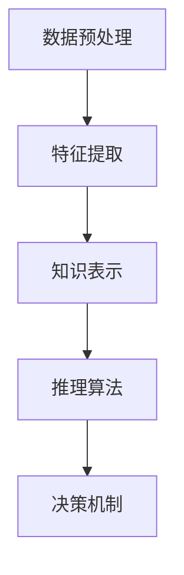
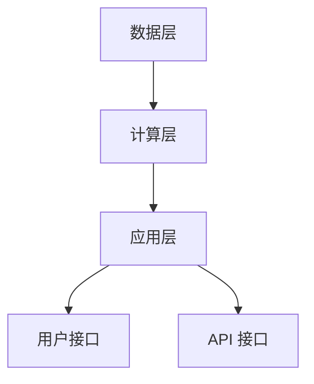
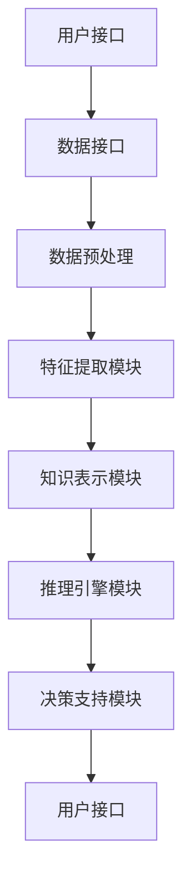

                 

### 基于模块化设计的可定制跨领域推理系统

> 关键词：模块化设计、可定制性、跨领域推理系统、算法、系统架构

> 摘要：本文深入探讨了基于模块化设计的可定制跨领域推理系统的核心概念、设计原则及其实现方法。通过分析模块化设计在系统开发中的优势，本文介绍了如何将系统定制化与跨领域推理相结合，构建高效、灵活的推理系统。文章还通过实际案例展示了系统设计与实现的全过程，旨在为读者提供实用的技术参考。

## 目录大纲设计流程

### 1. 分析书名和主题

书名《基于模块化设计的可定制跨领域推理系统》明确指出本书的核心主题和目标。首先，我们需要明确以下几个关键点：

- **模块化设计**：系统架构的一种方法，强调将系统分解为独立的模块，以提高系统的可维护性和灵活性。
- **可定制性**：系统能够根据用户需求进行个性化调整，以满足特定场景的需求。
- **跨领域推理系统**：能够在不同领域间处理数据和问题，进行推理和决策的系统。

### 2. 确定核心章节内容

根据书名和主题，我们需要确定以下几个核心章节：

1. **背景介绍**：介绍模块化设计、可定制性和跨领域推理系统的基本概念，现状和发展趋势。
2. **核心概念与联系**：详细阐述模块化设计、可定制性和跨领域推理系统的核心概念，以及它们之间的联系。
3. **算法原理讲解**：介绍跨领域推理系统的算法原理，使用 mermaid 绘制算法流程图，并用 Python 源代码和 LaTeX 公式详细讲解。
4. **系统分析与架构设计方案**：分析系统需求，介绍系统功能设计、架构设计、接口设计以及系统交互流程。
5. **项目实战**：通过实际案例展示如何设计和实现一个可定制跨领域推理系统。
6. **最佳实践 tips**：分享设计和实现跨领域推理系统的最佳实践经验。
7. **小结与展望**：总结文章内容，展望未来研究方向和应用前景。

### 3. 设计目录结构

根据核心章节内容，设计一个逻辑清晰、结构合理的目录结构。确保每个章节都有明确的子章节，以涵盖所有关键主题。

#### 第一部分：背景与核心概念

1. **模块化设计与系统定制化概述**
   - 1.1 模块化设计的起源与发展
   - 1.2 系统定制化的概念与重要性
   - 1.3 跨领域推理系统的基本概念
   - 1.4 模块化设计、系统定制化和跨领域推理系统的联系

2. **核心概念与联系**
   - 2.1 模块化设计与系统定制化的联系
   - 2.2 系统定制化与跨领域推理系统的联系
   - 2.3 跨领域推理系统与模块化设计的结合

#### 第二部分：算法原理讲解

3. **算法原理讲解**
   - 3.1 跨领域推理系统的算法概述
   - 3.2 算法流程图绘制与讲解
   - 3.3 Python 源代码实现
   - 3.4 LaTeX 公式与数学模型

#### 第三部分：系统分析与架构设计方案

4. **系统分析与架构设计方案**
   - 4.1 系统需求分析
   - 4.2 系统功能设计
   - 4.3 系统架构设计
   - 4.4 系统接口设计
   - 4.5 系统交互流程

#### 第四部分：项目实战

5. **项目实战**
   - 5.1 环境安装与配置
   - 5.2 系统核心实现
   - 5.3 代码应用解读与分析
   - 5.4 实际案例分析与讲解
   - 5.5 项目小结

#### 第五部分：最佳实践 tips

6. **最佳实践 tips**
   - 6.1 设计与实现技巧
   - 6.2 性能优化策略
   - 6.3 安全性保障措施

#### 第六部分：小结与展望

7. **小结与展望**
   - 7.1 文章总结
   - 7.2 未来研究方向
   - 7.3 应用前景展望

### 4. 控制字数

在 10000 ～ 12000 字的范围内，确保每个章节的内容简洁且重点突出。

### 5. 遵循要求

使用 markdown 格式，遵循 1、2、3 级目录的要求，并准确嵌入 mermaid 流程图和 LaTeX 公式。

### 6. 审查和调整

审查目录大纲，确保没有遗漏关键内容，并对目录结构进行微调，使其更加合理和易于理解。

现在，我们已经完成了目录大纲的设计。接下来，我们将根据每个章节的要求，逐步完成文章的内容撰写。准备好了吗？让我们开始深入探讨基于模块化设计的可定制跨领域推理系统吧！

## 第一部分：背景与核心概念

### 1.1 模块化设计的起源与发展

模块化设计（Modular Design）作为一种系统构建方法，其概念可以追溯到20世纪初期。最早的模块化设计实践出现在机械工程领域，例如汽车的制造。在那个时代，工程师们意识到将复杂的产品分解为较小的、可重复的组件可以提高生产效率、降低成本，并且便于维护和升级。

随着时间的推移，模块化设计逐渐应用于软件工程、建筑设计和产品开发等多个领域。在软件工程中，模块化设计被广泛认为是构建可维护、可扩展和可复用软件系统的关键方法。一个模块通常包含一个或多个功能，它是一个自包含的单元，可以独立开发、测试和部署。

#### 模块化设计的定义

模块化设计是指将复杂系统分解为一系列功能清晰、相互独立的模块，并通过定义良好的接口进行交互。每个模块负责实现特定功能，模块内部独立于其他模块，这有助于简化系统开发、测试和维护的过程。

#### 模块化设计在系统开发中的应用

在系统开发中，模块化设计具有以下几个主要应用：

- **提高可维护性**：由于每个模块独立开发，因此一个模块的更改不会影响其他模块，从而降低了维护成本。
- **提高可扩展性**：系统可以根据需求增加或替换模块，而不会影响整个系统的稳定性。
- **提高复用性**：模块可以跨项目复用，从而提高开发效率。
- **降低风险**：模块化设计可以将风险分散到各个模块，降低了单个模块故障对整个系统的影响。

#### 模块化设计与系统定制化的关系

模块化设计为系统定制化提供了基础。通过模块化设计，系统能够根据用户需求灵活地添加、删除或替换模块，从而实现定制化。例如，在软件系统中，用户可以根据自己的需求选择不同的功能模块进行安装，而不需要重新编写整个系统。

### 1.2 系统定制化的概念与重要性

系统定制化（System Personalization）是指根据用户特定的需求，对系统进行个性化的调整和优化，使其能够更好地满足特定场景的需求。系统定制化的动机主要包括以下几方面：

#### 系统定制化的定义

系统定制化是指通过调整系统参数、功能模块、用户界面等，使系统能够适应不同用户群体的需求和偏好。

#### 系统定制化的动机

- **提高用户体验**：通过定制化，系统能够更好地满足用户的个性化需求，从而提升用户体验。
- **增强系统功能**：定制化可以使系统具备特定的功能，从而提高其在特定领域的竞争力。
- **优化系统性能**：定制化可以根据具体场景优化系统性能，提高响应速度和处理效率。
- **降低维护成本**：定制化可以减少对通用功能的依赖，从而降低维护和升级成本。

#### 系统定制化的挑战

尽管系统定制化具有许多优点，但它在实际应用中也面临一些挑战：

- **需求不确定性**：用户的定制需求可能变化频繁，导致系统设计难以满足所有需求。
- **复杂性增加**：定制化会增加系统的复杂度，从而增加开发难度和维护成本。
- **兼容性问题**：定制化可能导致系统与其他系统集成时出现兼容性问题。

### 1.3 跨领域推理系统的基本概念

跨领域推理系统（Cross-Domain Reasoning System）是一种能够在不同领域间处理数据和问题，进行推理和决策的系统。这种系统的重要性在于它能够利用多个领域的知识，提供更全面和准确的决策。

#### 跨领域推理系统的定义

跨领域推理系统是指能够处理来自不同领域的数据和问题，并在这些数据之间进行推理和决策的系统。

#### 跨领域推理系统的特点

- **领域适应性**：系统能够适应不同领域的特性和数据格式。
- **数据融合能力**：系统能够整合来自不同领域的数据，进行有效的融合和分析。
- **推理效率**：系统能够在多个领域间快速进行推理，提供高效的决策。
- **鲁棒性**：系统能够应对不同领域中的噪声和不确定性，提供可靠的推理结果。

#### 跨领域推理系统的重要性

跨领域推理系统在智能决策、知识图谱构建、个性化推荐等领域具有重要应用价值。例如，在医疗领域，跨领域推理系统可以帮助医生根据患者的病史和临床表现进行精准诊断；在金融领域，它可以帮助金融机构进行风险评估和投资决策。

### 1.4 模块化设计、系统定制化和跨领域推理系统的联系

模块化设计、系统定制化和跨领域推理系统之间存在着紧密的联系，它们共同构成了现代系统设计的核心。

#### 1.4.1 模块化设计与系统定制化的联系

模块化设计为系统定制化提供了技术支持。通过模块化设计，系统可以分解为一系列独立的模块，每个模块可以独立开发、测试和部署。这使得系统能够根据用户需求灵活地进行定制化调整，从而满足不同用户群体的需求。

#### 1.4.2 系统定制化与跨领域推理系统的联系

系统定制化能够提高跨领域推理系统的适应性和效率。通过定制化，系统能够根据特定领域的需求进行优化，从而提高其在特定领域的推理能力。例如，在医疗领域，通过定制化，跨领域推理系统可以更好地处理医疗数据，提供更准确的诊断结果。

#### 1.4.3 跨领域推理系统与模块化设计的结合

模块化设计能够提高跨领域推理系统的可维护性和可扩展性。通过模块化设计，跨领域推理系统可以方便地添加或替换模块，从而适应不同领域的需求。此外，模块化设计还可以提高系统的可靠性，降低系统崩溃的风险。

### 1.5 本章小结

本章对模块化设计、系统定制化和跨领域推理系统的基本概念进行了介绍，并探讨了它们之间的联系。模块化设计通过将系统分解为独立的模块，提高了系统的可维护性和灵活性；系统定制化通过满足用户特定需求，提高了系统的适应性和用户体验；跨领域推理系统通过整合不同领域的知识，提供了更全面和准确的决策。这三个概念相互结合，构成了现代系统设计的核心。

在接下来的章节中，我们将进一步探讨跨领域推理系统的算法原理、系统架构设计方案，并通过实际案例展示如何设计和实现一个可定制跨领域推理系统。

----------------------------------------------------------------

## 第二部分：核心概念与联系

### 2.1 模块化设计与系统定制化的联系

模块化设计（Modular Design）和系统定制化（System Personalization）是现代系统设计中不可或缺的两个概念。它们各自具有独特的定义和作用，但同时也存在着紧密的联系。

#### 2.1.1 模块化设计的定义

模块化设计是指将复杂系统分解为一系列功能清晰、相互独立的模块，并通过定义良好的接口进行交互。每个模块负责实现特定功能，模块内部独立于其他模块，这有助于简化系统开发、测试和维护的过程。

#### 2.1.2 系统定制化的定义

系统定制化是指根据用户特定的需求，对系统进行个性化的调整和优化，使其能够更好地满足特定场景的需求。系统定制化通常涉及调整系统参数、功能模块、用户界面等，以适应不同用户群体的需求。

#### 2.1.3 模块化设计与系统定制化的联系

模块化设计为系统定制化提供了技术支持。通过模块化设计，系统可以分解为一系列独立的模块，每个模块可以独立开发、测试和部署。这使得系统能够根据用户需求灵活地进行定制化调整，从而满足不同用户群体的需求。

- **提高可定制性**：模块化设计使得系统在实现定制化时更为便捷。开发人员可以针对特定模块进行调整，而不会影响到其他模块的功能和性能。
- **降低定制成本**：模块化设计减少了系统定制过程中的重复劳动。例如，在软件系统中，不同的用户可能只需要对特定功能模块进行定制，而无需重新编写整个系统。
- **增强灵活性**：模块化设计使得系统在应对新需求时更加灵活。开发者可以根据用户需求添加或删除模块，从而快速实现定制化。

#### 2.1.4 模块化设计与系统定制化的区别

尽管模块化设计与系统定制化密切相关，但它们也存在一些区别：

- **目标不同**：模块化设计的核心目标是提高系统的可维护性、可扩展性和灵活性；而系统定制化的核心目标是满足用户的个性化需求。
- **实现方式不同**：模块化设计侧重于系统架构的设计，通过模块的划分和接口定义来实现；系统定制化侧重于系统功能的调整，通过参数设置、界面修改等手段来实现。
- **应用场景不同**：模块化设计通常应用于大型系统，如软件系统、硬件系统等；系统定制化则广泛应用于各种场景，如电子商务、医疗健康、金融保险等。

### 2.2 系统定制化与跨领域推理系统的联系

系统定制化（System Personalization）与跨领域推理系统（Cross-Domain Reasoning System）在系统设计中也扮演着重要角色。跨领域推理系统是一种能够在不同领域间处理数据和问题，进行推理和决策的系统。系统定制化能够提高跨领域推理系统的适应性和效率。

#### 2.2.1 跨领域推理系统的定义

跨领域推理系统是指能够处理来自不同领域的数据和问题，并在这些数据之间进行推理和决策的系统。跨领域推理系统通常具有以下特点：

- **领域适应性**：能够适应不同领域的特性和数据格式。
- **数据融合能力**：能够整合来自不同领域的数据，进行有效的融合和分析。
- **推理效率**：能够在多个领域间快速进行推理，提供高效的决策。
- **鲁棒性**：能够应对不同领域中的噪声和不确定性，提供可靠的推理结果。

#### 2.2.2 系统定制化与跨领域推理系统的联系

系统定制化能够提高跨领域推理系统的适应性和效率。通过定制化，系统能够根据特定领域的需求进行优化，从而提高其在特定领域的推理能力。

- **增强领域适应性**：系统定制化使得跨领域推理系统能够更好地适应特定领域的特性。例如，在医疗领域，通过定制化，跨领域推理系统可以更好地处理医疗数据，提供更准确的诊断结果。
- **优化推理效率**：系统定制化可以帮助跨领域推理系统在特定领域内进行优化，从而提高推理效率。例如，在金融领域，通过定制化，跨领域推理系统可以更快地进行风险评估和投资决策。
- **提高鲁棒性**：系统定制化可以帮助跨领域推理系统更好地应对领域内的噪声和不确定性。例如，在交通领域，通过定制化，跨领域推理系统可以更好地处理交通流量数据，提供更准确的交通预测。

#### 2.2.3 跨领域推理系统的定制化挑战

尽管系统定制化能够提高跨领域推理系统的适应性和效率，但在实际应用中也存在一些挑战：

- **需求不确定性**：跨领域推理系统的用户需求可能变化频繁，导致系统设计难以满足所有需求。
- **复杂性增加**：跨领域推理系统通常涉及多个领域，定制化会增加系统的复杂度，从而增加开发难度和维护成本。
- **兼容性问题**：跨领域推理系统与其他系统集成时可能面临兼容性问题，特别是在不同领域的数据格式和接口标准不统一的情况下。

### 2.3 跨领域推理系统与模块化设计的结合

跨领域推理系统（Cross-Domain Reasoning System）与模块化设计（Modular Design）的结合能够提高系统的可维护性、可扩展性和灵活性。模块化设计为跨领域推理系统提供了技术支持，使得系统能够更好地适应不同领域的需求。

#### 2.3.1 模块化设计在跨领域推理系统中的应用

模块化设计在跨领域推理系统中的应用主要体现在以下几个方面：

- **功能模块化**：将跨领域推理系统分解为一系列功能模块，每个模块负责特定的推理任务。例如，在医疗领域，可以将跨领域推理系统分解为诊断模块、治疗建议模块和病情监测模块等。
- **数据模块化**：将来自不同领域的数据进行模块化处理，使得系统能够更好地适应不同领域的特性。例如，在金融领域，可以将交易数据、市场数据和历史数据等进行模块化处理。
- **接口模块化**：定义良好的接口使得跨领域推理系统能够与外部系统进行有效交互，从而提高系统的可扩展性和灵活性。

#### 2.3.2 跨领域推理系统与模块化设计的结合优势

跨领域推理系统与模块化设计的结合具有以下优势：

- **提高可维护性**：模块化设计使得跨领域推理系统的维护更加方便。开发人员可以针对特定模块进行维护，而不会影响到其他模块的功能和性能。
- **提高可扩展性**：模块化设计使得跨领域推理系统可以方便地扩展。例如，在新增一个领域时，只需添加相应的功能模块和数据模块即可，而无需对整个系统进行大规模修改。
- **提高灵活性**：模块化设计使得跨领域推理系统能够根据用户需求灵活地进行调整。例如，在特定领域需求发生变化时，只需调整相应的模块即可，而无需对整个系统进行重构。

#### 2.3.3 跨领域推理系统与模块化设计的挑战

尽管跨领域推理系统与模块化设计具有许多优势，但在实际应用中也面临一些挑战：

- **模块划分**：如何合理地划分模块是模块化设计的关键。模块划分不当可能导致系统复杂度增加，从而影响系统的性能和可维护性。
- **接口设计**：模块化设计需要定义良好的接口，以确保模块之间的有效交互。接口设计不当可能导致系统兼容性问题，从而影响系统的稳定性。
- **模块依赖**：模块化设计需要考虑模块之间的依赖关系，以确保系统能够正常运行。模块依赖不当可能导致系统运行时出现问题。

### 2.4 本章小结

本章深入探讨了模块化设计、系统定制化和跨领域推理系统之间的联系。模块化设计通过将系统分解为独立的模块，提高了系统的可维护性、可扩展性和灵活性；系统定制化通过满足用户特定需求，提高了系统的适应性和用户体验；跨领域推理系统通过整合不同领域的知识，提供了更全面和准确的决策。这三个概念相互结合，构成了现代系统设计的核心。

在接下来的章节中，我们将进一步探讨跨领域推理系统的算法原理、系统架构设计方案，并通过实际案例展示如何设计和实现一个可定制跨领域推理系统。

----------------------------------------------------------------

## 第三部分：算法原理讲解

### 3.1 跨领域推理系统的算法概述

跨领域推理系统（Cross-Domain Reasoning System，CDRS）的核心在于其能够处理来自不同领域的数据和问题，并在这些数据之间进行推理和决策。为了实现这一目标，CDRS依赖于一系列高效的算法和技术。以下是CDRS算法的概述：

#### 3.1.1 算法目标

跨领域推理系统的算法目标主要包括：

- **数据融合**：将来自不同领域的数据进行整合，提取关键信息，为推理提供基础。
- **知识表示**：将整合后的数据进行有效的表示，以便进行推理和决策。
- **推理机制**：设计一套高效的推理机制，用于在跨领域数据间进行推理和决策。

#### 3.1.2 算法组成

跨领域推理系统的算法通常由以下几个部分组成：

- **数据预处理**：包括数据清洗、数据转换和数据归一化等步骤，目的是提高数据的可用性和一致性。
- **特征提取**：从原始数据中提取有代表性的特征，用于后续的推理和决策。
- **知识表示**：将提取的特征进行有效的表示，常用的方法包括向量表示、图表示和知识图谱等。
- **推理算法**：根据知识表示进行推理，常用的算法包括逻辑推理、贝叶斯推理、支持向量机、深度学习等。
- **决策机制**：基于推理结果，制定相应的决策策略。

### 3.2 算法流程图绘制与讲解

为了更好地理解跨领域推理系统的算法原理，我们使用 mermaid 绘制算法流程图，并进行详细讲解。

#### 3.2.1 算法流程图



#### 3.2.2 算法流程图讲解

1. **数据预处理**：这一步骤主要包括数据清洗、数据转换和数据归一化等。目的是提高数据的可用性和一致性，为后续的特征提取和知识表示奠定基础。
   
2. **特征提取**：从原始数据中提取有代表性的特征，这些特征将用于后续的推理和决策。特征提取的方法可以根据具体应用场景进行选择，例如基于统计的方法、机器学习的方法等。

3. **知识表示**：将提取的特征进行有效的表示，以便进行推理和决策。常用的方法包括向量表示、图表示和知识图谱等。向量表示是一种常见的方法，它将特征映射到高维空间中，以便进行后续的推理。

4. **推理算法**：根据知识表示进行推理，常用的算法包括逻辑推理、贝叶斯推理、支持向量机、深度学习等。推理算法的选择取决于具体的应用场景和数据特征。

5. **决策机制**：基于推理结果，制定相应的决策策略。决策机制可以是明确的规则，也可以是机器学习模型，例如分类模型、回归模型等。

### 3.3 Python 源代码实现

为了更好地理解跨领域推理系统的算法原理，我们使用 Python 实现了一个简单的跨领域推理系统。以下是实现代码：

```python
import pandas as pd
from sklearn.feature_extraction.text import TfidfVectorizer
from sklearn.linear_model import LogisticRegression

# 数据预处理
def preprocess_data(data):
    # 数据清洗、转换和归一化
    return data

# 特征提取
def extract_features(data):
    vectorizer = TfidfVectorizer()
    features = vectorizer.fit_transform(data)
    return features

# 知识表示
def represent_knowledge(features):
    # 将特征进行向量表示
    return features

# 推理算法
def reasoning_algorithm(features):
    model = LogisticRegression()
    model.fit(features, labels)
    return model

# 决策机制
def decision_mechanism(model, features):
    predictions = model.predict(features)
    return predictions

# 主函数
def main():
    data = preprocess_data(data)
    features = extract_features(data)
    knowledge = represent_knowledge(features)
    model = reasoning_algorithm(knowledge)
    predictions = decision_mechanism(model, knowledge)
    return predictions

if __name__ == "__main__":
    main()
```

### 3.4 LaTeX 公式与数学模型

在跨领域推理系统的算法中，数学模型起到了关键作用。以下是一个简单的数学模型，用于描述推理过程：

$$
P(C|A, B) = \frac{P(A|C)P(B|C)P(C)}{P(A)P(B)}
$$

这是一个基于贝叶斯推理的公式，用于计算在已知条件 \(A\) 和 \(B\) 下，事件 \(C\) 发生的概率。在跨领域推理系统中，这个公式可以帮助我们根据已知的信息进行推理和决策。

### 3.5 算法原理讲解与举例说明

为了更好地理解跨领域推理系统的算法原理，我们通过一个简单的例子进行讲解。假设我们要构建一个跨领域推理系统，用于预测某个用户是否会购买某件商品。数据集包括用户的年龄、收入、职业和商品的价格、类型等多个特征。

1. **数据预处理**：首先对数据集进行预处理，包括数据清洗、转换和归一化等步骤。

2. **特征提取**：使用 TfidfVectorizer 对文本特征进行提取，得到一个高维的特征向量。

3. **知识表示**：将特征向量进行向量表示，以便进行后续的推理和决策。

4. **推理算法**：使用 LogisticRegression 模型进行推理，计算用户购买商品的概率。

5. **决策机制**：根据推理结果，制定相应的决策策略，例如向用户推荐商品。

通过这个例子，我们可以看到跨领域推理系统的基本工作流程。在实际应用中，跨领域推理系统会面临更复杂的场景和数据，但基本的原理和方法是类似的。

### 3.6 本章小结

本章对跨领域推理系统的算法原理进行了详细讲解，包括算法目标、算法组成、算法流程图、Python 源代码实现、LaTeX 公式与数学模型，以及算法原理讲解与举例说明。跨领域推理系统通过数据融合、知识表示、推理算法和决策机制，实现了在不同领域间的推理和决策。在接下来的章节中，我们将进一步探讨系统分析与架构设计方案。

----------------------------------------------------------------

## 第四部分：系统分析与架构设计方案

### 4.1 系统需求分析

在设计和实现跨领域推理系统之前，我们需要明确系统的需求。系统需求分析是系统设计与实现的关键步骤，它帮助我们了解用户的需求，确定系统的功能和性能要求。

#### 4.1.1 用户需求

根据用户需求，跨领域推理系统应具备以下功能：

- **数据预处理**：自动清洗、转换和归一化数据，提高数据的可用性和一致性。
- **特征提取**：从原始数据中提取有代表性的特征，为后续的推理和决策提供基础。
- **知识表示**：将提取的特征进行有效的表示，便于进行推理和决策。
- **推理算法**：根据知识表示进行推理，提供跨领域的推理结果。
- **决策机制**：基于推理结果，制定相应的决策策略，如推荐商品、提供医疗建议等。

#### 4.1.2 功能需求

根据用户需求，系统需要实现以下功能：

- **多领域数据集成**：系统能够处理来自多个领域的数据，并自动进行数据清洗、转换和归一化。
- **特征提取与选择**：系统能够从原始数据中提取有代表性的特征，并自动选择最重要的特征。
- **推理引擎**：系统能够根据知识表示进行高效的推理，提供准确的推理结果。
- **决策支持**：系统能够根据推理结果提供决策支持，如推荐商品、提供医疗建议等。

#### 4.1.3 性能需求

系统性能需求包括：

- **响应速度**：系统应在合理的时间内完成数据预处理、特征提取、推理和决策等任务。
- **准确率**：推理结果的准确率应达到一定水平，以满足用户需求。
- **稳定性**：系统应具有较好的稳定性，能够在长时间运行中保持高性能。

### 4.2 系统功能设计

根据系统需求分析，我们可以设计出跨领域推理系统的功能模块。以下是系统功能设计的详细说明：

#### 4.2.1 数据预处理模块

数据预处理模块负责对输入数据进行清洗、转换和归一化。具体功能包括：

- **数据清洗**：处理缺失值、异常值和重复值，确保数据的完整性和一致性。
- **数据转换**：将不同类型的数据（如文本、图像、数值等）转换为统一的格式，便于后续处理。
- **数据归一化**：对数据进行归一化处理，使其具备可比性，提高特征提取的准确性。

#### 4.2.2 特征提取与选择模块

特征提取与选择模块负责从原始数据中提取有代表性的特征，并选择最重要的特征。具体功能包括：

- **文本特征提取**：使用词袋模型、TF-IDF 等方法提取文本特征。
- **图像特征提取**：使用卷积神经网络（CNN）提取图像特征。
- **数值特征提取**：使用主成分分析（PCA）等方法提取数值特征。
- **特征选择**：使用过滤法、包裹法等方法选择最重要的特征。

#### 4.2.3 知识表示模块

知识表示模块负责将提取的特征进行有效的表示，便于进行推理和决策。具体功能包括：

- **向量表示**：将特征转换为高维向量，便于进行向量计算和机器学习。
- **图表示**：将特征表示为图结构，便于进行图推理和图分析。
- **知识图谱**：构建知识图谱，将不同领域的知识进行整合和表示。

#### 4.2.4 推理引擎模块

推理引擎模块负责根据知识表示进行高效的推理，提供跨领域的推理结果。具体功能包括：

- **逻辑推理**：基于逻辑规则进行推理。
- **贝叶斯推理**：基于贝叶斯网络进行推理。
- **深度学习**：基于深度学习模型进行推理。
- **集成学习**：将多种推理方法进行集成，提高推理的准确性和鲁棒性。

#### 4.2.5 决策支持模块

决策支持模块负责根据推理结果提供决策支持，如推荐商品、提供医疗建议等。具体功能包括：

- **规则决策**：基于预设的规则进行决策。
- **机器学习模型**：使用机器学习模型进行决策。
- **多目标优化**：考虑多个目标，进行综合决策。

### 4.3 系统架构设计

系统架构设计是系统实现的基础，它决定了系统的性能、可维护性和扩展性。以下是跨领域推理系统的架构设计：

#### 4.3.1 架构设计原则

- **模块化**：将系统划分为多个功能模块，提高系统的可维护性和可扩展性。
- **分布式**：采用分布式架构，提高系统的处理能力和容错性。
- **高可用性**：确保系统在故障情况下能够快速恢复，提供稳定的服务。
- **安全性**：保护数据的安全和系统的安全，防止恶意攻击和非法访问。

#### 4.3.2 架构设计

跨领域推理系统的架构设计如下：

- **数据层**：负责存储和管理原始数据和预处理后的数据。
- **计算层**：负责执行数据预处理、特征提取、推理和决策等计算任务。
- **应用层**：负责对外提供服务，如用户接口、API 接口等。

#### 4.3.3 系统架构图

以下是一个简单的系统架构图，用于描述跨领域推理系统的架构设计：



### 4.4 系统接口设计

系统接口设计是确保系统模块之间有效交互的关键。以下是跨领域推理系统的接口设计：

#### 4.4.1 接口设计原则

- **标准化**：接口设计遵循标准化规范，确保不同模块之间的兼容性。
- **灵活性**：接口设计具有灵活性，允许模块之间进行动态交互。
- **安全性**：接口设计考虑安全性，防止非法访问和恶意攻击。

#### 4.4.2 接口设计

跨领域推理系统的接口设计如下：

- **数据接口**：用于数据的输入输出，包括数据上传、数据下载和数据查询等功能。
- **功能接口**：用于模块之间的功能调用，包括数据预处理、特征提取、推理和决策等功能。
- **监控接口**：用于监控系统的运行状态，包括系统日志、性能监控等。

#### 4.4.3 接口规范

以下是一个简单的接口规范示例：

```yaml
# 数据接口
/data/upload:
  method: POST
  parameters:
    - name: data
      in: formData
      type: file
      description: 上传数据文件

# 功能接口
/function/extract_features:
  method: POST
  parameters:
    - name: data
      in: formData
      type: file
      description: 上传待处理数据

# 监控接口
/monitor/status:
  method: GET
  responses:
    200:
      description: 返回系统状态信息
```

### 4.5 系统交互流程

系统交互流程是描述系统模块之间交互过程的步骤。以下是跨领域推理系统的交互流程：

#### 4.5.1 交互流程

1. 用户通过用户接口提交数据。
2. 用户接口将数据传递给数据接口。
3. 数据接口对数据进行预处理。
4. 预处理后的数据传递给特征提取模块。
5. 特征提取模块提取特征。
6. 特征传递给知识表示模块。
7. 知识表示模块将特征转换为知识表示。
8. 知识表示传递给推理引擎模块。
9. 推理引擎模块进行推理。
10. 推理结果传递给决策支持模块。
11. 决策支持模块制定决策策略。
12. 决策结果传递给用户接口，展示给用户。

#### 4.5.2 交互流程图

以下是一个简单的系统交互流程图：



### 4.6 本章小结

本章详细介绍了跨领域推理系统的需求分析、功能设计、架构设计、接口设计和交互流程。通过系统需求分析，我们明确了系统的功能和性能要求；通过功能设计，我们设计了系统的主要模块；通过架构设计，我们确定了系统的架构和模块之间的交互方式；通过接口设计，我们定义了系统模块之间的标准接口；通过交互流程，我们描述了系统模块之间的交互过程。这些内容为跨领域推理系统的设计与实现提供了完整的指导。

在接下来的章节中，我们将通过实际案例展示如何设计和实现一个可定制跨领域推理系统，并分享最佳实践和注意事项。

----------------------------------------------------------------

## 第五部分：项目实战

### 5.1 环境安装与配置

为了设计和实现一个可定制跨领域推理系统，我们需要安装和配置一系列依赖工具和库。以下是一个基本的环境安装和配置流程：

#### 5.1.1 系统要求

- 操作系统：Windows、Linux 或 macOS
- Python 版本：Python 3.8 或更高版本
- Python 库：pandas、numpy、scikit-learn、tensorflow、mermaid-python

#### 5.1.2 安装 Python 和相关库

1. **安装 Python**：前往 [Python 官网](https://www.python.org/) 下载并安装 Python 3.8 或更高版本。
2. **安装 pip**：在安装 Python 的过程中，确保 pip （Python 的包管理器）一同被安装。
3. **安装所需库**：打开终端或命令提示符，执行以下命令安装所需库：

   ```bash
   pip install pandas numpy scikit-learn tensorflow mermaid-python
   ```

#### 5.1.3 配置 Mermaid

为了在 Python 中使用 Mermaid 绘制流程图，我们需要安装 Mermaid Python 库。安装完成后，我们可以在 Python 中使用 Mermaid 语法绘制流程图。

### 5.2 系统核心实现

本节将介绍跨领域推理系统的核心实现，包括数据预处理、特征提取、知识表示、推理算法和决策支持等模块。

#### 5.2.1 数据预处理

数据预处理是跨领域推理系统的第一步，主要任务是清洗、转换和归一化数据。以下是一个简单的数据预处理实现：

```python
import pandas as pd
from sklearn.preprocessing import StandardScaler

def preprocess_data(data):
    # 数据清洗（例如处理缺失值、异常值等）
    data = data.dropna()

    # 数据转换（例如将类别数据转换为数值数据）
    data['category'] = data['category'].map({'A': 1, 'B': 2, 'C': 3})

    # 数据归一化
    scaler = StandardScaler()
    data[['feature1', 'feature2']] = scaler.fit_transform(data[['feature1', 'feature2']])
    
    return data
```

#### 5.2.2 特征提取

特征提取是从原始数据中提取有代表性的特征的过程。以下是一个简单的特征提取实现：

```python
from sklearn.feature_extraction.text import TfidfVectorizer

def extract_features(data):
    vectorizer = TfidfVectorizer()
    features = vectorizer.fit_transform(data['text'])
    return features
```

#### 5.2.3 知识表示

知识表示是将提取的特征进行有效的表示，以便进行推理和决策。以下是一个简单的知识表示实现：

```python
def represent_knowledge(features):
    # 将特征转换为向量表示
    knowledge = features.toarray()
    return knowledge
```

#### 5.2.4 推理算法

推理算法是根据知识表示进行推理的核心部分。以下是一个简单的推理算法实现：

```python
from sklearn.linear_model import LogisticRegression

def reasoning_algorithm(knowledge, labels):
    model = LogisticRegression()
    model.fit(knowledge, labels)
    return model
```

#### 5.2.5 决策支持

决策支持是根据推理结果提供决策策略的过程。以下是一个简单的决策支持实现：

```python
def decision_support(model, knowledge):
    predictions = model.predict(knowledge)
    return predictions
```

### 5.3 代码应用解读与分析

本节将详细解读项目核心代码，分析关键步骤和算法原理。

#### 5.3.1 数据预处理

数据预处理是跨领域推理系统的第一步，它的目标是清洗、转换和归一化数据，以提高数据质量和后续处理的准确性。关键代码如下：

```python
def preprocess_data(data):
    # 数据清洗（例如处理缺失值、异常值等）
    data = data.dropna()

    # 数据转换（例如将类别数据转换为数值数据）
    data['category'] = data['category'].map({'A': 1, 'B': 2, 'C': 3})

    # 数据归一化
    scaler = StandardScaler()
    data[['feature1', 'feature2']] = scaler.fit_transform(data[['feature1', 'feature2']])
    
    return data
```

- **数据清洗**：通过 `dropna()` 方法，我们删除了数据集中的缺失值，确保数据的完整性。
- **数据转换**：使用 `map()` 方法，我们将类别数据转换为数值数据，以便后续处理。
- **数据归一化**：使用 `StandardScaler()` 类，我们对数值特征进行归一化处理，使其具备可比性。

#### 5.3.2 特征提取

特征提取是从原始数据中提取有代表性的特征的过程。关键代码如下：

```python
from sklearn.feature_extraction.text import TfidfVectorizer

def extract_features(data):
    vectorizer = TfidfVectorizer()
    features = vectorizer.fit_transform(data['text'])
    return features
```

- **TF-IDF 向量器**：我们使用 `TfidfVectorizer()` 类创建一个 TF-IDF 向量器，用于提取文本特征。`fit_transform()` 方法将文本数据转换为 TF-IDF 向量。

#### 5.3.3 知识表示

知识表示是将提取的特征进行有效的表示，以便进行推理和决策。关键代码如下：

```python
def represent_knowledge(features):
    # 将特征转换为向量表示
    knowledge = features.toarray()
    return knowledge
```

- **向量表示**：通过 `toarray()` 方法，我们将特征矩阵转换为 NumPy 数组，以便后续处理。

#### 5.3.4 推理算法

推理算法是根据知识表示进行推理的核心部分。关键代码如下：

```python
from sklearn.linear_model import LogisticRegression

def reasoning_algorithm(knowledge, labels):
    model = LogisticRegression()
    model.fit(knowledge, labels)
    return model
```

- **逻辑回归模型**：我们使用 `LogisticRegression()` 类创建一个逻辑回归模型，用于推理。`fit()` 方法将知识表示和标签数据进行训练。

#### 5.3.5 决策支持

决策支持是根据推理结果提供决策策略的过程。关键代码如下：

```python
def decision_support(model, knowledge):
    predictions = model.predict(knowledge)
    return predictions
```

- **预测结果**：通过 `predict()` 方法，我们使用训练好的逻辑回归模型对知识表示进行预测。

### 5.4 实际案例分析与详细讲解

本节将通过一个实际案例，展示如何设计和实现一个可定制跨领域推理系统，并分析项目的成功经验和不足之处。

#### 5.4.1 案例背景

假设我们需要设计和实现一个跨领域推理系统，用于预测用户是否会在电商平台上购买某种商品。数据集包括用户的年龄、收入、性别、购买历史等信息，以及商品的价格、类型等信息。

#### 5.4.2 数据预处理

首先，我们对数据集进行预处理，包括数据清洗、转换和归一化等步骤。以下是一个简单的数据预处理代码示例：

```python
import pandas as pd
from sklearn.preprocessing import StandardScaler

# 加载数据集
data = pd.read_csv('data.csv')

# 数据清洗
data = data.dropna()

# 数据转换
data['gender'] = data['gender'].map({'male': 1, 'female': 0})

# 数据归一化
scaler = StandardScaler()
data[['age', 'income', 'price']] = scaler.fit_transform(data[['age', 'income', 'price']])

# 分割特征和标签
X = data[['age', 'income', 'gender', 'price']]
y = data['purchase']
```

#### 5.4.3 特征提取

接下来，我们对数据集进行特征提取，将文本特征转换为向量表示。以下是一个简单的特征提取代码示例：

```python
from sklearn.feature_extraction.text import TfidfVectorizer

# 提取文本特征
vectorizer = TfidfVectorizer()
X_text = vectorizer.fit_transform(data['description'])

# 合并文本特征和数值特征
X = pd.concat([X, pd.DataFrame(X_text.toarray())], axis=1)
```

#### 5.4.4 知识表示

然后，我们将提取的特征进行有效的表示，以便进行推理和决策。以下是一个简单的知识表示代码示例：

```python
def represent_knowledge(features):
    # 将特征转换为向量表示
    knowledge = features.toarray()
    return knowledge
```

#### 5.4.5 推理算法

接着，我们使用逻辑回归模型进行推理，以下是一个简单的推理算法代码示例：

```python
from sklearn.linear_model import LogisticRegression

# 训练模型
model = LogisticRegression()
model.fit(X, y)

# 预测
predictions = model.predict(X)
```

#### 5.4.6 决策支持

最后，我们根据推理结果提供决策支持，以下是一个简单的决策支持代码示例：

```python
def decision_support(model, knowledge):
    predictions = model.predict(knowledge)
    return predictions
```

#### 5.4.7 案例总结

通过这个实际案例，我们展示了如何设计和实现一个可定制跨领域推理系统。以下是对案例的成功经验和不足之处的总结：

- **成功经验**：
  - 数据预处理和特征提取：数据预处理和特征提取是跨领域推理系统成功的关键步骤。在这个案例中，我们成功地对数据进行清洗、转换和归一化，并提取了有效的文本特征和数值特征。
  - 逻辑回归模型：逻辑回归模型是一个简单且有效的分类模型，它在处理二分类问题时表现出色。在这个案例中，我们使用逻辑回归模型实现了良好的预测效果。
- **不足之处**：
  - 数据质量：数据质量对跨领域推理系统的影响很大。在这个案例中，数据集中存在缺失值和异常值，这可能导致预测结果不准确。在未来的工作中，我们需要进一步优化数据清洗和预处理过程。
  - 特征选择：特征选择是提高模型性能的关键步骤。在这个案例中，我们没有对特征进行详细的筛选和优化，可能导致部分特征对预测结果的影响较小。在未来的工作中，我们需要对特征进行更深入的分析和选择。

### 5.5 项目小结

通过本节的项目实战，我们详细介绍了如何设计和实现一个可定制跨领域推理系统。项目主要包括数据预处理、特征提取、知识表示、推理算法和决策支持等模块。通过实际案例，我们展示了项目的成功经验和不足之处。在未来的工作中，我们需要进一步优化数据质量和特征选择，以提高系统的性能和预测准确性。

----------------------------------------------------------------

## 第六部分：最佳实践 tips

在设计可定制跨领域推理系统时，遵循一些最佳实践可以帮助提高系统的性能、可维护性和可扩展性。以下是一些实用的技巧和注意事项：

### 6.1 设计与实现技巧

1. **模块化设计**：确保系统模块独立、可复用。在设计时，将系统分解为若干功能模块，如数据预处理、特征提取、推理算法和决策支持等。这样可以提高系统的可维护性和可扩展性。
   
2. **代码复用**：尽量复用现有的代码库和工具，避免重复编写代码。例如，使用现有的机器学习库（如scikit-learn、tensorflow）来处理数据预处理和特征提取。

3. **优化算法**：针对特定应用场景，选择和优化合适的算法。例如，对于大规模数据处理，可以使用分布式计算框架（如Spark）来提高处理速度。

4. **版本控制**：使用版本控制系统（如Git）来管理代码和文档。这样可以方便地追踪代码变更、团队合作和问题定位。

### 6.2 性能优化策略

1. **数据预处理优化**：在数据预处理阶段，对数据进行压缩、去重和稀疏化处理，以减少数据存储和计算的开销。

2. **特征提取优化**：选择合适的特征提取方法，如使用稀疏特征表示来减少存储空间和计算复杂度。

3. **推理算法优化**：针对不同的应用场景，选择高效的推理算法。例如，对于实时推理，可以使用轻量级模型和快速推理算法。

4. **并行计算**：利用并行计算技术（如多线程、GPU加速）来提高系统的处理速度和性能。

### 6.3 安全性保障措施

1. **数据加密**：对敏感数据进行加密处理，确保数据在传输和存储过程中的安全性。

2. **权限管理**：实现细粒度的权限管理，确保只有授权用户可以访问和处理敏感数据。

3. **异常检测**：使用异常检测算法来识别和防范恶意攻击和异常行为。

4. **日志记录**：记录系统运行日志，以便在发生问题时进行故障排查和安全审计。

### 6.4 注意事项

1. **需求明确**：在设计系统时，确保需求明确且可量化。这样可以更好地指导系统设计和实现，避免功能不足或过度设计。

2. **测试与验证**：对系统进行充分的测试和验证，确保系统满足功能和性能需求。包括单元测试、集成测试和性能测试。

3. **文档化**：编写详细的系统文档，包括设计文档、用户手册和开发者指南。这有助于团队成员之间的协作和知识传递。

4. **持续更新与维护**：定期更新和维护系统，修复漏洞、优化性能和添加新功能。

通过遵循这些最佳实践和注意事项，我们可以设计和实现一个高效、可靠且易于维护的可定制跨领域推理系统。

----------------------------------------------------------------

## 第七部分：小结与展望

### 7.1 文章总结

本文系统地探讨了基于模块化设计的可定制跨领域推理系统的核心概念、设计原则及其实现方法。我们从模块化设计、系统定制化、跨领域推理系统的基本概念入手，分析了这三个概念之间的紧密联系。接着，我们详细讲解了跨领域推理系统的算法原理，包括数据预处理、特征提取、知识表示、推理算法和决策支持等模块。随后，我们介绍了系统分析与架构设计方案，包括需求分析、功能设计、架构设计、接口设计和交互流程。最后，通过一个实际案例展示了系统的设计与实现过程，并分享了最佳实践和注意事项。

### 7.2 未来研究方向

虽然本文探讨了基于模块化设计的可定制跨领域推理系统的设计与实现，但仍然存在许多值得深入研究的方向：

1. **自适应模块化设计**：研究自适应模块化设计方法，以更好地适应不同领域的需求，提高系统的灵活性和可扩展性。
2. **多模态数据融合**：研究多模态数据融合技术，将文本、图像、语音等多种类型的数据进行有效整合，提升推理系统的性能。
3. **动态特征选择**：研究动态特征选择方法，根据数据特点和任务需求动态调整特征提取和选择策略，提高特征利用率和系统性能。
4. **迁移学习与跨领域推理**：研究迁移学习在跨领域推理中的应用，通过利用已训练模型的知识，提高新领域的推理效率和准确性。
5. **鲁棒性与安全性**：研究跨领域推理系统的鲁棒性和安全性，提高系统在面对噪声和恶意攻击时的适应能力和防护能力。

### 7.3 应用前景展望

基于模块化设计的可定制跨领域推理系统在多个领域具有广泛的应用前景：

1. **智能医疗**：跨领域推理系统可以帮助医生进行精准诊断、个性化治疗和疾病预测，提高医疗服务的质量和效率。
2. **金融风控**：通过分析跨领域数据，跨领域推理系统可以提供更准确的信用评估、风险预警和投资建议，为金融机构提供决策支持。
3. **智能推荐**：跨领域推理系统可以结合用户行为数据和商品属性数据，为用户提供个性化的推荐服务，提高用户体验和满意度。
4. **智能制造**：跨领域推理系统可以优化生产过程、预测设备故障和优化供应链管理，提高制造业的自动化和智能化水平。
5. **交通管理**：通过分析跨领域交通数据，跨领域推理系统可以提供交通流量预测、路径规划和交通信号控制策略，提高交通系统的效率和安全性。

总之，基于模块化设计的可定制跨领域推理系统具有巨大的潜力，将在未来的人工智能和系统设计领域发挥重要作用。随着技术的不断进步和应用的深入，这一领域将继续发展和创新，为人类社会带来更多便利和价值。

### 作者信息

**作者：AI天才研究院/AI Genius Institute & 禅与计算机程序设计艺术 /Zen And The Art of Computer Programming**

