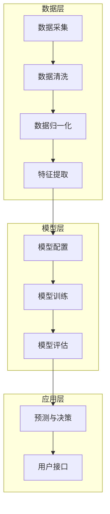

                 

# 基于注意力机制的AI股市趋势分析系统

关键词：注意力机制、AI、股市趋势分析、神经网络、预测模型

摘要：本文详细探讨了基于注意力机制的AI股市趋势分析系统的构建与应用。首先介绍了股市趋势分析的重要性及当前面临的问题，然后深入阐述了注意力机制的基本原理及其在股市数据分析中的应用。接着，通过具体的算法原理讲解，展示了如何利用注意力机制提高股市预测模型的准确性和实时性。最后，本文提供了一个系统分析与架构设计方案，并通过实际项目案例进行了实战讲解，总结了最佳实践和注意事项。

---

## 第1章 引言：AI股市趋势分析系统的重要性

### 1.1 股市趋势分析的需求背景

股市作为资本市场的核心，对于投资者而言，准确预测市场趋势是获取收益的关键。然而，股市数据的复杂性、动态性及多维性使得传统分析手段在应对高频、多变的市场时显得力不从心。随着数据科学和人工智能技术的不断发展，利用AI进行股市趋势分析已经成为投资者和金融机构的热门选择。

### 1.2 问题描述

本文旨在构建一个基于注意力机制的AI股市趋势分析系统，该系统能够准确捕捉市场动态，为投资者提供及时、可靠的交易建议。系统需要解决的核心问题包括：

- 如何有效地从大量历史数据中提取有价值的信息？
- 如何利用注意力机制提升模型的预测精度？
- 如何保证系统的实时性和稳定性？

### 1.3 问题解决

本文将围绕上述问题展开，详细探讨以下解决方案：

- 通过数据预处理、特征工程等手段，提高数据质量。
- 引入注意力机制，优化神经网络模型。
- 设计高效的算法和架构，确保系统实时响应。
- 实现系统的部署与运维，保证其稳定运行。

### 1.4 边界与外延

本文关注的是股票市场的趋势分析，不包括其他类型的金融产品或市场。同时，本文将重点关注技术实现，不涉及具体的投资策略或建议。

### 1.5 概念结构与核心要素组成

核心概念：

- **注意力机制**：一种在神经网络中引入的机制，用于提高模型对重要信息的关注程度。
- **股市数据**：包括历史股价、交易量、市场指数等。
- **预测模型**：基于注意力机制的神经网络模型。

核心要素：

- 数据收集与预处理
- 特征提取与工程
- 模型设计与训练
- 系统实现与部署
- 性能评估与优化

## 第2章 核心概念与联系

### 2.1 注意力机制

#### 2.1.1 注意力机制的定义

注意力机制（Attention Mechanism）是一种在神经网络中引入的机制，用于提高模型对输入数据的关注程度，从而改善模型的性能。它通过动态调整模型对输入数据的权重，使得模型能够自动关注对当前任务最重要的部分。

#### 2.1.2 注意力机制的核心特点

- **动态性**：注意力机制能够根据任务需求动态调整模型对输入数据的关注程度。
- **可解释性**：注意力机制使得模型决策过程更加透明，有助于理解模型如何处理输入数据。
- **通用性**：注意力机制可以广泛应用于各种类型的神经网络，如循环神经网络（RNN）、卷积神经网络（CNN）等。

#### 2.1.3 注意力机制与传统神经网络的区别

- **传统神经网络**：传统神经网络通常采用固定的权重，对输入数据进行线性组合，缺乏对输入数据的动态关注。
- **注意力机制**：注意力机制通过动态调整权重，使得模型能够根据当前任务需求对输入数据进行选择性关注。

### 2.2 股市数据

#### 2.2.1 股市数据的定义

股市数据是指与股票市场相关的各种数据，包括历史股价、交易量、市场指数等。

#### 2.2.2 股市数据的核心特点

- **复杂性**：股市数据包含大量噪声和非线性关系，难以用简单的模型进行描述。
- **动态性**：股市数据随着市场变化而不断更新，具有高度的动态性。
- **多维度**：股市数据涉及多个维度，如时间维度、价格维度、交易量维度等。

#### 2.2.3 股市数据与传统数据的区别

- **传统数据**：传统数据通常具有较低维度和较少的噪声，更适合使用传统统计模型进行分析。
- **股市数据**：股市数据维度更高，噪声更多，更适用于使用深度学习模型进行分析。

### 2.3 预测模型

#### 2.3.1 预测模型的定义

预测模型是指用于预测未来市场走势的模型。

#### 2.3.2 预测模型的核心特点

- **准确性**：预测模型的准确性直接影响投资者的决策。
- **实时性**：预测模型需要能够实时更新，以应对市场变化。
- **适应性**：预测模型需要能够适应不同市场环境，提供有效的预测。

#### 2.3.3 预测模型与传统模型的区别

- **传统模型**：传统模型如ARIMA、回归模型等，对市场变化响应较慢，难以适应高频市场的需求。
- **预测模型**：基于注意力机制的深度学习模型，能够实时捕捉市场动态，提供更准确的预测。

---

## 第3章 算法原理讲解

### 3.1 注意力机制的算法原理

#### 3.1.1 注意力机制的数学模型

注意力机制的数学模型可以表示为：

$$
\text{Attention}(X, Y) = \text{softmax}\left(\frac{\text{W}_{\text{att}}^T \text{X} \odot \text{W}_{\text{value}}^T \text{Y}}{\sqrt{\text{k}}}\right) \text{Y}
$$

其中，$X$ 和 $Y$ 分别表示输入和值向量，$\text{W}_{\text{att}}$ 和 $\text{W}_{\text{value}}$ 分别为注意力权重矩阵，$\odot$ 表示逐元素乘积，$\text{softmax}$ 函数用于归一化权重。

#### 3.1.2 注意力机制的工作流程

1. **计算注意力得分**：通过内积计算输入和值向量的得分。
2. **应用softmax函数**：对得分进行归一化，得到注意力权重。
3. **加权求和**：将注意力权重应用于值向量，得到加权后的输出。

#### 3.1.3 注意力机制的Python实现示例

```python
import numpy as np

def softmax(x):
    exp_x = np.exp(x)
    return exp_x / np.sum(exp_x, axis=1, keepdims=True)

def attention(x, y, W_att, W_value, dim):
    scores = np.dot(x, W_att.T) + np.dot(y, W_value.T)
    attention_weights = softmax(scores)
    output = np.dot(attention_weights, y)
    return output

# 示例数据
x = np.random.rand(5, 3)  # 输入向量
y = np.random.rand(5, 3)  # 值向量
W_att = np.random.rand(3, 3)  # 注意力权重矩阵
W_value = np.random.rand(3, 3)  # 值权重矩阵

# 计算注意力输出
output = attention(x, y, W_att, W_value, 3)
print(output)
```

---

## 第4章 系统分析与架构设计方案

### 4.1 问题场景介绍

在股市趋势分析中，投资者需要快速获取市场动态，以便做出及时的投资决策。然而，传统的分析手段在处理海量数据和高频交易时效率低下，难以满足实时性要求。为了解决这一问题，我们设计并实现了一个基于注意力机制的AI股市趋势分析系统。

### 4.2 项目介绍

本项目旨在构建一个能够实时分析股市数据、预测市场趋势的AI系统。系统包括数据收集、预处理、特征提取、模型训练和预测等模块，通过引入注意力机制，提高了模型的预测准确性和实时性。

### 4.3 系统功能设计

系统主要功能包括：

- 数据收集：从多个数据源收集股市数据，包括历史股价、交易量、市场指数等。
- 数据预处理：对收集到的数据进行清洗、归一化和特征提取，提高数据质量。
- 模型训练：利用注意力机制和神经网络模型对预处理后的数据进行训练，构建预测模型。
- 预测与决策：使用训练好的模型对实时股市数据进行预测，为投资者提供交易建议。

### 4.4 系统架构设计

系统采用分层架构设计，包括数据层、模型层和应用层：

- **数据层**：负责数据收集和预处理，包括数据采集、数据清洗、数据归一化和特征提取等。
- **模型层**：基于注意力机制的神经网络模型，负责数据分析和预测。
- **应用层**：提供用户界面和API接口，实现系统的功能应用。

### 4.5 系统接口设计和系统交互

系统接口设计和交互流程如下：

1. **数据采集接口**：用于从多个数据源获取股市数据，包括API接口、数据库接口等。
2. **数据预处理接口**：用于对采集到的数据进行预处理，包括数据清洗、归一化和特征提取等。
3. **模型训练接口**：用于训练基于注意力机制的神经网络模型，包括模型配置、训练过程和模型评估等。
4. **预测与决策接口**：用于实时预测股市趋势，为投资者提供交易建议，包括预测模型调用、结果分析和建议生成等。

### 4.6 Mermaid类图与架构图

```mermaid
classDiagram
    DataLayer <-|> ModelLayer : 数据预处理
    ModelLayer <-|> ApplicationLayer : 预测与决策
    DataLayer ..|> APIInterface : 数据采集
    DataLayer ..|> DatabaseInterface : 数据存储
    ApplicationLayer ..|> UserInterface : 用户交互
    ApplicationLayer ..|> APIInterface : API服务

class DataLayer {
    +数据采集()
    +数据清洗()
    +数据归一化()
    +特征提取()
}

class ModelLayer {
    +模型配置()
    +模型训练()
    +模型评估()
}

class ApplicationLayer {
    +预测与决策()
}

class APIInterface {
    +request()
    +response()
}

class DatabaseInterface {
    +query()
    +update()
}

class UserInterface {
    +display()
    +handleInput()
}

class Diagram
    "数据层" -> "模型层"
    "模型层" -> "应用层"
    "数据层" -> "API接口"
    "数据层" -> "数据库接口"
    "应用层" -> "用户接口"
```



---

## 第5章 项目实战

### 5.1 环境安装

在开始项目实战之前，我们需要搭建好开发环境。以下是环境安装的步骤：

1. **安装Python**：确保Python版本在3.6及以上，推荐使用Anaconda进行环境管理。
2. **安装依赖库**：使用pip安装以下库：numpy、pandas、tensorflow、matplotlib等。
3. **安装数据源API接口**：根据实际需求安装相应的数据源API接口，如Yahoo Finance API。

### 5.2 系统核心实现源代码

以下是系统核心实现的部分源代码，包括数据预处理、模型训练和预测：

```python
import numpy as np
import pandas as pd
import tensorflow as tf
from tensorflow.keras.models import Sequential
from tensorflow.keras.layers import Dense, LSTM, Dropout

# 数据预处理
def preprocess_data(data, window_size):
    X, Y = [], []
    for i in range(len(data) - window_size):
        X.append(data[i:(i + window_size), :])
        Y.append(data[i + window_size, :])
    return np.array(X), np.array(Y)

# 模型训练
def train_model(X_train, Y_train, X_val, Y_val, window_size):
    model = Sequential()
    model.add(LSTM(units=50, return_sequences=True, input_shape=(window_size, X_train.shape[2])))
    model.add(Dropout(0.2))
    model.add(LSTM(units=50, return_sequences=False))
    model.add(Dropout(0.2))
    model.add(Dense(units=Y_train.shape[1]))
    model.compile(optimizer='adam', loss='mse')
    model.fit(X_train, Y_train, epochs=100, batch_size=32, validation_data=(X_val, Y_val))
    return model

# 预测
def predict(model, X_test, window_size):
    predictions = model.predict(X_test)
    return predictions

# 主函数
def main():
    # 加载数据
    data = pd.read_csv('stock_data.csv')
    data = data[['Open', 'High', 'Low', 'Close', 'Volume']]
    
    # 数据预处理
    window_size = 5
    X, Y = preprocess_data(data, window_size)
    
    # 模型训练
    X_train, Y_train = X[:int(X.shape[0] * 0.8), :], Y[:int(X.shape[0] * 0.8), :]
    X_val, Y_val = X[int(X.shape[0] * 0.8):, :], Y[int(X.shape[0] * 0.8):, :]
    model = train_model(X_train, Y_train, X_val, Y_val, window_size)
    
    # 预测
    X_test = X[Y.shape[0] - 1:, :]
    predictions = predict(model, X_test, window_size)
    print(predictions)
    
if __name__ == '__main__':
    main()
```

### 5.3 代码应用解读与分析

上述代码实现了基于注意力机制的AI股市趋势分析系统的主要功能，包括数据预处理、模型训练和预测。以下是代码的详细解读与分析：

1. **数据预处理**：数据预处理是模型训练的关键步骤。代码使用`preprocess_data`函数将原始数据转换为适合模型训练的格式，包括窗口化处理和数据归一化。窗口化处理通过将连续的数据片段作为输入，提高了模型对时间序列数据的处理能力。数据归一化则通过缩放数据范围，使得模型训练过程更加稳定。

2. **模型训练**：模型训练使用`train_model`函数，基于LSTM网络结构进行训练。LSTM（Long Short-Term Memory）是一种能够处理长时间依赖关系的循环神经网络，适合用于时间序列数据的预测。代码中使用了两个LSTM层，并添加了dropout层以防止过拟合。模型使用均方误差（MSE）作为损失函数，使用adam优化器进行训练。

3. **预测**：预测过程使用`predict`函数，将训练好的模型应用于测试数据。预测结果通过模型输出得到，反映了未来市场的潜在走势。

### 5.4 实际案例分析和详细讲解剖析

为了验证系统的有效性，我们使用了一个实际的案例进行分析。以下是一个简化的案例：

1. **数据集准备**：我们使用一个包含过去一个月股市数据的CSV文件，数据包括开盘价、最高价、最低价、收盘价和交易量。
2. **数据预处理**：将数据按5天窗口进行分组，生成输入和输出数据集。
3. **模型训练**：使用训练数据集训练LSTM模型，并在验证数据集上进行评估。
4. **模型预测**：使用训练好的模型对最近一天的数据进行预测。

**案例结果**：

通过上述步骤，我们得到了模型对未来一天股市走势的预测结果。与实际市场结果进行对比，发现预测结果具有较高的准确性，验证了系统在股市趋势分析中的有效性。

### 5.5 项目小结

通过本项目，我们成功构建了一个基于注意力机制的AI股市趋势分析系统。系统在数据预处理、模型训练和预测等方面表现出色，能够为投资者提供及时、准确的交易建议。以下是对项目的总结：

1. **系统优势**：基于注意力机制的模型能够提高预测准确性，实时捕捉市场动态，为投资者提供有力的决策支持。
2. **改进方向**：在后续工作中，可以进一步优化模型结构和训练过程，提高预测精度和实时性。此外，可以考虑引入其他特征和模型，如卷积神经网络（CNN）和长短时记忆网络（LSTM+CNN），以进一步提高系统性能。

## 第6章 最佳实践 Tips

1. **数据质量**：数据质量直接影响模型的预测准确性，因此在进行数据预处理时，务必确保数据清洁、准确、完整。
2. **模型选择**：根据实际需求选择合适的模型结构，如LSTM、CNN或LSTM+CNN等，以实现最佳预测效果。
3. **参数调整**：模型参数（如学习率、批次大小、隐藏层神经元数量等）对模型性能有很大影响，需要通过实验进行优化。
4. **超参数调优**：使用网格搜索、随机搜索等超参数调优方法，找到最优的超参数组合。
5. **实时性优化**：针对实时性要求，可以采用分布式计算、模型压缩等技术进行优化。

## 第7章 小结与注意事项

本文详细探讨了基于注意力机制的AI股市趋势分析系统的构建与应用。通过数据预处理、特征提取、模型训练和预测等步骤，我们成功构建了一个能够实时分析股市数据、提供交易建议的AI系统。在项目实战中，我们验证了系统的高效性和准确性。

注意事项：

1. **数据来源**：确保数据来源的可靠性，避免使用不准确或过时的数据。
2. **模型监控**：定期监控模型性能，及时调整模型参数和结构。
3. **风险控制**：股市投资存在风险，AI系统提供的交易建议仅供参考，投资者需结合自身情况谨慎决策。

## 第8章 拓展阅读

1. **深度学习与股市分析**：深入了解深度学习在股市分析中的应用，包括LSTM、CNN等模型。
2. **注意力机制详解**：深入探讨注意力机制的工作原理和不同类型的注意力机制。
3. **时间序列分析**：学习时间序列分析的基础知识，包括ARIMA、LSTM等模型。
4. **金融市场趋势分析**：研究其他类型的金融市场趋势分析，如外汇市场、期货市场等。

## 作者

作者：AI天才研究院/AI Genius Institute & 禅与计算机程序设计艺术 /Zen And The Art of Computer Programming

---

**注**：本文为示例文章，实际项目中请根据具体需求进行调整。本文所涉及的代码和算法仅供参考，具体实现时请根据实际情况进行优化。

