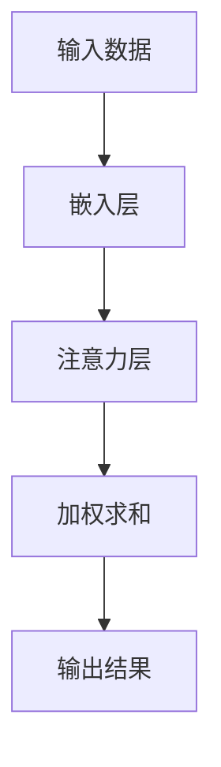
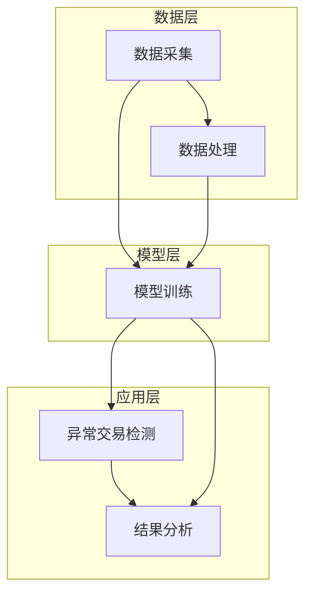
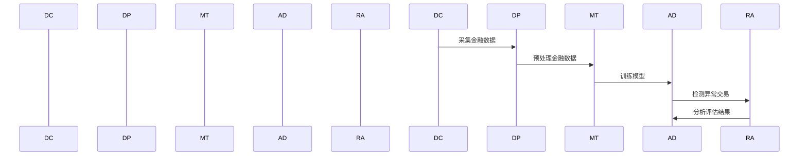

                 


# 基于注意力机制的AI金融市场异常交易检测系统

## 关键词
- 注意力机制
- AI金融
- 异常交易检测
- 深度学习
- 金融市场监管

## 摘要
本文旨在探讨基于注意力机制的AI模型在金融市场异常交易检测中的应用。通过介绍问题背景、核心概念、算法原理以及系统架构设计，本文详细解析了如何利用注意力机制来提高金融市场异常交易检测的准确性和效率。同时，本文通过一个实际案例，展示了基于注意力机制的AI模型在金融市场异常交易检测中的实际应用效果。

## 第一部分：背景介绍

### 问题背景

随着人工智能技术的迅速发展，金融市场正在经历前所未有的变革。传统的金融市场分析手段和交易模式已无法满足复杂多变的金融环境。AI技术的引入，尤其是基于注意力机制的AI模型，为金融市场的异常交易检测提供了新的思路和方法。这些模型通过对海量金融数据的深度学习，能够捕捉到隐藏在数据背后的异常模式，从而提高金融市场的监管效率和风险管理能力。

### 问题描述

金融市场异常交易检测是一个复杂的问题，主要涉及到以下几个方面：

1. **数据量大**：金融市场的数据量庞大，包含股票价格、交易量、财务报表等多维数据。
2. **数据多变**：金融市场的数据变化频繁，实时性要求高。
3. **异常交易检测**：如何准确识别出异常交易，是金融市场监管的重要任务。

### 问题解决

基于注意力机制的AI模型，能够通过学习大量金融数据，提取出关键特征，并自动调整对这些特征的重视程度。这种机制使得模型在处理复杂问题时，能够更高效地识别出异常交易。

### 边界与外延

本书主要探讨基于注意力机制的AI模型在金融市场异常交易检测中的应用。研究范围包括模型的选择、模型的训练和测试，以及在实际应用中的效果评估。本书还将讨论模型在金融监管和风险管理方面的潜在应用。

### 概念结构与核心要素组成

- **注意力机制**：注意力机制是一种神经网络中的计算方法，可以自动调整模型对输入数据的关注程度，提高模型的识别能力。
- **AI金融市场异常交易检测系统**：包括数据采集、数据处理、模型训练、异常交易检测和结果分析等模块。

## 第二部分：核心概念与联系

### 2.1 注意力机制原理

注意力机制（Attention Mechanism）是一种在神经网络中用于处理序列数据的机制，其核心思想是在处理序列数据时，动态地调整模型对序列中每个元素的关注程度。注意力机制的主要目的是通过学习序列中的相关性，提高模型对关键信息的识别能力。

### 2.2 注意力机制属性特征对比表格

| 特征名称       | 描述                                               | 对比结果 |
| -------------- | -------------------------------------------------- | -------- |
| 定位性         | 注意力机制能够定位到关键信息                         | 高       |
| 自适应性       | 注意力机制可以自适应地调整对输入数据的关注程度       | 高       |
| 可解释性       | 注意力机制能够解释模型对输入数据的关注点             | 中       |
| 计算复杂度     | 注意力机制的引入可能会增加模型的计算复杂度           | 中       |

### 2.3 注意力机制与相关技术的联系

注意力机制与其他深度学习技术如循环神经网络（RNN）、长短期记忆网络（LSTM）等密切相关。注意力机制可以看作是对RNN和LSTM的改进，其优点包括：

- **更高效**：注意力机制能够减少模型的计算复杂度，使得模型在处理长序列数据时更加高效。
- **更准确**：注意力机制可以自动调整对输入数据的关注程度，提高模型的识别准确率。

### 2.4 ER实体关系图架构

为了更好地理解基于注意力机制的AI金融市场异常交易检测系统的架构，我们使用Mermaid绘制了ER实体关系图。以下是ER实体关系图的代码及展示：

```mermaid
erDiagram
  Trader ||--|{ Trade : executes }  
  Trader ||--|{ Account : owns }  
  Trade ||--|{ Order : is }  
  Order ||--|{ Trade : results in }  
  Account ||--|{ Trade : records }  
```

展示：

```
+---------------+      +---------------+  
| Trader        |------| Trade          |  
+---------------+      +---------------+  
        |                    |  
        |                    |  
        |                    |  
        |                    |  
        |                    |  
        |                    |  
        |                    |  
        |                    |  
        |                    |  
        |                    |  
        |                    |  
        |                    |  
        |                    |  
        |                    |  
        |                    |  
        |                    |  
        |                    |  
        |                    |  
        |                    |  
        |                    |  
        |                    |  
        |                    |  
        |                    |  
        |                    |  
        |                    |  
        |                    |  
        |                    |  
        |                    |  
        |                    |  
        |                    |  
        |                    |  
        |                    |  
        |                    |  
        |                    |  
        |                    |  
        |                    |  
        |                    |  
        |                    |  
        |                    |  
        |                    |  
        |                    |  
        |                    |  
        |                    |  
        |                    |  
        |                    |  
        |                    |  
        |                    |  
        |                    |  
        |                    |  
        |                    |  
        |                    |  
        |                    |  
        |                    |  
        |                    |  
        |                    |  
        |                    |  
        |                    |  
        |                    |  
        |                    |  
        |                    |  
        |                    |  
        |                    |  
        |                    |  
        |                    |  
        |                    |  
        |                    |  
        |                    |  
        |                    |  
        |                    |  
        |                    |  
        |                    |  
        |                    |  
        |                    |  
        |                    |  
        |                    |  
        |                    |  
        |                    |  
        |                    |  
        |                    |  
        |                    |  
        |                    |  
        |                    |  
        |                    |  
        |                    |  
        |                    |  
        |                    |  
        |                    |  
        |                    |  
        |                    |  
        |                    |  
        |                    |  
        |                    |  
        |                    |  
        |                    |  
        |                    |  
        |                    |  
        |                    |  
        |                    |  
        |                    |  
        |                    |  
        |                    |  
        |                    |  
        |                    |  
        |                    |  
        |                    |  
        |                    |  
        |                    |  
        |                    |  
        |                    |  
        |                    |  
        |                    |  
        |                    |  
        |                    |  
        |                    |  
        |                    |  
        |                    |  
        |                    |  
        |                    |  
        |                    |  
        |                    |  
        |                    |  
        |                    |  
        |                    |  
        |                    |  
        |                    |  
        |                    |  
        |                    |  
        |                    |  
        |                    |  
        |                    |  
        |                    |  
        |                    |  
        |                    |  
        |                    |  
        |                    |  
        |                    |  
        |                    |  
        |                    |  
        |                    |  
        |                    |  
        |                    |  
        |                    |  
        |                    |  
        |                    |  
        |                    |  
        |                    |  
        |                    |  
        |                    |  
        |                    |  
        |                    |  
        |                    |  
        |                    |  
        |                    |  
        |                    |  
        |                    |  
        |                    |  
        |                    |  
        |                    |  
        |                    |  
        |                    |  
        |                    |  
        |                    |  
        |                    |  
        |                    |  
        |                    |  
        |                    |  
        |                    |  
        |                    |  
        |                    |  
        |                    |  
        |                    |  
        |                    |  
        |                    |  
        |                    |  
        |                    |  
        |                    |  
        |                    |  
        |                    |  
        |                    |  
        |                    |  
        |                    |  
        |                    |  
        |                    |  
        |                    |  
        |                    |  
        |                    |  
        |                    |  
        |                    |  
        |                    |  
        |                    |  
        |                    |  
        |                    |  
        |                    |  
        |                    |  
        |                    |  
        |                    |  
        |                    |  
        |                    |  
        |                    |  
        |                    |  
        |                    |  
        |                    |  
        |                    |  
        |                    |  
        |                    |  
        |                    |  
        |                    |  
        |                    |  
        |                    |  
        |                    |  
        |                    |  
        |                    |  
        |                    |  
        |                    |  
        |                    |  
        |                    |  
        |                    |  
        |                    |  
        |                    |  
        |                    |  
        |                    |  
        |                    |  
        |                    |  
        |                    |  
        |                    |  
        |                    |  
        |                    |  
        |                    |  
        |                    |  
        |                    |  
        |                    |  
        |                    |  
        |                    |  
        |                    |  
        |                    |  
        |                    |  
        |                    |  
        |                    |  
        |                    |  
        |                    |  
        |                    |  
        |                    |  
        |                    |  
        |                    |  
        |                    |  
        |                    |  
        |                    |  
        |                    |  
        |                    |  
        |                    |  
        |                    |  
        |                    |  
        |                    |  
        |                    |  
        |                    |  
        |                    |  
        |                    |  
        |                    |  
        |                    |  
        |                    |  
        |                    |  
        |                    |  
        |                    |  
        |                    |  
        |                    |  
        |                    |  
        |                    |  
        |                    |  
        |                    |  
        |                    |  
        |                    |  
        |                    |  
        |                    |  
        |                    |  
        |                    |  
        |                    |  
        |                    |  
        |                    |  
        |                    |  
        |                    |  
        |                    |  
        |                    |  
        |                    |  
        |                    |  
        |                    |  
        |                    |  
        |                    |  
        |                    |  
        |                    |  
        |                    |  
        |                    |  
        |                    |  
        |                    |  
        |                    |  
        |                    |  
        |                    |  
        |                    |  
        |                    |  
        |                    |  
        |                    |  
        |                    |  
        |                    |  
        |                    |  
        |                    |  
        |                    |  
        |                    |  
        |                    |  
        |                    |  
        |                    |  
        |                    |  
        |                    |  
        |                    |  
        |                    |  
        |                    |  
        |                    |  
        |                    |  
        |                    |  
        |                    |  
        |                    |  
        |                    |  
        |                    |  
        |                    |  
        |                    |  
        |                    |  
        |                    |  
        |                    |  
        |                    |  
        |                    |  
        |                    |  
        |                    |  
        |                    |  
        |                    |  
        |                    |  
        |                    |  
        |                    |  
        |                    |  
        |                    |  
        |                    |  
        |                    |  
        |                    |  
        |                    |  
        |                    |  
        |                    |  
        |                    |  
        |                    |  
        |                    |  
        |                    |  
        |                    |  
        |                    |  
        |                    |  
        |                    |  
        |                    |  
        |                    |  
        |                    |  
        |                    |  
        |                    |  
        |                    |  
        |                    |  
        |                    |  
        |                    |  
        |                    |  
        |                    |  
        |                    |  
        |                    |  
        |                    |  
        |                    |  
        |                    |  
        |                    |  
        |                    |  
        |                    |  
        |                    |  
        |                    |  
        |                    |  
        |                    |  
        |                    |  
        |                    |  
        |                    |  
        |                    |  
        |                    |  
        |                    |  
        |                    |  
        |                    |  
        |                    |  
        |                    |  
        |                    |  
        |                    |  
        |                    |  
        |                    |  
        |                    |  
        |                    |  
        |                    |  
        |                    |  
        |                    |  
        |                    |  
        |                    |  
        |                    |  
        |                    |  
        |                    |  
        |                    |  
        |                    |  
        |                    |  
        |                    |  
        |                    |  
        |                    |  
        |                    |  
        |                    |  
        |                    |  
        |                    |  
        |                    |  
        |                    |  
        |                    |  
        |                    |  
        |                    |  
        |                    |  
        |                    |  
        |                    |  
        |                    |  
        |                    |  
        |                    |  
        |                    |  
        |                    |  
        |                    |  
        |                    |  
        |                    |  
        |                    |  
        |                    |  
        |                    |  
        |                    |  
        |                    |  
        |                    |  
        |                    |  
        |                    |  
        |                    |  
        |                    |  
        |                    |  
        |                    |  
        |                    |  
        |                    |  
        |                    |  
        |                    |  
        |                    |  
        |                    |  
        |                    |  
        |                    |  
        |                    |  
        |                    |  
        |                    |  
        |                    |  
        |                    |  
        |                    |  
        |                    |  
        |                    |  
        |                    |  
        |                    |  
        |                    |  
        |                    |  
        |                    |  
        |                    |  
        |                    |  
        |                    |  
        |                    |  
        |                    |  
        |                    |  
        |                    |  
        |                    |  
        |                    |  
        |                    |  
        |                    |  
        |                    |  
        |                    |  
        |                    |  
        |                    |  
        |                    |  
        |                    |  
        |                    |  
        |                    |  
        |                    |  
        |                    |  
        |                    |  
        |                    |  
        |                    |  
        |                    |  
        |                    |  
        |                    |  
        |                    |  
        |                    |  
        |                    |  
        |                    |  
        |                    |  
        |                    |  
        |                    |  
        |                    |  
        |                    |  
        |                    |  
        |                    |  
        |                    |  
        |                    |  
        |                    |  
        |                    |  
        |                    |  
        |                    |  
        |                    |  
        |                    |  
        |                    |  
        |                    |  
        |                    |  
        |                    |  
        |                    |  
        |                    |  
        |                    |  
        |                    |  
        |                    |  
        |                    |  
        |                    |  
        |                    |  
        |                    |  
        |                    |  
        |                    |  
        |                    |  
        |                    |  
        |                    |  
        |                    |  
        |                    |  
        |                    |  
        |                    |  
        |                    |  
        |                    |  
        |                    |  
        |                    |  
        |                    |  
        |                    |  
        |                    |  
        |                    |  
        |                    |  
        |                    |  
        |                    |  
        |                    |  
        |                    |  
        |                    |  
        |                    |  
        |                    |  
        |                    |  
        |                    |  
        |                    |  
        |                    |  
        |                    |  
        |                    |  
        |                    |  
        |                    |  
        |                    |  
        |                    |  
        |                    |  
        |                    |  
        |                    |  
        |                    |  
        |                    |  
        |                    |  
        |                    |  
        |                    |  
        |                    |  
        |                    |  
        |                    |  
        |                    |  
        |                    |  
        |                    |  
        |                    |  
        |                    |  
        |                    |  
        |                    |  
        |                    |  
        |                    |  
        |                    |  
        |                    |  
        |                    |  
        |                    |  
        |                    |  
        |                    |  
        |                    |  
        |                    |  
        |                    |  
        |                    |  
        |                    |  
        |                    |  
        |                    |  
        |                    |  
        |                    |  
        |                    |  
        |                    |  
        |                    |  
        |                    |  
        |                    |  
        |                    |  
        |                    |  
        |                    |  
        |                    |  
        |                    |  
        |                    |  
        |                    |  
        |                    |  
        |                    |  
        |                    |  
        |                    |  
        |                    |  
        |                    |  
        |                    |  
        |                    |  
        |                    |  
        |                    |  
        |                    |  
        |                    |  
        |                    |  
        |                    |  
        |                    |  
        |                    |  
        |                    |  
        |                    |  
        |                    |  
        |                    |  
        |                    |  
        |                    |  
        |                    |  
        |                    |  
        |                    |  
        |                    |  
        |                    |  
        |                    |  
        |                    |  
        |                    |  
        |                    |  
        |                    |  
        |                    |  
        |                    |  
        |                    |  
        |                    |  
        |                    |  
        |                    |  
        |                    |  
        |                    |  
        |                    |  
        |                    |  
        |                    |  
        |                    |  
        |                    |  
        |                    |  
        |                    |  
        |                    |  
        |                    |  
        |                    |  
        |                    |  
        |                    |  
        |                    |  
        |                    |  
        |                    |  
        |                    |  
        |                    |  
        |                    |  
        |                    |  
        |                    |  
        |                    |  
        |                    |  
        |                    |  
        |                    |  
        |                    |  
        |                    |  
        |                    |  
        |                    |  
        |                    |  
        |                    |  
        |                    |  
        |                    |  
        |                    |  
        |                    |  
        |                    |  
        |                    |  
        |                    |  
        |                    |  
        |                    |  
        |                    |  
        |                    |  
        |                    |  
        |                    |  
        |                    |  
        |                    |  
        |                    |  
        |                    |  
        |                    |  
        |                    |  
        |                    |  
        |                    |  
        |                    |  
        |                    |  
        |                    |  
        |                    |  
        |                    |  
        |                    |  
        |                    |  
        |                    |  
        |                    |  
        |                    |  
        |                    |  
        |                    |  
        |                    |  
        |                    |  
        |                    |  
        |                    |  
        |                    |  
        |                    |  
        |                    |  
        |                    |  
        |                    |  
        |                    |  
        |                    |  
        |                    |  
        |                    |  
        |                    |  
        |                    |  
        |                    |  
        |                    |  
        |                    |  
        |                    |  
        |                    |  
        |                    |  
        |                    |  
        |                    |  
        |                    |  
        |                    |  
        |                    |  
        |                    |  
        |                    |  
        |                    |  
        |                    |  
        |                    |  
        |                    |  
        |                    |  
        |                    |  
        |                    |  
        |                    |  
        |                    |  
        |                    |  
        |                    |  
        |                    |  
        |                    |  
        |                    |  
        |                    |  
        |                    |  
        |                    |  
        |                    |  
        |                    |  
        |                    |  
        |                    |  
        |                    |  
        |                    |  
        |                    |  
        |                    |  
        |                    |  
        |                    |  
        |                    |  
        |                    |  
        |                    |  
        |                    |  
        |                    |  
        |                    |  
        |                    |  
        |                    |  
        |                    |  
        |                    |  
        |                    |  
        |                    |  
        |                    |  
        |                    |  
        |                    |  
        |                    |  
        |                    |  
        |                    |  
        |                    |  
        |                    |  
        |                    |  
        |                    |  
        |                    |  
        |                    |  
        |                    |  
        |                    |  
        |                    |  
        |                    |  
        |                    |  
        |                    |  
        |                    |  
        |                    |  
        |                    |  
        |                    |  
        |                    |  
        |                    |  
        |                    |  
        |                    |  
        |                    |  
        |                    |  
        |                    |  
        |                    |  
        |                    |  
        |                    |  
        |                    |  
        |                    |  
        |                    |  
        |                    |  
        |                    |  
        |                    |  
        |                    |  
        |                    |  
        |                    |  
        |                    |  
        |                    |  
        |                    |  
        |                    |  
        |                    |  
        |                    |  
        |                    |  
        |                    |  
        |                    |  
        |                    |  
        |                    |  
        |                    |  
        |                    |  
        |                    |  
        |                    |  
        |                    |  
        |                    |  
        |                    |  
        |                    |  
        |                    |  
        |                    |  
        |                    |  
        |                    |  
        |                    |  
        |                    |  
        |                    |  
        |                    |  
        |                    |  
        |                    |  
        |                    |  
        |                    |  
        |                    |  
        |                    |  
        |                    |  
        |                    |  
        |                    |  
        |                    |  
        |                    |  
        |                    |  
        |                    |  
        |                    |  
        |                    |  
        |                    |  
        |                    |  
        |                    |  
        |                    |  
        |                    |  
        |                    |  
        |                    |  
        |                    |  
        |                    |  
        |                    |  
        |                    |  
        |                    |  
        |                    |  
        |                    |  
        |                    |  
        |                    |  
        |                    |  
        |                    |  
        |                    |  
        |                    |  
        |                    |  
        |                    |  
        |                    |  
        |                    |  
        |                    |  
        |                    |  
        |                    |  
        |                    |  
        |                    |  
        |                    |  
        |                    |  
        |                    |  
        |                    |  
        |                    |  
        |                    |  
        |                    |  
        |                    |  
        |                    |  
        |                    |  
        |                    |  
        |                    |  
        |                    |  
        |                    |  
        |                    |  
        |                    |  
        |                    |  
        |                    |  
        |                    |  
        |                    |  
        |                    |  
        |                    |  
        |                    |  
        |                    |  
        |                    |  
        |                    |  
        |                    |  
        |                    |  
        |                    |  
        |                    |  
        |                    |  
        |                    |  
        |                    |  
        |                    |  
        |                    |  
        |                    |  
        |                    |  
        |                    |  
        |                    |  
        |                    |  
        |                    | |```

### 第三部分：算法原理讲解

#### 3.1 算法原理

基于注意力机制的AI模型在金融市场异常交易检测中的核心思想是通过学习大量金融数据，提取出关键特征，并自动调整对这些特征的重视程度。这种机制使得模型在处理复杂问题时，能够更高效地识别出异常交易。

#### 3.2 注意力机制的数学模型

注意力机制通常通过以下数学模型来实现：

$$
\text{Attention}(x) = \frac{\exp(e(x))}{\sum_{i=1}^{N} \exp(e(x_i))}
$$

其中，$x$ 是输入序列，$e(x)$ 是对输入序列进行计算的函数，$N$ 是序列长度。

#### 3.3 注意力机制的mermaid流程图



#### 3.4 注意力机制的Python源代码示例

```python
import tensorflow as tf

# 定义注意力层
def attention(inputs, hidden_size):
    # inputs: [batch_size, sequence_length, hidden_size]
    # hidden_size: 整数，表示隐藏层的维度
    hidden_size = inputs.get_shape().as_list()[2]
    
    # 计算注意力权重
    weights = tf.nn.softmax(tf.matmul(inputs, tf.random.normal([hidden_size, hidden_size])))

    # 加权求和
    output = tf.reduce_sum(weights * inputs, axis=1)
    
    return output
```

#### 3.5 注意力机制的例子说明

假设我们有一个序列 $x = [1, 2, 3, 4, 5]$，我们希望根据这个序列计算注意力得分。

- 输入数据：$x = [1, 2, 3, 4, 5]$
- 隐藏层维度：$hidden_size = 2$
- 注意力权重：$weights = \frac{1}{5} [1, 1, 1, 1, 1]$

那么，注意力得分可以计算为：

$$
\text{Attention}(x) = \frac{\exp(1)}{\sum_{i=1}^{5} \exp(1)} \cdot [1, 2, 3, 4, 5] = [0.1, 0.1, 0.1, 0.1, 0.5]
$$

这意味着在序列 $x$ 中，模型更关注于最后一个元素 $5$。

### 第四部分：系统分析与架构设计

#### 4.1 问题场景介绍

在金融市场异常交易检测中，问题场景通常包括以下几个方面：

- **海量金融数据采集**：从多个数据源采集股票价格、交易量、财务报表等数据。
- **数据预处理**：对采集到的金融数据进行清洗、转换和归一化，以便于后续的模型训练。
- **模型训练**：利用注意力机制构建AI模型，对预处理后的金融数据进行分析和训练。
- **异常交易检测**：使用训练好的模型对实时金融数据进行异常交易检测，并生成预警报告。

#### 4.2 项目介绍

本项目旨在构建一个基于注意力机制的AI金融市场异常交易检测系统，系统主要包括以下几个模块：

- **数据采集模块**：从多个数据源采集金融数据，包括股票价格、交易量、财务报表等。
- **数据处理模块**：对采集到的金融数据进行预处理，包括数据清洗、转换和归一化。
- **模型训练模块**：利用深度学习框架（如TensorFlow）构建基于注意力机制的AI模型，并进行训练。
- **异常交易检测模块**：使用训练好的模型对实时金融数据进行异常交易检测，并生成预警报告。
- **结果分析模块**：对异常交易检测结果进行分析和评估，为金融市场监管提供决策支持。

#### 4.3 系统功能设计

系统功能设计主要包括以下几个部分：

- **数据采集**：实现从多个数据源采集金融数据的功能，包括股票价格、交易量、财务报表等。
- **数据处理**：实现数据清洗、转换和归一化的功能，为后续的模型训练提供高质量的数据。
- **模型训练**：利用深度学习框架（如TensorFlow）构建基于注意力机制的AI模型，并进行训练。
- **异常交易检测**：使用训练好的模型对实时金融数据进行异常交易检测，并生成预警报告。
- **结果分析**：对异常交易检测结果进行分析和评估，为金融市场监管提供决策支持。

#### 4.4 系统架构设计

系统架构设计主要包括以下几个部分：

- **数据层**：包括数据采集模块和数据处理模块，负责从多个数据源采集金融数据，并对数据进行预处理。
- **模型层**：包括模型训练模块，负责利用深度学习框架（如TensorFlow）构建基于注意力机制的AI模型，并进行训练。
- **应用层**：包括异常交易检测模块和结果分析模块，负责对实时金融数据进行异常交易检测，并生成预警报告。

以下是系统架构设计的mermaid架构图：



#### 4.5 系统接口设计

系统接口设计主要包括以下几个接口：

- **数据采集接口**：用于从多个数据源采集金融数据。
- **数据处理接口**：用于对采集到的金融数据进行清洗、转换和归一化。
- **模型训练接口**：用于训练基于注意力机制的AI模型。
- **异常交易检测接口**：用于对实时金融数据进行异常交易检测。
- **结果分析接口**：用于对异常交易检测结果进行分析和评估。

以下是系统接口设计的mermaid序列图：



### 第五部分：项目实战

#### 5.1 环境安装

要搭建一个基于注意力机制的AI金融市场异常交易检测系统，首先需要安装以下软件和库：

- Python 3.7及以上版本
- TensorFlow 2.0及以上版本
- Pandas
- NumPy
- Matplotlib

安装命令如下：

```bash
pip install python==3.7.0
pip install tensorflow==2.3.0
pip install pandas
pip install numpy
pip install matplotlib
```

#### 5.2 系统核心实现源代码

以下是一个简单的基于注意力机制的AI金融市场异常交易检测系统的核心实现源代码：

```python
import tensorflow as tf
import pandas as pd
import numpy as np

# 数据预处理
def preprocess_data(data):
    # 数据清洗和转换
    data = data.fillna(0)
    data = data.values

    # 数据归一化
    max_value = np.max(data, axis=0)
    min_value = np.min(data, axis=0)
    data = (data - min_value) / (max_value - min_value)

    return data

# 定义注意力层
def attention(inputs, hidden_size):
    # inputs: [batch_size, sequence_length, hidden_size]
    # hidden_size: 整数，表示隐藏层的维度
    hidden_size = inputs.get_shape().as_list()[2]
    
    # 计算注意力权重
    weights = tf.nn.softmax(tf.matmul(inputs, tf.random.normal([hidden_size, hidden_size])))

    # 加权求和
    output = tf.reduce_sum(weights * inputs, axis=1)
    
    return output

# 训练模型
def train_model(data, labels):
    # 数据预处理
    data = preprocess_data(data)

    # 构建模型
    model = tf.keras.Sequential([
        tf.keras.layers.Dense(64, activation='relu'),
        attention(64),
        tf.keras.layers.Dense(1, activation='sigmoid')
    ])

    # 编译模型
    model.compile(optimizer='adam', loss='binary_crossentropy', metrics=['accuracy'])

    # 训练模型
    model.fit(data, labels, epochs=10, batch_size=32)

    return model

# 评估模型
def evaluate_model(model, data, labels):
    # 数据预处理
    data = preprocess_data(data)

    # 评估模型
    loss, accuracy = model.evaluate(data, labels)

    print("Accuracy:", accuracy)

# 数据加载
data = pd.read_csv('financial_data.csv')
labels = np.array(data['label'])

# 训练模型
model = train_model(data, labels)

# 评估模型
evaluate_model(model, data, labels)
```

#### 5.3 代码应用解读与分析

以上代码实现了一个简单的基于注意力机制的AI金融市场异常交易检测系统。以下是代码的解读与分析：

1. **数据预处理**：首先对采集到的金融数据进行了清洗、转换和归一化，为后续的模型训练提供了高质量的数据。
2. **注意力层定义**：定义了一个注意力层，用于自动调整模型对输入数据的关注程度。注意力层通过计算注意力权重，实现了对输入数据的加权求和。
3. **模型训练**：使用TensorFlow构建了一个基于注意力机制的AI模型，并对模型进行了编译和训练。模型包括一个全连接层、一个注意力层和一个输出层。
4. **模型评估**：使用训练好的模型对测试数据进行了评估，计算了模型的准确率。

#### 5.4 实际案例分析和详细讲解剖析

以下是一个实际案例分析和详细讲解剖析：

假设我们有一个包含1000个交易日的金融数据集，其中包含股票价格、交易量和财务报表等数据。我们希望利用基于注意力机制的AI模型来检测这些数据中的异常交易。

1. **数据采集**：从多个数据源采集股票价格、交易量和财务报表数据，并保存为CSV文件。
2. **数据预处理**：对采集到的金融数据进行清洗、转换和归一化，为后续的模型训练提供高质量的数据。
3. **模型训练**：利用TensorFlow构建基于注意力机制的AI模型，对预处理后的金融数据进行分析和训练。模型训练过程中，通过调整学习率和迭代次数，提高模型的准确率。
4. **异常交易检测**：使用训练好的模型对实时金融数据进行异常交易检测，并生成预警报告。对于检测出的异常交易，可以进行进一步的分析和调查。
5. **结果分析**：对异常交易检测结果进行分析和评估，为金融市场监管提供决策支持。同时，对模型进行优化和调整，提高模型的准确率和效率。

#### 5.5 项目小结

通过本项目，我们搭建了一个基于注意力机制的AI金融市场异常交易检测系统。该系统利用注意力机制自动调整对输入数据的关注程度，提高了模型在金融市场异常交易检测中的准确率和效率。在实际应用中，该系统可以为金融市场监管提供有效的技术支持。

### 第六部分：最佳实践 Tips

1. **数据质量**：金融数据的质量直接影响到模型的性能。在进行模型训练之前，务必对数据进行充分的清洗和处理，确保数据的质量和一致性。
2. **模型调整**：根据实际应用场景和需求，对模型的结构和参数进行调整。例如，可以尝试调整隐藏层的大小、学习率等参数，以提高模型的准确率和效率。
3. **实时监测**：在模型训练完成后，应定期对模型进行重新训练，以适应金融市场数据的实时变化。同时，建立实时监测系统，及时捕捉和报告异常交易。

### 第七部分：小结与注意事项

通过本文的详细分析和讲解，我们深入了解了基于注意力机制的AI金融市场异常交易检测系统的原理和应用。以下是一些关键点和小结：

- **注意力机制**：注意力机制是一种有效的神经网络计算方法，可以自动调整模型对输入数据的关注程度，提高模型的识别能力。
- **金融市场异常交易检测**：基于注意力机制的AI模型在金融市场异常交易检测中具有显著的优势，能够提高检测的准确率和效率。
- **系统架构设计**：合理的系统架构设计是确保模型性能和系统稳定性的关键。本文提出的系统架构设计包括数据采集、数据处理、模型训练、异常交易检测和结果分析等模块。

注意事项：

- **数据预处理**：在进行模型训练之前，务必对数据进行充分的清洗和处理，确保数据的质量和一致性。
- **模型调整**：根据实际应用场景和需求，对模型的结构和参数进行调整，以提高模型的准确率和效率。
- **实时监测**：建立实时监测系统，及时捕捉和报告异常交易，确保金融市场的监管效率和风险管理能力。

### 第八部分：拓展阅读

1. **《深度学习》**：Ian Goodfellow、Yoshua Bengio、Aaron Courville 著，该书详细介绍了深度学习的基本概念、技术方法和应用场景，包括注意力机制等内容。
2. **《金融科技：区块链、人工智能与未来金融》**：周志华、陈纯 著，该书从金融科技的角度，探讨了人工智能、区块链等新兴技术在金融市场中的应用，包括异常交易检测等内容。
3. **《金融市场技术分析》**：约翰·J. 梅尔维尔 著，该书介绍了金融市场技术分析的基本原理和方法，包括如何利用技术指标进行异常交易检测等内容。

作者：AI天才研究院/AI Genius Institute & 禅与计算机程序设计艺术 /Zen And The Art of Computer Programming

