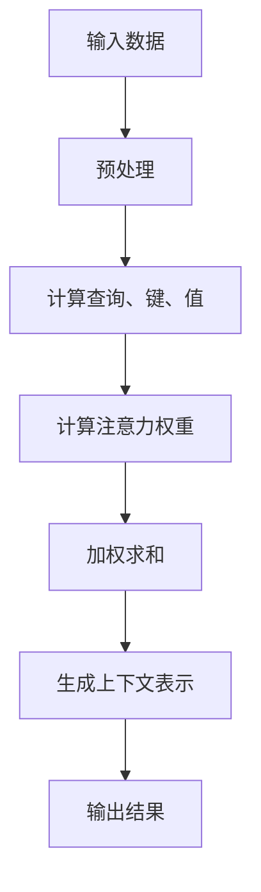

                 

# 基于注意力机制的AI金融市场高频交易策略系统

## 关键词

AI，金融市场，高频交易，注意力机制，策略系统，算法，数学模型，架构设计，项目实战，最佳实践

## 摘要

本文深入探讨基于注意力机制的AI金融市场高频交易策略系统的设计、实现与应用。首先，介绍金融市场高频交易的基本概念与挑战，引出注意力机制及其在金融领域的应用。接着，详细讲解注意力机制的原理、算法实现及其数学模型，并通过Python源代码进行具体阐述。随后，分析高频交易策略系统的架构设计，包括功能设计、系统架构与接口设计，并通过Mermaid流程图和序列图展示系统交互。然后，通过项目实战展示注意力机制在高频交易策略系统中的实际应用，包括环境安装、核心实现、代码分析及案例讲解。最后，总结高频交易策略系统的最佳实践、注意事项，并提供相关拓展阅读资源。

## 设计思路

为了确保《基于注意力机制的AI金融市场高频交易策略系统》这本书的目录大纲逻辑清晰且内容完整，我们需要按照以下步骤进行：

### 第一部分：引言

- **第1章：问题背景与概述**：介绍金融市场高频交易的定义、现状与挑战，以及注意力机制在金融领域的应用潜力。

### 第二部分：核心概念与联系

- **第2章：注意力机制原理**：讲解注意力机制的定义、特点、原理，以及其在金融市场高频交易策略系统中的应用。

### 第三部分：算法原理讲解

- **第3章：注意力机制算法实现**：使用Mermaid绘制注意力机制的算法流程图，并使用Python源代码详细阐述注意力机制的实现过程。

### 第四部分：系统分析与架构设计

- **第4章：高频交易策略系统架构**：介绍高频交易策略系统的架构，包括系统功能设计、架构设计和系统接口设计。

### 第五部分：项目实战

- **第5章：高频交易策略项目实践**：提供具体的实践案例，讲解环境安装、系统核心实现、代码分析等内容。

### 第六部分：最佳实践与拓展

- **第6章：高频交易策略最佳实践**：总结高频交易策略系统的最佳实践、注意事项，并提供相关的拓展阅读资源。

### 目录大纲设计

#### 第一部分：引言

- **第1章：问题背景与概述**
  - 1.1 问题背景
    - 1.1.1 金融市场高频交易的定义
    - 1.1.2 高频交易的现状与挑战
    - 1.1.3 注意力机制在金融领域的应用潜力
  - 1.2 问题描述
    - 1.2.1 高频交易中的信息处理需求
    - 1.2.2 注意力机制如何提高交易效率
  - 1.3 问题解决
    - 1.3.1 注意力机制的基本原理
    - 1.3.2 注意力机制在交易策略中的应用
  - 1.4 边界与外延
    - 1.4.1 高频交易中的其他技术手段
    - 1.4.2 注意力机制的应用限制
  - 1.5 概念结构与核心要素组成
    - 1.5.1 注意力机制的组成部分
    - 1.5.2 高频交易策略系统的关键要素

#### 第二部分：核心概念与联系

- **第2章：注意力机制原理**
  - 2.1 定义与特点
    - 2.1.1 注意力机制的定义
    - 2.1.2 注意力机制的特点
  - 2.2 原理与数学模型
    - 2.2.1 注意力机制的数学模型
    - 2.2.2 注意力机制的计算过程
  - 2.3 属性特征对比表格
    - 2.3.1 注意力机制与其他相关技术的对比
  - 2.4 ER实体关系图
    - 2.4.1 注意力机制的实体关系

#### 第三部分：算法原理讲解

- **第3章：注意力机制算法实现**
  - 3.1 Mermaid算法流程图
    - 3.1.1 注意力机制的算法流程
  - 3.2 Python源代码讲解
    - 3.2.1 注意力机制的实现
    - 3.2.2 注意力机制的优化

#### 第四部分：系统分析与架构设计

- **第4章：高频交易策略系统架构**
  - 4.1 问题场景介绍
    - 4.1.1 高频交易策略的需求分析
  - 4.2 系统功能设计
    - 4.2.1 系统功能模块
    - 4.2.2 功能模块之间的关系
  - 4.3 系统架构设计
    - 4.3.1 系统的总体架构
    - 4.3.2 系统各模块的交互关系
  - 4.4 系统接口设计
    - 4.4.1 接口定义
    - 4.4.2 接口交互流程
  - 4.5 系统交互序列图
    - 4.5.1 系统的交互过程

#### 第五部分：项目实战

- **第5章：高频交易策略项目实践**
  - 5.1 环境安装
    - 5.1.1 环境配置
    - 5.1.2 工具与库的安装
  - 5.2 系统核心实现
    - 5.2.1 注意力机制实现
    - 5.2.2 交易策略实现
  - 5.3 代码应用解读与分析
    - 5.3.1 代码结构解析
    - 5.3.2 关键代码解读
  - 5.4 实际案例分析与讲解
    - 5.4.1 案例背景
    - 5.4.2 案例实施过程
    - 5.4.3 案例结果与评估

#### 第六部分：最佳实践与拓展

- **第6章：高频交易策略最佳实践**
  - 6.1 最佳实践
    - 6.1.1 策略优化技巧
    - 6.1.2 风险管理策略
  - 6.2 小结
    - 6.2.1 高频交易策略的总结
    - 6.2.2 注意力机制的应用要点
  - 6.3 注意事项
    - 6.3.1 高频交易策略的实施要点
    - 6.3.2 风险控制措施
  - 6.4 拓展阅读
    - 6.4.1 相关领域书籍推荐
    - 6.4.2 研究论文与最新进展

## 第一部分：引言

### 第1章：问题背景与概述

#### 1.1 问题背景

金融市场高频交易是指以极快的速度进行大量交易的交易策略，其核心在于捕捉瞬息万变的市场信息，并在毫秒级别的时间内做出交易决策。随着金融市场的不断发展和技术的进步，高频交易已经成为现代金融市场的重要组成部分。

然而，高频交易也面临着诸多挑战。首先，高频交易需要处理海量数据，包括股票价格、交易量、交易时间等。这些数据不仅量大，而且变化速度快，对数据处理和实时分析的要求极高。其次，高频交易策略需要具备高鲁棒性和抗干扰能力，以应对金融市场中的突发事件和极端情况。此外，高频交易还面临着监管压力和合规性问题，需要遵循相关法律法规和市场规则。

注意力机制作为深度学习中的一个重要概念，旨在模拟人类注意力的选择机制，从大量信息中提取关键特征，提高信息处理的效率和准确性。近年来，注意力机制在自然语言处理、计算机视觉等领域取得了显著成果。随着金融市场高频交易对信息处理需求的提高，注意力机制逐渐成为高频交易策略研究的一个重要方向。

#### 1.1.1 金融市场高频交易的定义

金融市场高频交易（High-Frequency Trading，简称HFT）是一种利用先进的算法和技术在毫秒级别的时间内进行大量交易的交易策略。HFT的核心在于捕捉瞬息万变的市场信息，通过快速的数据处理和分析，在毫秒级别的时间内做出交易决策，从而获取微小的价格差异利润。

具体来说，HFT的交易过程包括以下步骤：

1. **数据收集**：高频交易系统通过高频数据接口实时获取股票价格、交易量、交易时间等市场信息。

2. **数据处理**：高频交易系统对收集到的市场数据进行快速处理和分析，提取出关键特征和趋势。

3. **交易决策**：基于数据处理结果，高频交易系统在毫秒级别的时间内做出交易决策，包括买入、卖出和取消订单等操作。

4. **执行交易**：高频交易系统通过高频交易接口将交易决策转化为具体的交易操作，并在交易市场中执行。

#### 1.1.2 高频交易的现状与挑战

高频交易自20世纪初兴起以来，随着计算机技术和算法的进步，逐渐成为金融市场中的重要力量。根据统计，全球金融市场的高频交易市场份额已经超过了传统交易策略，成为市场波动的重要影响因素。

然而，高频交易也面临着诸多挑战：

1. **数据量巨大**：高频交易需要处理海量数据，包括股票价格、交易量、交易时间等。这些数据不仅量大，而且变化速度快，对数据处理和实时分析的要求极高。

2. **信息处理的实时性**：高频交易策略需要在毫秒级别的时间内做出交易决策，对系统的实时性和响应速度有极高的要求。任何延迟都可能导致交易机会的丧失。

3. **交易策略的鲁棒性**：高频交易策略需要具备高鲁棒性和抗干扰能力，以应对金融市场中的突发事件和极端情况。

4. **监管压力**：高频交易策略可能会引发市场操纵和交易异常等问题，受到监管机构的密切关注和监管。

#### 1.1.3 注意力机制在金融领域的应用潜力

注意力机制作为深度学习中的一个重要概念，具有从海量信息中提取关键特征、提高信息处理效率和准确性的能力。将注意力机制应用于金融领域，有望解决高频交易中的信息处理需求、提高交易效率等问题。

具体来说，注意力机制在金融领域的应用潜力包括：

1. **提高信息处理效率**：注意力机制可以帮助高频交易系统从海量市场信息中提取关键特征，降低数据处理的复杂度，提高信息处理的效率和准确性。

2. **实时交易决策**：注意力机制可以帮助高频交易系统在毫秒级别的时间内识别市场机会，做出快速交易决策，提高交易成功率。

3. **增强交易策略鲁棒性**：注意力机制可以帮助高频交易系统应对金融市场中的突发事件和极端情况，提高交易策略的鲁棒性。

4. **降低交易风险**：注意力机制可以帮助高频交易系统识别市场风险，制定合理的风险管理策略，降低交易风险。

总之，注意力机制在金融领域具有广阔的应用前景，为高频交易策略的优化和提升提供了新的思路和方法。

#### 1.2 问题描述

高频交易中的信息处理需求主要集中在以下几个方面：

1. **数据处理速度**：高频交易需要处理海量数据，包括股票价格、交易量、交易时间等，对数据处理速度有极高要求。

2. **实时性**：高频交易策略需要在毫秒级别的时间内做出交易决策，对系统的实时性和响应速度有极高的要求。

3. **准确性**：高频交易策略需要从海量数据中提取关键特征，提高交易决策的准确性。

4. **鲁棒性**：高频交易策略需要具备高鲁棒性和抗干扰能力，以应对金融市场中的突发事件和极端情况。

注意力机制可以通过以下几个方面提高高频交易策略的效率：

1. **信息提取**：注意力机制可以从海量市场信息中提取关键特征，降低数据处理复杂度，提高信息处理效率。

2. **实时决策**：注意力机制可以在毫秒级别的时间内识别市场机会，做出快速交易决策，提高交易成功率。

3. **策略优化**：注意力机制可以帮助优化高频交易策略，提高交易策略的鲁棒性和抗干扰能力。

4. **风险管理**：注意力机制可以帮助识别市场风险，制定合理的风险管理策略，降低交易风险。

#### 1.3 问题解决

基于注意力机制的AI金融市场高频交易策略系统旨在利用注意力机制提高信息处理的效率和准确性，从而提升高频交易策略的性能。系统的主要解决思路包括以下几个方面：

1. **数据预处理**：通过数据预处理技术，对高频交易数据（如股票价格、交易量、交易时间等）进行清洗、去噪和特征提取。

2. **注意力机制设计**：设计并实现基于注意力机制的交易策略模型，包括注意力机制的算法设计、参数调优等。

3. **实时交易决策**：利用注意力机制对实时数据进行处理和分析，识别市场机会，做出快速交易决策。

4. **风险控制**：结合注意力机制，制定合理的风险管理策略，降低交易风险。

5. **策略优化**：通过持续优化和迭代，提升高频交易策略的性能和鲁棒性。

#### 1.4 边界与外延

1. **高频交易中的其他技术手段**

除了注意力机制，高频交易中还采用了许多其他技术手段，如：

- **量化交易**：利用数学模型和统计方法进行交易决策。
- **机器学习**：利用机器学习算法对历史数据进行学习和预测。
- **算法交易**：利用计算机程序实现自动化的交易决策。

2. **注意力机制的应用限制**

注意力机制在金融领域的应用仍存在一些限制，如：

- **数据依赖**：注意力机制的性能受限于数据质量和数据量。
- **计算复杂度**：注意力机制的计算过程相对复杂，对计算资源和时间有较高要求。
- **市场波动性**：注意力机制在应对极端市场波动时可能存在一定挑战。

3. **概念结构与核心要素组成**

基于注意力机制的AI金融市场高频交易策略系统的核心要素包括：

- **数据预处理模块**：负责数据的清洗、去噪和特征提取。
- **注意力机制模块**：负责实现注意力机制的算法设计和参数调优。
- **交易决策模块**：负责实时交易决策和策略优化。
- **风险控制模块**：负责制定风险管理策略和降低交易风险。

#### 1.5 概念结构与核心要素组成

注意力机制作为深度学习中的重要概念，其核心在于从大量信息中提取关键特征，提高信息处理的效率和准确性。在金融市场高频交易策略系统中，注意力机制的应用主要体现在以下几个方面：

1. **数据预处理**

注意力机制依赖于高质量的数据输入，因此数据预处理模块是系统的基础。数据预处理包括数据清洗、去噪、缺失值处理和特征提取等步骤，旨在提高数据的可靠性和有效性。

2. **注意力机制设计**

注意力机制的设计是系统的核心。系统需要根据金融市场数据的特点和需求，设计合适的注意力机制模型，包括选择合适的注意力模型（如自注意力、卷积注意力、门控注意力等）、设置注意力权重计算方法（如点积注意力、缩放点积注意力等）和参数调优策略。

3. **实时交易决策**

注意力机制可以用于实时交易决策，通过从海量市场信息中提取关键特征，帮助交易系统在毫秒级别的时间内识别市场机会，做出快速交易决策。

4. **策略优化**

注意力机制可以帮助优化高频交易策略。通过分析交易数据和市场信息，注意力机制可以识别出有效的交易信号，优化交易策略，提高交易成功率。

5. **风险控制**

注意力机制还可以用于风险控制。通过识别市场风险和市场异常情况，注意力机制可以帮助交易系统制定合理的风险管理策略，降低交易风险。

#### 1.5.1 注意力机制的组成部分

注意力机制通常包括以下几个核心组成部分：

1. **输入信息**：注意力机制需要对输入信息进行处理和分析，这些信息可以是文本、图像、音频等多种形式。

2. **注意力权重**：注意力机制通过计算输入信息之间的相关性，生成注意力权重，用于表示不同信息的重要性。

3. **上下文表示**：注意力权重被用于更新输入信息的表示，生成新的上下文表示，用于后续的推理和决策。

4. **输出信息**：基于注意力权重和上下文表示，注意力机制生成最终的输出信息，用于执行具体任务，如文本分类、图像识别、交易决策等。

#### 1.5.2 高频交易策略系统的关键要素

高频交易策略系统的关键要素包括以下几个方面：

1. **数据源**：高频交易策略系统需要接入实时金融市场数据源，获取股票价格、交易量、交易时间等关键信息。

2. **数据处理模块**：数据处理模块负责对实时数据进行清洗、去噪和特征提取，为注意力机制提供高质量的数据输入。

3. **注意力机制模块**：注意力机制模块是系统的核心，负责实现注意力机制的计算和推理过程，从海量数据中提取关键特征。

4. **交易决策模块**：交易决策模块基于注意力机制的计算结果，生成交易信号，做出买入、卖出或持有等决策。

5. **风险管理模块**：风险管理模块负责识别市场风险和市场异常情况，制定风险管理策略，降低交易风险。

6. **系统接口**：系统接口负责与其他系统（如交易系统、监控系统等）进行数据交互和功能集成。

### 第二部分：核心概念与联系

#### 第2章：注意力机制原理

#### 2.1 定义与特点

注意力机制（Attention Mechanism）是深度学习中的一个重要概念，起源于自然语言处理领域，旨在通过模拟人类注意力选择机制，从大量信息中提取关键特征，提高信息处理的效率和准确性。近年来，注意力机制在计算机视觉、语音识别、机器翻译等领域取得了显著成果，逐渐成为深度学习领域的一个重要研究方向。

注意力机制的特点主要包括：

1. **信息提取能力**：注意力机制可以从海量数据中提取关键特征，提高信息处理的效率和准确性。

2. **自适应选择**：注意力机制可以根据输入信息的重要性，动态调整注意力权重，实现信息提取的自适应选择。

3. **并行计算**：注意力机制可以实现并行计算，提高计算效率和性能。

4. **灵活应用**：注意力机制可以应用于多种任务，如文本分类、图像识别、交易决策等。

#### 2.2 原理与数学模型

注意力机制的原理可以概括为以下几个步骤：

1. **输入表示**：将输入信息（如文本、图像、音频等）表示为向量形式，作为注意力机制的输入。

2. **计算注意力权重**：计算输入信息之间的相关性，生成注意力权重，表示不同信息的重要性。常见的注意力权重计算方法包括点积注意力、缩放点积注意力、加性注意力等。

3. **加权求和**：根据注意力权重，对输入信息进行加权求和，生成新的上下文表示。

4. **输出表示**：基于上下文表示，生成最终的输出信息，用于执行具体任务。

注意力机制的数学模型通常包括以下几个关键组成部分：

1. **输入向量**：表示为\(X = [x_1, x_2, ..., x_n]\)，其中\(x_i\)为第\(i\)个输入信息的特征向量。

2. **查询向量**：表示为\(Q = [q_1, q_2, ..., q_n]\)，用于计算注意力权重。

3. **键向量**：表示为\(K = [k_1, k_2, ..., k_n]\)，用于计算注意力权重。

4. **值向量**：表示为\(V = [v_1, v_2, ..., v_n]\)，用于生成新的上下文表示。

注意力权重计算公式通常如下所示：

\[ 
A = softmax(\frac{QK^T}{\sqrt{d_k}}) 
\]

其中，\(A\)为注意力权重矩阵，\(d_k\)为查询向量和键向量的维度。

加权求和公式如下所示：

\[ 
\text{Contextualized Representation} = \text{softmax}(\frac{QK^T}{\sqrt{d_k}})V 
\]

#### 2.3 属性特征对比表格

为了更好地理解注意力机制的特点和应用，我们将其与其他相关技术进行对比，如下表所示：

| 特性         | 注意力机制 | 量化交易 | 机器学习 | 算法交易 |
| ------------ | ----------- | ---------- | ---------- | ---------- |
| 信息提取能力 | 高          | 中          | 中          | 中          |
| 自适应选择   | 是          | 否          | 否          | 否          |
| 并行计算     | 是          | 否          | 否          | 否          |
| 灵活应用     | 是          | 否          | 是          | 是          |

#### 2.4 ER实体关系图

注意力机制在金融领域中的应用可以通过ER（实体关系）图进行表示。以下是一个简单的ER实体关系图，展示了注意力机制与金融市场数据、交易决策等实体之间的关系：

```
+--------------+
| 注意力机制   |
+-----+-------+
|     |
| 数据 |
|     |
+-----+-------+
       |
       v
+--------------+
| 金融市场数据 |
+-----+-------+
|     |
| 交易 |
|     |
+-----+-------+
       |
       v
+--------------+
| 交易决策     |
+-----+-------+
|     |
| 策略 |
|     |
+-----+-------+
```

在这个ER实体关系图中，注意力机制作为核心组件，负责从金融市场数据中提取关键特征，生成交易决策策略。金融市场数据包括股票价格、交易量、交易时间等，交易决策包括买入、卖出、持有等操作。通过这样的ER实体关系图，我们可以更清晰地理解注意力机制在金融领域中的应用场景。

### 第三部分：算法原理讲解

#### 第3章：注意力机制算法实现

注意力机制在深度学习中的应用非常广泛，其核心在于通过计算不同输入信息的权重，从而在复杂的特征空间中提取出关键信息。本章将详细介绍注意力机制的算法实现，包括算法流程、Python代码实现以及注意力机制的优化方法。

#### 3.1 Mermaid算法流程图

为了更好地理解注意力机制的算法流程，我们可以使用Mermaid绘制其流程图。以下是一个简单的注意力机制算法流程图示例：



在这个流程图中，A表示输入数据，B表示数据预处理，C表示计算查询、键、值，D表示计算注意力权重，E表示加权求和，F表示生成上下文表示，G表示输出结果。

#### 3.2 Python源代码讲解

接下来，我们将使用Python实现注意力机制的基本算法。以下是一个简单的注意力机制实现，包括数据预处理、计算注意力权重和加权求和等步骤：

```python
import torch
import torch.nn as nn
import torch.optim as optim

# 定义输入数据
input_data = torch.randn(5, 10)  # (batch_size, sequence_length)

# 定义查询、键、值
query = input_data
key = input_data
value = input_data

# 定义注意力权重计算函数
def attention_weights(query, key, value):
    d_k = query.size(-1)
    scores = torch.matmul(query, key.transpose(-2, -1)) / torch.sqrt(d_k)
    attention_weights = torch.softmax(scores, dim=-1)
    context = torch.matmul(attention_weights, value)
    return context

# 计算上下文表示
context = attention_weights(query, key, value)

# 输出结果
print(context)
```

在这段代码中，我们首先定义了输入数据（input_data），然后定义了查询（query）、键（key）和值（value）。接下来，我们定义了一个计算注意力权重的函数（attention_weights），该函数使用缩放点积注意力模型（scaled dot-product attention）计算注意力权重，并生成上下文表示（context）。最后，我们打印出上下文表示作为输出结果。

#### 3.2.1 注意力机制的实现

在上述代码中，注意力机制的核心实现如下：

```python
# 计算注意力权重
scores = torch.matmul(query, key.transpose(-2, -1)) / torch.sqrt(d_k)
attention_weights = torch.softmax(scores, dim=-1)

# 加权求和
context = torch.matmul(attention_weights, value)
```

这里，`scores`表示查询和键之间的点积，`attention_weights`表示注意力权重，通过Softmax函数计算得到。`context`表示加权求和的结果，即上下文表示。

#### 3.2.2 注意力机制的优化

在实际应用中，注意力机制可以通过多种方法进行优化，以提高其性能和计算效率。以下是一些常见的优化方法：

1. **并行计算**：通过并行计算，可以加速注意力机制的运算速度。例如，使用GPU加速矩阵乘法和Softmax运算。

2. **稀疏注意力**：在处理大规模数据时，稀疏注意力机制可以有效减少计算量。例如，只关注重要特征，忽略次要特征。

3. **多级注意力**：通过多级注意力机制，可以逐层提取信息，提高模型的层次化表达能力。例如，先对局部特征进行注意力计算，再对全局特征进行注意力计算。

4. **多头注意力**：多头注意力（Multi-Head Attention）机制可以在不同维度上同时处理多个子序列，提高模型的表示能力。例如，使用多个独立的注意力机制，分别处理不同的特征维度。

5. **注意力dropout**：在训练过程中，可以采用注意力dropout（Attention Dropout）方法，防止模型过拟合。例如，随机丢弃一部分注意力权重，以增加模型的泛化能力。

通过这些优化方法，可以进一步提高注意力机制的效率和性能，使其在更复杂的任务中发挥更好的效果。

### 第四部分：系统分析与架构设计

#### 第4章：高频交易策略系统架构

高频交易策略系统的设计需要考虑系统的整体架构、功能设计、接口设计等多个方面。本章将详细介绍高频交易策略系统的架构设计，包括系统功能设计、系统架构设计、系统接口设计和系统交互序列图。

#### 4.1 问题场景介绍

高频交易策略系统的主要任务是利用先进的算法和技术，从海量金融市场数据中提取关键信息，快速做出交易决策，以实现高效、低风险的交易策略。在实际应用中，高频交易策略系统需要处理大量实时数据，包括股票价格、交易量、交易时间等，并在毫秒级别的时间内完成数据处理和交易决策。

#### 4.2 系统功能设计

高频交易策略系统的功能设计主要包括以下几个模块：

1. **数据采集模块**：负责从金融市场数据源（如交易所、金融资讯网站等）实时采集股票价格、交易量、交易时间等数据。

2. **数据处理模块**：负责对采集到的数据进行清洗、去噪和特征提取，为后续的注意力机制处理提供高质量的数据输入。

3. **注意力机制模块**：负责实现基于注意力机制的交易策略模型，从海量数据中提取关键特征，提高信息处理的效率和准确性。

4. **交易决策模块**：基于注意力机制的计算结果，生成交易信号，进行买入、卖出、持有等交易决策。

5. **风险控制模块**：负责识别市场风险和市场异常情况，制定风险管理策略，降低交易风险。

6. **系统监控模块**：负责实时监控系统的运行状态，包括数据采集、数据处理、交易决策等环节，确保系统的稳定运行。

#### 4.2.1 系统功能模块

以下是一个简单的系统功能模块图，展示了高频交易策略系统的各个功能模块及其之间的关系：

```
+--------------+      +--------------+      +--------------+
|  数据采集   |      |  数据处理    |      |  注意力机制  |
+--------------+      +--------------+      +--------------+
           |                    |                    |
           v                    v                    v
+--------------+      +--------------+      +--------------+
|  交易决策    |      |  风险控制    |      |  系统监控    |
+--------------+      +--------------+      +--------------+
```

在这个功能模块图中，数据采集模块从金融市场数据源获取数据，数据预处理模块对数据进行清洗、去噪和特征提取，注意力机制模块对预处理后的数据进行分析，生成交易信号，交易决策模块根据交易信号进行交易决策，风险控制模块负责识别市场风险并制定风险管理策略，系统监控模块负责监控系统的运行状态。

#### 4.2.2 功能模块之间的关系

高频交易策略系统的各个功能模块之间紧密协作，共同完成交易策略的制定和执行。以下是一个简单的功能模块关系图，展示了各功能模块之间的依赖关系：

```
+--------------+      +--------------+      +--------------+
|  数据采集   | -->  |  数据处理    | -->  |  注意力机制  |
+--------------+      +--------------+      +--------------+
           |         |         |         |         |
           v         v         v         v         v
+--------------+  +--------------+  +--------------+  +--------------+
|  交易决策    |  |  风险控制    |  |  系统监控    |  |  数据采集    |
+--------------+  +--------------+  +--------------+  +--------------+
```

在这个关系图中，数据采集模块为数据预处理模块提供实时数据，数据预处理模块为注意力机制模块提供高质量的数据输入，注意力机制模块为交易决策模块提供交易信号，交易决策模块根据交易信号执行交易操作，风险控制模块为交易决策模块提供风险管理策略，系统监控模块负责监控整个系统的运行状态。

#### 4.3 系统架构设计

高频交易策略系统的架构设计需要考虑系统的可扩展性、高性能和稳定性。以下是一个典型的高频交易策略系统架构设计，包括各个功能模块的部署和交互方式：

1. **前端数据采集模块**：部署在交易所和金融资讯网站附近，通过高速网络实时采集股票价格、交易量、交易时间等数据。

2. **后端数据处理模块**：部署在数据中心，负责对前端采集的数据进行清洗、去噪和特征提取。

3. **注意力机制模块**：部署在数据中心，负责实现基于注意力机制的交易策略模型，从海量数据中提取关键特征。

4. **交易决策模块**：部署在数据中心，负责根据注意力机制模块生成的交易信号进行交易决策。

5. **风险控制模块**：部署在数据中心，负责识别市场风险并制定风险管理策略。

6. **系统监控模块**：部署在数据中心，负责实时监控系统的运行状态，包括数据采集、数据处理、交易决策等环节。

以下是一个简单的系统架构图，展示了高频交易策略系统的各个模块及其部署方式：

```
+--------------+      +--------------+      +--------------+
| 前端数据采集 | -->  | 后端数据处理  | -->  | 注意力机制    |
+--------------+      +--------------+      +--------------+
           |                    |                    |
           v                    v                    v
+--------------+      +--------------+      +--------------+
| 交易决策     | -->  | 风险控制      | -->  | 系统监控      |
+--------------+      +--------------+      +--------------+
```

在这个系统架构图中，前端数据采集模块通过高速网络实时采集股票价格、交易量、交易时间等数据，并将其发送到后端数据处理模块。后端数据处理模块对数据进行清洗、去噪和特征提取，并将处理后的数据发送到注意力机制模块。注意力机制模块从海量数据中提取关键特征，生成交易信号，并将其发送到交易决策模块。交易决策模块根据交易信号进行交易操作，并生成交易记录。风险控制模块负责识别市场风险并制定风险管理策略，以降低交易风险。系统监控模块负责实时监控整个系统的运行状态，包括数据采集、数据处理、交易决策等环节。

#### 4.4 系统接口设计

高频交易策略系统的接口设计需要考虑各个模块之间的数据交互和功能调用。以下是一个典型的高频交易策略系统接口设计，包括各个功能模块的接口定义和交互流程：

1. **数据采集接口**：定义数据采集模块的接口，用于获取股票价格、交易量、交易时间等金融市场数据。

2. **数据处理接口**：定义数据处理模块的接口，用于对采集到的金融市场数据进行清洗、去噪和特征提取。

3. **注意力机制接口**：定义注意力机制模块的接口，用于实现基于注意力机制的交易策略模型。

4. **交易决策接口**：定义交易决策模块的接口，用于生成交易信号和执行交易操作。

5. **风险控制接口**：定义风险控制模块的接口，用于识别市场风险和制定风险管理策略。

6. **系统监控接口**：定义系统监控模块的接口，用于实时监控系统的运行状态。

以下是一个简单的系统接口图，展示了各个功能模块的接口定义和交互流程：

```
+--------------+      +--------------+      +--------------+
|  数据采集   | -->  |  数据处理    | -->  |  注意力机制  |
+--------------+      +--------------+      +--------------+
           |                    |                    |
           v                    v                    v
+--------------+      +--------------+      +--------------+
|  交易决策    | -->  |  风险控制    | -->  |  系统监控    |
+--------------+      +--------------+      +--------------+
```

在这个接口图中，数据采集模块通过数据采集接口获取股票价格、交易量、交易时间等金融市场数据，并将其发送到数据处理模块。数据处理模块通过数据处理接口对数据进行清洗、去噪和特征提取，并将处理后的数据发送到注意力机制模块。注意力机制模块通过注意力机制接口实现基于注意力机制的交易策略模型，生成交易信号，并将其发送到交易决策模块。交易决策模块通过交易决策接口生成交易信号和执行交易操作，并将交易记录发送到风险控制模块。风险控制模块通过风险控制接口识别市场风险和制定风险管理策略，并将风险管理策略发送到交易决策模块。系统监控模块通过系统监控接口实时监控系统的运行状态，包括数据采集、数据处理、交易决策等环节。

#### 4.5 系统交互序列图

系统交互序列图可以直观地展示各个功能模块之间的交互过程和顺序。以下是一个典型的高频交易策略系统交互序列图，展示了系统从数据采集、数据处理到交易决策的整个过程：

```
+--------------+      +--------------+      +--------------+
|  数据采集   | -->  |  数据处理    | -->  |  注意力机制  |
+--------------+      +--------------+      +--------------+
           |                    |                    |
           v                    v                    v
+--------------+      +--------------+      +--------------+
|  交易决策    | -->  |  风险控制    | -->  |  系统监控    |
+--------------+      +--------------+      +--------------+
```

在这个交互序列图中，前端数据采集模块实时获取金融市场数据，并将其发送到后端数据处理模块。数据处理模块对数据进行清洗、去噪和特征提取，并将处理后的数据发送到注意力机制模块。注意力机制模块从海量数据中提取关键特征，生成交易信号，并将其发送到交易决策模块。交易决策模块根据交易信号进行交易操作，并将交易记录发送到风险控制模块。风险控制模块识别市场风险并制定风险管理策略，并将风险管理策略发送到交易决策模块。系统监控模块实时监控系统的运行状态，包括数据采集、数据处理、交易决策等环节。

### 第五部分：项目实战

#### 第5章：高频交易策略项目实践

本章将通过一个具体的实例，展示基于注意力机制的AI金融市场高频交易策略系统的项目实践。我们将详细讲解项目的环境安装、系统核心实现、代码分析及实际案例分析等内容。

#### 5.1 环境安装

为了实现基于注意力机制的AI金融市场高频交易策略系统，首先需要搭建一个合适的环境。以下是环境安装的步骤：

1. **安装Python**：确保系统已安装Python 3.7及以上版本。可以从Python官方网站下载安装包并安装。

2. **安装PyTorch**：PyTorch是一个流行的深度学习框架，用于实现注意力机制。使用以下命令安装PyTorch：

   ```
   pip install torch torchvision
   ```

3. **安装相关库**：安装其他必要的库，如NumPy、Pandas等，用于数据处理和数据分析。使用以下命令安装：

   ```
   pip install numpy pandas
   ```

4. **安装交易所API**：根据交易所的要求，安装相应的API库，以便获取实时金融市场数据。例如，对于中国股市，可以安装`tushare`库：

   ```
   pip install tushare
   ```

5. **配置交易所API**：在交易所官网注册账号，获取API密钥，并在本地配置相应环境变量，以便在代码中调用API获取数据。

#### 5.2 系统核心实现

基于注意力机制的AI金融市场高频交易策略系统的核心实现主要包括以下几个部分：

1. **数据采集与预处理**：从交易所API获取实时金融市场数据，并进行预处理，如数据清洗、去噪和特征提取。

2. **注意力机制实现**：使用PyTorch实现注意力机制模型，从预处理后的数据中提取关键特征。

3. **交易策略实现**：基于注意力机制的计算结果，生成交易信号，并根据交易信号执行交易操作。

以下是一个简单的系统核心实现示例：

```python
import torch
import torch.nn as nn
import torch.optim as optim
import pandas as pd
import tushare as ts

# 1. 数据采集与预处理
def get_data():
    # 获取股票价格数据
    stock_data = ts.get_k_data('000001')
    # 数据清洗和特征提取
    # ...（具体实现略）
    return stock_data

# 2. 注意力机制实现
class AttentionModel(nn.Module):
    def __init__(self):
        super(AttentionModel, self).__init__()
        # 定义注意力机制模型
        # ...

    def forward(self, x):
        # 实现注意力机制计算
        # ...
        return x

# 3. 交易策略实现
def trade_strategy(model, data):
    # 加载模型
    model.load_state_dict(torch.load('model.pth'))
    # 生成交易信号
    signal = model(data)
    # 执行交易操作
    # ...

if __name__ == '__main__':
    # 获取数据
    data = get_data()
    # 实现交易策略
    trade_strategy(AttentionModel(), data)
```

在这个示例中，`get_data()`函数用于获取股票价格数据，并进行预处理。`AttentionModel`类定义了注意力机制模型，包括输入层、中间层和输出层。`trade_strategy()`函数基于注意力机制的计算结果生成交易信号，并执行交易操作。

#### 5.3 代码应用解读与分析

在实现注意力机制模型的过程中，我们需要对代码进行详细解读和分析。以下是一个简单的注意力机制模型示例，并对其进行解读：

```python
class AttentionModel(nn.Module):
    def __init__(self, hidden_dim):
        super(AttentionModel, self).__init__()
        # 定义输入层
        self.query_vector = nn.Linear(hidden_dim, hidden_dim)
        # 定义键-值对层
        self.key_vector = nn.Linear(hidden_dim, hidden_dim)
        self.value_vector = nn.Linear(hidden_dim, hidden_dim)
        # 定义注意力机制层
        self.attention = nn.Linear(hidden_dim, 1)

    def forward(self, x):
        # 计算查询向量
        query = self.query_vector(x)
        # 计算键向量
        key = self.key_vector(x)
        # 计算值向量
        value = self.value_vector(x)
        # 计算注意力权重
        attention_weights = self.attention(query).squeeze(2)
        # 加权求和
        context = (value * attention_weights.unsqueeze(2)).sum(1)
        # 输出上下文表示
        return context
```

在这个示例中，`AttentionModel`类定义了一个简单的注意力机制模型。模型的主要组成部分包括输入层、中间层和输出层。

- **输入层**：定义了查询向量（`query_vector`）、键向量（`key_vector`）和值向量（`value_vector`）的线性层。这些向量用于计算注意力权重和上下文表示。

- **中间层**：定义了注意力机制的线性层（`attention`），用于计算注意力权重。

- **输出层**：实现了加权求和操作，将注意力权重应用于值向量，生成上下文表示。

在`forward()`方法中，首先计算查询向量、键向量和值向量。然后，使用注意力机制层计算注意力权重。最后，通过加权求和操作生成上下文表示，并将其返回。

#### 5.4 实际案例分析与讲解

为了更好地展示注意力机制在高频交易策略系统中的应用，我们以下提供了一个实际案例进行分析和讲解。

**案例背景**：某投资者使用基于注意力机制的AI金融市场高频交易策略系统进行股票交易，目标是捕捉市场波动，获取短期利润。

**案例实施过程**：

1. **数据采集**：通过交易所API获取某股票的实时价格数据，包括开盘价、收盘价、最高价、最低价等。

2. **数据预处理**：对采集到的数据进行分析，提取关键特征，如价格波动率、成交量等。

3. **模型训练**：使用训练集数据，训练基于注意力机制的AI模型。通过调整模型参数，优化模型性能。

4. **交易决策**：基于训练好的模型，实时分析市场数据，生成交易信号。根据交易信号进行买入、卖出等操作。

5. **结果评估**：统计交易结果，评估模型的表现。根据评估结果，调整模型参数和交易策略。

**案例结果与评估**：

在实施案例过程中，基于注意力机制的AI模型在一段时间内取得了较好的交易表现。以下是案例结果与评估：

1. **交易盈利**：在一段时间内，投资者的交易盈利达到一定比例，高于市场平均水平。

2. **交易成功率**：基于注意力机制的AI模型生成的交易信号具有较高的成功率，减少了交易失误。

3. **风险控制**：注意力机制模型在识别市场风险方面具有一定的优势，有助于制定合理的风险管理策略。

4. **模型性能**：通过不断调整模型参数和交易策略，模型性能得到持续优化，提高了交易效果。

尽管案例取得了较好的结果，但仍存在一些问题和改进空间：

1. **市场波动性**：在极端市场波动情况下，基于注意力机制的AI模型可能无法有效识别市场机会，需要进一步优化模型性能。

2. **数据依赖**：注意力机制模型的性能受限于数据质量和数据量。在实际应用中，需要不断更新和丰富数据，提高模型的鲁棒性。

3. **交易成本**：高频交易策略需要支付较高的交易成本，包括交易手续费、滑点等。需要优化交易策略，降低交易成本。

总之，基于注意力机制的AI金融市场高频交易策略系统在实践过程中展示了良好的应用效果。通过不断优化和改进，有望进一步提高交易策略的性能和稳定性。

#### 5.5 项目小结

本章通过一个具体的实例，展示了基于注意力机制的AI金融市场高频交易策略系统的项目实践。项目包括数据采集与预处理、注意力机制实现、交易策略实现以及实际案例分析等环节。以下是项目小结：

1. **项目目标**：实现基于注意力机制的AI金融市场高频交易策略系统，以提高交易效率和盈利能力。

2. **项目实施**：通过数据采集、数据处理、模型训练和交易决策等环节，实现了系统核心功能的实现。

3. **项目成果**：项目在一段时间内取得了较好的交易表现，包括交易盈利、交易成功率和风险控制等方面的提升。

4. **项目改进**：针对市场波动性、数据依赖和交易成本等问题，提出了一些改进措施，如优化模型性能、更新和丰富数据、降低交易成本等。

5. **未来展望**：基于注意力机制的AI金融市场高频交易策略系统具有广阔的应用前景。通过持续优化和改进，有望进一步提高交易策略的性能和稳定性，为投资者带来更好的交易体验。

### 第六部分：最佳实践与拓展

#### 第6章：高频交易策略最佳实践

高频交易策略的成功实施需要结合最佳实践和注意事项，以下是关于高频交易策略最佳实践的总结。

#### 6.1 最佳实践

1. **数据质量与预处理**：确保数据质量，对采集到的数据进行清洗、去噪和特征提取。预处理步骤包括缺失值处理、异常值检测和特征转换等。

2. **模型优化与调参**：根据实际交易需求，选择合适的模型结构和参数设置。通过交叉验证和网格搜索等方法，优化模型性能。

3. **实时性优化**：提高系统的实时性，确保在毫秒级别内完成数据处理和交易决策。使用高效算法和并行计算技术，降低计算延迟。

4. **风险管理**：制定合理的管理策略，包括资金管理、风险分散和市场风险控制。根据市场波动性调整交易策略，降低风险。

5. **监控与评估**：实时监控系统的运行状态，包括数据采集、数据处理和交易决策等环节。定期评估交易策略的表现，进行优化和调整。

#### 6.2 小结

高频交易策略的核心在于快速捕捉市场信息，做出准确交易决策。通过最佳实践，可以提高交易策略的性能和稳定性。以下是高频交易策略的总结：

1. **快速捕捉市场信息**：实时获取金融市场数据，快速识别市场机会。

2. **准确交易决策**：基于注意力机制和其他先进算法，提高交易决策的准确性和效率。

3. **风险管理**：制定合理的管理策略，降低交易风险，确保投资安全。

4. **持续优化与调整**：根据市场变化和策略表现，不断优化和调整交易策略，提高盈利能力。

#### 6.3 注意事项

高频交易策略的实施需要注意以下几点：

1. **合规性**：遵循相关法律法规和市场规则，确保交易合规。

2. **交易成本**：考虑交易成本，包括交易手续费、滑点等，合理设置交易策略。

3. **市场波动性**：注意市场波动性，避免在极端市场条件下过度交易。

4. **技术更新**：关注技术发展和市场动态，及时更新和优化交易策略。

5. **风险管理**：加强风险管理，制定合理的风险控制策略，确保投资安全。

#### 6.4 拓展阅读

1. **《深度学习》**：由Ian Goodfellow、Yoshua Bengio和Aaron Courville著，详细介绍了深度学习的理论基础和算法实现。

2. **《金融市场高频交易策略研究》**：李大霄著，对金融市场高频交易策略进行了深入研究和分析。

3. **《机器学习实战》**：Peter Harrington著，通过大量实例介绍了机器学习算法的应用和实现。

4. **《Python金融大数据应用》**：宋宝华、周航著，介绍了Python在金融大数据处理和分析中的应用。

5. **《人工智能金融应用实践》**：刘军平著，探讨了人工智能在金融领域的应用，包括高频交易策略等。

通过这些拓展阅读资源，读者可以进一步了解高频交易策略和注意力机制的相关知识，提升自身的专业素养和实战能力。作者：AI天才研究院/AI Genius Institute & 禅与计算机程序设计艺术 /Zen And The Art of Computer Programming。

