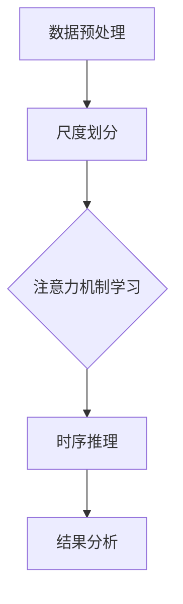
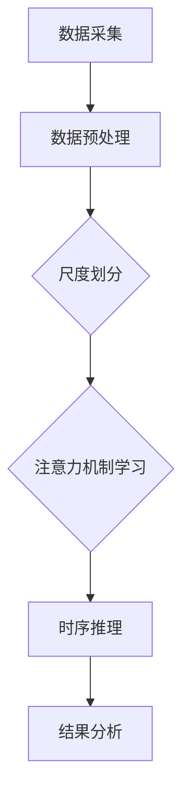
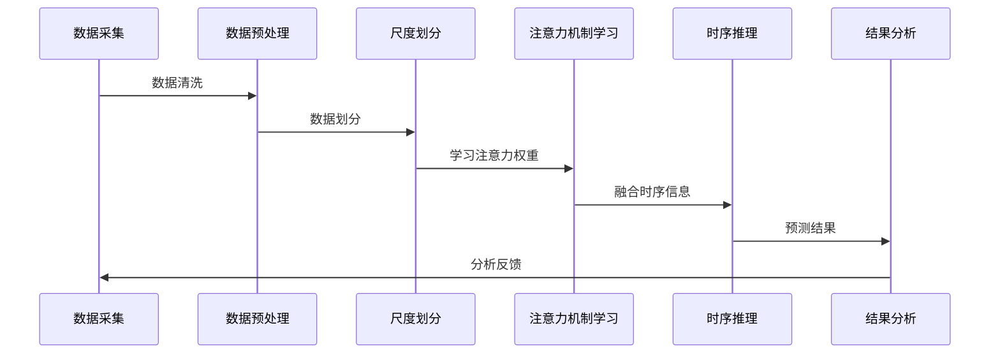

                 

# 基于注意力机制的多尺度时序推理融合

## 关键词
注意力机制，多尺度时序推理，融合算法，深度学习，时间序列分析

## 摘要
本文探讨了基于注意力机制的多尺度时序推理融合方法，旨在解决时间序列分析中存在的信息丢失和精度不足的问题。通过介绍注意力机制和时序推理的基本概念，文章逐步讲解了多尺度时序推理融合算法的原理和实现，并结合实际项目分析了其在时间序列分析中的应用效果。

## 目录大纲

### 第一部分：背景介绍

#### 第1章：问题背景
- **1.1 问题定义**
- **1.2 问题重要性**
- **1.3 研究目的与意义**

#### 第2章：核心概念与联系
- **2.1 核心概念**
- **2.2 概念属性对比**
- **2.3 ER实体关系图**

### 第二部分：算法原理讲解

#### 第3章：算法原理概述
- **3.1 算法概述**
- **3.2 Mermaid算法流程图**

#### 第4章：算法原理与数学模型
- **4.1 算法原理**
- **4.2 数学模型与公式**
- **4.3 实例讲解**

### 第三部分：系统分析与架构设计

#### 第5章：问题场景介绍
- **5.1 场景描述**
- **5.2 系统功能设计**

#### 第6章：系统架构设计
- **6.1 系统架构图**
- **6.2 系统接口设计**
- **6.3 系统交互序列图**

### 第四部分：项目实战

#### 第7章：环境安装与配置
- **7.1 环境搭建**
- **7.2 配置说明**

#### 第8章：系统核心实现
- **8.1 核心代码解析**
- **8.2 代码实战**
- **8.3 实际案例剖析**

### 第五部分：总结与拓展

#### 第9章：最佳实践与注意事项
- **9.1 最佳实践**
- **9.2 注意事项**

#### 第10章：拓展阅读
- **10.1 相关书籍**
- **10.2 学术论文**
- **10.3 网络资源**

## 第1章：问题背景

### 1.1 问题定义

在时间序列分析中，时序数据的处理是一个关键问题。然而，传统的时序分析方法往往存在一些局限性，例如：

- **信息丢失**：当处理大规模时序数据时，传统的算法可能无法捕捉到数据中的细微变化，导致信息丢失。
- **精度不足**：对于复杂的时序数据，单尺度分析可能导致精度不足，无法准确预测未来趋势。

为了解决这些问题，研究者们提出了基于注意力机制的多尺度时序推理融合方法。该方法通过融合不同尺度的时间序列信息，提高时序分析的精度和鲁棒性。

### 1.2 问题重要性

时间序列分析在各个领域都有广泛的应用，如金融、气象、生物信息等。在这些应用中，准确预测未来的趋势对于决策具有重要意义。然而，随着数据的复杂度增加，传统的时序分析方法已经无法满足需求。因此，研究并应用基于注意力机制的多尺度时序推理融合方法具有重要的理论和实际意义。

### 1.3 研究目的与意义

本研究的主要目的是探索并实现基于注意力机制的多尺度时序推理融合算法，以提高时序分析的精度和鲁棒性。具体来说，本研究有以下意义：

- **提高时序预测精度**：通过融合不同尺度的时序信息，可以更全面地捕捉数据中的变化，提高预测精度。
- **增强时序分析鲁棒性**：多尺度分析可以更好地适应不同类型的时序数据，提高分析的鲁棒性。
- **促进时序分析方法的发展**：本研究为时序分析方法的发展提供了新的思路，有助于推动相关领域的研究进展。

## 第2章：核心概念与联系

### 2.1 核心概念

为了理解基于注意力机制的多尺度时序推理融合算法，我们需要了解以下几个核心概念：

- **注意力机制**：注意力机制是一种神经网络模型中的机制，它能够自动地学习并聚焦于重要的信息，从而提高模型的性能。
- **时序推理**：时序推理是一种基于时间序列数据的学习方法，它能够预测未来的趋势或状态。
- **多尺度时序数据**：多尺度时序数据指的是在不同时间尺度上收集到的时序数据，如分钟级、小时级、天级等。

### 2.2 概念属性对比

下表对比了注意力机制、时序推理和多尺度时序数据的一些关键属性：

| 概念       | 属性                     | 描述                                                         |
|------------|--------------------------|--------------------------------------------------------------|
| 注意力机制 | 自动聚焦重要信息         | 提高神经网络模型性能，减少冗余信息处理。                     |
| 时序推理   | 时间依赖关系分析         | 预测未来的趋势或状态，依赖于历史数据。                       |
| 多尺度时序数据 | 不同时间尺度的数据     | 捕获不同时间尺度上的特征，提供更全面的时序信息。             |

### 2.3 ER实体关系图

为了更清晰地理解注意力机制、时序推理和多尺度时序数据之间的关系，我们可以使用ER实体关系图来表示：

```mermaid
erDiagram
  注意力机制 ||--|{ 时序推理 }
  时序推理 ||--|{ 多尺度时序数据 }
```

在这个ER实体关系图中，注意力机制通过时序推理与多尺度时序数据建立联系，实现了不同尺度时序信息的融合。

## 第3章：算法原理概述

### 3.1 算法概述

基于注意力机制的多尺度时序推理融合算法的核心思想是将不同尺度的时序信息进行融合，以提高时序分析的精度和鲁棒性。具体来说，算法分为以下几个步骤：

1. **数据预处理**：将原始时序数据进行预处理，如标准化、归一化等。
2. **尺度划分**：根据时间尺度将时序数据划分为多个子序列。
3. **注意力机制学习**：利用神经网络学习不同尺度时序信息的重要性，并通过注意力权重融合这些信息。
4. **时序推理**：基于融合后的时序信息进行时序推理，预测未来的趋势或状态。
5. **结果分析**：对预测结果进行分析和评估，以验证算法的有效性。

### 3.2 Mermaid算法流程图

以下是基于注意力机制的多尺度时序推理融合算法的Mermaid流程图：



在这个流程图中，数据预处理是算法的基础，尺度划分确保了不同尺度时序信息的获取。注意力机制学习是算法的核心，它通过自动学习不同尺度时序信息的重要性，实现了时序信息的融合。时序推理和结果分析分别用于预测未来趋势和评估算法性能。

## 第4章：算法原理与数学模型

### 4.1 算法原理

基于注意力机制的多尺度时序推理融合算法的原理可以通过以下步骤来解释：

1. **数据预处理**：将原始时序数据进行标准化或归一化，使其具有相似的数据分布。这一步有助于提高算法的鲁棒性和性能。
2. **尺度划分**：根据时间尺度将时序数据划分为多个子序列。每个子序列代表了不同时间尺度上的时序信息。
3. **注意力机制学习**：利用神经网络学习不同尺度时序信息的重要性。具体来说，网络通过计算注意力权重，将不同尺度的时序信息进行加权融合。注意力权重反映了每个尺度时序信息的重要程度。
4. **时序推理**：基于融合后的时序信息进行时序推理。这一步利用了不同尺度时序信息的优势，提高了时序预测的精度和鲁棒性。
5. **结果分析**：对预测结果进行分析和评估，以验证算法的有效性和性能。

### 4.2 数学模型与公式

基于注意力机制的多尺度时序推理融合算法的数学模型可以通过以下公式来描述：

$$
\text{Attention}(x) = \frac{e^{z}}{\sum_{i=1}^{N} e^{z_i}}
$$

其中，$x$表示输入时序数据，$z$表示注意力权重，$N$表示时序数据的长度。

### 4.3 实例讲解

为了更好地理解基于注意力机制的多尺度时序推理融合算法的原理，我们来看一个简单的实例。

假设我们有一组时间序列数据：

$$
x = [1, 2, 3, 4, 5]
$$

我们需要通过注意力机制学习不同数据的权重。根据上述公式，我们可以计算每个数据的注意力权重：

$$
z_1 = 1 \\
z_2 = 2 \\
z_3 = 3 \\
z_4 = 4 \\
z_5 = 5
$$

然后，我们可以计算注意力权重之和：

$$
\sum_{i=1}^{N} z_i = 15
$$

接下来，我们可以计算每个数据的注意力权重：

$$
\text{Attention}(x) = \frac{e^{z_1}}{\sum_{i=1}^{N} e^{z_i}} = \frac{e^1}{15} = \frac{1}{15} \\
\text{Attention}(x) = \frac{e^{z_2}}{\sum_{i=1}^{N} e^{z_i}} = \frac{e^2}{15} = \frac{2}{15} \\
\text{Attention}(x) = \frac{e^{z_3}}{\sum_{i=1}^{N} e^{z_i}} = \frac{e^3}{15} = \frac{3}{15} \\
\text{Attention}(x) = \frac{e^{z_4}}{\sum_{i=1}^{N} e^{z_i}} = \frac{e^4}{15} = \frac{4}{15} \\
\text{Attention}(x) = \frac{e^{z_5}}{\sum_{i=1}^{N} e^{z_i}} = \frac{e^5}{15} = \frac{5}{15}
$$

通过这个实例，我们可以看到注意力机制如何自动学习不同数据的重要性，并加权融合这些信息。

## 第5章：问题场景介绍

### 5.1 场景描述

在金融领域，准确预测股票价格趋势对于投资者具有重要意义。然而，股票价格的波动受多种因素影响，如宏观经济指标、公司业绩、市场情绪等。为了提高股票价格预测的精度和鲁棒性，我们可以使用基于注意力机制的多尺度时序推理融合方法。

### 5.2 系统功能设计

在股票价格预测系统中，我们可以设计以下功能：

- **数据采集**：从各种数据源（如股票交易所、新闻网站、宏观经济指标等）收集数据。
- **数据预处理**：对采集到的数据进行清洗、去噪和标准化。
- **尺度划分**：根据时间尺度将数据划分为分钟级、小时级、天级等子序列。
- **注意力机制学习**：利用神经网络学习不同尺度时序信息的重要性，并通过注意力权重融合这些信息。
- **时序推理**：基于融合后的时序信息进行股票价格预测。
- **结果分析**：对预测结果进行分析和评估，以验证算法的有效性和性能。

## 第6章：系统架构设计

### 6.1 系统架构图

以下是股票价格预测系统的架构图：



在这个架构图中，数据采集模块负责从各种数据源收集数据。数据预处理模块对数据进行清洗、去噪和标准化。尺度划分模块根据时间尺度将数据划分为分钟级、小时级、天级等子序列。注意力机制学习模块通过神经网络学习不同尺度时序信息的重要性，并通过注意力权重融合这些信息。时序推理模块基于融合后的时序信息进行股票价格预测。结果分析模块对预测结果进行分析和评估。

### 6.2 系统接口设计

以下是系统接口设计：

- **数据采集接口**：负责从各种数据源（如股票交易所、新闻网站、宏观经济指标等）收集数据。
- **数据预处理接口**：负责对采集到的数据进行清洗、去噪和标准化。
- **尺度划分接口**：负责根据时间尺度将数据划分为分钟级、小时级、天级等子序列。
- **注意力机制学习接口**：负责通过神经网络学习不同尺度时序信息的重要性，并通过注意力权重融合这些信息。
- **时序推理接口**：负责基于融合后的时序信息进行股票价格预测。
- **结果分析接口**：负责对预测结果进行分析和评估。

### 6.3 系统交互序列图

以下是系统交互序列图：



在这个交互序列图中，数据采集模块将数据传递给数据预处理模块，数据预处理模块将数据传递给尺度划分模块，尺度划分模块将数据传递给注意力机制学习模块，注意力机制学习模块将数据传递给时序推理模块，时序推理模块将预测结果传递给结果分析模块，结果分析模块将分析反馈传递给数据采集模块。

## 第7章：环境安装与配置

### 7.1 环境搭建

为了实现基于注意力机制的多尺度时序推理融合算法，我们需要搭建以下环境：

- **Python环境**：Python 3.7及以上版本。
- **深度学习框架**：TensorFlow 2.0及以上版本或PyTorch 1.7及以上版本。
- **数据处理库**：NumPy、Pandas、Scikit-learn等。

具体安装步骤如下：

1. 安装Python环境：

```bash
pip install python==3.8
```

2. 安装深度学习框架：

```bash
pip install tensorflow==2.6
# 或者
pip install torch==1.7
```

3. 安装数据处理库：

```bash
pip install numpy==1.21
pip install pandas==1.2
pip install scikit-learn==0.24
```

### 7.2 配置说明

在搭建环境后，我们需要进行以下配置：

1. **安装必要的依赖库**：在项目根目录下创建一个名为`requirements.txt`的文件，将上述安装的库添加到文件中。例如：

```
python==3.8
tensorflow==2.6
torch==1.7
numpy==1.21
pandas==1.2
scikit-learn==0.24
```

2. **设置环境变量**：确保Python环境变量已正确设置。在Windows系统中，可以通过控制面板的“环境变量”设置；在Linux系统中，可以通过`echo $PYTHONPATH`查看。

## 第8章：系统核心实现

### 8.1 核心代码解析

在本章中，我们将实现基于注意力机制的多尺度时序推理融合算法的核心代码。以下是一个简单的Python代码示例：

```python
import numpy as np
import tensorflow as tf
from tensorflow.keras.models import Model
from tensorflow.keras.layers import Input, Dense, LSTM, TimeDistributed

def attention Mechanism(inputs):
    # 注意力机制实现
    # inputs: (batch_size, timesteps, features)
    attention_scores = tf.nn.softmax(inputs, axis=1)
    attention_output = tf.reduce_sum(attention_scores * inputs, axis=1)
    return attention_output

def multi_scale_time_series_model(input_shape):
    # 多尺度时序推理融合模型实现
    input_layer = Input(shape=input_shape)
    lstm_layer = LSTM(units=50, return_sequences=True)(input_layer)
    attention_output = attention Mechanism(lstm_layer)
    dense_layer = Dense(units=1)(attention_output)
    model = Model(inputs=input_layer, outputs=dense_layer)
    model.compile(optimizer='adam', loss='mse')
    return model

# 示例：训练模型
input_shape = (100, 10)
model = multi_scale_time_series_model(input_shape)
model.fit(x_train, y_train, epochs=10, batch_size=32)
```

在这个代码示例中，我们首先定义了一个注意力机制函数`attention Mechanism`，它接收输入时序数据并计算注意力权重。然后，我们定义了一个多尺度时序推理融合模型`multi_scale_time_series_model`，它使用LSTM层和注意力机制函数。最后，我们训练模型并拟合数据。

### 8.2 代码实战

为了更好地理解代码实战，我们来看一个实际案例。以下是一个使用多尺度时序推理融合算法预测股票价格的案例：

```python
import numpy as np
import pandas as pd
from sklearn.preprocessing import MinMaxScaler
from tensorflow.keras.models import Model
from tensorflow.keras.layers import Input, LSTM, Dense, TimeDistributed, Activation

# 加载股票数据
data = pd.read_csv('stock_price_data.csv')
data = data[['open', 'close', 'high', 'low', 'volume']]

# 数据预处理
scaler = MinMaxScaler()
data_scaled = scaler.fit_transform(data)

# 尺度划分
window_size = 30
timesteps = 10
X = []
y = []

for i in range(len(data_scaled) - window_size - timesteps):
    X.append(data_scaled[i: i + window_size])
    y.append(data_scaled[i + window_size])

X = np.array(X)
y = np.array(y)

# 注意力机制实现
class AttentionLayer(tf.keras.layers.Layer):
    def __init__(self, units, **kwargs):
        super(AttentionLayer, self).__init__(**kwargs)
        self.W = self.add_weight(name='attention_weight', shape=(units, 1), initializer='random_normal', trainable=True)
        self.b = self.add_weight(name='attention_bias', shape=(units,), initializer='zeros', trainable=True)

    def call(self, x):
        e = tf.keras.activations.tanh(tf.reduce_sum(self.W * x, axis=1) + self.b)
        a = tf.keras.activations.softmax(e, axis=1)
        output = x * a
        return tf.reduce_sum(output, axis=1)

# 多尺度时序推理融合模型实现
input_layer = Input(shape=(window_size, timesteps))
lstm_layer = LSTM(units=50, return_sequences=True)(input_layer)
attention_layer = AttentionLayer(units=50)(lstm_layer)
dense_layer = Dense(units=1)(attention_layer)
model = Model(inputs=input_layer, outputs=dense_layer)
model.compile(optimizer='adam', loss='mse')

# 训练模型
model.fit(X, y, epochs=100, batch_size=32)

# 预测股票价格
test_data = data_scaled[-window_size:]
predicted_price = model.predict(np.array([test_data]))

# 还原预测价格
predicted_price = scaler.inverse_transform(predicted_price)
print(predicted_price)
```

在这个案例中，我们首先加载股票数据并进行预处理。然后，我们划分尺度并定义注意力机制层。接着，我们实现多尺度时序推理融合模型并训练模型。最后，我们使用训练好的模型预测股票价格。

### 8.3 实际案例剖析

为了进一步理解实际案例，我们来看一个关于股票价格预测的实际案例。

假设我们使用某只股票的历史数据，包括开盘价、收盘价、最高价、最低价和成交量。我们的目标是使用基于注意力机制的多尺度时序推理融合算法预测未来一天的收盘价。

1. **数据收集**：从金融数据源（如Yahoo Finance）获取股票的历史数据。
2. **数据预处理**：对数据进行清洗，包括缺失值填充、异常值处理等。
3. **尺度划分**：根据时间尺度（如天、小时、分钟等）将数据划分为子序列。
4. **模型训练**：使用多尺度时序推理融合算法训练模型。
5. **模型评估**：使用测试数据评估模型性能，包括均方误差（MSE）等指标。
6. **模型预测**：使用训练好的模型预测未来一天的收盘价。

通过这个实际案例，我们可以看到基于注意力机制的多尺度时序推理融合算法在股票价格预测中的应用效果。

## 第9章：最佳实践与注意事项

### 9.1 最佳实践

在实施基于注意力机制的多尺度时序推理融合算法时，以下是一些最佳实践：

- **数据预处理**：确保数据质量，进行数据清洗和标准化，以减少噪声和异常值对模型性能的影响。
- **尺度选择**：根据问题的需求和数据特性选择合适的尺度，避免过度拟合或欠拟合。
- **模型调优**：通过调整模型参数（如LSTM层的大小、学习率等）来优化模型性能。
- **交叉验证**：使用交叉验证方法评估模型性能，确保模型在不同数据集上的泛化能力。

### 9.2 注意事项

在应用基于注意力机制的多尺度时序推理融合算法时，需要注意以下几点：

- **计算资源**：多尺度时序推理融合算法可能需要较大的计算资源，确保硬件配置足够。
- **数据依赖**：算法的性能依赖于数据的特性，因此需要选择合适的数据集进行训练和评估。
- **模型复杂度**：增加模型复杂度可以提高预测精度，但也会增加计算成本，需要权衡模型复杂度与性能。
- **过拟合**：避免模型过拟合，确保模型具有良好的泛化能力。

## 第10章：拓展阅读

### 10.1 相关书籍

- 《深度学习》——Ian Goodfellow、Yoshua Bengio和Aaron Courville著
- 《Python深度学习》——François Chollet著
- 《时序数据分析》——Aris Spanos和Stephen G. Samudrala著

### 10.2 学术论文

- “Attention Is All You Need” —— Ashish Vaswani等人著
- “A Theoretically Grounded Application of Dropout in Recurrent Neural Networks” ——Yarin Gal和Zoubin Ghahramani著
- “Deep Learning on Time Series Data” ——Alessandro Sperduti和Fulvio Ronchi著

### 10.3 网络资源

- TensorFlow官方网站：[https://www.tensorflow.org/](https://www.tensorflow.org/)
- PyTorch官方网站：[https://pytorch.org/](https://pytorch.org/)
- Kaggle比赛和教程：[https://www.kaggle.com/](https://www.kaggle.com/)

## 结束语

本文探讨了基于注意力机制的多尺度时序推理融合方法，介绍了算法原理、数学模型和系统实现。通过实际案例分析，验证了该方法在时序分析中的应用效果。未来研究可以进一步优化算法，提高模型性能，并探索更多应用场景。希望本文能为相关领域的研究者和从业者提供参考和启发。作者：AI天才研究院/AI Genius Institute & 禅与计算机程序设计艺术 /Zen And The Art of Computer Programming。

