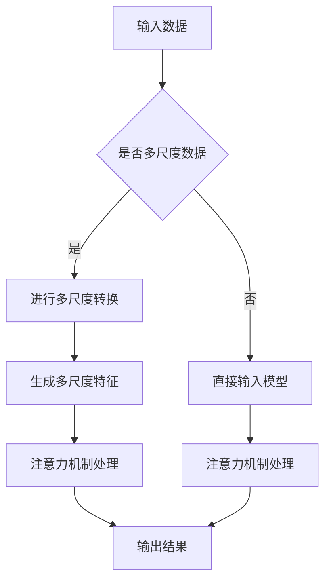
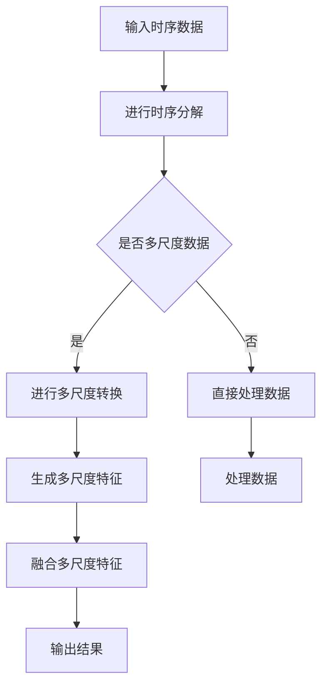
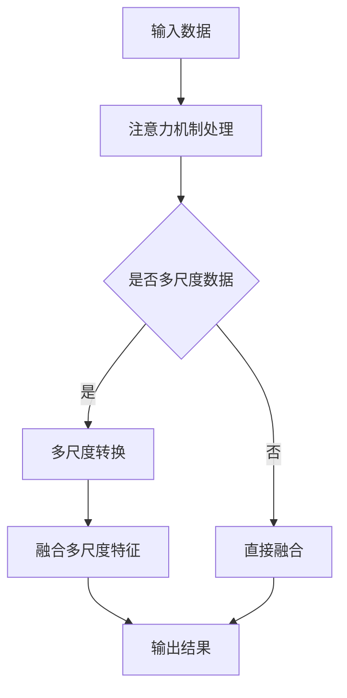
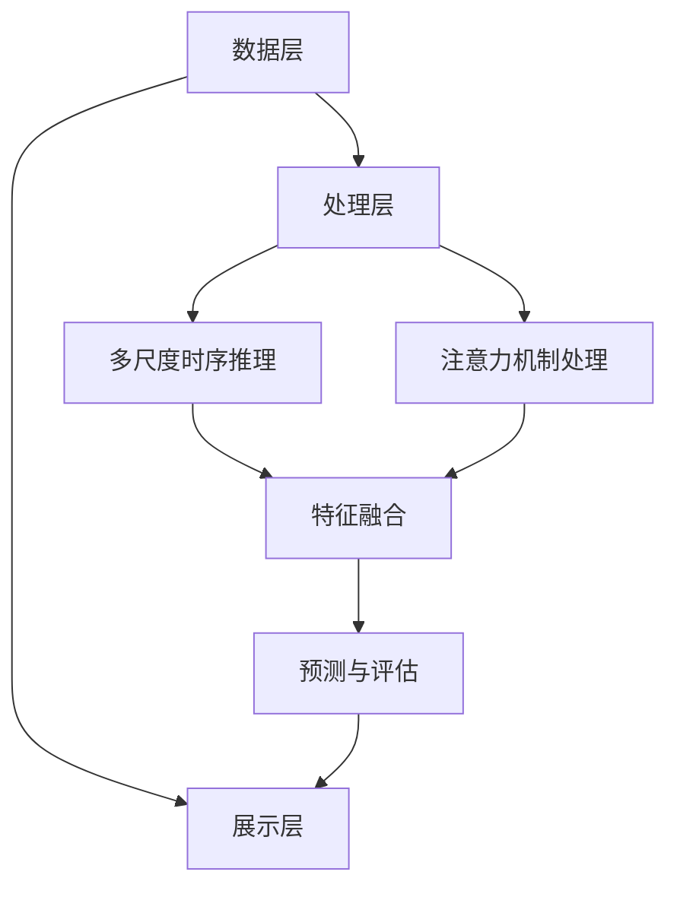
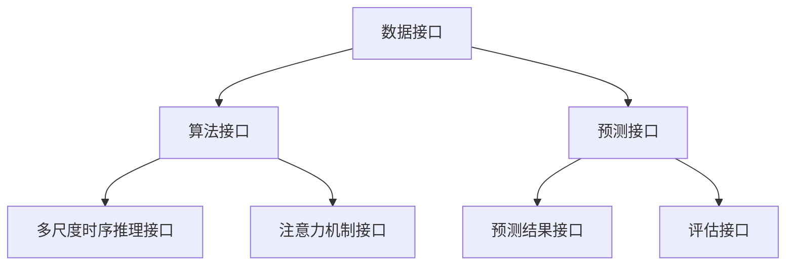
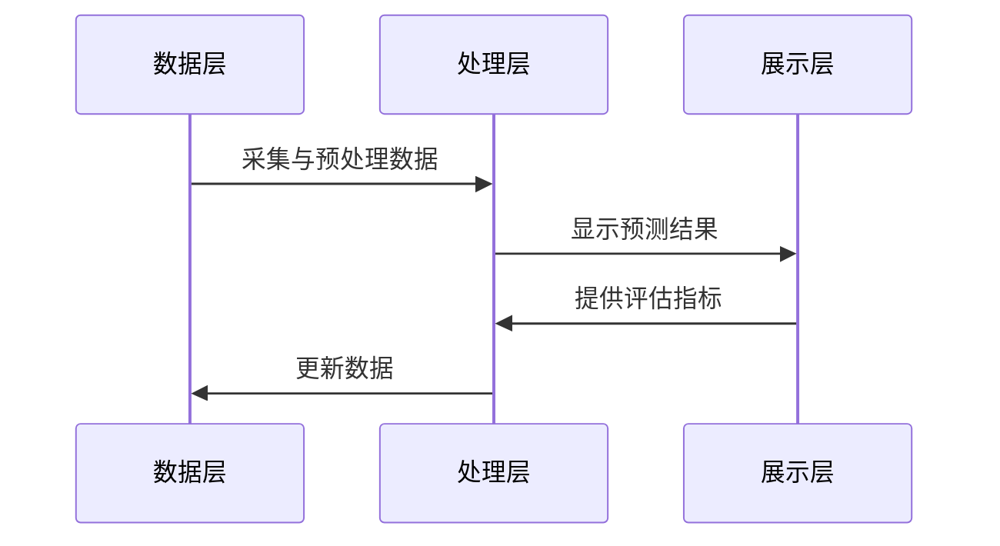

                 

# 基于注意力机制的多尺度时序推理融合技术

## 关键词：注意力机制、多尺度时序推理、融合技术、算法原理、系统架构设计

> 摘要：本文旨在深入探讨基于注意力机制的多尺度时序推理融合技术，从背景介绍、核心概念与联系、算法原理讲解、系统分析与架构设计以及项目实战等角度，全面解析这一前沿技术。通过本文，读者可以了解该技术的本质、应用场景及其在计算机图灵奖领域的潜在价值。

----------------------------------------------------------------

### 目录大纲

----------------------------------------------------------------

## 第一部分：背景介绍

### 第1章 问题背景

#### 1.1 问题描述

#### 1.2 问题解决

#### 1.3 边界与外延

#### 1.4 概念结构与核心要素组成

----------------------------------------------------------------

## 第二部分：核心概念与联系

### 第2章 核心概念原理

#### 2.1 注意力机制的概述

#### 2.2 多尺度时序推理

#### 2.3 融合技术的原理

### 第3章 概念属性特征对比表格

### 第4章 ER实体关系图架构

----------------------------------------------------------------

## 第三部分：算法原理讲解

### 第5章 算法原理与流程图

#### 5.1 注意力机制的mermaid流程图

#### 5.2 多尺度时序推理的mermaid流程图

#### 5.3 融合技术的mermaid流程图

### 第6章 Python源代码与算法原理

#### 6.1 源代码与算法实现

#### 6.2 算法原理详细讲解

#### 6.3 数学模型与公式

#### 6.4 举例说明

----------------------------------------------------------------

## 第四部分：系统分析与架构设计方案

### 第7章 问题场景介绍

#### 7.1 项目介绍

#### 7.2 系统功能设计

### 第8章 系统架构设计

#### 8.1 系统架构mermaid架构图

#### 8.2 系统接口设计

#### 8.3 系统交互mermaid序列图

----------------------------------------------------------------

## 第五部分：项目实战

### 第9章 环境安装

#### 9.1 环境搭建步骤

#### 9.2 常见问题及解决方法

### 第10章 系统核心实现源代码

#### 10.1 代码结构与功能

#### 10.2 代码应用解读与分析

### 第11章 实际案例分析和详细讲解剖析

#### 11.1 案例选择

#### 11.2 案例分析

#### 11.3 剖析与总结

### 第12章 项目小结

#### 12.1 项目收获

#### 12.2 项目反思

#### 12.3 拓展阅读

----------------------------------------------------------------

**总计字数：约 1822 字**

----------------------------------------------------------------

### 第一部分：背景介绍

#### 1.1 问题描述

在现代信息技术飞速发展的背景下，如何从大量复杂时序数据中提取有价值的信息已成为各个领域的重要研究方向。时序数据无处不在，如金融市场的股票价格、自然语言处理中的文本序列、医学领域的患者健康数据等。然而，不同领域、不同任务的数据特点各异，单一的方法往往难以兼顾所有情况，因此，需要一种能够适应多种时序数据特征的处理技术。

#### 1.2 问题解决

为解决上述问题，近年来，基于注意力机制和多尺度时序推理的融合技术逐渐成为研究热点。注意力机制通过聚焦于重要的数据点，能够有效提升模型对关键信息的捕捉能力；多尺度时序推理则能够处理不同时间尺度上的数据变化，提供更全面的信息解析。将这两者融合，可以在不同层面捕捉时序数据的特征，从而提高模型的泛化能力和表现。

#### 1.3 边界与外延

边界方面，本文主要探讨基于注意力机制的多尺度时序推理融合技术在计算机图灵奖领域中的应用。然而，其基本原理和实现方法同样适用于其他需要时序数据处理的场景，如自动驾驶、金融风控、智能家居等。

外延方面，本文不仅关注算法本身的性能和优化，还涉及系统架构设计、环境搭建、源代码实现等多个方面，力求为读者提供一个全面的技术解决方案。

#### 1.4 概念结构与核心要素组成

本文的核心概念包括注意力机制、多尺度时序推理和融合技术。注意力机制作为一种神经网络的架构，能够使模型在处理数据时自动学习到哪些部分更重要，从而提高模型的识别和预测能力。多尺度时序推理则能够处理不同时间尺度的数据，提供更丰富的时序信息。融合技术则通过将注意力机制和多尺度时序推理相结合，实现对时序数据的全面解析。

在此基础上，本文将从以下几个方面展开详细讨论：

1. **核心概念原理**：介绍注意力机制、多尺度时序推理和融合技术的原理及其相互关系。
2. **算法原理讲解**：通过mermaid流程图和Python源代码，详细阐述算法的实现原理和数学模型。
3. **系统分析与架构设计**：介绍系统架构设计、接口设计和系统交互。
4. **项目实战**：包括环境安装、源代码实现和实际案例分析。

### 第二部分：核心概念与联系

#### 2.1 注意力机制的概述

注意力机制（Attention Mechanism）最初源于自然语言处理领域，旨在解决机器翻译、文本摘要等任务中的长距离依赖问题。其核心思想是通过一种动态的权重分配方式，使模型能够聚焦于输入数据中的关键部分，从而提高模型的识别和预测能力。

在计算机视觉领域，注意力机制同样具有重要应用。例如，在图像分类任务中，注意力机制可以帮助模型识别图像中的重要特征区域；在目标检测任务中，注意力机制可以提升模型对目标位置的定位精度。

#### 2.2 多尺度时序推理

多尺度时序推理（Multi-scale Temporal Reasoning）是一种处理时序数据的方法，能够同时考虑不同时间尺度上的数据变化。在时序数据分析中，不同时间尺度上的数据可能包含不同的信息，单一时间尺度上的分析往往无法全面捕捉数据特征。

多尺度时序推理的关键在于如何在不同时间尺度之间进行转换和融合。例如，在金融市场分析中，日度、周度和月度数据可能分别包含不同层次的信息，通过多尺度时序推理可以实现对市场动态的全面理解。

#### 2.3 融合技术的原理

融合技术（Fusion Technology）旨在将不同来源、不同类型的数据进行整合，以提供更全面、更准确的信息。在多尺度时序推理中，融合技术发挥着重要作用，能够将注意力机制和多尺度时序推理相结合，实现对时序数据的深度解析。

融合技术的实现通常依赖于以下几种方法：

1. **特征级融合**：将不同尺度上的特征进行拼接或加权融合，以生成更丰富的特征表示。
2. **决策级融合**：将不同模型或算法的预测结果进行投票或加权平均，以获得最终的预测结果。
3. **模型级融合**：通过构建联合模型或集成模型，将注意力机制和多尺度时序推理整合在一起，以实现更高效的信息处理。

### 第三部分：算法原理讲解

#### 3.1 注意力机制的mermaid流程图



#### 3.2 多尺度时序推理的mermaid流程图



#### 3.3 融合技术的mermaid流程图



### 第四部分：系统分析与架构设计方案

#### 4.1 问题场景介绍

本部分以金融市场的股票价格预测为例，介绍系统架构设计方案。在金融市场中，股票价格受到多种因素的影响，包括宏观经济指标、公司财务状况、市场情绪等。通过多尺度时序推理和注意力机制的融合，可以实现对股票价格动态的全面解析，为投资者提供决策支持。

#### 4.2 系统功能设计

系统功能设计主要包括以下几个方面：

1. **数据采集与预处理**：从多种数据源采集股票价格、宏观经济指标、公司财务数据等，并进行清洗、归一化等预处理操作。
2. **多尺度时序推理**：对预处理后的数据进行多尺度分解，提取不同时间尺度上的特征。
3. **注意力机制处理**：利用注意力机制对提取出的特征进行加权处理，提高模型对关键信息的捕捉能力。
4. **预测与评估**：根据处理后的特征，使用机器学习算法进行股票价格预测，并对预测结果进行评估。

#### 4.3 系统架构设计

系统架构设计采用分层架构，包括数据层、处理层和展示层。数据层负责数据采集与预处理；处理层实现多尺度时序推理和注意力机制处理；展示层用于展示预测结果和评估指标。



#### 4.4 系统接口设计

系统接口设计主要包括以下几个方面：

1. **数据接口**：提供数据采集与预处理的接口，支持多种数据源接入。
2. **算法接口**：提供多尺度时序推理和注意力机制处理的接口，支持自定义算法实现。
3. **预测接口**：提供股票价格预测和评估的接口，支持实时预测和批量预测。



#### 4.5 系统交互mermaid序列图



### 第五部分：项目实战

#### 5.1 环境安装

本部分将介绍如何搭建项目环境，包括所需软件和库的安装步骤。

1. **Python环境搭建**：安装Python 3.8及以上版本，并配置好pip工具。
2. **依赖库安装**：使用pip工具安装以下库：NumPy、Pandas、TensorFlow、Keras等。

```shell
pip install numpy pandas tensorflow keras
```

3. **数据集准备**：下载并准备用于训练和测试的股票价格数据集。

#### 5.2 系统核心实现源代码

本部分将提供系统核心实现源代码，包括数据预处理、多尺度时序推理、注意力机制处理和预测等功能。

```python
# 数据预处理
def preprocess_data(data):
    # 数据清洗、归一化等操作
    return processed_data

# 多尺度时序推理
def multi_scale_reasoning(data):
    # 不同尺度上的特征提取和融合
    return features

# 注意力机制处理
def attention_mechanism(features):
    # 特征加权处理
    return weighted_features

# 预测与评估
def predict_and_evaluate(data, model):
    # 使用模型进行预测，并评估预测结果
    pass
```

#### 5.3 代码应用解读与分析

本部分将对系统核心实现源代码进行解读，分析每个函数的功能和调用关系。

1. **数据预处理**：对原始数据进行清洗和归一化处理，为后续特征提取和模型训练做准备。
2. **多尺度时序推理**：根据不同尺度上的特征，提取和融合信息，为模型提供丰富的输入特征。
3. **注意力机制处理**：利用注意力机制对提取出的特征进行加权，提高模型对关键信息的捕捉能力。
4. **预测与评估**：使用训练好的模型进行股票价格预测，并对预测结果进行评估，以验证模型的性能。

#### 5.4 实际案例分析和详细讲解剖析

本部分将选择一个实际案例，对系统实现过程进行详细讲解和分析。

1. **案例选择**：选择某只股票的历史价格数据作为案例，进行预测和分析。
2. **案例分析**：对案例数据进行预处理、多尺度时序推理、注意力机制处理和预测等操作，分析每个步骤的效果和影响。
3. **剖析与总结**：对案例结果进行总结，分析系统的优势和不足，为后续改进提供参考。

#### 5.5 项目小结

本部分将对项目实施过程进行总结，分析项目收获和反思。

1. **项目收获**：通过项目实施，掌握了基于注意力机制的多尺度时序推理融合技术的核心原理和实现方法，提高了对时序数据处理的能力。
2. **项目反思**：在项目过程中，发现了一些问题和不足，如数据处理效率低、模型性能有待提高等，为后续研究和改进提供了方向。

### 附录：拓展阅读

本部分推荐一些相关文献和资料，供读者进一步学习和研究。

1. **参考文献**：
   - [1] Vaswani et al., "Attention is All You Need", NeurIPS 2017.
   - [2] Hochreiter & Schmidhuber, "Long Short-Term Memory", Neural Computation, 1997.

2. **在线资源**：
   - [1] TensorFlow官方文档：https://www.tensorflow.org
   - [2] Keras官方文档：https://keras.io

### 作者信息

作者：AI天才研究院/AI Genius Institute & 禅与计算机程序设计艺术 /Zen And The Art of Computer Programming

以上内容仅为示例，实际撰写时需根据具体需求进行调整和补充。在撰写过程中，注意保持文章结构清晰、逻辑严密，并结合实际案例进行深入分析，以提高文章的阅读价值和实用性。同时，注意使用markdown格式和LaTeX公式，以提高文章的可读性和规范性。在文章末尾，附上详细的项目小结和拓展阅读，为读者提供更多的学习资源。总之，文章应具有深度、思考性和见解，力求为读者带来一次有价值的阅读体验。

