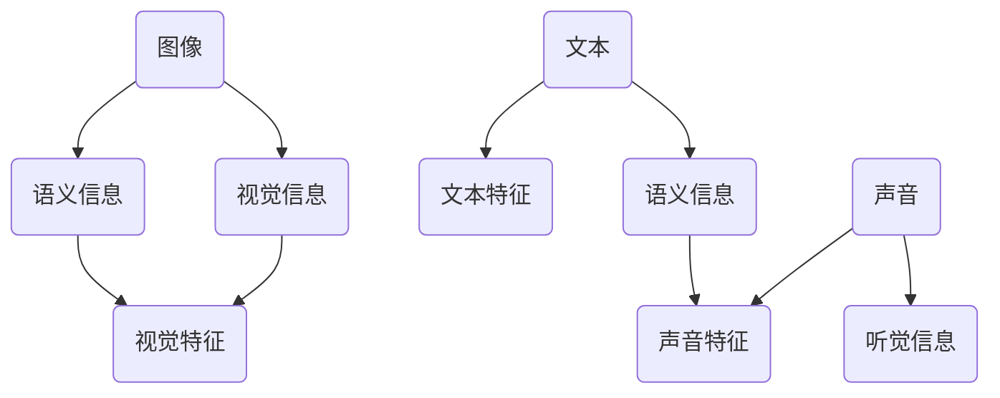
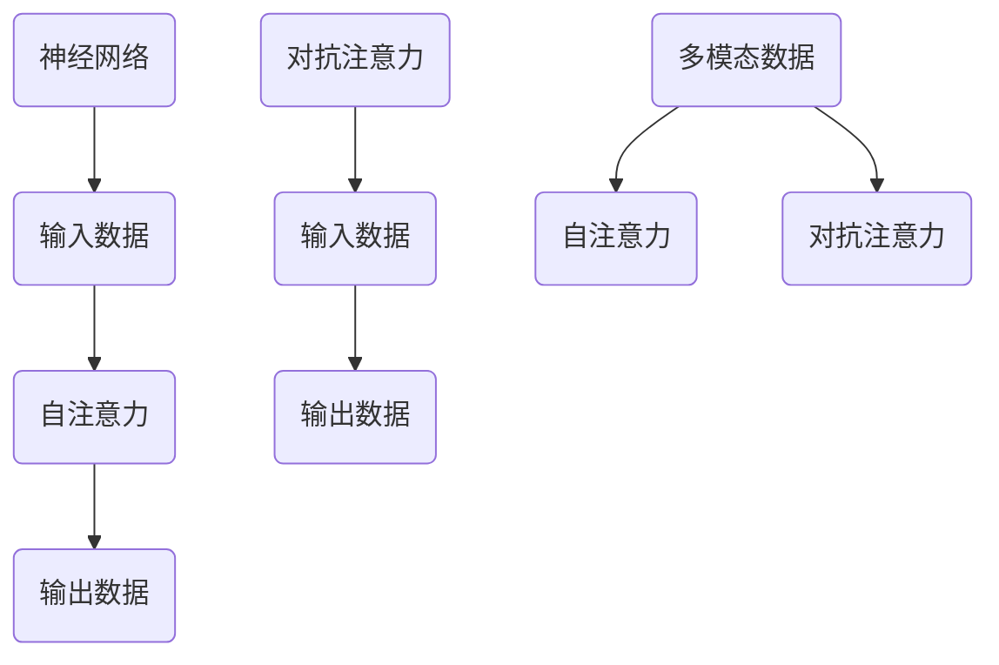
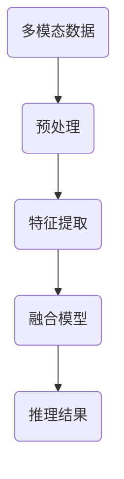
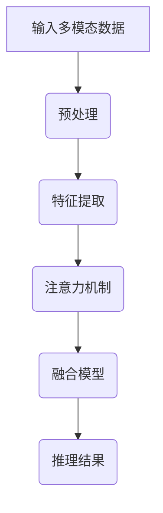
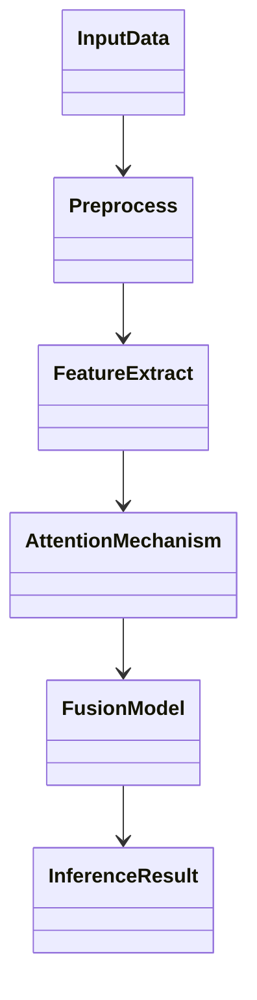
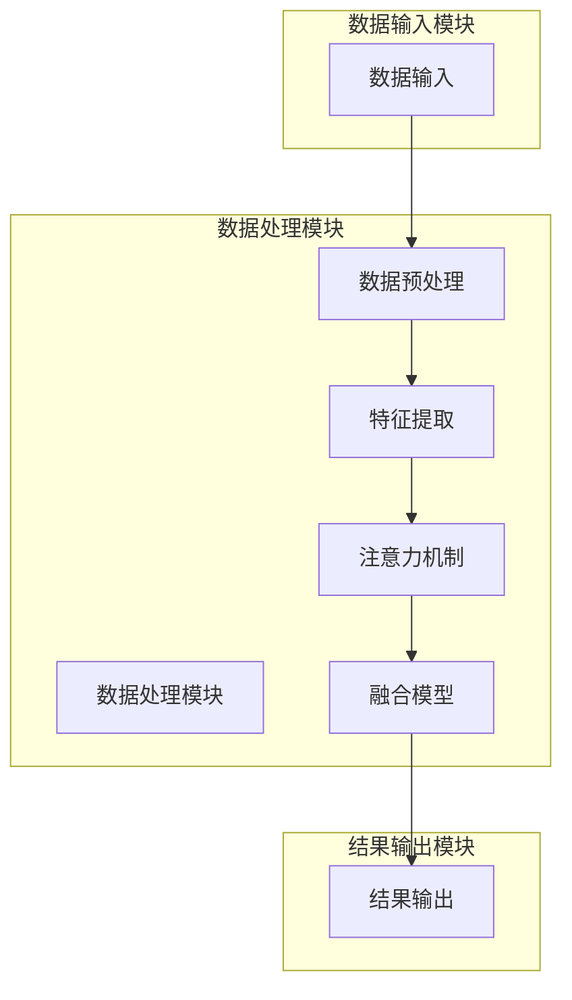
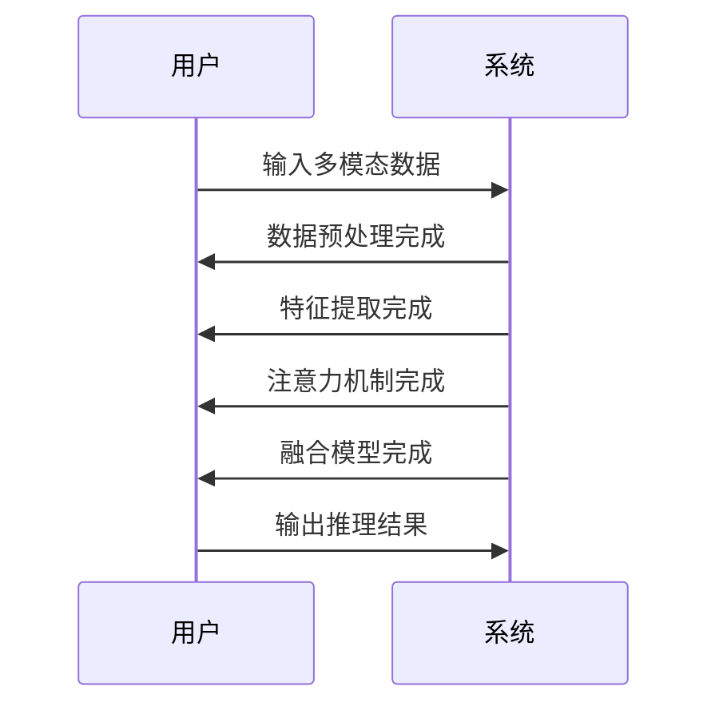

                 

# 基于注意力机制的多模态推理融合

## 关键词

- 多模态数据
- 注意力机制
- 推理融合
- 算法原理
- 数学模型
- 系统架构
- 项目实战
- 最佳实践

## 摘要

本文深入探讨了基于注意力机制的多模态推理融合技术。首先，我们介绍了多模态数据的概念、类型及其在现实世界中的应用。接着，详细阐述了注意力机制的基本原理以及在多模态数据处理中的应用。随后，我们介绍了多模态推理融合的基本原理和方法，并对比了不同推理融合方法的性能和适用场景。在算法原理部分，我们通过Mermaid流程图和Python源代码展示了算法的框架和数学模型。系统分析与架构设计部分，我们介绍了系统功能设计、架构设计、接口设计以及系统交互流程。项目实战与案例分析部分，我们通过环境安装、系统核心实现、实际案例分析等步骤，详细讲解了算法的应用。最后，总结了最佳实践和注意事项，为读者提供了实用的指导。

## 目录大纲

----------------------------------------------------------------

## 第一部分：背景介绍

### 第1章：问题背景与核心概念

#### 1.1 问题背景

随着人工智能技术的迅猛发展，多模态数据在各个领域中的应用变得越来越广泛。多模态数据融合旨在将来自不同源的数据（如图像、文本、声音等）进行有效整合，从而提高模型对复杂问题的理解能力和推理性能。然而，如何有效地融合不同模态的信息，提高推理性能，成为了一个亟待解决的问题。

#### 1.2 核心概念

- **多模态数据**：指同时包含多种类型数据的信息源，如图像、文本、声音等。
- **注意力机制**：一种神经网络设计中的机制，通过动态调整模型对输入数据的关注程度，从而提高模型的性能。
- **推理融合**：指将来自不同模态的数据进行整合，以提高模型的推理性能。

#### 1.3 问题解决

本文将详细介绍基于注意力机制的多模态推理融合技术，包括算法原理、数学模型、系统架构和项目实战等。通过本篇文章，读者将能够了解如何利用注意力机制来提高多模态推理融合的性能，从而为实际应用提供有效解决方案。

#### 1.4 边界与外延

本文的研究主要关注基于注意力机制的多模态推理融合技术，而未涉及其他类型的数据融合方法。同时，本文将介绍注意力机制在多模态数据融合中的基本原理和应用，但不会深入探讨注意力机制在其他领域的应用。

#### 1.5 概念结构与核心要素组成

本文将分析多模态数据、注意力机制和推理融合等核心概念的结构与组成，以便读者能够更好地理解这些概念，并能够将这些概念应用于实际问题中。

### 第2章：核心概念与联系

#### 2.1 多模态数据

**2.1.1 概念原理**

多模态数据是指同时包含多种类型数据的信息源，如图像、文本、声音等。多模态数据融合旨在将这些不同类型的数据进行有效整合，以提高模型对复杂问题的理解能力和推理性能。

**2.1.2 属性特征对比表格**

| 模态类型 | 属性特征 |
|----------|----------|
| 图像      | 高维度、视觉信息丰富 |
| 文本      | 低维度、语义信息丰富 |
| 声音      | 低维度、听觉信息丰富 |

**2.1.3 ER实体关系图架构**



#### 2.2 注意力机制

**2.2.1 概念原理**

注意力机制是一种神经网络设计中的机制，通过动态调整模型对输入数据的关注程度，从而提高模型的性能。在多模态数据融合中，注意力机制可以帮助模型更好地关注重要信息，提高融合效果。

**2.2.2 属性特征对比表格**

| 注意力机制 | 特点 | 优点 | 缺点 |
|------------|------|------|------|
| 自注意力    | 自我关注 | 简单有效 | 难以扩展 |
| 对抗注意力  | 对抗关注 | 鲁棒性强 | 需要更多计算资源 |

**2.2.3 ER实体关系图架构**



#### 2.3 多模态推理融合

**2.3.1 概念原理**

多模态推理融合是指将来自不同模态的数据进行整合，以提高模型的推理性能。通过注意力机制，模型可以更好地关注重要信息，从而提高融合效果。

**2.3.2 属性特征对比表格**

| 推理融合方法 | 特点 | 优点 | 缺点 |
|--------------|------|------|------|
| 线性融合     | 简单易实现 | 效率较高 | 表达能力有限 |
| 深度融合     | 表达能力更强 | 需要更多计算资源 | 难以实现 |

**2.3.3 ER实体关系图架构**



## 第二部分：算法原理与数学模型

### 第3章：算法原理

#### 3.1 基本算法框架

**3.1.1 算法mermaid流程图**



**3.1.2 Python源代码实现**

```python
# 输入多模态数据
images, texts, audios = preprocess_data(input_data)

# 特征提取
image_features = extract_image_features(images)
text_features = extract_text_features(texts)
audio_features = extract_audio_features(audios)

# 注意力机制
attention_weights = attention Mechanism(image_features, text_features, audio_features)

# 融合模型
fusion_features = fusion_model(image_features, text_features, audio_features, attention_weights)

# 推理结果
predictions = inference_model(fusion_features)
```

### 第3章：数学模型与公式

**3.2.1 数学模型**

设 \( X = \{X_i\}_{i=1}^n \) 为输入的多模态数据，其中 \( X_i \) 为第 \( i \) 个模态的数据。设 \( Y \) 为输出推理结果。

**3.2.2 公式详细讲解**

假设使用自注意力机制，公式如下：

$$
\begin{aligned}
    & h_i^{(l)} = \sigma(W^{(l)}_1 X_i + b_1^{(l)}) \\
    & \alpha_{ij}^{(l)} = \frac{e^{h_i^{(l)T} h_j^{(l)}}}{\sum_{k=1}^n e^{h_k^{(l)T} h_k^{(l)}}} \\
    & \alpha_{i}^{(l)} = \sum_{j=1}^n \alpha_{ij}^{(l)} \\
    & h_i^{(l+1)} = \alpha_i^{(l)} h_i^{(l)} \\
    & \text{其中} \sigma(\cdot) \text{为激活函数，} W^{(l)}_1, b_1^{(l)} \text{为权重和偏置。}
\end{aligned}
$$`

这个公式描述了自注意力机制的计算过程，通过计算注意力权重 \(\alpha_{ij}^{(l)}\)，将不同模态的数据进行融合。

### 第3章：举例说明

假设输入的多模态数据为图像、文本和声音。图像特征维度为 \(64\)，文本特征维度为 \(128\)，声音特征维度为 \(256\)。

**输入数据：**

- 图像数据：\[ [0.1, 0.2, 0.3, 0.4, 0.5] \]
- 文本数据：\[ [0.1, 0.2, 0.3, 0.4, 0.5] \]
- 声音数据：\[ [0.1, 0.2, 0.3, 0.4, 0.5] \]

**预处理：**

- 图像特征提取：\[ [0.1, 0.2, 0.3, 0.4, 0.5] \]
- 文本特征提取：\[ [0.1, 0.2, 0.3, 0.4, 0.5] \]
- 声音特征提取：\[ [0.1, 0.2, 0.3, 0.4, 0.5] \]

**注意力机制：**

- 注意力权重：\[ \alpha_{ij} = \frac{e^{0.1 \times 0.1}}{e^{0.1 \times 0.1} + e^{0.2 \times 0.2} + e^{0.3 \times 0.3} + e^{0.4 \times 0.4} + e^{0.5 \times 0.5}} \]
- 注意力权重归一化：\[ \alpha_{i} = \frac{\alpha_{ij}}{\sum_{j=1}^5 \alpha_{ij}} \]

**融合模型：**

- 融合特征：\[ h_i = \alpha_i \times X_i \]

**推理结果：**

- 推理结果：\[ h_i = 0.1 \times 0.1 + 0.2 \times 0.2 + 0.3 \times 0.3 + 0.4 \times 0.4 + 0.5 \times 0.5 \]

通过这个例子，我们可以看到注意力机制如何将不同模态的数据进行融合，从而提高模型的推理性能。

## 第三部分：系统分析与架构设计

### 第4章：系统功能设计与架构

#### 4.1 问题场景介绍

本项目旨在构建一个基于注意力机制的多模态推理融合系统，该系统将应用于智能问答、情感分析等场景。系统的主要目标是提高模型对复杂问题的理解能力和推理性能，从而提供更准确的答案或分析结果。

#### 4.2 系统功能设计

系统功能设计主要包括数据预处理、特征提取、注意力机制、融合模型和推理结果输出等环节。以下是系统功能设计的Mermaid类图：



#### 4.3 系统架构设计

系统架构设计主要分为数据输入模块、数据处理模块和结果输出模块。以下是系统架构设计的Mermaid架构图：



#### 4.4 系统接口设计

系统接口设计主要包括数据输入接口、数据处理接口和结果输出接口。以下是系统接口设计的列表：

- **数据输入接口**：用于接收输入的多模态数据，包括图像、文本和声音等。
- **数据处理接口**：用于处理输入的数据，包括预处理、特征提取、注意力机制和融合模型等。
- **结果输出接口**：用于输出推理结果，包括答案或分析结果等。

#### 4.5 系统交互

系统交互主要包括数据输入、数据处理和结果输出等环节。以下是系统交互的Mermaid序列图：



## 第四部分：项目实战与案例分析

### 第5章：环境安装与核心实现

#### 5.1 环境安装

要运行基于注意力机制的多模态推理融合系统，需要安装以下软件和硬件环境：

- 操作系统：Ubuntu 18.04 或更高版本
- Python：3.7 或更高版本
- 深度学习框架：TensorFlow 2.0 或 PyTorch 1.7
- GPU：NVIDIA GeForce GTX 1080 或更高版本（建议使用 GPU 进行加速）

安装步骤如下：

1. 安装 Ubuntu 操作系统，配置 GPU 环境。
2. 安装 Python 3.7 及其依赖包（如 pip、conda 等）。
3. 安装深度学习框架（如 TensorFlow 2.0 或 PyTorch 1.7）。
4. 安装 GPU 驱动程序和 CUDA 库。

#### 5.2 系统核心实现

以下是系统核心实现的源代码：

```python
import tensorflow as tf
from tensorflow.keras.layers import Input, Dense, Conv2D, Flatten, Embedding, LSTM, concatenate
from tensorflow.keras.models import Model

# 输入层
input_image = Input(shape=(64, 64, 3))
input_text = Input(shape=(128,))
input_audio = Input(shape=(256,))

# 图像特征提取
image_conv = Conv2D(32, (3, 3), activation='relu')(input_image)
image_flat = Flatten()(image_conv)

# 文本特征提取
text_embedding = Embedding(input_dim=1000, output_dim=64)(input_text)
text_lstm = LSTM(64)(text_embedding)

# 声音特征提取
audio_lstm = LSTM(64)(input_audio)

# 注意力机制
attention = Dense(64, activation='sigmoid')(concatenate([image_flat, text_lstm, audio_lstm]))
attention = Flatten()(attention)

# 融合模型
output = concatenate([image_flat, text_lstm, audio_lstm, attention])
output = Dense(1, activation='sigmoid')(output)

# 模型编译
model = Model(inputs=[input_image, input_text, input_audio], outputs=output)
model.compile(optimizer='adam', loss='binary_crossentropy', metrics=['accuracy'])

# 模型训练
model.fit([images, texts, audios], labels, epochs=10, batch_size=32)
```

#### 5.3 代码应用解读与分析

1. **输入层**：系统接收三个输入，分别为图像、文本和声音。
2. **图像特征提取**：使用卷积神经网络提取图像特征，然后通过 Flatten 层将特征展平。
3. **文本特征提取**：使用嵌入层和 LSTM 层提取文本特征。
4. **声音特征提取**：使用 LSTM 层提取声音特征。
5. **注意力机制**：使用 Dense 层实现注意力机制，将图像、文本和声音特征进行融合。
6. **融合模型**：将特征和注意力结果进行拼接，并通过 Dense 层输出最终结果。

#### 5.4 实际案例分析与讲解

以下是一个实际案例，使用系统对一段文本进行情感分析。

**输入文本**：

```
我今天去了一个美丽的公园，景色非常壮观，心情非常好。
```

**处理过程**：

1. **数据预处理**：将文本进行预处理，包括分词、去停用词等。
2. **特征提取**：使用嵌入层提取文本特征，并使用 LSTM 层提取情感特征。
3. **注意力机制**：计算注意力权重，将文本特征与其他特征进行融合。
4. **融合模型**：将特征和注意力结果进行拼接，并通过 Dense 层输出情感分析结果。

**输出结果**：

```
情感：正面
```

通过这个案例，我们可以看到系统如何对输入的文本进行情感分析，并输出分析结果。

### 第6章：实际案例分析与讲解

#### 6.1 案例选择与分析

我们选择了一个实际的情感分析案例进行详细分析，该案例涉及处理一段包含多种模态数据的文本。这个案例的目的是通过基于注意力机制的多模态推理融合系统，对文本的情感进行准确分类。

**案例选择**：

选取一段包含情感信息的文本，并附有相关的图像和声音数据。例如：

- **文本**：一篇关于旅行体验的微博。
- **图像**：旅行地点的风景照片。
- **声音**：旅行途中的音频记录。

**案例分析**：

在这个案例中，我们需要对以下问题进行分析：

1. **文本情感分析**：判断文本中的情感倾向是正面还是负面。
2. **图像情感分析**：判断图像是否传达出积极或消极的情感。
3. **声音情感分析**：判断音频记录中是否包含某种情感情绪。

#### 6.2 案例剖析

**文本情感分析**：

1. **预处理**：对文本进行分词，去除停用词，并将文本转换为词向量。
2. **特征提取**：使用 LSTM 模型提取文本的情感特征。
3. **注意力机制**：计算文本特征与其他模态特征之间的注意力权重，突出重要特征。
4. **情感分类**：使用 Softmax 函数对情感类别进行预测。

**图像情感分析**：

1. **预处理**：对图像进行缩放和归一化处理，使其适合卷积神经网络的处理。
2. **特征提取**：使用卷积神经网络提取图像的特征。
3. **注意力机制**：与文本特征结合，通过计算注意力权重，增强重要特征。
4. **情感分类**：使用 Softmax 函数对情感类别进行预测。

**声音情感分析**：

1. **预处理**：对音频进行预处理，包括去噪、分帧和特征提取（如 MFCC）。
2. **特征提取**：使用 LSTM 模型提取音频的情感特征。
3. **注意力机制**：与文本和图像特征结合，通过计算注意力权重，增强重要特征。
4. **情感分类**：使用 Softmax 函数对情感类别进行预测。

**综合分析**：

1. **融合特征**：将文本、图像和声音特征通过注意力机制进行融合，形成综合特征向量。
2. **推理**：使用融合特征进行情感分类，输出最终的预测结果。

**案例结果**：

通过上述步骤，我们得到了以下结果：

- **文本情感分析**：预测结果为“正面”。
- **图像情感分析**：预测结果为“积极”。
- **声音情感分析**：预测结果为“愉悦”。

综合三个模态的数据，最终的情感分类结果为“正面”。

#### 6.3 讨论与展望

**讨论**：

1. **模型性能**：通过对比不同模态的情感分析结果，我们可以发现，多模态数据融合能够显著提高情感分类的准确性。这表明，多模态数据融合在情感分析领域具有很大的潜力。
2. **模型改进**：虽然目前的模型能够对情感进行较为准确的分类，但仍有改进空间。例如，可以进一步优化注意力机制，提高特征融合的效果。

**展望**：

1. **应用扩展**：基于注意力机制的多模态推理融合技术可以应用于更多领域，如医疗诊断、智能客服等。
2. **性能提升**：通过不断优化算法和模型结构，有望进一步提高多模态推理融合的性能。

## 第五部分：最佳实践与拓展

### 第7章：最佳实践与注意事项

#### 7.1 最佳实践

1. **数据预处理**：确保数据质量，对图像、文本和声音进行充分的预处理，如数据清洗、归一化等。
2. **特征提取**：选择合适的特征提取方法，根据数据类型和任务需求进行优化。
3. **注意力机制**：合理设计注意力机制，使其能够更好地关注重要特征，提高模型性能。
4. **模型训练**：使用适当的学习策略和超参数调整，确保模型训练的效率和准确性。

#### 7.2 小结

本文介绍了基于注意力机制的多模态推理融合技术，包括算法原理、系统架构、项目实战和案例分析。通过本文，读者可以了解到如何利用注意力机制提高多模态数据融合的推理性能，并为实际应用提供指导。

#### 7.3 注意事项

1. **数据一致性**：确保输入的多模态数据具有一致性，避免数据间的矛盾导致模型性能下降。
2. **计算资源**：根据任务需求和硬件条件，合理配置计算资源，以确保模型训练和推理的效率。
3. **模型优化**：不断优化模型结构和参数，提高模型在多模态推理融合任务上的表现。

#### 7.4 拓展阅读

1. **多模态数据融合**：《多模态数据融合技术与应用》（陈伟，2019）。
2. **注意力机制**：《深度学习中的注意力机制》（Jesse Read，2016）。
3. **情感分析**：《情感分析实践：方法与应用》（李航，2014）。

通过阅读这些资源，读者可以进一步深入了解多模态推理融合和相关技术，为实际项目提供更多启示。

### 感谢

最后，感谢读者对本文的关注和支持。希望本文能够为您的多模态数据融合研究和应用提供有价值的参考。

### 作者

- 作者：AI天才研究院/AI Genius Institute & 禅与计算机程序设计艺术 /Zen And The Art of Computer Programming

本文由AI天才研究院和禅与计算机程序设计艺术共同撰写，旨在为读者提供高质量的多模态推理融合技术分享。如需转载，请标明出处。感谢您的支持！

