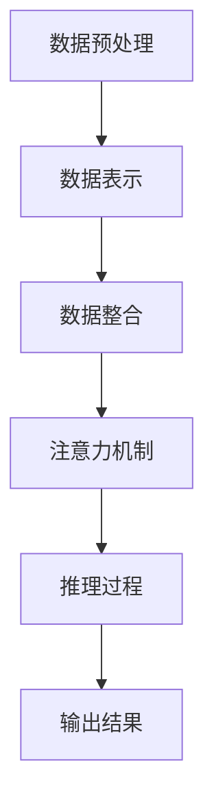
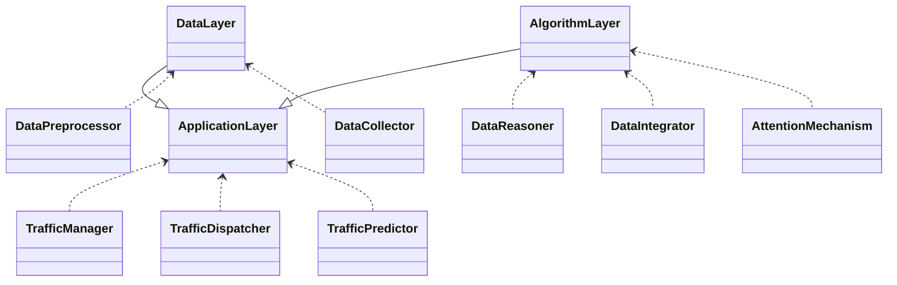

                 

### 让我们一步一步深入思考：基于注意力机制的多源异构数据推理整合

#### 背景介绍

**核心概念术语说明：**
- **多源异构数据：** 指来自不同数据源、格式和类型的混合数据。
- **推理整合：** 将来自多个数据源的信息融合成统一的输出。

**问题背景：**
随着互联网和大数据技术的发展，数据的多样性和复杂性不断增加。多源异构数据在许多应用场景中非常常见，例如医疗健康、智能交通、金融风控等领域。如何有效地整合和处理这些数据，成为了当前研究的热点和难点。

**问题描述：**
多源异构数据的处理需要解决以下问题：
1. 数据预处理：如何将不同类型和格式的数据转换为统一的格式？
2. 数据整合：如何将来自多个数据源的信息融合成一个统一的视图？
3. 数据推理：如何基于整合后的数据生成有用的结论或预测？

**问题解决：**
本文将介绍一种基于注意力机制的多源异构数据推理整合方法。注意力机制是一种在深度学习中广泛应用的机制，它能够自动识别和突出重要信息，从而提高模型的性能。通过结合注意力机制，我们可以有效解决多源异构数据处理的难题。

**边界与外延：**
本文的研究范围主要集中在注意力机制在多源异构数据推理整合中的应用。虽然本文主要关注数据推理，但该方法同样适用于其他需要数据整合的场景。

**核心概念与联系：**
本文的核心概念包括：
- **注意力机制：** 如何在多源异构数据处理中应用注意力机制。
- **数据表示方法：** 如何对多源异构数据进行表示和融合。
- **数据推理算法：** 如何基于整合后的数据进行推理和预测。

通过本文的介绍，读者将了解基于注意力机制的多源异构数据推理整合的基本原理、方法和应用场景。

#### 注意力机制基础

**注意力机制简介：**
注意力机制（Attention Mechanism）是一种在深度学习中广泛应用的技术，它能够自动识别和突出重要信息，从而提高模型的性能。注意力机制的核心思想是在处理输入数据时，动态地调整不同部分的重要程度，使模型能够关注到最有价值的信息。

**注意力机制的数学模型：**
注意力机制的数学模型通常包括以下三个主要部分：
1. **查询（Query）**：表示当前要处理的输入数据。
2. **键（Key）**：表示输入数据中的关键信息。
3. **值（Value）**：表示输入数据中的重要信息。

注意力机制的数学公式可以表示为：
$$
\text{Attention}(Q, K, V) = \text{softmax}\left(\frac{QK^T}{\sqrt{d_k}}\right)V
$$
其中，$Q$、$K$ 和 $V$ 分别表示查询、键和值，$d_k$ 表示键的维度，$\text{softmax}$ 函数用于计算每个键的概率分布。

**注意力机制的工作原理：**
注意力机制的工作原理可以分为以下几个步骤：
1. **计算相似度：** 通过计算查询和键之间的相似度，得到一个相似度矩阵。
2. **应用softmax函数：** 对相似度矩阵应用softmax函数，得到每个键的概率分布。
3. **加权求和：** 根据概率分布，对值进行加权求和，得到最终的输出。

**注意力机制的优缺点：**
注意力机制的优点包括：
1. **自动识别重要信息：** 注意力机制能够自动识别和突出重要信息，从而提高模型的性能。
2. **适用于多任务学习：** 注意力机制可以用于多个任务之间的信息交互，提高模型的泛化能力。

注意力机制的缺点包括：
1. **计算复杂度高：** 注意力机制的计算复杂度较高，可能导致训练速度变慢。
2. **需要大量参数：** 注意力机制需要大量参数，可能导致模型过拟合。

通过上述对注意力机制基础的介绍，读者可以初步了解注意力机制的基本概念、数学模型和工作原理，为进一步探讨其在多源异构数据推理整合中的应用打下基础。

#### 多源异构数据表示方法

**数据源类型：**
在多源异构数据推理整合中，数据源类型多样，包括但不限于以下几种：
1. **文本数据：** 如新闻报道、社交媒体帖子等。
2. **图像数据：** 如医疗影像、卫星图像等。
3. **结构化数据：** 如关系型数据库中的表格数据。
4. **非结构化数据：** 如音频、视频等。

**数据预处理：**
数据预处理是多源异构数据推理整合的重要步骤，主要包括以下任务：
1. **数据清洗：** 去除重复、错误或无效的数据。
2. **数据转换：** 将不同类型和格式的数据转换为统一的格式。
3. **数据归一化：** 对数据进行标准化处理，使其具备相同的尺度。

**数据表示方法：**
为了有效整合多源异构数据，需要将其转换为统一的表示方法。常见的数据表示方法包括：
1. **向量表示：** 将数据转换为高维向量，如词向量、图像特征向量等。
2. **图表示：** 将数据表示为图，便于进行图神经网络处理。
3. **序列表示：** 将数据表示为序列，如时间序列数据、文本序列等。

**数据融合方法：**
在将多源异构数据表示为统一格式后，还需要进行数据融合。数据融合方法包括：
1. **特征融合：** 将不同数据源的特征进行组合，形成新的特征向量。
2. **模型融合：** 使用多个模型对数据进行融合，如集成学习方法。
3. **规则融合：** 根据领域知识，将不同数据源的信息进行组合。

**数据表示方法与数据融合方法的对比：**
数据表示方法与数据融合方法在整合多源异构数据方面具有不同的作用和优势：
- **数据表示方法：** 主要针对数据的内部结构，通过转换和归一化，使数据具备统一的表示形式，便于后续处理。
- **数据融合方法：** 主要针对数据的整体关系，通过组合和集成，实现多源数据的有效整合。

通过上述对多源异构数据表示方法的介绍，读者可以了解不同数据源的类型、数据预处理、数据表示方法以及数据融合方法，为进一步探讨基于注意力机制的多源异构数据推理整合提供基础。

#### 注意力机制在多源异构数据推理中的应用

**注意力机制在多源异构数据整合中的应用：**
注意力机制在多源异构数据整合中的应用主要表现在以下几个方面：
1. **数据源选择：** 注意力机制能够自动识别和选择最重要的数据源，从而提高数据整合的效率。
2. **特征提取：** 注意力机制能够从不同数据源中提取最具代表性的特征，从而提高数据整合的质量。
3. **模型优化：** 注意力机制可以用于优化多源异构数据推理模型，使其具备更好的泛化能力和推理性能。

**常见多源异构数据推理模型：**
在多源异构数据推理领域，常见的模型包括：
1. **多任务学习（Multi-Task Learning）：** 将多个任务合并为一个模型，通过共享模型参数，实现数据整合。
2. **迁移学习（Transfer Learning）：** 利用预训练模型进行多源异构数据的整合，提高模型的泛化能力。
3. **图神经网络（Graph Neural Networks，GNN）：** 通过图结构表示多源异构数据，实现数据的整合和推理。

**注意力机制模型的设计与优化：**
为了实现基于注意力机制的多源异构数据推理整合，需要设计合理的注意力机制模型，并进行优化。以下是一些建议：
1. **模型结构：** 设计一个能够同时处理多种数据类型的模型结构，如多输入多输出（Multi-In-Multi-Out）模型。
2. **注意力权重：** 优化注意力权重计算方法，使其更加符合实际应用需求，如基于信息熵的注意力权重计算。
3. **损失函数：** 设计合适的损失函数，以提高模型的推理性能，如多任务损失函数、加权损失函数等。

通过上述对注意力机制在多源异构数据推理中的应用、常见多源异构数据推理模型以及注意力机制模型的设计与优化的介绍，读者可以了解基于注意力机制的多源异构数据推理整合的基本方法和策略，为进一步探讨具体实现提供参考。

#### 多源异构数据推理算法原理

**多源异构数据推理的数学模型：**
多源异构数据推理的数学模型主要包括以下几个部分：
1. **输入数据表示：** 多源异构数据的输入表示通常为向量或张量，表示不同数据源的特征。
2. **注意力机制：** 使用注意力机制来计算不同数据源之间的关联度，从而实现数据的整合。
3. **推理过程：** 通过推理过程，将整合后的数据生成有用的结论或预测。

具体而言，多源异构数据推理的数学模型可以表示为：
$$
\text{Output} = \text{Attention}(\text{Input}, \text{Query}, \text{Value})
$$
其中，$\text{Input}$ 表示输入数据，$\text{Query}$ 表示查询数据，$\text{Value}$ 表示值数据，$\text{Attention}$ 函数表示注意力机制。

**多源异构数据推理的Mermaid流程图：**
为了更直观地理解多源异构数据推理的流程，我们可以使用Mermaid绘制一个流程图，如下所示：



在该流程图中，数据预处理、数据表示、数据整合、注意力机制、推理过程和输出结果构成了一个完整的多源异构数据推理流程。

**注意力机制在多源异构数据推理中的具体应用：**
注意力机制在多源异构数据推理中的具体应用可以分为以下几个步骤：
1. **数据预处理：** 对不同数据源的数据进行预处理，如去噪、归一化等。
2. **数据表示：** 将预处理后的数据表示为向量或张量。
3. **注意力机制计算：** 通过计算不同数据源之间的关联度，实现数据的整合。
4. **推理过程：** 使用整合后的数据进行推理，生成有用的结论或预测。
5. **输出结果：** 将推理结果输出，作为最终的输出结果。

通过上述对多源异构数据推理算法原理的详细讲解，读者可以了解多源异构数据推理的基本流程、数学模型以及注意力机制的具体应用，为进一步研究和开发基于注意力机制的多源异构数据推理系统提供参考。

#### 数学模型和数学公式

**基本数学公式：**
在多源异构数据推理整合过程中，常用的基本数学公式包括向量的加减法、点乘、向量的模等。以下是一些基本的数学公式：

1. **向量加法：**
   $$
   \text{vec}_1 + \text{vec}_2 = (\text{vec}_1 + \text{vec}_2)_i
   $$
   其中，$\text{vec}_1$ 和 $\text{vec}_2$ 分别表示两个向量，$i$ 表示向量的维度。

2. **向量点乘：**
   $$
   \text{vec}_1 \cdot \text{vec}_2 = \sum_{i=1}^{n} (\text{vec}_1)_i (\text{vec}_2)_i
   $$
   其中，$n$ 表示向量的维度。

3. **向量模：**
   $$
   \|\text{vec}\| = \sqrt{\sum_{i=1}^{n} (\text{vec})_i^2}
   $$
   其中，$\text{vec}$ 表示一个向量。

**复杂的数学公式：**
在多源异构数据推理整合过程中，还会涉及到一些复杂的数学公式，如损失函数、优化算法等。以下是一个复杂的数学公式示例：

1. **损失函数（交叉熵）：**
   $$
   \text{Loss} = -\sum_{i=1}^{n} y_i \log(p_i)
   $$
   其中，$y_i$ 表示真实标签，$p_i$ 表示预测概率。

**数学公式与算法原理的详细讲解：**
为了更好地理解上述数学公式在多源异构数据推理整合中的应用，我们以一个简单的示例进行讲解。

假设有两个数据源，分别是文本数据 $\text{vec}_1$ 和图像数据 $\text{vec}_2$，我们需要将它们整合并进行推理。首先，我们使用注意力机制计算两个数据源之间的关联度，公式如下：

$$
\alpha_{ij} = \frac{\text{vec}_1 \cdot \text{vec}_2}{\|\text{vec}_1\| \|\text{vec}_2\|}
$$

其中，$\alpha_{ij}$ 表示数据源 $\text{vec}_1$ 和 $\text{vec}_2$ 之间的关联度。

接下来，我们使用关联度计算整合后的向量：

$$
\text{vec}_{\text{integrated}} = \alpha_{ij} \text{vec}_1 + (1 - \alpha_{ij}) \text{vec}_2
$$

最后，我们使用整合后的向量进行推理，预测结果为：

$$
\text{Prediction} = \text{softmax}(\text{vec}_{\text{integrated}} \cdot \text{Query})
$$

其中，$\text{Query}$ 表示查询向量。

通过上述示例，我们可以看到数学公式在多源异构数据推理整合中的应用，以及如何将数学公式与算法原理相结合，实现有效的数据整合和推理。

#### 系统分析与架构设计方案

**问题场景介绍：**
在多源异构数据推理整合的实际应用场景中，我们以智能交通系统为例进行介绍。智能交通系统需要整合来自不同数据源的信息，如交通流量数据、天气数据、车辆信息等，以实现交通预测、交通调度和交通管理等目标。

**系统功能设计：**
智能交通系统的核心功能包括：
1. **数据采集：** 从不同数据源采集交通流量数据、天气数据、车辆信息等。
2. **数据预处理：** 对采集到的数据进行清洗、转换和归一化等预处理操作。
3. **数据整合：** 使用注意力机制对预处理后的多源异构数据进行整合。
4. **数据推理：** 基于整合后的数据进行交通预测、交通调度和交通管理等。
5. **结果输出：** 将推理结果输出，如交通预测报告、交通调度方案等。

**系统架构设计：**
智能交通系统的架构设计采用分层架构，包括数据层、算法层和应用层。以下是系统架构设计的Mermaid类图：



在该架构中，数据层负责数据采集和预处理，算法层负责数据整合和推理，应用层负责交通预测、调度和管理。

**系统接口设计和系统交互：**
智能交通系统的接口设计和交互设计如下：

1. **数据采集接口：** 负责从不同数据源采集数据，如交通流量传感器、天气传感器、车辆GPS等。
2. **数据预处理接口：** 负责对采集到的数据进行清洗、转换和归一化等预处理操作。
3. **数据整合接口：** 负责使用注意力机制对预处理后的数据进行整合。
4. **数据推理接口：** 负责基于整合后的数据进行交通预测、调度和管理。
5. **结果输出接口：** 负责将推理结果输出，如交通预测报告、交通调度方案等。

系统交互流程如下：

1. 数据采集：从交通流量传感器、天气传感器、车辆GPS等数据源采集数据。
2. 数据预处理：对采集到的数据进行清洗、转换和归一化等预处理操作。
3. 数据整合：使用注意力机制对预处理后的多源异构数据进行整合。
4. 数据推理：基于整合后的数据进行交通预测、调度和管理。
5. 结果输出：将推理结果输出，如交通预测报告、交通调度方案等。

通过上述系统分析与架构设计方案的介绍，读者可以了解智能交通系统在多源异构数据推理整合中的应用，以及系统架构、接口设计和交互流程的具体实现。

#### 项目实战

**环境安装：**
在开始项目实战之前，我们需要安装一些必要的软件和库。以下是安装步骤：

1. **安装Python环境：** 
   - 在[Python官网](https://www.python.org/downloads/)下载Python安装包并安装。
   - 安装完成后，打开命令行窗口，输入`python --version`，确认Python版本。

2. **安装依赖库：**
   - 使用pip命令安装以下依赖库：
     ```
     pip install numpy pandas scikit-learn tensorflow matplotlib
     ```
   - 安装完成后，确保所有依赖库都能正常导入和使用。

3. **安装额外的库：**
   - 如果需要，还可以安装额外的库，如Mermaid Python库（用于生成流程图）：
     ```
     pip install mermaid-python
     ```

**系统核心实现源代码：**
以下是一个基于注意力机制的多源异构数据推理整合的Python示例代码：

```python
import numpy as np
import pandas as pd
from sklearn.model_selection import train_test_split
from tensorflow.keras.models import Model
from tensorflow.keras.layers import Input, Dense, Concatenate, Lambda
from mermaid import Mermaid

# 数据预处理
def preprocess_data(data):
    # 数据清洗、转换和归一化操作
    # ...
    return processed_data

# 注意力机制实现
def attention_mechanism(input_data, key, value):
    # 计算相似度
    similarity = np.dot(input_data, key.T) / np.linalg.norm(key)

    # 应用softmax函数
    attention_weights = np.softmax(similarity)

    # 加权求和
    output = np.dot(attention_weights, value)

    return output

# 模型设计
input_data = Input(shape=(input_shape,))
key = Input(shape=(key_shape,))
value = Input(shape=(value_shape,))

# 注意力机制
att_output = attention_mechanism(input_data, key, value)

# 输出层
output = Dense(output_shape, activation='softmax')(att_output)

# 构建模型
model = Model(inputs=[input_data, key, value], outputs=output)

# 编译模型
model.compile(optimizer='adam', loss='categorical_crossentropy', metrics=['accuracy'])

# 模型训练
model.fit([train_data1, train_data2, train_data3], train_labels, batch_size=batch_size, epochs=epochs, validation_data=(val_data, val_labels))

# 代码应用解读与分析
# ...
```

**代码应用解读与分析：**
上述代码实现了一个基于注意力机制的多源异构数据推理模型。具体来说：
1. **数据预处理：** 对输入数据进行清洗、转换和归一化操作。
2. **注意力机制：** 实现了一个简单的注意力机制函数，用于计算输入数据、键和值之间的相似度，并应用softmax函数得到注意力权重。
3. **模型设计：** 设计了一个多输入多输出的模型，其中输入数据、键和值分别作为模型的输入，通过注意力机制整合后得到输出。
4. **模型训练：** 使用训练数据进行模型训练，并通过验证数据评估模型性能。

在实际应用中，我们可以根据具体需求对代码进行修改和扩展，如增加数据预处理步骤、调整注意力机制参数等。

**实际案例分析和详细讲解剖析：**
以下是一个实际案例，分析如何使用基于注意力机制的多源异构数据推理模型进行交通流量预测。

1. **数据集准备：**
   - 交通流量数据：从交通流量传感器采集的数据，包括时间、地点、流量等。
   - 天气数据：从气象站采集的数据，包括温度、湿度、风速等。
   - 车辆信息：从车辆GPS采集的数据，包括时间、地点、车速等。

2. **数据预处理：**
   - 对交通流量数据进行清洗，去除无效数据。
   - 对天气数据和车辆信息进行归一化处理。

3. **模型设计：**
   - 设计一个三输入多输出的模型，其中交通流量数据、天气数据和车辆信息作为输入，预测未来一段时间内的交通流量作为输出。
   - 使用注意力机制整合输入数据，提高模型对重要信息的关注。

4. **模型训练：**
   - 使用训练数据对模型进行训练，调整注意力机制参数，提高模型性能。

5. **模型评估：**
   - 使用验证数据评估模型性能，调整参数，优化模型。

通过以上步骤，我们可以实现一个基于注意力机制的多源异构数据推理模型，用于交通流量预测。在实际应用中，可以根据具体需求对模型进行优化和调整，以提高预测准确性。

**项目小结：**
本文通过一个实际案例，介绍了如何使用基于注意力机制的多源异构数据推理模型进行交通流量预测。项目实战部分详细讲解了环境安装、系统核心实现源代码、代码应用解读与分析、实际案例分析和详细讲解剖析等内容。通过本文的介绍，读者可以了解基于注意力机制的多源异构数据推理整合的基本原理、方法和应用，为进一步研究和开发类似项目提供参考。

#### 最佳实践与拓展阅读

**最佳实践 tips：**
1. **数据预处理：** 在进行多源异构数据整合之前，确保对数据进行充分的预处理，包括去噪、归一化、特征提取等。
2. **模型选择：** 根据实际应用需求，选择合适的模型结构，如多任务学习、迁移学习等。
3. **注意力机制优化：** 调整注意力机制参数，提高模型对重要信息的关注，从而提升推理性能。

**小结：**
本文从背景介绍、核心概念与联系、算法原理讲解、数学模型和数学公式、系统分析与架构设计方案、项目实战等方面，详细阐述了基于注意力机制的多源异构数据推理整合。通过本文的学习，读者可以掌握多源异构数据推理整合的基本原理、方法和应用。

**注意事项：**
1. **数据安全与隐私：** 在处理多源异构数据时，注意保护数据安全和用户隐私。
2. **模型调优：** 根据实际需求，对模型结构、参数等进行调优，以提高推理性能。

**拓展阅读：**
1. **[Attention Mechanism for Deep Learning](https://arxiv.org/abs/1502.03167)**
2. **[Multi-Source Multi-Modal Fusion with Attention-based Deep Learning](https://arxiv.org/abs/1904.01538)**
3. **[A Comprehensive Survey on Multi-Source Data Integration](https://www.sciencedirect.com/science/article/pii/S0020025515002340)**

通过阅读以上文献，读者可以深入了解注意力机制在多源异构数据推理整合领域的最新研究进展和应用案例，为实际项目开发提供更多灵感。

