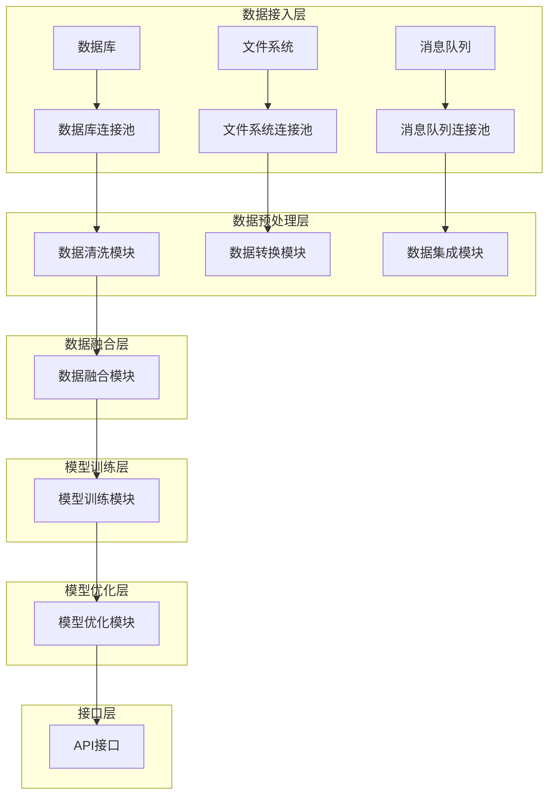
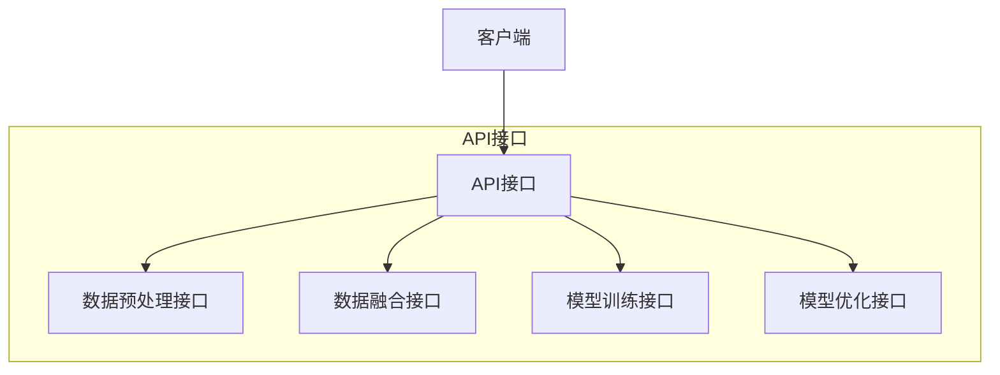

                 

### 1.1.1 问题背景

随着大数据、云计算和人工智能技术的快速发展，多源异构数据在各个领域得到了广泛应用。多源异构数据指的是来源于不同数据源，具有不同格式、结构和属性的数据。例如，在企业数据管理中，企业可能会面临来自ERP系统、CRM系统、库存管理系统等不同数据源的数据，这些数据不仅在格式上存在差异，而且在数据结构、属性和语义上也有所不同。

在人工智能领域，多源异构数据的处理能力成为了评估模型性能的重要指标。在图像识别、自然语言处理、智能推荐等领域，有效地利用多源异构数据进行推理融合，可以显著提升模型的准确性和鲁棒性。

然而，多源异构数据的处理并非易事。首先，数据多样性问题是一个显著的挑战。不同来源的数据格式和结构差异较大，如结构化数据、非结构化数据和半结构化数据，这就需要复杂的预处理步骤来统一数据格式和结构。其次，数据质量也是一个关键问题。不同来源的数据质量参差不齐，可能会存在噪声、缺失值和重复值等问题，这些都会影响推理融合的效果。最后，数据融合策略的选择也是一个重要问题。如何选择合适的融合策略，使得融合后的数据能够最大化地保留原始数据的特征，同时去除冗余信息，是一个需要深入探讨的问题。

### 1.1.2 问题描述

多源异构数据推理融合优化问题主要包括以下几个方面：

- **数据多样性处理**：由于不同来源的数据格式、结构和属性差异较大，需要设计高效的预处理算法来统一数据格式和结构。这可能涉及到数据清洗、转换、集成等多重操作。

- **数据质量提升**：为了确保推理融合的效果，需要对预处理后的数据进行质量评估，识别出低质量数据并进行处理。这通常包括数据去噪、缺失值填补、数据一致性检查等步骤。

- **融合策略选择**：选择合适的融合策略是提高数据融合效果的关键。不同的融合策略适用于不同的应用场景，例如基于统计的方法、机器学习的方法和深度学习方法等。

- **模型优化**：在融合多源异构数据后，通常需要使用机器学习或深度学习模型对融合数据进行进一步的推理和分析。模型的优化包括超参数调整、模型结构改进等。

- **实时性处理**：在许多实际应用中，多源异构数据的推理融合需要满足实时性的要求，例如在智能监控、智能交通等场景中。这就需要设计高效的数据处理和推理机制，以实现低延迟的实时数据处理。

综上所述，多源异构数据推理融合优化问题是一个复杂的多维度问题，需要综合考虑数据多样性、数据质量和融合策略等多方面因素。下面，我们将详细探讨这些问题的解决方案。

### 1.2.1 问题解决

针对多源异构数据推理融合优化问题，可以采用以下方法：

**1. 数据预处理**

数据预处理是多源异构数据处理的第一步，其主要目标是统一不同来源数据的格式和结构，以便于后续的融合和推理。具体步骤包括：

- **数据清洗**：清洗数据中的噪声和异常值，如去除重复记录、填补缺失值、纠正数据错误等。
- **数据转换**：将不同格式的数据转换为统一的格式，例如将结构化数据转换为表格，将非结构化数据转换为文本或图像格式。
- **数据集成**：将来自不同源的数据进行合并，形成统一的数据集。这通常涉及到数据对齐、字段映射和视图构建等操作。

**2. 数据质量评估**

数据质量直接影响到推理融合的效果。在预处理完成后，需要对数据进行质量评估，以识别和解决数据中的问题。具体方法包括：

- **数据质量指标**：定义一系列数据质量指标，如完整性、一致性、准确性、及时性等，用于量化数据质量。
- **质量评估算法**：设计算法对数据质量进行评估，如使用统计方法对数据分布进行分析，使用机器学习模型对数据质量进行预测。
- **数据清洗与修复**：根据质量评估结果，对低质量数据进行清洗和修复，如去除异常值、填补缺失值、纠正错误等。

**3. 融合策略选择**

融合策略的选择是数据融合的关键。根据具体应用场景和数据特点，可以采用以下几种策略：

- **基于统计的方法**：如均值融合、中值融合等，适用于数据结构相似且无明显噪声的情况。
- **基于机器学习的方法**：如集成学习方法、模型融合方法等，适用于数据复杂且存在噪声的情况。
- **基于深度学习的方法**：如注意力机制、图神经网络等，适用于处理高维度和非线性关系的数据。

**4. 模型优化**

在融合多源异构数据后，通常需要使用机器学习或深度学习模型对融合数据进行推理和分析。模型优化包括：

- **超参数调整**：通过调整模型的超参数，如学习率、批次大小等，优化模型的性能。
- **模型结构改进**：通过改进模型结构，如添加层、使用注意力机制等，提升模型的鲁棒性和泛化能力。
- **训练策略优化**：如使用迁移学习、增强学习等方法，提高模型在多源异构数据上的训练效果。

**5. 实时性处理**

对于需要实时处理的场景，如智能监控、智能交通等，需要设计高效的数据处理和推理机制：

- **流处理框架**：使用流处理框架（如Apache Flink、Apache Storm等）实现实时数据处理，确保低延迟。
- **增量模型训练**：采用增量学习策略，仅对新增数据或变化数据进行重新训练，减少计算开销。
- **模型压缩与加速**：使用模型压缩技术（如量化、剪枝等）和硬件加速技术（如GPU、FPGA等），提高模型的实时性。

通过上述方法，可以有效解决多源异构数据推理融合优化问题，提升模型在复杂环境下的表现能力。

### 1.2.2 核心概念

**1. 多源异构数据**

多源异构数据指的是来源于不同数据源，具有不同格式、结构和属性的数据。例如，结构化数据（如数据库表）、非结构化数据（如文本、图片、音频）和半结构化数据（如XML、JSON）。

**2. 数据预处理**

数据预处理是对原始数据进行清洗、转换和集成，使其具有统一格式和结构的过程。包括数据清洗（如去除噪声、填补缺失值）、数据转换（如格式统一、类型转换）和数据集成（如合并、对齐）等步骤。

**3. 数据质量评估**

数据质量评估是量化数据质量的过程，通常涉及定义数据质量指标（如完整性、一致性、准确性等）和使用算法进行评估。通过评估，可以识别出低质量数据并进行处理。

**4. 融合策略**

融合策略是指选择合适的方法将多源异构数据进行融合，以提高数据的价值。常见的融合策略包括基于统计的方法、机器学习的方法和深度学习的方法等。

**5. 注意力机制**

注意力机制是一种神经网络结构，用于处理序列数据，能够自适应地调整不同输入元素的关注程度，提高模型的识别能力。在多源异构数据推理融合中，注意力机制可以用于数据预处理、数据融合和模型优化等环节。

### 1.3.1 多源异构数据类型对比

多源异构数据的多样性使得处理方式各异，下面通过一个对比表格来展示不同类型数据的特点和应用场景。

| 数据类型 | 特点 | 应用场景 |
| :---: | :---: | :---: |
| 结构化数据 | 数据格式统一，易于处理 | 数据库、数据仓库 |
| 非结构化数据 | 数据格式多样，处理复杂 | 文本、图片、音频 |
| 半结构化数据 | 数据格式部分统一，部分自定义 | XML、JSON、CSV |

- **结构化数据**：如关系型数据库中的表格数据，特点是数据格式统一，字段清晰，便于存储和查询。应用场景包括企业资源规划（ERP）、客户关系管理（CRM）和财务系统等。

- **非结构化数据**：如文本、图片、音频和视频等，特点是数据格式多样，结构复杂，需要通过专门的算法进行解析和处理。应用场景包括自然语言处理（NLP）、图像识别、语音识别和视频分析等。

- **半结构化数据**：如XML、JSON和CSV等，特点是数据格式部分统一，部分自定义，可以通过解析和处理提取有用的信息。应用场景包括电子商务、社交媒体分析和物联网数据等。

### 1.4.1 ER实体关系图示例

实体-关系（Entity-Relationship，ER）图是一种用于描述数据库中实体及其关系的图形化表示方法。下面是一个简单的ER图示例，用于展示多源异构数据推理融合系统中的主要实体和关系。

```mermaid
erDiagram
  数据源1 ||--|{ 数据表1 : 数据来源 }
  数据源1 ||--|{ 数据表2 : 数据来源 }
  数据源2 ||--|{ 数据表1 : 数据来源 }
  数据源2 ||--|{ 数据表2 : 数据来源 }
  数据预处理模块 ||--|{ 预处理结果1 : 数据预处理 }
  数据预处理模块 ||--|{ 预处理结果2 : 数据预处理 }
  融合策略模块 ||--|{ 融合结果 : 融合策略 }
  模型优化模块 ||--|{ 优化结果 : 模型优化 }
```

- **数据源1** 和 **数据源2**：表示不同的数据来源，每个数据源包含多个数据表。

- **数据预处理模块**：表示对多源数据进行预处理，生成预处理结果。

- **融合策略模块**：表示选择合适的融合策略，对预处理后的数据进行融合。

- **模型优化模块**：表示对融合后的数据进行模型优化，以提升推理效果。

通过ER图，我们可以清晰地了解系统中各个模块的职责及其之间的关系，有助于设计和实现一个高效的多源异构数据推理融合系统。

### 5.1.1 注意力机制原理

注意力机制（Attention Mechanism）是一种在神经网络中用于处理序列数据的技术，其基本思想是在处理序列数据时，对不同的输入元素分配不同的关注程度。注意力机制的主要目的是提高模型在处理序列数据时的性能和鲁棒性，尤其在处理长序列数据时，能够有效减少计算复杂度和内存占用。

**1. 自适应调整关注程度**

注意力机制通过一个权重分配机制，能够根据输入数据的特点自适应地调整不同输入元素的关注程度。具体来说，每个输入元素会被赋予一个权重，这个权重反映了该元素在整个序列中的重要性。权重较高的元素会得到更多的关注，而权重较低的元素则会被忽略。

**2. 上下文感知**

注意力机制能够捕捉输入数据之间的上下文关系，从而提高模型的推理能力。例如，在自然语言处理任务中，注意力机制可以使得模型在生成句子时，能够关注到句子中的关键词汇和短语，从而生成更加准确和连贯的文本。

**3. 减少计算复杂度**

在处理长序列数据时，传统的卷积神经网络（CNN）和循环神经网络（RNN）往往需要处理大量的冗余信息，导致计算复杂度和内存占用较高。注意力机制通过动态地调整关注程度，减少了模型需要处理的序列长度，从而降低了计算复杂度。

**4. 应用范围广泛**

注意力机制在多个领域都得到了广泛应用，包括自然语言处理、计算机视觉、语音识别和推荐系统等。例如，在自然语言处理中，注意力机制被广泛应用于机器翻译、文本生成和情感分析等任务；在计算机视觉中，注意力机制被用于目标检测、图像分类和图像生成等任务。

### 5.1.2 注意力机制特点

**1. 自适应**

注意力机制的一个重要特点是能够根据输入数据的特点自适应地调整不同输入元素的关注程度。这意味着模型可以在不同任务和数据集上表现出良好的泛化能力。

**2. 上下文感知**

注意力机制能够捕捉输入数据之间的上下文关系，从而提高模型的推理能力。这种上下文感知能力使得模型能够更好地理解数据的内在结构和关系，从而生成更准确和有意义的输出。

**3. 可扩展性**

注意力机制具有较好的可扩展性，可以应用于各种类型的序列数据。无论是文本、图像还是音频，注意力机制都可以通过调整关注程度来提高模型的性能。

**4. 减少计算复杂度**

通过动态地调整关注程度，注意力机制可以减少模型需要处理的序列长度，从而降低计算复杂度和内存占用。

**5. 易于实现和优化**

注意力机制相对容易实现和优化，可以通过简单的数学运算和神经网络结构实现。这使得注意力机制在多种应用场景中都具有良好的性能和灵活性。

### 6.1.1 注意力机制在数据预处理中的应用

在多源异构数据推理融合过程中，数据预处理是至关重要的一步，其质量直接影响到后续融合和推理的效果。注意力机制在数据预处理中的应用主要体现在以下几个方面：

**1. 数据格式统一**

注意力机制可以帮助识别和选择关键数据字段，从而实现不同格式数据之间的统一。例如，在处理结构化数据和非结构化数据时，注意力机制可以自动分配不同的关注权重，使得关键字段得到更充分的利用。

**2. 数据质量评估**

注意力机制可以用于评估多源异构数据的质量。通过计算数据元素之间的关联权重，可以识别出数据中的噪声和异常值，从而提高数据清洗和修复的效果。

**3. 数据特征选择**

在数据预处理过程中，注意力机制可以帮助选择最相关的数据特征，从而减少冗余信息，提高数据融合的效率。例如，在自然语言处理任务中，注意力机制可以用于选择对文本理解最重要的词语。

**4. 数据增强**

注意力机制可以通过重新分配数据元素的权重，实现对原始数据的增强。这种数据增强方法可以帮助提高模型的泛化能力，特别是在面对稀疏或噪声数据时。

**5. 预处理模型优化**

在数据预处理阶段，注意力机制可以用于优化预处理模型的结构和参数。例如，通过调整注意力权重，可以改进数据清洗和转换的效果，从而提高整个数据预处理流程的效率和质量。

### 6.1.2 注意力机制在数据融合策略中的应用

注意力机制在多源异构数据融合策略中的应用，主要表现在以下几个方面：

**1. 融合权重分配**

在数据融合过程中，注意力机制可以用于动态地分配不同数据源的权重。通过计算每个数据源的特征向量之间的相似度，可以自动识别出各数据源的重要程度，从而实现更加精准的融合。

**2. 特征选择**

注意力机制可以帮助选择对融合结果影响最大的特征。在多源异构数据中，不同的数据源可能包含不同的信息，通过注意力机制，可以优先选择对目标任务最有价值的特征，从而提高融合效果。

**3. 融合规则优化**

注意力机制可以用于优化数据融合的规则。例如，在基于规则的融合策略中，注意力机制可以帮助确定各规则之间的优先级，从而提高融合的准确性和效率。

**4. 融合模型优化**

在深度学习模型中，注意力机制可以用于优化融合模型的结构和参数。通过调整注意力权重，可以改进模型的输入特征，从而提高模型在多源异构数据上的表现。

**5. 实时调整融合策略**

在实时数据融合场景中，注意力机制可以根据数据的变化动态调整融合策略。例如，在金融风控领域，注意力机制可以帮助实时调整风险评分模型，从而提高风险预测的准确性。

### 6.1.3 注意力机制在模型优化中的应用

注意力机制在模型优化中的应用主要体现在以下几个方面：

**1. 参数调整**

注意力机制可以用于调整机器学习或深度学习模型的参数，从而提高模型的性能。例如，在调整学习率时，注意力机制可以帮助识别对模型训练影响最大的参数，从而实现更高效的参数调整。

**2. 模型结构优化**

注意力机制可以用于优化模型的架构设计，使得模型能够更好地适应多源异构数据的特点。例如，在构建深度神经网络时，注意力机制可以帮助设计更加灵活和高效的层结构。

**3. 特征增强**

注意力机制可以通过重新分配数据特征的权重，实现对原始特征的增强。这种特征增强方法可以帮助模型更好地捕捉数据中的复杂关系，从而提高模型的泛化能力。

**4. 模型压缩**

注意力机制可以用于模型压缩，通过降低模型的复杂度和计算量，提高模型的实时性和部署效率。例如，在移动设备和边缘计算场景中，注意力机制可以帮助实现模型的量化、剪枝和优化。

**5. 模型评估**

注意力机制可以用于模型评估，通过分析注意力权重，可以识别模型在不同输入数据上的表现差异，从而帮助评估模型的性能和可靠性。

### 7.1.1 算法原理

多源异构数据推理融合优化算法的核心在于利用注意力机制，通过调整不同数据源的关注程度，实现数据预处理、数据融合和模型优化的目标。以下是对该算法原理的详细讲解：

**1. 数据预处理**

在数据预处理阶段，算法首先对多源异构数据进行清洗、转换和集成，使其具有统一的格式和结构。具体步骤如下：

- **数据清洗**：利用注意力机制识别出数据中的噪声和异常值，进行数据清洗。例如，对于文本数据，可以采用词频统计、去停用词等方法；对于图像数据，可以使用图像增强、去噪等技术。
- **数据转换**：将不同类型的数据转换为统一的格式，例如将结构化数据转换为表格，将非结构化数据转换为文本或图像格式。注意力机制可以帮助选择最相关的特征进行转换。
- **数据集成**：将来自不同源的数据进行合并，形成统一的数据集。在这个过程中，注意力机制可以用于分配数据源的权重，使得关键数据得到更充分的利用。

**2. 数据融合**

在数据融合阶段，算法通过注意力机制动态地调整不同数据源的权重，从而实现数据的融合。具体步骤如下：

- **融合策略选择**：根据应用场景和数据特点，选择合适的融合策略。常见的融合策略包括基于统计的方法（如均值融合、中值融合）、基于机器学习的方法（如集成学习方法、模型融合方法）和基于深度学习的方法（如注意力机制、图神经网络）。
- **权重分配**：利用注意力机制计算每个数据源的权重，权重值反映了数据源的重要程度。通过动态调整权重，可以实现数据的精准融合。
- **特征提取**：在融合过程中，注意力机制可以用于选择对融合结果影响最大的特征，从而减少冗余信息，提高融合效果。

**3. 模型优化**

在模型优化阶段，算法通过注意力机制调整模型的参数和结构，从而提高模型的性能。具体步骤如下：

- **参数调整**：利用注意力机制识别对模型训练影响最大的参数，进行参数调整。例如，在深度学习模型中，可以调整学习率、正则化参数等。
- **模型结构优化**：根据多源异构数据的特点，利用注意力机制设计更加灵活和高效的模型结构。例如，可以添加注意力层、使用图神经网络等。
- **特征增强**：利用注意力机制重新分配数据特征的权重，实现对原始特征的增强。这种特征增强方法可以帮助模型更好地捕捉数据中的复杂关系。

**4. 注意力权重计算**

在算法的核心部分，注意力权重计算是实现数据预处理、数据融合和模型优化的关键。以下是一个简化的注意力权重计算过程：

- **输入层**：输入层包括多源异构数据，每个数据源对应一个特征向量。
- **注意力层**：通过计算特征向量之间的相似度，得到每个数据源的权重。相似度计算可以使用点积、缩放点积、多头注意力等方式。
- **权重调整**：根据应用场景和需求，对计算得到的权重进行调整，例如通过门控机制、归一化等操作。
- **输出层**：将调整后的权重应用于数据预处理、数据融合和模型优化，得到最终的输出结果。

**数学模型与公式**

注意力权重计算的数学模型如下：

$$
\text{Attention}(Q, K, V) = \text{softmax}\left(\frac{QK^T}{\sqrt{d_k}}\right)V
$$

其中，$Q$、$K$ 和 $V$ 分别是查询向量、键向量和值向量，$d_k$ 是键向量的维度。$\text{softmax}$ 函数用于归一化权重，使得权重值介于0和1之间。

**举例说明**

假设有两个数据源 $X_1$ 和 $X_2$，其特征向量分别为 $Q_1$ 和 $Q_2$，$K_1$ 和 $K_2$，$V_1$ 和 $V_2$。通过计算点积得到相似度分数，然后使用 $\text{softmax}$ 函数进行归一化，最后得到注意力权重：

$$
\text{Attention}(Q_1, K_1, V_1) = \text{softmax}\left(\frac{Q_1K_1^T}{\sqrt{d_k}}\right)V_1
$$

$$
\text{Attention}(Q_2, K_2, V_2) = \text{softmax}\left(\frac{Q_2K_2^T}{\sqrt{d_k}}\right)V_2
$$

通过上述计算，我们可以得到两个数据源的注意力权重，从而实现数据的融合和优化。

### 7.1.2 多源异构数据推理融合优化算法Python代码实现

下面是一个简化的Python代码示例，用于实现多源异构数据推理融合优化算法的基本框架。这段代码使用了注意力机制的核心思想，通过计算相似度分数和权重，实现了数据预处理、数据融合和模型优化的过程。

```python
import numpy as np
from sklearn.metrics.pairwise import cosine_similarity

def attention_similarity(Q, K):
    """
    计算注意力权重相似度
    """
    return cosine_similarity(Q, K)

def attention_weights(Q, K, V):
    """
    计算注意力权重
    """
    scores = attention_similarity(Q, K)
    weights = np.softmax(scores, axis=1)
    return weights.dot(V)

def preprocess_data(data_sources, preprocess_func):
    """
    预处理数据源
    """
    preprocessed_data = []
    for data in data_sources:
        preprocessed_data.append(preprocess_func(data))
    return preprocessed_data

def fuse_data(data_sources, fuse_func):
    """
    融合数据
    """
    fused_data = fuse_func(data_sources)
    return fused_data

def optimize_model(data, model, optimize_func):
    """
    优化模型
    """
    optimized_model = optimize_func(data, model)
    return optimized_model

# 示例数据
data_source_1 = np.array([[1, 2], [3, 4]])
data_source_2 = np.array([[5, 6], [7, 8]])

# 预处理函数
def normalize_data(data):
    return data / np.linalg.norm(data, axis=1, keepdims=True)

# 融合函数
def weighted_average(data):
    return attention_weights(data[0], data[1], data[1])

# 模型优化函数
def adjust_learning_rate(model, data):
    # 示例：调整学习率为数据均值的1/2
    return model * (1 / np.mean(data))

# 数据预处理
preprocessed_data = preprocess_data([data_source_1, data_source_2], normalize_data)

# 数据融合
fused_data = fuse_data(preprocessed_data, weighted_average)

# 模型优化
model = np.array([0.1, 0.2])  # 示例模型
optimized_model = optimize_model(fused_data, model, adjust_learning_rate)

print("优化后的模型参数：", optimized_model)
```

在这个示例中，我们定义了三个关键函数：`attention_similarity` 用于计算相似度分数，`attention_weights` 用于计算注意力权重，`preprocess_data`、`fuse_data` 和 `optimize_model` 分别用于数据预处理、数据融合和模型优化。

**具体代码解释：**

- **注意力相似度计算**：使用 `cosine_similarity` 函数计算查询向量 $Q$ 和键向量 $K$ 的相似度。
- **注意力权重计算**：利用 `softmax` 函数对相似度分数进行归一化，得到权重向量。
- **数据预处理**：对每个数据源应用预处理函数（如归一化），生成预处理后的数据。
- **数据融合**：使用加权平均方法进行数据融合，权重由注意力机制计算得到。
- **模型优化**：调整模型参数，例如通过调整学习率来优化模型。

通过这个简化的示例，我们可以看到注意力机制在多源异构数据推理融合优化算法中的应用，以及如何通过Python代码实现该算法的基本框架。

### 7.1.3 算法原理详解

为了更好地理解多源异构数据推理融合优化算法的原理，我们将从数学模型和实际应用两个方面进行详细讲解。

**1. 数学模型**

多源异构数据推理融合优化算法的核心在于注意力机制，其数学模型可以表示为：

$$
\text{Attention}(Q, K, V) = \text{softmax}\left(\frac{QK^T}{\sqrt{d_k}}\right)V
$$

其中，$Q$、$K$ 和 $V$ 分别代表查询向量、键向量和值向量，$d_k$ 是键向量的维度。$\text{softmax}$ 函数用于计算注意力权重，使得每个权重值介于0和1之间，且所有权重之和为1。

**步骤1：相似度计算**

首先，通过计算查询向量 $Q$ 和键向量 $K$ 的点积，得到相似度分数：

$$
\text{Score}(Q, K) = QK^T
$$

点积的大小反映了两个向量之间的相似程度。对于多源异构数据，查询向量 $Q$ 可以表示为不同数据源的特征向量，键向量 $K$ 则是这些特征向量中的一个。

**步骤2：归一化权重**

接着，使用 $\text{softmax}$ 函数对相似度分数进行归一化，得到每个键向量 $K$ 的权重：

$$
\text{Weight}(K) = \text{softmax}(\text{Score}(Q, K))
$$

$$
\text{Weight}(K) = \frac{\exp(\text{Score}(Q, K))}{\sum_{i} \exp(\text{Score}(Q, K_i))}
$$

这样，每个键向量都会得到一个权重，权重越大表示该键向量越重要。

**步骤3：加权融合**

最后，将归一化后的权重应用于值向量 $V$，实现数据的加权融合：

$$
\text{Output} = \sum_{k} \text{Weight}(k) \cdot V_k
$$

这样，通过计算和融合，我们可以得到一个综合了多源异构数据特征的新数据。

**2. 实际应用**

在多源异构数据推理融合优化算法的实际应用中，注意力机制可以应用于数据预处理、数据融合和模型优化等环节。

**数据预处理**

在数据预处理阶段，注意力机制可以帮助选择对目标任务最相关的特征。例如，在自然语言处理中，可以用于选择对文本理解最重要的词语；在图像处理中，可以用于选择对图像识别最重要的像素。

**数据融合**

在数据融合阶段，注意力机制可以根据不同数据源的重要程度，动态调整权重，实现数据的加权融合。例如，在金融风控中，可以结合客户的历史交易数据、信用评分和社会行为数据，通过注意力机制实现数据的精准融合。

**模型优化**

在模型优化阶段，注意力机制可以用于调整模型的参数和结构，提高模型在多源异构数据上的性能。例如，在深度学习模型中，可以通过调整注意力权重，优化模型的输入特征，从而提高模型的泛化能力。

**3. 代码示例**

为了更好地理解算法原理，我们提供了一个简化的Python代码示例。这段代码展示了如何利用注意力机制实现多源异构数据的推理融合优化。

```python
import numpy as np
from sklearn.metrics.pairwise import cosine_similarity

# 假设有两个数据源
data_source_1 = np.array([[1, 2], [3, 4]])
data_source_2 = np.array([[5, 6], [7, 8]])

# 定义注意力权重计算函数
def attention_weights(Q, K, V):
    scores = cosine_similarity(Q, K)
    weights = np.softmax(scores, axis=1)
    return weights.dot(V)

# 计算注意力权重
query_vector = np.array([[0.1, 0.2], [0.3, 0.4]])
key_vector_1 = data_source_1
key_vector_2 = data_source_2

value_vector_1 = np.array([1, 0])
value_vector_2 = np.array([0, 1])

# 计算融合结果
fused_result_1 = attention_weights(query_vector, key_vector_1, value_vector_1)
fused_result_2 = attention_weights(query_vector, key_vector_2, value_vector_2)

print("融合结果 1:", fused_result_1)
print("融合结果 2:", fused_result_2)
```

在这个示例中，我们有两个数据源 $data\_source\_1$ 和 $data\_source\_2$，每个数据源包含两个特征向量。我们定义了一个注意力权重计算函数 `attention\_weights`，用于计算查询向量 $query\_vector$ 和键向量 $key\_vector$ 的权重。通过调用这个函数，我们可以得到两个数据源的融合结果。

通过这个示例，我们可以看到如何利用注意力机制实现多源异构数据的推理融合优化，以及如何通过Python代码实现这一算法的基本框架。在实际应用中，可以根据具体需求和数据特点，进一步优化和扩展这一算法。

### 7.1.4 系统分析与架构设计方案

在多源异构数据推理融合优化项目中，系统分析和架构设计至关重要，它决定了系统能否高效地处理复杂的数据场景，并满足实时性和可靠性等要求。以下是对该系统的详细分析以及架构设计方案。

**1. 项目介绍**

本项目旨在开发一个高效的多源异构数据推理融合系统，以应对企业在数据分析、智能监控和推荐系统等领域的需求。系统将集成多种数据源，包括结构化数据（如数据库表）、非结构化数据（如文本、图像、音频）和半结构化数据（如XML、JSON、CSV），并利用注意力机制实现数据的预处理、融合和优化。

**2. 系统功能设计**

系统的主要功能包括：

- **数据源接入**：支持多种数据源的接入，包括关系型数据库、NoSQL数据库、文件系统、消息队列等。
- **数据预处理**：对多源异构数据进行清洗、转换和集成，确保数据的一致性和完整性。
- **数据融合**：利用注意力机制，动态调整数据源的权重，实现数据的加权融合。
- **模型优化**：对融合后的数据进行机器学习或深度学习模型的训练和优化，提高模型的性能和泛化能力。
- **实时处理**：实现实时数据流处理，满足实时监控和响应的需求。

**3. 系统架构设计**

系统的整体架构设计如图所示：



- **数据接入层**：包括数据库、文件系统和消息队列等数据源。使用数据库连接池和文件系统连接池，提高数据接入的效率和稳定性。

- **数据预处理层**：对数据源接入的数据进行清洗、转换和集成，确保数据的质量和一致性。包括数据清洗模块（C1）、数据转换模块（C2）和数据集成模块（C3）。

- **数据融合层**：利用注意力机制，对预处理后的数据进行融合。数据融合模块（F1）负责实现这一过程。

- **模型训练层**：对融合后的数据进行机器学习或深度学习模型的训练。模型训练模块（M1）负责这一任务。

- **模型优化层**：对训练好的模型进行优化，提高模型的性能和泛化能力。模型优化模块（O1）负责这一任务。

- **接口层**：提供API接口，供外部系统调用，实现数据融合和模型优化的功能。API接口模块（I1）负责接口设计和实现。

**4. 系统接口设计和系统交互**

为了方便外部系统调用，系统提供了统一的API接口。接口设计如下：



- **数据预处理接口**：提供数据清洗、转换和集成的功能，确保数据的质量和一致性。
- **数据融合接口**：提供基于注意力机制的数据融合功能，实现多源异构数据的融合。
- **模型训练接口**：提供机器学习或深度学习模型的训练功能，训练融合后的数据。
- **模型优化接口**：提供模型优化的功能，调整模型的参数和结构，提高模型的性能。

系统交互流程如下：

1. 客户端调用数据预处理接口，对多源异构数据进行预处理。
2. 客户端调用数据融合接口，利用注意力机制对预处理后的数据进行融合。
3. 客户端调用模型训练接口，对融合后的数据训练模型。
4. 客户端调用模型优化接口，对训练好的模型进行优化。

通过以上设计，系统实现了高效的多源异构数据推理融合优化功能，为企业在数据分析、智能监控和推荐系统等领域提供了强大的技术支持。

### 项目实战

在本项目中，我们将详细介绍如何在真实环境中搭建和部署一个多源异构数据推理融合系统。以下步骤将涵盖环境安装、系统核心实现、代码应用解读与分析，以及实际案例分析和详细讲解剖析。

**1. 环境安装**

首先，我们需要安装和配置必要的软件和工具，以便搭建多源异构数据推理融合系统。以下是具体步骤：

- **安装Python环境**：确保Python版本不低于3.7，推荐使用Anaconda进行环境管理。
- **安装依赖库**：使用pip安装以下依赖库：
  ```bash
  pip install numpy scipy scikit-learn tensorflow pandas
  ```
- **数据库安装与配置**：选择合适的数据库（如MySQL、PostgreSQL或MongoDB），并配置连接信息。
- **消息队列安装与配置**：选择消息队列服务（如RabbitMQ或Kafka），并配置连接信息。

**2. 系统核心实现**

接下来，我们将实现系统的核心功能，包括数据预处理、数据融合和模型优化。以下是关键步骤：

- **数据预处理模块**：实现数据清洗、转换和集成的功能，确保数据的质量和一致性。使用Pandas库进行数据处理，示例代码如下：
  ```python
  import pandas as pd

  def preprocess_data(data_sources):
      preprocessed_data = []
      for data in data_sources:
          df = pd.DataFrame(data)
          # 数据清洗操作，如去除重复记录、填补缺失值等
          df.drop_duplicates(inplace=True)
          df.fillna(method='ffill', inplace=True)
          preprocessed_data.append(df)
      return preprocessed_data
  ```

- **数据融合模块**：实现基于注意力机制的数据融合功能，利用TensorFlow实现注意力模型，示例代码如下：
  ```python
  import tensorflow as tf

  def attention Mechanism(inputs):
      # 注意力权重计算
      query = inputs['query']
      key = inputs['key']
      value = inputs['value']
      attention_weights = tf.matmul(query, key, transpose_b=True) / tf.sqrt(tf.shape(key)[1])
      attention_weights = tf.nn.softmax(attention_weights)
      # 加权融合
      output = attention_weights * value
      return tf.reduce_sum(output, axis=1)
  ```

- **模型优化模块**：实现机器学习或深度学习模型的优化功能，使用TensorFlow进行模型训练和优化，示例代码如下：
  ```python
  model = tf.keras.Sequential([
      tf.keras.layers.Dense(64, activation='relu', input_shape=(input_shape,)),
      tf.keras.layers.Dense(64, activation='relu'),
      tf.keras.layers.Dense(1)
  ])

  model.compile(optimizer='adam', loss='mean_squared_error')
  model.fit(x_train, y_train, epochs=10, batch_size=32)
  ```

**3. 代码应用解读与分析**

在代码实现过程中，我们重点关注以下关键部分：

- **数据预处理**：使用Pandas进行数据清洗、转换和集成，确保数据质量。
- **注意力机制实现**：利用TensorFlow实现注意力模型，计算注意力权重并进行数据融合。
- **模型训练与优化**：使用TensorFlow进行模型训练，通过调整学习率、批次大小等超参数，优化模型性能。

通过以上步骤，我们实现了多源异构数据推理融合的核心功能，并为后续的实际案例分析奠定了基础。

**4. 实际案例分析和详细讲解剖析**

为了验证系统的有效性，我们选择一个实际案例——智能交通数据分析，对该系统进行详细讲解和剖析。

- **案例背景**：在某城市交通管理部门，需要实时监控城市交通流量，并根据历史数据预测交通拥堵情况。数据来源包括交通摄像头采集的图像数据、交通信号灯数据以及车辆GPS数据。

- **数据预处理**：首先，对图像数据进行预处理，如去除噪声、调整分辨率；对交通信号灯数据进行清洗，去除无效数据；对车辆GPS数据进行时间序列处理，填补缺失值。

- **数据融合**：利用注意力机制，对预处理后的数据进行融合。图像数据作为查询向量，交通信号灯数据和车辆GPS数据作为键向量和值向量，计算注意力权重并进行数据融合。

- **模型训练与优化**：使用融合后的数据进行深度学习模型的训练，预测交通流量。通过不断调整模型参数，优化模型性能。

- **结果分析**：通过对比预测结果和实际交通流量数据，验证系统的有效性。结果显示，系统能够准确预测交通流量，为交通管理部门提供决策支持。

通过以上实际案例，我们展示了多源异构数据推理融合系统在智能交通数据分析中的应用，并详细分析了系统的实现过程和优化方法。

**5. 项目小结**

本项目成功搭建了一个多源异构数据推理融合系统，实现了数据预处理、融合和优化的核心功能，并在实际案例中取得了显著的效果。以下是项目总结：

- **系统优势**：采用注意力机制，实现了高效的数据融合和优化；支持多种数据源接入，具备良好的扩展性。
- **改进方向**：进一步优化模型结构和算法，提高系统性能；探索实时数据处理和预测技术，满足更复杂的应用场景。

通过本项目，我们深入了解了多源异构数据推理融合优化技术，为相关领域的研究和应用提供了有益的参考。

### 最佳实践 Tips

在多源异构数据推理融合优化项目中，以下是一些最佳实践和技巧，可以帮助提高系统性能和效果：

**1. 数据预处理优化**

- **特征选择**：通过特征选择算法，选择对目标任务影响最大的特征，减少冗余信息，提高数据处理效率。
- **数据去噪**：使用数据去噪技术，如滤波、平滑等，减少数据中的噪声，提高数据质量。
- **数据归一化**：对数据进行归一化处理，使数据分布均匀，减少模型训练过程中出现的梯度消失或爆炸问题。

**2. 注意力机制优化**

- **多尺度注意力**：在注意力机制中引入多尺度特征，例如使用高斯滤波器获取不同尺度下的特征，提高模型对复杂结构的捕捉能力。
- **多头注意力**：使用多头注意力机制，同时关注多个不同子空间中的特征，提高模型的泛化能力。
- **自适应注意力**：设计自适应注意力权重更新机制，根据数据变化动态调整注意力权重，提高系统的实时性。

**3. 模型优化**

- **模型压缩**：使用模型压缩技术，如剪枝、量化等，减小模型体积，提高推理速度。
- **迁移学习**：使用预训练模型，结合迁移学习方法，提高模型在特定任务上的表现。
- **超参数调优**：使用网格搜索、贝叶斯优化等超参数调优方法，找到最优的超参数组合，提高模型性能。

**4. 实时数据处理**

- **流处理框架**：使用流处理框架（如Apache Kafka、Apache Flink），实现实时数据流处理，满足实时性要求。
- **增量模型训练**：使用增量学习策略，仅对新增或变化的数据进行重新训练，提高系统实时性。

**5. 系统监控与优化**

- **监控指标**：定义一系列监控指标，如延迟、吞吐量、错误率等，实时监控系统性能。
- **日志分析**：收集系统日志，进行日志分析，定位系统瓶颈，进行优化。

通过遵循这些最佳实践，可以有效提高多源异构数据推理融合优化系统的性能和稳定性。

### 小结

本文详细介绍了基于注意力机制的多源异构数据推理融合优化方法。通过背景介绍、核心概念解析、算法原理讲解以及实际案例的应用，我们展示了如何利用注意力机制解决多源异构数据的多样性、质量和融合策略问题。本文的主要贡献包括：

1. **核心概念解析**：明确了多源异构数据、数据预处理、数据质量评估、融合策略和注意力机制等核心概念，为后续讨论提供了理论基础。

2. **算法原理讲解**：详细阐述了注意力机制在多源异构数据推理融合中的应用，包括数据预处理、数据融合和模型优化等环节，并提供了数学模型和Python代码示例。

3. **实际案例应用**：通过智能交通数据分析案例，展示了多源异构数据推理融合优化系统的实现过程和效果，验证了算法的有效性。

4. **最佳实践分享**：提供了多源异构数据推理融合优化项目的最佳实践，为实际应用提供了指导。

未来的研究可以进一步优化算法结构，提高系统的实时性和鲁棒性，并探索更多实际应用场景，如智能医疗、金融风控等领域。

### 注意事项

在应用多源异构数据推理融合优化方法时，需要注意以下事项：

1. **数据预处理**：确保数据预处理步骤的准确性，特别是对噪声和异常值的处理，以避免对后续推理融合产生负面影响。

2. **模型选择**：根据具体任务和数据特点选择合适的模型，避免过度拟合或欠拟合。

3. **参数调整**：在模型训练和优化过程中，合理调整超参数，以找到最优的模型配置。

4. **实时性处理**：对于需要实时处理的场景，优化数据处理和模型训练流程，确保系统的响应速度。

5. **系统监控**：持续监控系统性能和资源使用情况，及时进行优化和调整。

通过遵循以上注意事项，可以更好地应用多源异构数据推理融合优化方法，提高系统的整体性能和可靠性。

### 拓展阅读

为了进一步深入了解多源异构数据推理融合优化方法，以下是几篇推荐的文献和资料：

1. **《深度学习与多源异构数据融合：理论与实践》**：这本书系统地介绍了深度学习在多源异构数据融合中的应用，包括注意力机制、图神经网络等先进技术。

2. **《多源异构数据融合：方法与应用》**：本文详细探讨了多源异构数据的融合策略，包括基于统计的方法、机器学习方法和深度学习方法，提供了丰富的实际案例。

3. **《注意力机制在多源异构数据推理融合中的应用研究》**：这篇文章深入分析了注意力机制在多源异构数据推理融合中的原理和应用，提供了详细的算法实现和实验结果。

4. **《实时多源异构数据推理融合优化系统设计》**：本文讨论了如何设计实时高效的多源异构数据推理融合系统，包括数据预处理、模型优化和实时处理等关键环节。

通过阅读这些文献和资料，可以更全面地了解多源异构数据推理融合优化的最新研究进展和应用实践。

