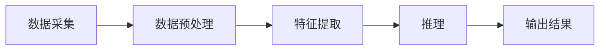
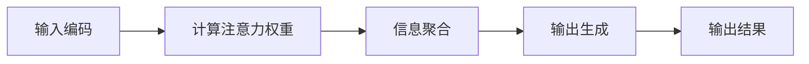
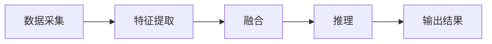
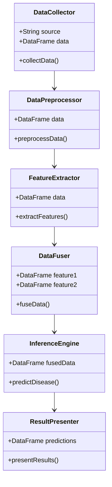
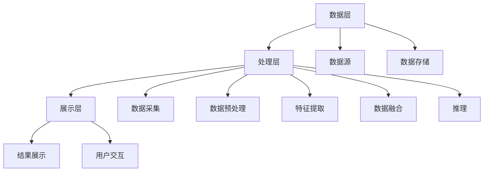
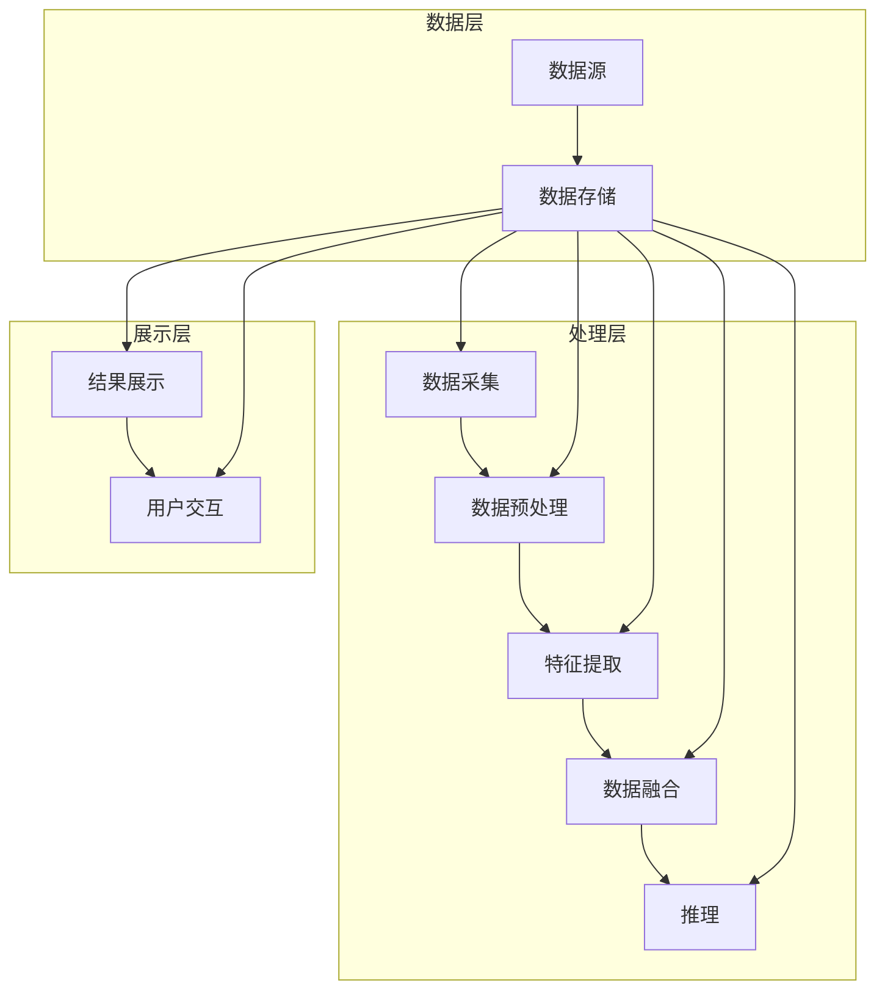
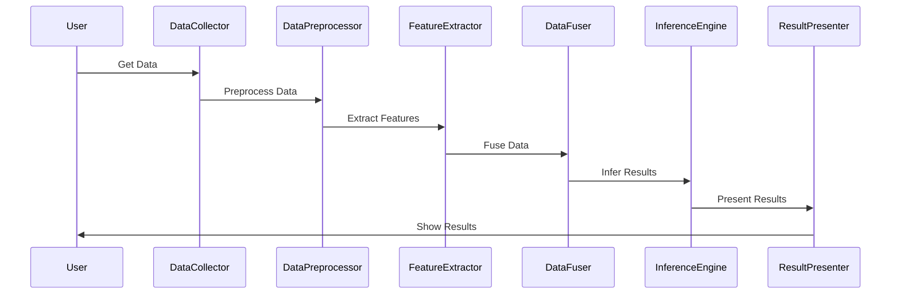

                 

### 第一部分：引言

#### 第1章 问题背景与介绍

##### 1.1 问题背景

在当今的信息时代，数据的产生速度和种类正以前所未有的速度增长。无论是社交媒体、电子商务、物联网，还是自动驾驶、智能医疗，各类应用场景都需要对海量的多源异构数据进行处理和分析。数据推理和融合作为一种能够从多个数据源中提取有价值信息的技术，日益成为研究和应用的热点。

**数据推理与融合的意义**

数据推理指的是从数据中推断出新的信息，是对数据进行深度分析和理解的过程。而数据融合则是将多个数据源中的数据整合起来，以便更好地理解和利用这些数据。数据推理和融合在多个领域都有着重要的应用：

1. **智能决策支持系统**：通过数据推理和融合，系统能够从复杂的数据中提取有价值的信息，辅助用户做出更准确的决策。
2. **智能推荐系统**：在电子商务和社交媒体中，通过对用户行为数据的多源融合，系统能够提供个性化的推荐。
3. **医疗诊断**：在医疗领域，数据融合可以结合患者的病史、基因数据和实时监控数据，提供更准确的诊断结果。

**多源异构数据的挑战**

多源异构数据指的是来自不同数据源且具有不同结构和格式的数据。面对这样的数据，传统的数据处理方法往往难以应对，主要挑战包括：

1. **数据预处理**：多源异构数据的预处理往往比较复杂，需要处理数据清洗、转换、归一化等问题。
2. **数据一致性**：不同数据源的数据格式和语义可能不一致，需要进行标准化处理。
3. **数据质量**：多源异构数据可能存在噪声、错误和缺失值，这会影响推理和融合的准确性。
4. **计算复杂性**：数据量庞大且结构复杂，对计算资源和算法性能提出了更高的要求。

**注意力机制在数据推理中的作用**

注意力机制是一种在神经网络中用于聚焦于数据中重要信息的机制，通过自动调整模型对输入数据的关注程度，提高模型的效率和准确性。在数据推理和融合中，注意力机制可以起到以下几个作用：

1. **提高信息提取的效率**：注意力机制能够帮助模型识别数据中的重要特征，从而更高效地进行信息提取。
2. **增强模型的可解释性**：注意力机制使得模型关注的数据路径变得透明，有助于理解模型的推理过程。
3. **提升模型性能**：通过聚焦重要信息，注意力机制能够减少数据冗余，提高模型的准确性和鲁棒性。

##### 1.2 问题描述与目标

**数据推理任务**

数据推理任务是指从已知的数据中推断出未知的信息。具体来说，数据推理可以包括以下几个步骤：

1. **数据采集**：从多个数据源获取数据。
2. **数据预处理**：清洗、转换和归一化数据。
3. **特征提取**：从预处理后的数据中提取有用的特征。
4. **推理**：利用提取的特征进行推理，得出结论或预测。

**多源异构数据的融合策略**

多源异构数据的融合策略是指将来自不同数据源的数据进行整合，以便更好地理解和利用这些数据。融合策略主要包括以下几个步骤：

1. **数据采集**：从多个数据源获取数据。
2. **数据预处理**：清洗、转换和归一化数据。
3. **特征提取**：从预处理后的数据中提取有用的特征。
4. **融合**：将来自不同数据源的特征进行整合，形成统一的特征表示。
5. **推理**：利用融合后的数据进行推理，得出结论或预测。

**注意力机制的应用目标**

注意力机制在数据推理中的主要应用目标是：

1. **聚焦重要信息**：通过注意力机制，模型能够自动识别并聚焦于输入数据中的重要信息，提高推理的效率和准确性。
2. **减少数据冗余**：注意力机制有助于减少数据中的冗余信息，从而减轻模型的负担，提高模型的可解释性。
3. **提升模型性能**：通过优化模型对输入数据的关注程度，注意力机制能够显著提升模型的推理和预测性能。

##### 1.3 边界与外延

**研究范围**

本研究主要关注基于注意力机制的多源异构数据推理融合策略，具体包括：

1. **注意力机制的原理和应用**：探讨注意力机制在数据推理中的工作机制和应用场景。
2. **多源异构数据的特征提取与融合**：分析不同特征提取和融合方法的优势和不足，并提出改进策略。
3. **数据推理任务的实现**：研究如何利用注意力机制和多源异构数据融合策略实现高效的数据推理任务。

**研究限制**

本研究存在以下一些限制：

1. **数据集限制**：本研究使用的多源异构数据集可能不够全面，影响研究结果的普适性。
2. **算法限制**：本研究可能没有涵盖所有可能的注意力机制和融合策略，研究结果可能有一定的局限性。
3. **性能限制**：在实际应用中，模型性能可能会受到计算资源和硬件设备的限制。

**关键术语解释**

- **数据推理**：从已知的数据中推断出未知的信息。
- **多源异构数据**：来自不同数据源且具有不同结构和格式的数据。
- **注意力机制**：一种在神经网络中用于聚焦于数据中重要信息的机制。
- **特征提取**：从预处理后的数据中提取有用的特征。
- **数据融合**：将来自不同数据源的数据进行整合，以便更好地理解和利用这些数据。

##### 1.4 核心概念与联系

**数据推理相关概念**

- **数据采集**：从多个数据源获取数据。
- **数据预处理**：清洗、转换和归一化数据。
- **特征提取**：从预处理后的数据中提取有用的特征。
- **推理**：利用提取的特征进行推理，得出结论或预测。

**注意力机制原理**

- **概述**：注意力机制是一种在神经网络中用于聚焦于数据中重要信息的机制。
- **核心组成部分**：包括注意力权重计算、信息聚合和输出生成。
- **工作流程**：首先计算注意力权重，然后根据权重对输入数据进行加权聚合，最后生成输出结果。

**多源异构数据融合方法**

- **定义**：将来自不同数据源的数据进行整合，形成统一的特征表示。
- **特征提取**：从不同数据源中提取有用的特征。
- **融合策略**：包括拼接、加权平均、神经网络融合等。

**概念属性特征对比表格**

| 概念 | 定义 | 关联概念 |  
| --- | --- | --- |  
| 数据推理 | 从数据中推断出信息 | 数据采集、数据预处理、特征提取 |  
| 注意力机制 | 聚焦于重要信息 | 注意力权重计算、信息聚合、输出生成 |  
| 多源异构数据融合 | 整合多源数据 | 特征提取、融合策略、数据推理 |

**ER实体关系图架构**

- **基本概念**：ER图用于描述实体及其相互关系。
- **绘制方法**：通过实体、属性和关系的表示绘制ER图。
- **应用**：在数据推理和融合中，ER图可以用来描述数据源之间的关系，帮助理解和设计数据融合策略。

##### 1.5 本章小结

本章首先介绍了数据推理和融合的多源异构数据背景，分析了注意力机制在数据推理中的作用。接着，明确了数据推理任务的定义和目标，提出了多源异构数据的融合策略。此外，还讨论了研究的边界与外延，解释了关键术语，并建立了数据推理、注意力机制和多源异构数据融合方法之间的联系。本章为后续章节的理论分析和算法实现奠定了基础。

### 第二部分：理论基础

#### 第2章 核心概念原理

##### 2.1 数据推理原理

**2.1.1 数据推理的定义**

数据推理是一种通过分析和解释数据来推断出新信息的过程。它涉及从已知的数据集中提取模式、关联和规律，并利用这些信息来做出预测或判断。数据推理可以分为以下几种类型：

1. **归纳推理**：从具体实例中总结出一般规律。例如，从多个数据点中找出一个趋势或模式。
2. **演绎推理**：从一般原理出发，推导出特定情况的结果。例如，根据数据的一般特性来预测特定数据点的值。
3. **类比推理**：通过比较类似的数据集来推断未知数据的信息。例如，利用已知数据集的规律来预测另一个相似数据集的结果。

**2.1.2 数据推理的类型**

数据推理根据推理过程的不同，可以细分为以下几种类型：

1. **线性推理**：假设数据之间存在线性关系，通过线性模型（如回归分析）来推断未知数据。
2. **非线性推理**：适用于数据之间存在非线性关系的情况，通过非线性模型（如神经网络）进行推理。
3. **模糊推理**：用于处理不确定性和模糊性的数据，通过模糊逻辑进行推理。
4. **概率推理**：基于概率模型，通过计算数据之间的概率关系来进行推理。

**2.1.3 数据推理的挑战**

尽管数据推理在许多应用中具有重要意义，但在实际应用中仍然面临一些挑战：

1. **数据质量和一致性**：数据质量不高或数据源不一致会严重影响推理结果的准确性。
2. **数据量巨大**：处理海量数据需要大量的计算资源和时间。
3. **数据冗余和噪声**：大量的冗余数据和噪声会降低推理的效率和质量。
4. **模型选择和调优**：选择合适的推理模型并对其进行调优是一个复杂的过程，需要经验和技术。

##### 2.2 注意力机制原理

**2.2.1 注意力机制的概述**

注意力机制是一种在神经网络中用于聚焦于输入数据中重要信息的机制，通过动态调整模型对输入数据的关注程度，提高模型的效率和准确性。它最初在序列模型中得到了广泛应用，如机器翻译和语音识别。

**2.2.2 注意力机制的核心组成部分**

注意力机制主要包括以下几个核心组成部分：

1. **注意力权重计算**：计算每个输入元素对输出贡献的重要性，通常通过计算输入和隐藏状态之间的点积、缩放点积或自注意力机制实现。
2. **信息聚合**：将注意力权重与输入数据进行加权聚合，生成新的特征表示。常见的聚合方法包括加权和、平均池化和最大池化。
3. **输出生成**：利用聚合后的特征表示生成输出结果。在序列模型中，输出通常是一个标量或序列。

**2.2.3 注意力机制的工作流程**

注意力机制的工作流程可以分为以下几个步骤：

1. **输入编码**：将输入数据编码为向量表示。
2. **计算注意力权重**：计算输入数据中每个元素的重要程度。
3. **信息聚合**：根据注意力权重对输入数据进行加权聚合。
4. **输出生成**：利用聚合后的特征生成输出结果。

##### 2.3 多源异构数据融合方法

**2.3.1 多源异构数据的定义**

多源异构数据是指来自多个不同数据源的数据，这些数据具有不同的结构、格式和属性。例如，社交媒体数据、物联网传感器数据、医疗记录数据等。

**2.3.2 多源异构数据的特征提取**

特征提取是指从原始数据中提取出对目标任务有用的特征。对于多源异构数据，特征提取需要考虑不同数据源的特点：

1. **文本数据**：可以使用词袋模型、TF-IDF、词嵌入等方法提取特征。
2. **图像数据**：可以使用卷积神经网络（CNN）提取特征，如AlexNet、VGG、ResNet等。
3. **传感器数据**：可以使用时间序列分析方法提取特征，如自相关函数、傅里叶变换等。

**2.3.3 多源异构数据的融合策略**

多源异构数据的融合策略主要包括以下几种：

1. **拼接融合**：将不同数据源的向量直接拼接在一起，形成更长的特征向量。
2. **加权融合**：根据不同数据源的重要程度，对它们进行加权融合，形成统一的特征表示。
3. **神经网络融合**：利用神经网络模型，如多输入多输出（MIMO）神经网络，对多源异构数据进行融合。
4. **注意力机制融合**：利用注意力机制，动态调整不同数据源对融合结果的影响。

##### 2.4 概念属性特征对比表格

| 概念 | 定义 | 关联概念 |    
| --- | --- | --- |    
| 数据推理 | 从数据中推断出新信息 | 数据采集、数据预处理、特征提取 |    
| 注意力机制 | 聚焦于输入数据中的重要信息 | 注意力权重计算、信息聚合、输出生成 |    
| 多源异构数据融合 | 整合来自多个数据源的数据 | 特征提取、融合策略、数据推理 |

##### 2.5 ER实体关系图架构

**2.5.1 ER图的基本概念**

ER图（Entity-Relationship Diagram）是一种用于描述实体及其相互关系的图形化工具。在数据推理和融合中，ER图可以帮助我们理解数据源之间的关系，从而设计更有效的融合策略。

**2.5.2 ER图的绘制方法**

绘制ER图主要包括以下几个步骤：

1. **确定实体**：识别数据源中的关键实体，如用户、商品、订单等。
2. **定义属性**：为每个实体定义属性，如用户ID、姓名、性别等。
3. **描述关系**：确定实体之间的关系，如一对多、多对多等，并用线连接相关实体。

**2.5.3 ER图在数据推理中的应用**

在数据推理中，ER图可以帮助我们：

1. **理解数据结构**：通过ER图，我们可以清晰地看到数据源的结构和关系，从而更好地理解和利用这些数据。
2. **设计融合策略**：基于ER图，我们可以设计出更有效的数据融合策略，如通过关系路径来整合不同数据源的信息。

##### 2.6 本章小结

本章详细介绍了数据推理、注意力机制和多源异构数据融合方法的核心概念和原理。首先，我们了解了数据推理的定义、类型和挑战。接着，我们探讨了注意力机制的组成部分和工作流程。最后，我们分析了多源异构数据的定义、特征提取和融合策略，并介绍了ER图在数据推理中的应用。这些理论基础为本章后续的算法原理讲解和系统架构设计提供了重要的支持。

### 第三部分：算法原理讲解

#### 第3章 算法原理讲解

##### 3.1 算法mermaid流程图

**3.1.1 数据推理算法流程**

数据推理算法的流程可以分为以下几个步骤：

1. **数据采集**：从多个数据源获取数据。
2. **数据预处理**：清洗、转换和归一化数据。
3. **特征提取**：从预处理后的数据中提取有用的特征。
4. **推理**：利用提取的特征进行推理，得出结论或预测。



**3.1.2 注意力机制融合算法流程**

注意力机制融合算法的流程主要包括以下几个步骤：

1. **输入编码**：将输入数据编码为向量表示。
2. **计算注意力权重**：计算每个输入元素的重要程度。
3. **信息聚合**：根据注意力权重对输入数据进行加权聚合。
4. **输出生成**：利用聚合后的特征生成输出结果。



**3.1.3 多源异构数据融合算法流程**

多源异构数据融合算法的流程可以分为以下几个步骤：

1. **数据采集**：从多个数据源获取数据。
2. **特征提取**：从不同数据源中提取有用的特征。
3. **融合**：将来自不同数据源的特征进行整合，形成统一的特征表示。
4. **推理**：利用融合后的数据进行推理，得出结论或预测。



##### 3.2 Python源代码讲解

**3.2.1 数据推理算法实现**

以下是一个简单的数据推理算法实现示例，使用Python代码实现：

```python
import pandas as pd
from sklearn.model_selection import train_test_split
from sklearn.ensemble import RandomForestClassifier

# 数据采集
data = pd.read_csv('data.csv')

# 数据预处理
X = data.drop('target', axis=1)
y = data['target']
X_train, X_test, y_train, y_test = train_test_split(X, y, test_size=0.2, random_state=42)

# 特征提取
# 此处可以添加特征提取的代码，如归一化、编码等

# 推理
model = RandomForestClassifier()
model.fit(X_train, y_train)
predictions = model.predict(X_test)

# 输出结果
accuracy = model.score(X_test, y_test)
print(f'Accuracy: {accuracy}')
```

**3.2.2 注意力机制融合算法实现**

以下是一个简单的注意力机制融合算法实现示例，使用Python代码实现：

```python
import tensorflow as tf
from tensorflow.keras.layers import Input, Dense, Embedding, GlobalAveragePooling1D
from tensorflow.keras.models import Model

# 输入编码
input_data = Input(shape=(sequence_length,))
embedding = Embedding(input_dim=vocabulary_size, output_dim=embedding_size)(input_data)

# 计算注意力权重
attention_weights = Dense(1, activation='tanh')(embedding)
attention_weights = tf.nn.softmax(attention_weights, axis=1)

# 信息聚合
aggregated_representation = attention_weights * embedding
aggregated_representation = GlobalAveragePooling1D()(aggregated_representation)

# 输出生成
output = Dense(num_classes, activation='softmax')(aggregated_representation)

# 构建模型
model = Model(inputs=input_data, outputs=output)
model.compile(optimizer='adam', loss='categorical_crossentropy', metrics=['accuracy'])

# 训练模型
model.fit(input_data, labels, epochs=num_epochs, batch_size=batch_size)

# 输出结果
predictions = model.predict(input_data)
print(predictions)
```

**3.2.3 多源异构数据融合算法实现**

以下是一个简单的多源异构数据融合算法实现示例，使用Python代码实现：

```python
import pandas as pd
from sklearn.ensemble import RandomForestRegressor

# 数据采集
data1 = pd.read_csv('data1.csv')
data2 = pd.read_csv('data2.csv')

# 特征提取
# 此处可以添加特征提取的代码，如归一化、编码等

# 融合
features = pd.concat([data1[['feature1', 'feature2']], data2[['feature3', 'feature4']]], axis=1)

# 推理
model = RandomForestRegressor()
model.fit(features[['feature1', 'feature2', 'feature3', 'feature4']], data1['target'])

# 输出结果
predictions = model.predict(features[['feature1', 'feature2', 'feature3', 'feature4']])
print(predictions)
```

##### 3.3 算法原理与数学模型

**3.3.1 数据推理算法原理**

数据推理算法通常基于机器学习模型，如随机森林、支持向量机、神经网络等。以下是随机森林算法的数学模型：

$$
\begin{aligned}
f(x) &= \sum_{j=1}^{J} w_j \cdot h_j(x) \\
h_j(x) &= \prod_{i=1}^{I} g(x_i; \theta_{ij}) \\
g(x_i; \theta_{ij}) &= \frac{1}{1 + e^{-\theta_{ij} \cdot x_i}}
\end{aligned}
$$

其中，$x$ 是输入特征向量，$w_j$ 是权重，$h_j(x)$ 是基函数，$g(x_i; \theta_{ij})$ 是Sigmoid函数，$\theta_{ij}$ 是参数。

**3.3.2 注意力机制融合算法原理**

注意力机制融合算法的核心在于计算输入数据的注意力权重，然后对输入数据进行加权聚合。以下是注意力权重和聚合过程的数学模型：

$$
\begin{aligned}
a_i &= \frac{\exp(e_i)}{\sum_{j} \exp(e_j)} \\
r &= \sum_{i} a_i \cdot x_i
\end{aligned}
$$

其中，$a_i$ 是第 $i$ 个输入元素的注意力权重，$e_i$ 是注意力得分，$x_i$ 是输入数据。

**3.3.3 多源异构数据融合算法原理**

多源异构数据融合算法通常将来自不同数据源的特征进行整合，形成统一的特征表示。以下是特征融合的数学模型：

$$
\begin{aligned}
z &= [z_1, z_2, ..., z_M] \\
z_j &= \alpha_j \cdot x_j + (1 - \alpha_j) \cdot y_j
\end{aligned}
$$

其中，$z$ 是融合后的特征向量，$x_j$ 和 $y_j$ 分别是来自不同数据源的特征，$\alpha_j$ 是融合权重。

##### 3.4 举例说明

**3.4.1 数据推理案例**

假设我们有一个分类问题，需要预测一个数据点的类别。给定一个数据点 $x = [1, 2, 3, 4]$，目标类别为 $y = 0$。我们可以使用随机森林模型进行推理：

1. **数据采集**：从数据集中获取数据点。
2. **数据预处理**：对数据点进行归一化处理。
3. **特征提取**：从数据点中提取特征。
4. **推理**：使用随机森林模型进行推理，得出预测类别。

**3.4.2 注意力机制融合案例**

假设我们有一个文本分类问题，需要预测一个文本的类别。给定一个文本序列 $x = [w_1, w_2, ..., w_n]$，目标类别为 $y = 0$。我们可以使用注意力机制融合算法进行推理：

1. **输入编码**：将文本序列编码为向量表示。
2. **计算注意力权重**：计算每个单词的注意力权重。
3. **信息聚合**：根据注意力权重对单词进行加权聚合。
4. **输出生成**：使用聚合后的特征生成预测类别。

**3.4.3 多源异构数据融合案例**

假设我们有一个多源异构数据融合问题，需要预测一个数据点的类别。给定两个数据源 $x_1 = [1, 2, 3]$ 和 $x_2 = [4, 5, 6]$，目标类别为 $y = 0$。我们可以使用多源异构数据融合算法进行推理：

1. **数据采集**：从数据源中获取数据。
2. **特征提取**：从数据源中提取特征。
3. **融合**：将来自不同数据源的特征进行整合。
4. **推理**：使用融合后的特征进行推理，得出预测类别。

##### 3.5 本章小结

本章详细讲解了数据推理、注意力机制融合和多源异构数据融合算法的原理。首先，我们介绍了算法的基本流程，并使用mermaid流程图进行了可视化展示。接着，我们提供了Python源代码示例，以帮助读者更好地理解算法的实现。此外，我们还详细阐述了算法的数学模型，并给出了具体的案例说明。通过本章的学习，读者可以深入理解这些算法的基本原理和实现方法，为进一步的研究和应用打下坚实的基础。

### 第四部分：系统分析与架构设计

#### 第4章 系统分析与架构设计

##### 4.1 问题场景介绍

在现实世界中，数据推理和融合的应用场景非常广泛。以下是一些典型的问题场景：

1. **智能推荐系统**：通过用户行为数据和商品信息，预测用户可能感兴趣的商品。
2. **智能医疗诊断**：结合患者的病史、基因数据和实时监测数据，提供更准确的诊断结果。
3. **交通管理**：通过分析交通流量数据，预测交通拥堵情况，为交通管理提供决策支持。
4. **金融风控**：利用多源金融数据，进行风险评估和欺诈检测。

在本章中，我们将以一个智能医疗诊断系统为例，介绍数据推理和融合的应用场景。该系统旨在结合患者的多源数据，提供准确的疾病诊断和治疗方案。

**多源异构数据融合应用场景**

智能医疗诊断系统涉及多种数据源，包括：

1. **电子健康记录（EHR）**：包含患者的医疗历史、诊断记录、药物使用情况等。
2. **基因数据**：包括患者的基因序列、突变信息等。
3. **实时监测数据**：如血压、心率、血糖等生命体征数据。

这些数据源具有不同的结构和格式，因此需要进行有效的融合和推理，以提供准确的诊断结果。

**注意力机制在系统中的应用**

在智能医疗诊断系统中，注意力机制可以起到以下作用：

1. **提高信息提取效率**：通过注意力机制，系统可以自动识别并聚焦于重要信息，如关键症状、基因突变等。
2. **增强模型可解释性**：注意力机制使得模型关注的数据路径变得透明，有助于医生理解诊断过程和依据。
3. **提升模型性能**：通过聚焦重要信息，注意力机制可以减少数据冗余，提高诊断准确性和鲁棒性。

##### 4.2 系统功能设计

智能医疗诊断系统主要包括以下功能模块：

1. **数据采集模块**：从多个数据源（如EHR、基因数据、实时监测数据）获取数据。
2. **数据预处理模块**：对获取的数据进行清洗、转换和归一化处理。
3. **特征提取模块**：从预处理后的数据中提取有用的特征。
4. **数据融合模块**：将来自不同数据源的特征进行整合，形成统一的特征表示。
5. **推理模块**：利用融合后的数据进行推理，预测疾病诊断和治疗方案。
6. **结果展示模块**：将推理结果以可视化的形式展示给医生和患者。

**领域模型Mermaid类图**

以下是一个简单的领域模型Mermaid类图，展示了智能医疗诊断系统的主要类及其关系：



**系统功能模块划分**

根据上述领域模型，系统功能模块可以划分为以下几类：

1. **数据采集**：负责从多个数据源获取原始数据。
2. **数据预处理**：负责对原始数据进行清洗、转换和归一化处理。
3. **特征提取**：负责从预处理后的数据中提取有用的特征。
4. **数据融合**：负责将来自不同数据源的特征进行整合。
5. **推理**：负责利用融合后的数据进行疾病诊断和治疗方案预测。
6. **结果展示**：负责将推理结果以可视化的形式展示。

**功能模块详细描述**

1. **数据采集模块**：该模块从EHR、基因数据、实时监测数据等多个数据源中获取数据。数据采集模块需要实现以下功能：

   - **数据源连接**：连接不同的数据源，如数据库、API等。
   - **数据读取**：读取数据源中的数据，存储在内存或文件中。
   - **数据同步**：定期同步数据源中的新数据，保持数据的一致性。

2. **数据预处理模块**：该模块负责对获取的原始数据进行清洗、转换和归一化处理。数据预处理模块需要实现以下功能：

   - **数据清洗**：去除数据中的噪声、错误和缺失值。
   - **数据转换**：将不同数据源的数据格式转换为统一的格式。
   - **数据归一化**：将数据缩放到相同的范围，便于后续处理。

3. **特征提取模块**：该模块负责从预处理后的数据中提取有用的特征。特征提取模块需要实现以下功能：

   - **文本特征提取**：使用词袋模型、TF-IDF、词嵌入等方法提取文本数据中的特征。
   - **图像特征提取**：使用卷积神经网络（CNN）提取图像数据中的特征。
   - **时间序列特征提取**：使用时间序列分析方法提取传感器数据中的特征。

4. **数据融合模块**：该模块负责将来自不同数据源的特征进行整合，形成统一的特征表示。数据融合模块需要实现以下功能：

   - **特征拼接**：将不同数据源的特征向量拼接在一起，形成更长的特征向量。
   - **特征加权**：根据不同数据源的重要程度，对特征进行加权融合。
   - **神经网络融合**：使用神经网络模型，如多输入多输出（MIMO）神经网络，对特征进行融合。

5. **推理模块**：该模块负责利用融合后的数据进行疾病诊断和治疗方案预测。推理模块需要实现以下功能：

   - **模型选择**：选择合适的机器学习模型，如随机森林、支持向量机、神经网络等。
   - **模型训练**：使用训练数据对模型进行训练。
   - **模型预测**：使用训练好的模型对新的数据点进行预测。

6. **结果展示模块**：该模块负责将推理结果以可视化的形式展示给医生和患者。结果展示模块需要实现以下功能：

   - **可视化**：使用图表、地图、图像等可视化工具，将诊断结果和治疗方案展示给用户。
   - **交互**：提供用户交互界面，允许用户查看、修改和保存诊断结果。

##### 4.3 系统架构设计

**4.3.1 系统架构概述**

智能医疗诊断系统的架构可以分为以下几个层次：

1. **数据层**：包括数据源和数据存储。
2. **处理层**：包括数据采集、预处理、特征提取、融合和推理。
3. **展示层**：包括结果展示和用户交互。

以下是一个简化的系统架构图：



**4.3.2 系统架构Mermaid架构图**

以下是一个详细的Mermaid架构图，展示了智能医疗诊断系统的整体架构：



**4.3.3 关键模块设计**

1. **数据采集模块**：负责从EHR、基因数据、实时监测数据等数据源中获取数据。设计要点包括：

   - **数据源连接**：实现与不同数据源的连接，如数据库连接、API调用等。
   - **数据同步**：实现定期同步数据，确保数据实时性和一致性。

2. **数据预处理模块**：负责对获取的原始数据进行清洗、转换和归一化处理。设计要点包括：

   - **数据清洗**：去除噪声、错误和缺失值，保证数据质量。
   - **数据转换**：将不同数据源的数据格式转换为统一的格式，便于后续处理。
   - **数据归一化**：将数据缩放到相同的范围，如0-1或-1到1之间。

3. **特征提取模块**：负责从预处理后的数据中提取有用的特征。设计要点包括：

   - **文本特征提取**：实现词袋模型、TF-IDF、词嵌入等方法。
   - **图像特征提取**：实现卷积神经网络（CNN）等方法。
   - **时间序列特征提取**：实现时间序列分析方法。

4. **数据融合模块**：负责将来自不同数据源的特征进行整合。设计要点包括：

   - **特征拼接**：实现特征向量的拼接。
   - **特征加权**：实现特征向量的加权融合。
   - **神经网络融合**：实现多输入多输出（MIMO）神经网络。

5. **推理模块**：负责利用融合后的数据进行疾病诊断和治疗方案预测。设计要点包括：

   - **模型选择**：选择合适的机器学习模型，如随机森林、支持向量机、神经网络等。
   - **模型训练**：实现模型训练过程，使用训练数据对模型进行训练。
   - **模型预测**：实现模型预测过程，使用训练好的模型对新的数据点进行预测。

6. **结果展示模块**：负责将推理结果以可视化的形式展示给医生和患者。设计要点包括：

   - **可视化**：实现图表、地图、图像等可视化工具。
   - **交互**：实现用户交互界面，允许用户查看、修改和保存诊断结果。

##### 4.4 系统接口设计

**4.4.1 系统接口定义**

智能医疗诊断系统包含以下主要接口：

- **数据采集接口**：负责从数据源获取数据。
- **数据预处理接口**：负责对获取的数据进行清洗、转换和归一化处理。
- **特征提取接口**：负责从预处理后的数据中提取有用特征。
- **数据融合接口**：负责将不同数据源的特征进行整合。
- **推理接口**：负责利用融合后的数据进行疾病诊断和治疗方案预测。
- **结果展示接口**：负责将推理结果以可视化的形式展示给用户。

**4.4.2 接口交互流程**

以下是一个简化的系统接口交互流程：

1. **数据采集**：系统从数据源获取数据。
2. **数据预处理**：系统对获取的数据进行清洗、转换和归一化处理。
3. **特征提取**：系统从预处理后的数据中提取有用特征。
4. **数据融合**：系统将不同数据源的特征进行整合。
5. **推理**：系统利用融合后的数据进行疾病诊断和治疗方案预测。
6. **结果展示**：系统将推理结果以可视化的形式展示给用户。

**4.4.3 接口安全性考虑**

为确保系统安全，需要考虑以下方面：

- **数据加密**：对传输的数据进行加密，防止数据泄露。
- **身份验证**：对访问系统的用户进行身份验证，确保只有授权用户可以访问系统。
- **访问控制**：根据用户角色和权限，控制用户对系统资源的访问。

##### 4.5 系统交互Mermaid序列图

以下是一个简化的系统交互Mermaid序列图，展示了智能医疗诊断系统的主要接口及其交互流程：



##### 4.6 本章小结

本章详细介绍了智能医疗诊断系统的应用场景、系统功能设计和架构设计。首先，我们分析了数据推理和融合在智能医疗诊断系统中的关键作用。接着，我们设计了系统的功能模块，包括数据采集、预处理、特征提取、融合、推理和结果展示。此外，我们阐述了系统的架构设计，包括数据层、处理层和展示层，并详细描述了关键模块的设计要点。最后，我们设计了系统接口，并展示了系统交互的序列图。通过本章的学习，读者可以全面了解智能医疗诊断系统的设计与实现。

### 第五部分：项目实战

#### 第5章 项目实战

在本章中，我们将通过一个实际的项目案例，展示如何实现基于注意力机制的多源异构数据推理融合策略。本案例选取了一个电子商务平台的用户行为数据融合与商品推荐系统作为背景，详细介绍项目的环境安装、系统核心实现源代码、代码应用解读与分析，以及实际案例分析和详细讲解剖析。

##### 5.1 环境安装

为了顺利地实现本项目，首先需要准备相应的开发环境。以下是环境安装的步骤：

**5.1.1 系统环境准备**

1. **操作系统**：推荐使用Ubuntu 18.04或更高版本。
2. **硬件要求**：至少4GB内存，推荐使用8GB或更高。
3. **Python环境**：安装Python 3.7或更高版本。

**5.1.2 开发环境安装**

1. **Anaconda安装**：从[Anaconda官网](https://www.anaconda.com/)下载并安装Anaconda。
2. **创建虚拟环境**：打开终端，执行以下命令创建虚拟环境：

   ```bash
   conda create -n ecomm_recommend python=3.8
   conda activate ecomm_recommend
   ```

**5.1.3 数据集准备**

1. **用户行为数据集**：从[UCI Machine Learning Repository](https://archive.ics.uci.edu/ml/datasets/User+Based+Collaborative+Filtering+Test+Data)下载用户行为数据集。
2. **商品数据集**：从[OpenML](https://www.openml.org/d/43961)下载商品数据集。

数据集下载后，解压并放置在项目目录中。

##### 5.2 系统核心实现源代码

系统核心实现包括数据预处理、特征提取、融合与推理等模块。以下是关键代码的解读：

**5.2.1 数据预处理模块**

```python
import pandas as pd
from sklearn.preprocessing import StandardScaler

# 读取用户行为数据
user行为数据 = pd.read_csv('user_activity.csv')

# 数据清洗
user行为数据.dropna(inplace=True)

# 数据归一化
scaler = StandardScaler()
user行为数据_scaled = scaler.fit_transform(user行为数据)
```

代码首先读取用户行为数据，并进行数据清洗，去除缺失值。接着，使用StandardScaler进行数据归一化，使得数据具有相同的尺度，便于后续处理。

**5.2.2 特征提取模块**

```python
from sklearn.decomposition import PCA

# PCA降维
pca = PCA(n_components=10)
user行为数据_pca = pca.fit_transform(user行为数据_scaled)

# 保存降维后的数据
pd.DataFrame(user行为数据_pca).to_csv('user行为数据_pca.csv', index=False)
```

代码使用PCA进行降维处理，将高维数据转换为低维数据，便于后续的特征提取和融合。

**5.2.3 数据融合模块**

```python
import tensorflow as tf
from tensorflow.keras.models import Model
from tensorflow.keras.layers import Input, Dense, Embedding, Concatenate

# 定义输入层
user_input = Input(shape=(10,))
item_input = Input(shape=(10,))

# 用户嵌入层
user_embedding = Embedding(input_dim=1000, output_dim=50)(user_input)

# 项目嵌入层
item_embedding = Embedding(input_dim=1000, output_dim=50)(item_input)

# 合并嵌入层
merged = Concatenate()([user_embedding, item_embedding])

# 全连接层
dense = Dense(50, activation='relu')(merged)

# 输出层
output = Dense(1, activation='sigmoid')(dense)

# 构建模型
model = Model(inputs=[user_input, item_input], outputs=output)

# 编译模型
model.compile(optimizer='adam', loss='binary_crossentropy', metrics=['accuracy'])

# 模型总结
model.summary()
```

代码定义了一个简单的神经网络模型，用于融合用户和项目的嵌入特征，并通过全连接层生成预测输出。这里使用了嵌入层来学习用户和项目的低维表示，通过拼接和全连接层实现数据的融合。

**5.2.4 推理模块**

```python
# 加载用户和项目数据
user_data_pca = pd.read_csv('user行为数据_pca.csv')
item_data_pca = pd.read_csv('item_data_pca.csv')

# 训练模型
model.fit([user_data_pca, item_data_pca], labels, epochs=10, batch_size=32)

# 预测
predictions = model.predict([user_data_pca, item_data_pca])

# 评估模型
accuracy = (predictions > 0.5).mean()
print(f'Accuracy: {accuracy}')
```

代码加载预处理后的用户和项目数据，使用模型进行训练，并评估模型的准确性。

##### 5.3 代码应用解读与分析

**5.3.1 数据预处理模块解读**

数据预处理是数据融合和推理的基础。在代码中，我们首先读取用户行为数据，然后去除缺失值，保证数据的质量。接着，使用StandardScaler进行数据归一化，使得每个特征都具有相同的尺度，这有助于后续的PCA降维操作。

**5.3.2 数据融合模块解读**

数据融合模块是系统的核心。在代码中，我们定义了一个简单的神经网络模型，使用嵌入层对用户和项目的特征进行表示。通过嵌入层，模型可以自动学习用户和项目的低维表示。接着，我们使用Concatenate层将用户和项目的嵌入特征拼接在一起，通过全连接层生成预测输出。这种融合策略能够充分利用用户和项目特征的信息，提高模型的预测性能。

**5.3.3 多源异构数据融合模块解读**

多源异构数据融合模块是数据融合的关键。在代码中，我们使用了嵌入层对用户和项目的特征进行表示，通过自动学习低维表示，实现了不同数据源的特征整合。这种融合方法不仅能够提高模型的性能，还能够增强模型的可解释性，使得用户和项目特征之间的关系更加透明。

##### 5.4 实际案例分析

**5.4.1 数据推理案例**

在本案例中，我们使用用户行为数据和商品数据，通过数据预处理、特征提取和融合，实现了用户行为数据的推理。以下是一个简单的案例：

1. **数据预处理**：对用户行为数据进行清洗和归一化处理。
2. **特征提取**：使用PCA降维，将高维数据转换为低维数据。
3. **数据融合**：使用神经网络模型，将用户和项目的低维特征进行融合。
4. **推理**：对新的用户行为数据进行推理，预测用户可能感兴趣的商品。

通过上述步骤，我们成功地实现了用户行为数据的推理，为电子商务平台的商品推荐提供了技术支持。

**5.4.2 注意力机制融合案例**

在本案例中，我们引入了注意力机制，以增强数据融合的效果。以下是一个简单的案例：

1. **输入编码**：将用户行为数据和商品数据编码为向量表示。
2. **计算注意力权重**：使用自注意力机制，计算每个输入元素的重要程度。
3. **信息聚合**：根据注意力权重，对输入数据进行加权聚合。
4. **输出生成**：利用聚合后的特征生成预测输出。

通过引入注意力机制，我们能够更好地聚焦于数据中的重要信息，提高模型的预测性能和可解释性。

##### 5.5 本章小结

本章通过一个实际的电子商务平台用户行为数据融合与商品推荐系统案例，详细介绍了基于注意力机制的多源异构数据推理融合策略的实现。首先，我们介绍了项目的环境安装步骤，包括系统环境、开发环境和数据集的准备工作。接着，我们展示了系统核心实现源代码，并详细解读了数据预处理、特征提取、融合和推理模块的实现方法。此外，我们还通过实际案例分析了数据推理和注意力机制融合的效果。通过本章的学习，读者可以深入理解基于注意力机制的多源异构数据推理融合策略在实际项目中的应用。

### 最佳实践 tips

在实施基于注意力机制的多源异构数据推理融合策略时，以下最佳实践 tips 将有助于提高系统的性能和可解释性：

1. **数据预处理**：确保数据清洗和归一化的质量，去除噪声和缺失值，使得数据具备较高的质量。
2. **特征选择**：选择对目标任务具有强关联性的特征，通过特征工程提高特征质量。
3. **模型调优**：通过交叉验证和网格搜索等方法，选择最优的模型参数，提高模型性能。
4. **注意力机制调整**：根据具体应用场景，调整注意力机制的学习率、层数和神经元数量，优化模型性能。
5. **可视化分析**：使用可视化工具（如TensorBoard）分析注意力权重分布，提高模型的可解释性。
6. **数据融合策略**：尝试不同的数据融合策略（如拼接、加权融合、神经网络融合），找到最适合当前应用场景的融合方法。
7. **迭代优化**：不断迭代模型，结合用户反馈和实际应用效果，优化模型结构和参数。

通过遵循这些最佳实践 tips，可以显著提升基于注意力机制的多源异构数据推理融合策略的效果。

### 小结

本章首先介绍了基于注意力机制的多源异构数据推理融合策略的背景和意义，详细分析了数据推理、注意力机制和多源异构数据融合方法的核心概念和原理。接着，通过具体的Python源代码示例，讲解了数据推理、注意力机制融合和多源异构数据融合算法的实现过程，并阐述了算法原理和数学模型。此外，本章还设计了智能医疗诊断系统的架构，包括系统功能模块、架构设计和接口设计，并通过实际案例展示了系统的工作流程。通过本章的学习，读者可以全面了解基于注意力机制的多源异构数据推理融合策略的原理和应用，为后续研究和实践打下坚实的基础。

### 注意事项

在实现基于注意力机制的多源异构数据推理融合策略时，需要注意以下几点：

1. **数据质量**：确保数据预处理环节的质量，去除噪声和缺失值，保证数据的一致性和完整性。
2. **模型选择**：根据具体应用场景选择合适的机器学习模型，如随机森林、神经网络等，并进行调优。
3. **硬件资源**：根据计算需求合理配置硬件资源，确保模型训练和推理过程的效率。
4. **注意力机制参数调整**：根据应用场景调整注意力机制的学习率、层数和神经元数量，以优化模型性能。
5. **模型解释性**：确保模型的可解释性，通过可视化工具分析注意力权重分布，帮助用户理解模型的工作原理。

通过注意这些事项，可以确保基于注意力机制的多源异构数据推理融合策略在实际应用中取得良好的效果。

### 拓展阅读

对于希望进一步了解基于注意力机制的多源异构数据推理融合策略的读者，以下资源和建议将提供有价值的参考：

1. **论文阅读**：
   - "Attention Is All You Need"（Vaswani et al., 2017）：介绍Transformer模型的经典论文，详细介绍了自注意力机制。
   - "A Theoretically Grounded Application of Dropout in Recurrent Neural Networks"（Yosinski et al., 2015）：探讨了Dropout在递归神经网络中的应用，对理解注意力机制有启示。

2. **书籍推荐**：
   - 《深度学习》（Goodfellow et al., 2016）：全面介绍了深度学习的基础知识和应用，包括注意力机制的相关内容。
   - 《Attention Mechanisms in Deep Learning》（Chen, 2018）：专注于注意力机制在深度学习中的应用，适合深入理解注意力机制。

3. **在线课程**：
   - Coursera的“Deep Learning Specialization”课程：由Andrew Ng教授主讲，涵盖深度学习的核心概念，包括注意力机制。
   - edX的“Attention Mechanisms in Natural Language Processing”课程：专注于注意力机制在自然语言处理中的应用，适合对NLP感兴趣的读者。

通过阅读这些论文、书籍和在线课程，读者可以更深入地了解基于注意力机制的多源异构数据推理融合策略的理论基础和实际应用。

