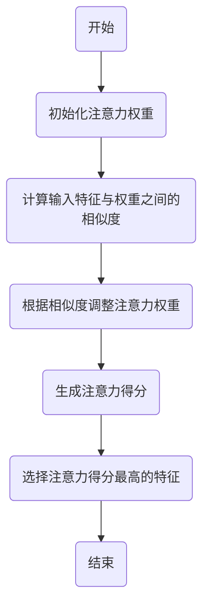
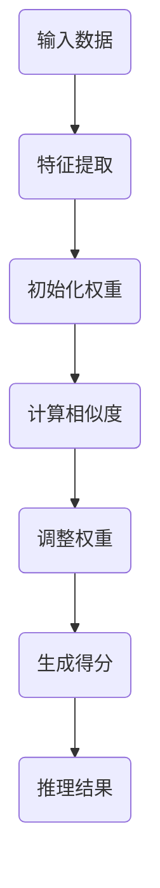
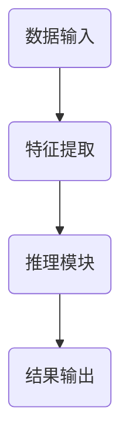
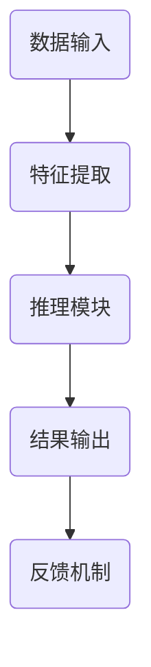
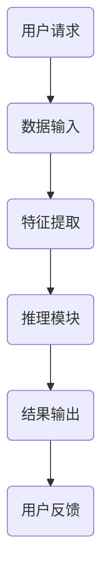

                 


### 第1章 引言

**核心概念术语说明**：  
- **注意力机制**：一种模仿人类大脑处理信息的机制，能够在信息过载时自动选择对当前任务最为相关的信息。
- **推理能力优化**：通过算法和系统设计，提高计算机在复杂问题中的推理和分析能力。

**问题背景**：随着大数据和人工智能的迅速发展，计算机系统面对的信息量呈现爆炸式增长。传统的信息处理方法已无法满足高效推理的需求，因此需要新的优化策略来提高系统的推理能力。

**问题描述**：当前计算机在处理复杂问题时，存在信息处理效率低下、推理能力不足等问题。注意力机制作为一种新兴的方法，有望解决这些问题。

**问题解决**：通过研究注意力机制在计算机科学中的应用，提出基于注意力机制的推理能力优化策略，以提高计算机系统的推理效率。

**边界与外延**：本文主要探讨注意力机制在推理能力优化中的应用，关注于算法原理、系统架构和实际案例，同时探讨注意事项和最佳实践。

**概念结构与核心要素组成**：本文的核心概念包括注意力机制、推理能力、优化策略等。核心要素包括算法原理讲解、系统分析与架构设计方案、项目实战等。

**本章主要内容**：本章将介绍注意力机制的概念、问题背景、问题解决、本书内容结构与组织。旨在为读者提供一个全面的框架，理解本文的主题和内容。

### 第2章 注意力机制原理

**核心概念与联系**：

- **注意力机制的定义**：注意力机制是一种自动选择对当前任务最为相关的信息的机制，能够在信息过载时提高信息处理效率。

- **注意力机制的属性特征对比**：注意力机制的属性特征包括计算效率、信息处理能力、适应性和可扩展性等。本文将对比不同类型的注意力机制，分析其优缺点。

- **注意力机制的ER实体关系图**：ER实体关系图用于描述注意力机制中的核心实体及其关系。本文将使用Mermaid绘制ER实体关系图，以便更直观地展示注意力机制的结构。

**算法原理讲解**：

- **mermaid流程图**：使用mermaid语言绘制注意力机制的流程图，展示其基本步骤和过程。

- **Python代码实现**：提供Python代码实现注意力机制的示例，以便读者更好地理解算法原理。

- **数学模型与公式解析**：使用LaTeX格式给出注意力机制的数学模型和公式，并对其进行详细讲解。

**示例**：

#### 2.1.1 注意力机制的mermaid流程图



#### 2.1.2 Python代码实现

```python
import numpy as np

# 初始化注意力权重
weights = np.random.rand(input_shape)

# 计算输入特征与权重之间的相似度
similarity = np.dot(inputs, weights)

# 根据相似度调整注意力权重
weights = weights / np.linalg.norm(similarity)

# 生成注意力得分
attention_scores = np.dot(inputs, weights)

# 选择注意力得分最高的特征
selected_feature = inputs[attention_scores.argmax()]
```

#### 2.1.3 数学模型与公式解析

$$
\text{注意力权重} = \frac{\text{输入特征} \times \text{权重}}{\|\text{输入特征} \times \text{权重}\|}
$$

$$
\text{注意力得分} = \text{输入特征} \times \text{注意力权重}
$$

### 第3章 注意力机制在推理中的应用

**推理能力优化的目标**：

- 提高推理速度：通过注意力机制快速筛选出关键信息，减少不必要的计算。
- 提高推理准确性：通过注意力机制更好地理解和利用输入信息，提高推理结果的准确性。

**算法原理与流程图**：

- **算法原理**：注意力机制通过计算输入特征与权重之间的相似度，调整注意力权重，生成注意力得分，从而选择出最为相关的特征。
- **流程图**：使用mermaid绘制注意力机制在推理中的应用流程图。



**Python代码实现**：

```python
import numpy as np

# 初始化权重
weights = np.random.rand(input_shape)

# 计算相似度
similarity = np.dot(inputs, weights)

# 调整权重
weights = weights / np.linalg.norm(similarity)

# 生成得分
attention_scores = np.dot(inputs, weights)

# 推理结果
result = selected_feature
```

**数学模型与公式解析**：

$$
\text{相似度} = \frac{\text{输入特征} \times \text{权重}}{\|\text{输入特征} \times \text{权重}\|}
$$

$$
\text{得分} = \text{输入特征} \times \text{权重}
$$

### 第4章 系统分析与架构设计

**问题场景介绍**：

- **背景**：随着大数据和人工智能的发展，计算机系统需要处理海量数据，进行复杂推理和决策。
- **问题**：现有系统在处理复杂问题时，存在推理速度慢、准确性低等问题，需要优化推理能力。

**系统功能设计**：

- **领域模型**：使用mermaid绘制领域模型类图，展示系统中的主要类及其关系。
- **功能模块划分**：将系统划分为数据输入模块、特征提取模块、推理模块等。



**系统架构设计**：

- **架构图**：使用mermaid绘制系统架构图，展示系统的主要组件及其关系。
- **架构解析**：对系统架构进行详细解析，说明各组件的功能和相互关系。



**系统接口设计**：

- **接口设计规范**：定义系统接口的输入输出参数、接口调用方法等。
- **接口实现细节**：详细介绍接口的实现细节，包括接口的实现方式、参数传递方式等。

**系统交互**：

- **交互流程**：使用mermaid绘制系统交互流程图，展示系统各模块之间的交互过程。
- **交互图示例**：



### 第5章 项目实战

**环境安装**：

- **硬件要求**：CPU: Intel Core i7 或更好；内存: 16GB 或更好；存储: 500GB SSD 或更好。
- **软件安装步骤**：安装Python、TensorFlow、Mermaid等软件和库。

**系统核心实现**：

- **源代码结构**：展示系统核心代码的结构，包括模块划分、文件组织等。
- **核心代码解析**：详细解析系统核心代码的实现细节，包括算法原理、数据流程等。

**代码应用解读**：

- **代码运行流程**：详细描述代码的运行流程，包括输入、处理、输出等步骤。
- **应用场景举例**：给出一个实际的应用场景，展示如何使用系统进行推理和决策。

**实际案例分析和详细讲解剖析**：

- **案例背景**：介绍一个实际案例的背景，说明案例的需求和目标。
- **案例解析**：详细分析案例的实现过程，包括算法应用、系统架构、代码解析等。

**项目小结**：

- **项目收获**：总结项目实施过程中的收获和经验，包括技术实现、团队协作、项目管理等。
- **不足与改进**：分析项目中的不足之处，提出改进建议和方案。

### 第6章 最佳实践与注意事项

**最佳实践**：

- **推理能力优化技巧**：总结一些优化推理能力的技巧和策略，包括数据预处理、模型选择、参数调优等。
- **系统调优策略**：介绍一些系统调优的方法和策略，包括性能优化、稳定性提升等。

**注意事项**：

- **注意力机制的适用范围**：指出注意力机制的应用范围和限制，包括适用场景和不适用的场景。
- **算法实现中的常见问题**：总结在实现注意力机制算法时可能会遇到的问题和解决方法。

**拓展阅读**：

- **相关文献推荐**：推荐一些与注意力机制和推理能力优化相关的文献，供读者进一步学习。
- **深入研究方向**：介绍一些当前的研究热点和未来可能的发展方向，激发读者的兴趣和思考。

### 作者信息

**作者**：AI天才研究院/AI Genius Institute & 禅与计算机程序设计艺术 /Zen And The Art of Computer Programming

### 文章关键词

- 注意力机制
- 推理能力优化
- 算法原理
- 系统架构设计
- 项目实战

### 文章摘要

本文详细探讨了基于注意力机制的推理能力优化策略。首先介绍了注意力机制的核心概念、属性特征和ER实体关系图。接着，通过mermaid流程图和Python代码示例，讲解了注意力机制在推理中的应用原理和数学模型。随后，阐述了系统分析与架构设计方案，包括问题场景介绍、系统功能设计、系统架构设计、系统接口设计和系统交互。然后，通过项目实战展示了环境安装、系统核心实现、代码应用解读、实际案例分析和项目小结。最后，提出了最佳实践和注意事项，以及拓展阅读方向。本文旨在为读者提供一个全面、系统的注意力机制推理能力优化策略指南。**关键词：注意力机制，推理能力优化，算法原理，系统架构设计，项目实战。**

