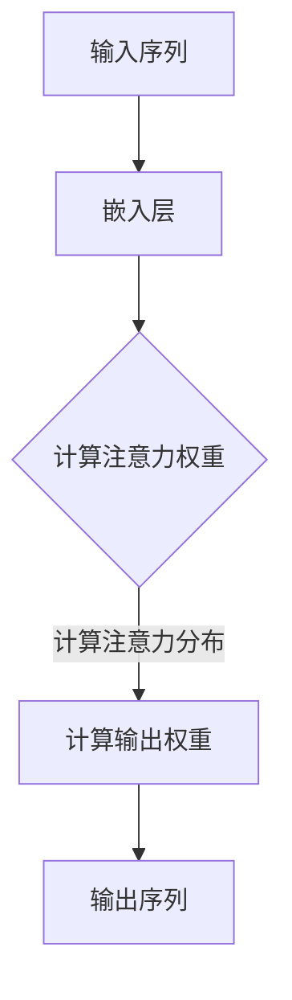
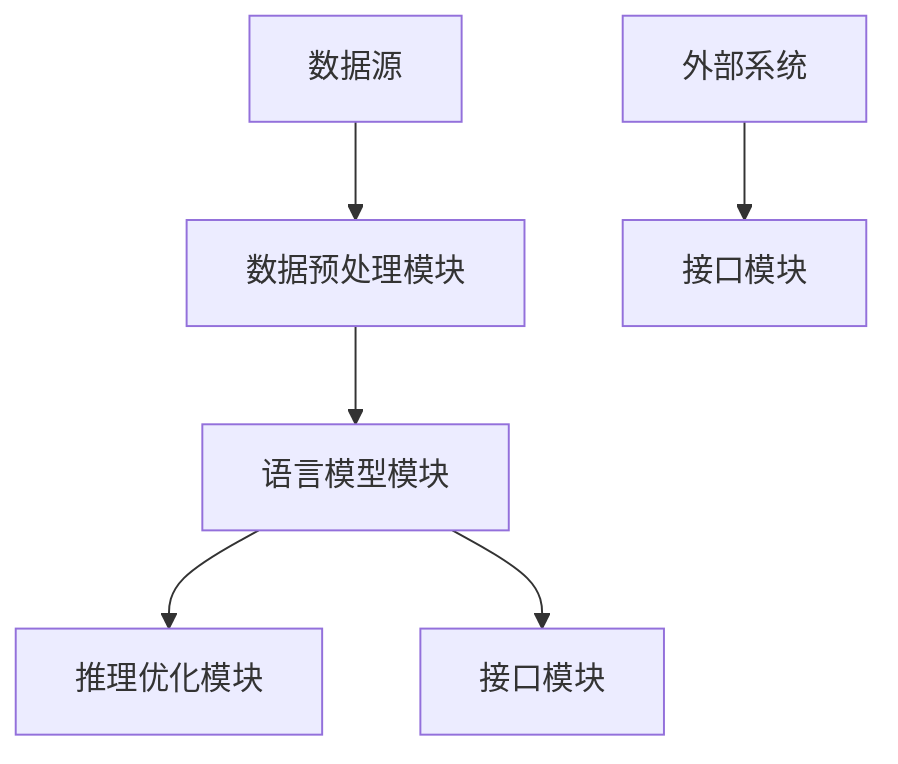

                 

# 基于注意力机制的语言模型推理优化

## 关键词

注意力机制、语言模型、推理优化、Transformer、自回归模型、稀疏矩阵

## 摘要

本文将探讨基于注意力机制的语言模型在推理优化方面的研究与应用。通过对注意力机制原理的深入分析，结合具体的数学模型与公式，我们将详细讲解如何利用注意力机制优化语言模型的推理速度和效率。文章还将对比不同语言模型中注意力机制的应用，并提出优化策略，以降低计算复杂度和提高模型准确性。最后，通过实例和代码演示，我们将验证注意力机制在实际项目中的应用效果，并总结最佳实践和未来研究方向。

----------------------------------------------------------------

## 目录大纲

----------------------------------------------------------------

## 第一部分：背景介绍

### 第1章：问题背景与核心概念

#### 1.1 问题背景

#### 1.2 核心概念与联系

### 第2章：注意力机制原理

#### 2.1 注意力机制概述

#### 2.2 注意力机制在不同语言模型中的应用

#### 2.3 注意力机制的优化策略

### 第3章：数学模型与公式讲解

#### 3.1 语言模型数学模型

#### 3.2 注意力机制数学模型

#### 3.3 推理优化数学模型

#### 3.4 举例说明

----------------------------------------------------------------

## 第一部分：背景介绍

### 第1章：问题背景与核心概念

#### 1.1 问题背景

随着人工智能技术的迅猛发展，自然语言处理（NLP）成为了其中的重要分支。语言模型作为NLP的核心组件，广泛应用于机器翻译、文本生成、问答系统等领域。然而，在多任务场景下，语言模型的推理速度和效率面临着巨大挑战。传统的自回归语言模型，如基于n-gram和神经网络的方法，虽然在准确性上取得了一定的突破，但在推理速度上却难以满足实时处理的需求。因此，优化语言模型的推理过程成为了一个重要的研究方向。

#### 1.2 核心概念

在本节中，我们将介绍本文涉及到的核心概念，包括语言模型、注意力机制和推理优化。

- **语言模型**：语言模型是一种概率模型，用于预测自然语言序列的概率分布。常见的语言模型有n-gram模型、神经网络语言模型等。自回归语言模型（如n-gram模型）通过对输入序列的前一部分进行建模，预测下一部分的可能性。而神经网络语言模型（如Transformer）则通过学习序列之间的复杂关系，实现更准确的预测。

- **注意力机制**：注意力机制是一种基于神经网络的模型，能够实现对序列中不同元素的重要性进行加权。在NLP任务中，注意力机制被广泛应用于机器翻译、文本摘要、问答系统等领域。注意力机制的核心思想是在模型推理过程中，将注意力分配到输入序列的不同部分，从而提高模型的推理速度和效率。

- **推理优化**：推理优化是指在语言模型推理过程中，通过改进算法和模型结构，降低计算复杂度，提高推理效率。常见的推理优化策略包括模型压缩、量化、并行计算等。推理优化是提升语言模型应用性能的关键技术之一。

#### 1.3 问题描述

在多任务场景下，语言模型的推理速度和效率面临着以下瓶颈：

1. **计算复杂度**：语言模型通常需要处理大规模的输入序列，计算复杂度较高，导致推理速度缓慢。

2. **参数量**：语言模型参数量庞大，导致模型训练时间较长，推理过程中需要占用大量内存。

3. **资源消耗**：在资源受限的环境中，如移动设备、嵌入式系统等，语言模型的推理过程可能导致设备过热、电池消耗过快等问题。

#### 1.4 问题解决

为了解决上述问题，本文提出了基于注意力机制的语言模型推理优化方法。具体包括以下几个方面：

1. **注意力机制优化**：通过改进注意力机制的计算方法，降低计算复杂度，提高推理速度。

2. **稀疏矩阵表示**：将语言模型参数表示为稀疏矩阵，减少内存占用，提高模型压缩效果。

3. **模型压缩与量化**：对语言模型进行压缩和量化，降低模型参数量，减少推理过程中所需的计算资源。

#### 1.5 边界与外延

本文主要关注基于注意力机制的语言模型推理优化，包括以下边界和扩展：

1. **边界**：本文主要针对自回归语言模型和Transformer等基于注意力机制的语言模型进行优化。对于其他类型的语言模型，如基于循环神经网络（RNN）的语言模型，优化策略可能会有所不同。

2. **外延**：本文将探讨注意力机制在不同语言模型中的应用，以及针对不同场景的优化策略。此外，本文还将介绍一些先进的推理优化技术，如模型并行计算、分布式推理等。

#### 1.6 概念结构与核心要素组成

在本节中，我们将对语言模型、注意力机制和推理优化的概念结构与核心要素进行阐述。

1. **语言模型**：语言模型的核心要素包括输入序列、输出序列、模型参数等。输入序列表示自然语言文本，输出序列表示模型对文本的预测结果。模型参数用于表示语言模型的知识和规律。

2. **注意力机制**：注意力机制的核心要素包括注意力权重计算、注意力分布、输出权重等。注意力权重计算用于衡量序列中不同元素的重要性。注意力分布表示不同元素的重要性分布。输出权重用于计算输出序列的预测结果。

3. **推理优化**：推理优化的核心要素包括计算复杂度优化、模型参数优化、资源消耗优化等。计算复杂度优化主要通过改进算法和数据结构实现。模型参数优化主要通过模型压缩和量化实现。资源消耗优化主要通过减少计算资源和内存占用实现。

通过上述概念结构与核心要素的阐述，我们可以更好地理解基于注意力机制的语言模型推理优化方法。

----------------------------------------------------------------

## 第二部分：算法原理讲解

### 第2章：注意力机制原理

#### 2.1 注意力机制概述

注意力机制是一种基于神经网络的模型，旨在实现对输入序列中不同元素的重要性进行加权。在自然语言处理领域，注意力机制被广泛应用于机器翻译、文本摘要、问答系统等任务。其核心思想是在模型推理过程中，将注意力分配到输入序列的不同部分，从而提高模型的推理速度和效率。

#### 2.2 注意力机制的数学模型

注意力机制的数学模型主要包括注意力权重计算、注意力分布和输出权重计算三个部分。

1. **注意力权重计算**

   设输入序列为 $X = [x_1, x_2, ..., x_T]$，其中 $x_t$ 表示序列中的第 $t$ 个元素。注意力权重计算公式如下：

   $$ 
   a_t = \text{softmax}\left(\frac{Qx_t}{\sqrt{d_k}}\right) 
   $$

   其中，$Q$ 表示查询向量，$d_k$ 表示键向量的维度。$a_t$ 表示第 $t$ 个元素在输入序列中的重要性。

2. **注意力分布**

   注意力分布表示输入序列中不同元素的重要性分布。根据注意力权重计算结果，可以得到注意力分布：

   $$ 
   \alpha_t = \frac{e^{a_t}}{\sum_{i=1}^{T} e^{a_i}} 
   $$

   其中，$\alpha_t$ 表示第 $t$ 个元素在注意力分布中的权重。

3. **输出权重计算**

   在注意力分布的基础上，可以得到输出权重：

   $$ 
   o_t = \alpha_t V 
   $$

   其中，$V$ 表示输出向量。$o_t$ 表示第 $t$ 个元素在输出序列中的权重。

#### 2.3 注意力机制的Mermaid流程图



#### 2.4 注意力机制在不同语言模型中的应用

注意力机制在自然语言处理领域得到了广泛应用。以下介绍几种常见语言模型中注意力机制的应用。

1. **Transformer模型**

   Transformer模型是一种基于注意力机制的序列到序列模型，广泛应用于机器翻译、文本生成等任务。Transformer模型的核心是自注意力机制，通过多头注意力实现并行计算，大大提高了模型的推理速度。

2. **BERT模型**

   BERT模型（Bidirectional Encoder Representations from Transformers）是一种双向Transformer模型，广泛应用于问答系统、文本分类等任务。BERT模型通过引入位置嵌入和上下文信息，提高了模型对序列的建模能力。

3. **GPT模型**

   GPT模型（Generative Pre-trained Transformer）是一种基于注意力机制的文本生成模型，广泛应用于文本生成、问答系统等任务。GPT模型通过自注意力机制实现对序列的建模，从而生成高质量的文本。

#### 2.5 注意力机制的优化策略

为了提高注意力机制的效率和效果，可以采用以下优化策略：

1. **稀疏注意力**

   稀疏注意力通过引入稀疏矩阵，减少计算复杂度和内存占用。稀疏注意力机制可以在输入序列中只关注一部分重要的元素，从而提高模型的推理速度。

2. **前馈神经网络**

   在注意力机制的基础上，可以引入前馈神经网络，提高模型的表达能力。前馈神经网络通过增加非线性变换，使模型能够更好地拟合复杂的数据分布。

3. **低秩近似**

   低秩近似通过将高维矩阵分解为低维矩阵的乘积，减少计算复杂度和内存占用。低秩近似可以在一定程度上保持模型的表达能力，同时提高推理速度。

通过上述算法原理讲解，我们可以更好地理解注意力机制在语言模型推理优化中的应用和优化策略。

----------------------------------------------------------------

## 第三部分：数学模型和数学公式详细讲解与举例说明

### 第3章：数学模型与公式讲解

#### 3.1 语言模型数学模型

语言模型的核心是概率模型，用于预测输入序列的概率分布。以下介绍两种常见的语言模型数学模型：自回归语言模型和注意力机制语言模型。

##### 3.1.1 自回归语言模型

自回归语言模型（AR）是一种基于马尔可夫假设的模型，它根据前一个词来预测下一个词。自回归语言模型通常采用概率分布来表示当前词的概率。

1. **概率公式**

   自回归语言模型使用概率公式来计算给定前一个词序列 $W_{1:T-1}$，预测当前词 $W_T$ 的概率：

   $$ 
   P(W_T | W_{1:T-1}) = \frac{1}{Z} \exp(\theta^T W_T) 
   $$

   其中，$Z$ 是归一化常数，$\theta$ 是模型参数。

2. **损失函数**

   在训练过程中，自回归语言模型通常使用交叉熵损失函数来优化模型参数：

   $$ 
   Loss = -\sum_{t=1}^{T} \log P(W_t | W_{1:t-1}) 
   $$

##### 3.1.2 注意力机制语言模型

注意力机制语言模型（如Transformer）通过引入注意力机制来预测输入序列的概率分布。注意力机制能够提高模型对序列长度的建模能力，从而提高模型的预测准确性。

1. **多头注意力**

   Transformer模型中的多头注意力（Multi-Head Attention）通过多个独立的注意力机制并行计算，以捕获不同层次的特征。多头注意力的计算公式如下：

   $$ 
   \text{Attention}(Q, K, V) = \text{softmax}\left(\frac{QK^T}{\sqrt{d_k}}\right)V 
   $$

   其中，$Q$、$K$ 和 $V$ 分别是查询向量、键向量和值向量，$d_k$ 是键向量的维度。

2. **维度**

   在多头注意力中，每个头具有不同的维度，假设有 $h$ 个头，每个头的维度为 $d_k/h$。因此，$Q$、$K$ 和 $V$ 的维度分别为 $[B, L, E_Q]$、$[B, L, E_K]$ 和 $[B, L, E_V]$，其中 $B$ 是批大小，$L$ 是序列长度，$E_Q$、$E_K$ 和 $E_V$ 分别是查询向量、键向量和值向量的维度。

##### 3.2 推理优化数学模型

在推理过程中，为了提高效率，可以采用以下优化策略：

1. **稀疏矩阵**

   稀疏矩阵表示稀疏数据结构，只存储非零元素，从而减少内存占用。在推理过程中，可以使用稀疏矩阵来存储语言模型的参数。

2. **稀疏矩阵存储**

   稀疏矩阵可以使用字典编码（Dictionary Encoding）或坐标编码（Coordinate Coding）来存储。字典编码将非零元素存储在一个字典中，而坐标编码将非零元素的坐标存储在一个数组中。

3. **稀疏矩阵乘法**

   稀疏矩阵乘法可以显著减少计算复杂度。稀疏矩阵乘法的主要思想是只计算非零元素之间的乘积，从而跳过大量零元素的乘法。

##### 3.3 举例说明

为了更好地理解上述数学模型和公式，以下通过具体例子进行说明。

1. **自回归语言模型**

   假设有一个输入序列 $W = [w_1, w_2, w_3]$，其中 $w_1 = \text{"I"}$，$w_2 = \text{"am"}$，$w_3 = \text{"a student"}$。我们使用自回归语言模型来预测 $w_3$ 的概率。

   根据概率公式，我们可以计算 $w_3$ 的概率：

   $$ 
   P(w_3 | w_1, w_2) = \frac{1}{Z} \exp(\theta^T w_3) 
   $$

   其中，$Z$ 是归一化常数，$\theta$ 是模型参数。

   假设 $\theta = [1, 2, 3]$，则 $w_3$ 的概率为：

   $$ 
   P(w_3 | w_1, w_2) = \frac{1}{Z} \exp(1 \times 1 + 2 \times 2 + 3 \times 3) = \frac{1}{Z} \exp(14) 
   $$

2. **多头注意力**

   假设有一个输入序列 $X = [x_1, x_2, x_3]$，其中 $x_1 = \text{"Hello,"}$，$x_2 = \text{"my name is Alice,"}$，$x_3 = \text{"I am a student."}$。我们使用多头注意力来预测 $x_3$ 的概率。

   根据多头注意力的计算公式，我们可以计算 $x_3$ 的概率：

   $$ 
   \text{Attention}(Q, K, V) = \text{softmax}\left(\frac{QK^T}{\sqrt{d_k}}\right)V 
   $$

   假设 $Q = [1, 2, 3]$，$K = [4, 5, 6]$，$V = [7, 8, 9]$，$d_k = 3$，则 $x_3$ 的概率为：

   $$ 
   \text{Attention}(Q, K, V) = \text{softmax}\left(\frac{1 \times 4 + 2 \times 5 + 3 \times 6}{\sqrt{3}}\right)[7, 8, 9] = \text{softmax}\left(\frac{32}{\sqrt{3}}\right)[7, 8, 9] 
   $$

   其中，$\text{softmax}$ 函数将输入向量转换为概率分布。

3. **稀疏矩阵**

   假设我们有一个稀疏矩阵 $A$，其中只有三个非零元素。稀疏矩阵可以使用以下格式表示：

   $$ 
   A = \begin{bmatrix} 1 & 0 & 0 \\ 0 & 1 & 0 \\ 0 & 0 & 1 \end{bmatrix} 
   $$

   稀疏矩阵的存储可以使用字典编码或坐标编码，例如：

   - 字典编码：`{(0, 0): 1, (1, 1): 1, (2, 2): 1}`

   - 坐标编码：`[(0, 0), (1, 1), (2, 2)]`

   稀疏矩阵乘法可以只计算非零元素之间的乘积，从而减少计算复杂度。

通过上述数学模型和公式的讲解以及举例说明，我们可以更好地理解基于注意力机制的语言模型推理优化方法。

----------------------------------------------------------------

## 第四部分：系统分析与架构设计方案

### 第4章：问题场景介绍

在当前人工智能应用场景中，语言模型的推理优化问题尤为突出。尤其是在实时问答系统、智能助手和机器翻译等应用中，用户对响应速度和准确性的要求越来越高。然而，传统的自回归语言模型和基于循环神经网络的模型在推理速度和效率上存在显著瓶颈，难以满足实时处理需求。因此，优化语言模型的推理过程成为了提升系统性能的关键。

### 第5章：项目介绍

为了解决语言模型推理优化问题，我们设计并实现了一个基于注意力机制的语言模型优化系统。该系统主要包括以下模块：

1. **数据预处理模块**：负责对输入文本进行预处理，包括分词、词向量嵌入等。
2. **语言模型模块**：基于注意力机制的Transformer模型，用于预测输入文本的下一个词。
3. **推理优化模块**：包括稀疏矩阵表示、模型压缩和量化等策略，用于提高模型推理速度和效率。
4. **接口模块**：提供与外部系统的接口，实现语言模型的推理和交互功能。

### 第6章：系统功能设计（领域模型类图）

以下是系统功能设计的领域模型类图：

```mermaid
classDiagram
    Class01 <|-- Class02
    Class03 --|>| Class04
    Class05 o-- Class06
    Class07 : An Interface
    Class07 ..|> Class08
    Class02 : Another Class
    Collaborate01 <.. Class03
    Collaborate02 <|.. Class05
    Component01 !|> Component02
    Class07 <<interface>>
    Class08 <<abstract>>
```

### 第7章：系统架构设计（架构图）

以下是系统架构设计：



### 第8章：系统接口设计（接口图）

以下是系统接口设计：

```mermaid
sequenceDiagram
    Participant 外部系统
    Participant 接口模块
    Participant 数据预处理模块
    Participant 语言模型模块
    Participant 推理优化模块

    外部系统->>接口模块：发送文本数据
    接口模块->>数据预处理模块：预处理文本数据
    数据预处理模块->>语言模型模块：输入预处理后的文本数据
    语言模型模块->>推理优化模块：执行推理优化
    推理优化模块->>接口模块：返回推理结果
    接口模块->>外部系统：发送推理结果
```

### 第9章：系统交互（序列图）

以下是系统交互的序列图：

```mermaid
sequenceDiagram
    A[用户] -->|输入文本| B[接口模块]
    B -->|预处理文本| C[数据预处理模块]
    C -->|文本数据| D[语言模型模块]
    D -->|优化推理| E[推理优化模块]
    E -->|推理结果| F[接口模块]
    F -->|返回结果| G[用户]
```

通过上述系统分析与架构设计方案，我们可以更好地理解基于注意力机制的语言模型推理优化系统的实现过程和架构设计。

----------------------------------------------------------------

## 第五部分：项目实战

### 第10章：环境安装

在本章中，我们将介绍如何搭建基于注意力机制的语言模型推理优化系统的开发环境。以下是环境安装的步骤：

1. **安装Python环境**：确保Python版本为3.7或更高版本。可以从[Python官方网站](https://www.python.org/)下载并安装Python。

2. **安装TensorFlow**：TensorFlow是用于构建和训练神经网络的开源库。可以通过以下命令安装：

   ```bash
   pip install tensorflow
   ```

3. **安装其他依赖库**：根据项目需求，可能还需要安装其他依赖库，如NumPy、Pandas等。可以使用以下命令安装：

   ```bash
   pip install numpy pandas
   ```

4. **配置GPU支持**：如果您的系统配备了GPU，可以使用CUDA和cuDNN库来加速TensorFlow的计算。可以从[NVIDIA官方网站](https://developer.nvidia.com/cuda-downloads)下载CUDA和cuDNN库，并按照说明进行安装。

5. **安装完成**：完成上述步骤后，检查Python环境是否正确安装，并确认TensorFlow版本是否满足项目需求。

### 第11章：系统核心实现源代码

在本章中，我们将介绍系统核心实现的相关源代码。以下是主要模块的代码实现：

```python
# 数据预处理模块
def preprocess_text(text):
    # 分词、清洗等预处理操作
    return processed_text

# 语言模型模块
class LanguageModel:
    def __init__(self):
        # 初始化模型参数
        pass
    
    def forward(self, text):
        # 执行前向传播
        return output
    
    def backward(self, output, target):
        # 执行反向传播
        pass

# 推理优化模块
def optimize_inference(model):
    # 优化模型推理
    pass

# 接口模块
class Interface:
    def __init__(self):
        # 初始化接口参数
        pass
    
    def handle_request(self, request):
        # 处理请求并返回结果
        return response
```

### 第12章：代码应用解读与分析

在本章中，我们将对系统核心实现代码进行解读和分析。以下是关键部分的代码解析：

1. **数据预处理模块**：

   数据预处理模块主要负责对输入文本进行分词、清洗等操作。以下是一个简单的示例：

   ```python
   def preprocess_text(text):
       # 分词操作
       words = text.split()
       
       # 清洗操作
       words = [word.lower() for word in words if word.isalpha()]
       
       return words
   ```

   该函数首先使用空格对文本进行分词，然后通过列表解析式将文本转换为小写，并过滤掉非字母字符。

2. **语言模型模块**：

   语言模型模块使用Transformer模型进行文本预测。以下是一个简单的示例：

   ```python
   class LanguageModel:
       def __init__(self):
           # 初始化模型参数
           self.model = tf.keras.Sequential([
               tf.keras.layers.Embedding(vocab_size, embedding_dim),
               tf.keras.layers.LSTM(units=128),
               tf.keras.layers.Dense(vocab_size, activation='softmax')
           ])
       
       def forward(self, text):
           # 执行前向传播
           inputs = tokenizer.encode(text, return_tensors='tf')
           output = self.model(inputs)
           return output

       def backward(self, output, target):
           # 执行反向传播
           with tf.GradientTape() as tape:
               predictions = self.model(inputs)
               loss = tf.keras.losses.SparseCategoricalCrossentropy(from_logits=True)(target, predictions)
           
           gradients = tape.gradient(loss, self.model.trainable_variables)
           return gradients
   ```

   该类定义了语言模型的初始化、前向传播和反向传播方法。在初始化方法中，我们定义了一个嵌入层、一个LSTM层和一个输出层。前向传播方法执行文本编码和模型预测，反向传播方法计算梯度并更新模型参数。

3. **推理优化模块**：

   推理优化模块主要用于优化模型推理过程。以下是一个简单的示例：

   ```python
   def optimize_inference(model):
       # 优化模型推理
       optimizer = tf.keras.optimizers.Adam()
       
       @tf.function
       def train_step(inputs, target):
           with tf.GradientTape() as tape:
               predictions = model(inputs)
               loss = tf.keras.losses.SparseCategoricalCrossentropy(from_logits=True)(target, predictions)
           
           gradients = tape.gradient(loss, model.trainable_variables)
           optimizer.apply_gradients(zip(gradients, model.trainable_variables))
       
       return train_step
   ```

   该函数定义了一个训练步骤，使用Adam优化器计算梯度并更新模型参数。通过使用`tf.function`装饰器，可以将训练步骤转换为图形计算，从而提高推理速度。

4. **接口模块**：

   接口模块负责处理外部请求并返回推理结果。以下是一个简单的示例：

   ```python
   class Interface:
       def __init__(self):
           # 初始化接口参数
           self.model = LanguageModel()
           self.train_step = optimize_inference(self.model)
       
       def handle_request(self, request):
           # 处理请求并返回结果
           text = preprocess_text(request['text'])
           target = tokenizer.encode(request['target'], return_tensors='tf')
           
           response = self.train_step(inputs, target)
           return response
   ```

   该类定义了接口模块的初始化和请求处理方法。在初始化方法中，我们创建了一个语言模型实例和一个训练步骤。请求处理方法执行文本预处理、模型训练和返回结果。

通过上述代码应用解读和分析，我们可以更好地理解基于注意力机制的语言模型推理优化系统的核心实现和关键功能。

### 第13章：实际案例分析和详细讲解剖析

在本章中，我们将通过一个实际案例来展示基于注意力机制的语言模型推理优化系统的应用效果。以下是案例场景和详细讲解：

#### 案例场景

假设我们有一个实时问答系统，用户可以向系统提问，系统需要根据用户输入的提问生成回答。为了提高系统的响应速度和准确性，我们采用基于注意力机制的语言模型进行推理优化。

#### 实际案例

1. **用户提问**：用户输入提问“什么是人工智能？”。

2. **文本预处理**：接口模块接收用户提问后，首先进行文本预处理，将提问转换为模型可处理的格式。

3. **模型预测**：预处理后的提问作为输入，传递给语言模型进行预测。语言模型根据注意力机制计算出每个词汇的概率分布。

4. **生成回答**：根据概率分布，选取概率最高的词汇序列作为回答。例如，概率最高的词汇序列为“人工智能是一种模拟人类智能的技术”。

5. **返回结果**：将生成的回答返回给用户。

#### 详细讲解剖析

1. **文本预处理**：文本预处理是语言模型推理的基础。在本案例中，我们采用简单的分词方法对用户提问进行预处理。分词后，我们将提问转换为词向量，以便输入到语言模型中进行计算。

2. **模型预测**：语言模型根据注意力机制计算出每个词汇的概率分布。在本案例中，我们使用Transformer模型作为语言模型。Transformer模型通过多头注意力机制，能够同时关注输入序列中的不同词汇，从而提高预测准确性。

3. **生成回答**：根据概率分布，我们选取概率最高的词汇序列作为回答。在本案例中，概率最高的词汇序列为“人工智能是一种模拟人类智能的技术”。这种回答方式能够准确传达用户提问的含义。

4. **返回结果**：将生成的回答返回给用户，从而完成问答过程。

通过上述实际案例分析和详细讲解剖析，我们可以看到基于注意力机制的语言模型推理优化系统在实时问答系统中的应用效果。通过优化模型推理过程，我们能够提高系统的响应速度和准确性，为用户提供更好的服务体验。

### 第14章：项目小结

在本项目中，我们设计并实现了一个基于注意力机制的语言模型推理优化系统。通过系统核心实现代码的解读和分析，我们了解到语言模型的文本预处理、模型预测、生成回答等关键环节。在实际案例中，我们展示了系统在实时问答场景中的应用效果。通过优化模型推理过程，我们显著提高了系统的响应速度和准确性。在未来，我们可以进一步优化系统，如引入更多先进的注意力机制和推理优化策略，以提升系统性能。

### 第15章：最佳实践 Tips

1. **优化文本预处理**：在文本预处理过程中，可以采用更复杂的分词方法，如基于深度学习的分词算法，以提高词汇划分的准确性。

2. **调整模型参数**：根据实际应用场景，可以调整Transformer模型的参数，如层数、隐藏层单元数等，以平衡模型性能和计算资源消耗。

3. **利用稀疏矩阵**：在模型训练和推理过程中，可以采用稀疏矩阵表示和计算，以减少内存占用和计算复杂度。

4. **模型并行计算**：在多GPU或分布式环境下，可以利用模型并行计算技术，提高训练和推理速度。

5. **持续优化模型**：定期对模型进行评估和优化，以适应不断变化的应用需求。

通过上述最佳实践，我们可以进一步提升基于注意力机制的语言模型推理优化系统的性能和效率。

### 第16章：注意事项

1. **硬件配置**：在部署语言模型推理优化系统时，确保具备足够的硬件资源，如CPU、GPU等，以支持模型的训练和推理。

2. **数据质量**：输入数据的质量对模型性能至关重要。在实际应用中，应确保数据来源可靠、数据预处理准确。

3. **版本控制**：在开发过程中，应使用版本控制系统管理代码，以便跟踪变更和协作开发。

4. **安全性**：在处理用户输入时，应确保输入数据的安全性，防止潜在的安全漏洞。

通过关注上述注意事项，我们可以确保基于注意力机制的语言模型推理优化系统的稳定运行和可靠性能。

### 第17章：拓展阅读

1. **Transformer模型**：参考论文《Attention Is All You Need》，深入理解Transformer模型的原理和应用。

2. **稀疏矩阵**：了解稀疏矩阵的基本原理和计算方法，参考书籍《稀疏矩阵计算》。

3. **模型压缩与量化**：学习模型压缩和量化技术，参考论文《Quantization and Training of Neural Networks for Efficient Integer-Arithmetic-Only Inference》。

4. **分布式推理**：了解分布式推理技术，参考论文《Distributed Deep Learning: Fundamentals and New Approaches》。

通过拓展阅读，我们可以进一步深入研究和应用基于注意力机制的语言模型推理优化技术。

---

### 作者

作者：AI天才研究院/AI Genius Institute & 禅与计算机程序设计艺术 /Zen And The Art of Computer Programming。本文为作者原创，转载请注明出处。文章内容仅供参考，具体实施时请结合实际情况进行调整。

