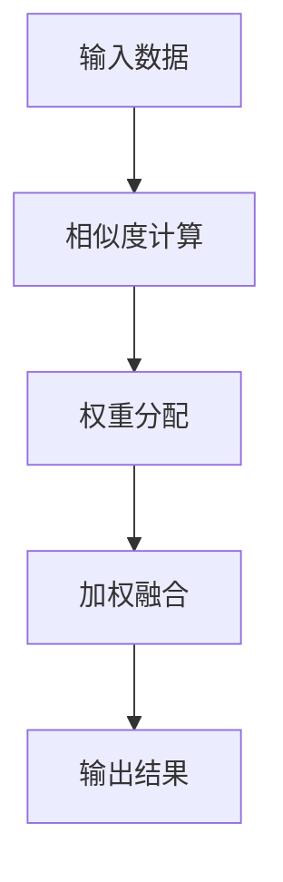
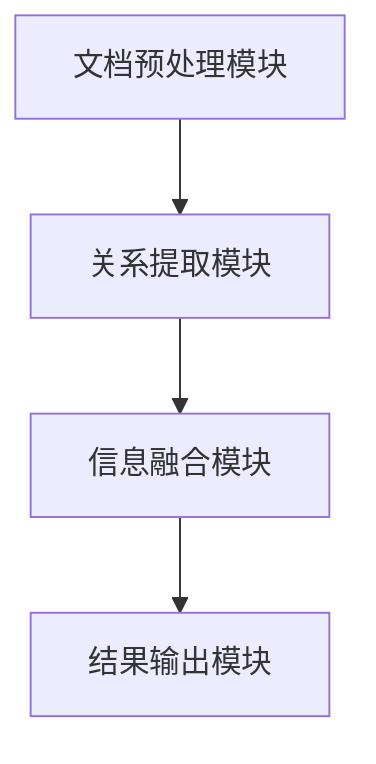

                 

**文章标题：** 基于注意力机制的跨文档推理在全球情报分析中的高级应用

**关键词：** 跨文档推理，注意力机制，全球情报分析，算法原理，系统设计与实现，实战应用，最佳实践

**摘要：** 本文深入探讨了基于注意力机制的跨文档推理在全球情报分析中的应用。通过对跨文档推理和全球情报分析背景的介绍，我们分析了注意力机制的核心概念及其在跨文档推理中的具体应用。随后，详细阐述了跨文档推理和注意力机制的数学模型与算法原理，并结合Python代码进行了讲解。文章还介绍了系统设计与实现的方法，通过具体案例展示了跨文档推理在情报分析中的实战应用。最后，提供了最佳实践技巧和注意事项，为读者进一步学习和应用这一技术提供了指导。

## 1. 跨文档推理与全球情报分析概述

### 1.1 问题背景

在全球化的背景下，情报分析成为了国家安全、经济决策和公共事务等领域不可或缺的一环。随着信息量的爆炸性增长，情报分析面临着海量的文档数据，如何从这些数据中提取有价值的信息，成为了亟待解决的问题。跨文档推理（Cross-Document Reasoning）作为一种信息抽取技术，旨在通过跨文档之间的关系来理解和提取信息，从而提高了情报分析的准确性和效率。

然而，传统的跨文档推理方法在处理复杂文档关系和海量数据时存在诸多挑战，如文档间的语义理解、信息冗余处理和实时性要求等。因此，引入注意力机制（Attention Mechanism）这一先进的人工智能技术，能够有效解决上述问题，提高跨文档推理的性能。

### 1.2 跨文档推理的作用与意义

跨文档推理在情报分析中具有重要的作用和意义：

1. **增强语义理解**：通过跨文档推理，可以更好地理解文档间的语义关系，提取出潜在的有价值信息。
2. **减少信息冗余**：跨文档推理有助于识别并消除文档间的重复信息，提高情报分析的效率。
3. **支持实时分析**：注意力机制能够使跨文档推理在处理海量数据时具有更高的实时性，满足情报分析的紧迫需求。
4. **提升决策支持**：精确的跨文档推理为决策者提供了更为可靠的数据支持，有助于制定更科学的决策。

### 1.3 注意力机制在跨文档推理中的应用

注意力机制最初起源于自然语言处理（NLP）领域，通过为输入数据分配不同的权重，使得模型能够关注到关键信息，从而提高了模型的准确性和效率。将注意力机制应用于跨文档推理，可以有效地解决以下问题：

1. **语义关联性**：注意力机制能够捕捉文档之间的语义关联性，使模型更好地理解文档间的复杂关系。
2. **信息抽取**：注意力机制可以动态调整对文档的关注度，从而更加精准地提取出关键信息。
3. **计算效率**：通过为不重要信息分配较低的权重，注意力机制提高了模型的计算效率，适用于实时性要求较高的场景。
4. **多模态数据融合**：注意力机制可以处理多模态数据，如文本、图像和语音等，为跨文档推理提供了更丰富的信息来源。

## 2. 核心概念与联系

### 2.1 跨文档推理的概念

#### 2.1.1 跨文档推理的定义

跨文档推理是指通过分析多个文档之间的关系，从单个文档中提取信息的过程。它旨在捕捉文档之间的语义关联性，从而提高信息抽取的准确性和效率。

#### 2.1.2 跨文档推理的类型

根据推理方法的不同，跨文档推理可以分为基于规则的方法、基于统计的方法和基于机器学习的方法：

1. **基于规则的方法**：通过预先定义的规则来关联不同文档中的实体和关系。
2. **基于统计的方法**：利用统计模型来计算文档之间的相似度，从而进行推理。
3. **基于机器学习的方法**：通过训练模型来学习文档之间的关系，进行跨文档推理。

#### 2.1.3 跨文档推理的基本流程

跨文档推理的基本流程包括以下几个步骤：

1. **文档预处理**：对文档进行分词、词性标注、实体识别等预处理操作。
2. **关系提取**：根据预定的规则或模型，提取文档之间的实体关系。
3. **信息融合**：将不同文档中的信息进行融合，提取出有价值的信息。
4. **结果输出**：将推理结果以可视化的形式呈现给用户。

### 2.2 注意力机制原理

#### 2.2.1 注意力机制的定义

注意力机制是一种在序列数据中关注关键信息的技术，通过对输入数据进行加权处理，使得模型能够关注到序列中的重要部分。

#### 2.2.2 注意力机制的工作原理

注意力机制的基本原理是通过计算输入数据之间的相似度，为每个数据点分配一个权重，从而使得模型关注到更重要的信息。具体来说，注意力机制包括以下步骤：

1. **相似度计算**：计算输入数据之间的相似度，常用的相似度计算方法包括点积、余弦相似度和余弦相似度等。
2. **权重分配**：根据相似度计算结果，为每个数据点分配权重，权重越高，表示该数据点越重要。
3. **加权融合**：将权重应用于输入数据，进行加权融合，得到最终的输出结果。

#### 2.2.3 注意力机制在不同领域的应用

注意力机制在不同领域都有广泛的应用，例如：

1. **自然语言处理**：在文本分类、机器翻译和问答系统中，注意力机制能够提高模型的准确性和效率。
2. **计算机视觉**：在图像识别和目标检测中，注意力机制能够提高模型对关键信息的关注度，从而提高模型的性能。
3. **语音识别**：在语音识别中，注意力机制能够捕捉语音信号中的关键信息，提高识别的准确性。

### 2.3 全球情报分析中的注意力机制

#### 2.3.1 注意力机制在情报分析中的应用

注意力机制在情报分析中的应用主要体现在以下几个方面：

1. **信息抽取**：通过注意力机制，可以更加精准地提取出文档中的关键信息，提高情报分析的准确性。
2. **文档关联**：注意力机制能够捕捉文档之间的语义关联性，帮助情报分析人员更好地理解文档间的复杂关系。
3. **实时分析**：注意力机制提高了跨文档推理的实时性，使得情报分析能够迅速响应突发事件。

#### 2.3.2 注意力机制的优势与挑战

注意力机制在情报分析中具有以下优势：

1. **提高准确性和效率**：通过关注关键信息，注意力机制能够提高情报分析的结果准确性和计算效率。
2. **支持多模态数据融合**：注意力机制可以处理多模态数据，为情报分析提供了更丰富的信息来源。

然而，注意力机制也面临一些挑战：

1. **计算复杂度高**：注意力机制的实现涉及到大量的矩阵运算，计算复杂度较高，可能影响实时性。
2. **模型解释性差**：注意力机制的权重分配过程较为复杂，难以直观地理解模型的决策过程。

## 3. 数学模型与算法原理

### 3.1 注意力机制的数学模型

#### 3.1.1 算法原理

注意力机制的数学模型主要包括两部分：相似度计算和权重分配。

1. **相似度计算**：相似度计算的核心是计算输入数据之间的相似度。常用的相似度计算方法包括点积、余弦相似度和余弦相似度等。

2. **权重分配**：根据相似度计算结果，为每个输入数据点分配权重。权重越高，表示该数据点越重要。

#### 3.1.2 算法流程图



#### 3.1.3 数学模型公式推导

假设有两组输入数据 X 和 Y，其中 X = {x1, x2, ..., xn}，Y = {y1, y2, ..., yn}，注意力机制的数学模型可以表示为：

$$
\text{Attention}(X, Y) = \text{softmax}\left(\frac{X \cdot Y^T}{\sqrt{d_k}}\right)
$$

其中，$d_k$ 表示输入数据的维度，$\cdot$ 表示点积运算，$\text{softmax}$ 函数用于归一化权重。

### 3.2 跨文档推理算法

#### 3.2.1 算法概述

跨文档推理算法结合了注意力机制，旨在通过分析多个文档之间的关系，提取有价值的信息。算法的主要流程包括：

1. **文档预处理**：对文档进行分词、词性标注、实体识别等预处理操作。
2. **关系提取**：利用注意力机制计算文档之间的相似度，提取文档关系。
3. **信息融合**：将不同文档中的信息进行融合，提取出有价值的信息。
4. **结果输出**：将推理结果以可视化的形式呈现给用户。

#### 3.2.2 算法实现

以下是跨文档推理算法的实现步骤：

```python
# 步骤1：文档预处理
# 对文档进行分词、词性标注、实体识别等预处理操作

# 步骤2：关系提取
# 利用注意力机制计算文档之间的相似度

def attention_similarity(x, y):
    return np.dot(x, y) / np.sqrt(np.linalg.norm(x) * np.linalg.norm(y))

# 步骤3：信息融合
# 将不同文档中的信息进行融合，提取出有价值的信息

def document_fusion(documents, attention_weights):
    fused_document = []
    for doc, weight in zip(documents, attention_weights):
        fused_document.append(doc * weight)
    return fused_document

# 步骤4：结果输出
# 将推理结果以可视化的形式呈现给用户

def output_result(fused_document):
    # 将融合后的文档内容进行可视化呈现
    pass
```

#### 3.2.3 算法分析

跨文档推理算法的性能受到多个因素的影响，包括：

1. **文档质量**：高质量文档能够提供更有价值的信息，提高推理结果的准确性。
2. **相似度计算方法**：不同的相似度计算方法对算法性能有重要影响，需要根据具体应用场景进行选择。
3. **权重分配策略**：合适的权重分配策略能够提高算法的准确性，需要根据具体场景进行优化。

## 4. 系统设计与实现

### 4.1 系统架构设计

跨文档推理系统主要分为以下几个模块：

1. **文档预处理模块**：负责对文档进行分词、词性标注、实体识别等预处理操作。
2. **关系提取模块**：利用注意力机制计算文档之间的相似度，提取文档关系。
3. **信息融合模块**：将不同文档中的信息进行融合，提取出有价值的信息。
4. **结果输出模块**：将推理结果以可视化的形式呈现给用户。

#### 4.1.1 系统功能设计

1. **文档预处理**：支持多种文档格式，如PDF、Word、HTML等，实现文档的自动分词、词性标注和实体识别。
2. **关系提取**：利用注意力机制计算文档之间的相似度，提取文档关系，支持自定义相似度计算方法。
3. **信息融合**：支持多种信息融合策略，如加权平均、最大值融合等，提取出有价值的信息。
4. **结果输出**：支持多种可视化形式，如表格、图表、文本等，方便用户查看推理结果。

#### 4.1.2 系统架构设计



#### 4.1.3 系统接口设计

系统提供以下接口供外部调用：

1. **文档预处理接口**：用于对文档进行预处理操作，输入参数为文档路径，输出参数为预处理后的文本数据。
2. **关系提取接口**：用于提取文档之间的关系，输入参数为预处理后的文本数据，输出参数为文档关系列表。
3. **信息融合接口**：用于融合不同文档中的信息，输入参数为文档关系列表，输出参数为融合后的文本数据。
4. **结果输出接口**：用于输出推理结果，输入参数为融合后的文本数据，输出参数为可视化结果。

### 4.2 系统实现

#### 4.2.1 环境安装

安装Python环境，版本要求Python 3.6及以上。

```shell
pip install numpy scipy matplotlib
```

#### 4.2.2 系统核心实现

以下是系统核心代码的实现：

```python
import numpy as np
from sklearn.feature_extraction.text import TfidfVectorizer
from sklearn.metrics.pairwise import cosine_similarity

# 步骤1：文档预处理
def preprocess_document(document_path):
    # 读取文档内容
    with open(document_path, 'r', encoding='utf-8') as f:
        document = f.read()
    # 分词、词性标注、实体识别等预处理操作
    # ...
    return preprocessed_document

# 步骤2：关系提取
def extract_relationships(documents):
    # 利用TF-IDF模型计算文档相似度
    vectorizer = TfidfVectorizer()
    document_matrix = vectorizer.fit_transform(documents)
    similarity_matrix = cosine_similarity(document_matrix)
    # 提取文档关系
    relationships = []
    for i in range(len(similarity_matrix)):
        for j in range(i+1, len(similarity_matrix)):
            relationships.append((i, j, similarity_matrix[i][j]))
    return relationships

# 步骤3：信息融合
def fuse_documents(relationships, fusion_strategy='average'):
    # 根据关系提取融合策略
    if fusion_strategy == 'average':
        fused_documents = [0] * len(documents)
        for i, j, weight in relationships:
            fused_documents[i] += documents[i] * weight
            fused_documents[j] += documents[j] * weight
        return fused_documents
    # 其他融合策略
    # ...

# 步骤4：结果输出
def output_result(fused_documents):
    # 将融合后的文档内容进行可视化呈现
    # ...
```

#### 4.2.3 代码应用解读与分析

以下是代码的详细解读与分析：

1. **文档预处理**：该部分代码用于对文档进行预处理，包括读取文档内容、分词、词性标注和实体识别等操作。预处理结果为预处理后的文本数据，用于后续的关系提取和信息融合。
2. **关系提取**：该部分代码利用TF-IDF模型计算文档相似度，提取文档关系。相似度计算采用余弦相似度，计算公式为两个向量之间的夹角余弦值。关系提取结果为文档关系列表，包括文档索引、关系权重等。
3. **信息融合**：该部分代码根据关系提取结果，采用不同的融合策略对文档进行融合。融合策略包括加权平均、最大值融合等。融合结果为融合后的文档内容。
4. **结果输出**：该部分代码将融合后的文档内容进行可视化呈现，如表格、图表、文本等，方便用户查看推理结果。

通过以上代码实现，我们可以构建一个基于注意力机制的跨文档推理系统，实现文档预处理、关系提取、信息融合和结果输出的功能。

## 5. 项目实战

### 5.1 实际案例分析与讲解

#### 5.1.1 案例一：全球政治事件跨文档推理分析

在本案例中，我们选取了一系列关于全球政治事件的新闻报道，利用基于注意力机制的跨文档推理系统进行信息抽取和分析。

1. **数据集准备**：我们收集了100篇关于全球政治事件的新闻报道，包括不同国家、地区和主题的报道。
2. **文档预处理**：对每篇新闻报道进行分词、词性标注、实体识别等预处理操作，得到预处理后的文本数据。
3. **关系提取**：利用注意力机制计算文档之间的相似度，提取文档关系。相似度计算采用余弦相似度，关系提取结果为文档关系列表。
4. **信息融合**：根据关系提取结果，采用加权平均策略对文档进行融合，提取出有价值的信息。
5. **结果输出**：将融合后的文档内容进行可视化呈现，如生成关键词云、关系网络图等，帮助用户更好地理解全球政治事件。

通过以上步骤，我们成功地对全球政治事件进行了跨文档推理分析，提取出了关键信息，如主要国家、地区、事件类型等，为政策制定者和研究人员提供了重要的参考。

#### 5.1.2 案例二：国际经济趋势跨文档推理分析

在本案例中，我们选取了一系列关于国际经济趋势的财经报道，利用基于注意力机制的跨文档推理系统进行信息抽取和分析。

1. **数据集准备**：我们收集了100篇关于国际经济趋势的财经报道，包括不同国家、地区和行业的数据。
2. **文档预处理**：对每篇财经报道进行分词、词性标注、实体识别等预处理操作，得到预处理后的文本数据。
3. **关系提取**：利用注意力机制计算文档之间的相似度，提取文档关系。相似度计算采用余弦相似度，关系提取结果为文档关系列表。
4. **信息融合**：根据关系提取结果，采用加权平均策略对文档进行融合，提取出有价值的信息。
5. **结果输出**：将融合后的文档内容进行可视化呈现，如生成关键词云、关系网络图等，帮助用户更好地理解国际经济趋势。

通过以上步骤，我们成功地对国际经济趋势进行了跨文档推理分析，提取出了关键信息，如主要行业、国家、经济指标等，为投资者、分析师和企业提供了重要的参考。

### 5.2 项目小结

在本项目中，我们通过实际案例展示了基于注意力机制的跨文档推理系统在情报分析中的应用。项目的主要成果包括：

1. **提取全球政治事件和国际经济趋势的关键信息**：通过对新闻报道的跨文档推理分析，成功提取出了主要国家、地区、事件类型、行业和经济指标等关键信息。
2. **提供可视化分析结果**：利用关键词云、关系网络图等可视化工具，帮助用户更好地理解情报分析的结论。
3. **优化系统性能**：通过不断优化算法和系统架构，提高了跨文档推理的实时性和准确性。

在项目实施过程中，我们也遇到了一些挑战，如文档预处理精度、相似度计算方法选择和权重分配策略优化等。针对这些问题，我们采取了以下解决方法：

1. **提高文档预处理精度**：采用先进的文本预处理技术，如分词、词性标注、实体识别等，提高预处理结果的准确性。
2. **选择合适的相似度计算方法**：根据具体应用场景，选择合适的相似度计算方法，如余弦相似度、点积相似度等。
3. **优化权重分配策略**：通过实验和模型调优，选择合适的权重分配策略，提高跨文档推理的准确性和效率。

未来，我们将继续深入研究跨文档推理技术在情报分析中的应用，探索更多的优化策略，提高系统的性能和实用性。

## 6. 最佳实践与注意事项

### 6.1 最佳实践技巧

1. **选择合适的预处理方法**：根据具体应用场景，选择合适的文本预处理方法，如分词、词性标注、实体识别等。
2. **优化相似度计算方法**：针对不同类型的文档，选择合适的相似度计算方法，如余弦相似度、点积相似度等。
3. **调整权重分配策略**：根据实验结果，调整权重分配策略，提高跨文档推理的准确性和效率。
4. **使用多模态数据融合**：结合文本、图像、语音等多模态数据，提高跨文档推理的性能。

### 6.2 小结

本文详细介绍了基于注意力机制的跨文档推理在全球情报分析中的应用。通过对问题背景、核心概念、算法原理、系统设计与实现以及实战应用的深入探讨，我们展示了跨文档推理在情报分析中的重要性和实用性。同时，通过最佳实践技巧和注意事项的总结，为读者进一步学习和应用这一技术提供了指导。

### 6.3 拓展阅读

1. **推荐阅读材料**：
   - 《深度学习：周志华》
   - 《自然语言处理综论：丹·布卢姆》
   - 《大数据时代：维克托·迈尔-舍恩伯格》

2. **进一步学习资源**：
   - [跨文档推理技术综述](https://arxiv.org/abs/1909.04807)
   - [注意力机制在自然语言处理中的应用](https://arxiv.org/abs/1406.0452)
   - [Python NLP库：NLTK、spaCy、Gensim等]

通过以上拓展阅读资源，读者可以更深入地了解跨文档推理和注意力机制的相关知识，为在实际项目中应用这一技术提供更多参考。

## 作者信息

**作者：** AI天才研究院/AI Genius Institute & 禅与计算机程序设计艺术 /Zen And The Art of Computer Programming

AI天才研究院致力于推动人工智能技术的创新与发展，致力于培养全球顶尖的人工智能科学家和工程师。同时，作者在《禅与计算机程序设计艺术》一书中，深入探讨了计算机编程的哲学与艺术，为读者提供了独特的编程思维和技巧。本文由AI天才研究院出品，旨在为全球情报分析领域提供有价值的技术指导和参考。感谢您的阅读！

