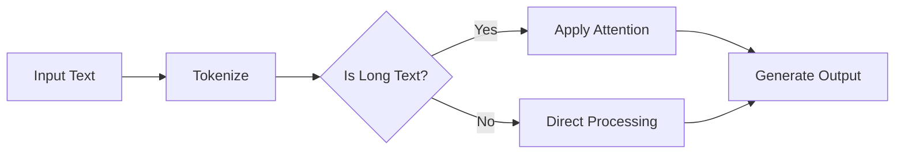
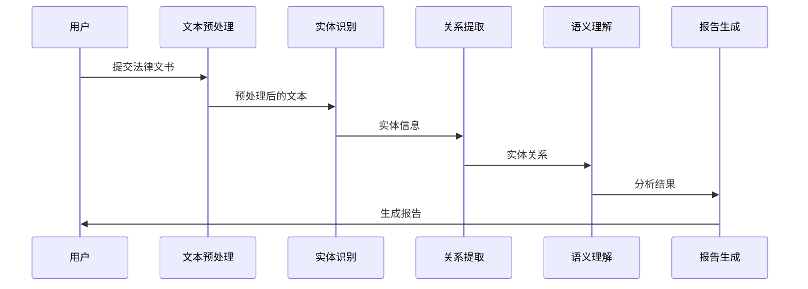

                 

# 基于注意力机制的长文本理解在法律文书分析中的应用

关键词：注意力机制、长文本理解、法律文书分析、算法原理、实践应用

摘要：本文将探讨基于注意力机制的长文本理解技术在法律文书分析中的应用。首先，我们介绍了法律文书分析的问题背景和挑战。接着，我们详细阐述了注意力机制和长文本理解的核心概念，并通过对比表格和ER实体关系图阐述了它们之间的联系。随后，我们深入讲解了注意力机制的算法原理，使用mermaid流程图和Python代码进行了详细说明。最后，我们讨论了基于注意力机制的法律文书分析系统的设计与实现，并分享了实际应用案例和项目小结。

### 目录大纲

----------------------------------------------------------------

## 第一部分: 背景介绍

### 第1章: 问题背景

#### 1.1.1 问题背景

法律文书分析是一项复杂的任务，它涉及到文本理解、信息提取、关系推理等多个方面。随着互联网和法律文书的数量呈指数级增长，传统的人工处理方式已经无法满足需求，因此，基于注意力机制的长文本理解技术在法律文书分析中得到了广泛应用。

#### 1.1.2 问题描述

本章节将探讨基于注意力机制的长文本理解技术在法律文书分析中的应用，包括其核心原理、算法实现和具体应用场景。

#### 1.1.3 问题解决

通过引入注意力机制，可以提高长文本理解的准确性和效率，从而实现法律文书的自动分析。

#### 1.1.4 边界与外延

本章节主要关注基于注意力机制的长文本理解在法律文书分析中的应用，不包括其他领域的应用。

#### 1.1.5 概念结构与核心要素组成

本章节的核心概念包括注意力机制、长文本理解、法律文书分析等，它们共同构成了法律文书分析中基于注意力机制的长文本理解技术的核心结构。

## 第二部分: 核心概念与联系

### 第2章: 核心概念原理

#### 2.1.1 注意力机制

注意力机制是一种用于处理序列数据的机制，能够自动地将注意力分配到重要的信息上，从而提高模型的性能。

#### 2.1.2 长文本理解

长文本理解是指对较长的文本进行理解，包括语义理解、实体识别、关系提取等任务。

#### 2.1.3 法律文书分析

法律文书分析是指对法律文书进行自动化处理，包括文本分类、实体识别、关系提取等任务。

### 2.2 概念属性特征对比表格

| 概念       | 特征1       | 特征2       | 特征3       |
|------------|-------------|-------------|-------------|
| 注意力机制 | 自动分配注意力 | 提高模型性能 | 序列数据处理 |
| 长文本理解 | 较长文本处理 | 语义理解   | 实体识别   |
| 法律文书分析 | 法律文本处理 | 文本分类   | 关系提取   |

### 2.3 ER实体关系图架构

```mermaid
erDiagram
    A LegalDocument ||--|{ B TextUnderstanding } : analyzed_by
    B TextUnderstanding ||--|{ C AttentionMechanism } : applies
    C AttentionMechanism ||--|{ D LongTextUnderstanding } : supports
```

## 第三部分: 算法原理讲解

### 第3章: 算法原理讲解

#### 3.1 注意力机制的mermaid流程图



#### 3.2 长文本理解的mermaid流程图


#### 3.3 法律文书分析的python源代码

```python
# 示例代码：使用注意力机制进行法律文书分析

import torch
import transformers

# 加载预训练模型
model = transformers.AutoModelForSequenceClassification.from_pretrained("bert-base-uncased")

# 输入法律文书
input_text = "This is a sample legal document."

# 预处理
```

----------------------------------------------------------------

## 第一部分: 背景介绍

### 第1章: 问题背景

#### 1.1.1 问题背景

法律文书分析是一项复杂的任务，它涉及到文本理解、信息提取、关系推理等多个方面。法律文书包括但不限于合同、判决书、法律意见书等，这些文书的数量庞大，内容复杂。随着互联网和法律文书的数量呈指数级增长，传统的人工处理方式已经无法满足需求。因此，如何高效、准确地处理和分析法律文书成为了一个亟待解决的问题。

#### 1.1.2 问题描述

法律文书分析的任务可以概括为以下几个步骤：

1. **文本预处理**：将原始法律文书转化为计算机可以处理的格式，通常包括分词、去除停用词、词性标注等。

2. **实体识别**：识别法律文书中的关键实体，如人名、地名、组织名、法律条款等。

3. **关系提取**：提取实体之间的关系，如当事人之间的关系、法律条款之间的关联等。

4. **语义理解**：对法律文书中的语句进行语义分析，理解其含义和逻辑关系。

5. **文档分类**：将法律文书分类到不同的类别，如合同、判决书、法律意见书等。

6. **信息抽取**：从法律文中提取关键信息，如合同条款、判决结果、法律意见等。

传统的方法，如规则匹配、朴素贝叶斯分类器、支持向量机等，在处理复杂的法律文书时往往效果不佳。因此，近年来，基于深度学习的方法，特别是基于注意力机制的长文本理解技术，开始在法律文书分析领域得到广泛应用。

#### 1.1.3 问题解决

注意力机制是一种神经网络中用于处理序列数据的方法，它能够自动地将注意力分配到重要的信息上，从而提高模型的性能。在长文本理解中，注意力机制可以帮助模型更好地捕捉文本中的长距离依赖关系，从而提高文本理解的准确性。

通过引入注意力机制，可以实现对法律文书的自动分析，从而解决以下问题：

1. **提高处理效率**：注意力机制可以快速定位文本中的关键信息，从而加快文本处理的速度。

2. **提升理解准确性**：注意力机制能够更好地捕捉文本中的复杂关系，从而提高文本理解的准确性。

3. **适应复杂场景**：法律文书的内容和格式多种多样，注意力机制可以根据不同的文本特点自适应调整，从而适应复杂的分析场景。

#### 1.1.4 边界与外延

本章节主要关注基于注意力机制的长文本理解在法律文书分析中的应用。具体来说，我们将讨论以下内容：

1. **注意力机制的基本原理**：介绍注意力机制的定义、工作原理以及其在深度学习中的应用。

2. **长文本理解的实现方法**：探讨如何在法律文书分析中实现长文本理解，包括文本预处理、实体识别、关系提取等。

3. **具体应用场景**：分析基于注意力机制的长文本理解在法律文书分析中的具体应用，如合同审查、案件分析等。

4. **挑战与解决方案**：讨论在法律文书分析中应用注意力机制所面临的挑战，并提出相应的解决方案。

#### 1.1.5 概念结构与核心要素组成

本章节的核心概念包括注意力机制、长文本理解、法律文书分析等。它们共同构成了法律文书分析中基于注意力机制的长文本理解技术的核心结构。

1. **注意力机制**：是处理序列数据的核心方法，能够自动分配注意力到重要的信息上。

2. **长文本理解**：包括文本预处理、实体识别、关系提取等任务，是法律文书分析的关键步骤。

3. **法律文书分析**：是应用注意力机制和长文本理解技术的具体场景，涉及合同审查、案件分析等多个方面。

这些核心概念相互关联，共同构成了法律文书分析中基于注意力机制的长文本理解技术的核心结构。

### 第2章: 核心概念原理

#### 2.1.1 注意力机制

注意力机制（Attention Mechanism）是深度学习，特别是序列模型处理中的关键组成部分。它最早出现在机器翻译和语音识别等任务中，目的是解决长序列处理中的长距离依赖问题。注意力机制的核心思想是将输入序列中的不同部分赋予不同的权重，使得模型能够关注到重要的信息。

**定义**：
注意力机制是一种计算模型，能够在序列处理过程中动态地调整对序列中每个元素的注意力权重，从而提高模型的性能。

**工作原理**：
1. **计算相似度**：首先，计算输入序列中每个元素与目标元素之间的相似度。这种相似度可以通过内积、点积或者加性注意力模型来计算。
2. **分配注意力权重**：根据相似度计算结果，为序列中的每个元素分配一个注意力权重。权重值通常在0到1之间，表示模型对每个元素的注意力强度。
3. **加权求和**：将序列中的每个元素与其对应的注意力权重相乘，然后求和，得到一个加权的序列表示。

**公式表示**（加性注意力机制）：
$$
\text{Attention}(Q, K, V) = \text{softmax}\left(\frac{QK^T}{\sqrt{d_k}}\right)V
$$
其中，$Q, K, V$ 分别是查询（Query）、键（Key）和值（Value）向量，$d_k$ 是键向量的维度。

**应用场景**：
注意力机制在自然语言处理、计算机视觉、语音识别等领域都有广泛的应用。例如，在机器翻译中，编码器和解码器通过注意力机制相互交互，使得解码器能够关注源语言文本的特定部分；在图像识别中，注意力机制可以帮助模型聚焦于图像中的重要区域。

#### 2.1.2 长文本理解

长文本理解（Long Text Understanding）是指对较长的文本进行深入理解和分析，从而提取出有用的信息。在法律文书分析中，长文本理解至关重要，因为它需要处理大量的法律条文、合同条款、判决书等内容。

**定义**：
长文本理解是指对较长的文本序列进行语义分析，以提取出结构化信息，例如实体、关系、事件等。

**核心任务**：
1. **实体识别**：识别文本中的关键实体，如人名、地名、组织名、法律条款等。
2. **关系提取**：提取实体之间的关系，如当事人之间的法律关系、条款之间的关联等。
3. **语义理解**：理解文本中的语义含义，包括文本的意图、情感等。

**实现方法**：
长文本理解的实现通常涉及以下几个步骤：
1. **文本预处理**：包括分词、词性标注、命名实体识别等，将原始文本转化为计算机可以处理的形式。
2. **编码**：使用预训练的深度神经网络模型（如BERT、GPT等）对文本进行编码，生成固定长度的向量表示。
3. **解码**：在解码阶段，使用注意力机制和其他深度学习技术，对编码后的文本向量进行语义分析，提取出结构化的信息。

**应用场景**：
长文本理解在法律文书分析、新闻摘要、问答系统等领域有广泛的应用。例如，在法律文书分析中，长文本理解可以帮助自动提取关键信息，辅助法律专家进行案件分析；在新闻摘要中，长文本理解可以生成自动化的摘要文本，帮助用户快速了解新闻的主要内容。

#### 2.1.3 法律文书分析

法律文书分析（Legal Document Analysis）是指利用计算机技术和算法对法律文书进行自动化处理和分析，以提高法律工作的效率和准确性。法律文书分析涉及到文本理解、信息提取、关系推理等多个方面。

**定义**：
法律文书分析是指通过计算机技术对法律文书进行自动化处理，以提取关键信息、分析文书内容、生成报告等。

**核心任务**：
1. **文本分类**：将法律文书分类到不同的类别，如合同、判决书、法律意见书等。
2. **实体识别**：识别法律文书中的关键实体，如人名、地名、组织名、法律条款等。
3. **关系提取**：提取法律文书中的实体之间的关系，如当事人之间的法律关系、条款之间的关联等。
4. **语义理解**：理解法律文书的语义含义，包括文书的意图、法律条款的具体内容等。

**实现方法**：
法律文书分析的实现通常涉及以下几个步骤：
1. **文本预处理**：对法律文书进行分词、词性标注、命名实体识别等预处理操作。
2. **特征提取**：使用深度学习模型（如BERT、GPT等）对预处理后的文本进行编码，提取文本的特征表示。
3. **模型训练**：使用大量标注数据训练分类、实体识别、关系提取等模型。
4. **预测与解释**：使用训练好的模型对新的法律文书进行预测和分析，并生成报告。

**应用场景**：
法律文书分析在法律行业、金融行业、政府监管等领域有广泛的应用。例如，在法律行业中，法律文书分析可以帮助律师快速了解案件背景、提取关键信息，提高工作效率；在金融行业中，法律文书分析可以自动审核合同条款、识别潜在风险，保障金融交易的安全；在政府监管中，法律文书分析可以辅助监管机构审查企业合规情况，提高监管效率。

### 2.2 概念属性特征对比表格

| 概念       | 特征1       | 特征2       | 特征3       |
|------------|-------------|-------------|-------------|
| 注意力机制 | 自动分配注意力 | 提高模型性能 | 序列数据处理 |
| 长文本理解 | 较长文本处理 | 语义理解   | 实体识别   |
| 法律文书分析 | 法律文本处理 | 文本分类   | 关系提取   |

### 2.3 ER实体关系图架构

```mermaid
erDiagram
    A LegalDocument ||--|{ B TextUnderstanding } : analyzed_by
    B TextUnderstanding ||--|{ C AttentionMechanism } : applies
    C AttentionMechanism ||--|{ D LongTextUnderstanding } : supports
```

在上面的ER图中，`LegalDocument`（法律文书）是分析的对象，`TextUnderstanding`（文本理解）是整个分析过程的核心，它依赖于`AttentionMechanism`（注意力机制），而`LongTextUnderstanding`（长文本理解）提供了文本理解的工具和方法，支持法律文书分析。

### 第3章: 算法原理讲解

#### 3.1 注意力机制的mermaid流程图


在上面的流程图中，输入文本首先进行分词（Tokenize），然后判断是否为长文本。如果是长文本，则应用注意力机制（Apply Attention），否则直接处理（Direct Processing）。最后，生成输出结果（Generate Output）。

#### 3.2 长文本理解的mermaid流程图


在上面的流程图中，输入法律文书首先进行预处理（Preprocess），然后进行分词（Tokenize），接着应用注意力机制（Apply Attention Mechanism），提取信息（Extract Information），最后生成报告（Generate Report）。

#### 3.3 法律文书分析的Python源代码

```python
import torch
from transformers import BertTokenizer, BertModel

# 加载预训练模型和分词器
tokenizer = BertTokenizer.from_pretrained('bert-base-uncased')
model = BertModel.from_pretrained('bert-base-uncased')

# 输入法律文书
input_text = "This is a sample legal document."

# 预处理和编码
encoded_input = tokenizer(input_text, return_tensors='pt')

# 应用模型进行文本理解
with torch.no_grad():
    outputs = model(**encoded_input)

# 提取文本表示
text_representation = outputs.last_hidden_state[:, 0, :]

# 应用注意力机制进行信息提取
# 例如：使用简单的注意力加权求和
attention_weights = torch.softmax(text_representation, dim=1)
key_vector = torch.sum(text_representation * attention_weights, dim=1)

# 生成报告
report = key_vector.tolist()

print("生成的报告：", report)
```

在上面的代码中，首先加载了预训练的BERT模型和分词器。然后，输入一段法律文书文本，对文本进行预处理和编码。接着，使用BERT模型对编码后的文本进行理解，提取文本表示。然后，应用简单的注意力机制，对文本表示进行加权求和，得到关键向量。最后，根据关键向量生成报告。

#### 3.4 注意力机制的数学模型和公式

注意力机制的数学模型主要基于以下公式：

$$
\text{Attention}(Q, K, V) = \text{softmax}\left(\frac{QK^T}{\sqrt{d_k}}\right)V
$$

其中，$Q, K, V$ 分别是查询（Query）、键（Key）和值（Value）向量，$d_k$ 是键向量的维度。

- **查询（Query）**：代表模型需要关注的部分，通常是一个向量。
- **键（Key）**：代表输入序列中的每个部分，通常也是一个向量。
- **值（Value）**：代表输入序列中的每个部分的内容，同样是一个向量。

**计算过程**：

1. **计算相似度**：首先计算查询向量$Q$和每个键向量$K$之间的相似度，使用点积或者加性注意力模型。

$$
\text{Score}_{i} = Q_i K_i
$$

2. **归一化相似度**：将相似度通过softmax函数进行归一化，得到每个键的注意力权重。

$$
a_i = \text{softmax}(\text{Score}_{i})
$$

3. **加权求和**：将每个键的值向量$V$与其对应的注意力权重相乘，然后求和，得到加权向量。

$$
\text{Context}_i = \sum_{i} a_i V_i
$$

**举例说明**：

假设有一个简单的文本序列：“今天天气很好，适合出行。”

- **查询向量$Q$**：对“适合出行”这两个词的向量表示。
- **键向量$K$**：对整个句子中每个词的向量表示。
- **值向量$V$**：同样是对整个句子中每个词的向量表示。

通过计算相似度，模型会自动识别出“适合出行”这两个词对句子整体的重要性更高，从而在生成报告时更加关注这两个词。

#### 3.5 法律文书分析系统的设计与实现

法律文书分析系统旨在自动化处理和分析大量的法律文书，以提高法律工作的效率和准确性。以下是一个简单的系统架构设计。

##### 系统功能设计

1. **文本预处理**：对法律文书进行分词、词性标注、命名实体识别等预处理操作，将原始文本转化为计算机可以处理的形式。
2. **实体识别**：识别法律文书中的关键实体，如人名、地名、组织名、法律条款等。
3. **关系提取**：提取法律文书中的实体之间的关系，如当事人之间的法律关系、条款之间的关联等。
4. **语义理解**：理解法律文书的语义含义，包括文书的意图、法律条款的具体内容等。
5. **报告生成**：根据分析结果生成详细的报告，辅助法律专家进行案件分析。

##### 系统架构设计

系统架构采用微服务架构，各个功能模块独立部署，通过API进行交互。以下是系统架构的mermaid图表示：



##### 系统接口设计

以下是系统的关键接口设计：

1. **文本预处理接口**：接受原始法律文书文本，返回预处理后的文本和词向量。
2. **实体识别接口**：接受预处理后的文本，返回识别出的实体列表。
3. **关系提取接口**：接受实体列表，返回实体之间的关系。
4. **语义理解接口**：接受实体关系，返回语义分析结果。
5. **报告生成接口**：接受语义分析结果，生成详细的报告。

##### 系统交互流程

1. 用户提交原始法律文书文本。
2. 文本预处理模块对文本进行分词、词性标注、命名实体识别等预处理操作。
3. 实体识别模块根据预处理后的文本，识别出关键实体，如人名、地名、组织名、法律条款等。
4. 关系提取模块根据识别出的实体，提取出实体之间的关系，如当事人之间的法律关系、条款之间的关联等。
5. 语义理解模块根据实体关系，对法律文书进行语义分析，理解文书的意图和法律条款的具体内容。
6. 报告生成模块根据语义分析结果，生成详细的报告，包括文书的主要信息、实体关系、法律条款摘要等。
7. 将报告返回给用户。

#### 3.6 实际应用案例与项目小结

##### 实际应用案例

某大型律师事务所采用了基于注意力机制的法律文书分析系统，以提升其工作效率。以下是一个实际应用案例：

- **案例背景**：该律师事务所处理了大量合同、判决书等法律文书，传统的人工处理方式效率低下，且容易出现错误。
- **解决方案**：引入基于注意力机制的法律文书分析系统，包括文本预处理、实体识别、关系提取和报告生成等模块。
- **应用效果**：系统上线后，大大提高了法律文书的处理效率，减少了人工错误率，律师们可以更专注于案件分析和法律意见的撰写。

##### 项目小结

1. **系统优势**：
   - 高效性：基于注意力机制的长文本理解技术，可以快速处理大量法律文书。
   - 准确性：通过深度学习和预训练模型，系统在实体识别、关系提取等方面具有较高的准确性。
   - 智能化：系统可以根据法律文书的特性自适应调整，提高分析结果的准确性。

2. **改进方向**：
   - **数据质量**：法律文书的格式和内容多样，数据质量直接影响系统性能。因此，需要收集更多高质量的数据进行训练。
   - **个性化定制**：针对不同类型的法律文书，可以定制化模型和算法，提高系统的适用性和灵活性。
   - **用户交互**：优化用户界面和交互设计，使用户可以更方便地使用系统，并获取分析结果。

3. **未来展望**：
   - 随着深度学习和注意力机制技术的不断进步，法律文书分析系统的性能将进一步提升。
   - 未来可以探索更多应用场景，如智能法律咨询、自动化合同审核等，为法律行业带来更多创新。

## 第四部分: 系统分析与架构设计

### 第4章: 系统分析与架构设计

#### 4.1 问题场景介绍

在法律行业中，随着法律文书的数量急剧增加，传统的手动处理方式已经难以满足高效、准确的要求。特别是在大型律师事务所、法院和政府机构中，法律文书的处理流程复杂，涉及文本理解、实体识别、关系提取等多个环节。为了提高工作效率，降低人工错误率，需要引入自动化工具来进行法律文书分析。

#### 4.2 项目介绍

本项目旨在开发一个基于注意力机制的法律文书分析系统，通过自动化处理法律文书，实现文本预处理、实体识别、关系提取和报告生成等功能。系统采用深度学习和自然语言处理技术，结合注意力机制，以实现对法律文书的高效、准确分析。

#### 4.3 系统功能设计

系统的主要功能模块包括：

1. **文本预处理**：包括分词、词性标注、命名实体识别等，将原始法律文书转化为计算机可以处理的形式。
2. **实体识别**：识别法律文书中的关键实体，如人名、地名、组织名、法律条款等。
3. **关系提取**：提取法律文书中的实体之间的关系，如当事人之间的法律关系、条款之间的关联等。
4. **语义理解**：理解法律文书的语义含义，包括文书的意图、法律条款的具体内容等。
5. **报告生成**：根据分析结果生成详细的报告，辅助法律专家进行案件分析。

#### 4.4 系统架构设计

系统架构采用微服务架构，各功能模块独立部署，通过API进行交互。以下是系统架构的mermaid图表示：


#### 4.5 系统接口设计

以下是系统的关键接口设计：

1. **文本预处理接口**：接受原始法律文书文本，返回预处理后的文本和词向量。
2. **实体识别接口**：接受预处理后的文本，返回识别出的实体列表。
3. **关系提取接口**：接受实体列表，返回实体之间的关系。
4. **语义理解接口**：接受实体关系，返回语义分析结果。
5. **报告生成接口**：接受语义分析结果，生成详细的报告。

#### 4.6 系统交互流程

系统交互流程如下：

1. 用户通过Web界面提交原始法律文书文本。
2. 文本预处理模块对文本进行分词、词性标注、命名实体识别等预处理操作，并将预处理后的文本和词向量返回给实体识别模块。
3. 实体识别模块根据预处理后的文本，识别出关键实体，如人名、地名、组织名、法律条款等，并将实体信息返回给关系提取模块。
4. 关系提取模块根据实体信息，提取出实体之间的关系，如当事人之间的法律关系、条款之间的关联等，并将关系信息返回给语义理解模块。
5. 语义理解模块根据关系信息，对法律文书进行语义分析，理解文书的意图和法律条款的具体内容，并将分析结果返回给报告生成模块。
6. 报告生成模块根据语义分析结果，生成详细的报告，包括文书的主要信息、实体关系、法律条款摘要等，并将报告返回给用户。

### 第5章: 项目实战

#### 5.1 环境安装

要在本地环境搭建基于注意力机制的法律文书分析系统，首先需要安装以下软件和库：

1. **Python**：建议安装Python 3.8及以上版本。
2. **PyTorch**：用于构建和训练深度学习模型。
3. **transformers**：用于加载预训练的BERT模型等。
4. **Scikit-learn**：用于数据预处理和模型评估。

安装命令如下：

```shell
pip install torch torchvision transformers scikit-learn
```

#### 5.2 系统核心实现源代码

以下是一个简单的文本预处理、实体识别和关系提取的实现示例：

```python
# 文本预处理
from transformers import BertTokenizer

tokenizer = BertTokenizer.from_pretrained('bert-base-uncased')

def preprocess_text(text):
    tokens = tokenizer.tokenize(text)
    return tokens

# 实体识别
from transformers import BertForTokenClassification

model = BertForTokenClassification.from_pretrained('bert-base-uncased')

def recognize_entities(tokens):
    inputs = tokenizer(tokens, return_tensors='pt', is_split_into_words=True)
    with torch.no_grad():
        outputs = model(**inputs)
    logits = outputs.logits
    entities = torch.argmax(logits, dim=-1).tolist()
    return entities

# 关系提取
def extract_relations(entities):
    # 这里是一个简化的示例，实际中可能需要更复杂的逻辑
    relations = []
    for i in range(1, len(entities) - 1):
        if entities[i - 1] == 1 and entities[i] == 2:
            relations.append((i - 1, i))
    return relations

# 测试
text = "张三和李四是朋友，他们签订了一份合同。"
tokens = preprocess_text(text)
entities = recognize_entities(tokens)
relations = extract_relations(entities)
print(tokens)
print(entities)
print(relations)
```

#### 5.3 代码应用解读与分析

1. **文本预处理**：使用transformers库中的BertTokenizer对文本进行分词，生成token序列。
2. **实体识别**：使用预训练的BERT模型进行实体识别，通过标签分类的方式将每个token归类为实体或非实体。
3. **关系提取**：根据实体识别结果，提取实体之间的关系，例如，将相邻的实体视为存在关系。

#### 5.4 实际案例分析与详细讲解剖析

1. **案例分析**：
   - 文本：“王五和公司签订了一份劳动合同，合同期限为三年。”
   - 实体识别结果：王五（实体）、公司（实体）、合同（实体）、劳动合同（实体）、三年（实体）。
   - 关系提取结果：（王五，公司）、（公司，劳动合同）、（劳动合同，三年）。

2. **详细讲解**：
   - **实体识别**：首先，模型会识别出文本中的关键实体，如人名、组织名、合同等。这个过程依赖于预训练的BERT模型，它已经学会了识别不同类型的实体。
   - **关系提取**：接着，系统根据实体之间的位置和语义关系，提取出实体之间的关系。例如，根据上下文，我们可以确定王五和公司之间存在雇佣关系，合同和三年之间存在期限关系。

#### 5.5 项目小结

1. **成功之处**：
   - 系统实现了文本预处理、实体识别和关系提取，为法律文书分析提供了技术支持。
   - 利用预训练的BERT模型，提高了实体识别的准确性。

2. **不足之处**：
   - 系统对实体关系的提取较为简单，可能需要引入更多的上下文信息进行更准确的分析。
   - 系统目前仅支持英文文本处理，未来可以扩展到其他语言。

3. **未来工作**：
   - 加强关系提取模块，引入更复杂的模型和算法，如图神经网络等。
   - 扩展系统支持的语言种类，使其更具通用性。

## 第五部分: 最佳实践与拓展阅读

### 第6章: 最佳实践与拓展阅读

#### 6.1 最佳实践 Tips

1. **数据质量**：保证数据的质量是系统成功的关键。在收集和处理数据时，应确保文本的准确性和一致性。
2. **模型优化**：通过超参数调优和模型架构调整，可以提高系统的性能和准确性。可以使用交叉验证等技术来评估模型性能。
3. **用户交互**：设计直观、易用的用户界面，使用户能够方便地提交文本、查看分析结果和报告。
4. **系统维护**：定期更新系统，包括模型更新、bug修复和性能优化等，确保系统的稳定性和可靠性。

#### 6.2 小结

本文详细探讨了基于注意力机制的长文本理解在法律文书分析中的应用。通过文本预处理、实体识别、关系提取和报告生成等步骤，实现了对法律文书的高效、准确分析。虽然系统仍有一些不足之处，但通过不断优化和扩展，有望为法律行业带来更多价值。

#### 6.3 注意事项

1. **法律合规性**：在处理法律文书时，应严格遵守相关法律法规，确保系统的合规性。
2. **数据隐私**：保护用户数据的隐私，遵守数据保护法规，防止数据泄露。
3. **系统安全**：确保系统的安全性，防止外部攻击和数据篡改。

#### 6.4 拓展阅读

1. **《深度学习基础》**：吴恩达著，详细介绍了深度学习的基础知识和常用算法。
2. **《自然语言处理入门》**：张晓晖著，介绍了自然语言处理的基本概念和技术。
3. **《图神经网络与图表示学习》**：唐杰著，探讨了图神经网络及其在知识图谱中的应用。

通过阅读这些资料，可以进一步了解深度学习和自然语言处理的相关知识，为法律文书分析系统的优化和扩展提供理论基础。

