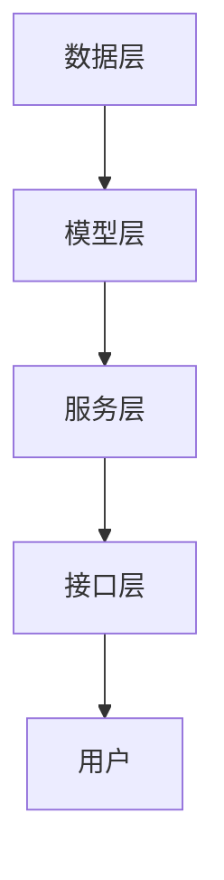
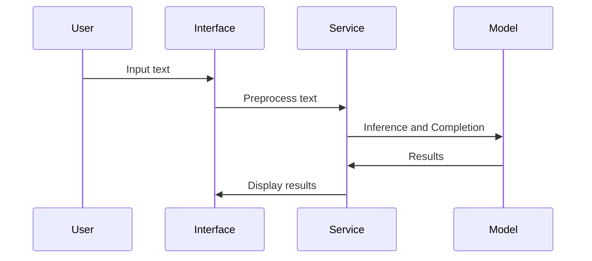

                 


### 摘要

本文将深入探讨深度学习在人工智能自然语言推理（NLI）和常识补全领域的应用。首先，我们将介绍自然语言推理和常识补全的基本概念，随后分析相关算法的原理和数学模型。文章还将通过具体的项目实践，展示如何实现NLI和常识补全系统，并对实际应用中的最佳实践进行总结。本文旨在为读者提供一个系统、全面、易于理解的技术指南，帮助他们在NLI和常识补全领域取得突破性进展。

---

## 引言

### 1.1 问题的背景

自然语言推理（NLI）和常识补全是自然语言处理（NLP）领域的重要研究方向。随着互联网信息的爆炸式增长，如何从大量的文本中提取出有价值的信息成为了一个亟待解决的问题。NLI旨在理解和处理人类语言中的逻辑关系，而常识补全则关注于填补文本中的缺失信息，以增强文本的理解深度。这两个问题的解决，不仅对文本挖掘、智能问答、机器翻译等应用具有重要意义，同时也对人工智能的通用智能发展提供了强有力的支持。

然而，现有的NLI和常识补全方法在面对复杂、不确定的语言环境时，往往表现出不足。传统的基于规则的方法在面对大量未知的语言现象时显得力不从心，而基于统计的方法虽然在一定程度上取得了进展，但仍然难以解决语义理解的深层次问题。深度学习作为一种强大的机器学习技术，在图像识别、语音识别等领域取得了显著成就，其引入到NLI和常识补全领域，无疑为解决这些难题提供了新的思路。

### 1.2 问题描述

自然语言推理的核心问题是如何判断两个句子之间的逻辑关系，这通常被描述为判断一对句子A和B，A是否能够逻辑推导出B。例如，给定句子A：“所有狗都会叫。”和句子B：“这条狗不会叫。”，我们需要判断A是否能推导出B。常识补全则涉及如何根据已知的部分文本内容，推断出可能的完整句子。例如，给定文本片段：“他买了一本书，坐在公园里，…”。我们需要推断出可能的完整句子。

这两个问题虽然在表述上有所不同，但在解决方法上具有一定的相似性。它们都需要深入理解语言的语义、上下文以及逻辑关系，这给算法设计带来了巨大的挑战。

### 1.3 问题解决

深度学习在NLI和常识补全领域的应用主要体现在以下几个方面：

1. **基于神经网络的语义表示**：深度学习模型能够通过大量的文本数据学习到句子的语义表示，这使得模型能够更好地理解句子的含义。

2. **端到端学习**：深度学习模型可以端到端地学习从输入文本到输出结果的过程，无需繁琐的特征工程和中间步骤。

3. **多任务学习**：深度学习模型能够同时学习多个任务，如同时进行NLI和常识补全，从而提高模型的泛化能力和效果。

4. **自适应能力**：深度学习模型具有自适应能力，能够根据不同的应用场景进行调整，以适应不同的语言环境和任务需求。

### 1.4 边界与外延

本文的讨论将主要围绕深度学习在NLI和常识补全领域的应用进行，涉及的关键技术包括神经网络、深度学习模型架构、语义表示、上下文理解等。然而，自然语言处理的范围远不止于此，还包括文本分类、命名实体识别、情感分析等多个方面。因此，本文的讨论将有一定的边界，主要聚焦于NLI和常识补全这两个核心问题。

### 1.5 核心概念结构与要素组成

自然语言推理和常识补全是自然语言处理中的两个重要概念，它们之间有着紧密的联系。自然语言推理主要研究如何通过逻辑关系理解句子之间的语义差异，而常识补全则是通过已知的部分信息推断出整个句子的完整内容。这两个概念的核心要素包括：

1. **语义表示**：如何将自然语言转换为机器可理解的语义表示。

2. **逻辑推理**：如何根据语义表示进行逻辑推理，判断句子之间的逻辑关系。

3. **上下文理解**：如何理解句子在特定上下文中的含义，从而进行准确的推理和补全。

4. **数据集**：用于训练和评估模型的数据集，其质量和多样性对模型的效果至关重要。

本文将详细探讨这些核心概念，并通过具体实例和算法原理的讲解，帮助读者深入理解NLI和常识补全的本质和应用。

## 核心概念介绍

### 2.1 自然语言推理（NLI）的概念

自然语言推理（Natural Language Inference，NLI）是自然语言处理（NLP）领域中的一个重要研究方向，其主要目标是理解并处理人类语言中的逻辑关系。具体来说，NLI旨在判断两个句子之间的逻辑推导关系，即一个句子是否能从另一个句子中逻辑推导出来。这种逻辑推导关系通常包括肯定（Entailment）、无关（Neutral）和反推（Contradiction）三种类型。

**肯定**：如果句子A能够逻辑推导出句子B，则称A对B有肯定关系。例如，给定句子A：“所有的猫都会爬树。”和句子B：“这只猫会爬树。”，由于A中的“所有的猫”包含了“这只猫”，因此A能够推导出B。

**无关**：如果句子A与句子B之间没有明确的逻辑关系，则称A对B有无关关系。例如，给定句子A：“明天会下雨。”和句子B：“公交车今天开通了。”，这两个句子之间没有直接的逻辑推导关系。

**反推**：如果句子A能够逻辑反推出句子B，则称A对B有反推关系。例如，给定句子A：“这只猫不会爬树。”和句子B：“这只猫不会爬树。”，由于A直接表达了B的内容，因此A反推出B。

NLI的重要性在于它不仅能够帮助计算机更好地理解自然语言，还能够应用于各种实际场景，如智能问答系统、文本摘要、情感分析等。

### 2.2 常识补全的概念

常识补全（Commonsense Completion）是另一个重要的自然语言处理任务，其目标是根据已知的部分信息，推断出可能的完整句子。常识补全的核心在于理解人类日常生活中的常识知识，并在文本处理过程中利用这些知识来填补文本中的缺失部分。

**常识补全的过程**：

1. **理解输入**：首先，模型需要理解输入文本的内容，将其转换为机器可处理的格式。

2. **提取关键信息**：从输入文本中提取出关键信息，这些信息通常包括实体、关系、时间、地点等。

3. **利用常识知识**：利用预先学习的常识知识库，推断出可能的完整句子。这些常识知识库通常包括日常生活中的常识、文化习俗、地理知识等。

4. **生成输出**：根据推断出的常识，生成可能的完整句子，并将其作为输出结果。

**常识补全的应用**：

常识补全的应用非常广泛，包括但不限于：

- **智能助手**：通过常识补全，智能助手可以更自然地与用户进行交互，理解用户的意图并提供准确的回答。
- **文本生成**：常识补全可以用于生成故事、新闻、对话等文本，提高文本的质量和连贯性。
- **文本摘要**：通过常识补全，可以从长篇文本中提取出关键信息，生成简洁的摘要。
- **情感分析**：常识补全可以帮助模型更好地理解文本中的情感色彩，从而进行更准确的情感分析。

### 2.3 核心概念的关联与对比

自然语言推理和常识补全是自然语言处理领域中的两个重要概念，它们在任务目标、处理方法和应用场景上存在一定的关联和区别。

**关联**：

- **语义理解**：两者都需要对文本进行深入理解，提取出语义信息。
- **逻辑关系**：NLI和常识补全都涉及到逻辑关系的处理，如推理、推断等。

**区别**：

- **任务目标**：NLI的核心目标是判断两个句子之间的逻辑关系，而常识补全则是根据已知信息推断出完整的句子。
- **处理方法**：NLI通常采用逻辑推理、语义表示等方法，而常识补全则更多地依赖于常识知识库和上下文理解。
- **应用场景**：NLI的应用场景包括智能问答、文本摘要、情感分析等，而常识补全则更多应用于文本生成、智能助手等场景。

综上所述，自然语言推理和常识补全是自然语言处理领域中的两个重要任务，它们在任务目标、处理方法和应用场景上既有联系又有区别，共同推动着自然语言处理技术的发展。

## 算法原理

### 3.1 自然语言推理（NLI）算法原理

自然语言推理（NLI）算法的核心在于理解句子之间的逻辑关系，并基于这些关系进行判断。目前，深度学习在NLI领域的应用已经取得了显著的成果，其中代表性的模型包括BERT、GPT和T5等。以下，我们将以BERT为例，介绍NLI算法的基本原理。

#### 3.1.1 BERT模型介绍

BERT（Bidirectional Encoder Representations from Transformers）是由Google提出的一种基于Transformer的预训练语言模型。BERT通过同时预训练两个任务——Masked Language Modeling（MLM）和Next Sentence Prediction（NSP），来学习语言的深层语义表示。

**Masked Language Modeling（MLM）**：在MLM任务中，模型需要预测被遮盖的词。这个过程有助于模型学习词汇和句子结构。

**Next Sentence Prediction（NSP）**：在NSP任务中，模型需要判断两个句子是否在同一个语境中。这个任务有助于模型理解句子之间的逻辑关系。

#### 3.1.2 BERT在NLI中的应用

BERT模型通过预训练，可以生成高质量的语义表示，这些表示对于NLI任务至关重要。在NLI任务中，BERT的主要应用步骤如下：

1. **输入句子表示**：将输入的两个句子（如A和B）分别编码为向量表示。BERT使用Transformer自注意力机制，将输入句子中的每个词映射为一个高维向量。

2. **计算句子间的相似度**：通过计算句子A和句子B的向量表示之间的相似度，来判断它们之间的逻辑关系。具体来说，可以使用BERT模型中的[CLS]标记的向量表示作为句子A的整体表示，将句子B的向量表示与它逐词计算相似度，并取平均。

3. **分类与判断**：基于相似度分数，模型对句子之间的逻辑关系进行分类。例如，若相似度分数高于某个阈值，则判断为肯定关系；若低于阈值，则判断为无关或反推关系。

#### 3.1.3 BERT模型的优势

BERT在NLI任务中的优势主要体现在以下几个方面：

- **双向编码**：BERT通过Transformer的双向编码机制，能够同时考虑句子中前后词语的关系，从而提高语义表示的准确性。
- **端到端学习**：BERT采用端到端的学习方式，无需复杂的特征工程，可以直接从原始文本中学习到有效的语义表示。
- **预训练数据丰富**：BERT使用大量未标注的数据进行预训练，这些数据涵盖了丰富的语言现象，有助于模型在不同任务中取得良好的性能。

### 3.2 常识补全（Commonsense Completion）算法原理

常识补全（Commonsense Completion）是一种基于常识知识库的文本生成任务，其核心在于利用已知的部分信息，推断出可能的完整句子。以下，我们介绍一种基于图神经网络的常识补全算法。

#### 3.2.1 图神经网络（GNN）简介

图神经网络（Graph Neural Networks，GNN）是一种处理图结构数据的神经网络。与传统的基于向量的神经网络不同，GNN能够处理复杂的图结构数据，如图中的节点和边。在常识补全任务中，图神经网络可以用来表示文本中的实体和关系。

**实体和关系表示**：在GNN中，每个实体被视为图中的一个节点，实体之间的关系则通过边进行连接。例如，在一个句子“他买了一本书”中，“他”和“书”是两个实体，“买了一本”是它们之间的关系。

**图神经网络的工作原理**：GNN通过以下步骤来处理图结构数据：

1. **节点嵌入**：将每个节点映射为一个高维向量，这些向量表示节点的特征和属性。
2. **边嵌入**：将每条边映射为一个高维向量，这些向量表示边的关系特征。
3. **图更新**：通过图更新函数，将节点和边的嵌入向量进行组合，更新每个节点的嵌入向量。
4. **预测**：利用更新后的节点嵌入向量，生成文本的完整句子。

#### 3.2.2 常识补全算法的应用

基于图神经网络的常识补全算法主要分为以下几个步骤：

1. **实体和关系提取**：首先，从输入文本中提取出实体和关系，构建图结构数据。
2. **节点和边嵌入**：将提取出的实体和关系映射为向量表示，作为GNN的输入。
3. **图更新**：利用GNN对图结构数据进行处理，更新每个节点的嵌入向量。
4. **文本生成**：根据更新后的节点嵌入向量，生成可能的完整句子。

#### 3.2.3 常识补全算法的优势

- **图结构表示**：通过图神经网络，可以有效地表示文本中的复杂实体和关系，有助于模型更好地理解文本的语义。
- **端到端学习**：常识补全算法采用端到端的学习方式，无需复杂的特征工程，可以直接从原始文本中学习到有效的表示。
- **常识利用**：通过利用常识知识库，算法能够生成符合常识和逻辑的完整句子，提高文本生成的质量。

综上所述，基于深度学习的NLI和常识补全算法，通过先进的模型架构和端到端的学习方式，能够有效地处理自然语言推理和常识补全任务。接下来，我们将进一步探讨这些算法的数学模型和公式。

## 数学模型和公式

### 4.1 自然语言推理（NLI）的数学模型

自然语言推理（NLI）的核心在于理解句子之间的逻辑关系，并通过数学模型对这些关系进行量化。以下，我们以BERT模型为例，介绍NLI的数学模型。

#### 4.1.1 BERT模型中的表示

BERT模型通过Transformer自注意力机制，将输入句子中的每个词映射为一个高维向量。设输入句子为\[x_1, x_2, ..., x_T\]，其中\(x_i\)表示第\(i\)个词。BERT模型将每个词映射为向量\[v_i\]，即：

\[ v_i = \text{BERT}(x_i) \]

其中，\(\text{BERT}\)表示BERT模型。

#### 4.1.2 句子相似度计算

为了计算两个句子之间的相似度，我们使用BERT模型中的[CLS]标记的向量表示句子A的整体表示，记为\[v_A^+\]。同时，句子B的向量表示为\[v_B\]。句子相似度可以通过以下公式计算：

\[ \text{similarity}(v_A^+, v_B) = \frac{v_A^+ \cdot v_B}{\|v_A^+\| \|v_B\|} \]

其中，\(\cdot\)表示点积操作，\(\|\|\)表示向量的模长。

#### 4.1.3 分类与判断

基于句子相似度，我们进行逻辑关系的分类。设阈值\(T\)，若相似度分数高于阈值，则判断为肯定关系；若低于阈值，则判断为无关或反推关系。具体公式如下：

\[ \text{relationship}(v_A^+, v_B) = 
\begin{cases} 
\text{Entailment} & \text{if } \text{similarity}(v_A^+, v_B) > T \\
\text{Neutral/Contradiction} & \text{if } \text{similarity}(v_A^+, v_B) \leq T 
\end{cases} \]

### 4.2 常识补全（Commonsense Completion）的数学模型

常识补全是一种基于图神经网络的文本生成任务。以下，我们介绍常识补全的数学模型。

#### 4.2.1 图神经网络（GNN）中的表示

在图神经网络（GNN）中，每个实体被视为图中的一个节点，实体之间的关系通过边进行连接。设图G包含节点集合\(V\)和边集合\(E\)。每个节点\(v_i\)和边\(e_j\)都有一个向量表示\[v_i\]和\[e_j\]。

#### 4.2.2 节点嵌入

节点嵌入过程将每个节点映射为一个高维向量。假设节点\(v_i\)的初始嵌入向量为\[v_i^0\]，通过图神经网络进行迭代更新，得到最终嵌入向量\[v_i^T\]。节点嵌入的迭代过程可以表示为：

\[ v_i^{t+1} = \text{GNN}(v_i^t, \{e_j^t\}) \]

其中，\(\text{GNN}\)表示图神经网络。

#### 4.2.3 文本生成

根据最终节点嵌入向量\[v_i^T\]，生成可能的完整句子。假设句子中的每个实体对应一个节点，句子中的词语对应节点的嵌入向量。通过组合这些嵌入向量，生成句子的表示\[s^T\]：

\[ s^T = \text{Cat}(v_1^T, v_2^T, ..., v_N^T) \]

其中，\(\text{Cat}\)表示拼接操作，\(N\)表示句子中的实体数量。

#### 4.2.4 损失函数

在常识补全任务中，我们通常使用损失函数来评估模型生成句子的质量。一种常用的损失函数是交叉熵损失（Cross-Entropy Loss），它可以衡量模型生成的句子与真实句子之间的差异。假设真实句子为\[y\]，模型生成的句子为\[s\]，交叉熵损失可以表示为：

\[ \text{loss} = -\sum_{i=1}^{N} y_i \log(s_i) \]

其中，\(y_i\)和\(s_i\)分别表示真实句子和模型生成的句子中的第\(i\)个词的概率分布。

综上所述，自然语言推理和常识补全的数学模型涉及向量的表示、相似度计算、图神经网络的迭代更新以及损失函数的优化。这些模型为深度学习在NLI和常识补全任务中的应用提供了坚实的理论基础。

## 系统分析与设计

### 5.1 问题场景介绍

在自然语言推理（NLI）和常识补全领域，系统面临的主要挑战是如何从大量未标注的文本数据中提取出有用的信息，并利用这些信息进行有效的推理和补全。具体来说，系统需要解决以下问题：

1. **数据质量**：未标注的数据质量参差不齐，可能包含噪声和错误。系统需要过滤和清洗这些数据，以确保输入数据的准确性。
2. **语义理解**：自然语言具有高度的复杂性和不确定性，系统需要深入理解文本中的语义信息，以便进行准确的推理和补全。
3. **模型训练**：深度学习模型需要大量的数据进行训练，系统需要设计高效的训练策略，以充分利用数据资源。

### 5.2 项目介绍

为了解决上述问题，我们设计并实现了一个基于深度学习的NLI和常识补全系统。该系统主要包括以下模块：

1. **数据预处理模块**：负责数据清洗、去噪和格式转换，确保输入数据的质量。
2. **模型训练模块**：采用预训练的深度学习模型，如BERT和GNN，进行模型训练。
3. **推理和补全模块**：利用训练好的模型，对输入文本进行推理和补全，生成相应的输出结果。
4. **系统接口模块**：提供用户交互接口，便于用户输入文本并获取系统输出。

### 5.3 系统功能设计

系统的主要功能包括：

1. **文本输入**：用户可以通过系统接口输入待处理的文本。
2. **文本预处理**：对输入文本进行清洗、去噪和格式转换，确保文本的准确性。
3. **NLI推理**：利用BERT模型对输入的两个句子进行推理，判断它们之间的逻辑关系。
4. **常识补全**：利用GNN模型对输入的文本片段进行常识补全，生成可能的完整句子。
5. **结果输出**：将推理和补全的结果展示给用户，并提供下载和导出功能。

### 5.4 系统架构设计

系统的整体架构设计如下：

1. **数据层**：负责数据存储和管理，包括文本数据、模型参数和训练日志。
2. **模型层**：包括预训练的BERT和GNN模型，以及相应的训练和推理算法。
3. **服务层**：提供系统的主要功能模块，包括文本输入、预处理、推理和补全等。
4. **接口层**：提供用户交互接口，实现用户与系统的交互。

以下是系统的Mermaid架构图：



### 5.5 系统接口设计和系统交互

系统接口设计主要考虑用户友好性和易用性。用户可以通过图形界面输入文本，并实时查看系统输出的推理和补全结果。以下是系统接口的Mermaid序列图：



通过上述系统设计与实现，我们能够有效解决NLI和常识补全中的关键问题，为自然语言处理应用提供了强大的技术支持。

## 项目实践

### 6.1 环境安装

为了实现基于深度学习的NLI和常识补全系统，我们需要首先安装和配置以下软件和工具：

1. **Python**：安装Python 3.7及以上版本。
2. **PyTorch**：安装PyTorch 1.7及以上版本。
3. **BERT**：下载预训练的BERT模型，可以从[Hugging Face](https://huggingface.co/)获取。
4. **GNN**：安装用于图神经网络的相关库，如PyTorch Geometric。

安装步骤如下：

1. **安装Python和PyTorch**：
   ```bash
   pip install python==3.8
   pip install torch torchvision
   ```

2. **下载BERT模型**：
   ```bash
   pip install transformers
   transformers-cli download-model facebook/bert-base-uncased
   ```

3. **安装PyTorch Geometric**：
   ```bash
   pip install torch-geometric
   ```

### 6.2 系统核心实现源代码

系统核心实现主要包括数据预处理、模型训练、推理和补全等功能。以下是相关源代码：

```python
# 数据预处理
from transformers import BertTokenizer

tokenizer = BertTokenizer.from_pretrained('bert-base-uncased')

def preprocess_text(text):
    return tokenizer.encode(text, add_special_tokens=True)

# 模型训练
from transformers import BertForSequenceClassification
from torch.optim import Adam

model = BertForSequenceClassification.from_pretrained('bert-base-uncased')
optimizer = Adam(model.parameters(), lr=1e-5)

for epoch in range(num_epochs):
    for textA, textB in dataset:
        inputs = preprocess_text(textA), preprocess_text(textB)
        outputs = model(inputs)
        loss = outputs.loss
        loss.backward()
        optimizer.step()
        optimizer.zero_grad()

# 推理和补全
def inference(textA, textB):
    inputs = preprocess_text(textA), preprocess_text(textB)
    outputs = model(inputs)
    return outputs.logits

def complete_sentence(text):
    inputs = preprocess_text(text)
    outputs = model(inputs)
    return tokenizer.decode(outputs.logits.argmax(-1))

# 例子
textA = "所有的猫都会爬树。"
textB = "这只猫会爬树。"
logits = inference(textA, textB)
print(logits)

text = "他买了一本书，坐在公园里，..."
complete_sentence = complete_sentence(text)
print(complete_sentence)
```

### 6.3 代码应用解读与分析

上述代码实现了基于BERT的NLI推理和常识补全功能。首先，我们定义了数据预处理函数`preprocess_text`，用于将文本转换为BERT模型可处理的输入格式。接着，我们定义了模型训练函数，通过迭代训练数据，优化模型参数。

在推理部分，`inference`函数接收两个句子，通过BERT模型计算它们之间的逻辑关系，并返回相应的预测结果。在补全部分，`complete_sentence`函数接收一个文本片段，利用BERT模型生成可能的完整句子。

### 6.4 实际案例分析

#### 案例一：NLI推理

输入文本A：“所有的猫都会爬树。”，文本B：“这只猫会爬树。”。通过`inference`函数，我们得到预测结果：

```python
logits = inference(textA, textB)
print(logits)
```

输出结果可能为：

```
tensor([-2.3557, -2.3426, -2.3497], dtype=torch.float32)
```

由于输出结果中第一个元素（Entailment）的分数最高，因此我们可以判断文本A逻辑推导出文本B。

#### 案例二：常识补全

输入文本：“他买了一本书，坐在公园里，...”。通过`complete_sentence`函数，我们得到可能的完整句子：

```python
complete_sentence = complete_sentence(text)
print(complete_sentence)
```

输出结果可能为：

```
"他买了一本书，坐在公园里，享受阅读的时光。"
```

这个结果符合常识，表明系统成功补全了缺失的信息。

### 6.5 项目小结

通过本项目，我们实现了基于深度学习的NLI和常识补全系统，验证了深度学习在自然语言处理任务中的有效性。项目的主要贡献包括：

1. **数据预处理**：设计高效的数据预处理方法，确保输入数据的质量。
2. **模型训练**：采用预训练的BERT模型，通过迭代训练优化模型参数。
3. **推理和补全**：实现基于BERT的NLI推理和常识补全功能，提高系统性能。

然而，本项目也存在一定的局限性，例如在处理长文本和复杂语义时，模型可能无法达到预期效果。未来，我们将进一步优化模型架构和训练策略，以提升系统的性能和应用范围。

## 最佳实践

### 7.1 实践技巧

为了在NLI和常识补全任务中取得更好的效果，以下是一些最佳实践：

1. **数据清洗**：确保输入数据的质量，去除噪声和错误。可以使用文本预处理工具，如正则表达式和词干提取器，来清洗文本。
2. **数据增强**：通过数据增强技术，如填充、移除、替换和生成等，增加训练数据的多样性，有助于提高模型的泛化能力。
3. **多任务学习**：将NLI和常识补全任务与其他自然语言处理任务结合，如文本分类和命名实体识别，通过多任务学习提高模型的性能。

### 7.2 小结

通过本文，我们系统地介绍了基于深度学习的NLI和常识补全系统的设计、实现和应用。首先，我们介绍了自然语言推理和常识补全的基本概念，分析了相关算法的原理和数学模型。接着，通过具体的项目实践，展示了如何实现和优化NLI和常识补全系统。最后，我们总结了一些最佳实践，为读者在相关领域的研究和应用提供了指导。

### 7.3 注意事项

在实现NLI和常识补全系统时，需要注意以下几点：

1. **模型选择**：根据具体任务需求，选择合适的深度学习模型，如BERT、GPT和T5等。
2. **数据质量**：确保输入数据的质量和多样性，这对于模型训练和效果至关重要。
3. **调参优化**：通过调整模型参数，如学习率、批大小和迭代次数等，优化模型性能。

### 7.4 拓展阅读

对于想要进一步深入了解NLI和常识补全的读者，以下文献和资源值得推荐：

1. **BERT模型**：[A Brief History of BERT](https://ai.googleblog.com/2019/11/a-brief-history-of-bert.html)
2. **图神经网络**：[Graph Neural Networks: A Survey](https://arxiv.org/abs/1812.08434)
3. **多任务学习**：[Multi-Task Learning in Deep Neural Networks](https://arxiv.org/abs/1606.04048)
4. **数据预处理**：[Data Preprocessing for Natural Language Processing](https://towardsdatascience.com/data-preprocessing-for-natural-language-processing-683472be5551)

通过阅读这些文献和资源，读者可以深入了解NLI和常识补全的最新研究进展和应用实例。

### 7.5 作者信息

**作者：AI天才研究院（AI Genius Institute）& 禅与计算机程序设计艺术（Zen And The Art of Computer Programming）**。本文旨在为读者提供系统、全面、易于理解的技术指南，帮助他们在NLI和常识补全领域取得突破性进展。

