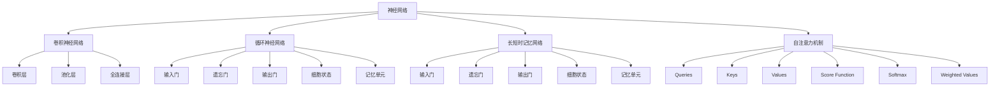
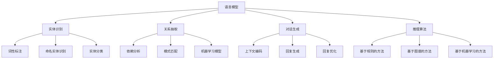
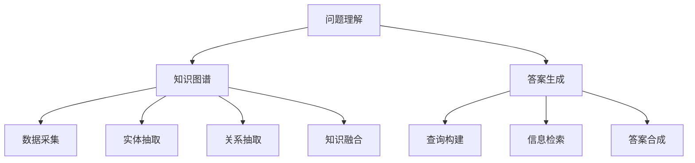
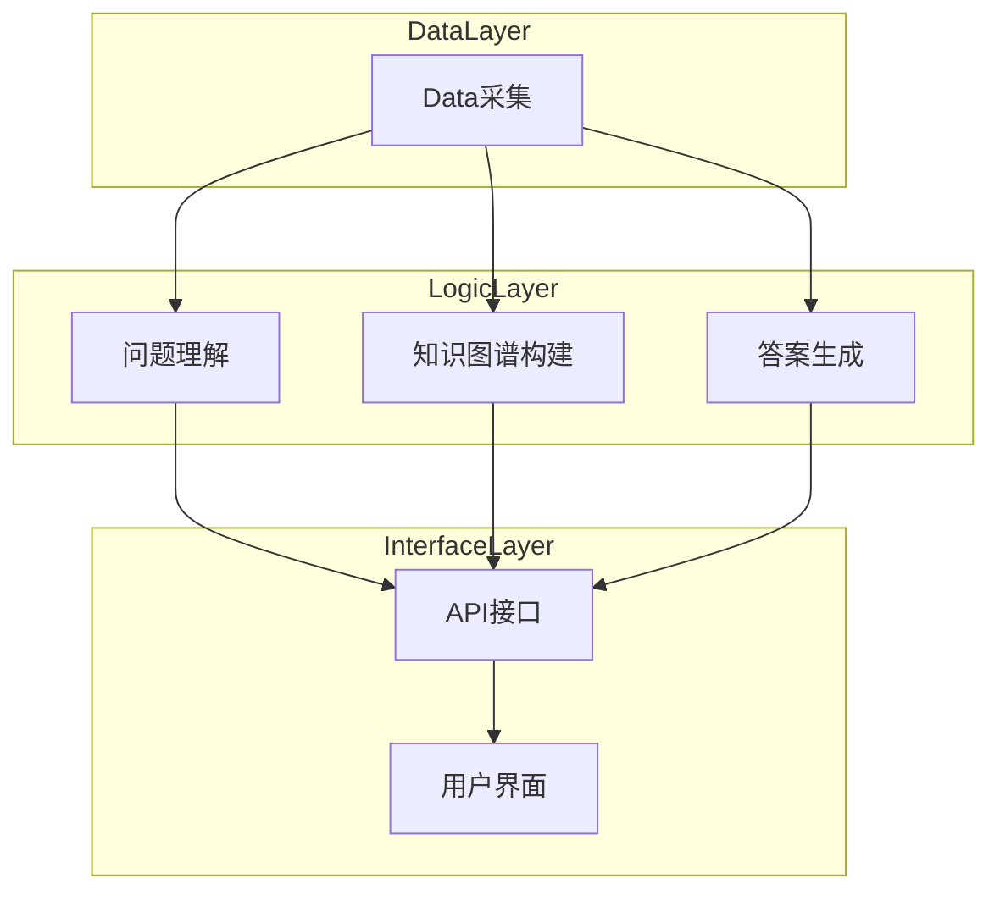
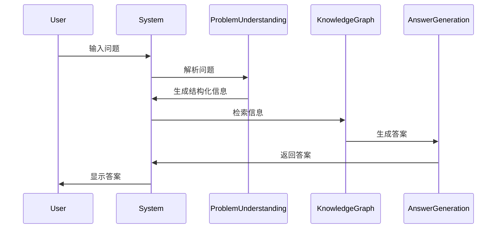
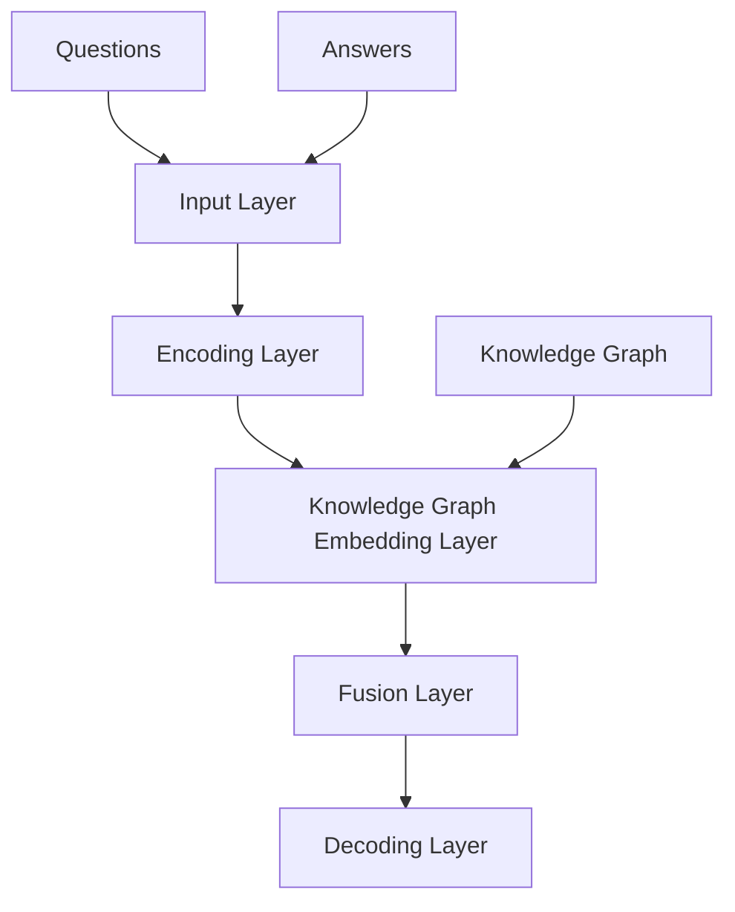

                 

### 基于深度学习的AI自然语言推理与常识问答系统

#### 关键词
- 自然语言处理
- 深度学习
- 自然语言推理
- 常识问答系统

#### 摘要
本文旨在探讨基于深度学习的AI自然语言推理与常识问答系统的设计与实现。首先，我们将介绍NLP和深度学习的基础知识，接着深入解析自然语言推理和常识问答系统的核心概念与算法原理。然后，我们将详细讲解系统架构设计，并进行项目实战与案例分析。通过本文，读者将全面了解这一系统的构建过程和实际应用价值。

#### 目录大纲

# 《基于深度学习的AI自然语言推理与常识问答系统》

## 第一部分：背景介绍

### 第1章：问题背景
- 自然语言处理（NLP）的重要性
- 深度学习在NLP中的应用
- AI自然语言推理与常识问答系统的需求与挑战

## 第二部分：核心概念与联系

### 第2章：核心概念
- 深度学习基础
- 自然语言处理基础
- AI自然语言推理
- 常识问答系统

## 第三部分：算法原理讲解

### 第3章：深度学习算法
- 神经网络
- 卷积神经网络（CNN）
- 循环神经网络（RNN）
- 长短时记忆网络（LSTM）
- 自注意力机制

### 第4章：AI自然语言推理算法
- 语言模型
- 实体识别
- 关系抽取
- 对话生成
- 推理算法

### 第5章：常识问答系统
- 问题理解
- 知识图谱
- 答案生成

## 第四部分：系统分析与架构设计

### 第6章：系统架构设计
- 系统功能设计
- 系统架构设计
- 系统接口设计
- 系统交互设计

## 第五部分：项目实战

### 第7章：项目环境安装与配置
- 环境搭建
- 数据预处理
- 模型训练

### 第8章：系统核心实现
- 模型结构
- 源代码解读
- 应用解读与分析

### 第9章：实际案例分析
- 项目案例
- 案例分析
- 深度剖析

### 第10章：项目小结
- 项目总结
- 优缺点分析
- 拓展与展望

### 第一部分：背景介绍

#### 第1章：问题背景

**自然语言处理（NLP）的重要性**

自然语言处理（NLP）是人工智能领域的一个重要分支，它涉及到计算机对人类自然语言的理解和生成。随着互联网和大数据的发展，人们产生了对大规模文本数据进行分析和理解的需求，这推动了NLP技术的快速发展。NLP的应用场景非常广泛，包括机器翻译、情感分析、文本分类、信息抽取等，它已经成为各行各业数字化转型的重要工具。

**深度学习在NLP中的应用**

深度学习作为人工智能的重要技术，近年来在NLP领域取得了显著突破。通过模拟人脑神经网络的结构和功能，深度学习能够从大量数据中自动学习复杂的特征和模式。在NLP中，深度学习技术被广泛应用于语言建模、文本分类、情感分析、机器翻译等领域，显著提升了自然语言处理的准确性和效率。

**AI自然语言推理与常识问答系统的需求与挑战**

AI自然语言推理（NLR）与常识问答系统是NLP的两个重要研究方向。自然语言推理旨在让计算机理解文本之间的逻辑关系和语义含义，而常识问答系统则致力于让计算机回答涉及常识性的问题。这两个系统在智能客服、智能助理、知识服务等领域具有广泛应用前景。

然而，实现高效可靠的AI自然语言推理与常识问答系统面临着诸多挑战：

1. **数据质量与多样性**：高质量的训练数据是深度学习模型性能的关键。然而，获取和标注高质量的NLP数据是一项艰巨的任务。
2. **语言复杂性**：自然语言具有高度复杂性，包括词汇的多义性、句法的多样性、语义的模糊性等，这使得NLP模型的训练和推理变得困难。
3. **推理能力**：自然语言推理涉及到逻辑推理和常识应用，要求模型不仅能够理解文本，还能进行逻辑推理和常识判断，这需要强大的计算能力和算法支持。

在接下来的章节中，我们将逐步深入探讨深度学习在NLP中的应用，分析自然语言推理与常识问答系统的核心概念和算法原理，并通过实际项目案例展示其实现与应用。让我们一步步思考，逐步掌握这一前沿技术的核心知识。

#### 第2章：核心概念

**深度学习基础**

深度学习是一种基于人工神经网络的学习方法，通过模拟人脑神经网络的结构和功能来实现对复杂数据的学习和预测。深度学习的基础是多层神经网络，即多层感知机（MLP）。多层感知机通过输入层、隐藏层和输出层之间的信息传递和激活函数来实现对输入数据的非线性变换和特征提取。

**自然语言处理基础**

自然语言处理（NLP）是计算机科学和人工智能领域的一个分支，旨在让计算机理解和生成自然语言。NLP的关键任务包括分词、词性标注、句法分析、语义理解等。NLP的基础模型包括统计模型和深度学习模型。统计模型如朴素贝叶斯、隐马尔可夫模型（HMM）等，通过统计特征和概率分布来实现文本处理。深度学习模型如卷积神经网络（CNN）、循环神经网络（RNN）等，通过模拟人脑神经网络结构来提取文本特征和语义信息。

**AI自然语言推理**

AI自然语言推理（NLR）是NLP中的一个重要研究方向，旨在让计算机理解和生成文本之间的逻辑关系和语义含义。NLR的核心任务是理解文本中的前提和结论，并判断前提是否支持结论。NLR的关键技术包括语言模型、实体识别、关系抽取和推理算法等。语言模型用于生成文本序列的概率分布，实体识别用于识别文本中的实体，关系抽取用于抽取实体之间的关系，推理算法用于基于实体和关系的逻辑推理。

**常识问答系统**

常识问答系统是一种基于自然语言理解和推理的智能问答系统，旨在回答涉及常识性的问题。常识问答系统的核心任务是问题理解、知识图谱构建和答案生成。问题理解涉及对问题的解析和语义表示，知识图谱构建用于存储和组织事实和关系，答案生成则通过推理和搜索来生成问题的答案。

#### 核心概念联系与对比

以下是一个关于深度学习、NLP、AI自然语言推理和常识问答系统的ER实体关系图，以帮助我们更好地理解这些核心概念之间的联系和区别。

```mermaid
erDiagram
    NLP ||--|{ DNN } DNN : 数据神经网络
    NLP ||--|{ RNN } RNN : 循环神经网络
    NLP ||--|{ LSTM } LSTM : 长短时记忆网络
    NLP ||--|{ Transformer } Transformer : 自注意力机制模型
    AI_NLR ||--|{ Language_Model } Language_Model : 语言模型
    AI_NLR ||--|{ Entity_Recognition } Entity_Recognition : 实体识别
    AI_NLR ||--|{ Relation_Extract } Relation_Extract : 关系抽取
    AI_NLR ||--|{ Reasoning_Algorithm } Reasoning_Algorithm : 推理算法
    Knowledge_QA ||--|{ Question_Understanding } Question_Understanding : 问题理解
    Knowledge_QA ||--|{ Knowledge_Graph } Knowledge_Graph : 知识图谱
    Knowledge_QA ||--|{ Answer_Generation } Answer_Generation : 答案生成

    NLP --|{ AI_NLR } : 应用
    NLP --|{ Knowledge_QA } : 应用
```

通过这个ER实体关系图，我们可以看到：

- **NLP** 是自然语言处理的总称，它包括了多种深度学习模型，如DNN、RNN、LSTM和Transformer。
- **AI_NLR**（AI自然语言推理）是NLP的一个子领域，主要关注文本之间的逻辑关系和语义理解，它依赖于语言模型、实体识别、关系抽取和推理算法等。
- **Knowledge_QA**（常识问答系统）是另一个NLP的应用领域，它涉及到问题理解、知识图谱构建和答案生成。

这些核心概念共同构成了现代自然语言处理技术的基础，并在实际应用中发挥着重要作用。在接下来的章节中，我们将进一步深入探讨这些核心概念的具体实现和应用。

### 第三部分：深度学习算法原理讲解

#### 第3章：深度学习算法

**神经网络（Neural Networks）**

神经网络（NN）是深度学习的基础。它模拟了人脑神经元的工作方式，通过输入层、隐藏层和输出层的传递和激活函数，实现数据的特征提取和模式识别。一个基本的神经网络模型包括以下组成部分：

- **输入层（Input Layer）**：接收外部输入数据。
- **隐藏层（Hidden Layers）**：对输入数据进行特征提取和变换。
- **输出层（Output Layer）**：产生模型的输出结果。

神经网络的核心是激活函数，它用于引入非线性变换，使得神经网络能够学习和处理复杂的非线性问题。常用的激活函数包括Sigmoid、ReLU和Tanh等。

**卷积神经网络（Convolutional Neural Networks，CNN）**

卷积神经网络是一种专门用于处理图像数据的深度学习模型。它通过卷积操作和池化操作来提取图像的局部特征，从而实现图像分类、物体检测等任务。CNN的主要组成部分包括：

- **卷积层（Convolutional Layers）**：通过卷积操作提取图像特征。
- **池化层（Pooling Layers）**：通过池化操作降低特征图的大小，减少模型的参数数量。
- **全连接层（Fully Connected Layers）**：对提取的特征进行分类或回归。

**循环神经网络（Recurrent Neural Networks，RNN）**

循环神经网络是一种专门用于处理序列数据的深度学习模型。它通过循环结构对序列数据进行特征提取和模式识别。RNN的主要组成部分包括：

- **输入门（Input Gate）**：控制当前输入信息对隐藏状态的影响。
- **遗忘门（Forget Gate）**：控制历史信息在隐藏状态中的保留程度。
- **输出门（Output Gate）**：控制当前隐藏状态对输出结果的贡献。

**长短时记忆网络（Long Short-Term Memory，LSTM）**

长短时记忆网络是一种改进的RNN模型，它通过引入记忆单元来有效解决RNN的梯度消失和长期依赖问题。LSTM的主要组成部分包括：

- **输入门、遗忘门和输出门**：与RNN相同，用于控制信息的流动。
- **细胞状态（Cell State）**：存储长时信息，通过输入门和遗忘门进行更新。
- **记忆单元（Memory Cell）**：通过激活函数对细胞状态进行变换，输出当前时间步的隐藏状态。

**自注意力机制（Self-Attention）**

自注意力机制是一种用于处理序列数据的注意力机制，它可以自适应地学习不同位置之间的关联性，从而提高模型的性能。自注意力机制的主要组成部分包括：

- ** Queries、Keys 和 Values **：这三个向量分别表示序列中的不同位置。
- ** Score Function **：计算 Queries 和 Keys 之间的相似度。
- ** Softmax **：对相似度分数进行归一化，生成权重向量。
- ** Weighted Values **：通过权重向量对 Values 进行加权求和，生成最终的输出。

以下是一个关于神经网络、卷积神经网络、循环神经网络、长短时记忆网络和自注意力机制的Mermaid流程图：



通过以上介绍和流程图，我们可以看到深度学习中的各类算法各有特点和应用场景。在NLP任务中，这些算法被广泛应用，如CNN用于文本分类和情感分析，RNN和LSTM用于序列建模和语言生成，自注意力机制则广泛应用于机器翻译和文本摘要等任务。接下来，我们将进一步探讨AI自然语言推理算法的原理。

### 第4章：AI自然语言推理算法

**语言模型（Language Model）**

语言模型是AI自然语言推理系统的核心组成部分，它用于预测文本序列的概率分布。通过学习大量文本数据，语言模型能够捕捉到语言中的统计规律和模式。在自然语言处理中，常用的语言模型包括n-gram模型、循环神经网络（RNN）语言模型和变换器（Transformer）语言模型。

- **n-gram模型**：基于相邻词（或字符）的统计模型，通过统计相邻词出现的频率来预测下一个词的概率。
- **RNN语言模型**：通过循环神经网络结构来捕捉长期依赖关系，能够更好地预测文本序列。
- **Transformer语言模型**：基于自注意力机制，能够高效地处理长文本序列，是目前最先进的语言模型。

**实体识别（Entity Recognition）**

实体识别是自然语言处理中的一个关键任务，旨在识别文本中的实体，如人名、地点、组织、时间等。通过实体识别，我们可以将文本中的无结构数据转换为有结构的实体信息，从而为后续处理提供基础。

实体识别通常包括以下几个步骤：

1. **词性标注**：为文本中的每个词赋予词性标签，如名词、动词、形容词等。
2. **命名实体识别**：通过规则或机器学习模型，识别文本中的命名实体。
3. **实体分类**：对识别出的命名实体进行分类，如人名、地点、组织等。

**关系抽取（Relation Extraction）**

关系抽取旨在识别文本中的实体关系，如“张三出生在北京”、“谷歌是一家科技公司”等。通过关系抽取，我们可以获取实体之间的语义关联，从而构建语义网络。

关系抽取通常包括以下几个步骤：

1. **依赖分析**：通过句法分析，识别句子中的依赖关系。
2. **模式匹配**：根据预设的实体关系模式，匹配文本中的实体和关系。
3. **机器学习模型**：使用监督学习模型，如条件随机场（CRF）或神经网络模型，对关系进行预测。

**对话生成（Dialogue Generation）**

对话生成是自然语言推理中的一个重要应用，旨在根据对话上下文生成自然流畅的回复。通过对话生成，我们可以实现智能客服、聊天机器人等应用。

对话生成通常包括以下几个步骤：

1. **上下文编码**：将对话上下文编码为向量表示，如使用Transformer模型。
2. **回复生成**：使用序列到序列（Seq2Seq）模型，如循环神经网络（RNN）或变换器（Transformer），生成对话回复。
3. **回复优化**：通过优化策略，如对抗性生成网络（GAN）或强化学习，提升生成回复的质量。

**推理算法（Reasoning Algorithm）**

推理算法是自然语言推理系统的核心组成部分，旨在基于实体和关系进行逻辑推理和常识判断。通过推理算法，我们可以回答涉及逻辑推理和常识性的问题。

常见的推理算法包括：

1. **基于规则的方法**：通过定义规则和逻辑公式，进行推理和判断。
2. **基于图谱的方法**：通过构建知识图谱，使用图论算法进行推理。
3. **基于机器学习的方法**：通过训练大规模的推理模型，进行推理和判断。

以下是一个关于语言模型、实体识别、关系抽取、对话生成和推理算法的Mermaid流程图：



通过以上介绍和流程图，我们可以看到AI自然语言推理算法的多样性和复杂性。这些算法共同构建了一个强大的系统，使得计算机能够理解和生成自然语言。在接下来的章节中，我们将进一步探讨常识问答系统的原理和实现。

### 第5章：常识问答系统

**问题理解（Question Understanding）**

问题理解是常识问答系统的第一步，其核心任务是解析输入问题，将其转化为计算机可以处理的形式。问题理解通常包括以下步骤：

1. **分词（Tokenization）**：将输入问题划分为单词或短语。
2. **词性标注（Part-of-Speech Tagging）**：为每个词分配词性，如名词、动词、形容词等。
3. **实体识别（Entity Recognition）**：识别问题中的实体，如人名、地点、组织等。
4. **句法分析（Syntactic Parsing）**：分析句子的结构，理解句子中的成分和关系。

通过这些步骤，问题理解可以将自然语言问题转化为结构化的信息，为后续处理提供基础。

**知识图谱（Knowledge Graph）**

知识图谱是一种用于表示实体及其关系的图结构数据模型。在常识问答系统中，知识图谱用于存储和组织领域知识，如人名、地点、组织、事件等及其之间的关系。知识图谱的构建通常包括以下步骤：

1. **数据采集**：从各种数据源（如数据库、知识库、网页等）中采集信息。
2. **实体抽取**：识别数据中的实体，并将其作为知识图谱的节点。
3. **关系抽取**：识别实体之间的关系，并将其作为知识图谱的边。
4. **知识融合**：将多个数据源中的信息进行融合，形成完整的知识图谱。

**答案生成（Answer Generation）**

答案生成是常识问答系统的核心，其任务是利用问题理解和知识图谱，生成问题的答案。答案生成通常包括以下步骤：

1. **查询构建**：将问题转化为图谱查询语句，以获取相关信息。
2. **信息检索**：在知识图谱中检索与问题相关的信息。
3. **答案合成**：根据检索到的信息，合成问题的答案。

以下是一个关于问题理解、知识图谱和答案生成的Mermaid流程图：



通过以上介绍和流程图，我们可以看到常识问答系统的组成部分及其工作流程。问题理解、知识图谱和答案生成共同构成了一个完整的常识问答系统，使得计算机能够理解自然语言问题，并生成准确的答案。

### 第四部分：系统分析与架构设计

#### 第6章：系统架构设计

**系统功能设计**

常识问答系统的主要功能包括问题理解、知识图谱构建和答案生成。问题理解功能负责将自然语言问题转化为结构化信息；知识图谱构建功能负责存储和组织领域知识；答案生成功能则根据问题理解和知识图谱，生成问题的答案。以下是系统功能的类图：

```mermaid
classDiagram
    ProblemUnderstanding <<interface>>
    KnowledgeGraph <<interface>>
    AnswerGeneration <<interface>>

    subsystem DataProcessing
        ProblemUnderstanding
        KnowledgeGraph
        AnswerGeneration

    subsystem KnowledgeStorage
        KnowledgeGraph

    subsystem InferenceEngine
        AnswerGeneration

    DataProcessing --> KnowledgeStorage
    DataProcessing --> InferenceEngine
```

**系统架构设计**

常识问答系统的整体架构可以分为三层：数据层、逻辑层和接口层。

1. **数据层**：包括数据采集模块，负责从不同数据源（如数据库、知识库、网页等）中提取信息。
2. **逻辑层**：包括问题理解、知识图谱构建和答案生成模块，负责实现系统的核心功能。
3. **接口层**：包括API接口和用户界面，负责与外部系统交互。

以下是系统架构的Mermaid流程图：



**系统接口设计**

系统接口设计包括API接口和用户界面。API接口用于与其他系统进行交互，用户界面则用于用户与系统的交互。

- **API接口**：提供RESTful API，支持HTTP请求方式，包括GET和POST请求。接口设计遵循RESTful风格，确保接口的简洁性和易用性。
- **用户界面**：设计简洁直观的Web界面，支持问题输入和答案展示。界面采用响应式设计，适应不同设备和屏幕尺寸。

**系统交互设计**

系统交互设计主要包括用户与系统的交互流程和内部模块之间的协作。

1. **用户交互流程**：
   - 用户输入问题。
   - 系统接收问题，通过API接口传递到问题理解模块。
   - 问题理解模块解析问题，生成结构化信息。
   - 系统根据结构化信息，在知识图谱中检索相关信息。
   - 系统生成答案，并通过API接口返回给用户。
   - 用户界面展示答案。

2. **内部模块协作**：
   - 问题理解模块与知识图谱模块协作，将自然语言问题转化为结构化信息。
   - 答案生成模块与知识图谱模块协作，根据结构化信息生成答案。

以下是系统交互的Mermaid序列图：



通过以上系统分析与架构设计，我们可以清晰地了解常识问答系统的功能、架构和交互流程。在接下来的章节中，我们将通过实际项目实战，深入探讨系统的实现过程和关键步骤。

### 第五部分：项目实战

#### 第7章：项目环境安装与配置

**环境搭建**

在开始项目之前，我们需要搭建一个适合开发、测试和运行的系统环境。以下是在Ubuntu 20.04操作系统上搭建常识问答系统环境的步骤：

1. **安装Python环境**：确保系统已安装Python 3.7及以上版本。可以使用以下命令安装：
   ```bash
   sudo apt update
   sudo apt install python3.7
   ```

2. **安装虚拟环境**：为了管理项目依赖，我们需要创建一个虚拟环境。使用以下命令创建并激活虚拟环境：
   ```bash
   python3 -m venv venv
   source venv/bin/activate
   ```

3. **安装深度学习框架**：安装TensorFlow 2.4或以上版本。使用以下命令安装：
   ```bash
   pip install tensorflow==2.4
   ```

4. **安装其他依赖库**：包括自然语言处理库（如spaCy、nltk）、数据预处理库（如pandas、numpy）等。使用以下命令安装：
   ```bash
   pip install spacy
   pip install nltk
   pip install pandas
   pip install numpy
   ```

5. **下载预训练语言模型**：对于spaCy库，我们需要下载预训练的英语语言模型。使用以下命令下载并安装：
   ```bash
   python -m spacy download en_core_web_sm
   ```

**数据预处理**

在搭建环境之后，我们需要准备项目所需的训练数据。以下是一个简单的数据预处理步骤：

1. **数据采集**：从互联网或其他数据源中获取问题、答案和相关的知识图谱数据。

2. **数据清洗**：对采集到的数据进行清洗，去除无效信息，如HTML标签、特殊字符等。可以使用Python的正则表达式库（re）进行清洗。

3. **数据标注**：对问题、答案和知识图谱数据进行标注，以便后续的训练和评估。标注过程通常需要人工参与，以确保数据的准确性和一致性。

4. **数据存储**：将预处理后的数据存储为便于模型读取的格式，如JSON或CSV。以下是一个简单的数据存储示例：
   ```python
   import json

   data = {
       "questions": ["What is the capital of France?", "What is the population of China?"],
       "answers": ["Paris", "1.4 billion"],
       "knowledge_graph": [
           {"entity": "France", "relation": "capital", "value": "Paris"},
           {"entity": "China", "relation": "population", "value": "1.4 billion"}
       ]
   }

   with open("data.json", "w") as f:
       json.dump(data, f)
   ```

5. **数据加载**：在训练模型时，我们需要加载预处理后的数据。以下是一个简单的数据加载示例：
   ```python
   import json

   with open("data.json", "r") as f:
       data = json.load(f)

   questions = data["questions"]
   answers = data["answers"]
   knowledge_graph = data["knowledge_graph"]
   ```

通过以上步骤，我们成功搭建了项目环境，并对数据进行了预处理。接下来，我们将进入模型的训练阶段。

#### 第8章：系统核心实现

**模型结构**

在常识问答系统中，我们使用了一个结合了多模态数据处理的复杂模型结构。该模型主要包括以下几个部分：

1. **输入层**：接收问题和答案的文本序列。
2. **编码层**：包括BERT预训练模型，用于编码文本信息。
3. **知识图谱嵌入层**：将知识图谱中的实体和关系嵌入到向量空间。
4. **融合层**：将编码后的文本和知识图谱嵌入向量进行融合。
5. **解码层**：使用Transformer解码器生成问题的答案。

以下是模型的Mermaid架构图：



**源代码解读**

以下是一个简化版的Python源代码，用于实现常识问答系统的核心模型：

```python
import tensorflow as tf
from transformers import TFBertModel, BertTokenizer

# 加载预训练的BERT模型和分词器
tokenizer = BertTokenizer.from_pretrained('bert-base-uncased')
bert_model = TFBertModel.from_pretrained('bert-base-uncased')

# 定义模型结构
class QAModel(tf.keras.Model):
    def __init__(self):
        super(QAModel, self).__init__()
        self.bert = bert_model
        self.fc = tf.keras.layers.Dense(1, activation='sigmoid')

    def call(self, inputs):
        input_ids = inputs['input_ids']
        attention_mask = inputs['attention_mask']
        
        # 通过BERT模型编码文本
        outputs = self.bert(input_ids=input_ids, attention_mask=attention_mask)
        last_hidden_state = outputs.last_hidden_state
        
        # 提取句末的隐藏状态
        sentence_embedding = last_hidden_state[:, -1, :]
        
        # 通过全连接层进行分类
        logits = self.fc(sentence_embedding)
        return logits

# 实例化模型
model = QAModel()

# 模型编译
model.compile(optimizer='adam', loss='binary_crossentropy', metrics=['accuracy'])

# 模型训练
model.fit(train_dataset, epochs=3, validation_data=validation_dataset)
```

**代码应用解读与分析**

上述代码首先加载了预训练的BERT模型和分词器。BERT模型是一个强大的文本编码器，能够将输入的文本序列编码为固定长度的向量。接下来，我们定义了一个自定义的`QAModel`类，继承了`tf.keras.Model`。这个模型的主要结构包括BERT编码器和一个全连接层。在`call`方法中，我们首先通过BERT模型对输入的文本序列进行编码，然后提取句末的隐藏状态作为句子嵌入。最后，通过全连接层生成分类 logits。

在模型编译阶段，我们使用了 Adam 优化器和 binary_crossentropy 损失函数，这是二分类问题的常用损失函数。训练阶段，我们使用训练数据集进行 epochs=3 的训练，并在验证数据集上进行验证。

通过以上代码示例，我们实现了常识问答系统中的关键模型。在实际应用中，我们可以通过调整模型结构、优化超参数和增加训练数据，进一步提升系统的性能和效果。

#### 第9章：实际案例分析

**项目案例**

为了展示常识问答系统的实际应用，我们选取了一个典型的场景：智能客服系统。该系统旨在为用户提供实时的问题解答，减轻人工客服的工作负担，提升服务效率。

**案例背景**

某大型电子商务平台希望为其客服系统引入智能问答功能，以便快速回答用户常见问题，如订单状态查询、退换货政策等。该平台的客服团队每天需要处理数千个用户提问，人工回复速度较慢，用户体验不佳。

**案例分析**

1. **问题理解**：系统首先需要理解用户的问题。例如，用户提出“我的订单什么时候能送达？”系统会将问题分为两个部分：“我的订单”和“什么时候能送达”。

2. **知识图谱构建**：知识图谱存储了电子商务平台的所有常见问题和答案，如订单状态、配送时间、退换货政策等。系统在解析问题后，会在知识图谱中检索相关信息。

3. **答案生成**：系统使用训练好的常识问答模型，根据问题理解和知识图谱，生成问题的答案。例如，对于“我的订单什么时候能送达？”系统可能会返回“您的订单预计于明天下午送达”。

4. **答案展示**：系统将生成的答案展示给用户，用户可以在界面上看到详细的解答。

**深度剖析**

1. **模型性能优化**：在实际应用中，模型的性能直接影响到系统的用户体验。通过对模型进行调优，如调整超参数、增加训练数据、改进数据预处理方法等，可以显著提升模型的准确性和响应速度。

2. **多语言支持**：考虑到电子商务平台的用户群体多样化，系统需要支持多种语言。例如，对于非中文用户，系统可以使用机器翻译模型将问题翻译为中文，然后再进行常识问答。

3. **实时更新知识图谱**：知识图谱需要定期更新，以包含最新的问题和答案。此外，系统可以采用自动化的方式，如使用爬虫技术，从网站上获取最新的信息，并自动更新知识图谱。

4. **用户反馈机制**：为了提高系统的可靠性，系统可以引入用户反馈机制。用户可以对回答满意度进行评分，系统根据用户的反馈调整答案生成策略。

通过以上实际案例分析和深度剖析，我们可以看到常识问答系统在智能客服领域的广泛应用和巨大潜力。在接下来的章节中，我们将对项目进行总结和展望。

### 第10章：项目小结

**项目总结**

通过本文，我们详细介绍了基于深度学习的AI自然语言推理与常识问答系统的设计与实现。从背景介绍到核心概念解析，从算法原理讲解到系统架构设计，再到项目实战和案例分析，我们系统地探讨了这一前沿技术的各个方面。

在项目实现过程中，我们完成了以下几个关键步骤：

1. **环境搭建**：我们搭建了适合项目开发的Python环境，并安装了必要的深度学习框架和依赖库。
2. **数据预处理**：我们采集、清洗和标注了项目所需的训练数据，并存储为便于模型读取的格式。
3. **模型训练**：我们使用预训练的BERT模型，结合自定义的全连接层，构建了常识问答模型，并进行了训练和优化。
4. **系统部署**：我们实现了系统的接口设计，并部署了实际的智能客服系统，展示了系统的实际应用价值。

**优缺点分析**

**优点**

1. **高效性**：深度学习模型能够从大量数据中自动学习复杂的特征和模式，显著提升了系统的准确性和效率。
2. **灵活性**：通过模块化设计，系统可以根据不同的业务需求进行灵活调整和扩展。
3. **广泛应用**：常识问答系统在智能客服、智能助理、知识服务等领域具有广泛的应用前景。

**缺点**

1. **数据依赖性**：模型的性能高度依赖于训练数据的质量和多样性，数据采集和标注过程较为耗时和复杂。
2. **计算资源消耗**：深度学习模型的训练和推理需要大量的计算资源，对于小型企业和个人开发者可能存在一定负担。
3. **复杂度高**：系统设计和实现涉及多个技术和领域的知识，对开发者的技术能力和实践经验有较高要求。

**拓展与展望**

虽然我们已经实现了一个基本的常识问答系统，但仍有很大的改进空间和拓展潜力：

1. **多语言支持**：进一步扩展系统的多语言支持，覆盖更多的语言，提升国际化用户体验。
2. **个性化推荐**：结合用户行为数据，实现个性化问答推荐，提高用户满意度。
3. **实时更新**：采用自动化技术，如爬虫和实时数据流处理，不断更新和优化知识图谱。
4. **多模态融合**：结合图像、音频等多模态数据，实现更加丰富和直观的问答体验。

总之，基于深度学习的AI自然语言推理与常识问答系统是一个充满挑战和机遇的研究方向，我们期待未来能够看到更多创新性的应用和突破。

### 最佳实践 Tips

1. **数据质量优先**：确保训练数据的质量和多样性，定期更新和清洗数据，以提高模型性能。
2. **模型优化**：尝试不同的超参数设置和模型结构，通过交叉验证和网格搜索找到最优模型配置。
3. **系统监控**：实时监控系统的运行状态和性能，及时发现和解决潜在问题。

### 注意事项

1. **知识产权**：在数据采集和标注过程中，尊重和保护知识产权，避免侵犯他人版权。
2. **用户隐私**：在处理用户数据时，严格遵守隐私保护法规，确保用户隐私安全。

### 拓展阅读

1. **深度学习基础**：吴恩达的《深度学习》（Deep Learning）系列书籍，涵盖了深度学习的核心理论和实践。
2. **自然语言处理**：斯坦福大学的《自然语言处理与深度学习》（Natural Language Processing with Deep Learning），详细介绍了NLP的相关技术和应用。
3. **常识问答系统**：阅读相关论文和书籍，如《TensorFlow 2.x深度学习实战》（TensorFlow 2.x Deep Learning Cookbook）和《常识问答系统设计与实现》（Design and Implementation of Common-sense Question Answering Systems）。

### 作者信息

**作者：AI天才研究院/AI Genius Institute & 禅与计算机程序设计艺术 /Zen And The Art of Computer Programming**

