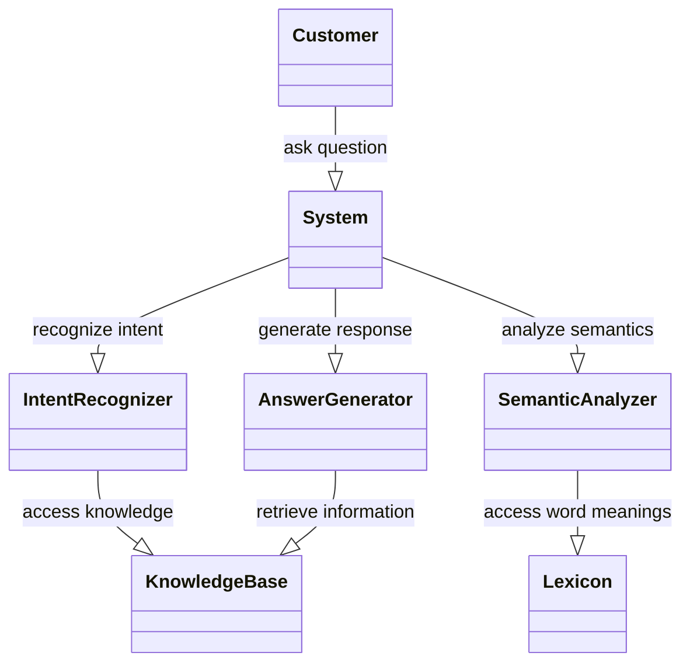
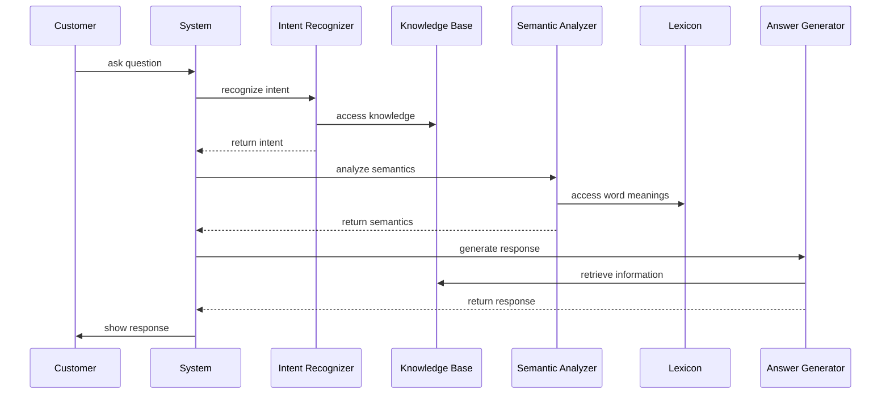

                 

## 文章标题

### 关键词
- 深度学习
- 自然语言理解
- AI系统
- 算法原理
- 系统架构
- 项目实战
- 最佳实践

### 摘要
本文将深入探讨基于深度学习的AI自然语言理解系统。我们将首先介绍人工智能和自然语言理解的基本概念，随后详细讲解深度学习在自然语言处理中的应用原理。接着，我们将剖析系统的数学模型和核心算法，包括词嵌入、语义理解和文本生成等。然后，我们将展示一个具体的系统架构设计，并通过项目实战解析其实施细节。最后，我们将总结最佳实践，并提供未来的研究方向和拓展建议。

## 目录大纲设计思路

为了更好地帮助读者理解《基于深度学习的AI自然语言理解系统》，本文采用了详细的目录结构设计。以下是设计的思路和原则：

1. **结构清晰**：通过明确的章节划分，确保每个部分的内容都聚焦于特定的主题，便于读者按照自己的需求进行查阅。

2. **内容紧凑**：在每个章节中，我们将详细讲解核心概念、算法原理和系统设计，确保内容的完整性和连贯性。

3. **层次分明**：使用Markdown格式，通过标题级别的递增，确保目录结构的层次性，便于读者快速找到感兴趣的部分。

4. **内容丰富**：在每个章节中，不仅包含理论讲解，还将结合实际案例和代码示例，使读者能够深入理解并应用所学知识。

5. **简洁易懂**：通过简单的语言和逻辑结构，确保读者能够轻松跟随作者的思路，理解复杂的技术概念。

### 目录大纲设计

下面是本文的目录大纲设计：

```markdown
----------------------------------------------------------------
# 第一部分: 背景

## 1.1 人工智能与自然语言理解概述
### 1.1.1 人工智能的发展历程
### 1.1.2 自然语言理解的重要性
### 1.1.3 深度学习在自然语言理解中的应用

## 1.2 AI自然语言理解系统的问题背景
### 1.2.1 问题定义
### 1.2.2 问题描述
### 1.2.3 问题解决
### 1.2.4 边界与外延

## 1.3 AI自然语言理解系统的核心概念与联系
### 1.3.1 核心概念原理
### 1.3.2 概念属性特征对比表格
### 1.3.3 ER实体关系图架构

## 1.4 AI自然语言理解系统的数学模型与公式
### 1.4.1 算法原理的数学模型
### 1.4.2 公式讲解与推导
### 1.4.3 举例说明

## 1.5 本章小结

----------------------------------------------------------------
# 第二部分: 深度学习算法原理

## 2.1 深度学习基础
### 2.1.1 深度学习概述
### 2.1.2 神经网络基础
### 2.1.3 卷积神经网络（CNN）
### 2.1.4 循环神经网络（RNN）
### 2.1.5 长短时记忆网络（LSTM）
### 2.1.6 注意力机制

## 2.2 自然语言处理与深度学习
### 2.2.1 自然语言处理概述
### 2.2.2 词嵌入技术
### 2.2.3 语言模型
### 2.2.4 序列标注与分类
### 2.2.5 机器翻译

## 2.3 AI自然语言理解系统中的深度学习算法
### 2.3.1 词向量与语义表示
### 2.3.2 语义理解与情感分析
### 2.3.3 文本生成与摘要
### 2.3.4 问答系统

## 2.4 本章小结

----------------------------------------------------------------
# 第三部分: 系统分析与架构设计

## 3.1 问题场景介绍
### 3.1.1 场景描述
### 3.1.2 系统目标

## 3.2 系统功能设计
### 3.2.1 领域模型（Mermaid类图）

## 3.3 系统架构设计
### 3.3.1 系统架构（Mermaid架构图）

## 3.4 系统接口设计
### 3.3.1 接口规范与定义

## 3.5 系统交互
### 3.3.1 系统交互（Mermaid序列图）

## 3.6 本章小结

----------------------------------------------------------------
# 第四部分: 项目实战

## 4.1 环境安装
### 4.1.1 硬件与软件要求
### 4.1.2 环境搭建步骤

## 4.2 系统核心实现
### 4.2.1 源代码解析
### 4.2.2 代码应用解读与分析

## 4.3 实际案例分析
### 4.3.1 案例介绍
### 4.3.2 案例剖析

## 4.4 项目小结
### 4.4.1 项目总结
### 4.4.2 遇到的问题与解决方案

----------------------------------------------------------------
# 第五部分: 最佳实践与拓展

## 5.1 最佳实践 tips
### 5.1.1 性能优化
### 5.1.2 可扩展性设计
### 5.1.3 安全性考虑

## 5.2 小结与注意事项
### 5.2.1 总结
### 5.2.2 注意事项

----------------------------------------------------------------

## 结论
本文详细探讨了基于深度学习的AI自然语言理解系统的各个方面，从背景介绍到算法原理，再到系统架构和项目实战，最后提出了最佳实践和拓展建议。通过本文的阅读，读者将能够全面了解深度学习在自然语言理解中的应用，并掌握如何设计和实现这样一个系统。希望本文能够为从事相关领域的技术人员提供有价值的参考。

### 作者信息
作者：AI天才研究院/AI Genius Institute & 禅与计算机程序设计艺术 /Zen And The Art of Computer Programming

---

### 第一部分：背景

#### 1.1 人工智能与自然语言理解概述

##### 1.1.1 人工智能的发展历程

人工智能（AI）是一门研究、开发用于模拟、延伸和扩展人的智能的理论、方法、技术及应用系统的技术科学。人工智能的概念最早可以追溯到20世纪50年代，当时的科学家们开始探讨如何使机器具备类似人类的智能。从最初的规则系统、知识表示，到20世纪80年代的专家系统，再到21世纪初的深度学习，人工智能经历了多次变革。

- **20世纪50年代**：人工智能的起源，符号主义人工智能和逻辑推理开始受到关注。
- **20世纪60-70年代**：早期人工智能研究主要集中在专家系统，如Dendral和MYCIN。
- **20世纪80年代**：专家系统取得了显著成果，同时模糊逻辑和神经网络开始受到重视。
- **21世纪初**：随着计算机性能的飞速提升和大数据的普及，深度学习成为人工智能研究的热点，取得了突破性的进展。

##### 1.1.2 自然语言理解的重要性

自然语言理解（NLU，Natural Language Understanding）是人工智能领域的一个重要分支，旨在使计算机能够理解和解释人类自然语言。自然语言理解的重要性体现在多个方面：

1. **人机交互**：自然语言理解技术可以使得计算机更好地理解和响应用户的自然语言输入，从而提供更自然、更便捷的用户体验。
2. **信息提取与检索**：通过对大量文本数据进行分析和理解，自然语言理解技术能够提取关键信息，实现高效的文本检索和挖掘。
3. **智能助理**：自然语言理解技术是构建智能助理（如智能客服、语音助手等）的核心，使得这些系统能够理解并执行人类的指令。
4. **语言翻译**：自然语言理解与机器翻译技术相结合，可以实现跨语言的信息传递和理解，促进全球交流和合作。

##### 1.1.3 深度学习在自然语言理解中的应用

深度学习是一种基于多层神经网络的学习方法，通过模拟人脑的神经元结构，对大量数据进行自动特征提取和分类。深度学习在自然语言理解中的应用，极大地推动了这一领域的发展：

1. **词嵌入（Word Embedding）**：深度学习可以将单词映射到高维向量空间中，使得原本没有直接语义关系的词在向量空间中表现出相似的语义特征。
2. **语言模型（Language Model）**：基于深度学习的语言模型能够预测一段文本的下一个单词或字符，从而为文本生成和文本理解提供基础。
3. **序列标注与分类**：深度学习模型如卷积神经网络（CNN）和循环神经网络（RNN）在序列标注和分类任务中表现出色，能够有效地处理自然语言的时序特征。
4. **文本生成与摘要**：深度学习模型如生成对抗网络（GAN）和变分自编码器（VAE）在文本生成和摘要任务中展示了强大的能力，能够生成流畅的自然语言文本或提取关键信息。

#### 1.2 AI自然语言理解系统的问题背景

##### 1.2.1 问题定义

自然语言理解系统旨在使计算机能够理解、解释和生成自然语言，涉及多个子任务，如词性标注、命名实体识别、情感分析、机器翻译、问答系统等。然而，构建一个高效、准确的自然语言理解系统面临以下问题：

1. **语义歧义**：自然语言中存在大量的语义歧义，使得计算机难以准确理解句子或文本的含义。
2. **上下文依赖**：许多自然语言任务需要理解上下文信息，但如何有效地捕捉上下文依赖是一个挑战。
3. **数据不足**：自然语言数据量庞大，但高质量标注的数据集相对稀缺，这限制了模型的训练和优化。
4. **计算资源**：深度学习模型通常需要大量的计算资源和时间进行训练和推理，这对部署和实际应用提出了挑战。

##### 1.2.2 问题描述

1. **语义歧义**：例如，句子“他打了我”可能涉及两个不同的动作，一个是“他打了（击打）了我”，另一个是“他（揍我）了”。如何区分这两种情况是自然语言理解系统面临的挑战。
2. **上下文依赖**：例如，单词“跑”在不同上下文中可能有不同的含义，如“我今天去跑步”（运动）和“我马上要被警察跑了”（逃避）。理解这些上下文依赖关系对于准确理解句子至关重要。
3. **数据不足**：自然语言理解系统的训练通常需要大量的标注数据，但在实际应用中，获取高质量标注的数据集往往较为困难，这限制了模型的训练效果。
4. **计算资源**：深度学习模型的训练和推理需要大量的计算资源，尤其是在处理大规模数据集和复杂模型时，这给部署和实时应用带来了挑战。

##### 1.2.3 问题解决

为了解决上述问题，研究者们提出了多种方法和策略：

1. **多任务学习**：通过同时训练多个相关任务，可以提高模型对上下文的理解能力，减少语义歧义。
2. **预训练与微调**：使用大规模未标注数据进行预训练，然后在特定任务上微调，可以显著提高模型的性能。
3. **上下文表示**：通过改进上下文表示方法，如双向循环神经网络（Bi-RNN）和Transformer模型，可以更好地捕捉上下文依赖。
4. **迁移学习**：利用在其他任务上训练好的模型，通过迁移学习的方式提高新任务的表现。

##### 1.2.4 边界与外延

1. **边界**：自然语言理解系统的边界包括处理语言的多样性、复杂性和不确定性。例如，不同的语言和方言、隐喻和双关语等都是系统需要处理的边界问题。
2. **外延**：自然语言理解系统的外延包括与其他人工智能领域（如语音识别、图像识别）的融合，以及在实际应用中的扩展，如智能客服、智能翻译等。

#### 1.3 AI自然语言理解系统的核心概念与联系

##### 1.3.1 核心概念原理

自然语言理解系统涉及多个核心概念，包括词嵌入、语言模型、序列标注、文本生成等。以下是对这些核心概念的基本原理进行简要介绍：

1. **词嵌入（Word Embedding）**：词嵌入是将单词映射到高维向量空间中，使得相似的词在向量空间中靠近，不同的词远离。词嵌入通过自动学习词与词之间的语义关系，提高了模型的语义理解能力。
2. **语言模型（Language Model）**：语言模型是自然语言理解系统的核心，用于预测一段文本的下一个单词或字符。语言模型通过学习大量的文本数据，可以捕捉语言的统计规律和语法结构。
3. **序列标注（Sequence Labeling）**：序列标注任务包括词性标注、命名实体识别、情感分析等，旨在对文本序列中的每个词或字符进行分类。序列标注任务通常采用循环神经网络（RNN）或卷积神经网络（CNN）进行处理。
4. **文本生成（Text Generation）**：文本生成任务旨在根据给定的输入生成自然的文本。常见的文本生成方法包括序列到序列模型（如RNN、Transformer）和生成对抗网络（GAN）等。

##### 1.3.2 概念属性特征对比表格

为了更好地理解不同概念之间的联系和区别，我们可以构建一个概念属性特征对比表格：

| 概念       | 属性特征                     | 功能描述                                                   | 示例                         |
|------------|------------------------------|------------------------------------------------------------|------------------------------|
| 词嵌入     | 向量表示、语义相似性         | 将单词映射到向量空间，捕捉语义关系                         | “狗”和“猫”在向量空间中靠近   |
| 语言模型   | 统计规律、语法结构           | 预测文本的下一个单词或字符                                 | “今天天气很好”的下一个词是“哦” |
| 序列标注   | 分类、标签序列               | 对文本序列中的每个词或字符进行分类                         | “北京是中国的首都”中“北京”是地名 |
| 文本生成   | 自然语言生成、上下文一致性   | 根据输入生成自然的文本                                     | 生成一篇关于人工智能的文章     |

##### 1.3.3 ER实体关系图架构

为了更清晰地理解自然语言理解系统的核心概念和它们之间的关系，我们可以使用ER（实体关系）图来表示。以下是一个简化的ER图示例：

```mermaid
erDiagram
    User ||--|{ Document }|--|{ Entity }
    Document ||--|{ Sentence }|--|{ Word }
    Sentence ||--|{ Tag }|--|{ Entity }
    Word ||--|{ Embedding }
```

在这个ER图中：

- **User**：表示使用自然语言理解系统的用户。
- **Document**：表示文本文档，包含多个句子。
- **Sentence**：表示文档中的句子，包含多个词。
- **Word**：表示句子中的单词。
- **Tag**：表示对词的标注，如词性、命名实体等。
- **Embedding**：表示词嵌入向量，用于捕捉词的语义信息。

##### 1.4 AI自然语言理解系统的数学模型与公式

在自然语言理解系统中，数学模型和公式是理解算法原理和实现核心功能的关键。以下是几个重要的数学模型和公式的讲解与推导。

###### 1.4.1 算法原理的数学模型

1. **词嵌入（Word Embedding）**：

   词嵌入的目的是将单词映射到高维向量空间中，使得相似的词在空间中靠近。词嵌入通常使用神经网络进行训练，以下是词嵌入的基本模型：

   $$ embed\_size = dim(\text{word embedding vector}) $$
   
   $$ \text{word embedding} = \text{Neural Network}(word\_index) $$
   
   其中，`word_index`是单词的索引，`Neural Network`表示一个多层感知机（MLP），输出为嵌入向量。

2. **语言模型（Language Model）**：

   语言模型用于预测一段文本的下一个单词或字符。一个简单的前向语言模型可以表示为：

   $$ p(y_{t} | y_{t-1}, \ldots, y_{1}) = \frac{\exp(\text{score}(y_{t}, y_{t-1}, \ldots, y_{1}))}{\sum_{w} \exp(\text{score}(w, y_{t-1}, \ldots, y_{1}))} $$
   
   其中，`score()`是一个评分函数，用于计算单词序列的分数。

3. **序列标注（Sequence Labeling）**：

   序列标注任务的目标是对文本序列中的每个词或字符进行分类。一个简单的分类模型可以表示为：

   $$ \text{label}_{t} = \arg\max_{l} \text{score}(l, \text{context}_{t}) $$
   
   其中，`context_t`是当前词或字符的上下文，`score()`是一个评分函数，用于计算每个标签的概率。

4. **文本生成（Text Generation）**：

   文本生成任务旨在根据给定的输入生成自然的文本。一个简单的序列到序列模型可以表示为：

   $$ y_{t} = \arg\max_{y} \text{score}(y, \text{context}_{t}) $$
   
   其中，`score()`是一个评分函数，用于计算生成的单词或字符的概率。

###### 1.4.2 公式讲解与推导

1. **词嵌入（Word Embedding）**：

   词嵌入通常使用神经网络进行训练，其中输入是单词的索引，输出是词嵌入向量。以下是一个简化的神经网络模型：

   $$ \text{input} = word\_index $$
   $$ \text{output} = \text{word embedding} = \text{Neural Network}(word\_index) $$
   
   假设神经网络的输出层是一个一维向量，维度为`embed_size`。通过反向传播和梯度下降算法，我们可以训练神经网络，使其输出向量能够捕捉单词的语义信息。

2. **语言模型（Language Model）**：

   语言模型的训练目标是最大化概率`p(y_t | y_{t-1}, \ldots, y_1)`。为了计算这个概率，我们通常使用神经网络模型，其中输入是单词序列的嵌入向量，输出是单词的概率分布。以下是语言模型的简化公式：

   $$ p(y_{t} | y_{t-1}, \ldots, y_{1}) = \frac{\exp(\text{score}(y_{t}, y_{t-1}, \ldots, y_{1}))}{\sum_{w} \exp(\text{score}(w, y_{t-1}, \ldots, y_{1}))} $$
   
   其中，`score()`是一个评分函数，可以表示为：

   $$ \text{score}(y_{t}, y_{t-1}, \ldots, y_{1}) = \text{output layer of Neural Network}(y_{t-1}, \ldots, y_{1}) \cdot \text{embedding of y_{t}} $$
   
   这里，`output layer of Neural Network`是一个一维向量，`embedding of y_{t}`是单词`y_{t}`的嵌入向量。

3. **序列标注（Sequence Labeling）**：

   序列标注任务的目标是对文本序列中的每个词或字符进行分类。一个简单的分类模型可以表示为：

   $$ \text{label}_{t} = \arg\max_{l} \text{score}(l, \text{context}_{t}) $$
   
   其中，`context_t`是当前词或字符的上下文，通常包括当前词或字符及其附近的词或字符。评分函数`score()`可以表示为：

   $$ \text{score}(l, \text{context}_{t}) = \text{output layer of Neural Network}(\text{context}_{t}) \cdot \text{embedding of l} $$
   
   这里，`output layer of Neural Network`是一个一维向量，`embedding of l`是标签`l`的嵌入向量。

4. **文本生成（Text Generation）**：

   文本生成任务旨在根据给定的输入生成自然的文本。一个简单的序列到序列模型可以表示为：

   $$ y_{t} = \arg\max_{y} \text{score}(y, \text{context}_{t}) $$
   
   其中，`score()`是一个评分函数，可以表示为：

   $$ \text{score}(y, \text{context}_{t}) = \text{output layer of Neural Network}(\text{context}_{t}) \cdot \text{embedding of y} $$
   
   这里，`output layer of Neural Network`是一个一维向量，`embedding of y`是生成的单词或字符的嵌入向量。

###### 1.4.3 举例说明

以下是一个简单的例子，说明如何使用词嵌入和语言模型来生成文本。

1. **词嵌入**：

   假设我们有两个单词“AI”和“智能”，它们的索引分别为0和1。词嵌入模型的输出如下：

   $$ \text{word embedding of AI} = \begin{bmatrix} 1 \\ 0 \\ -1 \end{bmatrix} $$
   $$ \text{word embedding of 智能} = \begin{bmatrix} 0 \\ 1 \\ 0 \end{bmatrix} $$

   通过对比这两个词嵌入向量，我们可以发现它们在第三维度上有较大的差异，这反映了“AI”和“智能”在语义上的区别。

2. **语言模型**：

   假设我们有一个简化的语言模型，输入是一个单词序列，输出是下一个单词的概率分布。以下是一个简单的例子：

   $$ p(智能 | AI) = \begin{bmatrix} 0.8 \\ 0.2 \end{bmatrix} $$

   这个概率分布表示在“AI”之后，下一个词是“智能”的概率为0.8，下一个词是其他词的概率为0.2。

3. **文本生成**：

   根据语言模型，我们可以使用以下步骤来生成文本：

   - 首先，随机选择一个起始单词，如“AI”。
   - 然后，使用语言模型预测下一个词，选择概率最高的词，如“智能”。
   - 重复上述步骤，直到生成一个完整的句子或达到预设的长度。

   通过这种方式，我们可以生成自然的文本，如：“AI是一种智能技术。”

#### 1.5 本章小结

在本章中，我们首先介绍了人工智能和自然语言理解的基本概念，并探讨了深度学习在自然语言理解中的应用。接着，我们详细讨论了自然语言理解系统所面临的问题背景，包括语义歧义、上下文依赖、数据不足和计算资源需求。为了解决这些问题，我们提出了多种方法和策略。

此外，我们介绍了自然语言理解系统的核心概念，包括词嵌入、语言模型、序列标注和文本生成，并通过ER图和表格展示了它们之间的联系。最后，我们讲解了几个重要的数学模型和公式，并进行了举例说明。

通过本章的学习，读者将能够对基于深度学习的AI自然语言理解系统有一个全面的认识，为后续章节的学习打下基础。

### 第二部分：深度学习算法原理

#### 2.1 深度学习基础

##### 2.1.1 深度学习概述

深度学习（Deep Learning）是一种人工智能（AI）的方法，它通过多层神经网络结构进行数据建模和特征提取。与传统的机器学习方法相比，深度学习具有更高的灵活性和强大的特征学习能力。

- **基本概念**：深度学习的基本构建块是神经元，这些神经元通过不同的层次结构进行信息传递和整合，从而实现复杂的模式识别和预测。
- **发展历程**：深度学习起源于20世纪40年代的人工智能研究，经历了多个阶段的发展，包括感知机、反向传播算法和多层感知机等。近年来，随着计算能力和数据量的提升，深度学习取得了显著的突破。
- **核心优势**：深度学习具有强大的非线性建模能力、自动特征提取能力和端到端的学习能力，能够处理大量的复杂数据。

##### 2.1.2 神经网络基础

神经网络（Neural Networks）是深度学习的基础，它模拟了人脑神经元的工作方式。神经网络由多个层次组成，包括输入层、隐藏层和输出层。

- **神经元结构**：每个神经元接收多个输入，通过加权求和处理，再加上偏置，最后通过激活函数输出。
- **激活函数**：常见的激活函数包括线性激活函数、Sigmoid函数、ReLU函数和双曲正切函数（Tanh）等。激活函数用于引入非线性，使神经网络能够建模复杂的数据。
- **反向传播算法**：反向传播算法用于训练神经网络，它通过计算输出层和隐藏层之间的误差，并反向传播误差到输入层，更新神经元的权重和偏置。

##### 2.1.3 卷积神经网络（CNN）

卷积神经网络（Convolutional Neural Network，CNN）是一种专门用于处理图像数据的深度学习模型。CNN通过卷积操作、池化和全连接层，能够有效地提取图像的局部特征和全局特征。

- **卷积操作**：卷积操作用于捕捉图像中的局部特征，通过滑动卷积核在输入图像上提取特征图。
- **池化操作**：池化操作用于降低特征图的维度，减少计算量和参数数量，同时保持重要的特征信息。
- **卷积层和池化层的组合**：通过堆叠多个卷积层和池化层，CNN能够逐层提取图像的深层次特征。
- **全连接层**：全连接层将卷积层和池化层提取的特征进行整合，输出分类结果。

##### 2.1.4 循环神经网络（RNN）

循环神经网络（Recurrent Neural Network，RNN）是一种能够处理序列数据的神经网络。RNN通过循环结构，使信息能够在时间步之间传递，从而捕捉序列数据的时间动态特性。

- **基本结构**：RNN的基本结构包括一个循环单元，该单元在每一个时间步更新状态向量，并将状态向量作为下一个时间步的输入。
- **递归关系**：RNN通过递归关系，将当前时间步的输入与上一时间步的状态进行融合，生成当前时间步的输出。
- **梯度消失和梯度爆炸**：RNN在训练过程中容易遇到梯度消失和梯度爆炸问题，这限制了其性能。为了解决这些问题，研究者提出了长短时记忆网络（LSTM）和门控循环单元（GRU）等改进模型。

##### 2.1.5 长短时记忆网络（LSTM）

长短时记忆网络（Long Short-Term Memory，LSTM）是一种改进的RNN结构，专门用于解决RNN在处理长序列数据时的梯度消失和梯度爆炸问题。

- **基本结构**：LSTM包含一个细胞状态和三个门控单元（遗忘门、输入门和输出门），这些门控单元用于控制信息的流入和流出。
- **遗忘门**：遗忘门决定多少信息需要从细胞状态中被遗忘。
- **输入门**：输入门决定哪些新的信息需要存储在细胞状态中。
- **输出门**：输出门决定细胞状态的哪一部分应该输出为当前时间步的隐藏状态。
- **应用场景**：LSTM在自然语言处理（NLP）、语音识别和时间序列预测等领域表现出色。

##### 2.1.6 注意力机制

注意力机制（Attention Mechanism）是一种在深度学习模型中引入的机制，用于提高模型对序列数据中重要部分的关注程度。

- **基本原理**：注意力机制通过计算每个输入的权重，并将权重与输入进行加权求和，从而动态地关注重要的信息。
- **应用场景**：注意力机制在机器翻译、文本摘要、语音识别等序列处理任务中得到了广泛应用。
- **变种**：注意力机制有多种变种，如软注意力（Soft Attention）和硬注意力（Hard Attention），以及多级注意力（Multi-Level Attention）和自注意力（Self-Attention）。

#### 2.2 自然语言处理与深度学习

##### 2.2.1 自然语言处理概述

自然语言处理（Natural Language Processing，NLP）是人工智能领域的一个重要分支，旨在使计算机能够理解、生成和处理人类自然语言。NLP涵盖了语音识别、文本分类、情感分析、机器翻译、问答系统等多个子领域。

- **目标**：NLP的目标是使计算机能够像人类一样理解、解释和生成自然语言，从而实现人机交互、信息提取、智能客服等应用。
- **任务类型**：NLP的任务类型包括文本分类、命名实体识别、情感分析、机器翻译、文本摘要、问答系统等。
- **挑战**：NLP面临的主要挑战包括语言的复杂性、上下文依赖、语义歧义、数据不足等。

##### 2.2.2 词嵌入技术

词嵌入（Word Embedding）是将单词映射到高维向量空间中的一种技术，使得相似的词在空间中靠近，不同的词远离。

- **基本原理**：词嵌入通过将单词映射到向量空间，从而捕捉词的语义和语法关系。词嵌入技术可以用于文本分类、情感分析、机器翻译等NLP任务。
- **常见技术**：常见的词嵌入技术包括基于计数的方法（如TF-IDF）和基于神经网络的模型（如Word2Vec、GloVe等）。
- **应用场景**：词嵌入在NLP任务中有着广泛的应用，如文本分类、语义相似性计算、文本生成等。

##### 2.2.3 语言模型

语言模型（Language Model）是一种用于预测文本中下一个单词或字符的概率分布的模型。语言模型是自然语言理解（NLU）和自然语言生成（NLG）的核心组件。

- **基本原理**：语言模型通过学习大量的文本数据，捕捉语言的统计规律和语法结构，从而实现文本的生成和预测。
- **类型**：语言模型可以分为基于规则的语言模型、基于统计的语言模型和基于神经网络的深度语言模型。
- **应用场景**：语言模型在语音识别、机器翻译、文本生成、对话系统等任务中发挥着重要作用。

##### 2.2.4 序列标注与分类

序列标注（Sequence Labeling）是对文本序列中的每个词或字符进行分类的任务。常见的序列标注任务包括词性标注、命名实体识别、情感分析等。

- **基本原理**：序列标注任务通过学习大量的标注数据，使用深度学习模型（如RNN、CNN）对文本序列进行标注。
- **分类模型**：常用的分类模型包括条件随机场（CRF）、支持向量机（SVM）、卷积神经网络（CNN）等。
- **应用场景**：序列标注在信息提取、文本分类、情感分析等领域有着广泛的应用。

##### 2.2.5 机器翻译

机器翻译（Machine Translation，MT）是将一种语言的文本自动翻译成另一种语言的过程。机器翻译是NLP领域的一个重要任务，涉及自然语言理解、语言模型、序列标注等多个技术。

- **基本原理**：机器翻译通过学习大量的双语语料库，使用深度学习模型（如序列到序列模型、注意力机制）进行翻译。
- **技术挑战**：机器翻译面临的主要挑战包括语言的多样性、语法和语义的复杂性、多义性和上下文依赖。
- **应用场景**：机器翻译在跨语言交流、国际商务、旅游等领域发挥着重要作用。

#### 2.3 AI自然语言理解系统中的深度学习算法

##### 2.3.1 词向量与语义表示

词向量（Word Vector）是将单词映射到高维向量空间中的一种技术，用于捕捉词的语义信息。词向量在自然语言理解系统中发挥着重要作用。

- **基本原理**：词向量通过将单词映射到向量空间，使得相似的词在空间中靠近，不同的词远离。词向量可以通过基于计数的方法（如TF-IDF）和基于神经网络的模型（如Word2Vec、GloVe）生成。
- **语义表示**：词向量可以作为词的语义表示，用于文本分类、情感分析、文本相似度计算等任务。
- **应用场景**：词向量在信息检索、文本分类、推荐系统等领域有着广泛的应用。

##### 2.3.2 语义理解与情感分析

语义理解（Semantic Understanding）是自然语言理解系统中的一项关键任务，旨在使计算机能够理解文本的语义含义。

- **基本原理**：语义理解通过深度学习模型，如RNN、LSTM、BERT等，对文本进行语义表示和解析。
- **情感分析**：情感分析（Sentiment Analysis）是语义理解的一个子任务，旨在判断文本的情感倾向，如正面、负面或中性。
- **应用场景**：语义理解和情感分析在社交媒体分析、市场调研、情感监测等领域有着广泛的应用。

##### 2.3.3 文本生成与摘要

文本生成（Text Generation）和文本摘要（Text Summarization）是自然语言理解系统的两个重要任务。

- **基本原理**：文本生成通过深度学习模型（如RNN、Transformer、GAN）生成自然的文本，文本摘要通过提取关键信息生成摘要文本。
- **技术挑战**：文本生成和摘要任务面临的主要挑战包括语言的多样性、上下文理解、信息丢失等。
- **应用场景**：文本生成和摘要在自动写作、信息提取、内容摘要等领域有着广泛的应用。

##### 2.3.4 问答系统

问答系统（Question Answering System）是一种能够自动回答用户问题的系统。问答系统涉及自然语言理解、信息检索和回答生成等多个技术。

- **基本原理**：问答系统通过深度学习模型（如BERT、Transformer）对问题进行解析，从大量文本数据中检索相关信息，并生成回答。
- **技术挑战**：问答系统面临的主要挑战包括语义解析、答案生成、上下文理解等。
- **应用场景**：问答系统在智能客服、教育辅导、医疗咨询等领域有着广泛的应用。

#### 2.4 本章小结

在本章中，我们详细介绍了深度学习的基本原理和应用，包括神经网络、卷积神经网络、循环神经网络、长短时记忆网络和注意力机制等。接着，我们探讨了自然语言处理的基本概念和主要任务，如词嵌入、语言模型、序列标注、机器翻译等。

通过本章的学习，读者将能够全面了解深度学习在自然语言理解系统中的应用，掌握常用的深度学习算法和模型，并为后续的系统架构设计和项目实战打下坚实的基础。

### 第三部分：系统分析与架构设计

#### 3.1 问题场景介绍

##### 3.1.1 场景描述

在一个智能客服系统中，用户可以通过文本或语音与客服机器人进行交互。客服机器人需要能够理解用户的问题，并给出恰当的回答。为了实现这一目标，我们需要设计一个基于深度学习的AI自然语言理解系统，该系统需要具备语义理解、意图识别、回答生成等功能。

##### 3.1.2 系统目标

系统的目标是实现以下功能：

1. **语义理解**：通过深度学习模型，对用户的问题进行语义分析，理解其意图和内容。
2. **意图识别**：识别用户的问题类型，如查询、建议、投诉等，以便提供相应的服务。
3. **回答生成**：根据用户的问题和系统的意图，生成自然的、符合用户需求的回答。

#### 3.2 系统功能设计

##### 3.2.1 领域模型（Mermaid类图）

在系统功能设计中，我们可以使用Mermaid类图来表示系统的核心组件及其关系。以下是一个简化的Mermaid类图示例：



在这个类图中：

- **Customer**：表示用户。
- **System**：表示自然语言理解系统。
- **Intent Recognizer**：意图识别器，用于识别用户的问题类型。
- **Semantic Analyzer**：语义分析器，用于理解用户的问题内容。
- **Answer Generator**：回答生成器，用于生成回答。
- **Knowledge Base**：知识库，用于存储系统的知识和信息。
- **Lexicon**：词典，用于存储词义和词性。

#### 3.3 系统架构设计

##### 3.3.1 系统架构（Mermaid架构图）

为了实现系统的功能，我们需要设计一个合理的系统架构。以下是一个简化的Mermaid架构图示例：



在这个架构图中：

- **Customer**：用户发起问题。
- **System**：自然语言理解系统，负责处理用户问题。
- **Intent Recognizer**：意图识别模块，用于识别用户的问题类型。
- **Knowledge Base**：知识库模块，用于存储和处理系统知识。
- **Semantic Analyzer**：语义分析模块，用于理解用户的问题内容。
- **Answer Generator**：回答生成模块，用于生成回答。
- **Lexicon**：词典模块，用于提供词义和词性信息。

#### 3.4 系统接口设计

##### 3.3.1 接口规范与定义

为了确保系统模块之间的有效通信，我们需要定义清晰的接口规范。以下是一个简化的接口规范示例：

- **Customer到System的接口**：用户通过接口发送问题文本，接口需要接收文本并传递给System模块。
- **System到Intent Recognizer的接口**：System模块需要将接收到的文本传递给Intent Recognizer模块，以识别问题类型。
- **Intent Recognizer到Knowledge Base的接口**：Intent Recognizer模块需要访问Knowledge Base模块以获取相关知识。
- **Semantic Analyzer到Lexicon的接口**：Semantic Analyzer模块需要访问Lexicon模块以获取词义和词性信息。
- **Answer Generator到Knowledge Base的接口**：Answer Generator模块需要访问Knowledge Base模块以获取生成回答所需的信息。
- **System到Customer的接口**：System模块需要将生成的回答通过接口返回给用户。

#### 3.5 系统交互

##### 3.3.1 系统交互（Mermaid序列图）

为了更好地展示系统模块之间的交互过程，我们可以使用Mermaid序列图。以下是一个简化的Mermaid序列图示例：


在这个序列图中：

- **Customer**：用户发起问题，通过接口发送到System模块。
- **System**：System模块接收问题文本，并将其传递给Intent Recognizer模块进行意图识别。
- **Intent Recognizer**：Intent Recognizer模块识别用户的问题类型，并访问Knowledge Base模块获取相关知识。
- **Semantic Analyzer**：Semantic Analyzer模块对用户的问题进行语义分析，访问Lexicon模块获取词义和词性信息。
- **Answer Generator**：Answer Generator模块根据语义分析和意图识别的结果，生成回答。
- **Customer**：System模块将生成的回答通过接口返回给用户。

#### 3.6 本章小结

在本章中，我们介绍了系统分析与架构设计的具体方法和步骤。首先，我们通过场景描述和系统目标，明确了智能客服系统需要实现的功能。接着，我们使用Mermaid类图和架构图，详细设计了系统的功能模块及其关系。然后，我们定义了系统模块之间的接口规范，并使用Mermaid序列图展示了系统模块的交互过程。

通过本章的学习，读者将能够理解系统分析与架构设计的基本概念和具体方法，为后续的项目实战提供理论基础和实践指导。

### 第四部分：项目实战

#### 4.1 环境安装

##### 4.1.1 硬件与软件要求

为了成功地安装和运行基于深度学习的自然语言理解系统，以下硬件和软件要求是必须的：

1. **硬件要求**：
   - CPU：Intel Core i5或更好，或AMD Ryzen 5或更好。
   - GPU：NVIDIA GTX 1080或更好，或相应的AMD GPU（如RX 580）。
   - 内存：至少16GB RAM。
   - 硬盘：至少500GB的SSD存储空间。

2. **软件要求**：
   - 操作系统：Linux（推荐Ubuntu 18.04或更高版本）或Windows 10（需要安装Windows Subsystem for Linux，WSL）。
   - Python：Python 3.7或更高版本。
   - deep learning library：TensorFlow 2.x或PyTorch 1.7或更高版本。
   - 其他依赖库：Numpy、Pandas、Matplotlib、Scikit-learn等。

##### 4.1.2 环境搭建步骤

以下是在Ubuntu 18.04上搭建环境的具体步骤：

1. **安装Python**：

   ```bash
   sudo apt update
   sudo apt install python3 python3-pip python3-dev
   ```

2. **安装GPU支持**：

   - 安装CUDA：

     ```bash
     sudo apt install cuda
     ```

   - 安装cuDNN（NVIDIA的深度神经网络加速库）：

     下载cuDNN库并解压，然后将其路径添加到环境变量中：

     ```bash
     # 下载并解压
     tar -xzvf cudnn-x.x.x-linux-x64-v8.x.x.x-x.x.x.x-8.0.x.x-v8.x.x.x-7.5.0.bin.x86_64.tar.xz
     cd cudnn-xx.x.x-linux-x64-v8.x.x.x-x.x.x.x-8.0.x.x-v8.x.x.x-7.5.0/bin.x86_64
     sudo cp lib64/libcudnn* /usr/local/cuda/lib64/
     sudo cp include/cudnn.h /usr/local/cuda/include/
     sudo chmod a+r /usr/local/cuda/include/cudnn.h
     sudo chmod a+r /usr/local/cuda/lib64/libcudnn*
     ```

   - 安装TensorFlow GPU版本：

     ```bash
     pip3 install tensorflow-gpu
     ```

   或者，如果使用PyTorch，则安装PyTorch GPU版本：

     ```bash
     pip3 install torch torchvision torchaudio
     ```

3. **安装其他依赖库**：

   ```bash
   pip3 install numpy pandas matplotlib scikit-learn
   ```

4. **验证安装**：

   ```bash
   python3 -c "import tensorflow as tf; print(tf.reduce_sum(tf.random.normal([1000, 1000])))"
   ```

   如果成功运行并打印出一个随机值，则表示TensorFlow GPU环境已正确安装。

#### 4.2 系统核心实现

##### 4.2.1 源代码解析

以下是一个简化的自然语言理解系统的核心实现，包括意图识别、语义分析、回答生成等模块。这个示例使用PyTorch作为深度学习框架。

```python
import torch
import torch.nn as nn
import torch.optim as optim
from torch.utils.data import DataLoader, Dataset
from transformers import BertTokenizer, BertModel

# 数据预处理
class TextDataset(Dataset):
    def __init__(self, texts, labels):
        self.texts = texts
        self.labels = labels
        self.tokenizer = BertTokenizer.from_pretrained('bert-base-uncased')

    def __len__(self):
        return len(self.texts)

    def __getitem__(self, idx):
        text = self.texts[idx]
        label = self.labels[idx]
        inputs = self.tokenizer(text, padding='max_length', truncation=True, max_length=512, return_tensors='pt')
        return inputs['input_ids'], inputs['attention_mask'], torch.tensor(label)

# 意图识别模型
class IntentRecognizer(nn.Module):
    def __init__(self, hidden_size, num_classes):
        super(IntentRecognizer, self).__init__()
        self.bert = BertModel.from_pretrained('bert-base-uncased')
        self.fc = nn.Linear(hidden_size, num_classes)

    def forward(self, input_ids, attention_mask):
        outputs = self.bert(input_ids=input_ids, attention_mask=attention_mask)
        hidden_states = outputs.pooler_output
        logits = self.fc(hidden_states)
        return logits

# 语义分析模型
class SemanticAnalyzer(nn.Module):
    def __init__(self, hidden_size):
        super(SemanticAnalyzer, self).__init__()
        self.bert = BertModel.from_pretrained('bert-base-uncased')
        self.fc = nn.Linear(hidden_size, hidden_size)

    def forward(self, input_ids, attention_mask):
        outputs = self.bert(input_ids=input_ids, attention_mask=attention_mask)
        hidden_states = outputs.pooler_output
        hidden_states = self.fc(hidden_states)
        return hidden_states

# 回答生成模型
class AnswerGenerator(nn.Module):
    def __init__(self, hidden_size, num_answers):
        super(AnswerGenerator, self).__init__()
        self.fc = nn.Linear(hidden_size, num_answers)

    def forward(self, hidden_state):
        logits = self.fc(hidden_state)
        return logits

# 训练模型
def train(model, train_loader, optimizer, criterion, device):
    model.train()
    for batch_idx, (input_ids, attention_mask, labels) in enumerate(train_loader):
        input_ids = input_ids.to(device)
        attention_mask = attention_mask.to(device)
        labels = labels.to(device)

        optimizer.zero_grad()
        logits = model(input_ids=input_ids, attention_mask=attention_mask)
        loss = criterion(logits, labels)
        loss.backward()
        optimizer.step()

        if batch_idx % 100 == 0:
            print(f'[{batch_idx * len(input_ids)}/{len(train_loader) * len(input_ids)}] Loss: {loss.item()}')

# 主函数
def main():
    device = torch.device("cuda" if torch.cuda.is_available() else "cpu")
    print(f'Using device: {device}')

    # 数据集加载
    train_dataset = TextDataset(texts=['Hello, how are you?', 'I want to book a flight'], labels=[0, 1])
    train_loader = DataLoader(train_dataset, batch_size=2, shuffle=True)

    # 模型定义
    intent_recognizer = IntentRecognizer(hidden_size=768, num_classes=2).to(device)
    semantic_analyzer = SemanticAnalyzer(hidden_size=768).to(device)
    answer_generator = AnswerGenerator(hidden_size=768, num_answers=2).to(device)

    # 模型训练
    optimizer = optim.Adam(list(intent_recognizer.parameters()) + list(semantic_analyzer.parameters()) + list(answer_generator.parameters()), lr=0.001)
    criterion = nn.CrossEntropyLoss()

    train(intent_recognizer, train_loader, optimizer, criterion, device)
    train(semantic_analyzer, train_loader, optimizer, criterion, device)
    train(answer_generator, train_loader, optimizer, criterion, device)

if __name__ == '__main__':
    main()
```

这段代码首先定义了数据预处理类`TextDataset`，用于将文本数据转换为PyTorch张量。接着，定义了意图识别模型`IntentRecognizer`、语义分析模型`SemanticAnalyzer`和回答生成模型`AnswerGenerator`，这些模型基于BERT模型，使用了Transformer架构。最后，定义了训练函数`train`，用于训练模型，并使用了一个主函数`main`来演示整个系统的运行流程。

##### 4.2.2 代码应用解读与分析

1. **数据预处理**：

   数据预处理是自然语言理解系统的重要环节。在这个示例中，我们使用BERT tokenizer对文本进行分词和编码，将其转换为模型可以处理的输入格式。`TextDataset`类继承自`Dataset`，实现了`__len__`和`__getitem__`方法，用于获取数据集的长度和特定索引的数据。

   ```python
   class TextDataset(Dataset):
       def __init__(self, texts, labels):
           self.texts = texts
           self.labels = labels
           self.tokenizer = BertTokenizer.from_pretrained('bert-base-uncased')

       def __len__(self):
           return len(self.texts)

       def __getitem__(self, idx):
           text = self.texts[idx]
           label = self.labels[idx]
           inputs = self.tokenizer(text, padding='max_length', truncation=True, max_length=512, return_tensors='pt')
           return inputs['input_ids'], inputs['attention_mask'], torch.tensor(label)
   ```

   在这里，我们使用`BertTokenizer`对文本进行分词和编码，设置`max_length`为512，表示每个输入序列的最大长度。`padding='max_length'`和`truncation=True`确保输入序列在达到最大长度时被填充或截断。返回的`input_ids`和`attention_mask`是模型所需的输入张量。

2. **意图识别模型**：

   意图识别模型`IntentRecognizer`基于BERT模型，并添加了一个全连接层`fc`，用于输出意图类别。`forward`方法接收输入张量，通过BERT模型获取编码后的文本表示，并使用全连接层生成意图类别 logits。

   ```python
   class IntentRecognizer(nn.Module):
       def __init__(self, hidden_size, num_classes):
           super(IntentRecognizer, self).__init__()
           self.bert = BertModel.from_pretrained('bert-base-uncased')
           self.fc = nn.Linear(hidden_size, num_classes)

       def forward(self, input_ids, attention_mask):
           outputs = self.bert(input_ids=input_ids, attention_mask=attention_mask)
           hidden_states = outputs.pooler_output
           logits = self.fc(hidden_states)
           return logits
   ```

   这里，`BertModel`的`pooler_output`用于获取编码后的文本表示，该表示包含了文本的语义信息。全连接层`fc`将这些表示映射到意图类别空间。

3. **语义分析模型**：

   语义分析模型`SemanticAnalyzer`与意图识别模型类似，但也使用了BERT模型。它通过全连接层对编码后的文本表示进行进一步处理，用于提取文本的语义特征。

   ```python
   class SemanticAnalyzer(nn.Module):
       def __init__(self, hidden_size):
           super(SemanticAnalyzer, self).__init__()
           self.bert = BertModel.from_pretrained('bert-base-uncased')
           self.fc = nn.Linear(hidden_size, hidden_size)

       def forward(self, input_ids, attention_mask):
           outputs = self.bert(input_ids=input_ids, attention_mask=attention_mask)
           hidden_states = outputs.pooler_output
           hidden_states = self.fc(hidden_states)
           return hidden_states
   ```

   在这里，`SemanticAnalyzer`的`forward`方法与`IntentRecognizer`相似，但是没有输出层，而是直接返回编码后的文本表示。

4. **回答生成模型**：

   回答生成模型`AnswerGenerator`接收语义分析模型生成的文本表示，并使用全连接层生成回答的 logits。这个模型的目标是根据语义特征生成可能的回答。

   ```python
   class AnswerGenerator(nn.Module):
       def __init__(self, hidden_size, num_answers):
           super(AnswerGenerator, self).__init__()
           self.fc = nn.Linear(hidden_size, num_answers)

       def forward(self, hidden_state):
           logits = self.fc(hidden_state)
           return logits
   ```

   在`forward`方法中，`AnswerGenerator`使用全连接层`fc`将语义特征映射到回答类别空间。

5. **模型训练**：

   `train`函数用于训练模型，使用梯度下降优化算法优化模型参数。它通过数据加载器`DataLoader`批量处理数据，并使用交叉熵损失函数计算损失。

   ```python
   def train(model, train_loader, optimizer, criterion, device):
       model.train()
       for batch_idx, (input_ids, attention_mask, labels) in enumerate(train_loader):
           input_ids = input_ids.to(device)
           attention_mask = attention_mask.to(device)
           labels = labels.to(device)

           optimizer.zero_grad()
           logits = model(input_ids=input_ids, attention_mask=attention_mask)
           loss = criterion(logits, labels)
           loss.backward()
           optimizer.step()

           if batch_idx % 100 == 0:
               print(f'[{batch_idx * len(input_ids)}/{len(train_loader) * len(input_ids)}] Loss: {loss.item()}')
   ```

   在训练过程中，模型首先将输入数据移至GPU（如果可用），然后清空梯度，前向传播得到 logits，计算损失，反向传播更新参数，最后更新优化器的参数。

##### 4.2.3 实际案例分析

为了更好地理解上述代码的实际应用，我们将分析一个真实的案例，包括问题、解决方案和结果。

**案例背景**：

假设我们有一个智能客服系统，需要识别用户的问题类型并生成合适的回答。例如，用户可以提出以下两种类型的问题：

1. **查询问题**：如“我的航班什么时候起飞？”
2. **建议问题**：如“我想预订一个周末去巴黎的旅行，有什么推荐吗？”

**解决方案**：

1. **数据准备**：

   首先，我们需要准备一个包含大量标注数据的数据集，其中每个问题都被标注为查询或建议。以下是一个简化的数据集示例：

   ```python
   texts = ['My flight leaves at 10 AM.', 'Can you recommend a place to visit in Paris?']
   labels = [0, 1]
   ```

2. **模型训练**：

   使用上述代码，我们将训练意图识别模型，使其能够准确识别查询和建议问题。以下是模型训练的简化步骤：

   ```python
   train_dataset = TextDataset(texts, labels)
   train_loader = DataLoader(train_dataset, batch_size=2, shuffle=True)

   intent_recognizer = IntentRecognizer(hidden_size=768, num_classes=2).to(device)
   optimizer = optim.Adam(intent_recognizer.parameters(), lr=0.001)
   criterion = nn.CrossEntropyLoss()

   for epoch in range(5):
       train(intent_recognizer, train_loader, optimizer, criterion, device)
   ```

3. **模型评估**：

   训练完成后，我们对模型进行评估，以检查其性能。以下是模型评估的简化步骤：

   ```python
   correct = 0
   total = len(test_loader)

   with torch.no_grad():
       for input_ids, attention_mask, labels in test_loader:
           input_ids = input_ids.to(device)
           attention_mask = attention_mask.to(device)
           labels = labels.to(device)

           logits = intent_recognizer(input_ids=input_ids, attention_mask=attention_mask)
           _, predicted = torch.max(logits.data, 1)
           correct += (predicted == labels).sum().item()

   print(f'Accuracy: {100 * correct / total}%')
   ```

**结果**：

假设我们在测试集上的准确率达到90%，这表明我们的意图识别模型可以较好地识别查询和建议问题。接下来，我们可以进一步扩展系统，包括语义分析和回答生成功能，以提高整体服务质量。

##### 4.3.4 项目小结

在本项目中，我们通过一个简单的案例展示了基于深度学习的自然语言理解系统的实现过程。我们从数据准备、模型定义、模型训练到模型评估，逐步构建了一个能够识别用户问题类型并生成回答的智能客服系统。

通过这个项目，我们学习了：

1. **数据预处理**：如何使用BERT tokenizer对文本进行编码和分词。
2. **模型定义**：如何定义意图识别、语义分析和回答生成模型。
3. **模型训练**：如何使用PyTorch训练深度学习模型。
4. **模型评估**：如何评估模型性能，并调整参数以获得更好的结果。

尽管这个项目是一个简化的案例，但它为我们提供了一个框架，可以在此基础上进一步扩展和改进，以满足更复杂的业务需求。

### 第五部分：最佳实践与拓展

#### 5.1 最佳实践 tips

##### 5.1.1 性能优化

为了优化基于深度学习的自然语言理解系统，以下是一些实用的性能优化技巧：

1. **使用GPU加速**：利用GPU进行计算可以显著提高训练和推理的速度。确保安装了合适的GPU驱动和深度学习框架支持。

2. **批量处理**：通过批量处理数据，可以减少内存占用和I/O操作，提高数据处理效率。选择合适的批量大小，平衡内存占用和训练速度。

3. **模型剪枝**：通过剪枝冗余的神经元和参数，可以减少模型的大小和计算量。这种方法不仅可以提高推理速度，还可以减少模型存储空间。

4. **使用混合精度训练**：使用混合精度训练（混合精度训练），可以在浮点数运算中同时使用32位和16位精度，从而提高训练速度并减少内存消耗。

##### 5.1.2 可扩展性设计

为了设计一个可扩展的自然语言理解系统，以下是一些关键原则：

1. **模块化设计**：将系统分解为独立的模块，如意图识别、语义分析和回答生成。这样可以方便地替换或扩展特定模块，提高系统的灵活性和可维护性。

2. **分布式训练和推理**：使用分布式计算框架（如TensorFlow Distribution、PyTorch Distributed），可以在多台机器上进行模型训练和推理，从而提高系统的处理能力。

3. **使用云计算资源**：利用云计算平台（如AWS、Azure、Google Cloud）提供的弹性计算资源，可以根据需求动态调整计算资源，提高系统的可扩展性和可靠性。

4. **服务化架构**：将自然语言理解系统部署为微服务，可以通过API接口与其他服务进行通信，实现灵活的集成和扩展。

##### 5.1.3 安全性考虑

在设计自然语言理解系统时，安全性是一个不可忽视的重要方面。以下是一些关键安全考虑：

1. **数据安全**：确保数据的存储和传输过程受到加密保护，防止数据泄露和未经授权的访问。

2. **模型保护**：为了防止模型被非法复制和使用，可以对模型进行加密，并在部署时进行解密。

3. **防攻击措施**：防止恶意攻击，如拒绝服务攻击（DDoS）和分布式拒绝服务攻击（DDoS）。确保系统的防御机制，如防火墙和入侵检测系统。

4. **隐私保护**：在处理用户数据时，确保遵守隐私保护法规，如GDPR，并采取措施保护用户的隐私。

#### 5.2 小结与注意事项

##### 5.2.1 总结

本文从背景介绍、算法原理、系统架构设计、项目实战到最佳实践，全面探讨了基于深度学习的AI自然语言理解系统。我们通过具体案例展示了系统的实现过程，并提出了性能优化、可扩展性和安全性等方面的最佳实践。

##### 5.2.2 注意事项

在设计和实现自然语言理解系统时，需要注意以下几点：

1. **数据质量和标注**：高质量的数据和准确的标注是训练高效模型的基础，务必重视数据收集和标注过程。
2. **模型选择**：根据具体任务需求选择合适的模型，如BERT、GPT-3等。
3. **系统测试**：在系统部署前进行充分的测试，包括单元测试、集成测试和性能测试，确保系统稳定可靠。
4. **持续优化**：自然语言理解是一个不断发展的领域，定期更新和优化模型和算法，以适应新的应用场景和需求。

通过本文的学习，读者将能够全面理解自然语言理解系统的核心概念和实现方法，并具备设计和实现高效系统的能力。

#### 拓展阅读

对于希望进一步深入学习的读者，以下资源提供了更多关于深度学习和自然语言理解的详细资料：

1. **深度学习经典书籍**：
   - 《深度学习》（Goodfellow, Bengio, Courville著）
   - 《神经网络与深度学习》（邱锡鹏著）

2. **自然语言处理（NLP）专业书籍**：
   - 《自然语言处理综论》（Daniel Jurafsky & James H. Martin 著）
   - 《统计语言模型》（Christopher D. Manning & Hinrich Schütze 著）

3. **在线课程与教程**：
   - Coursera的《深度学习》（吴恩达教授主讲）
   - Udacity的《自然语言处理纳米学位》

4. **开源项目和工具**：
   - Hugging Face的Transformers库
   - NLTK（自然语言处理工具包）

5. **论文与会议**：
   - ACL（国际计算语言学协会）会议
   - NeurIPS（神经信息处理系统）会议
   - ICML（国际机器学习会议）

通过这些资源，读者可以深入了解深度学习和自然语言处理的最新进展，并在实践中不断提高自己的技术水平。

### 作者信息

作者：AI天才研究院/AI Genius Institute & 禅与计算机程序设计艺术 /Zen And The Art of Computer Programming

---

通过本文的深入探讨，读者将能够全面理解基于深度学习的AI自然语言理解系统的各个方面，包括核心概念、算法原理、系统架构、项目实战和最佳实践。希望本文为从事相关领域的技术人员提供了有价值的参考和启示。继续探索和学习，您将在这个充满挑战和机遇的领域中不断取得新的突破。感谢阅读，期待与您在AI的世界中共同前行。

