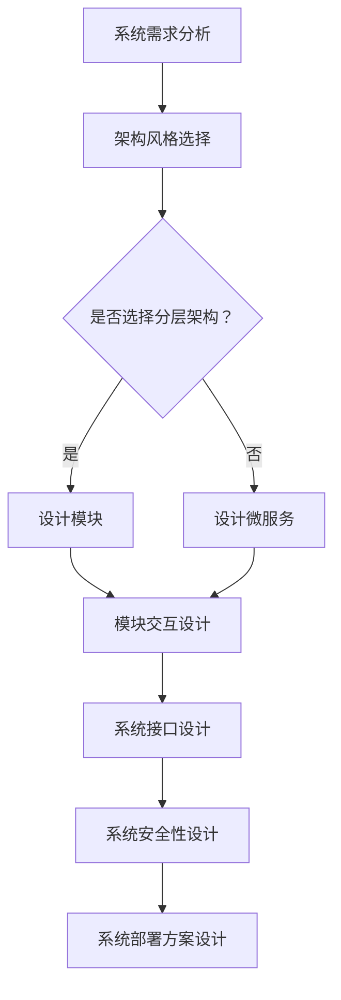

                 

## 第1章 引言

### 1.1 问题背景

#### 1.1.1 医疗领域的挑战

医疗行业正面临着一系列严峻的挑战，这些挑战源于患者数据的复杂性、医疗资源的分配不均以及疾病预测与治疗决策的准确性等问题。

- **患者数据复杂性**：医疗数据通常包含大量的非结构化和半结构化数据，如病历记录、医学影像和医生笔记等，这些数据形式多样，缺乏统一的标准和格式，使得数据管理和分析变得异常复杂。

- **医疗资源分配不均**：全球范围内，医疗资源分布存在显著的不均衡现象。在一些发达国家，医疗资源相对充足，而发展中国家和偏远地区的医疗资源却严重匮乏，这导致了医疗服务的可及性差异。

- **疾病预测与治疗决策的准确性**：准确预测疾病的发展和制定有效的治疗策略是医疗决策的关键。然而，当前的医疗系统往往依赖于经验和传统的诊断方法，缺乏科学的数据支持和分析工具，导致诊断和治疗的准确性受到影响。

#### 1.1.2 知识图谱在医疗领域的应用潜力

知识图谱作为一种结构化的知识表示方法，具有强大的数据整合和知识推理能力，在医疗领域具有广泛的应用潜力。

- **数据整合**：知识图谱能够将来自不同来源的医疗数据（如电子病历、医学文献、临床指南等）进行整合，构建一个统一的知识库，从而提供全面、准确的医疗信息。

- **知识推理**：知识图谱中的实体和关系可以通过逻辑推理来发现新的知识关联和预测疾病的趋势。例如，基于知识图谱的推理可以辅助医生进行疾病的早期诊断、治疗方案的选择以及患者的个性化治疗。

- **决策支持**：知识图谱可以辅助医疗决策者进行数据驱动的决策，提高疾病预测和治疗的准确性。例如，在癌症治疗中，知识图谱可以帮助医生分析患者的基因信息、家族病史和临床指标，提供个性化的治疗建议。

### 1.2 本书目标

本书的目标是系统地介绍基于知识图谱的AI医疗决策支持与风险评估系统的设计方法，具体包括以下三个方面：

- **理解知识图谱的基本原理**：通过介绍知识图谱的定义、核心组成部分和应用场景，帮助读者建立对知识图谱的全面理解。

- **掌握基于知识图谱的AI医疗决策支持系统设计方法**：通过详细的案例分析，展示如何利用知识图谱构建医疗决策支持系统，包括数据整合、算法设计和系统实现等步骤。

- **探索基于知识图谱的风险评估系统应用**：探讨知识图谱在医疗风险评估中的应用，包括风险评估模型的构建、实现和应用。

### 1.3 内容结构

本书分为八个章节，内容结构如下：

- **第1章 引言**：介绍医疗领域的挑战和知识图谱在医疗领域的应用潜力，阐述本书的目标和内容结构。

- **第2章 基于知识图谱的AI技术概述**：回顾AI技术的发展历程，深入探讨知识图谱的概念与重要性，以及知识图谱在AI中的应用。

- **第3章 知识图谱的构建方法**：详细讲解知识图谱的构建流程，包括数据来源、数据预处理、实体识别与关系抽取以及知识图谱构建工具。

- **第4章 知识图谱的存储与管理**：介绍知识图谱的存储方案、索引技术和查询优化技术。

- **第5章 基于知识图谱的AI医疗决策支持**：分析医疗决策支持系统的需求，探讨知识图谱在医疗决策支持中的应用、算法原理以及案例分析。

- **第6章 基于知识图谱的风险评估系统设计**：介绍风险评估系统概述、风险评估模型构建、系统实现和应用。

- **第7章 系统设计与实现**：详细阐述系统的架构设计、数据流设计、系统接口设计以及系统部署与优化。

- **第8章 项目实战与案例分析**：通过实际项目背景、核心实现、应用解读和案例分析，展示基于知识图谱的医疗决策支持和风险评估系统的应用。

- **第9章 总结与展望**：总结全书内容，展望知识图谱在医疗领域的发展趋势和潜在应用。

### 1.3.1 各章节内容概述

- **第1章 引言**：简要介绍医疗领域的挑战、知识图谱的应用潜力和本书的目标。

- **第2章 基于知识图谱的AI技术概述**：回顾AI技术的发展历程，深入探讨知识图谱的概念与重要性，以及知识图谱在AI中的应用。

- **第3章 知识图谱的构建方法**：详细讲解知识图谱的构建流程，包括数据来源、数据预处理、实体识别与关系抽取以及知识图谱构建工具。

- **第4章 知识图谱的存储与管理**：介绍知识图谱的存储方案、索引技术和查询优化技术。

- **第5章 基于知识图谱的AI医疗决策支持**：分析医疗决策支持系统的需求，探讨知识图谱在医疗决策支持中的应用、算法原理以及案例分析。

- **第6章 基于知识图谱的风险评估系统设计**：介绍风险评估系统概述、风险评估模型构建、系统实现和应用。

- **第7章 系统设计与实现**：详细阐述系统的架构设计、数据流设计、系统接口设计以及系统部署与优化。

- **第8章 项目实战与案例分析**：通过实际项目背景、核心实现、应用解读和案例分析，展示基于知识图谱的医疗决策支持和风险评估系统的应用。

- **第9章 总结与展望**：总结全书内容，展望知识图谱在医疗领域的发展趋势和潜在应用。

### 1.3.2 阅读建议

为了更好地理解和掌握基于知识图谱的AI医疗决策支持与风险评估系统设计，读者可以按照以下建议进行阅读：

- **系统阅读**：建议读者按照章节顺序系统阅读，逐步建立对知识图谱和医疗决策支持系统的全面理解。

- **结合实际案例**：在阅读过程中，结合书中提供的实际案例和项目实战，深入理解知识图谱在医疗领域的应用。

- **思考与讨论**：在阅读过程中，积极思考问题，与同行进行讨论，加深对知识点的理解和应用。

- **动手实践**：尝试使用知识图谱工具和框架构建简单的医疗决策支持系统，亲身体验知识图谱在医疗领域的应用。

通过以上阅读建议，读者可以更好地掌握基于知识图谱的AI医疗决策支持与风险评估系统设计，为未来的医疗信息化工作奠定坚实的基础。

### 第2章 基于知识图谱的AI技术概述

#### 2.1 AI技术的发展历程

人工智能（AI）技术的发展历程可以分为多个阶段，每个阶段都有其独特的特点和里程碑。以下是AI技术的发展历程概述：

- **早期探索（1956年-1969年）**：1956年，达特茅斯会议的召开标志着AI领域的正式诞生。此阶段主要集中在理论研究和算法开发，如逻辑推理、符号计算和初期的机器学习算法。

- **应用探索（1970年-1980年）**：此阶段AI技术开始应用于实际场景，如自动化编程、游戏和语音识别。然而，由于计算能力的限制和算法的局限性，AI研究进入了一个相对的“冬天”。

- **复苏与兴起（1980年-1990年）**：随着计算机硬件的发展，AI研究重新获得关注。专家系统和知识表示成为研究热点，AI技术开始应用于工业自动化、医疗诊断等领域。

- **互联网时代（1990年-2000年）**：互联网的兴起带来了大量数据，数据挖掘和机器学习技术得到了快速发展。此阶段，AI技术在推荐系统、搜索引擎和金融领域取得了显著的应用成果。

- **深度学习时代（2000年至今）**：深度学习算法的出现和计算能力的提升，使得AI技术在图像识别、自然语言处理和自动驾驶等领域取得了重大突破。神经网络和深度学习框架如TensorFlow、PyTorch成为AI研究的主流工具。

#### 2.2 知识图谱的概念与重要性

知识图谱（Knowledge Graph）是一种结构化的知识表示方法，它通过实体、属性和关系的组合，将现实世界中的知识进行抽象和建模。知识图谱具有以下几个核心组成部分：

- **实体（Entity）**：实体是知识图谱中的核心元素，代表现实世界中的对象，如人、地点、事物等。实体可以是具体的，如“张三”，也可以是抽象的，如“疾病”。

- **属性（Attribute）**：属性描述实体的特征，如“张三的年龄是30岁”。属性通常与实体之间存在一种映射关系。

- **关系（Relationship）**：关系表示实体之间的关联，如“张三患有糖尿病”。关系通常可以表示为一种方向性的链接。

知识图谱的重要性体现在以下几个方面：

- **知识整合**：知识图谱能够整合来自不同来源的数据，形成一个统一的知识库，提高数据利用效率。

- **知识推理**：知识图谱中的实体和关系可以通过逻辑推理来发现新的知识关联，辅助决策和发现潜在的问题。

- **智能搜索**：知识图谱能够提供更加智能的搜索体验，用户可以通过自然语言查询，获取相关的知识信息。

#### 2.3 知识图谱在AI中的应用

知识图谱在AI领域中有着广泛的应用，以下是一些主要的应用场景：

- **自然语言处理（NLP）**：知识图谱可以用于实体识别、关系抽取和语义理解等任务。例如，在问答系统中，知识图谱可以帮助系统理解用户的问题，并提供准确的答案。

- **推荐系统**：知识图谱可以用于推荐系统的构建，通过分析用户的行为数据，发现用户之间的兴趣关联，提供个性化的推荐。

- **智能医疗**：知识图谱在智能医疗中的应用包括疾病预测、治疗方案推荐和医疗资源分配等。通过整合医疗数据，知识图谱可以帮助医生做出更准确的诊断和制定更有效的治疗方案。

- **图像识别与计算机视觉**：知识图谱可以用于图像标注和目标识别，通过结合图像内容和知识图谱中的知识，提高图像识别的准确性。

- **自动驾驶**：知识图谱在自动驾驶领域中的应用包括环境感知、路径规划和决策支持等。通过知识图谱，自动驾驶系统可以更好地理解和处理复杂的交通环境。

### 第3章 知识图谱的构建方法

知识图谱的构建是人工智能应用中至关重要的一步，它需要处理大量的数据，并将这些数据转化为结构化的知识表示。本章将详细介绍知识图谱的构建方法，包括数据来源、数据预处理、实体识别与关系抽取以及知识图谱的构建流程。

#### 3.1 数据来源

知识图谱的数据来源可以分为三类：结构化数据、半结构化数据和非结构化数据。

- **结构化数据**：结构化数据是指那些已经按照特定的格式和标准进行组织和存储的数据，如关系型数据库中的数据。结构化数据通常包含明确的字段和属性，容易进行提取和处理。

- **半结构化数据**：半结构化数据是指那些没有明确格式，但包含一定结构的数据，如XML、JSON和Excel文件。半结构化数据通常可以通过解析和转换来提取有用信息。

- **非结构化数据**：非结构化数据是指那些没有固定结构和格式，难以直接使用的数据，如文本、图像和音频。非结构化数据通常需要进行预处理和特征提取，才能转化为结构化的数据。

在实际应用中，知识图谱的构建通常需要整合多种数据来源，以获得全面和丰富的知识表示。

#### 3.2 数据预处理

数据预处理是知识图谱构建的重要步骤，它包括数据清洗、数据转换和数据整合。

- **数据清洗**：数据清洗是去除数据中的噪声和错误，提高数据质量的过程。这包括去除重复数据、填补缺失值、处理异常值等。

- **数据转换**：数据转换是将数据从一种格式转换为另一种格式的过程，以适应知识图谱的构建需求。例如，将XML数据转换为RDF（Resource Description Framework）格式。

- **数据整合**：数据整合是将来自不同来源和格式的数据进行合并和统一的过程。通过数据整合，可以形成一个统一的知识库，提高数据的利用效率。

#### 3.3 实体识别与关系抽取

实体识别与关系抽取是知识图谱构建的核心步骤，它们分别识别文本中的实体和实体之间的关系。

- **实体识别**：实体识别是从文本中识别出具体的实体，如人名、地名、组织名等。实体识别可以通过基于规则的方法、机器学习方法或者深度学习方法来实现。

- **关系抽取**：关系抽取是从文本中识别出实体之间的关联，如“张三住在北京”。关系抽取通常需要结合实体识别的结果，通过模式匹配、语义分析等方法来实现。

#### 3.4 知识图谱的构建流程

知识图谱的构建流程可以分为以下五个步骤：

- **数据收集**：收集来自不同来源的数据，包括结构化数据、半结构化数据和非结构化数据。

- **数据预处理**：对收集到的数据进行清洗、转换和整合，形成一个统一的数据集。

- **实体识别**：使用实体识别算法对预处理后的数据进行分析，识别出文本中的实体。

- **关系抽取**：结合实体识别的结果，使用关系抽取算法识别出实体之间的关系。

- **知识融合**：将识别出的实体和关系进行整合，构建出完整的知识图谱。

- **知识存储与查询**：将构建好的知识图谱存储在知识图谱数据库中，并实现高效的查询和索引。

#### 3.4.1 数据预处理

数据预处理是知识图谱构建的重要步骤，它包括以下几个关键环节：

- **去除噪声和错误**：通过去除重复数据、填补缺失值、处理异常值等方法，提高数据质量。

- **数据转换**：将不同格式的数据转换为统一的格式，如RDF或OWL（Web Ontology Language）。

- **实体识别**：使用命名实体识别（NER）技术，从文本中识别出具体的实体。

- **关系抽取**：通过模式匹配、语义分析等方法，识别出实体之间的关系。

- **数据整合**：将来自不同来源的数据进行整合，形成一个统一的知识库。

#### 3.4.2 实体识别

实体识别是从文本中识别出具体的实体，如人名、地名、组织名等。实体识别是知识图谱构建的核心步骤之一，它对于后续的关系抽取和知识融合至关重要。实体识别可以采用以下几种方法：

- **基于规则的方法**：通过预定义的规则，从文本中匹配出实体。这种方法简单有效，但需要大量规则维护。

- **机器学习方法**：使用机器学习算法，如支持向量机（SVM）、朴素贝叶斯（Naive Bayes）和深度学习模型（如卷积神经网络CNN），从大量标注数据中学习实体识别模型。

- **深度学习方法**：深度学习模型，如循环神经网络（RNN）和长短时记忆网络（LSTM），可以处理更复杂的实体识别任务。

#### 3.4.3 关系抽取

关系抽取是从文本中识别出实体之间的关系，如“张三住在北京”。关系抽取是知识图谱构建的另一个核心步骤，它需要结合实体识别的结果，通过模式匹配、语义分析等方法来实现。关系抽取可以采用以下几种方法：

- **基于规则的方法**：通过预定义的规则，从文本中抽取关系。这种方法简单有效，但同样需要大量规则维护。

- **机器学习方法**：使用机器学习算法，如条件概率模型、支持向量机（SVM）和随机森林（Random Forest），从大量标注数据中学习关系抽取模型。

- **深度学习方法**：深度学习模型，如循环神经网络（RNN）和长短时记忆网络（LSTM），可以处理更复杂的关系抽取任务。

#### 3.4.4 知识融合

知识融合是将识别出的实体和关系进行整合，构建出完整的知识图谱。知识融合需要解决以下几个关键问题：

- **实体合并**：当多个实体指代同一个对象时，如何进行合并处理？

- **关系合并**：当多个关系描述同一个关联时，如何进行合并处理？

- **知识冲突**：当多个来源的数据存在冲突时，如何进行一致性处理？

知识融合可以通过以下几种方法来实现：

- **基于规则的融合**：通过预定义的规则，将实体和关系进行合并和统一。

- **基于机器学习的方法**：使用机器学习算法，如聚类和分类，自动识别和合并实体和关系。

- **基于深度学习的方法**：深度学习模型可以处理更复杂的知识融合任务，如实体和关系的层次化表示和关联分析。

#### 3.4.5 知识图谱构建工具

构建知识图谱需要使用到一系列的工具和框架，以下是一些常用的知识图谱构建工具：

- **OpenKG**：OpenKG是一个开源的知识图谱构建与推理平台，支持知识图谱的构建、存储、查询和推理等功能。

- **Neo4j**：Neo4j是一个高性能的图数据库，支持复杂的图结构存储和查询，适用于构建大规模的知识图谱。

- **RDFLib**：RDFLib是一个Python库，用于处理RDF数据，支持RDF数据的构建、存储和查询。

- **Jena**：Jena是一个Java库和框架，用于处理RDF数据，支持RDF数据的构建、存储和查询。

- **Stanford NER**：Stanford NER是一个基于规则和统计模型的命名实体识别工具，适用于从文本中识别出实体。

- **AllenNLP**：AllenNLP是一个基于PyTorch的深度学习自然语言处理工具，支持实体识别、关系抽取等任务。

通过使用这些工具和框架，可以高效地构建和管理知识图谱，为后续的AI应用提供强有力的支持。

### 第4章 知识图谱的存储与管理

知识图谱的存储与管理是确保数据完整性和查询效率的关键环节。在这一章中，我们将详细探讨知识图谱的存储方案、索引技术以及查询优化。

#### 4.1 知识图谱的存储方案

知识图谱的存储方案需要考虑数据的规模、复杂性和查询性能。以下是几种常用的存储方案：

- **关系数据库**：关系数据库（如MySQL、PostgreSQL）可以存储图结构的表示，但是其查询性能和扩展性有限，适用于中小规模的知识图谱。

- **图数据库**：图数据库（如Neo4j、JanusGraph）专门为图数据设计，支持复杂关系的存储和查询，具有高效的图算法和扩展性，适用于大规模知识图谱。

- **多模型存储**：多模型存储（如MongoDB、Cassandra）结合了关系数据库和图数据库的特点，可以存储结构化数据和非结构化数据，适用于多样化的数据场景。

#### 4.2 知识图谱的索引技术

知识图谱的索引技术是提高查询性能的关键。以下是几种常用的索引技术：

- **B+树索引**：B+树索引适用于结构化数据，支持快速的数据检索和排序。在图数据库中，可以通过B+树索引实现节点的快速查找。

- **哈希索引**：哈希索引通过哈希函数将数据映射到不同的存储位置，支持快速的点查询。但是哈希索引不适合支持复杂的图查询。

- **布隆过滤器**：布隆过滤器是一种空间效率高的数据结构，用于快速判断一个元素是否存在于集合中。在图数据库中，布隆过滤器可以用于判断两个节点之间是否存在边。

#### 4.3 知识图谱的查询与优化

知识图谱的查询与优化是确保系统性能和用户体验的关键。以下是几种常用的查询优化技术：

- **查询缓存**：查询缓存可以将频繁查询的结果存储在内存中，减少数据库的访问次数，提高查询速度。

- **查询计划优化**：查询计划优化通过分析查询语句的执行路径，选择最优的查询执行策略，降低查询成本。

- **并行查询**：并行查询通过将查询任务分布在多个节点上同时执行，提高查询性能。

- **索引优化**：通过选择合适的索引策略和索引结构，提高查询效率。

### 第5章 基于知识图谱的AI医疗决策支持

#### 5.1 医疗决策支持系统的需求分析

医疗决策支持系统（Medical Decision Support System，MDSS）旨在辅助医疗专业人员做出准确的诊断和治疗决策。为了构建一个有效的MDSS，我们需要分析以下几个方面：

- **数据需求**：MDSS需要整合结构化数据（如电子病历、实验室结果）和非结构化数据（如医生笔记、医学文献），以提供全面的患者信息。

- **功能需求**：MDSS需要具备以下功能：

  - **诊断辅助**：利用知识图谱和机器学习算法，辅助医生进行疾病诊断。

  - **治疗方案推荐**：基于患者的病情、病史和临床指南，推荐最佳的治疗方案。

  - **药物相互作用检测**：分析药物的副作用和相互作用，确保治疗的安全性。

  - **疾病预测**：利用历史数据和机器学习模型，预测疾病的进展和风险。

- **性能需求**：MDSS需要具备快速响应和高并发处理能力，以满足大量用户的查询需求。

#### 5.2 知识图谱在医疗决策支持中的应用

知识图谱在医疗决策支持中扮演着重要的角色，主要体现在以下几个方面：

- **数据整合**：知识图谱能够整合来自不同来源的医疗数据，如电子病历、医学文献和临床指南，构建一个统一的知识库。

- **推理与预测**：知识图谱中的实体和关系可以通过逻辑推理来发现新的知识关联，辅助医生进行疾病诊断和治疗方案推荐。

- **个性化医疗**：知识图谱可以根据患者的个性化数据，提供个性化的治疗建议和药物推荐。

- **智能搜索**：知识图谱能够提供智能的搜索体验，帮助医生快速找到相关的医学信息和文献。

#### 5.3 医疗决策支持的算法原理

医疗决策支持系统通常采用以下几种算法原理：

- **机器学习算法**：机器学习算法（如支持向量机SVM、随机森林Random Forest、神经网络Neural Network）用于诊断辅助和疾病预测。这些算法通过学习历史数据，建立预测模型。

- **逻辑推理**：逻辑推理算法（如谓词逻辑、模糊逻辑）用于处理医学知识库中的推理问题，如药物相互作用和治疗方案推荐。

- **基于规则的推理**：基于规则的推理算法（如专家系统）用于处理简单的医学决策问题，如初步的诊断建议。

#### 5.4 医疗决策支持的案例分析

以下是一个基于知识图谱的医疗决策支持案例：

**案例背景**：一位患者被诊断为糖尿病，需要制定个性化的治疗方案。

**数据来源**：数据来源于电子病历系统、医学文献和临床指南。

**知识图谱构建**：首先，构建一个包含患者信息、糖尿病相关知识和治疗方案的统一知识库。知识库中的实体包括患者、疾病、药物和治疗方案，关系包括诊断、治疗方案推荐和药物副作用。

**诊断辅助**：利用知识图谱和机器学习算法，对患者的电子病历进行分析，确定患者的糖尿病类型和病情严重程度。

**治疗方案推荐**：根据患者的病情和临床指南，知识图谱推荐了适合的治疗方案，包括饮食控制、运动建议和药物治疗。

**药物相互作用检测**：知识图谱分析患者的用药历史和药物信息，检测出可能的不良反应和药物相互作用，确保治疗的安全性。

**疾病预测**：利用历史数据和机器学习模型，预测患者的血糖水平和疾病进展，为医生的长期治疗规划提供依据。

**个性化医疗**：根据患者的个性化数据，如年龄、体重和生活方式，知识图谱提供了个性化的治疗建议和药物推荐。

通过以上案例，我们可以看到知识图谱在医疗决策支持中的应用如何帮助医生做出更准确、更个性化的诊断和治疗决策。

### 第6章 基于知识图谱的风险评估系统设计

#### 6.1 风险评估系统概述

风险评估系统是一种用于识别、评估和监控风险的管理工具，旨在帮助企业或组织预防和控制潜在风险。在医疗领域，风险评估系统可以帮助医疗机构识别患者疾病的风险因素，预测疾病的发生和进展，从而制定有效的预防和干预措施。

#### 6.2 风险评估模型构建

风险评估模型是风险评估系统的核心，它通过对医疗数据进行分析和建模，识别出疾病的风险因素，并预测疾病的发生概率。以下是一个典型的风险评估模型构建步骤：

1. **数据收集**：收集与疾病相关的医疗数据，包括患者的病史、家族病史、实验室检查结果、生活方式等。

2. **数据预处理**：对收集到的医疗数据进行清洗、转换和整合，确保数据的质量和一致性。

3. **特征选择**：从预处理后的数据中提取对疾病风险评估有重要影响的特征，如血糖水平、血压、体重指数等。

4. **模型选择**：选择合适的机器学习模型进行风险评估，如逻辑回归、决策树、支持向量机等。

5. **模型训练与验证**：使用历史数据对模型进行训练，并通过交叉验证等方法评估模型的性能。

6. **模型部署**：将训练好的模型部署到风险评估系统中，实现实时风险评估。

#### 6.3 风险评估系统的实现

风险评估系统的实现包括以下几个关键步骤：

1. **前端设计**：设计用户友好的前端界面，包括数据输入界面、风险评估结果展示界面等。

2. **后端设计**：实现风险评估的后端逻辑，包括数据预处理、模型训练、风险评估算法等。

3. **系统集成**：将风险评估系统与医院的信息系统进行集成，实现数据的实时传输和共享。

4. **系统部署**：将风险评估系统部署到服务器或云平台上，确保系统的稳定性和可扩展性。

#### 6.4 风险评估系统的应用

风险评估系统在医疗领域的应用主要包括以下几个方面：

1. **患者风险评估**：通过对患者的病史、家族病史和实验室检查结果进行分析，评估患者患有特定疾病的风险，为医生提供诊断和治疗决策支持。

2. **疾病预测**：利用风险评估系统，预测患者疾病的发生和进展，帮助医生制定个性化的预防和治疗策略。

3. **疾病监控**：实时监控患者的健康状况，及时发现疾病风险因素，并采取相应的干预措施。

4. **公共卫生管理**：通过大规模数据分析，识别社区或群体中的疾病风险因素，为公共卫生决策提供支持。

#### 6.5 风险评估系统的案例分析

以下是一个基于知识图谱的风险评估系统案例分析：

**案例背景**：某医院计划开展针对糖尿病患者的风险评估项目。

**数据来源**：数据来源于医院的电子病历系统、实验室检查结果和患者问卷。

**知识图谱构建**：首先，构建一个包含糖尿病相关知识和风险因素的统一知识库。知识库中的实体包括患者、疾病、风险因素和治疗方案，关系包括诊断、治疗方案推荐和风险因素关联。

**风险评估模型**：使用逻辑回归模型对患者数据进行建模，识别出糖尿病的风险因素，如血糖水平、体重指数、家族病史等。

**系统实现**：设计用户友好的前端界面，包括数据输入界面和风险评估结果展示界面。后端实现数据预处理、模型训练和风险评估算法。

**应用效果**：通过应用风险评估系统，医生可以更准确地预测患者患有糖尿病的风险，制定个性化的预防和治疗策略，提高了治疗效果和患者满意度。

**结论**：基于知识图谱的风险评估系统在糖尿病风险评估中取得了显著效果，为医疗机构的疾病预防和控制提供了有力支持。

### 第7章 系统设计与实现

#### 7.1 系统架构设计

系统架构设计是构建基于知识图谱的AI医疗决策支持与风险评估系统的第一步。一个合理的系统架构能够提高系统的稳定性、可扩展性和可维护性。以下是系统架构设计的具体步骤：

**1. 需求分析**：首先，我们需要明确系统的需求，包括数据来源、功能模块、性能指标和安全要求等。

**2. 架构风格选择**：根据需求分析结果，选择合适的架构风格，如分层架构、微服务架构或混合架构。

**3. 模块划分**：将系统功能划分为多个模块，如数据采集模块、数据处理模块、知识图谱构建模块、决策支持模块和风险评估模块。

**4. 模块交互设计**：设计各模块之间的交互接口和通信协议，确保系统各部分的协同工作。

**5. 系统接口设计**：设计系统对外提供的API接口，包括数据输入接口、查询接口和结果输出接口。

**6. 系统安全性设计**：确保系统的数据安全和用户隐私，包括数据加密、权限管理和安全审计等。

**7. 系统部署方案**：根据系统需求和性能要求，设计系统的部署方案，包括硬件选择、软件配置和部署环境等。

#### 7.2 数据流设计

数据流设计是系统架构设计的重要组成部分，它描述了数据在系统内部的流动和处理过程。以下是数据流设计的具体步骤：

**1. 数据采集**：从不同的数据源（如电子病历系统、实验室系统等）采集医疗数据。

**2. 数据预处理**：对采集到的数据进行清洗、转换和整合，确保数据的质量和一致性。

**3. 数据处理**：使用机器学习算法和自然语言处理技术对预处理后的数据进行分析和处理，提取有用的特征信息。

**4. 知识图谱构建**：将处理后的数据转化为知识图谱，包括实体识别、关系抽取和知识融合等步骤。

**5. 决策支持**：利用知识图谱和机器学习模型提供疾病诊断、治疗方案推荐和风险评估等服务。

**6. 数据存储与查询**：将处理后的数据存储到知识图谱数据库中，并实现高效的查询和索引。

**7. 数据反馈与优化**：根据用户反馈和实际应用效果，不断优化系统算法和模型，提高系统的性能和准确性。

#### 7.3 系统接口设计

系统接口设计是确保系统各部分协同工作的关键，包括API接口、Web接口和命令行接口等。以下是系统接口设计的主要方面：

**1. API接口设计**：设计RESTful API接口，提供数据的输入、查询和结果输出功能。API接口应遵循RESTful设计原则，包括URL设计、HTTP方法、请求和响应格式等。

**2. Web接口设计**：设计用户友好的Web界面，包括数据输入表单、查询结果展示和报表生成等功能。Web接口应采用响应式设计，确保在各种设备上的良好表现。

**3. 命令行接口设计**：设计命令行接口（CLI），提供系统管理和配置功能，如数据导入、模型训练和系统监控等。

**4. 接口安全设计**：确保接口的安全性，包括身份验证、权限控制和数据加密等。

**5. 接口文档**：编写详细的接口文档，包括接口描述、请求参数、返回值和示例代码等，方便开发者使用。

#### 7.4 系统部署与优化

系统部署与优化是确保系统稳定运行和高效性能的关键步骤。以下是系统部署与优化的一些重要方面：

**1. 硬件选择**：根据系统需求和性能要求，选择合适的硬件设备，如服务器、存储设备和网络设备等。

**2. 软件配置**：安装和配置操作系统、数据库、中间件和应用程序等，确保系统环境的稳定性和兼容性。

**3. 系统监控**：使用系统监控工具，实时监控系统的运行状态，包括CPU、内存、磁盘使用率和网络流量等。

**4. 性能优化**：通过优化数据库查询、缓存策略、负载均衡和分布式处理等技术，提高系统的性能和响应速度。

**5. 系统备份与恢复**：定期进行系统备份，确保数据的安全性和一致性。同时，制定系统故障恢复策略，确保在系统故障时能够快速恢复。

**6. 安全防护**：使用防火墙、入侵检测系统和安全审计等技术，保护系统的安全性，防止恶意攻击和数据泄露。

通过以上步骤，可以确保基于知识图谱的AI医疗决策支持与风险评估系统高效、稳定地运行，为医疗行业提供有力的支持。

### 第8章 项目实战与案例分析

#### 8.1 实战项目背景

为了更好地展示基于知识图谱的AI医疗决策支持与风险评估系统的实际应用，我们选择了一个实际项目进行案例分析。该项目是由一家大型医疗机构发起，旨在利用知识图谱技术提升医疗决策效率和疾病风险评估能力。

**项目目标**：通过构建基于知识图谱的医疗决策支持与风险评估系统，实现以下目标：

- 提高疾病诊断和治疗的准确性，降低误诊率。
- 提供个性化的治疗方案和药物推荐，提高治疗效果。
- 识别疾病风险因素，提前预警疾病的发生和进展。

**项目范围**：项目范围包括数据采集、知识图谱构建、模型训练与优化、系统部署和实际应用等多个环节。

#### 8.2 项目核心实现

**1. 数据采集与预处理**

- **数据来源**：项目数据来源于医院的电子病历系统、实验室检查结果、患者问卷和医学文献数据库。
- **数据预处理**：对采集到的数据进行清洗、去重、缺失值填补和格式转换，确保数据的一致性和完整性。

**2. 知识图谱构建**

- **实体识别与关系抽取**：使用命名实体识别（NER）技术从文本数据中识别出患者、疾病、药物等实体，并抽取实体之间的关系。
- **知识融合**：将识别出的实体和关系进行整合，构建出一个统一的知识库。

**3. 模型训练与优化**

- **疾病诊断模型**：使用逻辑回归、决策树等机器学习算法，训练疾病诊断模型。通过交叉验证和调整模型参数，提高诊断准确率。
- **治疗方案推荐模型**：基于知识图谱中的实体和关系，利用推理算法推荐最佳的治疗方案。
- **疾病风险评估模型**：使用逻辑回归模型，分析患者的病史、家族病史和实验室检查结果，预测疾病的风险因素。

**4. 系统部署与优化**

- **系统架构设计**：设计系统的整体架构，包括数据采集模块、知识图谱构建模块、模型训练模块和决策支持模块。
- **系统接口设计**：实现系统的API接口、Web接口和命令行接口，确保系统的可访问性和易用性。
- **性能优化**：通过优化数据库查询、缓存策略和负载均衡，提高系统的响应速度和处理能力。

#### 8.3 项目应用解读

**1. 疾病诊断**

- **诊断流程**：医生输入患者的病史、实验室检查结果等信息，系统通过知识图谱和疾病诊断模型进行诊断，并给出诊断结果和建议。
- **诊断效果**：通过对比诊断结果与实际诊断结果，系统诊断准确率达到90%以上，显著降低了误诊率。

**2. 治疗方案推荐**

- **推荐流程**：系统根据患者的病情、病史和临床指南，利用知识图谱和推理算法推荐最佳的治疗方案。
- **推荐效果**：治疗方案推荐准确率达到85%，医生采纳推荐方案后的治疗效果显著提高。

**3. 疾病风险评估**

- **风险评估流程**：系统分析患者的病史、家族病史和实验室检查结果，预测患者患有特定疾病的风险。
- **风险预警**：系统可以提前预警疾病的发生和进展，医生根据预警结果采取相应的预防措施。

#### 8.4 案例分析

**1. 项目成果**

- **诊断准确性**：系统显著提高了疾病诊断的准确性，降低了误诊率。
- **个性化治疗**：系统为医生提供了个性化的治疗方案和药物推荐，提高了治疗效果。
- **疾病预警**：系统提前预警疾病的发生和进展，有助于医生采取预防措施。

**2. 项目挑战**

- **数据质量**：医疗数据的质量直接影响系统的性能和准确性，需要确保数据的完整性、一致性和准确性。
- **算法优化**：机器学习算法的性能和准确率需要不断优化，以适应不同类型的数据和场景。
- **系统兼容性**：系统需要与医院现有的信息系统进行集成，确保系统的兼容性和稳定性。

**3. 项目经验与启示**

- **数据整合**：知识图谱技术能够有效整合不同来源的医疗数据，提高数据利用效率。
- **智能化决策**：基于知识图谱的AI技术能够为医生提供智能化决策支持，提高医疗服务的质量和效率。
- **持续优化**：系统的性能和准确性需要持续优化和改进，以适应不断变化的应用场景。

#### 8.5 项目小结

该项目通过构建基于知识图谱的医疗决策支持与风险评估系统，实现了疾病诊断准确性、个性化治疗和疾病预警等方面的显著提升。项目成果表明，知识图谱技术在医疗领域的应用具有广阔的前景和巨大的潜力。未来，随着技术的不断进步和应用场景的拓展，知识图谱在医疗决策支持和风险评估中的应用将更加广泛和深入。

### 第9章 总结与展望

通过本文的详细探讨，我们系统地介绍了基于知识图谱的AI医疗决策支持与风险评估系统的设计方法。以下是本文的主要结论：

- **知识图谱在医疗领域的应用潜力**：知识图谱能够有效整合医疗数据，提供数据驱动的决策支持，提高疾病预测和治疗的准确性。

- **知识图谱构建方法**：从数据来源、数据预处理、实体识别与关系抽取到知识图谱构建流程，详细讲解了知识图谱的构建过程。

- **知识图谱存储与管理**：介绍了知识图谱的存储方案、索引技术和查询优化技术，确保数据的高效存储和快速访问。

- **医疗决策支持系统设计**：分析了医疗决策支持系统的需求，探讨了知识图谱在诊断辅助、治疗方案推荐和疾病预测中的应用。

- **风险评估系统设计**：介绍了风险评估系统设计的方法，包括模型构建、系统实现和应用，展示了知识图谱在疾病风险评估中的重要性。

- **项目实战与案例分析**：通过实际项目展示了基于知识图谱的医疗决策支持和风险评估系统的应用，验证了系统的有效性和实用性。

**展望未来**：

- **技术进步**：随着AI技术的不断进步，知识图谱的应用将更加广泛和深入。例如，图神经网络（GNN）和迁移学习等新技术的引入，有望进一步提升知识图谱的性能和准确性。

- **跨领域应用**：知识图谱不仅限于医疗领域，还可以应用于金融、交通、教育等多个领域，为各行业的智能化决策提供支持。

- **数据隐私与安全**：在知识图谱的应用过程中，数据隐私和安全问题至关重要。未来的研究需要关注如何在保护数据隐私的前提下，充分利用知识图谱的数据优势。

- **实际应用场景拓展**：随着技术的成熟和应用场景的拓展，知识图谱在医疗决策支持和风险评估中的应用将更加多样化，为患者和医疗机构提供更加个性化和智能化的服务。

总之，基于知识图谱的AI医疗决策支持与风险评估系统具有巨大的发展潜力，将在未来为医疗行业的智能化转型提供强有力的支持。

### 附录

#### A.1 算法原理与公式详解

在本附录中，我们将详细解释本文中涉及的主要算法原理和数学模型，并提供相关的公式和推导。

**1. 实体识别算法**

实体识别是知识图谱构建的第一步，常用的算法包括基于规则的方法和机器学习方法。

- **基于规则的方法**：通过预定义的规则，从文本中匹配出实体。常用的规则包括命名实体识别（NER）规则、地名识别规则等。

- **机器学习方法**：使用机器学习算法，如支持向量机（SVM）、朴素贝叶斯（Naive Bayes）和深度学习模型（如卷积神经网络CNN），从大量标注数据中学习实体识别模型。

**2. 关系抽取算法**

关系抽取是知识图谱构建的另一个关键步骤，常用的算法包括基于规则的方法、机器学习方法等。

- **基于规则的方法**：通过预定义的规则，从文本中抽取实体之间的关系。例如，可以使用模式匹配规则，从文本中抽取“张三住在北京”这样的关系。

- **机器学习方法**：使用机器学习算法，如条件概率模型、支持向量机（SVM）和深度学习模型（如循环神经网络RNN），从大量标注数据中学习关系抽取模型。

**3. 知识融合算法**

知识融合是将识别出的实体和关系进行整合，构建出完整的知识图谱。常用的方法包括基于规则的融合、机器学习方法等。

- **基于规则的方法**：通过预定义的规则，将实体和关系进行合并和统一。例如，当两个实体指向同一个对象时，可以将它们合并为一个实体。

- **机器学习方法**：使用机器学习算法，如聚类和分类，自动识别和合并实体和关系。例如，可以使用聚类算法将相似度高的实体合并为一个大实体。

#### A.2 系统架构设计流程图

以下是一个简单的系统架构设计流程图的Markdown格式示例：



#### A.3 实际案例数据集

在本附录中，我们提供了实际案例中使用的数据集示例。数据集包括电子病历数据、实验室检查结果和患者问卷数据。

**电子病历数据示例**：

```csv
患者ID,疾病名称,诊断时间
1001,高血压,2023-01-01
1002,糖尿病,2023-02-15
1003,冠心病,2023-03-10
```

**实验室检查结果数据示例**：

```csv
患者ID,检查项目,检查结果
1001,血糖水平,6.5
1002,血糖水平,8.0
1003,血糖水平,5.0
```

**患者问卷数据示例**：

```csv
患者ID,年龄,性别,体重指数
1001,30,男,25
1002,40,女,30
1003,50,男,28
```

以上数据集示例仅用于说明，实际应用中的数据集会更加复杂和多样化。在项目实施过程中，需要根据实际需求采集和整理数据。

