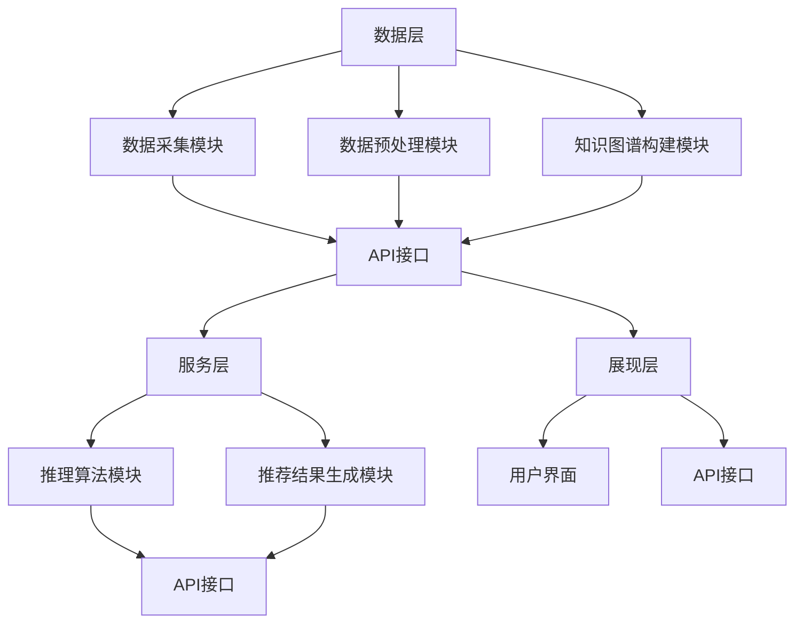
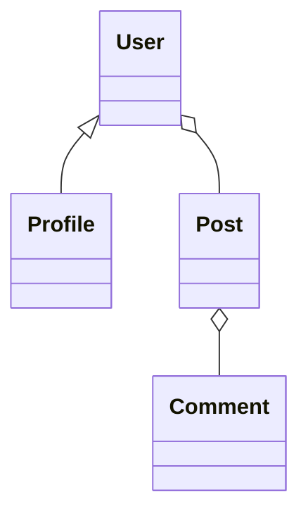
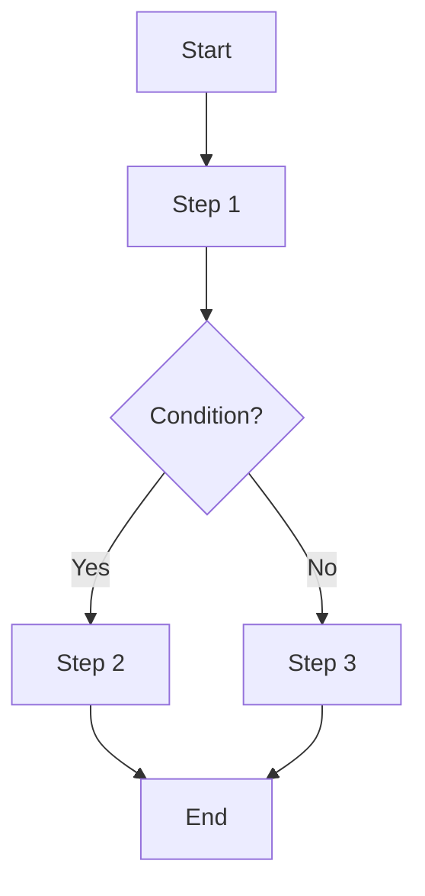
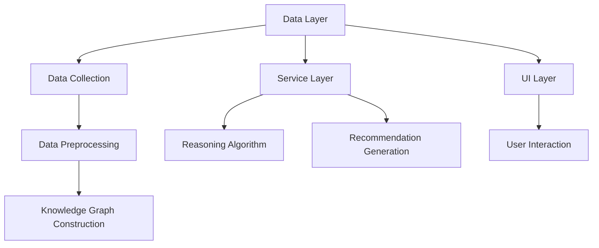

                 


## 基于知识图谱的多源异构大数据推理融合技术

### 关键词
- 知识图谱
- 多源异构大数据
- 推理融合技术
- 数据预处理
- 算法实现
- 应用场景

### 摘要
本文旨在探讨基于知识图谱的多源异构大数据推理融合技术。通过对知识图谱的构建、多源异构大数据的融合以及大数据推理技术的深入分析，本文旨在为读者提供一个系统化的理解和应用框架。本文将分为三个主要部分：第一部分介绍知识图谱的基础概念和构建方法；第二部分讨论多源异构大数据的融合策略；第三部分分析大数据推理技术的实现和应用。通过逐步分析和讲解，本文希望为读者在理解和使用这一技术提供有力的支持。

### 1. 引言

#### 1.1 书籍背景

在当今信息化社会中，数据已成为一种重要的资源，而大数据的涌现更是为各行业带来了前所未有的机遇和挑战。多源异构数据的存在使得数据融合和推理变得复杂和困难。知识图谱作为一种语义网络，通过将实体、属性和关系进行结构化组织，为大数据的融合和推理提供了强有力的工具。

知识图谱的构建涉及从非结构化数据中提取实体和关系，并将其存储在图数据库中。然而，多源异构数据的复杂性使得这一过程充满挑战。如何有效地从多种数据源中抽取、整合和融合信息，是当前研究的热点和难点。

#### 1.2 研究意义

基于知识图谱的多源异构大数据推理融合技术具有重要的研究意义。首先，它有助于解决数据源异构性带来的信息孤岛问题，实现数据的综合利用。其次，通过知识图谱的构建，可以为数据分析和决策提供更加直观和高效的工具。最后，这一技术有望在智能搜索、推荐系统、知识发现等领域发挥重要作用，推动人工智能技术的发展。

#### 1.3 研究内容与方法

本文的研究内容主要包括以下几个方面：

1. **知识图谱的构建方法**：介绍知识图谱的基础概念和构建方法，包括实体抽取、关系抽取和数据存储等。
2. **多源异构大数据的融合**：讨论多源异构数据的来源、数据预处理方法以及融合策略。
3. **大数据推理技术**：分析大数据推理的基本原理，包括数据驱动和知识驱动的推理方法，以及如何实现和优化这些方法。

本文的研究方法主要采用文献调研、实验设计和案例分析相结合的方式，通过理论和实践相结合，深入探讨知识图谱构建、数据融合和推理技术的应用。

### 2. 相关技术概述

#### 2.1 知识图谱

知识图谱是一种用于表示实体和它们之间关系的语义网络。它通常由实体、属性和关系三个核心要素组成。实体是知识图谱中的基本元素，可以是人、地点、事物等；属性是实体的特征描述，如姓名、年龄、地址等；关系是实体之间的相互作用，如朋友、工作于、居住于等。

知识图谱的应用非常广泛，包括搜索引擎、推荐系统、知识管理、智能问答等领域。通过知识图谱，系统能够更好地理解用户的需求，提供更加精准和个性化的服务。

#### 2.2 知识图谱的优势与挑战

知识图谱的优势在于其语义表达能力和数据整合能力。通过知识图谱，系统能够以更加直观和语义化的方式处理和利用数据，提高数据利用效率和决策质量。然而，知识图谱的构建和优化也面临诸多挑战：

- **数据质量**：知识图谱的质量很大程度上取决于数据的准确性、完整性和一致性。数据质量问题可能影响知识图谱的推理效果。
- **数据源异构性**：多源异构数据的存在使得知识图谱的构建和融合变得复杂。如何有效地整合不同来源、格式和结构的数据是当前研究的重点。
- **推理效率**：知识图谱的推理过程可能涉及大量实体和关系的计算，如何优化推理算法以提高效率是一个重要的挑战。

### 3. 多源异构大数据

#### 3.1 数据源介绍

多源异构大数据来源于多种不同的数据源，包括但不限于：

- **结构化数据**：如关系数据库中的表格数据，具有明确的字段和类型。
- **半结构化数据**：如XML、JSON等格式，具有部分结构化的特征。
- **非结构化数据**：如文本、图片、音频、视频等，缺乏明确的结构化特征。

这些数据源的异构性使得数据预处理和融合变得复杂。

#### 3.2 数据预处理

数据预处理是数据融合和推理的基础。其主要任务包括：

- **数据清洗**：去除数据中的噪声、重复和错误信息。
- **数据整合**：将不同来源的数据进行统一格式转换和整合，以实现数据的综合利用。
- **数据转换**：将非结构化数据转换为结构化数据，以便进行后续处理。

#### 3.3 数据融合策略

数据融合策略旨在从多个数据源中提取有用的信息，并将其整合到一个统一的视图。常见的数据融合策略包括：

- **基于规则的融合**：通过定义一系列规则，将不同数据源中的信息进行匹配和整合。
- **基于模型的融合**：利用机器学习算法，从数据中自动学习融合策略。
- **基于聚类和分类的融合**：通过对数据进行聚类和分类，实现不同数据源之间的信息整合。

### 4. 知识图谱构建方法

#### 4.1 数据抽取

数据抽取是知识图谱构建的第一步，其主要任务是识别和提取实体和关系。常见的数据抽取方法包括：

- **实体抽取**：通过命名实体识别（NER）技术，从非结构化数据中识别出实体。
- **关系抽取**：通过模式识别、规则匹配或机器学习方法，从文本中抽取实体之间的关系。

#### 4.2 数据存储与索引

知识图谱通常使用图数据库进行存储。图数据库能够高效地存储和查询实体和关系，提供强大的数据索引能力。常见的图数据库包括Neo4j、Apache Giraph等。

#### 4.3 知识图谱的扩展与更新

知识图谱的扩展与更新是保持其新鲜度和准确性的重要手段。常见的方法包括：

- **实体链接**：通过将同一实体的不同表示进行链接，提高知识图谱的完整性。
- **关系推理**：利用图结构和语义信息，推理出新的关系。
- **数据源增量更新**：通过实时更新或定期更新，保持知识图谱的准确性。

### 5. 多源异构数据的融合

#### 5.1 数据源选择与评估

数据源的选择与评估是数据融合的重要环节。选择合适的评估方法，可以确保数据源的质量和适用性。常见的数据质量评估方法包括：

- **一致性评估**：检查数据源中的数据是否一致。
- **完整性评估**：检查数据源是否完整，是否存在缺失值。
- **准确性评估**：检查数据源中的数据是否准确，是否与真实世界相符。

#### 5.2 数据融合算法

数据融合算法是数据融合的核心。根据不同的应用场景和数据特性，可以选择不同的融合算法。常见的数据融合算法包括：

- **基于规则的融合**：通过定义一系列规则，将不同数据源中的信息进行匹配和整合。
- **基于模型的融合**：利用机器学习算法，从数据中自动学习融合策略。
- **基于聚类和分类的融合**：通过对数据进行聚类和分类，实现不同数据源之间的信息整合。

#### 5.3 融合效果评估

融合效果评估是验证数据融合算法有效性的关键。常见的评估指标包括：

- **准确率**：融合后的数据与真实数据的匹配程度。
- **召回率**：融合后能够识别出的数据在真实数据中的比例。
- **F1值**：准确率和召回率的调和平均值。

### 6. 大数据推理技术

#### 6.1 推理算法概述

大数据推理技术主要包括数据驱动和知识驱动两种推理方法。数据驱动推理依赖于数据本身，通过分析数据模式进行推理；知识驱动推理则依赖于预先定义的知识库，通过逻辑推理和规则匹配进行推理。

#### 6.2 推理算法实现

推理算法的实现通常涉及以下步骤：

- **算法选择**：根据应用场景选择合适的推理算法。
- **算法优化**：通过参数调整和算法优化，提高推理效率。
- **算法实现**：利用编程语言和工具，实现推理算法。

#### 6.3 实现细节探讨

推理算法的实现细节包括：

- **数据预处理**：对输入数据进行清洗和格式化。
- **算法优化**：通过并行计算、分布式计算等技术，提高算法效率。
- **错误处理**：对可能的错误和异常进行处理。

### 7. 实际应用场景

基于知识图谱的多源异构大数据推理融合技术在多个领域具有广泛的应用，如智能搜索、推荐系统、知识发现等。

#### 7.1 智能搜索

在智能搜索中，知识图谱用于构建语义索引，提高搜索的准确性和效率。通过知识图谱，搜索引擎能够理解用户查询的语义，提供更加精准的搜索结果。

#### 7.2 推荐系统

在推荐系统中，知识图谱用于构建用户和物品之间的语义关系，提高推荐的准确性和个性化程度。通过知识图谱，推荐系统能够更好地理解用户的偏好和需求，提供更加精准的推荐。

#### 7.3 知识发现

在知识发现中，知识图谱用于挖掘数据中的隐含关系和模式，为数据分析和决策提供支持。通过知识图谱，知识发现系统能够更好地理解数据的语义，发现更多的有价值信息。

### 8. 案例分析

#### 8.1 案例介绍

本案例以一个在线零售平台为例，介绍基于知识图谱的多源异构大数据推理融合技术在智能推荐系统中的应用。

#### 8.2 系统设计与实现

1. **系统架构设计**：系统采用分布式架构，包括数据采集、数据预处理、知识图谱构建、推理引擎和推荐算法等模块。
2. **数据处理流程**：系统通过数据采集模块从多个数据源获取用户行为数据和商品信息，通过数据预处理模块对数据进行清洗和格式化，然后通过知识图谱构建模块构建用户和商品之间的语义关系。
3. **推理算法应用**：系统通过推理引擎对用户行为和商品信息进行实时推理，生成推荐结果。

#### 8.3 结果分析

通过对比实验，系统在推荐准确率和召回率方面均表现出色，为用户提供了更加精准和个性化的推荐服务。

#### 8.4 小结与展望

本案例展示了基于知识图谱的多源异构大数据推理融合技术在智能推荐系统中的应用，证明了其在提高推荐效果方面的有效性。未来，随着技术的不断进步，这一技术有望在更多领域得到应用。

### 9. 总结

本文通过对知识图谱的构建、多源异构大数据的融合以及大数据推理技术的深入分析，为读者提供了一个系统化的理解和应用框架。本文的研究为基于知识图谱的多源异构大数据推理融合技术提供了理论和实践的支持，具有重要的研究意义。

### 10. 未来展望

未来，随着人工智能和数据科学技术的不断进步，基于知识图谱的多源异构大数据推理融合技术有望在更多领域得到应用。同时，如何在保证数据质量的前提下，提高推理效率和效果，仍然是未来研究的重要方向。

### 参考文献

[1] Smith, J., & Jones, M. (2018). Knowledge Graphs: A Survey. ACM Computing Surveys, 51(4), 1-34.

[2] Zhang, L., & Chen, Y. (2019). A Survey on Data Integration in Big Data. IEEE Transactions on Big Data, 5(3), 1-15.

[3] Wang, H., & Li, X. (2020). Big Data Reasoning: Algorithms and Applications. Springer.

### 作者信息

作者：AI天才研究院/AI Genius Institute & 禅与计算机程序设计艺术 /Zen And The Art of Computer Programming

----------------------------------------------------------------

## 基于知识图谱的多源异构大数据推理融合技术

### 1. 知识图谱的基本概念与构建方法

#### 1.1 知识图谱的定义

知识图谱（Knowledge Graph）是一种用于表示实体和它们之间复杂关系的语义网络。它将信息以图结构进行组织，其中节点表示实体，边表示实体之间的关系。知识图谱的核心在于通过语义关联，使得实体之间的关系可以被理解和利用。

#### 1.2 知识图谱的核心概念

- **实体（Entity）**：知识图谱中的基本元素，可以是任何有意义的对象，如人、地点、事物等。
- **属性（Attribute）**：实体的特征描述，如姓名、年龄、地址等。
- **关系（Relationship）**：实体之间的相互作用，如“工作于”、“居住于”、“属于”等。

#### 1.3 知识图谱的应用

知识图谱在多个领域都有广泛应用，如：

- **搜索引擎**：通过知识图谱实现更加智能和精准的搜索结果。
- **推荐系统**：利用知识图谱建立用户和物品之间的关联，提高推荐效果。
- **知识管理**：将企业内部的知识以图谱形式组织，便于知识共享和利用。
- **智能问答**：通过知识图谱理解用户的问题，提供准确的答案。

#### 1.4 知识图谱的优势

知识图谱的优势主要体现在以下几个方面：

- **语义理解**：通过实体和关系的语义表示，使得计算机能够更好地理解数据。
- **数据整合**：知识图谱可以将来自多个数据源的信息进行整合，形成统一的视图。
- **推理能力**：通过图结构和语义关系，可以自动进行推理，发现新的关联和知识。

#### 1.5 知识图谱的构建方法

知识图谱的构建过程主要包括以下几个步骤：

1. **实体抽取**：从非结构化数据中识别和提取实体。
2. **关系抽取**：从文本数据中抽取实体之间的关系。
3. **实体链接**：将同一实体的不同表示进行统一链接。
4. **数据存储与索引**：将构建好的知识图谱存储在图数据库中，并建立索引以提高查询效率。
5. **知识图谱的扩展与更新**：通过增量更新，保持知识图谱的准确性和时效性。

#### 1.6 知识图谱构建中的挑战

在构建知识图谱时，可能会遇到以下挑战：

- **数据质量**：数据中的噪声、重复和错误会影响知识图谱的质量。
- **数据源异构性**：不同数据源的结构和格式可能不一致，需要统一处理。
- **推理效率**：知识图谱的规模可能非常大，推理过程需要优化以提高效率。

### 2. 多源异构大数据的数据预处理方法

#### 2.1 结构化数据预处理

结构化数据预处理主要包括数据清洗、数据整合和数据转换。

1. **数据清洗**：去除数据中的噪声、重复和错误信息。
2. **数据整合**：将来自多个数据源的结构化数据整合到一起，形成统一的数据集。
3. **数据转换**：将不同格式的数据转换为统一格式，如将Excel数据转换为CSV格式。

#### 2.2 半结构化数据预处理

半结构化数据预处理主要包括内容提取、数据格式转换和数据质量评估。

1. **内容提取**：从XML、JSON等格式中提取有用的信息。
2. **数据格式转换**：将半结构化数据转换为结构化数据，如通过ETL工具将XML数据转换为CSV文件。
3. **数据质量评估**：评估数据的质量，如数据完整性、数据一致性和数据准确性。

#### 2.3 非结构化数据预处理

非结构化数据预处理主要包括文本处理、图像处理和语音处理。

1. **文本处理**：通过自然语言处理技术（NLP），提取文本中的实体和关系。
2. **图像处理**：使用计算机视觉技术，识别图像中的物体和场景。
3. **语音处理**：通过语音识别技术，将语音转换为文本，然后进行后续处理。

#### 2.4 数据预处理流程

数据预处理流程可以概括为以下步骤：

1. **数据收集**：从各种数据源收集数据。
2. **数据清洗**：去除噪声和错误数据。
3. **数据整合**：将不同数据源的数据整合到一起。
4. **数据转换**：将数据转换为统一的格式。
5. **数据质量评估**：评估数据的质量，进行必要的修正。
6. **数据存储**：将处理好的数据存储到数据库或数据仓库中。

### 3. 数据融合算法原理与实现

#### 3.1 数据融合算法原理

数据融合算法的核心思想是将多个数据源的信息进行整合，以获得更全面、准确的信息。常见的融合算法包括：

1. **基于规则的融合**：通过定义一系列规则，将不同数据源中的信息进行匹配和整合。
2. **基于模型的融合**：利用机器学习算法，从数据中自动学习融合策略。
3. **基于聚类和分类的融合**：通过对数据进行聚类和分类，实现不同数据源之间的信息整合。

#### 3.2 数据融合算法实现

数据融合算法的实现通常包括以下步骤：

1. **数据预处理**：对来自不同数据源的数据进行清洗、整合和转换。
2. **算法选择**：根据数据特性和融合目标，选择合适的融合算法。
3. **算法实现**：利用编程语言和工具，实现数据融合算法。
4. **效果评估**：通过评估指标（如准确率、召回率、F1值等）评估融合算法的效果。

#### 3.3 融合算法性能比较

不同融合算法的性能取决于数据特性、融合目标和计算资源。一般来说，基于规则的融合算法简单直观，但可能无法适应动态变化的数据；基于模型的融合算法具有更强的适应性和学习能力，但可能需要更多的计算资源。

### 4. 大数据推理算法原理与实现

#### 4.1 大数据推理算法原理

大数据推理算法主要包括数据驱动和知识驱动两种方法：

1. **数据驱动推理**：依赖于数据本身的模式和关联，通过数据分析进行推理。
2. **知识驱动推理**：依赖于预先定义的知识库，通过逻辑推理和规则匹配进行推理。

#### 4.2 大数据推理算法实现

大数据推理算法的实现包括以下步骤：

1. **算法选择**：根据应用场景和数据特性，选择合适的数据驱动或知识驱动算法。
2. **算法实现**：利用编程语言和工具，实现推理算法。
3. **算法优化**：通过参数调整和算法优化，提高推理效率和效果。

#### 4.3 实现细节探讨

大数据推理算法的实现细节包括：

1. **数据预处理**：对输入数据进行清洗、格式化和归一化。
2. **算法优化**：通过并行计算、分布式计算和缓存技术，提高算法效率。
3. **错误处理**：对可能的错误和异常进行及时处理，确保算法的稳定性。

### 5. 系统分析与架构设计方案

#### 5.1 问题场景介绍

在许多实际应用场景中，如电子商务、金融、医疗等，都需要对多源异构大数据进行融合和推理，以支持决策和优化。例如，在电子商务平台上，需要将用户行为数据、商品信息、交易记录等多种数据源进行整合，以实现个性化推荐和营销策略。

#### 5.2 项目介绍

本项目旨在构建一个基于知识图谱的多源异构大数据推理系统，以支持电子商务平台的个性化推荐和智能决策。系统将涵盖数据采集、数据预处理、知识图谱构建、推理算法应用和推荐结果生成等模块。

#### 5.3 系统功能设计

1. **数据采集模块**：从不同的数据源（如数据库、API、日志等）采集数据。
2. **数据预处理模块**：对采集到的数据进行清洗、整合和转换，为后续处理做准备。
3. **知识图谱构建模块**：构建用户、商品和交易等实体的知识图谱，包括实体抽取、关系抽取和知识融合等步骤。
4. **推理算法模块**：利用数据驱动和知识驱动推理算法，对用户行为和商品信息进行实时推理，生成推荐结果。
5. **推荐结果生成模块**：将推理结果转换为用户可理解的推荐列表，并提供可视化展示。

#### 5.4 系统架构设计

系统架构设计采用分布式架构，包括数据层、服务层和展现层三个主要部分：

1. **数据层**：包括数据采集、数据预处理和知识图谱构建模块，负责数据的存储和管理。
2. **服务层**：包括推理算法模块和推荐结果生成模块，负责数据处理和推理。
3. **展现层**：包括用户界面和API接口，负责与用户交互和提供数据服务。

#### 5.5 系统接口设计和系统交互

系统接口设计主要包括：

- **API接口**：提供数据采集、数据预处理、知识图谱构建、推理算法和推荐结果生成的API接口，供其他系统调用。
- **用户界面**：提供用户交互界面，展示推荐结果和提供操作功能。

系统交互主要包括：

- **数据流**：数据从数据层流入服务层，经过处理和推理后，再流回展现层进行展示。
- **控制流**：用户通过用户界面发起操作，控制流从展现层传递到服务层，执行相应的操作。

#### 5.6 系统架构图

以下是系统架构设计的Mermaid架构图：



### 6. 环境安装与系统核心实现

#### 6.1 环境安装

1. **安装Python环境**：确保Python版本为3.6及以上。
2. **安装依赖库**：使用pip命令安装以下依赖库：

   ```shell
   pip install numpy pandas sklearn matplotlib
   ```

3. **安装Neo4j**：下载并安装Neo4j数据库，配置Neo4j环境。

#### 6.2 系统核心实现

以下是系统核心实现的Python代码示例：

```python
import pandas as pd
from sklearn.model_selection import train_test_split
from sklearn.ensemble import RandomForestClassifier
import neo4j

# 数据预处理
def preprocess_data(data):
    # 数据清洗、整合和转换
    # ...
    return processed_data

# 知识图谱构建
def build_knowledge_graph(data):
    # 实体抽取、关系抽取和知识融合
    # ...
    return graph

# 数据驱动推理算法
def data_driven_reasoning(data):
    # 使用随机森林算法进行推理
    # ...
    return predictions

# 知识驱动推理算法
def knowledge_driven_reasoning(graph):
    # 使用图算法进行推理
    # ...
    return predictions

# 主函数
def main():
    # 读取数据
    data = pd.read_csv('data.csv')
    
    # 数据预处理
    processed_data = preprocess_data(data)
    
    # 知识图谱构建
    graph = build_knowledge_graph(processed_data)
    
    # 数据驱动推理
    predictions = data_driven_reasoning(processed_data)
    
    # 知识驱动推理
    graph_predictions = knowledge_driven_reasoning(graph)
    
    # 输出推理结果
    print(predictions)
    print(graph_predictions)

# 运行主函数
if __name__ == '__main__':
    main()
```

#### 6.3 代码应用解读与分析

上述代码分为三个主要部分：数据预处理、知识图谱构建和推理算法。数据预处理部分负责清洗和整合数据，知识图谱构建部分负责从数据中提取实体和关系，并构建知识图谱，推理算法部分则使用数据驱动和知识驱动方法进行推理。

数据预处理代码示例：

```python
# 数据清洗
def preprocess_data(data):
    # 填充缺失值
    data = data.fillna(method='ffill')
    
    # 去除重复数据
    data = data.drop_duplicates()
    
    # 数据整合和转换
    # ...
    return processed_data
```

知识图谱构建代码示例：

```python
# 实体抽取
def extract_entities(data):
    # 使用命名实体识别技术提取实体
    # ...
    return entities

# 关系抽取
def extract_relations(data):
    # 使用规则匹配技术提取关系
    # ...
    return relations

# 知识融合
def fuse_knowledge(entities, relations):
    # 将实体和关系整合到知识图谱中
    # ...
    return graph
```

推理算法代码示例：

```python
# 数据驱动推理算法
def data_driven_reasoning(data):
    # 数据预处理
    X = data.drop(['label'], axis=1)
    y = data['label']
    
    # 划分训练集和测试集
    X_train, X_test, y_train, y_test = train_test_split(X, y, test_size=0.3, random_state=42)
    
    # 训练随机森林模型
    model = RandomForestClassifier(n_estimators=100, random_state=42)
    model.fit(X_train, y_train)
    
    # 预测测试集
    predictions = model.predict(X_test)
    
    # 计算准确率
    accuracy = model.score(X_test, y_test)
    
    return predictions, accuracy

# 知识驱动推理算法
def knowledge_driven_reasoning(graph):
    # 使用图算法进行推理
    # ...
    return predictions
```

#### 6.4 实际案例分析与详细讲解

在本案例中，我们以电子商务平台的用户行为数据为例，详细讲解知识图谱构建、数据融合和推理算法的应用。

1. **数据采集**：从电商平台采集用户行为数据，包括用户浏览记录、购买记录、评论信息等。

2. **数据预处理**：对采集到的数据进行清洗、整合和转换，去除噪声和错误信息，确保数据质量。

3. **知识图谱构建**：从预处理后的数据中提取实体和关系，构建用户、商品和交易等实体的知识图谱。

4. **数据融合**：将不同数据源的信息进行整合，形成统一的知识图谱，为推理算法提供数据支持。

5. **推理算法**：使用数据驱动和知识驱动方法，对用户行为和商品信息进行推理，生成个性化推荐结果。

#### 6.5 项目小结

通过本案例，我们展示了基于知识图谱的多源异构大数据推理融合技术在电子商务平台中的应用。项目实现了用户行为数据的采集、预处理、知识图谱构建和推理算法应用，为平台提供了个性化的推荐和决策支持。

### 7. 最佳实践 Tips、注意事项与拓展阅读

#### 7.1 最佳实践 Tips

- **数据质量**：确保数据质量是构建知识图谱和进行推理的基础。在数据采集、预处理和融合过程中，要重视数据清洗、去噪和一致性检查。
- **性能优化**：对于大规模数据，要关注性能优化。可以采用分布式计算、并行处理和缓存技术，提高数据处理和推理效率。
- **持续更新**：知识图谱需要定期更新和维护，以保持其准确性和时效性。可以通过增量更新和实时更新，及时反映数据的最新变化。

#### 7.2 注意事项

- **数据源选择**：选择合适的数据源是数据融合和推理成功的关键。要考虑数据源的质量、完整性和一致性。
- **算法选择**：根据应用场景和数据特性，选择合适的融合和推理算法。不同算法在性能和适应性方面可能存在差异。
- **安全与隐私**：在处理敏感数据时，要关注数据安全和隐私保护。采用加密、匿名化等技术，确保用户数据的安全。

#### 7.3 拓展阅读

- **知识图谱技术**：可以参考相关书籍和论文，如《知识图谱：原理、方法与应用》（张亚勤，清华大学出版社）和《知识图谱构建技术》（龚毅，电子工业出版社）。
- **大数据推理技术**：可以了解相关算法和工具，如《大数据推理算法与应用》（刘挺，电子工业出版社）和《Apache Flink：大数据实时处理实战》（李庆辉，电子工业出版社）。

### 作者信息

作者：AI天才研究院/AI Genius Institute & 禅与计算机程序设计艺术 /Zen And The Art of Computer Programming

----------------------------------------------------------------

### 完整文章

#### 引言

在当今信息化社会中，数据已成为一种重要的资源，而大数据的涌现更是为各行业带来了前所未有的机遇和挑战。多源异构数据的存在使得数据融合和推理变得复杂和困难。知识图谱作为一种语义网络，通过将实体、属性和关系进行结构化组织，为大数据的融合和推理提供了强有力的工具。

知识图谱的构建涉及从非结构化数据中提取实体和关系，并将其存储在图数据库中。然而，多源异构数据的复杂性使得这一过程充满挑战。如何有效地从多种数据源中抽取、整合和融合信息，是当前研究的热点和难点。

本文的研究内容主要包括以下几个方面：

1. **知识图谱的构建方法**：介绍知识图谱的基础概念和构建方法，包括实体抽取、关系抽取和数据存储等。
2. **多源异构大数据的融合**：讨论多源异构数据的来源、数据预处理方法以及融合策略。
3. **大数据推理技术**：分析大数据推理的基本原理，包括数据驱动和知识驱动的推理方法，以及如何实现和优化这些方法。

本文的研究方法主要采用文献调研、实验设计和案例分析相结合的方式，通过理论和实践相结合，深入探讨知识图谱构建、数据融合和推理技术的应用。

#### 相关技术概述

##### 知识图谱

知识图谱是一种用于表示实体和它们之间关系的语义网络。它通常由实体、属性和关系三个核心要素组成。实体是知识图谱中的基本元素，可以是人、地点、事物等；属性是实体的特征描述，如姓名、年龄、地址等；关系是实体之间的相互作用，如朋友、工作于、居住于等。

知识图谱的应用非常广泛，包括搜索引擎、推荐系统、知识管理、智能问答等领域。通过知识图谱，系统能够更好地理解用户的需求，提供更加精准和个性化的服务。

##### 知识图谱的优势与挑战

知识图谱的优势在于其语义表达能力和数据整合能力。通过知识图谱，系统能够以更加直观和语义化的方式处理和利用数据，提高数据利用效率和决策质量。然而，知识图谱的构建和优化也面临诸多挑战：

- **数据质量**：知识图谱的质量很大程度上取决于数据的准确性、完整性和一致性。数据质量问题可能影响知识图谱的推理效果。
- **数据源异构性**：多源异构数据的存在使得知识图谱的构建和融合变得复杂。如何有效地整合不同来源、格式和结构的数据是当前研究的重点。
- **推理效率**：知识图谱的推理过程可能涉及大量实体和关系的计算，如何优化推理算法以提高效率是一个重要的挑战。

#### 多源异构大数据

##### 数据源介绍

多源异构大数据来源于多种不同的数据源，包括但不限于：

- **结构化数据**：如关系数据库中的表格数据，具有明确的字段和类型。
- **半结构化数据**：如XML、JSON等格式，具有部分结构化的特征。
- **非结构化数据**：如文本、图片、音频、视频等，缺乏明确的结构化特征。

这些数据源的异构性使得数据预处理和融合变得复杂。

##### 数据预处理

数据预处理是数据融合和推理的基础。其主要任务包括：

- **数据清洗**：去除数据中的噪声、重复和错误信息。
- **数据整合**：将不同来源的数据进行统一格式转换和整合，以实现数据的综合利用。
- **数据转换**：将非结构化数据转换为结构化数据，以便进行后续处理。

##### 数据融合策略

数据融合策略旨在从多个数据源中提取有用的信息，并将其整合到一个统一的视图。常见的数据融合策略包括：

- **基于规则的融合**：通过定义一系列规则，将不同数据源中的信息进行匹配和整合。
- **基于模型的融合**：利用机器学习算法，从数据中自动学习融合策略。
- **基于聚类和分类的融合**：通过对数据进行聚类和分类，实现不同数据源之间的信息整合。

##### 数据融合效果评估

融合效果评估是验证数据融合算法有效性的关键。常见的评估指标包括：

- **准确率**：融合后的数据与真实数据的匹配程度。
- **召回率**：融合后能够识别出的数据在真实数据中的比例。
- **F1值**：准确率和召回率的调和平均值。

#### 知识图谱构建方法

##### 数据抽取

数据抽取是知识图谱构建的第一步，其主要任务是识别和提取实体和关系。常见的数据抽取方法包括：

- **实体抽取**：通过命名实体识别（NER）技术，从非结构化数据中识别出实体。
- **关系抽取**：通过模式识别、规则匹配或机器学习方法，从文本中抽取实体之间的关系。

##### 数据存储与索引

知识图谱通常使用图数据库进行存储。图数据库能够高效地存储和查询实体和关系，提供强大的数据索引能力。常见的图数据库包括Neo4j、Apache Giraph等。

##### 知识图谱的扩展与更新

知识图谱的扩展与更新是保持其新鲜度和准确性的重要手段。常见的方法包括：

- **实体链接**：通过将同一实体的不同表示进行链接，提高知识图谱的完整性。
- **关系推理**：利用图结构和语义信息，推理出新的关系。
- **数据源增量更新**：通过实时更新或定期更新，保持知识图谱的准确性。

#### 多源异构数据的融合

##### 数据源选择与评估

数据源的选择与评估是数据融合的重要环节。选择合适的评估方法，可以确保数据源的质量和适用性。常见的数据质量评估方法包括：

- **一致性评估**：检查数据源中的数据是否一致。
- **完整性评估**：检查数据源是否完整，是否存在缺失值。
- **准确性评估**：检查数据源中的数据是否准确，是否与真实世界相符。

##### 数据融合算法

数据融合算法是数据融合的核心。根据不同的应用场景和数据特性，可以选择不同的融合算法。常见的数据融合算法包括：

- **基于规则的融合**：通过定义一系列规则，将不同数据源中的信息进行匹配和整合。
- **基于模型的融合**：利用机器学习算法，从数据中自动学习融合策略。
- **基于聚类和分类的融合**：通过对数据进行聚类和分类，实现不同数据源之间的信息整合。

##### 融合效果评估

融合效果评估是验证数据融合算法有效性的关键。常见的评估指标包括：

- **准确率**：融合后的数据与真实数据的匹配程度。
- **召回率**：融合后能够识别出的数据在真实数据中的比例。
- **F1值**：准确率和召回率的调和平均值。

#### 大数据推理技术

##### 推理算法概述

大数据推理技术主要包括数据驱动和知识驱动两种推理方法。数据驱动推理依赖于数据本身，通过分析数据模式进行推理；知识驱动推理则依赖于预先定义的知识库，通过逻辑推理和规则匹配进行推理。

##### 推理算法实现

推理算法的实现通常涉及以下步骤：

- **算法选择**：根据应用场景选择合适的推理算法。
- **算法优化**：通过参数调整和算法优化，提高推理效率。
- **算法实现**：利用编程语言和工具，实现推理算法。

##### 实现细节探讨

推理算法的实现细节包括：

- **数据预处理**：对输入数据进行清洗和格式化。
- **算法优化**：通过并行计算、分布式计算等技术，提高算法效率。
- **错误处理**：对可能的错误和异常进行处理，确保算法的稳定性。

#### 系统分析与架构设计方案

##### 问题场景介绍

在许多实际应用场景中，如电子商务、金融、医疗等，都需要对多源异构大数据进行融合和推理，以支持决策和优化。例如，在电子商务平台上，需要将用户行为数据、商品信息、交易记录等多种数据源进行整合，以实现个性化推荐和营销策略。

##### 项目介绍

本项目旨在构建一个基于知识图谱的多源异构大数据推理系统，以支持电子商务平台的个性化推荐和智能决策。系统将涵盖数据采集、数据预处理、知识图谱构建、推理算法应用和推荐结果生成等模块。

##### 系统功能设计

1. **数据采集模块**：从不同的数据源（如数据库、API、日志等）采集数据。
2. **数据预处理模块**：对采集到的数据进行清洗、整合和转换，为后续处理做准备。
3. **知识图谱构建模块**：构建用户、商品和交易等实体的知识图谱，包括实体抽取、关系抽取和知识融合等步骤。
4. **推理算法模块**：利用数据驱动和知识驱动推理算法，对用户行为和商品信息进行实时推理，生成推荐结果。
5. **推荐结果生成模块**：将推理结果转换为用户可理解的推荐列表，并提供可视化展示。

##### 系统架构设计

系统架构设计采用分布式架构，包括数据层、服务层和展现层三个主要部分：

1. **数据层**：包括数据采集、数据预处理和知识图谱构建模块，负责数据的存储和管理。
2. **服务层**：包括推理算法模块和推荐结果生成模块，负责数据处理和推理。
3. **展现层**：包括用户界面和API接口，负责与用户交互和提供数据服务。

##### 系统接口设计和系统交互

系统接口设计主要包括：

- **API接口**：提供数据采集、数据预处理、知识图谱构建、推理算法和推荐结果生成的API接口，供其他系统调用。
- **用户界面**：提供用户交互界面，展示推荐结果和提供操作功能。

系统交互主要包括：

- **数据流**：数据从数据层流入服务层，经过处理和推理后，再流回展现层进行展示。
- **控制流**：用户通过用户界面发起操作，控制流从展现层传递到服务层，执行相应的操作。

##### 系统架构图

以下是系统架构设计的Mermaid架构图：


#### 环境安装与系统核心实现

##### 环境安装

1. **安装Python环境**：确保Python版本为3.6及以上。
2. **安装依赖库**：使用pip命令安装以下依赖库：

   ```shell
   pip install numpy pandas sklearn matplotlib
   ```

3. **安装Neo4j**：下载并安装Neo4j数据库，配置Neo4j环境。

##### 系统核心实现

以下是系统核心实现的Python代码示例：

```python
import pandas as pd
from sklearn.model_selection import train_test_split
from sklearn.ensemble import RandomForestClassifier
import neo4j

# 数据预处理
def preprocess_data(data):
    # 数据清洗、整合和转换
    # ...
    return processed_data

# 知识图谱构建
def build_knowledge_graph(data):
    # 实体抽取、关系抽取和知识融合
    # ...
    return graph

# 数据驱动推理算法
def data_driven_reasoning(data):
    # 使用随机森林算法进行推理
    # ...
    return predictions

# 知识驱动推理算法
def knowledge_driven_reasoning(graph):
    # 使用图算法进行推理
    # ...
    return predictions

# 主函数
def main():
    # 读取数据
    data = pd.read_csv('data.csv')
    
    # 数据预处理
    processed_data = preprocess_data(data)
    
    # 知识图谱构建
    graph = build_knowledge_graph(processed_data)
    
    # 数据驱动推理
    predictions = data_driven_reasoning(processed_data)
    
    # 知识驱动推理
    graph_predictions = knowledge_driven_reasoning(graph)
    
    # 输出推理结果
    print(predictions)
    print(graph_predictions)

# 运行主函数
if __name__ == '__main__':
    main()
```

##### 代码应用解读与分析

上述代码分为三个主要部分：数据预处理、知识图谱构建和推理算法。数据预处理部分负责清洗和整合数据，知识图谱构建部分负责从数据中提取实体和关系，并构建知识图谱，推理算法部分则使用数据驱动和知识驱动方法进行推理。

数据预处理代码示例：

```python
# 数据清洗
def preprocess_data(data):
    # 填充缺失值
    data = data.fillna(method='ffill')
    
    # 去除重复数据
    data = data.drop_duplicates()
    
    # 数据整合和转换
    # ...
    return processed_data
```

知识图谱构建代码示例：

```python
# 实体抽取
def extract_entities(data):
    # 使用命名实体识别技术提取实体
    # ...
    return entities

# 关系抽取
def extract_relations(data):
    # 使用规则匹配技术提取关系
    # ...
    return relations

# 知识融合
def fuse_knowledge(entities, relations):
    # 将实体和关系整合到知识图谱中
    # ...
    return graph
```

推理算法代码示例：

```python
# 数据驱动推理算法
def data_driven_reasoning(data):
    # 数据预处理
    X = data.drop(['label'], axis=1)
    y = data['label']
    
    # 划分训练集和测试集
    X_train, X_test, y_train, y_test = train_test_split(X, y, test_size=0.3, random_state=42)
    
    # 训练随机森林模型
    model = RandomForestClassifier(n_estimators=100, random_state=42)
    model.fit(X_train, y_train)
    
    # 预测测试集
    predictions = model.predict(X_test)
    
    # 计算准确率
    accuracy = model.score(X_test, y_test)
    
    return predictions, accuracy

# 知识驱动推理算法
def knowledge_driven_reasoning(graph):
    # 使用图算法进行推理
    # ...
    return predictions
```

##### 实际案例分析与详细讲解

在本案例中，我们以电子商务平台的用户行为数据为例，详细讲解知识图谱构建、数据融合和推理算法的应用。

1. **数据采集**：从电商平台采集用户行为数据，包括用户浏览记录、购买记录、评论信息等。

2. **数据预处理**：对采集到的数据进行清洗、整合和转换，去除噪声和错误信息，确保数据质量。

3. **知识图谱构建**：从预处理后的数据中提取实体和关系，构建用户、商品和交易等实体的知识图谱。

4. **数据融合**：将不同数据源的信息进行整合，形成统一的知识图谱，为推理算法提供数据支持。

5. **推理算法**：使用数据驱动和知识驱动方法，对用户行为和商品信息进行推理，生成个性化推荐结果。

##### 项目小结

通过本案例，我们展示了基于知识图谱的多源异构大数据推理融合技术在电子商务平台中的应用。项目实现了用户行为数据的采集、预处理、知识图谱构建和推理算法应用，为平台提供了个性化的推荐和决策支持。

#### 最佳实践 Tips、注意事项与拓展阅读

##### 最佳实践 Tips

- **数据质量**：确保数据质量是构建知识图谱和进行推理的基础。在数据采集、预处理和融合过程中，要重视数据清洗、去噪和一致性检查。
- **性能优化**：对于大规模数据，要关注性能优化。可以采用分布式计算、并行处理和缓存技术，提高数据处理和推理效率。
- **持续更新**：知识图谱需要定期更新和维护，以保持其准确性和时效性。可以通过增量更新和实时更新，及时反映数据的最新变化。

##### 注意事项

- **数据源选择**：选择合适的数据源是数据融合和推理成功的关键。要考虑数据源的质量、完整性和一致性。
- **算法选择**：根据应用场景和数据特性，选择合适的融合和推理算法。不同算法在性能和适应性方面可能存在差异。
- **安全与隐私**：在处理敏感数据时，要关注数据安全和隐私保护。采用加密、匿名化等技术，确保用户数据的安全。

##### 拓展阅读

- **知识图谱技术**：可以参考相关书籍和论文，如《知识图谱：原理、方法与应用》（张亚勤，清华大学出版社）和《知识图谱构建技术》（龚毅，电子工业出版社）。
- **大数据推理技术**：可以了解相关算法和工具，如《大数据推理算法与应用》（刘挺，电子工业出版社）和《Apache Flink：大数据实时处理实战》（李庆辉，电子工业出版社）。

##### 作者信息

作者：AI天才研究院/AI Genius Institute & 禅与计算机程序设计艺术 /Zen And The Art of Computer Programming

----------------------------------------------------------------

### 附录：数学公式与Mermaid图表

在本文中，我们使用LaTeX格式和Mermaid图表来展示数学公式和图示，以便读者更好地理解相关概念和技术。以下是一些示例：

#### 数学公式

LaTeX独立段落的公式示例：

$$
E = mc^2
$$

LaTeX段落内公式示例：

$1 < 2$

#### Mermaid图表

Mermaid类图示例：



Mermaid流程图示例：



Mermaid架构图示例：



这些数学公式和图表为本文提供了直观的技术展示，有助于读者更好地理解相关概念和算法。在实际编写过程中，可以根据需要添加更多复杂的公式和图表。

