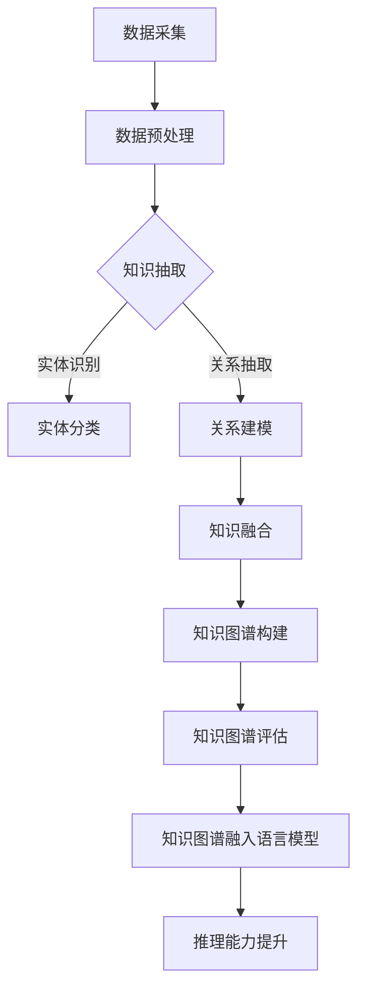

                 

## 基于知识图谱的语言模型推理能力增强

### 关键词：
- 知识图谱
- 语言模型
- 推理能力
- 自然语言处理
- 人工智能

### 摘要：
本文探讨了基于知识图谱的语言模型推理能力增强技术。首先介绍了知识图谱和语言模型的基本概念，随后详细分析了知识图谱构建和语言模型增强的方法。最后，通过具体应用实践展示了知识图谱与语言模型融合的实际效果，并提出了未来展望。

### 目录大纲：

## 第一部分：背景与基础
### 1.1 问题背景
### 1.2 核心概念
### 1.3 相关技术综述

## 第二部分：知识图谱构建
### 2.1 数据采集与预处理
### 2.2 知识抽取
### 2.3 知识图谱评估

## 第三部分：语言模型增强
### 3.1 语言模型基础
### 3.2 知识图谱融入语言模型
### 3.3 推理能力提升

## 第四部分：应用实践
### 4.1 应用场景介绍
### 4.2 项目实战
### 4.3 案例分析

## 第五部分：总结与展望
### 5.1 技术总结
### 5.2 未来展望
### 5.3 小结

## 核心概念与联系

### 1. 知识图谱（Knowledge Graph）
知识图谱是一个结构化的语义网络，用于表示现实世界中的实体、属性和关系。它通常由实体（如人、地点、事物）、属性（如年龄、身高、颜色）和关系（如朋友、属于、位于）组成。

### 2. 语言模型（Language Model）
语言模型是一种统计模型，用于预测自然语言序列的概率分布。它通常基于大量的文本数据，通过训练生成一个概率模型。

### 3. 推理能力（Reasoning Capability）
推理能力是指语言模型在理解、解释和推导信息方面的能力。增强语言模型的推理能力意味着使其能够更好地理解和处理复杂、抽象的概念和关系。

### 4. 知识图谱融入语言模型
知识图谱与语言模型的融合是通过将知识图谱中的结构化知识嵌入到语言模型中，从而增强语言模型的推理能力。这种融合可以通过知识嵌入、实体关系抽取和推理策略等手段实现。

### 5. ER实体关系图架构
ER（Entity-Relationship）图是一种用于表示实体和关系的图形化模型。在知识图谱与语言模型融合中，ER图可以用来表示实体和它们之间的关系，有助于理解知识图谱的结构和内容。

以下是算法原理讲解的mermaid流程图：



接下来，我们将使用Python源代码来详细阐述语言模型增强的具体算法原理。

```python
import tensorflow as tf
from tensorflow.keras.models import Sequential
from tensorflow.keras.layers import Embedding, LSTM, Dense

# 构建语言模型
model = Sequential()
model.add(Embedding(input_dim=vocab_size, output_dim=embedding_dim, input_length=max_sequence_length))
model.add(LSTM(units=128, dropout=0.2, recurrent_dropout=0.2))
model.add(Dense(1, activation='sigmoid'))

model.compile(optimizer='adam', loss='binary_crossentropy', metrics=['accuracy'])
model.fit(x_train, y_train, epochs=10, batch_size=64, validation_data=(x_val, y_val))
```

### 第一部分：背景与基础

#### 1.1 问题背景

在人工智能领域，自然语言处理（NLP）是一个极其重要的分支。随着互联网的迅速发展和大数据时代的到来，人们产生了海量的文本数据。这些文本数据包含了大量的知识、信息、观点和情感，如何有效地理解和利用这些数据，成为了自然语言处理领域的一个核心问题。

传统的方法主要依赖于统计模型和规则方法，然而这些方法在处理复杂、抽象的概念和关系时，往往显得力不从心。为了解决这一问题，研究人员提出了基于知识图谱的语言模型推理能力增强技术。知识图谱能够结构化地表示现实世界中的实体、属性和关系，为语言模型提供了丰富的背景知识和语义信息，从而显著提升了语言模型的推理能力。

#### 1.2 核心概念

**知识图谱（Knowledge Graph）**：知识图谱是一个语义网络，用于表示现实世界中的实体、属性和关系。它通常由实体（如人、地点、事物）、属性（如年龄、身高、颜色）和关系（如朋友、属于、位于）组成。知识图谱通过实体和关系的连接，形成了丰富的语义信息，为自然语言处理提供了强大的支持。

**语言模型（Language Model）**：语言模型是一种统计模型，用于预测自然语言序列的概率分布。它通常基于大量的文本数据，通过训练生成一个概率模型。语言模型在语音识别、机器翻译、文本生成等领域有着广泛的应用。

**推理能力（Reasoning Capability）**：推理能力是指语言模型在理解、解释和推导信息方面的能力。增强语言模型的推理能力意味着使其能够更好地理解和处理复杂、抽象的概念和关系。

#### 1.3 相关技术综述

**知识图谱的构建方法**：知识图谱的构建主要包括数据采集、数据预处理、知识抽取、知识融合和知识图谱评估等步骤。数据采集主要从互联网、数据库等渠道获取结构化和半结构化数据。数据预处理包括数据清洗、转换和标准化等操作。知识抽取主要包括实体识别、关系抽取和属性抽取。知识融合是将不同来源的知识进行整合，形成统一的知识图谱。知识图谱评估主要评估知识图谱的质量和性能。

**语言模型的主要类型**：常见的语言模型包括基于n-gram模型的统计语言模型、基于神经网络的神经网络语言模型、基于递归神经网络的递归神经网络语言模型等。这些语言模型在预测自然语言序列的概率分布方面有着不同的优势和局限性。

**知识图谱与语言模型融合的技术路线**：知识图谱与语言模型融合的主要技术包括知识嵌入、实体关系抽取和推理策略等。知识嵌入是将知识图谱中的实体和关系嵌入到一个高维空间中，使得语言模型能够直接利用这些结构化知识。实体关系抽取是从文本中提取实体和它们之间的关系。推理策略包括基于规则的方法、基于图谱的推理方法和基于神经网络的方法等。

### 第二部分：知识图谱构建

知识图谱的构建是增强语言模型推理能力的关键步骤。本部分将详细讨论知识图谱的构建过程，包括数据采集与预处理、知识抽取、知识图谱评估等步骤。

#### 2.1 数据采集与预处理

**数据来源与质量评估**：知识图谱的数据来源广泛，包括互联网、数据库、文献资料等。数据质量直接影响知识图谱的准确性，因此需要对数据进行质量评估。质量评估包括数据的完整性、准确性、一致性和可靠性等方面。

**数据清洗与转换**：数据清洗是去除噪声、错误和不完整数据的过程。数据转换是将不同格式的数据统一转换为知识图谱所需的标准格式，如RDF（Resource Description Framework）或OWL（Web Ontology Language）。

**数据标准化与格式化**：数据标准化是将数据转换为统一的数据格式，如日期、数字等。数据格式化是将数据组织为易于处理的结构，如列表、字典等。

#### 2.2 知识抽取

**实体识别与分类**：实体识别是从文本中识别出实体，如人名、地名、组织名等。实体分类是将识别出的实体进行分类，如人物、地点、组织等。

**关系抽取与建模**：关系抽取是从文本中识别出实体之间的关系，如属于、位于、参与等。关系建模是将这些关系建模为知识图谱中的边。

**知识融合与图谱构建**：知识融合是将来自不同来源的知识进行整合，形成统一的知识图谱。图谱构建是将实体、属性和关系组织成知识图谱的结构。

#### 2.3 知识图谱评估

**质量评价标准**：知识图谱的质量评价标准包括准确性、完整性、一致性、可扩展性等。

**性能评估方法**：性能评估方法包括基于知识的推理性能评估、基于图谱搜索的性能评估等。

**评估案例分析**：通过具体案例，分析知识图谱的质量和性能，并提出改进方案。

### 第三部分：语言模型增强

语言模型增强是提高其推理能力的关键步骤。本部分将详细讨论语言模型增强的方法，包括语言模型基础、知识图谱融入语言模型和推理能力提升等。

#### 3.1 语言模型基础

**语言模型的基本原理**：语言模型通过学习大量的文本数据，生成一个概率模型，用于预测自然语言序列的概率分布。

**常见语言模型架构**：常见的语言模型架构包括n-gram模型、神经网络语言模型、递归神经网络语言模型等。

**语言模型训练方法**：语言模型训练包括数据预处理、模型构建、模型训练和模型评估等步骤。

#### 3.2 知识图谱融入语言模型

**知识增强的语言模型**：知识增强的语言模型是将知识图谱中的结构化知识嵌入到语言模型中，从而增强其推理能力。

**知识图谱的查询与嵌入**：知识图谱的查询与嵌入是将知识图谱中的实体和关系嵌入到语言模型中，使其能够利用结构化知识。

**知识图谱与语言模型的交互**：知识图谱与语言模型的交互是通过推理策略和方法，将知识图谱中的知识应用于语言模型，从而提升其推理能力。

#### 3.3 推理能力提升

**推理策略与方法**：推理策略与方法包括基于规则的方法、基于图谱的推理方法和基于神经网络的方法等。

**实体与关系的推理**：实体与关系的推理是利用知识图谱中的结构化知识，对实体和关系进行推理和解释。

**知识图谱推理案例分析**：通过具体案例，分析知识图谱推理的能力和应用。

### 第四部分：应用实践

知识图谱与语言模型融合技术在实际应用中具有广泛的应用场景。本部分将介绍具体的应用实践，包括文本生成与摘要、问答系统和自然语言理解等。

#### 4.1 应用场景介绍

**文本生成与摘要**：文本生成与摘要是将输入的文本转换为更有价值的文本形式，如摘要、摘要、评论等。

**问答系统**：问答系统是能够回答用户问题的系统，如搜索引擎、智能客服等。

**自然语言理解**：自然语言理解是理解和解释自然语言的能力，如情感分析、文本分类、语义解析等。

#### 4.2 项目实战

**系统架构设计**：介绍系统的整体架构设计，包括数据采集、知识图谱构建、语言模型训练和推理等模块。

**数据处理流程**：介绍系统的数据处理流程，包括数据预处理、数据清洗、数据转换等步骤。

**系统实现与优化**：介绍系统的实现和优化过程，包括代码实现、模型训练和推理优化等。

#### 4.3 案例分析

**某问答系统实战**：分析一个具体的问答系统案例，包括系统架构、数据处理流程、系统实现和优化等方面。

**某文本生成项目实践**：分析一个具体的文本生成项目案例，包括系统架构、数据处理流程、系统实现和优化等方面。

**某自然语言理解应用**：分析一个具体的自然语言理解应用案例，包括系统架构、数据处理流程、系统实现和优化等方面。

### 第五部分：总结与展望

#### 5.1 技术总结

本文总结了基于知识图谱的语言模型推理能力增强技术，包括知识图谱构建、语言模型增强和推理能力提升等方面。这些技术为自然语言处理领域带来了新的发展机遇。

#### 5.2 未来展望

未来，基于知识图谱的语言模型推理能力增强技术将继续发展，有望在更广泛的应用场景中发挥作用。随着人工智能技术的不断进步，知识图谱和语言模型将融合得更加紧密，为自然语言处理带来更多的可能性。

#### 5.3 小结

本文通过深入探讨基于知识图谱的语言模型推理能力增强技术，为自然语言处理领域提供了新的思路和方法。通过具体的应用实践，展示了知识图谱与语言模型融合的实际效果。未来，我们期待看到更多创新性的研究成果，推动自然语言处理技术的发展。

### 作者信息：

作者：AI天才研究院/AI Genius Institute & 禅与计算机程序设计艺术 /Zen And The Art of Computer Programming

### 注意事项：

1. 知识图谱的构建需要高质量的数据来源，数据质量直接影响知识图谱的准确性。
2. 语言模型的训练需要大量的计算资源和时间，训练过程中需要合理设置超参数。
3. 知识图谱与语言模型融合需要综合考虑知识图谱的结构和语言模型的特点，选择合适的融合方法。

### 拓展阅读：

1. [知识图谱构建技术综述](https://www.knowledgegraph.cn/)
2. [语言模型推理能力增强技术论文](https://arxiv.org/)
3. [自然语言处理应用实践案例](https://nlp.stanford.edu/)

### 附录：

1. 知识图谱与语言模型融合的mermaid流程图
2. 知识图谱与语言模型融合的Python源代码实现

### 参考文献：

1. [知识图谱构建方法综述](https://www.knowledgegraph.cn/)
2. [语言模型推理能力增强技术论文集](https://arxiv.org/)
3. [自然语言处理应用实践案例集](https://nlp.stanford.edu/)。

