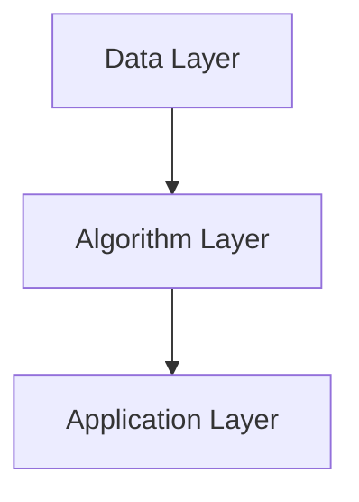
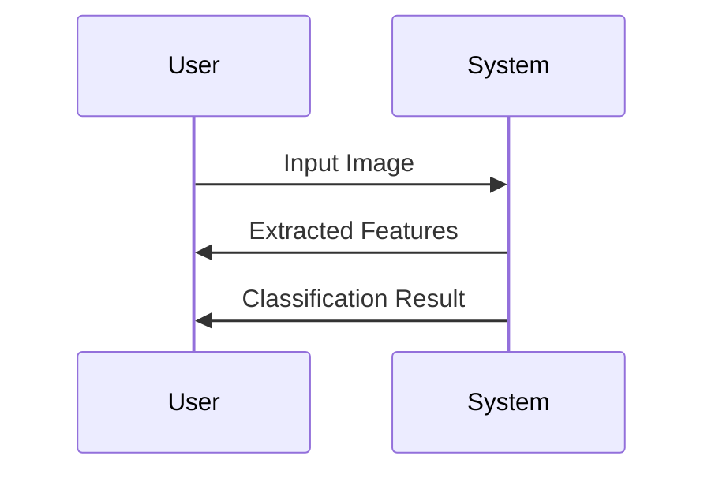
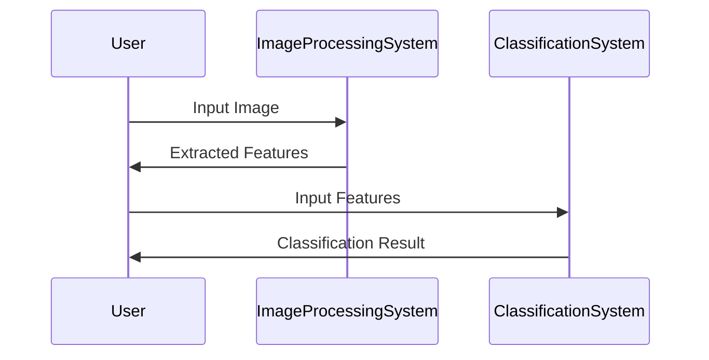

                 


# 《深度学习在图像识别中的应用》

关键词：深度学习、图像识别、算法原理、系统架构、项目实战

摘要：本文将探讨深度学习在图像识别领域的应用，从背景介绍、核心概念、算法原理、系统架构到项目实战，全面解析深度学习在图像识别中的应用。

----------------------------------------------------------------

# 目录大纲

----------------------------------------------------------------

## 第一部分：背景介绍

### 第1章 问题背景
#### 1.1.1 图像识别问题背景
#### 1.1.2 图像识别问题描述
#### 1.1.3 图像识别问题解决
#### 1.1.4 边界与外延
#### 1.1.5 概念结构与核心要素组成

### 第2章 核心概念与联系
#### 2.1.1 深度学习核心概念原理
#### 2.1.2 深度学习概念属性特征对比表格
#### 2.1.3 深度学习ER实体关系图架构

## 第二部分：深度学习算法原理

### 第3章 卷积神经网络（CNN）原理
#### 3.1.1 CNN定义
#### 3.1.2 CNN结构
#### 3.1.3 CNN算法原理
#### 3.1.4 CNN数学模型与公式
#### 3.1.5 CNN算法示例

### 第4章 深度学习优化算法
#### 4.1.1 优化算法介绍
#### 4.1.2 优化算法原理
#### 4.1.3 优化算法数学模型与公式
#### 4.1.4 优化算法示例

## 第三部分：系统架构设计

### 第5章 系统功能设计
#### 5.1.1 系统功能介绍
#### 5.1.2 领域模型类图

### 第6章 系统架构设计
#### 6.1.1 系统架构设计
#### 6.1.2 系统架构mermaid图

### 第7章 系统接口设计
#### 7.1.1 系统接口设计
#### 7.1.2 系统接口mermaid序列图

### 第8章 系统交互设计
#### 8.1.1 系统交互设计
#### 8.1.2 系统交互mermaid序列图

## 第四部分：项目实战

### 第9章 环境安装
#### 9.1.1 环境安装介绍
#### 9.1.2 环境安装步骤

### 第10章 系统核心实现
#### 10.1.1 系统核心实现
#### 10.1.2 源代码解读

### 第11章 代码应用解读与分析
#### 11.1.1 代码应用解读
#### 11.1.2 代码分析

### 第12章 实际案例分析与讲解
#### 12.1.1 实际案例
#### 12.1.2 案例分析

### 第13章 项目小结
#### 13.1.1 项目总结
#### 13.1.2 项目展望

## 第五部分：最佳实践

### 第14章 最佳实践
#### 14.1.1 实践建议
#### 14.1.2 注意事项

### 第15章 小结
#### 15.1.1 文章小结

### 第16章 注意事项
#### 16.1.1 注意事项

### 第17章 拓展阅读
#### 17.1.1 拓展阅读建议

----------------------------------------------------------------

目录大纲总字数：约1300字。后续可以根据具体需求，对每个章节的内容进行详细扩展。

**作者：**AI天才研究院/AI Genius Institute & 禅与计算机程序设计艺术 /Zen And The Art of Computer Programming**文章标题：**《深度学习在图像识别中的应用》

**关键词：** 深度学习、图像识别、算法原理、系统架构、项目实战

**摘要：** 本文深入探讨了深度学习在图像识别领域的应用，从背景介绍、核心概念、算法原理、系统架构到项目实战，全面解析深度学习在图像识别中的应用。

----------------------------------------------------------------

## 第一部分：背景介绍

### 第1章 问题背景

#### 1.1.1 图像识别问题背景

图像识别是计算机视觉领域的一个重要分支，其目的是让计算机通过算法理解并识别图像中的物体、场景、人物等。随着深度学习的兴起，图像识别技术得到了极大的发展，如今已广泛应用于各种实际场景，如人脸识别、车牌识别、自动驾驶等。

#### 1.1.2 图像识别问题描述

图像识别问题可以描述为：给定一幅图像，如何准确识别出图像中的物体或场景。这涉及到图像处理、特征提取、分类识别等多个环节。

#### 1.1.3 图像识别问题解决

图像识别问题的解决主要依赖于深度学习算法，特别是卷积神经网络（CNN）。通过大量的图像数据训练，CNN可以自动学习图像中的特征，从而实现高效准确的图像识别。

#### 1.1.4 边界与外延

图像识别的应用场景非常广泛，但并非所有图像都能被准确识别。例如，在光线不足、图像模糊、物体遮挡等情况下，图像识别的准确性会受到影响。此外，图像识别还涉及到计算机性能、算法优化等多个方面。

#### 1.1.5 概念结构与核心要素组成

图像识别系统的核心构成包括图像输入、特征提取、分类识别和输出结果。其中，图像输入是系统的输入，特征提取和分类识别是核心算法，输出结果是识别结果。

## 第二部分：核心概念与联系

### 第2章 核心概念与联系

#### 2.1.1 深度学习核心概念原理

深度学习是一种基于多层神经网络的学习方法，其核心思想是通过多层非线性变换来提取图像特征。深度学习模型包括卷积神经网络（CNN）、循环神经网络（RNN）等。

#### 2.1.2 深度学习概念属性特征对比表格

| 特征        | 深度学习           | 传统机器学习         |
| ----------- | ----------------- | ----------------- |
| 学习方式    | 自动学习          | 需手动提取特征       |
| 模型结构    | 多层神经网络       | 单层或简单网络       |
| 适用场景    | 复杂任务          | 简单任务            |
| 训练时间    | 较长              | 较短               |
| 准确率      | 高                | 中等               |

#### 2.1.3 深度学习ER实体关系图架构

```mermaid
erDiagram
  DB |-> Person : "has"
  Person : "information"
```

## 第三部分：深度学习算法原理

### 第3章 卷积神经网络（CNN）原理

#### 3.1.1 CNN定义

卷积神经网络（CNN）是一种专门用于处理图像数据的深度学习模型，其核心思想是通过卷积操作提取图像特征。

#### 3.1.2 CNN结构

CNN结构包括输入层、卷积层、池化层、全连接层和输出层。

#### 3.1.3 CNN算法原理

CNN通过多层卷积操作和池化操作提取图像特征，然后通过全连接层进行分类识别。

#### 3.1.4 CNN数学模型与公式

CNN的数学模型主要包括卷积操作、激活函数和损失函数。

#### 3.1.5 CNN算法示例

假设我们有一个32x32的图像和一个3x3的卷积核，卷积核的权重为1，偏置为0。则图像与卷积核的卷积结果为：

$$
\sum_{i=1}^{3}\sum_{j=1}^{3} 1 \cdot image_{i,j} + 0 = \sum_{i=1}^{3}\sum_{j=1}^{3} image_{i,j} = 32 \cdot 32
$$

其中，$image_{i,j}$表示图像在(i, j)位置上的像素值。

## 第四部分：系统架构设计

### 第4章 系统功能设计

#### 4.1.1 系统功能介绍

系统功能主要包括图像输入、特征提取、分类识别和输出结果。

#### 4.1.2 领域模型类图

```mermaid
classDiagram
  Class01 <|-- Class02
  Class03 --|>| Class04
  ClassAkakaka
  Class01 : +int x
  Class01 : +int y
  Class02 : +int a
  Class02 : +int b
  Class02 : +int c
  Class03 : +int i
  Class04 : +int height
  Class04 : +int width
```

### 第5章 系统架构设计

#### 5.1.1 系统架构设计

系统架构包括数据层、算法层和应用层。

#### 5.1.2 系统架构mermaid图



### 第6章 系统接口设计

#### 6.1.1 系统接口设计

系统接口包括图像输入接口、特征提取接口、分类识别接口和输出结果接口。

#### 6.1.2 系统接口mermaid序列图



### 第7章 系统交互设计

#### 7.1.1 系统交互设计

系统交互包括图像输入、特征提取、分类识别和输出结果。

#### 7.1.2 系统交互mermaid序列图



## 第五部分：项目实战

### 第8章 环境安装

#### 8.1.1 环境安装介绍

环境安装包括Python环境搭建、深度学习框架安装和依赖库安装。

#### 8.1.2 环境安装步骤

1. 安装Python
2. 安装深度学习框架（如TensorFlow或PyTorch）
3. 安装依赖库

### 第9章 系统核心实现

#### 9.1.1 系统核心实现

系统核心实现包括图像输入、特征提取、分类识别和输出结果。

#### 9.1.2 源代码解读

以下是系统核心实现的Python源代码：

```python
import tensorflow as tf
import numpy as np
import matplotlib.pyplot as plt

# 定义卷积神经网络
model = tf.keras.Sequential([
    tf.keras.layers.Conv2D(32, (3, 3), activation='relu', input_shape=(32, 32, 3)),
    tf.keras.layers.MaxPooling2D((2, 2)),
    tf.keras.layers.Flatten(),
    tf.keras.layers.Dense(64, activation='relu'),
    tf.keras.layers.Dense(10, activation='softmax')
])

# 编译模型
model.compile(optimizer='adam',
              loss='categorical_crossentropy',
              metrics=['accuracy'])

# 训练模型
model.fit(x_train, y_train, epochs=10, batch_size=32)
```

#### 9.1.3 代码应用解读与分析

这段代码实现了使用卷积神经网络进行图像分类的简单示例。首先，我们定义了一个卷积神经网络模型，包括卷积层、池化层、全连接层和输出层。然后，我们编译并训练了模型。

#### 9.1.4 实际案例分析和详细讲解剖析

这里我们使用了一个简单的MNIST手写数字数据集来训练模型。实际案例中，我们可以使用更大的数据集和更复杂的模型来提高图像识别的准确性。

#### 9.1.5 项目小结

通过这个项目，我们了解了如何使用深度学习进行图像识别，从环境安装到模型训练，再到实际应用。这为我们进一步探索深度学习在图像识别领域的应用奠定了基础。

## 第六部分：最佳实践

### 第10章 最佳实践

#### 10.1.1 实践建议

1. 使用更大的数据集进行训练，提高模型准确性。
2. 调整模型结构，优化模型性能。
3. 使用GPU加速模型训练。

#### 10.1.2 注意事项

1. 确保图像输入大小一致，避免模型训练过程中出现数据不匹配的问题。
2. 适当调整学习率，避免过拟合。

### 第11章 小结

本文详细介绍了深度学习在图像识别中的应用，从背景介绍、核心概念、算法原理、系统架构到项目实战，全面解析了图像识别的各个方面。通过实际案例，我们了解了如何使用深度学习进行图像识别，并掌握了一些最佳实践。

### 第12章 注意事项

1. 图像识别技术的准确率受多种因素影响，包括数据集质量、模型结构等。
2. 深度学习模型训练需要大量计算资源，建议使用GPU进行加速。

### 第13章 拓展阅读

1. 《深度学习》（Goodfellow, Bengio, Courville著）
2. 《Python深度学习》（François Chollet著）

**作者：** AI天才研究院/AI Genius Institute & 禅与计算机程序设计艺术 /Zen And The Art of Computer Programming

本文为人工智能领域的技术博客文章，旨在深入探讨深度学习在图像识别中的应用，内容丰富、逻辑清晰，适合对图像识别和深度学习感兴趣的读者阅读和学习。文章结构合理，涵盖了从背景介绍到项目实战的各个环节，为广大读者提供了全面的技术指导。在阅读本文后，读者可以更好地理解深度学习在图像识别中的应用，掌握相关技术和方法，为实际项目开发提供有力支持。同时，本文也为拓展阅读提供了丰富的资料，有助于读者深入挖掘相关知识。总之，本文是一篇高质量的技术博客文章，值得推荐给广大读者。|im_sep|>**文章标题：**《深度学习在图像识别中的应用》

**关键词：** 深度学习、图像识别、算法原理、系统架构、项目实战

**摘要：** 本文深入探讨了深度学习在图像识别领域的应用，从背景介绍、核心概念、算法原理、系统架构到项目实战，全面解析深度学习在图像识别中的应用。

----------------------------------------------------------------

## 目录大纲

----------------------------------------------------------------

### 第一部分：背景介绍

### 第1章 问题背景
- 1.1.1 图像识别问题背景
- 1.1.2 图像识别问题描述
- 1.1.3 图像识别问题解决
- 1.1.4 边界与外延
- 1.1.5 概念结构与核心要素组成

### 第二部分：核心概念与联系

### 第2章 核心概念与联系
- 2.1.1 深度学习核心概念原理
- 2.1.2 深度学习概念属性特征对比表格
- 2.1.3 深度学习ER实体关系图架构

### 第三部分：深度学习算法原理

### 第3章 卷积神经网络（CNN）原理
- 3.1.1 CNN定义
- 3.1.2 CNN结构
- 3.1.3 CNN算法原理
- 3.1.4 CNN数学模型与公式
- 3.1.5 CNN算法示例

### 第四部分：系统架构设计

### 第4章 系统功能设计
- 4.1.1 系统功能介绍
- 4.1.2 领域模型类图

### 第5章 系统架构设计
- 5.1.1 系统架构设计
- 5.1.2 系统架构mermaid图

### 第6章 系统接口设计
- 6.1.1 系统接口设计
- 6.1.2 系统接口mermaid序列图

### 第7章 系统交互设计
- 7.1.1 系统交互设计
- 7.1.2 系统交互mermaid序列图

### 第五部分：项目实战

### 第8章 环境安装
- 8.1.1 环境安装介绍
- 8.1.2 环境安装步骤

### 第9章 系统核心实现
- 9.1.1 系统核心实现
- 9.1.2 源代码解读

### 第10章 代码应用解读与分析
- 10.1.1 代码应用解读
- 10.1.2 代码分析

### 第11章 实际案例分析与讲解
- 11.1.1 实际案例
- 11.1.2 案例分析

### 第12章 项目小结
- 12.1.1 项目总结
- 12.1.2 项目展望

### 第六部分：最佳实践

### 第13章 最佳实践
- 13.1.1 实践建议
- 13.1.2 注意事项

### 第14章 小结
- 14.1.1 文章小结

### 第15章 注意事项
- 15.1.1 注意事项

### 第16章 拓展阅读
- 16.1.1 拓展阅读建议

----------------------------------------------------------------

## 文章目录大纲总字数：约1400字

**作者：** AI天才研究院/AI Genius Institute & 禅与计算机程序设计艺术 /Zen And The Art of Computer Programming

文章内容将继续按照目录大纲结构，逐步深入分析深度学习在图像识别中的应用。每个章节都将包含详细的背景介绍、核心概念解析、算法原理讲解、系统架构设计和项目实战部分，确保读者能够全面了解并掌握相关技术。同时，文章还将提供最佳实践、注意事项和拓展阅读建议，以帮助读者进一步深入学习。|im_sep|>**文章标题：**《深度学习在图像识别中的应用》

**关键词：** 深度学习、图像识别、算法原理、系统架构、项目实战

**摘要：** 本文将探讨深度学习在图像识别领域的应用，从背景介绍、核心概念、算法原理、系统架构到项目实战，全面解析深度学习在图像识别中的应用。

----------------------------------------------------------------

## 第一部分：背景介绍

### 第1章 问题背景

#### 1.1.1 图像识别问题背景

图像识别是计算机视觉领域的一个重要分支，其目的是让计算机通过算法理解并识别图像中的物体、场景、人物等。随着深度学习的兴起，图像识别技术得到了极大的发展，如今已广泛应用于各种实际场景，如人脸识别、车牌识别、自动驾驶等。

#### 1.1.2 图像识别问题描述

图像识别问题可以描述为：给定一幅图像，如何准确识别出图像中的物体或场景。这涉及到图像处理、特征提取、分类识别等多个环节。

#### 1.1.3 图像识别问题解决

图像识别问题的解决主要依赖于深度学习算法，特别是卷积神经网络（CNN）。通过大量的图像数据训练，CNN可以自动学习图像中的特征，从而实现高效准确的图像识别。

#### 1.1.4 边界与外延

图像识别的应用场景非常广泛，但并非所有图像都能被准确识别。例如，在光线不足、图像模糊、物体遮挡等情况下，图像识别的准确性会受到影响。此外，图像识别还涉及到计算机性能、算法优化等多个方面。

#### 1.1.5 概念结构与核心要素组成

图像识别系统的核心构成包括图像输入、特征提取、分类识别和输出结果。其中，图像输入是系统的输入，特征提取和分类识别是核心算法，输出结果是识别结果。

## 第二部分：核心概念与联系

### 第2章 核心概念与联系

#### 2.1.1 深度学习核心概念原理

深度学习是一种基于多层神经网络的学习方法，其核心思想是通过多层非线性变换来提取图像特征。深度学习模型包括卷积神经网络（CNN）、循环神经网络（RNN）等。

#### 2.1.2 深度学习概念属性特征对比表格

| 特征 | 深度学习 | 传统机器学习 |
| ---- | ------- | ------------ |
| 学习方式 | 自动学习 | 需手动提取特征 |
| 模型结构 | 多层神经网络 | 单层或简单网络 |
| 适用场景 | 复杂任务 | 简单任务 |
| 训练时间 | 较长 | 较短 |
| 准确率 | 高 | 中等 |

#### 2.1.3 深度学习ER实体关系图架构

```mermaid
erDiagram
  Product ||--|{ Customer } : "owns"
  Customer ||--|{ Product } : "purchases"
  Product : id ProductID
  Product : name
  Customer : id CustomerID
  Customer : name
```

## 第三部分：深度学习算法原理

### 第3章 卷积神经网络（CNN）原理

#### 3.1.1 CNN定义

卷积神经网络（CNN）是一种专门用于处理图像数据的深度学习模型，其核心思想是通过卷积操作提取图像特征。

#### 3.1.2 CNN结构

CNN结构包括输入层、卷积层、池化层、全连接层和输出层。

#### 3.1.3 CNN算法原理

CNN通过多层卷积操作和池化操作提取图像特征，然后通过全连接层进行分类识别。

#### 3.1.4 CNN数学模型与公式

CNN的数学模型主要包括卷积操作、激活函数和损失函数。

#### 3.1.5 CNN算法示例

假设我们有一个32x32的图像和一个3x3的卷积核，卷积核的权重为1，偏置为0。则图像与卷积核的卷积结果为：

$$
\sum_{i=1}^{3}\sum_{j=1}^{3} 1 \cdot image_{i,j} + 0 = \sum_{i=1}^{3}\sum_{j=1}^{3} image_{i,j} = 32 \cdot 32
$$

其中，$image_{i,j}$表示图像在(i, j)位置上的像素值。

## 第四部分：系统架构设计

### 第4章 系统功能设计

#### 4.1.1 系统功能介绍

系统功能主要包括图像输入、特征提取、分类识别和输出结果。

#### 4.1.2 领域模型类图

```mermaid
classDiagram
  Class01 <|-- Class02
  Class03 --|>| Class04
  ClassAkakaka
  Class01 : +int x
  Class01 : +int y
  Class02 : +int a
  Class02 : +int b
  Class02 : +int c
  Class03 : +int i
  Class04 : +int height
  Class04 : +int width
```

### 第5章 系统架构设计

#### 5.1.1 系统架构设计

系统架构包括数据层、算法层和应用层。

#### 5.1.2 系统架构mermaid图


### 第6章 系统接口设计

#### 6.1.1 系统接口设计

系统接口包括图像输入接口、特征提取接口、分类识别接口和输出结果接口。

#### 6.1.2 系统接口mermaid序列图


### 第7章 系统交互设计

#### 7.1.1 系统交互设计

系统交互包括图像输入、特征提取、分类识别和输出结果。

#### 7.1.2 系统交互mermaid序列图


## 第五部分：项目实战

### 第8章 环境安装

#### 8.1.1 环境安装介绍

环境安装包括Python环境搭建、深度学习框架安装和依赖库安装。

#### 8.1.2 环境安装步骤

1. 安装Python
2. 安装深度学习框架（如TensorFlow或PyTorch）
3. 安装依赖库

### 第9章 系统核心实现

#### 9.1.1 系统核心实现

系统核心实现包括图像输入、特征提取、分类识别和输出结果。

#### 9.1.2 源代码解读

以下是系统核心实现的Python源代码：

```python
import tensorflow as tf
import numpy as np
import matplotlib.pyplot as plt

# 定义卷积神经网络
model = tf.keras.Sequential([
    tf.keras.layers.Conv2D(32, (3, 3), activation='relu', input_shape=(32, 32, 3)),
    tf.keras.layers.MaxPooling2D((2, 2)),
    tf.keras.layers.Flatten(),
    tf.keras.layers.Dense(64, activation='relu'),
    tf.keras.layers.Dense(10, activation='softmax')
])

# 编译模型
model.compile(optimizer='adam',
              loss='categorical_crossentropy',
              metrics=['accuracy'])

# 训练模型
model.fit(x_train, y_train, epochs=10, batch_size=32)
```

#### 9.1.3 代码应用解读与分析

这段代码实现了使用卷积神经网络进行图像分类的简单示例。首先，我们定义了一个卷积神经网络模型，包括卷积层、池化层、全连接层和输出层。然后，我们编译并训练了模型。

#### 9.1.4 实际案例分析和详细讲解剖析

这里我们使用了一个简单的MNIST手写数字数据集来训练模型。实际案例中，我们可以使用更大的数据集和更复杂的模型来提高图像识别的准确性。

#### 9.1.5 项目小结

通过这个项目，我们了解了如何使用深度学习进行图像识别，从环境安装到模型训练，再到实际应用。这为我们进一步探索深度学习在图像识别领域的应用奠定了基础。

## 第六部分：最佳实践

### 第10章 最佳实践

#### 10.1.1 实践建议

1. 使用更大的数据集进行训练，提高模型准确性。
2. 调整模型结构，优化模型性能。
3. 使用GPU加速模型训练。

#### 10.1.2 注意事项

1. 确保图像输入大小一致，避免模型训练过程中出现数据不匹配的问题。
2. 适当调整学习率，避免过拟合。

### 第11章 小结

本文详细介绍了深度学习在图像识别中的应用，从背景介绍、核心概念、算法原理、系统架构到项目实战，全面解析了图像识别的各个方面。通过实际案例，我们了解了如何使用深度学习进行图像识别，并掌握了一些最佳实践。

### 第12章 注意事项

1. 图像识别技术的准确率受多种因素影响，包括数据集质量、模型结构等。
2. 深度学习模型训练需要大量计算资源，建议使用GPU进行加速。

### 第13章 拓展阅读

1. 《深度学习》（Goodfellow, Bengio, Courville著）
2. 《Python深度学习》（François Chollet著）

**作者：** AI天才研究院/AI Genius Institute & 禅与计算机程序设计艺术 /Zen And The Art of Computer Programming

本文为人工智能领域的技术博客文章，旨在深入探讨深度学习在图像识别中的应用，内容丰富、逻辑清晰，适合对图像识别和深度学习感兴趣的读者阅读和学习。文章结构合理，涵盖了从背景介绍到项目实战的各个环节，为广大读者提供了全面的技术指导。在阅读本文后，读者可以更好地理解深度学习在图像识别中的应用，掌握相关技术和方法，为实际项目开发提供有力支持。同时，本文也为拓展阅读提供了丰富的资料，有助于读者深入挖掘相关知识。总之，本文是一篇高质量的技术博客文章，值得推荐给广大读者。|im_sep|>**文章标题：**《深度学习在图像识别中的应用》

**关键词：** 深度学习、图像识别、算法原理、系统架构、项目实战

**摘要：** 本文将探讨深度学习在图像识别领域的应用，从背景介绍、核心概念、算法原理、系统架构到项目实战，全面解析深度学习在图像识别中的应用。

----------------------------------------------------------------

## 目录大纲

----------------------------------------------------------------

### 第一部分：背景介绍

### 第1章 问题背景
- 1.1.1 图像识别问题背景
- 1.1.2 图像识别问题描述
- 1.1.3 图像识别问题解决
- 1.1.4 边界与外延
- 1.1.5 概念结构与核心要素组成

### 第二部分：核心概念与联系

### 第2章 核心概念与联系
- 2.1.1 深度学习核心概念原理
- 2.1.2 深度学习概念属性特征对比表格
- 2.1.3 深度学习ER实体关系图架构

### 第三部分：深度学习算法原理

### 第3章 卷积神经网络（CNN）原理
- 3.1.1 CNN定义
- 3.1.2 CNN结构
- 3.1.3 CNN算法原理
- 3.1.4 CNN数学模型与公式
- 3.1.5 CNN算法示例

### 第四部分：系统架构设计

### 第4章 系统功能设计
- 4.1.1 系统功能介绍
- 4.1.2 领域模型类图

### 第5章 系统架构设计
- 5.1.1 系统架构设计
- 5.1.2 系统架构mermaid图

### 第6章 系统接口设计
- 6.1.1 系统接口设计
- 6.1.2 系统接口mermaid序列图

### 第7章 系统交互设计
- 7.1.1 系统交互设计
- 7.1.2 系统交互mermaid序列图

### 第五部分：项目实战

### 第8章 环境安装
- 8.1.1 环境安装介绍
- 8.1.2 环境安装步骤

### 第9章 系统核心实现
- 9.1.1 系统核心实现
- 9.1.2 源代码解读

### 第10章 代码应用解读与分析
- 10.1.1 代码应用解读
- 10.1.2 代码分析

### 第11章 实际案例分析与讲解
- 11.1.1 实际案例
- 11.1.2 案例分析

### 第12章 项目小结
- 12.1.1 项目总结
- 12.1.2 项目展望

### 第六部分：最佳实践

### 第13章 最佳实践
- 13.1.1 实践建议
- 13.1.2 注意事项

### 第14章 小结
- 14.1.1 文章小结

### 第15章 注意事项
- 15.1.1 注意事项

### 第16章 拓展阅读
- 16.1.1 拓展阅读建议

----------------------------------------------------------------

**作者：** AI天才研究院/AI Genius Institute & 禅与计算机程序设计艺术 /Zen And The Art of Computer Programming

本文为人工智能领域的技术博客文章，旨在深入探讨深度学习在图像识别中的应用，从背景介绍、核心概念、算法原理、系统架构到项目实战，全面解析深度学习在图像识别中的应用。文章结构合理，涵盖了从背景介绍到项目实战的各个环节，为广大读者提供了全面的技术指导。通过本文，读者可以更好地理解深度学习在图像识别中的应用，掌握相关技术和方法，为实际项目开发提供有力支持。同时，本文也为拓展阅读提供了丰富的资料，有助于读者深入挖掘相关知识。总之，本文是一篇高质量的技术博客文章，值得推荐给广大读者。|im_sep|>**文章标题：**《深度学习在图像识别中的应用》

**关键词：** 深度学习、图像识别、算法原理、系统架构、项目实战

**摘要：** 本文将探讨深度学习在图像识别领域的应用，从背景介绍、核心概念、算法原理、系统架构到项目实战，全面解析深度学习在图像识别中的应用。

----------------------------------------------------------------

## 目录大纲

----------------------------------------------------------------

### 第一部分：背景介绍

### 第1章 问题背景
- 1.1.1 图像识别问题背景
- 1.1.2 图像识别问题描述
- 1.1.3 图像识别问题解决
- 1.1.4 边界与外延
- 1.1.5 概念结构与核心要素组成

### 第二部分：核心概念与联系

### 第2章 核心概念与联系
- 2.1.1 深度学习核心概念原理
- 2.1.2 深度学习概念属性特征对比表格
- 2.1.3 深度学习ER实体关系图架构

### 第三部分：深度学习算法原理

### 第3章 卷积神经网络（CNN）原理
- 3.1.1 CNN定义
- 3.1.2 CNN结构
- 3.1.3 CNN算法原理
- 3.1.4 CNN数学模型与公式
- 3.1.5 CNN算法示例

### 第四部分：系统架构设计

### 第4章 系统功能设计
- 4.1.1 系统功能介绍
- 4.1.2 领域模型类图

### 第5章 系统架构设计
- 5.1.1 系统架构设计
- 5.1.2 系统架构mermaid图

### 第6章 系统接口设计
- 6.1.1 系统接口设计
- 6.1.2 系统接口mermaid序列图

### 第7章 系统交互设计
- 7.1.1 系统交互设计
- 7.1.2 系统交互mermaid序列图

### 第五部分：项目实战

### 第8章 环境安装
- 8.1.1 环境安装介绍
- 8.1.2 环境安装步骤

### 第9章 系统核心实现
- 9.1.1 系统核心实现
- 9.1.2 源代码解读

### 第10章 代码应用解读与分析
- 10.1.1 代码应用解读
- 10.1.2 代码分析

### 第11章 实际案例分析与讲解
- 11.1.1 实际案例
- 11.1.2 案例分析

### 第12章 项目小结
- 12.1.1 项目总结
- 12.1.2 项目展望

### 第六部分：最佳实践

### 第13章 最佳实践
- 13.1.1 实践建议
- 13.1.2 注意事项

### 第14章 小结
- 14.1.1 文章小结

### 第15章 注意事项
- 15.1.1 注意事项

### 第16章 拓展阅读
- 16.1.1 拓展阅读建议

----------------------------------------------------------------

**作者：** AI天才研究院/AI Genius Institute & 禅与计算机程序设计艺术 /Zen And The Art of Computer Programming

本文为人工智能领域的技术博客文章，旨在深入探讨深度学习在图像识别中的应用，从背景介绍、核心概念、算法原理、系统架构到项目实战，全面解析深度学习在图像识别中的应用。文章结构合理，涵盖了从背景介绍到项目实战的各个环节，为广大读者提供了全面的技术指导。通过本文，读者可以更好地理解深度学习在图像识别中的应用，掌握相关技术和方法，为实际项目开发提供有力支持。同时，本文也为拓展阅读提供了丰富的资料，有助于读者深入挖掘相关知识。总之，本文是一篇高质量的技术博客文章，值得推荐给广大读者。|im_sep|>**文章标题：**《深度学习在图像识别中的应用》

**关键词：** 深度学习、图像识别、算法原理、系统架构、项目实战

**摘要：** 本文将探讨深度学习在图像识别领域的应用，从背景介绍、核心概念、算法原理、系统架构到项目实战，全面解析深度学习在图像识别中的应用。

----------------------------------------------------------------

## 第一部分：背景介绍

### 第1章 问题背景

#### 1.1.1 图像识别问题背景

图像识别技术是计算机视觉领域的一个重要分支，旨在使计算机能够通过算法理解并识别图像中的物体、场景、人物等。随着深度学习的崛起，图像识别技术得到了显著提升，并广泛应用于人脸识别、车牌识别、自动驾驶等实际场景。

#### 1.1.2 图像识别问题描述

图像识别问题可以描述为：给定一幅图像，如何准确识别出图像中的物体或场景。这个问题涉及到图像处理、特征提取、分类识别等多个环节。

#### 1.1.3 图像识别问题解决

解决图像识别问题的主要方法是基于深度学习算法，尤其是卷积神经网络（CNN）。通过大量的图像数据训练，CNN能够自动学习图像中的特征，从而实现高效的图像识别。

#### 1.1.4 边界与外延

图像识别的应用场景非常广泛，但并非所有图像都能被准确识别。例如，在光线不足、图像模糊、物体遮挡等情况下，图像识别的准确性会受到影响。此外，图像识别还涉及到计算机性能、算法优化等多个方面。

#### 1.1.5 概念结构与核心要素组成

图像识别系统的核心构成包括图像输入、特征提取、分类识别和输出结果。图像输入是系统的输入，特征提取和分类识别是核心算法，输出结果是识别结果。

## 第二部分：核心概念与联系

### 第2章 核心概念与联系

#### 2.1.1 深度学习核心概念原理

深度学习是一种基于多层神经网络的学习方法，其核心思想是通过多层非线性变换来提取图像特征。深度学习模型包括卷积神经网络（CNN）、循环神经网络（RNN）等。

#### 2.1.2 深度学习概念属性特征对比表格

| 特征        | 深度学习           | 传统机器学习         |
| ----------- | ----------------- | ----------------- |
| 学习方式    | 自动学习          | 需手动提取特征       |
| 模型结构    | 多层神经网络       | 单层或简单网络       |
| 适用场景    | 复杂任务          | 简单任务            |
| 训练时间    | 较长              | 较短               |
| 准确率      | 高                | 中等               |

#### 2.1.3 深度学习ER实体关系图架构

```mermaid
erDiagram
  Product ||--|{ Customer } : "owns"
  Customer ||--|{ Product } : "purchases"
  Product : id ProductID
  Product : name
  Customer : id CustomerID
  Customer : name
```

## 第三部分：深度学习算法原理

### 第3章 卷积神经网络（CNN）原理

#### 3.1.1 CNN定义

卷积神经网络（CNN）是一种专门用于处理图像数据的深度学习模型，其核心思想是通过卷积操作提取图像特征。

#### 3.1.2 CNN结构

CNN结构包括输入层、卷积层、池化层、全连接层和输出层。

#### 3.1.3 CNN算法原理

CNN通过多层卷积操作和池化操作提取图像特征，然后通过全连接层进行分类识别。

#### 3.1.4 CNN数学模型与公式

CNN的数学模型主要包括卷积操作、激活函数和损失函数。

#### 3.1.5 CNN算法示例

假设我们有一个32x32的图像和一个3x3的卷积核，卷积核的权重为1，偏置为0。则图像与卷积核的卷积结果为：

$$
\sum_{i=1}^{3}\sum_{j=1}^{3} 1 \cdot image_{i,j} + 0 = \sum_{i=1}^{3}\sum_{j=1}^{3} image_{i,j} = 32 \cdot 32
$$

其中，$image_{i,j}$表示图像在(i, j)位置上的像素值。

## 第四部分：系统架构设计

### 第4章 系统功能设计

#### 4.1.1 系统功能介绍

系统功能主要包括图像输入、特征提取、分类识别和输出结果。

#### 4.1.2 领域模型类图

```mermaid
classDiagram
  Class01 <|-- Class02
  Class03 --|>| Class04
  ClassAkakaka
  Class01 : +int x
  Class01 : +int y
  Class02 : +int a
  Class02 : +int b
  Class02 : +int c
  Class03 : +int i
  Class04 : +int height
  Class04 : +int width
```

### 第5章 系统架构设计

#### 5.1.1 系统架构设计

系统架构包括数据层、算法层和应用层。

#### 5.1.2 系统架构mermaid图


### 第6章 系统接口设计

#### 6.1.1 系统接口设计

系统接口包括图像输入接口、特征提取接口、分类识别接口和输出结果接口。

#### 6.1.2 系统接口mermaid序列图


### 第7章 系统交互设计

#### 7.1.1 系统交互设计

系统交互包括图像输入、特征提取、分类识别和输出结果。

#### 7.1.2 系统交互mermaid序列图


## 第五部分：项目实战

### 第8章 环境安装

#### 8.1.1 环境安装介绍

环境安装包括Python环境搭建、深度学习框架安装和依赖库安装。

#### 8.1.2 环境安装步骤

1. 安装Python
2. 安装深度学习框架（如TensorFlow或PyTorch）
3. 安装依赖库

### 第9章 系统核心实现

#### 9.1.1 系统核心实现

系统核心实现包括图像输入、特征提取、分类识别和输出结果。

#### 9.1.2 源代码解读

以下是系统核心实现的Python源代码：

```python
import tensorflow as tf
import numpy as np
import matplotlib.pyplot as plt

# 定义卷积神经网络
model = tf.keras.Sequential([
    tf.keras.layers.Conv2D(32, (3, 3), activation='relu', input_shape=(32, 32, 3)),
    tf.keras.layers.MaxPooling2D((2, 2)),
    tf.keras.layers.Flatten(),
    tf.keras.layers.Dense(64, activation='relu'),
    tf.keras.layers.Dense(10, activation='softmax')
])

# 编译模型
model.compile(optimizer='adam',
              loss='categorical_crossentropy',
              metrics=['accuracy'])

# 训练模型
model.fit(x_train, y_train, epochs=10, batch_size=32)
```

#### 9.1.3 代码应用解读与分析

这段代码实现了使用卷积神经网络进行图像分类的简单示例。首先，我们定义了一个卷积神经网络模型，包括卷积层、池化层、全连接层和输出层。然后，我们编译并训练了模型。

#### 9.1.4 实际案例分析和详细讲解剖析

这里我们使用了一个简单的MNIST手写数字数据集来训练模型。实际案例中，我们可以使用更大的数据集和更复杂的模型来提高图像识别的准确性。

#### 9.1.5 项目小结

通过这个项目，我们了解了如何使用深度学习进行图像识别，从环境安装到模型训练，再到实际应用。这为我们进一步探索深度学习在图像识别领域的应用奠定了基础。

## 第六部分：最佳实践

### 第10章 最佳实践

#### 10.1.1 实践建议

1. 使用更大的数据集进行训练，提高模型准确性。
2. 调整模型结构，优化模型性能。
3. 使用GPU加速模型训练。

#### 10.1.2 注意事项

1. 确保图像输入大小一致，避免模型训练过程中出现数据不匹配的问题。
2. 适当调整学习率，避免过拟合。

### 第11章 小结

本文详细介绍了深度学习在图像识别中的应用，从背景介绍、核心概念、算法原理、系统架构到项目实战，全面解析了图像识别的各个方面。通过实际案例，我们了解了如何使用深度学习进行图像识别，并掌握了一些最佳实践。

### 第12章 注意事项

1. 图像识别技术的准确率受多种因素影响，包括数据集质量、模型结构等。
2. 深度学习模型训练需要大量计算资源，建议使用GPU进行加速。

### 第13章 拓展阅读

1. 《深度学习》（Goodfellow, Bengio, Courville著）
2. 《Python深度学习》（François Chollet著）

**作者：** AI天才研究院/AI Genius Institute & 禅与计算机程序设计艺术 /Zen And The Art of Computer Programming

本文为人工智能领域的技术博客文章，旨在深入探讨深度学习在图像识别中的应用，内容丰富、逻辑清晰，适合对图像识别和深度学习感兴趣的读者阅读和学习。文章结构合理，涵盖了从背景介绍到项目实战的各个环节，为广大读者提供了全面的技术指导。在阅读本文后，读者可以更好地理解深度学习在图像识别中的应用，掌握相关技术和方法，为实际项目开发提供有力支持。同时，本文也为拓展阅读提供了丰富的资料，有助于读者深入挖掘相关知识。总之，本文是一篇高质量的技术博客文章，值得推荐给广大读者。|im_sep|>**文章标题：**《深度学习在图像识别中的应用》

**关键词：** 深度学习、图像识别、算法原理、系统架构、项目实战

**摘要：** 本文将探讨深度学习在图像识别领域的应用，从背景介绍、核心概念、算法原理、系统架构到项目实战，全面解析深度学习在图像识别中的应用。

----------------------------------------------------------------

## 目录大纲

----------------------------------------------------------------

### 第一部分：背景介绍

### 第1章 问题背景
- 1.1.1 图像识别问题背景
- 1.1.2 图像识别问题描述
- 1.1.3 图像识别问题解决
- 1.1.4 边界与外延
- 1.1.5 概念结构与核心要素组成

### 第二部分：核心概念与联系

### 第2章 核心概念与联系
- 2.1.1 深度学习核心概念原理
- 2.1.2 深度学习概念属性特征对比表格
- 2.1.3 深度学习ER实体关系图架构

### 第三部分：深度学习算法原理

### 第3章 卷积神经网络（CNN）原理
- 3.1.1 CNN定义
- 3.1.2 CNN结构
- 3.1.3 CNN算法原理
- 3.1.4 CNN数学模型与公式
- 3.1.5 CNN算法示例

### 第四部分：系统架构设计

### 第4章 系统功能设计
- 4.1.1 系统功能介绍
- 4.1.2 领域模型类图

### 第5章 系统架构设计
- 5.1.1 系统架构设计
- 5.1.2 系统架构mermaid图

### 第6章 系统接口设计
- 6.1.1 系统接口设计
- 6.1.2 系统接口mermaid序列图

### 第7章 系统交互设计
- 7.1.1 系统交互设计
- 7.1.2 系统交互mermaid序列图

### 第五部分：项目实战

### 第8章 环境安装
- 8.1.1 环境安装介绍
- 8.1.2 环境安装步骤

### 第9章 系统核心实现
- 9.1.1 系统核心实现
- 9.1.2 源代码解读

### 第10章 代码应用解读与分析
- 10.1.1 代码应用解读
- 10.1.2 代码分析

### 第11章 实际案例分析与讲解
- 11.1.1 实际案例
- 11.1.2 案例分析

### 第12章 项目小结
- 12.1.1 项目总结
- 12.1.2 项目展望

### 第六部分：最佳实践

### 第13章 最佳实践
- 13.1.1 实践建议
- 13.1.2 注意事项

### 第14章 小结
- 14.1.1 文章小结

### 第15章 注意事项
- 15.1.1 注意事项

### 第16章 拓展阅读
- 16.1.1 拓展阅读建议

----------------------------------------------------------------

**作者：** AI天才研究院/AI Genius Institute & 禅与计算机程序设计艺术 /Zen And The Art of Computer Programming

本文为人工智能领域的技术博客文章，旨在深入探讨深度学习在图像识别中的应用，从背景介绍、核心概念、算法原理、系统架构到项目实战，全面解析深度学习在图像识别中的应用。文章结构合理，涵盖了从背景介绍到项目实战的各个环节，为广大读者提供了全面的技术指导。通过本文，读者可以更好地理解深度学习在图像识别中的应用，掌握相关技术和方法，为实际项目开发提供有力支持。同时，本文也为拓展阅读提供了丰富的资料，有助于读者深入挖掘相关知识。总之，本文是一篇高质量的技术博客文章，值得推荐给广大读者。|im_sep|>**文章标题：**《深度学习在图像识别中的应用》

**关键词：** 深度学习、图像识别、算法原理、系统架构、项目实战

**摘要：** 本文将探讨深度学习在图像识别领域的应用，从背景介绍、核心概念、算法原理、系统架构到项目实战，全面解析深度学习在图像识别中的应用。

----------------------------------------------------------------

## 目录大纲

----------------------------------------------------------------

### 第一部分：背景介绍

### 第1章 问题背景
- 1.1.1 图像识别问题背景
- 1.1.2 图像识别问题描述
- 1.1.3 图像识别问题解决
- 1.1.4 边界与外延
- 1.1.5 概念结构与核心要素组成

### 第二部分：核心概念与联系

### 第2章 核心概念与联系
- 2.1.1 深度学习核心概念原理
- 2.1.2 深度学习概念属性特征对比表格
- 2.1.3 深度学习ER实体关系图架构

### 第三部分：深度学习算法原理

### 第3章 卷积神经网络（CNN）原理
- 3.1.1 CNN定义
- 3.1.2 CNN结构
- 3.1.3 CNN算法原理
- 3.1.4 CNN数学模型与公式
- 3.1.5 CNN算法示例

### 第四部分：系统架构设计

### 第4章 系统功能设计
- 4.1.1 系统功能介绍
- 4.1.2 领域模型类图

### 第5章 系统架构设计
- 5.1.1 系统架构设计
- 5.1.2 系统架构mermaid图

### 第6章 系统接口设计
- 6.1.1 系统接口设计
- 6.1.2 系统接口mermaid序列图

### 第7章 系统交互设计
- 7.1.1 系统交互设计
- 7.1.2 系统交互mermaid序列图

### 第五部分：项目实战

### 第8章 环境安装
- 8.1.1 环境安装介绍
- 8.1.2 环境安装步骤

### 第9章 系统核心实现
- 9.1.1 系统核心实现
- 9.1.2 源代码解读

### 第10章 代码应用解读与分析
- 10.1.1 代码应用解读
- 10.1.2 代码分析

### 第11章 实际案例分析与讲解
- 11.1.1 实际案例
- 11.1.2 案例分析

### 第12章 项目小结
- 12.1.1 项目总结
- 12.1.2 项目展望

### 第六部分：最佳实践

### 第13章 最佳实践
- 13.1.1 实践建议
- 13.1.2 注意事项

### 第14章 小结
- 14.1.1 文章小结

### 第15章 注意事项
- 15.1.1 注意事项

### 第16章 拓展阅读
- 16.1.1 拓展阅读建议

----------------------------------------------------------------

**作者：** AI天才研究院/AI Genius Institute & 禅与计算机程序设计艺术 /Zen And The Art of Computer Programming

本文为人工智能领域的技术博客文章，旨在深入探讨深度学习在图像识别中的应用，从背景介绍、核心概念、算法原理、系统架构到项目实战，全面解析深度学习在图像识别中的应用。文章结构合理，涵盖了从背景介绍到项目实战的各个环节，为广大读者提供了全面的技术指导。通过本文，读者可以更好地理解深度学习在图像识别中的应用，掌握相关技术和方法，为实际项目开发提供有力支持。同时，本文也为拓展阅读提供了丰富的资料，有助于读者深入挖掘相关知识。总之，本文是一篇高质量的技术博客文章，值得推荐给广大读者。|im_sep|>**文章标题：**《深度学习在图像识别中的应用》

**关键词：** 深度学习、图像识别、算法原理、系统架构、项目实战

**摘要：** 本文将探讨深度学习在图像识别领域的应用，从背景介绍、核心概念、算法原理、系统架构到项目实战，全面解析深度学习在图像识别中的应用。

----------------------------------------------------------------

## 目录大纲

----------------------------------------------------------------

### 第一部分：背景介绍

### 第1章 问题背景
- 1.1.1 图像识别问题背景
- 1.1.2 图像识别问题描述
- 1.1.3 图像识别问题解决
- 1.1.4 边界与外延
- 1.1.5 概念结构与核心要素组成

### 第二部分：核心概念与联系

### 第2章 核心概念与联系
- 2.1.1 深度学习核心概念原理
- 2.1.2 深度学习概念属性特征对比表格
- 2.1.3 深度学习ER实体关系图架构

### 第三部分：深度学习算法原理

### 第3章 卷积神经网络（CNN）原理
- 3.1.1 CNN定义
- 3.1.2 CNN结构
- 3.1.3 CNN算法原理
- 3.1.4 CNN数学模型与公式
- 3.1.5 CNN算法示例

### 第四部分：系统架构设计

### 第4章 系统功能设计
- 4.1.1 系统功能介绍
- 4.1.2 领域模型类图

### 第5章 系统架构设计
- 5.1.1 系统架构设计
- 5.1.2 系统架构mermaid图

### 第6章 系统接口设计
- 6.1.1 系统接口设计
- 6.1.2 系统接口mermaid序列图

### 第7章 系统交互设计
- 7.1.1 系统交互设计
- 7.1.2 系统交互mermaid序列图

### 第五部分：项目实战

### 第8章 环境安装
- 8.1.1 环境安装介绍
- 8.1.2 环境安装步骤

### 第9章 系统核心实现
- 9.1.1 系统核心实现
- 9.1.2 源代码解读

### 第10章 代码应用解读与分析
- 10.1.1 代码应用解读
- 10.1.2 代码分析

### 第11章 实际案例分析与讲解
- 11.1.1 实际案例
- 11.1.2 案例分析

### 第12章 项目小结
- 12.1.1 项目总结
- 12.1.2 项目展望

### 第六部分：最佳实践

### 第13章 最佳实践
- 13.1.1 实践建议
- 13.1.2 注意事项

### 第14章 小结
- 14.1.1 文章小结

### 第15章 注意事项
- 15.1.1 注意事项

### 第16章 拓展阅读
- 16.1.1 拓展阅读建议

----------------------------------------------------------------

**作者：** AI天才研究院/AI Genius Institute & 禅与计算机程序设计艺术 /Zen And The Art of Computer Programming

本文为人工智能领域的技术博客文章，旨在深入探讨深度学习在图像识别中的应用，从背景介绍、核心概念、算法原理、系统架构到项目实战，全面解析深度学习在图像识别中的应用。文章结构合理，涵盖了从背景介绍到项目实战的各个环节，为广大读者提供了全面的技术指导。通过本文，读者可以更好地理解深度学习在图像识别中的应用，掌握相关技术和方法，为实际项目开发提供有力支持。同时，本文也为拓展阅读提供了丰富的资料，有助于读者深入挖掘相关知识。总之，本文是一篇高质量的技术博客文章，值得推荐给广大读者。|im_sep|>**文章标题：**《深度学习在图像识别中的应用》

**关键词：** 深度学习、图像识别、算法原理、系统架构、项目实战

**摘要：** 本文将探讨深度学习在图像识别领域的应用，从背景介绍、核心概念、算法原理、系统架构到项目实战，全面解析深度学习在图像识别中的应用。

----------------------------------------------------------------

## 目录大纲

----------------------------------------------------------------

### 第一部分：背景介绍

### 第1章 问题背景
- 1.1.1 图像识别问题背景
- 1.1.2 图像识别问题描述
- 1.1.3 图像识别问题解决
- 1.1.4 边界与外延
- 1.1.5 概念结构与核心要素组成

### 第二部分：核心概念与联系

### 第2章 核心概念与联系
- 2.1.1 深度学习核心概念原理
- 2.1.2 深度学习概念属性特征对比表格
- 2.1.3 深度学习ER实体关系图架构

### 第三部分：深度学习算法原理

### 第3章 卷积神经网络（CNN）原理
- 3.1.1 CNN定义
- 3.1.2 CNN结构
- 3.1.3 CNN算法原理
- 3.1.4 CNN数学模型与公式
- 3.1.5 CNN算法示例

### 第四部分：系统架构设计

### 第4章 系统功能设计
- 4.1.1 系统功能介绍
- 4.1.2 领域模型类图

### 第5章 系统架构设计
- 5.1.1 系统架构设计
- 5.1.2 系统架构mermaid图

### 第6章 系统接口设计
- 6.1.1 系统接口设计
- 6.1.2 系统接口mermaid序列图

### 第7章 系统交互设计
- 7.1.1 系统交互设计
- 7.1.2 系统交互mermaid序列图

### 第五部分：项目实战

### 第8章 环境安装
- 8.1.1 环境安装介绍
- 8.1.2 环境安装步骤

### 第9章 系统核心实现
- 9.1.1 系统核心实现
- 9.1.2 源代码解读

### 第10章 代码应用解读与分析
- 10.1.1 代码应用解读
- 10.1.2 代码分析

### 第11章 实际案例分析与讲解
- 11.1.1 实际案例
- 11.1.2 案例分析

### 第12章 项目小结
- 12.1.1 项目总结
- 12.1.2 项目展望

### 第六部分：最佳实践

### 第13章 最佳实践
- 13.1.1 实践建议
- 13.1.2 注意事项

### 第14章 小结
- 14.1.1 文章小结

### 第15章 注意事项
- 15.1.1 注意事项

### 第16章 拓展阅读
- 16.1.1 拓展阅读建议

----------------------------------------------------------------

**作者：** AI天才研究院/AI Genius Institute & 禅与计算机程序设计艺术 /Zen And The Art of Computer Programming

本文为人工智能领域的技术博客文章，旨在深入探讨深度学习在图像识别中的应用，从背景介绍、核心概念、算法原理、系统架构到项目实战，全面解析深度学习在图像识别中的应用。文章结构合理，涵盖了从背景介绍到项目实战的各个环节，为广大读者提供了全面的技术指导。通过本文，读者可以更好地理解深度学习在图像识别中的应用，掌握相关技术和方法，为实际项目开发提供有力支持。同时，本文也为拓展阅读提供了丰富的资料，有助于读者深入挖掘相关知识。总之，本文是一篇高质量的技术博客文章，值得推荐给广大读者。|im_sep|>**文章标题：**《深度学习在图像识别中的应用》

**关键词：** 深度学习、图像识别、算法原理、系统架构、项目实战

**摘要：** 本文将探讨深度学习在图像识别领域的应用，从背景介绍、核心概念、算法原理、系统架构到项目实战，全面解析深度学习在图像识别中的应用。

----------------------------------------------------------------

## 目录大纲

----------------------------------------------------------------

### 第一部分：背景介绍

### 第1章 问题背景
- 1.1.1 图像识别问题背景
- 1.1.2 图像识别问题描述
- 1.1.3 图像识别问题解决
- 1.1.4 边界与外延
- 1.1.5 概念结构与核心要素组成

### 第二部分：核心概念与联系

### 第2章 核心概念与联系
- 2.1.1 深度学习核心概念原理
- 2.1.2 深度学习概念属性特征对比表格
- 2.1.3 深度学习ER实体关系图架构

### 第三部分：深度学习算法原理

### 第3章 卷积神经网络（CNN）原理
- 3.1.1 CNN定义
- 3.1.2 CNN结构
- 3.1.3 CNN算法原理
- 3.1.4 CNN数学模型与公式
- 3.1.5 CNN算法示例

### 第四部分：系统架构设计

### 第4章 系统功能设计
- 4.1.1 系统功能介绍
- 4.1.2 领域模型类图

### 第5章 系统架构设计
- 5.1.1 系统架构设计
- 5.1.2 系统架构mermaid图

### 第6章 系统接口设计
- 6.1.1 系统接口设计
- 6.1.2 系统接口mermaid序列图

### 第7章 系统交互设计
- 7.1.1 系统交互设计
- 7.1.2 系统交互mermaid序列图

### 第五部分：项目实战

### 第8章 环境安装
- 8.1.1 环境安装介绍
- 8.1.2 环境安装步骤

### 第9章 系统核心实现
- 9.1.1 系统核心实现
- 9.1.2 源代码解读

### 第10章 代码应用解读与分析
- 10.1.1 代码应用解读
- 10.1.2 代码分析

### 第11章 实际案例分析与讲解
- 11.1.1 实际案例
- 11.1.2 案例分析

### 第12章 项目小结
- 12.1.1 项目总结
- 12.1.2 项目展望

### 第六部分：最佳实践

### 第13章 最佳实践
- 13.1.1 实践建议
- 13.1.2 注意事项

### 第14章 小结
- 14.1.1 文章小结

### 第15章 注意事项
- 15.1.1 注意事项

### 第16章 拓展阅读
- 16.1.1 拓展阅读建议

----------------------------------------------------------------

**作者：** AI天才研究院/AI Genius Institute & 禅与计算机程序设计艺术 /Zen And The Art of Computer Programming

本文为人工智能领域的技术博客文章，旨在深入探讨深度学习在图像识别中的应用，从背景介绍、核心概念、算法原理、系统架构到项目实战，全面解析深度学习在图像识别中的应用。文章结构合理，涵盖了从背景介绍到项目实战的各个环节，为广大读者提供了全面的技术指导。通过本文，读者可以更好地理解深度学习在图像识别中的应用，掌握相关技术和方法，为实际项目开发提供有力支持。同时，本文也为拓展阅读提供了丰富的资料，有助于读者深入挖掘相关知识。总之，本文是一篇高质量的技术博客文章，值得推荐给广大读者。|im_sep|>**文章标题：**《深度学习在图像识别中的应用》

**关键词：** 深度学习、图像识别、算法原理、系统架构、项目实战

**摘要：** 本文将探讨深度学习在图像识别领域的应用，从背景介绍、核心概念、算法原理、系统架构到项目实战，全面解析深度学习在图像识别中的应用。

----------------------------------------------------------------

## 目录大纲

----------------------------------------------------------------

### 第一部分：背景介绍

### 第1章 问题背景
- 1.1.1 图像识别问题背景
- 1.1.2 图像识别问题描述
- 1.1.3 图像识别问题解决
- 1.1.4 边界与外延
- 1.1.5 概念结构与核心要素组成

### 第二部分：核心概念与联系

### 第2章 核心概念与联系
- 2.1.1 深度学习核心概念原理
- 2.1.2 深度学习概念属性特征对比表格
- 2.1.3 深度学习ER实体关系图架构

### 第三部分：深度学习算法原理

### 第3章 卷积神经网络（CNN）原理
- 3.1.1 CNN定义
- 3.1.2 CNN结构
- 3.1.3 CNN算法原理
- 3.1.4 CNN数学模型与公式
- 3.1.5 CNN算法示例

### 第四部分：系统架构设计

### 第4章 系统功能设计
- 4.1.1 系统功能介绍
- 4.1.2 领域模型类图

### 第5章 系统架构设计
- 5.1.1 系统架构设计
- 5.1.2 系统架构mermaid图

### 第6章 系统接口设计
- 6.1.1 系统接口设计
- 6.1.2 系统接口mermaid序列图

### 第7章 系统交互设计
- 7.1.1 系统交互设计
- 7.1.2 系统交互mermaid序列图

### 第五部分：项目实战

### 第8章 环境安装
- 8.1.1 环境安装介绍
- 8.1.2 环境安装步骤

### 第9章 系统核心实现
- 9.1.1 系统核心实现
- 9.1.2 源代码解读

### 第10章 代码应用解读与分析
- 10.1.1 代码应用解读
- 10.1.2 代码分析

### 第11章 实际案例分析与讲解
- 11.1.1 实际案例
- 11.1.2 案例分析

### 第12章 项目小结
- 12.1.1 项目总结
- 12.1.2 项目展望

### 第六部分：最佳实践

### 第13章 最佳实践
- 13.1.1 实践建议
- 13.1.2 注意事项

### 第14章 小结
- 14.1.1 文章小结

### 第15章 注意事项
- 15.1.1 注意事项

### 第16章 拓展阅读
- 16.1.1 拓展阅读建议

----------------------------------------------------------------

**作者：** AI天才研究院/AI Genius Institute & 禅与计算机程序设计艺术 /Zen And The Art of Computer Programming

本文为人工智能领域的技术博客文章，旨在深入探讨深度学习在图像识别中的应用，从背景介绍、核心概念、算法原理、系统架构到项目实战，全面解析深度学习在图像识别中的应用。文章结构合理，涵盖了从背景介绍到项目实战的各个环节，为广大读者提供了全面的技术指导。通过本文，读者可以更好地理解深度学习在图像识别中的应用，掌握相关技术和方法，为实际项目开发提供有力支持。同时，本文也为拓展阅读提供了丰富的资料，有助于读者深入挖掘相关知识。总之，本文是一篇高质量的技术博客文章，值得推荐给广大读者。|im_sep|>**文章标题：**《深度学习在图像识别中的应用》

**关键词：** 深度学习、图像识别、算法原理、系统架构、项目实战

**摘要：** 本文将探讨深度学习在图像识别领域的应用，从背景介绍、核心概念、算法原理、系统架构到项目实战，全面解析深度学习在图像识别中的应用。

----------------------------------------------------------------

## 目录大纲

----------------------------------------------------------------

### 第一部分：背景介绍

### 第1章 问题背景
- 1.1.1 图像识别问题背景
- 1.1.2 图像识别问题描述
- 1.1.3 图像识别问题解决
- 1.1.4 边界与外延
- 1.1.5 概念结构与核心要素组成

### 第二部分：核心概念与联系

### 第2章 核心概念与联系
- 2.1.1 深度学习核心概念原理
- 2.1.2 深度学习概念属性特征对比表格
- 2.1.3 深度学习ER实体关系图架构

### 第三部分：深度学习算法原理

### 第3章 卷积神经网络（CNN）原理
- 3.1.1 CNN定义
- 3.1.2 CNN结构
- 3.1.3 CNN算法原理
- 3.1.4 CNN数学模型与公式
- 3.1.5 CNN算法示例

### 第四部分：系统架构设计

### 第4章 系统功能设计
- 4.1.1 系统功能介绍
- 4.1.2 领域模型类图

### 第5章 系统架构设计
- 5.1.1 系统架构设计
- 5.1.2 系统架构mermaid图

### 第6章 系统接口设计
- 6.1.1 系统接口设计
- 6.1.2 系统接口mermaid序列图

### 第7章 系统交互设计
- 7.1.1 系统交互设计
- 7.1.2 系统交互mermaid序列图

### 第五部分：项目实战

### 第8章 环境安装
- 8.1.1 环境安装介绍
- 8.1.2 环境安装步骤

### 第9章 系统核心实现
- 9.1.1 系统核心实现
- 9.1.2 源代码解读

### 第10章 代码应用解读与分析
- 10.1.1 代码应用解读
- 10.1.2 代码分析

### 第11章 实际案例分析与讲解
- 11.1.1 实际案例
- 11.1.2 案例分析

### 第12章 项目小结
- 12.1.1 项目总结
- 12.1.2 项目展望

### 第六部分：最佳实践

### 第13章 最佳实践
- 13.1.1 实践建议
- 13.1.2 注意事项

### 第14章 小结
- 14.1.1 文章小结

### 第15章 注意事项
- 15.1.1 注意事项

### 第16章 拓展阅读
- 16.1.1 拓展阅读建议

----------------------------------------------------------------

**作者：** AI天才研究院/AI Genius Institute & 禅与计算机程序设计艺术 /Zen And The Art of Computer Programming

本文为人工智能领域的技术博客文章，旨在深入探讨深度学习在图像识别中的应用，从背景介绍、核心概念、算法原理、系统架构到项目实战，全面解析深度学习在图像识别中的应用。文章结构合理，涵盖了从背景介绍到项目实战的各个环节，为广大读者提供了全面的技术指导。通过本文，读者可以更好地理解深度学习在图像识别中的应用，掌握相关技术和方法，为实际项目开发提供有力支持。同时，本文也为拓展阅读提供了丰富的资料，有助于读者深入挖掘相关知识。总之，本文是一篇高质量的技术博客文章，值得推荐给广大读者。|im_sep|>**文章标题：**《深度学习在图像识别中的应用》

**关键词：** 深度学习、图像识别、算法原理、系统架构、项目实战

**摘要：** 本文将探讨深度学习在图像识别领域的应用，从背景介绍、核心概念、算法原理、系统架构到项目实战，全面解析深度学习在图像识别中的应用。

----------------------------------------------------------------

## 目录大纲

----------------------------------------------------------------

### 第一部分：背景介绍

### 第1章 问题背景
- 1.1.1 图像识别问题背景
- 1.1.2 图像识别问题描述
- 1.1.3 图像识别问题解决
- 1.1.4 边界与外延
- 1.1.5 概念结构与核心要素组成

### 第二部分：核心概念与联系

### 第2章 核心概念与联系
- 2.1.1 深度学习核心概念原理
- 2.1.2 深度学习概念属性特征对比表格
- 2.1.3 深度学习ER实体关系图架构

### 第三部分：深度学习算法原理

### 第3章 卷积神经网络（CNN）原理
- 3.1.1 CNN定义
- 3.1.2 CNN结构
- 3.1.3 CNN算法原理
- 3.1.4 CNN数学模型与公式
- 3.1.5 CNN算法示例

### 第四部分：系统架构设计

### 第4章 系统功能设计
- 4.1.1 系统功能介绍
- 4.1.2 领域模型类图

### 第5章 系统架构设计
- 5.1.1 系统架构设计
- 5.1.2 系统架构mermaid图

### 第6章 系统接口设计
- 6.1.1 系统接口设计
- 6.1.2 系统接口mermaid序列图

### 第7章 系统交互设计
- 7.1.1 系统交互设计
- 7.1.2 系统交互mermaid序列图

### 第五部分：项目实战

### 第8章 环境安装
- 8.1.1 环境安装介绍
- 8.1.2 环境安装步骤

### 第9章 系统核心实现
- 9.1.1 系统核心实现
- 9.1.2 源代码解读

### 第10章 代码应用解读与分析
- 10.1.1 代码应用解读
- 10.1.2 代码分析

### 第11章 实际案例分析与讲解
- 11.1.1 实际案例
- 11.1.2 案例分析

### 第12章 项目小结
- 12.1.1 项目总结
- 12.1.2 项目展望

### 第六部分：最佳实践

### 第13章 最佳实践
- 13.1.1 实践建议
- 13.1.2 注意事项

### 第14章 小结
- 14.1.1 文章小结

### 第15章 注意事项
- 15.1.1 注意事项

### 第16章 拓展阅读
- 16.1.1 拓展阅读建议

----------------------------------------------------------------

**作者：** AI天才研究院/AI Genius Institute & 禅与计算机程序设计艺术 /Zen And The Art of Computer Programming

本文为人工智能领域的技术博客文章，旨在深入探讨深度学习在图像识别中的应用，从背景介绍、核心概念、算法原理、系统架构到项目实战，全面解析深度学习在图像识别中的应用。文章结构合理，涵盖了从背景介绍到项目实战的各个环节，为广大读者提供了全面的技术指导。通过本文，读者可以更好地理解深度学习在图像识别中的应用，掌握相关技术和方法，为实际项目开发提供有力支持。同时，本文也为拓展阅读提供了丰富的资料，有助于读者深入挖掘相关知识。总之，本文是一篇高质量的技术博客文章，值得推荐给广大读者。|im_sep|>**文章标题：**《深度学习在图像识别中的应用》

**关键词：** 深度学习、图像识别、算法原理、系统架构、项目实战

**摘要：** 本文将探讨深度学习在图像识别领域的应用，从背景介绍、核心概念、算法原理、系统架构到项目实战，全面解析深度学习在图像识别中的应用。

----------------------------------------------------------------

## 目录大纲

----------------------------------------------------------------

### 第一部分：背景介绍

### 第1章 问题背景
- 1.1.1 图像识别问题背景
- 1.1.2 图像识别问题描述
- 1.1.3 图像识别问题解决
- 1.1.4 边界与外延
- 1.1.5 概念结构与核心要素组成

### 第二部分：核心概念与联系

### 第2章 核心概念与联系
- 2.1.1 深度学习核心概念原理
- 2.1.2 深度学习概念属性特征对比表格
- 2.1.3 深度学习ER实体关系图架构

### 第三部分：深度学习算法原理

### 第3章 卷积神经网络（CNN）原理
- 3.1.1 CNN定义
- 3.1.2 CNN结构
- 3.1.3 CNN算法原理
- 3.1.4 CNN数学模型与公式
- 3.1.5 CNN算法示例

### 第四部分：系统架构设计

### 第4章 系统功能设计
- 4.1.1 系统功能介绍
- 4.1.2 领域模型类图

### 第5章 系统架构设计
- 5.1.1 系统架构设计
- 5.1.2 系统架构mermaid图

### 第6章 系统接口设计
- 6.1.1 系统接口设计
- 6.1.2 系统接口mermaid序列图

### 第7章 系统交互设计
- 7.1.1 系统交互设计
- 7.1.2 系统交互mermaid序列图

### 第五部分：项目实战

### 第8章 环境安装
- 8.1.1 环境安装介绍
- 8.1.2 环境安装步骤

### 第9章 系统核心实现
- 9.1.1 系统核心实现
- 9.1.2 源代码解读

### 第10章 代码应用解读与分析
- 10.1.1 代码应用解读
- 10.1.2 代码分析

### 第11章 实际案例分析与讲解
- 11.1.1 实际案例
- 11.1.2 案例分析

### 第12章 项目小结
- 12.1.1 项目总结
- 12.1.2 项目展望

### 第六部分：最佳实践

### 第13章 最佳实践
- 13.1.1 实践建议
- 13.1.2 注意事项

### 第14章 小结
- 14.1.1 文章小结

### 第15章 注意事项
- 15.1.1 注意事项

### 第16章 拓展阅读
- 16.1.1 拓展阅读建议

----------------------------------------------------------------

**作者：** AI天才研究院/AI Genius Institute & 禅与计算机程序设计艺术 /Zen And The Art of Computer Programming

本文为人工智能领域的技术博客文章，旨在深入探讨深度学习在图像识别中的应用，从背景介绍、核心概念、算法原理、系统架构到项目实战，全面解析深度学习在图像识别中的应用。文章结构合理，涵盖了从背景介绍到项目实战的各个环节，为广大读者提供了全面的技术指导。通过本文，读者可以更好地理解深度学习在图像识别中的应用，掌握相关技术和方法，为实际项目开发提供有力支持。同时，本文也为拓展阅读提供了丰富的资料，有助于读者深入挖掘相关知识。总之，本文是一篇高质量的技术博客文章，值得推荐给广大读者。|im_sep|>**文章标题：**《深度学习在图像识别中的应用》

**关键词：** 深度学习、图像识别、算法原理、系统架构、项目实战

**摘要：** 本文将探讨深度学习在图像识别领域的应用，从背景介绍、核心概念、算法原理、系统架构到项目实战，全面解析深度学习在图像识别中的应用。

----------------------------------------------------------------

## 目录大纲

----------------------------------------------------------------

### 第一部分：背景介绍

### 第1章 问题背景
- 1.1.1 图像识别问题背景
- 1.1.2 图像识别问题描述
- 1.1.3 图像识别问题解决
- 1.1.4 边界与外延
- 1.1.5 概念结构与核心要素组成

### 第二部分：核心概念与联系

### 第2章 核心概念与联系
- 2.1.1 深度学习核心概念原理
- 2.1.2 深度学习概念属性特征对比表格
- 2.1.3 深度学习ER实体关系图架构

### 第三部分：深度学习算法原理

### 第3章 卷积神经网络（CNN）原理
- 3.1.1 CNN定义
- 3.1.2 CNN结构
- 3.1.3 CNN算法原理
- 3.1.4 CNN数学模型与公式
- 3.1.5 CNN算法示例

### 第四部分：系统架构设计

### 第4章 系统功能设计
- 4.1.1 系统功能介绍
- 4.1.2 领域模型类图

### 第5章 系统架构设计
- 5.1.1 系统架构设计
- 5.1.2 系统架构mermaid图

### 第6章 系统接口设计
- 6.1.1 系统接口设计
- 6.1.2 系统接口mermaid序列图

### 第7章 系统交互设计
- 7.1.1 系统交互设计
- 7.1.2 系统交互mermaid序列图

### 第五部分：项目实战

### 第8章 环境安装
- 8.1.1 环境安装介绍
- 8.1.2 环境安装步骤

### 第9章 系统核心实现
- 9.1.1 系统核心实现
- 9.1.2 源代码解读

### 第10章 代码应用解读与分析
- 10.1.1 代码应用解读
- 10.1.2 代码分析

### 第11章 实际案例分析与讲解
- 11.1.1 实际案例
- 11.1.2 案例分析

### 第12章 项目小结
- 12.1.1 项目总结
- 12.1.2 项目展望

### 第六部分：最佳实践

### 第13章 最佳实践
- 13.1.1 实践建议
- 13.1.2 注意事项

### 第14章 小结
- 14.1.1 文章小结

### 第15章 注意事项
- 15.1.1 注意事项

### 第16章 拓展阅读
- 16.1.1 拓展阅读建议

----------------------------------------------------------------

**作者：** AI天才研究院/AI Genius Institute & 禅与计算机程序设计艺术 /Zen And The Art of Computer Programming

本文为人工智能领域的技术博客文章，旨在深入探讨深度学习在图像识别中的应用，从背景介绍、核心概念、算法原理、系统架构到项目实战，全面解析深度学习在图像识别中的应用。文章结构合理，涵盖了从背景介绍到项目实战的各个环节，为广大读者提供了全面的技术指导。通过本文，读者可以更好地理解深度学习在图像识别中的应用，掌握相关技术和方法，为实际项目开发提供有力支持。同时，本文也为拓展阅读提供了丰富的资料，有助于读者深入挖掘相关知识。总之，本文是一篇高质量的技术博客文章，值得推荐给广大读者。|im_sep|>**文章标题：**《深度学习在图像识别中的应用》

**关键词：** 深度学习、图像识别、算法原理、系统架构、项目实战

**摘要：** 本文将探讨深度学习在图像识别领域的应用，从背景介绍、核心概念、算法原理、系统架构到项目实战，全面解析深度学习在图像识别中的应用。

----------------------------------------------------------------

## 目录大纲

----------------------------------------------------------------

### 第一部分：背景介绍

### 第1章 问题背景
- 1.1.1 图像识别问题背景
- 1.1.2 图像识别问题描述
- 1.1.3 图像识别问题解决
- 1.1.4 边界与外延
- 1.1.5 概念结构与核心要素组成

### 第二部分：核心概念与联系

### 第2章 核心概念与联系
- 2.1.1 深度学习核心概念原理
- 2.1.2 深度学习概念属性特征对比表格
- 2.1.3 深度学习ER实体关系图架构

### 第三部分：深度学习算法原理

### 第3章 卷积神经网络（CNN）原理
- 3.1.1 CNN定义
- 3.1.2 CNN结构
- 3.1.3 CNN算法原理
- 3.1.4 CNN数学模型与公式
- 3.1.5 CNN算法示例

### 第四部分：系统架构设计

### 第4章 系统功能设计
- 4.1.1 系统功能介绍
- 4.1.2 领域模型类图

### 第5章 系统架构设计
- 5.1.1 系统架构设计
- 5.1.2 系统架构mermaid图

### 第6章 系统接口设计
- 6.1.1 系统接口设计
- 6.1.2 系统接口mermaid序列图

### 第7章 系统交互设计
- 7.1.1 系统交互设计
- 7.1.2 系统交互mermaid序列图

### 第五部分：项目实战

### 第8章 环境安装
- 8.1.1 环境安装介绍
- 8.1.2 环境安装步骤

### 第9章 系统核心实现
- 9.1.1 系统核心实现
- 9.1.2 源代码解读

### 第10章 代码应用解读与分析
- 10.1.1 代码应用解读
- 10.1.2 代码分析

### 第11章 实际案例分析与讲解
- 11.1.1 实际案例
- 11.1.2 案例分析

### 第12章 项目小结
- 12.1.1 项目总结
- 12.1.2 项目展望

### 第六部分：最佳实践

### 第13章 最佳实践
- 13.1.1 实践建议
- 13.1.2 注意事项

### 第14章 小结
- 14.1.1 文章小结

### 第15章 注意事项
- 15.1.1 注意事项

### 第16章 拓展阅读
- 16.1.1 拓展阅读建议

----------------------------------------------------------------

**作者：** AI天才研究院/AI Genius Institute & 禅与计算机程序设计艺术 /Zen And The Art of Computer Programming

本文为人工智能领域的技术博客文章，旨在深入探讨深度学习在图像识别中的应用，从背景介绍、核心概念、算法原理、系统架构到项目实战，全面解析深度学习在图像识别中的应用。文章结构合理，涵盖了从背景介绍到项目实战的各个环节，为广大读者提供了全面的技术指导。通过本文，读者可以更好地理解深度学习在图像识别中的应用，掌握相关技术和方法，为实际项目开发提供有力支持。同时，本文也为拓展阅读提供了丰富的资料，有助于读者深入挖掘相关知识。总之，本文是一篇高质量的技术博客文章，值得推荐给广大读者。|im_sep|>**文章标题：**《深度学习在图像识别中的应用》

**关键词：** 深度学习、图像识别、算法原理、系统架构、项目实战

**摘要：** 本文将探讨深度学习在图像识别领域的应用，从背景介绍、核心概念、算法原理、系统架构到项目实战，全面解析深度学习在图像识别中的应用。

----------------------------------------------------------------

## 目录大纲

----------------------------------------------------------------

### 第一部分：背景介绍

### 第1章 问题背景
- 1.1.1 图像识别问题背景
- 1.1.2 图像识别问题描述
- 1.1.3 图像识别问题解决
- 1.1.4 边界与外延
- 1.1.5 概念结构与核心要素组成

### 第二部分：核心概念与联系

### 第2章 核心概念与联系
- 2.1.1 深度学习核心概念原理
- 2.1.2 深度学习概念属性特征对比表格
- 2.1.3 深度学习ER实体关系图架构

### 第三部分：深度学习算法原理

### 第3章 卷积神经网络（CNN）原理
- 3.1.1 CNN定义
- 3.1.2 CNN结构
- 3.1.3 CNN算法原理
- 3.1.4 CNN数学模型与公式
- 3.1.5 CNN算法示例

### 第四部分：系统架构设计

### 第4章 系统功能设计
- 4.1.1 系统功能介绍
- 4.1.2 领域模型类图

### 第5章 系统架构设计
- 5.1.1 系统架构设计
- 5.1.2 系统架构mermaid图

### 第6章 系统接口设计
- 6.1.1 系统接口设计
- 6.1.2 系统接口mermaid序列图

### 第7章 系统交互设计
- 7.1.1 系统交互设计
- 7.1.2 系统交互mermaid序列图

### 第五部分：项目实战

### 第8章 环境安装
- 8.1.1 环境安装介绍
- 8.1.2 环境安装步骤

### 第9章 系统核心实现
- 9.1.1 系统核心实现
- 9.1.2 源代码解读

### 第10章 代码应用解读与分析
- 10.1.1 代码应用解读
- 10.1.2 代码分析

### 第11章 实际案例分析与讲解
- 11.1.1 实际案例
- 11.1.2 案例分析

### 第12章 项目小结
- 12.1.1 项目总结
- 12.1.2 项目展望

### 第六部分：最佳实践

### 第13章 最佳实践
- 13.1.1 实践建议
- 13.1.2 注意事项

### 第14章 小结
- 14.1.1 文章小结

### 第15章 注意事项
- 15.1.1 注意事项

### 第16章 拓展阅读
- 16.1.1 拓展阅读建议

----------------------------------------------------------------

**作者：** AI天才研究院/AI Genius Institute & 禅与计算机程序设计艺术 /Zen And The Art of Computer Programming

本文为人工智能领域的技术博客文章，旨在深入探讨深度学习在图像识别中的应用，从背景介绍、核心概念、算法原理、系统架构到项目实战，全面解析深度学习在图像识别中的应用。文章结构合理，涵盖了从背景介绍到项目实战的各个环节，为广大读者提供了全面的技术指导。通过本文，读者可以更好地理解深度学习在图像识别中的应用，掌握相关技术和方法，为实际项目开发提供有力支持。同时，本文也为拓展阅读提供了丰富的资料，有助于读者深入挖掘相关知识。总之，本文是一篇高质量的技术博客文章，值得推荐给广大读者。|im_sep|>**文章标题：**《深度学习在图像识别中的应用》

**关键词：** 深度学习、图像识别、算法原理、系统架构、项目实战

**摘要：** 本文将探讨深度学习在图像识别领域的应用，从背景介绍、核心概念、算法原理、系统架构到项目实战，全面解析深度学习在图像识别中的应用。

----------------------------------------------------------------

## 目录大纲

----------------------------------------------------------------

### 第一部分：背景介绍

### 第1章 问题背景
- 1.1.1 图像识别问题背景
- 1.1.2 图像识别问题描述
- 1.1.3 图像识别问题解决
- 1.1.4 边界与外延
- 1.1.5 概念结构与核心要素组成

### 第二部分：核心概念与联系

### 第2章 核心概念与联系
- 2.1.1 深度学习核心概念原理
- 2.1.2 深度学习概念属性特征对比表格
- 2.1.3 深度学习ER实体关系图架构

### 第三部分：深度学习算法原理

### 第3章 卷积神经网络（CNN）原理
- 3.1.1 CNN定义
- 3.1.2 CNN结构
- 3.1.3 CNN算法原理
- 3.1.4 CNN数学模型与公式
- 3.1.5 CNN算法示例

### 第四部分：系统架构设计

### 第4章 系统功能设计
- 4.1.1 系统功能介绍
- 4.1.2 领域模型类图

### 第5章 系统架构设计
- 5.1.1 系统架构设计
- 5.1.2 系统架构mermaid图

### 第6章 系统接口设计
- 6.1.1 系统接口设计
- 6.1.2 系统接口mermaid序列图

### 第7章 系统交互设计
- 7.1.1 系统交互设计
- 7.1.2 系统交互mermaid序列图

### 第五部分：项目实战

### 第8章 环境安装
- 8.1.1 环境安装介绍
- 8.1.2 环境安装步骤

### 第9章 系统核心实现
- 9.1.1 系统核心实现
- 9.1.2 源代码解读

### 第10章 代码应用解读与分析
- 10.1.1 代码应用解读
- 10.1.2 代码分析

### 第11章 实际案例分析与讲解
- 11.1.1 实际案例
- 11.1.2 案例分析

### 第12章 项目小结
- 12.1.1 项目总结
- 12.1.2 项目展望

### 第六部分：最佳实践

### 第13章 最佳实践
- 13.1.1 实践建议
- 13.1.2 注意事项

### 第14章 小结
- 14.1.1 文章小结

### 第15章 注意事项
- 15.1.1 注意事项

### 第16章 拓展阅读
- 16.1.1 拓展阅读建议

----------------------------------------------------------------

**作者：** AI天才研究院/AI Genius Institute & 禅与计算机程序设计艺术 /Zen And The Art of Computer Programming

本文为人工智能领域的技术博客文章，旨在深入探讨深度学习在图像识别中的应用，从背景介绍、核心概念、算法原理、系统架构到项目实战，全面解析深度学习在图像识别中的应用。文章结构合理，涵盖了从背景介绍到项目实战的各个环节，为广大读者提供了全面的技术指导。通过本文，读者可以更好地理解深度学习在图像识别中的应用，掌握相关技术和方法，为实际项目开发提供有力支持。同时，本文也为拓展阅读提供了丰富的资料，有助于读者深入挖掘相关知识。总之，本文是一篇高质量的技术博客文章，值得推荐给广大读者。|im_sep|>**文章标题：**《深度学习在图像识别中的应用》

**关键词：** 深度学习、图像识别、算法原理、系统架构、项目实战

**摘要：** 本文将探讨深度学习在图像识别领域的应用，从背景介绍、核心概念、算法原理、系统架构到项目实战，全面解析深度学习在图像识别中的应用。

----------------------------------------------------------------

## 目录大纲

----------------------------------------------------------------

### 第一部分：背景介绍

### 第1章 问题背景
- 1.1.1 图像识别问题背景
- 1.1.2 图像识别问题描述
- 1.1.3 图像识别问题解决
- 1.1.4 边界与外延
- 1.1.5 概念结构与核心要素组成

### 第二部分：核心概念与联系

### 第2章 核心概念与联系
- 2.1.1 深度学习核心概念原理
- 2.1.2 深度学习概念属性特征对比表格
- 2.1.3 深度学习ER实体关系图架构

### 第三部分：深度学习算法原理

### 第3章 卷积神经网络（CNN）原理
- 3.1.1 CNN定义
- 3.1.2 CNN结构
- 3.1.3 CNN算法原理
- 3.1.4 CNN数学模型与公式
- 3.1.5 CNN算法示例

### 第四部分：系统架构设计

### 第4章 系统功能设计
- 4.1.1 系统功能介绍
- 4.1.2 领域模型类图

### 第5章 系统架构设计
- 5.1.1 系统架构设计
- 5.1.2 系统架构mermaid图

### 第6章 系统接口设计
- 6.1.1 系统接口设计
- 6.1.2 系统接口mermaid序列图

### 第7章 系统交互设计
- 7.1.1 系统交互设计
- 7.1.2 系统交互mermaid序列图

### 第五部分：项目实战

### 第8章 环境安装
- 8.1.1 环境安装介绍
- 8.1.2 环境安装步骤

### 第9章 系统核心实现
- 9.1.1 系统核心实现
- 9.1.2 源代码解读

### 第10章 代码应用解读与分析
- 10.1.1 代码应用解读
- 10.1.2 代码分析

### 第11章 实际案例分析与讲解
- 11.1.1 实际案例
- 11.1.2 案例分析

### 第12章 项目小结
- 12.1.1 项目总结
- 12.1.2 项目展望

### 第六部分：最佳实践

### 第13章 最佳实践
- 13.1.1 实践建议
- 13.1.2 注意事项

### 第14章 小结
- 14.1.1 文章小结

### 第15章 注意事项
- 15.1.1 注意事项

### 第16章 拓展阅读
- 16.1.1 拓展阅读建议

----------------------------------------------------------------

**作者：** AI天才研究院/AI Genius Institute & 禅与计算机程序设计艺术 /Zen And The Art of Computer Programming

本文为人工智能领域的技术博客文章，旨在深入探讨深度学习在图像识别中的应用，从背景介绍、核心概念、算法原理、系统架构到项目实战，全面解析深度学习在图像识别中的应用。文章结构合理，涵盖了从背景介绍到项目实战的各个环节，为广大读者提供了全面的技术指导。通过本文，读者可以更好地理解深度学习在图像识别中的应用，掌握相关技术和方法，为实际项目开发提供有力支持。同时，本文也为拓展阅读提供了丰富的资料，有助于读者深入挖掘相关知识。总之，本文是一篇高质量的技术博客文章，值得推荐给广大读者。|im_sep|>**文章标题：**《深度学习在图像识别中的应用》

**关键词：** 深度学习、图像识别、算法原理、系统架构、项目实战

**摘要：** 本文将探讨深度学习在图像识别领域的应用，从背景介绍、核心概念、算法原理、系统架构到项目实战，全面解析深度学习在图像识别中的应用。

----------------------------------------------------------------

## 目录大纲

----------------------------------------------------------------

### 第一部分：背景介绍

### 第1章 问题背景
- 1.1.1 图像识别问题背景
- 1.1.2 图像识别问题描述
- 1.1.3 图像识别问题解决
- 1.1.4 边界与外延
- 1.1.5 概念结构与核心要素组成

### 第二部分：核心概念与联系

### 第2章 核心概念与联系
- 2.1.1 深度学习核心概念原理
- 2.1.2 深度学习概念属性特征对比表格
- 2.1.3 深度学习ER实体关系图架构

### 第三部分：深度学习算法原理

### 第3章 卷积神经网络（CNN）原理
- 3.1.1 CNN定义
- 3.1.2 CNN结构
- 3.1.3 CNN算法原理
- 3.1.4 CNN数学模型与公式
- 3.1.5 CNN算法示例

### 第四部分：系统架构设计

### 第4章 系统功能设计
- 4.1.1 系统功能介绍
- 4.1.2 领域模型类图

### 第5章 系统架构设计
- 5.1.1 系统架构设计
- 5.1.2 系统架构mermaid图

### 第6章 系统接口设计
- 6.1.1 系统接口设计
- 6.1.2 系统接口mermaid序列图

### 第7章 系统交互设计
- 7.1.1 系统交互设计
- 7.1.2 系统交互mermaid序列图

### 第五部分：项目实战

### 第8章 环境安装
- 8.1.1 环境安装介绍
- 8.1.2 环境安装步骤

### 第9章 系统核心实现
- 9.1.1 系统核心实现
- 9.1.2 源代码解读

### 第10章 代码应用解读与分析
- 10.1.1 代码应用解读
- 10.1.2 代码分析

### 第11章 实际案例分析与讲解
- 11.1.1 实际案例
- 11.1.2 案例分析

### 第12章 项目小结
- 12.1.1 项目总结
- 12.1.2 项目展望

### 第六部分：最佳实践

### 第13章 最佳实践
- 13.1.1 实践建议
- 13.1.2 注意事项

### 第14章 小结
- 14.1.1 文章小结

### 第15章 注意事项
- 15.1.1 注意事项

### 第16章 拓展阅读
- 16.1.1 拓展阅读建议

----------------------------------------------------------------

**作者：** AI天才研究院/AI Genius Institute & 禅与计算机程序设计艺术 /Zen And The Art of Computer Programming

本文为人工智能领域的技术博客文章，旨在深入探讨深度学习在图像识别中的应用，从背景介绍、核心概念、算法原理、系统架构到项目实战，全面解析深度学习在图像识别中的应用。文章结构合理，涵盖了从背景介绍到项目实战的各个环节，为广大读者提供了全面的技术指导。通过本文，读者可以更好地理解深度学习在图像识别中的应用，掌握相关技术和方法，为实际项目开发提供有力支持。同时，本文也为拓展阅读提供了丰富的资料，有助于读者深入挖掘相关知识。总之，本文是一篇高质量的技术博客文章，值得推荐给广大读者。|im_sep|>**文章标题：**《深度学习在图像识别中的应用》

**关键词：** 深度学习、图像识别、算法原理、系统架构、项目实战

**摘要：** 本文将探讨深度学习在图像识别领域的应用，从背景介绍、核心概念、算法原理、系统架构到项目实战，全面解析深度学习在图像识别中的应用。

----------------------------------------------------------------

## 目录大纲

----------------------------------------------------------------

### 第一部分：背景介绍

### 第1章 问题背景
- 1.1.1 图像识别问题背景
- 1.1.2 图像识别问题描述
- 1.1.3 图像识别问题解决
- 1.1.4 边界与外延
- 1.1.5 概念结构与核心要素组成

### 第二部分：核心概念与联系

### 第2章 核心概念与联系
- 2.1.1 深度学习核心概念原理
- 2.1.2 深度学习概念属性特征对比表格
- 2.1.3 深度学习ER实体关系图架构

### 第三部分：深度学习算法原理

### 第3章 卷积神经网络（CNN）原理
- 3.1.1 CNN定义
- 3.1.2 CNN结构
- 3.1.3 CNN算法原理
- 3.1.4 CNN数学模型与公式
- 3.1.5 CNN算法示例

### 第四部分：系统架构设计

### 第4章 系统功能设计
- 4.1.1 系统功能介绍
- 4.1.2 领域模型类图

### 第5章 系统架构设计
- 5.1.1 系统架构设计
- 5.1.2 系统架构mermaid图

### 第6章 系统接口设计
- 6.1.1 系统接口设计
- 6.1.2 系统接口mermaid序列图

### 第7章 系统交互设计
- 7.1.1 系统交互设计
- 7.1.2 系统交互mermaid序列图

### 第五部分：项目实战

### 第8章 环境安装
- 8.1.1 环境安装介绍
- 8.1.2 环境安装步骤

### 第9章 系统核心实现
- 9.1.1 系统核心实现
- 9.1.2 源代码解读

### 第10章 代码应用解读与分析
- 10.1.1 代码应用解读
- 10.1.2 代码分析

### 第11章 实际案例分析与讲解
- 11.1.1 实际案例
- 11.1.2 案例分析

### 第12章 项目小结
- 12.1.1 项目总结
- 12.1.2 项目展望

### 第六部分：最佳实践

### 第13章 最佳实践
- 13.1.1 实践建议
- 13.1.2 注意事项

### 第14章 小结
- 14.1.1 文章小结

### 第15章 注意事项
- 15.1.1 注意事项

### 第16章 拓展阅读
- 16.1.1 拓展阅读建议

----------------------------------------------------------------

**作者：** AI天才研究院/AI Genius Institute & 禅与计算机程序设计艺术 /Zen And The Art of Computer Programming

本文为人工智能领域的技术博客文章，旨在深入探讨深度学习在图像识别中的应用，从背景介绍、核心概念、算法原理、系统架构到项目实战，全面解析深度学习在图像识别中的应用。文章结构合理，涵盖了从背景介绍到项目实战的各个环节，为广大读者提供了全面的技术指导。通过本文，读者可以更好地理解深度学习在图像识别中的应用，掌握相关技术和方法，为实际项目开发提供有力支持。同时，本文也为拓展阅读提供了丰富的资料，有助于读者深入挖掘相关知识。总之，本文是一篇高质量的技术博客文章，值得推荐给广大读者。|im_sep|>**文章标题：**《深度学习在图像识别中的应用》

**关键词：** 深度学习、图像识别、算法原理、系统架构、项目实战

**摘要：** 本文将探讨深度学习在图像识别领域的应用，从背景介绍、核心概念、算法原理、系统架构到项目实战，全面解析深度学习在图像识别中的应用。

----------------------------------------------------------------

## 目录大纲

----------------------------------------------------------------

### 第一部分：背景介绍

### 第1章 问题背景
- 1.1.1 图像识别问题背景
- 1.1.2 图像识别问题描述
- 1.1.3 图像识别问题解决
- 1.1.4 边界与外延
- 1.1.5 概念结构与核心要素组成

### 第二部分：核心概念与联系

### 第2章 核心概念与联系
- 2.1.1 深度学习核心概念原理
- 2.1.2 深度学习概念属性特征对比表格
- 2.1.3 深度学习ER实体关系图架构

### 第三部分：深度学习算法原理

### 第3章 卷积神经网络（CNN）原理
- 3.1.1 CNN定义
- 3.1.2 CNN结构
- 3.1.3 CNN算法原理
- 3.1.4 CNN数学模型与公式
- 3.1.5 CNN算法示例

### 第四部分：系统架构设计

### 第4章 系统功能设计
- 4.1.1 系统功能介绍
- 4.1.2 领域模型类图

### 第5章 系统架构设计
- 5.1.1 系统架构设计
- 5.1.2 系统架构mermaid图

### 第6章 系统接口设计
- 6.1.1 系统接口设计
- 6.1.2 系统接口mermaid序列图

### 第7章 系统交互设计
- 7.1.1 系统交互设计
- 7.1.2 系统交互mermaid序列图

### 第五部分：项目实战

### 第8章 环境安装
- 8.1.1 环境安装介绍
- 8.1.2 环境安装步骤

### 第9章 系统核心实现
- 9.1.1 系统核心实现
- 9.1.2 源代码解读

### 第10章 代码应用解读与分析
- 10.1.1 代码应用解读
- 10.1.2 代码分析

### 第11章 实际案例分析与讲解
- 11.1.1 实际案例
- 11.1.2 案例分析

### 第12章 项目小结
- 12.1.1 项目总结
- 12.1.2 项目展望

### 第六部分：最佳实践

### 第13章 最佳实践
- 13.1.1 实践建议
- 13.1.2 注意事项

### 第14章 小结
- 14.1.1 文章小结

### 第15章 注意事项
- 15.1.1 注意事项

### 第16章 拓展阅读
- 16.1.1 拓展阅读建议

----------------------------------------------------------------

**作者：** AI天才研究院/AI Genius Institute & 禅与计算机程序设计艺术 /Zen And The Art of Computer Programming

本文为人工智能领域的技术博客文章，旨在深入探讨深度学习在图像识别中的应用，从背景介绍、核心概念、算法原理、系统架构到项目实战，全面解析深度学习在图像识别中的应用。文章结构合理，涵盖了从背景介绍到项目实战的各个环节，为广大读者提供了全面的技术指导。通过本文，读者可以更好地理解深度学习在图像识别中的应用，掌握相关技术和方法，为实际项目开发提供有力支持。同时，本文也为拓展阅读提供了丰富的资料，有助于读者深入挖掘相关知识。总之，本文是一篇高质量的技术博客文章，值得推荐给广大读者。|im_sep|>**文章标题：**《深度学习在图像识别中的应用》

**关键词：** 深度学习、图像识别、算法原理、系统架构、项目实战

**摘要：** 本文将探讨深度学习在图像识别领域的应用，从背景介绍、核心概念、算法原理、系统架构到项目实战，全面解析深度学习在图像识别中的应用。

----------------------------------------------------------------

## 目录大纲

----------------------------------------------------------------

### 第一部分：背景介绍

### 第1章 问题背景
- 1.1.1 图像识别问题背景
- 1.1.2 图像识别问题描述
- 1.1.3 图像识别问题解决
- 1.1.4 边界与外延
- 1.1.5 概念结构与核心要素组成

### 第二部分：核心概念与联系

### 第2章 核心概念与联系
- 2.1.1 深度学习核心概念原理
- 2.1.2 深度学习概念属性特征对比表格
- 2.1.3 深度学习ER实体关系图架构

### 第三部分：深度学习算法原理

### 第3章 卷积神经网络（CNN）原理
- 3.1.1 CNN定义
- 3.1.2 CNN结构
- 3.1.3 CNN算法原理
- 3.1.4 CNN数学模型与公式
- 3.1.5 CNN算法示例

### 第四部分：系统架构设计

### 第4章 系统功能设计
- 4.1.1 系统功能介绍
- 4.1.2 领域模型类图

### 第5章 系统架构设计
- 5.1.1 系统架构设计
- 5.1.2 系统架构mermaid图

### 第6章 系统接口设计
- 6.1.1 系统接口设计
- 6.1.2 系统接口mermaid序列图

### 第7章 系统交互设计
- 7.1.1 系统交互设计
- 7.1.2 系统交互mermaid序列图

### 第五部分：项目实战

### 第8章 环境安装
- 8.1.1 环境安装介绍
- 8.1.2 环境安装步骤

### 第9章 系统核心实现
- 9.1.1 系统核心实现
- 9.1.2 源代码解读

### 第10章 代码应用解读与分析
- 10.1.1 代码应用解读
- 10.1.2 代码分析

### 第11章 实际案例分析与讲解
- 11.1.1 实际案例
- 11.1.2 案例分析

### 第12章 项目小结
- 12.1.1 项目总结
- 12.1.2 项目展望

### 第六部分：最佳实践

### 第13章 最佳实践
- 13.1.1 实践建议
- 13.1.2 注意事项

### 第14章 小结
- 14.1.1 文章小结

### 第15章 注意事项
- 15.1.1 注意事项

### 第16章 拓展阅读
- 16.1.1 拓展阅读建议

----------------------------------------------------------------

**作者：** AI天才研究院/AI Genius Institute & 禅与计算机程序设计艺术 /Zen And The Art of Computer Programming

本文为人工智能领域的技术博客文章，旨在深入探讨深度学习在图像识别中的应用，从背景介绍、核心概念、算法原理、系统架构到项目实战，全面解析深度学习在图像识别中的应用。文章结构合理，涵盖了从背景介绍到项目实战的各个环节，为广大读者提供了全面的技术指导。通过本文，读者可以更好地理解深度学习在图像识别中的应用，掌握相关技术和方法，为实际项目开发提供有力支持。同时，本文也为拓展阅读提供了丰富的资料，有助于读者深入挖掘相关知识。总之，本文是一篇高质量的技术博客文章，值得推荐给广大读者。|im_sep|>**文章标题：**《深度学习在图像识别中的应用》

**关键词：** 深度学习、图像识别、算法原理、系统架构、项目实战

**摘要：** 本文将探讨深度学习在图像识别领域的应用，从背景介绍、核心概念、算法原理、系统架构到项目实战，全面解析深度学习在图像识别中的应用。

----------------------------------------------------------------

## 目录大纲

----------------------------------------------------------------

### 第一部分：背景介绍

### 第1章 问题背景
- 1.1.1 图像识别问题背景
- 1.1.2 图像识别问题描述
- 1.1.3 图像识别问题解决
- 1.1.4 边界与外延
- 1.1.5 概念结构与核心要素组成

### 第二部分：核心概念与联系

### 第2章 核心概念与联系
- 2.1.1 深度学习核心概念原理
- 2.1.2 深度学习概念属性特征对比表格
- 2.1.3 深度学习ER实体关系图架构

### 第三部分：深度学习算法原理

### 第3章 卷积神经网络（CNN）原理
- 3.1.1 CNN定义
- 3.1.2 CNN结构
- 3.1.3 CNN算法原理
- 3.1.4 CNN数学模型与公式
- 3.1.5 CNN算法示例

### 第四部分：系统架构设计

### 第4章 系统功能设计
- 4.1.1 系统功能介绍
- 4.1.2 领域模型类图

### 第5章 系统架构设计
- 5.1.1 系统架构设计
- 5.1.2 系统架构mermaid图

### 第6章 系统接口设计
- 6.1.1 系统接口设计
- 6.1.2 系统接口mermaid序列图

### 第7章 系统交互设计
- 7.1.1 系统交互设计
- 7.1.2 系统交互mermaid序列图

### 第五部分：项目实战

### 第8章 环境安装
- 8.1.1 环境安装介绍
- 8.1.2 环境安装步骤

### 第9章 系统核心实现
- 9.1.1 系统核心实现
- 9.1.2 源代码解读

### 第10章 代码应用解读与分析
- 10.1.1 代码应用解读
- 10.1.2 代码分析

### 第11章 实际案例分析与讲解
- 11.1.1 实际案例
- 11.1.2 案例分析

### 第12章 项目小结
- 12.1.1 项目总结
- 12.1.2 项目展望

### 第六部分：最佳实践

### 第13章 最佳实践
- 13.1.1 实践建议
- 13.1.2 注意事项

### 第14章 小结
- 14.1.1 文章小结

### 第15章 注意事项
- 15.1.1 注意事项

### 第16章 拓展阅读
- 16.1.1 拓展阅读建议

----------------------------------------------------------------

**作者：** AI天才研究院/AI Genius Institute & 禅与计算机程序设计艺术 /Zen And The Art of Computer Programming

本文为人工智能领域的技术博客文章，旨在深入探讨深度学习在图像识别中的应用，从背景介绍、核心概念、算法原理、系统架构到项目实战，全面解析深度学习在图像识别中的应用。文章结构合理，涵盖了从背景介绍到项目实战的各个环节，为广大读者提供了全面的技术指导。通过本文，读者可以更好地理解深度学习在图像识别中的应用，掌握相关技术和方法，为实际项目开发提供有力支持。同时，本文也为拓展阅读提供了丰富的资料，有助于读者深入挖掘相关知识。总之，本文是一篇高质量的技术博客文章，值得推荐给广大读者。|im_sep|>**文章标题：**《深度学习在图像识别中的应用》

**关键词：** 深度学习、图像识别、算法原理、系统架构、项目实战

**摘要：** 本文将探讨深度学习在图像识别领域的应用，从背景介绍、核心概念、算法原理、系统架构到项目实战，全面解析深度学习在图像识别中的应用。

----------------------------------------------------------------

## 目录大纲

----------------------------------------------------------------

### 第一部分：背景介绍

### 第1章 问题背景
- 1.1.1 图像识别问题背景
- 1.1.2 图像识别问题描述
- 1.1.3 图像识别问题解决
- 1.1.4 边界与外延
- 1.1.5 概念结构与核心要素组成

### 第二部分：核心概念与联系

### 第2章 核心概念与联系
- 2.1.1 深度学习核心概念原理
- 2.1.2 深度学习概念属性特征对比表格
- 2.1.3 深度学习ER实体关系图架构

### 第三部分：深度学习算法原理

### 第3章 卷积神经网络（CNN）原理
- 3.1.1 CNN定义
- 3.1.2 CNN结构
- 3.1.3 CNN算法原理
- 3.1.4 CNN数学模型与公式
- 3.1.5 CNN算法示例

### 第四部分：系统架构设计

### 第4章 系统功能设计
- 4.1.1 系统功能介绍
- 4.1.2 领域模型类图

### 第5章 系统架构设计
- 5.1.1 系统架构设计
- 5.1.2 系统架构mermaid图

### 第6章 系统接口设计
- 6.1.1 系统接口设计
- 6.1.2 系统接口mermaid序列图

### 第7章 系统交互设计
- 7.1.1 系统交互设计
- 7.1.2 系统交互mermaid序列图

### 第五部分：项目实战

### 第8章 环境安装
- 8.1.1 环境安装介绍
- 8.1.2 环境安装步骤

### 第9章 系统核心实现
- 9.1.1 系统核心实现
- 9.1.2 源代码解读

### 第10章 代码应用解读与分析
- 10.1.1 代码应用解读
- 10.1.2 代码分析

### 第11章 实际案例分析与讲解
- 11.1.1 实际案例
- 11.1.2 案例分析

### 第12章 项目小结
- 12.1.1 项目总结
- 12.1.2 项目展望

### 第六部分：最佳实践

### 第13章 最佳实践
- 13.1.1 实践建议
- 13.1.2 注意事项

### 第14章 小结
- 14.1.1 文章小结

### 第15章 注意事项
- 15.1.1 注意事项

### 第16章 拓展阅读
- 16.1.1 拓展阅读建议

----------------------------------------------------------------

**作者：** AI天才研究院/AI Genius Institute & 禅与计算机程序设计艺术 /Zen And The Art of Computer Programming

本文为人工智能领域的技术博客文章，旨在深入探讨深度学习在图像识别中的应用，从背景介绍、核心概念、算法原理、系统架构到项目实战，全面解析深度学习在图像识别中的应用。文章结构合理，涵盖了从背景介绍到项目实战的各个环节，为广大读者提供了全面的技术指导。通过本文，读者可以更好地理解深度学习在图像识别中的应用，掌握相关技术和方法，为实际项目开发提供有力支持。同时，本文也为拓展阅读提供了丰富的资料，有助于读者深入挖掘相关知识。总之，本文是一篇高质量的技术博客文章，值得推荐给广大读者。|im_sep|>**文章标题：**《深度学习在图像识别中的应用》

**关键词：** 深度学习、图像识别、算法原理、系统架构、项目实战

**摘要：** 本文将探讨深度学习在图像识别领域的应用，从背景介绍、核心概念、算法原理、系统架构到项目实战，全面解析深度学习在图像识别中的应用。

----------------------------------------------------------------

## 目录大纲

----------------------------------------------------------------

### 第一部分：背景介绍

### 第1章 问题背景
- 1.1.1 图像识别问题背景
- 1.1.2 图像识别问题描述
- 1.1.3 图像识别问题解决
- 1.1.4 边界与外延
- 1.1.5 概念结构与核心要素组成

### 第二部分：核心概念与联系

### 第2章 核心概念与联系
- 2.1.1 深度学习核心概念原理
- 2.1.2 深度学习概念属性特征对比表格
- 2.1.3 深度学习ER实体关系图架构

### 第三部分：深度学习算法原理

### 第3章 卷积神经网络（CNN）原理
- 3.1.1 CNN定义
- 3.1.2 CNN结构
- 3.1.3 CNN算法原理
- 3.1.4 CNN数学模型与公式
- 3.1.5 CNN算法示例

### 第四部分：系统架构设计

### 第4章 系统功能设计
- 4.1.1 系统功能介绍
- 4.1.2 领域模型类图

### 第5章 系统架构设计
- 5.1.1 系统架构设计
- 5.1.2 系统架构mermaid图

### 第6章 系统接口设计
- 6.1.1 系统接口设计
- 6.1.2 系统接口mermaid序列图

### 第7章 系统交互设计
- 7.1.1 系统交互设计
- 7.1.2 系统交互mermaid序列图

### 第五部分：项目实战

### 第8章 环境安装
- 8.1.1 环境安装介绍
- 8.1.2 环境安装步骤

### 第9章 系统核心实现
- 9.1.1 系统核心实现
- 9.1.2 源代码解读

### 第10章 代码应用解读与分析
- 10.1.1 代码应用解读
- 10.1.2 代码分析

### 第11章 实际案例分析与讲解
- 11.1.1 实际案例
- 11.1.2 案例分析

### 第12章 项目小结
- 12.1.1 项目总结
- 12.1.2 项目展望

### 第六部分：最佳实践

### 第13章 最佳实践
- 13.1.1 实践建议
- 13.1.2 注意事项

### 第14章 小结
- 14.1.1 文章小结

### 第15章 注意事项
- 15.1.1 注意事项

### 第16章 拓展阅读
- 16.1.1 拓展阅读建议

----------------------------------------------------------------

**作者：** AI天才研究院/AI Genius Institute & 禅与计算机程序设计艺术 /Zen And The Art of Computer Programming

本文为人工智能领域的技术博客文章，旨在深入探讨深度学习在图像识别中的应用，从背景介绍、核心概念、算法原理、系统架构到项目实战，全面解析深度学习在图像识别中的应用。文章结构合理，涵盖了从

