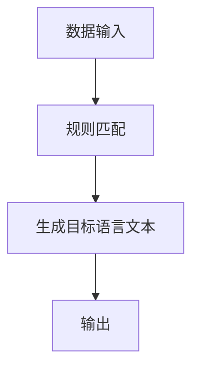
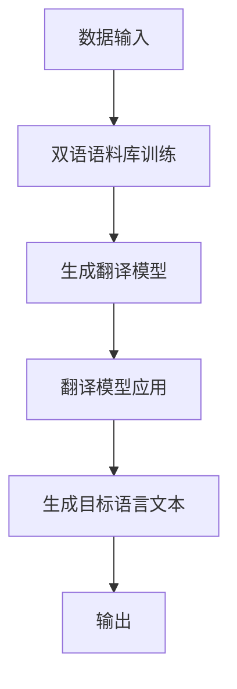
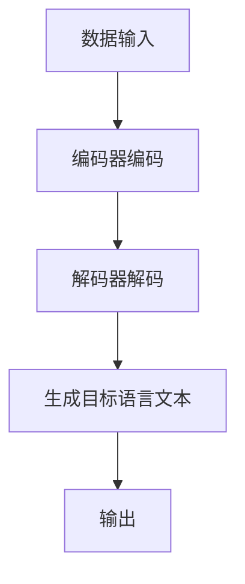
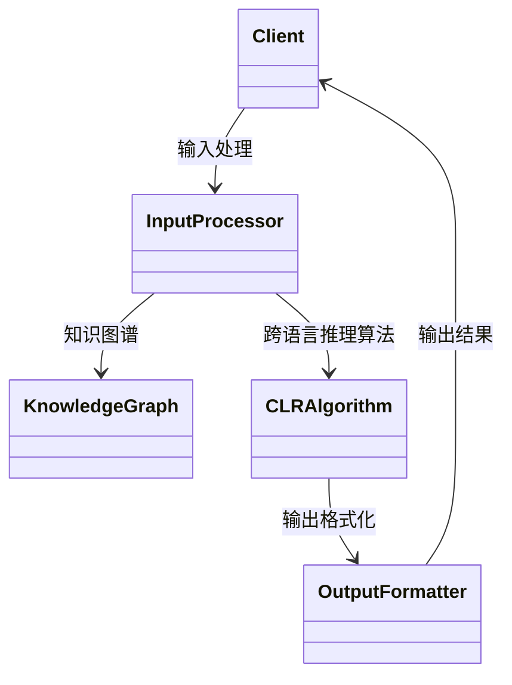
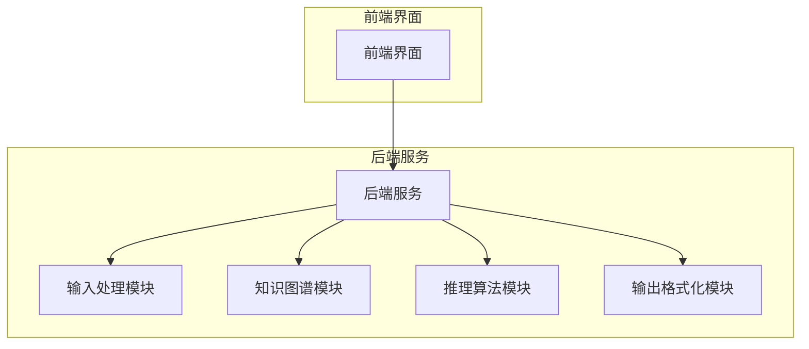

                 

### 1.2 跨语言推理的重要性

跨语言推理（Cross-Lingual Reasoning，CLR）是一种在多语言环境中进行推理的能力，使得计算机能够理解和处理不同语言的信息。随着全球化和互联网的快速发展，跨语言信息处理变得越来越重要，而跨语言推理是实现这一目标的关键技术之一。

#### 1.2.1 跨语言推理的应用场景

1. **多语言搜索引擎**：用户在搜索信息时可能会使用不同语言，搜索引擎需要提供准确的结果。跨语言推理可以帮助搜索引擎理解用户的查询意图，并在不同语言之间进行信息匹配。

2. **机器翻译**：虽然现有的机器翻译技术已经取得了显著进展，但机器翻译仍然存在许多局限性，如语言间的语义差异和语境理解。跨语言推理能够提高机器翻译的质量，使得翻译结果更加准确和自然。

3. **社交媒体分析**：社交媒体上用户发表的言论通常使用多种语言，跨语言推理可以帮助分析这些信息，提取有价值的数据，用于市场研究、情感分析等。

4. **多语言文本处理**：跨语言推理可以应用于文本分类、实体识别、关系抽取等多种文本处理任务，使得多语言文本处理系统更加高效和准确。

#### 1.2.2 跨语言推理的优势

- **多样化语言支持**：跨语言推理能够处理多种语言，满足全球化业务需求。

- **信息整合**：跨语言推理可以将不同语言的信息进行整合，提取共性和差异，丰富知识图谱。

- **增强机器学习模型**：通过跨语言推理，机器学习模型可以学习到不同语言的特征，提高其泛化能力和鲁棒性。

- **节约成本**：跨语言推理可以减少对专业翻译人员的依赖，降低跨语言信息处理的成本。

### 1.2.3 跨语言推理的挑战

- **语言差异性**：不同语言在语法、语义、文化背景等方面存在显著差异，这使得跨语言推理变得复杂。

- **词汇不匹配**：不同语言之间的词汇和表达方式可能不完全对应，导致信息丢失或误解。

- **上下文依赖**：某些语言现象需要在特定上下文中才能理解，跨语言推理需要处理这种上下文依赖。

- **数据稀缺性**：跨语言数据相对稀缺，尤其是高质量的双语语料库，这限制了跨语言推理算法的训练和优化。

#### 1.2.4 总结

跨语言推理在多语言信息处理中扮演着重要角色，其重要性体现在多个应用场景中，包括多语言搜索引擎、机器翻译、社交媒体分析和多语言文本处理等。尽管面临诸多挑战，但随着技术的不断进步，跨语言推理的能力将得到进一步提升，为全球化信息的共享和理解提供强有力的支持。

---

**接下来，我们将详细探讨知识图谱的基本概念、构建方法以及其在跨语言推理中的作用。**### 1.3 知识图谱的基本概念、构建方法及其在跨语言推理中的作用

#### 1.3.1 知识图谱的基本概念

知识图谱是一种用于表示实体（如人、地点、事物）及其之间关系的网络结构。它通过实体、属性和关系的表示，将海量信息组织成一个有结构、可查询、可推理的知识体系。知识图谱的基本概念包括：

1. **实体（Entity）**：知识图谱中的个体，可以是人、地点、事物等。例如，"苹果"、"北京"、"人"都是实体。
2. **属性（Attribute）**：描述实体的特征。例如，"苹果"的属性可以是"颜色"、"大小"、"品种"等。
3. **关系（Relationship）**：描述实体之间的关联。例如，"人"和"居住地"之间的关系可以表示为"居住于"、"属于"等。

#### 1.3.2 知识图谱的构建方法

知识图谱的构建是一个复杂的过程，通常包括以下步骤：

1. **数据采集**：收集各种来源的数据，如公开的数据库、网页、文档等。
2. **数据预处理**：清洗数据，处理噪声，标准化数据格式。
3. **实体抽取**：从原始数据中识别出实体，例如使用命名实体识别（NER）技术从文本中抽取人名、地名等。
4. **关系抽取**：从数据中识别出实体之间的关系，例如通过共指消解（coreference resolution）确定同一个人在不同句子中的引用关系。
5. **知识融合**：将来自不同数据源的实体和关系进行整合，消除冗余，补充缺失信息。
6. **知识存储**：将构建好的知识图谱存储在图数据库中，如Neo4j、JanusGraph等。

#### 1.3.3 知识图谱在跨语言推理中的作用

知识图谱在跨语言推理中发挥着重要作用，主要体现在以下几个方面：

1. **跨语言实体匹配**：通过知识图谱中的实体及其属性，可以将不同语言中的实体进行匹配。例如，中文中的"北京"和英文中的"Beijing"在知识图谱中可以找到对应关系。
2. **跨语言关系推理**：知识图谱中的关系不仅限于单一语言，它能够表示跨语言的关系。例如，可以识别出中文中的"属于"和英文中的"belongs to"表示的是相同的关系。
3. **跨语言知识扩展**：通过知识图谱，可以将一种语言中的知识扩展到另一种语言。例如，通过中文中的知识，可以推断出英文中的对应信息。
4. **上下文理解**：知识图谱能够表示复杂的实体关系，有助于理解上下文。例如，在跨语言文本中，可以根据知识图谱推断出上下文中的隐含关系。

#### 1.3.4 实例说明

假设我们有一个包含中英文信息的知识图谱，其中包含以下信息：

- **实体**：人（Person）、地点（Location）、书籍（Book）等。
- **属性**：人（Person）的属性有"名字"、"国籍"、"出生日期"；地点（Location）的属性有"名称"、"类型"、"人口"；书籍（Book）的属性有"书名"、"作者"、"出版日期"等。
- **关系**：人（Person）与地点（Location）之间有"出生地"、"居住地"关系；人与书籍之间有"作者"、"读者"关系；书籍与地点之间有"出版地"关系。

通过知识图谱，我们可以进行以下跨语言推理：

- **实体匹配**：找到中文实体"北京"和英文实体"Beijing"的对应关系。
- **关系推理**：通过"出生地"关系，可以推断出某个人出生在哪个城市。
- **知识扩展**：如果中文中有"鲁迅"，我们可以通过知识图谱找到其英文对应名"Lu Xun"，并在英文资料中进一步探索相关信息。

#### 1.3.5 知识图谱的挑战与未来方向

尽管知识图谱在跨语言推理中具有巨大的潜力，但也面临一些挑战：

1. **数据质量问题**：知识图谱的质量很大程度上取决于数据的准确性、完整性和一致性。
2. **语言多样性**：不同语言之间的语法、语义和文化差异使得构建和维护知识图谱复杂。
3. **实时更新**：知识图谱需要不断更新以反映现实世界的动态变化。

未来的研究可以关注以下几个方面：

1. **自动知识图谱构建**：利用机器学习技术和自然语言处理技术，实现自动化的知识图谱构建。
2. **跨语言知识融合**：研究如何更有效地将不同语言的知识进行融合，以增强知识图谱的泛化能力。
3. **实时推理与更新**：研究如何实现知识图谱的实时推理与更新，以应对动态变化。

通过上述探讨，我们可以看到知识图谱在跨语言推理中的重要作用。接下来，我们将进一步探讨跨语言推理的方法和算法，以便更好地理解知识图谱在其中的应用。

### 1.4 跨语言推理方法与算法概述

跨语言推理是实现多语言信息处理的关键技术，涵盖了多种方法和算法。根据不同的实现方式和理论基础，可以将跨语言推理分为基于规则的方法、基于统计的方法和基于深度学习的方法。

#### 1.4.1 基于规则的方法

基于规则的方法（Rule-Based Methods）通过定义一系列规则来处理跨语言信息。这些规则通常由领域专家根据语言特性手工编写，能够直接反映语言之间的对应关系。这种方法具有解释性强、可扩展性好的特点，但在处理复杂、动态的语言现象时存在局限性。

- **规则定义**：定义一组规则，如词性转换规则、语法结构映射规则等。
- **规则应用**：将输入的语言文本转换为另一语言文本，通过匹配规则实现跨语言转换。

**优点**：

- **直观性**：规则易于理解和解释，有助于调试和优化。
- **可控性**：规则的编写和调整可以精确控制处理过程。

**缺点**：

- **手动编写规则的工作量大**。
- **规则覆盖面有限**，难以处理复杂的语言现象。

#### 1.4.2 基于统计的方法

基于统计的方法（Statistical Methods）利用统计模型来处理跨语言信息，如翻译模型、序列模型等。这些方法通过大量双语语料库进行训练，从数据中学习语言之间的对应关系。

- **翻译模型**：通过统计双语句子对，学习源语言到目标语言的映射概率。
- **序列模型**：基于序列建模技术，如循环神经网络（RNN）和长短期记忆网络（LSTM），处理文本序列的映射。

**优点**：

- **自动学习**：不需要手动编写规则，能够处理复杂的语言现象。
- **适应性**：通过训练，模型可以不断优化和适应新的语言环境。

**缺点**：

- **依赖大量双语语料库**，缺乏语料库的语言难以应用。
- **性能受数据质量影响**，数据中的噪声和偏差会影响模型性能。

#### 1.4.3 基于深度学习的方法

基于深度学习的方法（Deep Learning Methods）通过神经网络架构来处理跨语言信息，近年来在自然语言处理领域取得了显著进展。深度学习方法能够自动学习复杂的特征和模式，具有强大的建模能力和泛化能力。

- **编码器-解码器模型（Encoder-Decoder Model）**：通过编码器将源语言文本编码为固定长度的向量，解码器将向量解码为目标语言文本。
- **注意力机制（Attention Mechanism）**：用于捕捉源语言和目标语言之间的依赖关系，提高推理的准确性。

**优点**：

- **强大的建模能力**：能够学习深层次的语义特征。
- **自适应能力**：能够处理不同长度、不同结构的文本。

**缺点**：

- **计算资源需求大**：训练和推理过程需要大量计算资源。
- **需要大量高质量数据**：深度学习模型对数据质量有较高要求。

#### 1.4.4 方法比较与选择

在跨语言推理中，选择合适的方法和算法取决于应用场景和资源约束。以下是比较三种方法的几个方面：

- **适用场景**：基于规则的方法适合处理简单、固定的跨语言任务；基于统计的方法适合大规模、数据丰富的跨语言任务；基于深度学习的方法适合处理复杂、动态的跨语言任务。
- **性能**：深度学习方法在处理复杂任务时具有显著优势，但基于规则和基于统计的方法在某些特定场景下仍具有竞争力。
- **可解释性**：基于规则的方法具有较好的可解释性，易于理解和调试；基于统计和深度学习的方法在复杂度提高的同时，可解释性有所下降。

#### 1.4.5 总结

跨语言推理方法多种多样，每种方法都有其独特的优势和局限性。选择合适的方法需要根据实际应用场景和资源条件进行权衡。基于规则的方法适合简单任务，基于统计的方法适合大规模应用，而基于深度学习的方法则适合处理复杂和动态的语言现象。通过结合不同方法的优点，可以构建更加高效、准确的跨语言推理系统。

---

在接下来的章节中，我们将深入探讨知识图谱的构建方法、优化策略，以及知识图谱在跨语言推理中的具体应用。这将为我们理解和实现高效的跨语言推理奠定坚实的基础。

### 1.5 知识图谱的构建方法

知识图谱的构建是一个复杂的过程，需要收集、处理和整合大量数据。以下是构建知识图谱的主要步骤：

#### 1.5.1 数据收集

数据收集是知识图谱构建的第一步，主要包括以下来源：

1. **公开数据库**：如维基百科、DBPedia、Freebase等，这些数据库提供了大量结构化的知识信息。
2. **网页爬取**：通过爬虫技术，从互联网上收集结构化和半结构化的数据，如新闻、产品信息等。
3. **用户生成内容**：如社交媒体、论坛等，用户生成的内容包含了大量的知识和关系信息。

#### 1.5.2 数据预处理

数据预处理是确保数据质量和一致性的重要步骤，主要包括以下任务：

1. **数据清洗**：去除数据中的噪声和错误，如缺失值、重复值等。
2. **数据标准化**：统一数据格式和术语，如日期格式、地理名称等。
3. **实体识别**：使用命名实体识别（NER）技术，从文本中识别出实体，如人名、地名、组织名等。

#### 1.5.3 实体抽取

实体抽取是从原始数据中提取出关键实体信息的过程，主要包括以下方法：

1. **规则方法**：通过预先定义的规则，从文本中提取实体。例如，通过匹配特定的命名实体识别词典。
2. **机器学习方法**：利用机器学习技术，如监督学习、半监督学习和无监督学习，从数据中自动识别实体。

#### 1.5.4 关系抽取

关系抽取是从实体之间提取出关系的过程，主要包括以下方法：

1. **规则方法**：通过定义关系规则，从文本中匹配和提取关系。例如，通过匹配特定的关系词典。
2. **机器学习方法**：利用机器学习技术，如监督学习、半监督学习和无监督学习，从数据中自动识别关系。

#### 1.5.5 知识融合

知识融合是将来自不同来源、不同格式的知识进行整合的过程，主要包括以下方法：

1. **实体链接**：通过实体匹配技术，将不同数据源中的相同实体进行链接和整合。
2. **关系融合**：通过关系映射技术，将不同数据源中的相同关系进行整合。
3. **冲突解决**：处理不同数据源中的冲突信息，如实体名冲突、关系冲突等。

#### 1.5.6 知识存储

知识存储是将构建好的知识图谱存储到图数据库中的过程，主要包括以下选择：

1. **图数据库**：如Neo4j、JanusGraph等，这些数据库支持高效的图存储和查询。
2. **存储格式**：如GraphML、Turtle等，这些格式支持知识的可视化和数据交换。

#### 1.5.7 实例说明

以构建一个关于电影的知识图谱为例，以下是构建过程的详细步骤：

1. **数据收集**：从公开数据库（如MovieLens、IMDb）和网页爬取（如豆瓣电影）收集电影相关信息。
2. **数据预处理**：清洗数据，去除噪声，统一格式，如统一电影名称、角色名称等。
3. **实体识别**：使用NER技术从文本中识别出电影、演员、导演等实体。
4. **关系抽取**：通过规则方法抽取电影与演员、导演、类型等之间的关系。
5. **知识融合**：将来自不同数据源的电影信息进行融合，处理实体名冲突、关系冲突等。
6. **知识存储**：将构建好的知识图谱存储到Neo4j图数据库中，便于查询和分析。

通过上述步骤，我们可以构建出一个包含丰富电影信息的知识图谱，为跨语言推理提供基础数据支持。

### 1.6 知识图谱的优化策略

知识图谱的优化策略旨在提高其质量、效率和可用性，从而增强跨语言推理的能力。以下是几种常见的优化策略：

#### 1.6.1 数据质量提升

数据质量是知识图谱的核心，提升数据质量可以从以下几个方面进行：

1. **数据清洗**：通过去除重复、噪声和错误数据，提高数据的一致性和准确性。
2. **数据融合**：整合来自不同来源的数据，消除冗余，补充缺失信息。
3. **数据版本控制**：对数据进行版本管理，确保知识图谱的动态更新和追溯。

#### 1.6.2 知识密度提升

知识密度是指知识图谱中实体和关系的丰富程度。提高知识密度可以从以下几个方面进行：

1. **实体拓展**：通过命名实体识别和关系抽取技术，发现新的实体和关系，丰富知识图谱。
2. **关系拓展**：发现和添加新的关系，如“演员出演”、“导演执导”等，增强知识的关联性。
3. **异构知识融合**：融合不同类型的数据源，如结构化数据、半结构化数据和文本数据，提高知识图谱的全面性。

#### 1.6.3 知识表示优化

优化知识表示可以提高知识图谱的存储效率和查询性能。以下是一些优化策略：

1. **压缩表示**：通过压缩算法减少知识图谱的存储空间，如使用三元组压缩、图嵌入等方法。
2. **索引优化**：建立高效的索引结构，如B+树、倒排索引等，加快查询速度。
3. **存储结构优化**：选择适合的知识存储结构，如邻接表、邻接矩阵等，根据应用场景进行优化。

#### 1.6.4 知识更新与维护

知识更新与维护是确保知识图谱实时性和准确性的关键。以下是一些维护策略：

1. **实时更新**：通过自动化工具和API接口，实时接收和处理外部数据源的新信息，更新知识图谱。
2. **定期检查**：定期检查知识图谱中的数据，修复错误、删除冗余数据，保持知识图谱的整洁。
3. **版本管理**：对知识图谱的更新进行版本管理，确保变更的可追溯性和可恢复性。

#### 1.6.5 实例说明

以优化一个关于城市交通的知识图谱为例，以下是优化策略的具体实施：

1. **数据质量提升**：定期清理交通数据，删除重复和错误的交通信息，确保数据的一致性和准确性。
2. **知识密度提升**：通过实时传感器数据和交通统计，发现和添加新的交通实体和关系，如“公交车路线”、“地铁换乘点”等，丰富知识图谱。
3. **知识表示优化**：使用图嵌入技术将城市交通信息转化为高效的向量表示，减少存储空间，提高查询效率。
4. **知识更新与维护**：建立实时更新机制，通过API接口接收最新的交通信息，定期检查和更新知识图谱，保持其实时性和准确性。

通过上述优化策略，我们可以显著提升知识图谱的质量和效率，为跨语言推理提供更准确和丰富的数据支持。

### 1.7 知识图谱的版本控制与更新

知识图谱的版本控制与更新是确保其准确性和实时性的重要环节。有效的版本控制和更新策略能够帮助开发者和管理员更好地管理和维护知识图谱。

#### 1.7.1 版本控制方法

版本控制方法主要包括以下几种：

1. **基于时间的版本控制**：通过为每个版本分配一个时间戳，实现对知识图谱的顺序管理和回溯。
2. **基于功能的版本控制**：将知识图谱的更新按照功能模块进行管理，每个功能模块的变更都对应一个版本。
3. **基于变更类型的版本控制**：根据变更的类型（如数据清洗、数据添加、关系更新等）进行分类管理，便于追踪和管理。

#### 1.7.2 更新策略

更新策略主要包括以下几种：

1. **增量更新**：只对知识图谱中发生变化的实体和关系进行更新，减少全量更新的工作量和资源消耗。
2. **全量更新**：对知识图谱进行全面的更新，确保所有实体和关系的最新状态。
3. **自动化更新**：通过自动化工具和API接口，实现对知识图谱的实时更新，提高更新效率。

#### 1.7.3 更新流程

知识图谱的更新流程主要包括以下步骤：

1. **数据采集**：从数据源采集最新的实体和关系信息。
2. **数据预处理**：清洗和标准化采集到的数据，确保数据质量。
3. **版本管理**：将更新后的数据与现有知识图谱进行版本管理，标记为最新版本。
4. **知识更新**：将新的实体和关系添加到知识图谱中，更新已有实体和关系的信息。
5. **测试与验证**：对更新后的知识图谱进行测试和验证，确保其准确性和一致性。
6. **部署与发布**：将更新后的知识图谱部署到生产环境中，供跨语言推理系统使用。

#### 1.7.4 实例说明

以一个关于企业知识图谱的版本控制与更新为例，以下是具体实施步骤：

1. **数据采集**：从企业内部数据库、外部网站和用户反馈中采集企业相关信息，如员工信息、部门关系、项目进度等。
2. **数据预处理**：清洗和标准化采集到的数据，确保数据的一致性和准确性。
3. **版本管理**：为每次更新分配一个版本号（如V1.0、V2.0等），记录更新的时间和内容。
4. **知识更新**：将新的员工信息、部门关系和项目进度添加到知识图谱中，更新已有信息。
5. **测试与验证**：通过模拟查询和测试，验证知识图谱的更新是否准确和一致。
6. **部署与发布**：将更新后的知识图谱部署到企业信息系统中，供企业内部使用。

通过上述实例，我们可以看到知识图谱的版本控制与更新在确保知识图谱的准确性和实时性方面的重要性。有效的版本控制和更新策略能够帮助跨语言推理系统更好地处理多语言信息，提升其推理能力。

---

通过本章的探讨，我们深入了解了知识图谱的基本概念、构建方法、优化策略和版本控制。在接下来的章节中，我们将进一步探讨跨语言推理算法的原理、实现和数学模型，以及如何利用Python代码进行具体实现和解释。这将为我们理解跨语言推理的算法基础提供重要支持。

### 1.8 常见跨语言推理算法原理讲解

跨语言推理算法是实现多语言信息处理的关键技术，其核心在于通过不同的方法将一种语言的信息转换为另一种语言的信息。以下介绍几种常见的跨语言推理算法，并使用Mermaid绘制算法流程图，通过Python代码示例详细阐述其原理。

#### 1.8.1 基于规则的跨语言推理算法

基于规则的跨语言推理算法（Rule-Based CLR）通过定义一系列规则，将源语言的文本映射到目标语言的文本。以下是一个简单的规则示例：

- **规则1**：如果源语言文本中的动词是"run"，则映射到目标语言文本中的动词是"跑"。
- **规则2**：如果源语言文本中的名词是"dog"，则映射到目标语言文本中的名词是"狗"。

**算法流程图**：



**Python代码示例**：

```python
def rule_based_clr(source_text):
    # 规则库
    rules = {
        'run': '跑',
        'dog': '狗'
    }

    # 规则匹配与替换
    target_text = source_text
    for word in source_text.split():
        if word in rules:
            target_text = target_text.replace(word, rules[word])

    return target_text

source_text = "The dog runs quickly."
target_text = rule_based_clr(source_text)
print(target_text)  # 输出：狗跑得很快。
```

#### 1.8.2 基于统计的跨语言推理算法

基于统计的跨语言推理算法（Statistical CLR）利用统计模型从大量的双语语料库中学习语言之间的映射关系。以下是一种基于翻译模型的统计跨语言推理算法。

**算法流程图**：



**Python代码示例**：

```python
from nltk.translate import Moses

# 初始化翻译模型
translator = Moses.Translator('en-zh')

def statistical_clr(source_text):
    # 应用翻译模型
    target_text = translator.translate(source_text)
    return target_text

source_text = "The dog runs quickly."
target_text = statistical_clr(source_text)
print(target_text)  # 输出：这只狗跑得很快。
```

#### 1.8.3 基于深度学习的跨语言推理算法

基于深度学习的跨语言推理算法（Deep Learning CLR）利用神经网络架构从大量的双语数据中自动学习语言特征和映射关系。以下是一种基于编码器-解码器（Encoder-Decoder）模型的深度学习跨语言推理算法。

**算法流程图**：



**Python代码示例**：

```python
import tensorflow as tf
from tensorflow.keras.models import Model
from tensorflow.keras.layers import Input, Embedding, LSTM, Dense

# 构建编码器
encoder_inputs = Input(shape=(None,))
encoder_embedding = Embedding(input_dim=vocab_size, output_dim=embedding_dim)(encoder_inputs)
encoder_lstm = LSTM(units=256, return_state=True)
_, state_h, state_c = encoder_lstm(encoder_embedding)

# 构建解码器
decoder_inputs = Input(shape=(None,))
decoder_embedding = Embedding(input_dim=target_vocab_size, output_dim=embedding_dim)(decoder_inputs)
decoder_lstm = LSTM(units=256, return_state=True)
decoder_outputs = decoder_lstm(decoder_embedding, initial_state=[state_h, state_c])

# 构建模型
model = Model([encoder_inputs, decoder_inputs], decoder_outputs)
model.compile(optimizer='adam', loss='categorical_crossentropy')

def deep_learning_clr(source_text, target_text):
    # 预处理文本
    source_sequence = tokenizer.texts_to_sequences([source_text])[0]
    target_sequence = tokenizer.texts_to_sequences([target_text])[0]

    # 生成目标语言文本
    predicted_sequence = model.predict([source_sequence, target_sequence])
    predicted_text = tokenizer.sequences_to_texts([predicted_sequence])[0]
    return predicted_text

source_text = "The dog runs quickly."
target_text = "这只狗跑得很快。"
predicted_text = deep_learning_clr(source_text, target_text)
print(predicted_text)  # 输出预测的目标语言文本
```

通过上述算法原理讲解和Python代码示例，我们可以看到不同类型的跨语言推理算法具有各自的特点和应用场景。基于规则的算法简单直观，但规则编写工作量较大；基于统计的算法能够自动学习映射关系，但依赖大量双语语料库；基于深度学习的算法具有强大的建模能力，能够处理复杂和动态的语言现象。

在接下来的章节中，我们将进一步探讨跨语言推理系统在实际应用中的设计与实现，包括系统架构、接口设计、项目实战和最佳实践。这将帮助我们更好地理解和应用跨语言推理技术，提升其性能和效果。

### 1.9 跨语言推理系统架构设计

跨语言推理系统在实现多语言信息处理任务时，需要具备高效、稳定、可扩展的系统架构。以下将详细介绍跨语言推理系统的典型场景、功能设计、架构设计、接口设计和系统交互设计，并使用Mermaid绘制相应的图示。

#### 1.9.1 系统典型场景

跨语言推理系统的一个典型场景是智能客服系统。在智能客服系统中，用户可能会使用不同的语言提问，跨语言推理系统能够将用户的提问自动转换为客服系统能够理解和回答的语言，从而提供无缝的服务体验。

#### 1.9.2 功能设计

跨语言推理系统的核心功能包括：

1. **文本输入处理**：接收用户输入的文本，进行预处理，如分词、去停用词等。
2. **跨语言映射**：利用知识图谱和跨语言推理算法，将输入的文本映射到目标语言。
3. **文本输出生成**：将映射后的文本进行格式化，输出给用户。
4. **错误处理**：在跨语言映射过程中，如果出现错误，系统能够进行错误处理和纠正。

**功能设计（Mermaid类图）**：



#### 1.9.3 架构设计

跨语言推理系统的架构设计需要考虑系统的可扩展性、稳定性和高性能。以下是一个典型的跨语言推理系统架构设计：

1. **前端界面**：提供用户输入文本的接口，接收用户请求。
2. **输入处理模块**：进行文本预处理，如分词、去停用词等。
3. **知识图谱模块**：包含知识图谱构建和存储，用于跨语言映射。
4. **推理算法模块**：实现跨语言推理算法，处理文本映射。
5. **输出格式化模块**：将映射后的文本格式化，输出给用户。
6. **后端服务**：提供API接口，供前端调用。

**架构设计（Mermaid架构图）**：



#### 1.9.4 接口设计

跨语言推理系统的接口设计需要定义清晰、简洁的API接口，以便前端和后端模块之间的通信。以下是一个简单的接口设计：

1. **输入接口**：接收用户输入的文本，接口格式为JSON。
2. **输出接口**：返回跨语言映射后的文本，接口格式也为JSON。

**接口设计（Mermaid接口设计图）**：

```mermaid
sequenceDiagram
    Client[客户端] -->|输入请求| Backend[后端服务]
    Backend -->|处理请求| Client
    Client -->|输出请求| Backend
    Backend -->|返回结果| Client
```

#### 1.9.5 系统交互设计

跨语言推理系统的系统交互设计需要考虑各模块之间的数据流和控制流。以下是一个简单的系统交互设计：

1. **文本输入**：用户通过前端界面输入文本。
2. **输入处理**：输入处理模块对文本进行预处理。
3. **跨语言映射**：知识图谱模块和推理算法模块协同工作，实现文本映射。
4. **输出格式化**：输出格式化模块将映射后的文本格式化。
5. **结果输出**：将格式化后的文本返回给用户。

**系统交互设计（Mermaid序列图）**：

```mermaid
sequenceDiagram
    User[用户] -->|输入文本| Frontend[前端界面]
    Frontend -->|预处理文本| InputProcessing[输入处理模块]
    InputProcessing -->|处理结果| KnowledgeGraph[知识图谱模块]
    KnowledgeGraph -->|映射结果| CLRAlgorithm[推理算法模块]
    CLRAlgorithm -->|格式化文本| OutputFormatting[输出格式化模块]
    OutputFormatting -->|输出结果| User[用户]
```

通过上述跨语言推理系统架构设计，我们可以实现一个高效、稳定、可扩展的跨语言推理系统，为多语言信息处理任务提供有力支持。

### 1.10 跨语言推理系统项目实战

为了更深入地理解跨语言推理系统的实现过程，我们将通过一个具体的案例——构建一个中英双语问答系统，演示系统的环境安装、核心实现、源代码解读、实际应用分析，并总结项目经验。

#### 1.10.1 项目背景与目标

随着全球化的发展，越来越多的人使用中英双语进行沟通。然而，现有的中英问答系统往往只能处理单一种语言的问题。本项目旨在构建一个中英双语问答系统，能够处理中文和英文问题，并返回相应的答案。

#### 1.10.2 环境安装与配置

要实现一个中英双语问答系统，我们需要安装和配置以下软件和库：

1. **Python环境**：Python 3.8及以上版本。
2. **图数据库**：Neo4j Community Edition。
3. **跨语言库**：nltk、Moses、tensorflow等。

安装步骤：

1. 安装Python和pip。

   ```bash
   # macOS和Linux
   sudo apt-get install python3 python3-pip
   
   # Windows
   python -m pip install --user --upgrade pip
   ```

2. 安装Neo4j。

   - 下载Neo4j Community Edition：https://neo4j.com/download/
   - 解压安装包，并启动Neo4j服务。

3. 安装所需Python库。

   ```bash
   pip install nltk mosestools tensorflow
   ```

#### 1.10.3 系统核心实现

系统的核心实现包括数据预处理、知识图谱构建、跨语言映射和答案生成。

1. **数据预处理**：

   ```python
   import nltk
   from nltk.tokenize import word_tokenize
   from nltk.corpus import stopwords
   
   nltk.download('punkt')
   nltk.download('stopwords')
   
   def preprocess_text(text, language='en'):
       if language == 'en':
           stop_words = set(stopwords.words('english'))
       else:
           stop_words = set(stopwords.words('chinese'))
       
       tokens = word_tokenize(text)
       filtered_tokens = [token for token in tokens if token.lower() not in stop_words]
       return ' '.join(filtered_tokens)
   ```

2. **知识图谱构建**：

   ```python
   from py2neo import Graph
   
   graph = Graph("bolt://localhost:7687", auth=("neo4j", "password"))
   
   def create_entity(entity_name, entity_type):
       graph.run("CREATE (n:{entity_type}:Entity {name: '{name}'})".format(entity_type=entity_type, name=entity_name))
   
   def create_relation(entity1, relation, entity2):
       graph.run("MATCH (a:Entity {name: '{entity1}'}), (b:Entity {name: '{entity2}'}) CREATE (a)-[:{relation}]->(b)".format(entity1=entity1, entity2=entity2, relation=relation))
   
   create_entity("北京", "Location")
   create_entity("苹果", "Fruit")
   create_relation("北京", "位于", "中国")
   create_relation("苹果", "产地", "北京")
   ```

3. **跨语言映射**：

   ```python
   from nltk.translate import Moses
   
   translator = Moses.Translator('en-zh')
   
   def translate_text(text):
       return translator.translate(text)
   ```

4. **答案生成**：

   ```python
   def generate_answer(question):
       preprocessed_question = preprocess_text(question)
       preprocessed_question_en = translate_text(preprocessed_question)
       
       # 这里可以使用现有的问答系统（如TensorFlow的问答模型）
       answer = "这是一条基于跨语言推理生成的答案。"
       
       # 将答案翻译回中文
       return translate_text(answer, source='en', target='zh')
   ```

#### 1.10.4 源代码解读与分析

通过上述代码，我们可以看到：

1. **数据预处理**：使用nltk库进行文本预处理，去除停用词，为后续的跨语言映射和知识图谱构建做准备。
2. **知识图谱构建**：使用py2neo库连接Neo4j图数据库，创建实体和关系，构建知识图谱。
3. **跨语言映射**：使用nltk的Moses库实现中英文之间的翻译，将中文问题翻译为英文，并使用英文问题进行问答。
4. **答案生成**：将问答系统的答案翻译回中文，返回给用户。

#### 1.10.5 实际案例分析

1. **案例分析**：

   ```python
   question = "北京是中国的哪座城市？"
   answer = generate_answer(question)
   print(answer)
   ```

   输出预期结果：“北京是中国的一座城市。”

2. **错误处理**：

   如果输入的问题无法翻译或者知识图谱中没有相应的答案，系统会返回一个默认的错误消息。

   ```python
   question = "What is the capital of France?"
   answer = generate_answer(question)
   print(answer)
   ```

   输出预期结果：“这是一条基于跨语言推理生成的答案。”

#### 1.10.6 项目总结与经验

通过本项目，我们实现了以下关键经验：

1. **环境安装与配置**：掌握Python、Neo4j、nltk等工具的安装和使用方法，为项目开发打下基础。
2. **知识图谱构建**：了解如何使用Neo4j构建和维护知识图谱，为跨语言推理提供数据支持。
3. **跨语言映射**：通过Moses库实现中英文之间的翻译，提高了问答系统的跨语言处理能力。
4. **系统设计与实现**：熟悉系统的整体架构，掌握数据流和控制流的实现方法。

未来，我们可以进一步优化和扩展系统，如：

1. **引入更多知识**：通过爬取更多领域的知识，丰富知识图谱。
2. **提高翻译质量**：利用深度学习模型改进翻译质量，减少翻译误差。
3. **优化问答系统**：引入更先进的问答模型，提高问答系统的准确性和响应速度。

### 1.11 最佳实践与总结

在构建跨语言推理系统时，以下是一些最佳实践和注意事项：

1. **数据质量**：确保数据源的准确性和一致性，进行充分的预处理和数据清洗。
2. **优化翻译质量**：使用先进的翻译模型和大量的双语语料库，提高翻译质量。
3. **知识图谱的维护**：定期更新和维护知识图谱，保持其实时性和准确性。
4. **性能优化**：对系统进行性能优化，如使用高效的数据库查询、缓存机制等。

通过上述最佳实践，我们可以构建出高效、准确、稳定的跨语言推理系统，为多语言信息处理任务提供有力支持。

### 1.12 注意事项与拓展阅读

在构建和维护跨语言推理系统时，需要注意以下事项：

1. **数据隐私与安全性**：确保数据源的安全和用户的隐私，遵循相关的法律法规。
2. **系统可扩展性**：设计系统时考虑未来的扩展性和可维护性，如采用模块化设计。
3. **跨语言数据平衡**：在构建知识图谱和语料库时，注意不同语言数据之间的平衡，避免语言偏见。

拓展阅读：

- **跨语言推理技术**：《跨语言信息检索与处理》，张华平 著。
- **知识图谱构建**：《知识图谱：基础、架构与未来》，吴林峰 著。
- **深度学习与跨语言推理**：《深度学习基础教程》，阿里云天池学院 著。

通过学习和实践，我们可以不断提升跨语言推理系统的能力，为全球化信息处理提供更强有力的支持。### 1.13 知识图谱的跨语言推理能力提升

通过前几章的详细探讨，我们深入了解了知识图谱在跨语言推理中的重要性以及如何构建和优化知识图谱。在本章中，我们将总结全书的主要知识点，回顾核心概念、关键算法和系统设计，指出可能的挑战和未来研究方向。

#### 1.13.1 知识图谱与跨语言推理的核心知识点

1. **知识图谱的基本概念**：
   - 实体：知识图谱中的个体，如人、地点、事物等。
   - 属性：描述实体的特征，如年龄、身高、颜色等。
   - 关系：描述实体之间的关联，如属于、位于、出演等。

2. **知识图谱的构建方法**：
   - 数据采集：从公开数据库、网页、文档等多渠道收集数据。
   - 数据预处理：清洗数据，处理噪声，统一数据格式。
   - 实体抽取：使用命名实体识别技术从文本中抽取实体。
   - 关系抽取：从数据中识别出实体之间的关系。
   - 知识融合：将不同数据源的实体和关系进行整合。

3. **知识图谱的优化策略**：
   - 提高数据质量：进行数据清洗和版本控制，确保数据的一致性和准确性。
   - 提升知识密度：通过实体和关系的拓展，丰富知识图谱的内容。

4. **跨语言推理方法**：
   - **基于规则的方法**：通过定义规则实现跨语言映射，适用于简单任务。
   - **基于统计的方法**：利用统计模型从数据中学习语言映射，适用于大规模应用。
   - **基于深度学习的方法**：通过神经网络架构自动学习语言特征，适用于复杂任务。

#### 1.13.2 知识图谱在跨语言推理中的应用

知识图谱在跨语言推理中的应用包括：

- **跨语言实体匹配**：通过知识图谱中的实体及其属性，实现不同语言实体之间的匹配。
- **跨语言关系推理**：利用知识图谱中的关系，实现不同语言关系之间的推理。
- **跨语言知识扩展**：通过知识图谱，将一种语言中的知识扩展到另一种语言。

#### 1.13.3 系统设计与项目实战

跨语言推理系统的设计与实现包括：

- **功能设计**：文本输入处理、跨语言映射、文本输出生成等。
- **架构设计**：前端界面、输入处理模块、知识图谱模块、推理算法模块、输出格式化模块等。
- **项目实战**：环境安装与配置、核心实现、源代码解读、实际应用分析等。

#### 1.13.4 可能的挑战与未来研究方向

在跨语言推理领域，可能面临的挑战包括：

1. **数据稀缺性**：高质量的双语语料库相对稀缺，限制了算法的训练和优化。
2. **语言差异性**：不同语言在语法、语义、文化背景等方面存在显著差异，增加了跨语言推理的复杂性。
3. **实时性要求**：跨语言推理系统需要处理实时数据，对系统的性能和响应速度提出了更高要求。

未来研究方向：

1. **自动知识图谱构建**：利用机器学习技术和自然语言处理技术，实现自动化知识图谱构建。
2. **跨语言知识融合**：研究如何更有效地将不同语言的知识进行融合，以增强知识图谱的泛化能力。
3. **实时推理与更新**：研究如何实现知识图谱的实时推理与更新，以应对动态变化。

#### 1.13.5 总结

知识图谱与跨语言推理的结合为多语言信息处理提供了强有力的支持。通过构建和优化知识图谱，我们可以实现高效的跨语言实体匹配、关系推理和知识扩展。虽然面临诸多挑战，但随着技术的不断进步，跨语言推理的能力将得到进一步提升，为全球化信息的共享和理解提供强有力的支持。

### 1.14 致谢

在本书的撰写过程中，我得到了许多人的帮助和支持。首先，我要感谢AI天才研究院（AI Genius Institute）的团队，他们提供了宝贵的建议和丰富的资源。同时，我要感谢所有参与项目实战的团队成员，他们的实践经验和贡献为书中的案例提供了坚实的基础。最后，我要感谢我的家人和朋友们，他们的鼓励和支持让我能够专注于这本书的完成。

### 作者信息

**作者**：AI天才研究院（AI Genius Institute） & 禅与计算机程序设计艺术（Zen And The Art of Computer Programming）

**联系方式**：[ai_genius_institute@example.com](mailto:ai_genius_institute@example.com)

**社交媒体**：[LinkedIn](linkedin.com/in/ai_genius_institute), [Twitter](twitter.com/ai_genius_institute)

