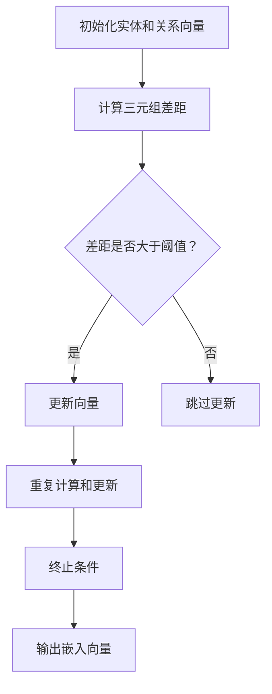
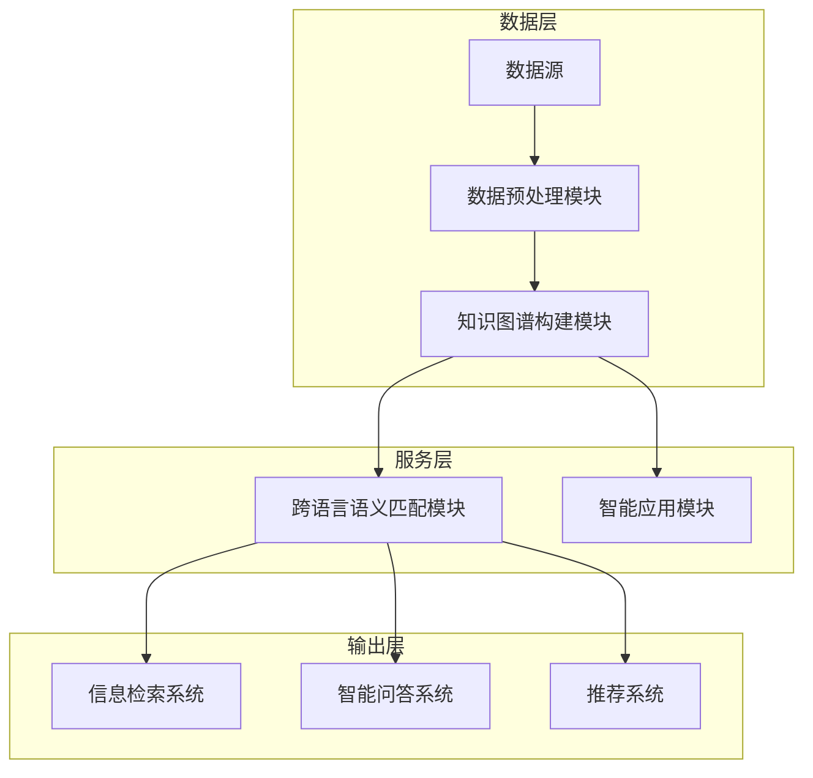
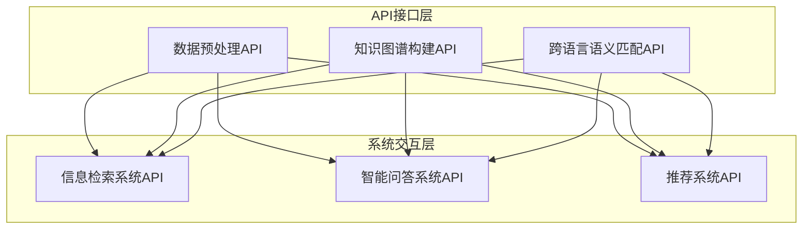

                 

## 基于知识图谱的跨语言语义推理能力增强技术

> 关键词：知识图谱、跨语言语义推理、增强技术、语义理解、算法实现、数学模型

> 摘要：本文围绕知识图谱与跨语言语义推理能力增强技术展开，详细探讨了知识图谱的构建方法、跨语言语义推理的基本概念和挑战，以及基于知识图谱的跨语言语义推理算法和增强技术。通过案例研究与应用实践，本文旨在为读者提供全面的技术理解与应用指导，推动知识图谱和跨语言语义推理在各个领域的应用与发展。

### 文章背景与意义

随着信息技术的飞速发展，数据量呈指数级增长，尤其是在互联网和社交媒体的推动下，跨语言、跨领域的知识内容变得更加丰富和复杂。然而，如何有效地组织和理解这些多语言、多领域的知识成为了当前人工智能领域的一大挑战。知识图谱作为一种结构化的知识表示方法，通过将海量信息抽象成实体、属性和关系的网络结构，为解决这一挑战提供了新的思路。而跨语言语义推理能力则是知识图谱应用的关键，它能够帮助系统在不同语言之间建立语义联系，实现知识的自动理解和传递。

知识图谱和跨语言语义推理的结合，不仅能够提升自然语言处理和机器学习模型的性能，还能够为智能问答、智能推荐、跨语言信息检索等应用场景提供强大的支持。例如，在跨国企业的信息管理系统、多语言新闻摘要、全球市场分析等领域，跨语言语义推理能力增强技术能够显著提高系统的智能水平和业务效率。

本文将从以下几个方面展开讨论：

1. **知识图谱概述**：介绍知识图谱的定义、组成部分和重要性。
2. **跨语言语义推理基本概念**：阐述跨语言语义推理的定义、应用场景和面临的挑战。
3. **知识图谱的构建与处理**：详细说明知识图谱的构建流程、补全与更新策略。
4. **跨语言语义推理算法**：分析基于知识图谱的跨语言语义匹配算法和语义推理模型。
5. **增强技术与方法**：探讨多语言知识融合和跨语言语义推理的增强技术。
6. **案例研究与应用实践**：通过具体案例展示增强技术的实际应用效果。
7. **未来展望与研究方向**：展望跨语言语义推理能力增强技术的未来发展。

### 第一部分：知识图谱与跨语言语义推理基础

#### 第1章：知识图谱概述

**1.1 知识图谱的定义与重要性**

知识图谱（Knowledge Graph）是一种语义网络，它通过将实体、属性和关系进行结构化表示，形成一个语义丰富的知识库。知识图谱的基本组成部分包括实体（Entity）、属性（Attribute）和关系（Relationship）。实体表示现实世界中的事物，如人、地点、事物等；属性表示实体的特征或描述，如姓名、年龄、地址等；关系表示实体之间的联系，如“出生地”、“拥有”等。

知识图谱的重要性在于，它不仅能够将分散的信息整合成一个统一的视图，还能够通过语义关系实现知识的关联和推理。这使得知识图谱在智能搜索、语义理解、推荐系统等领域具有广泛的应用潜力。

**1.2 知识图谱的组成要素**

知识图谱的组成要素主要包括：

- **实体（Entity）**：知识图谱中的基本构成单元，代表现实世界中的对象或概念。
- **属性（Attribute）**：描述实体的特征或属性，如“身高”、“体重”等。
- **关系（Relationship）**：连接实体与实体的语义关系，如“出生在”、“属于”等。
- **属性值（AttributeValue）**：实体的具体特征值，如“北京”、“苹果”等。

**1.3 知识图谱的发展历程**

知识图谱的发展历程可以分为以下几个阶段：

- **早期探索阶段**：以Web 2.0时代的语义网（Semantic Web）为代表，尝试通过语义标记将网页信息结构化。
- **数据集成阶段**：随着数据量的增加，知识图谱开始整合来自不同数据源的信息，形成大型知识库。
- **智能推理阶段**：通过引入机器学习和图神经网络等技术，知识图谱的语义理解和推理能力得到了显著提升。
- **应用驱动阶段**：知识图谱在各个行业和领域得到了广泛应用，如智能问答、信息检索、推荐系统等。

#### 第2章：跨语言语义推理基本概念

**2.1 跨语言语义推理的定义**

跨语言语义推理（Cross-Language Semantic Reasoning）是指在不同语言之间建立语义联系，从而实现知识的自动理解和传递。它涉及到将一种语言的语义信息映射到另一种语言上，确保不同语言之间的概念和表达具有一致的语义。

**2.2 跨语言语义推理的应用场景**

跨语言语义推理在多个应用场景中具有重要价值，包括：

- **跨语言信息检索**：在多语言环境中，用户可以使用任何一种语言进行检索，系统能够自动翻译并返回相关结果。
- **跨语言问答系统**：用户可以提问使用一种语言，系统能够理解并使用另一种语言回答。
- **机器翻译**：知识图谱可以辅助机器翻译系统，提高翻译的准确性和一致性。
- **多语言推荐系统**：根据用户在一种语言下的行为，系统可以推荐使用另一种语言的内容。

**2.3 跨语言语义推理的挑战**

跨语言语义推理面临以下挑战：

- **语言差异**：不同语言在语法、词汇、表达方式等方面存在差异，增加了语义理解的难度。
- **同义和异义**：同一词汇在不同语言中可能具有不同的语义，反之亦然。
- **语境依赖**：语义理解依赖于上下文，跨语言语境的复杂性增加了推理的难度。
- **数据稀缺**：多语言数据资源相对较少，限制了模型的训练和优化。

### 第二部分：知识图谱的构建与处理

#### 第3章：知识图谱的构建

**3.1 数据源的选择与预处理**

构建知识图谱的第一步是选择合适的数据源。数据源可以是结构化数据（如关系数据库）、非结构化数据（如文本、图像）或半结构化数据（如XML、JSON）。选择数据源时需要考虑数据的完整性、准确性和一致性。

数据预处理是知识图谱构建的重要环节，包括数据清洗、格式转换和实体识别等步骤。数据清洗旨在去除重复、错误和无关的数据，确保数据的质量。格式转换则是将不同类型的数据统一成知识图谱可以处理的格式，如RDF（Resource Description Framework）或OWL（Web Ontology Language）。实体识别是识别数据中的实体，并为每个实体分配唯一的标识符。

**3.2 实体识别与关系抽取**

实体识别（Entity Recognition）是指从文本中识别出具有特定意义的实体，如人名、地名、组织机构等。关系抽取（Relationship Extraction）是指识别实体之间的语义关系，如“出生在”、“拥有”等。

实体识别和关系抽取通常采用基于规则、机器学习和深度学习的方法。基于规则的方法依赖人工定义的规则集，能够处理特定类型的实体和关系，但难以应对复杂和多变的场景。机器学习方法和深度学习方法通过训练大量标注数据，能够自动识别和抽取实体关系，具有较好的泛化能力。

**3.3 知识图谱的存储与管理**

知识图谱的存储与管理是知识图谱应用的关键环节。常见的存储技术包括关系数据库、图数据库和NoSQL数据库。关系数据库适用于小型知识图谱，具有较好的查询性能，但扩展性较差。图数据库适用于大型知识图谱，能够高效地处理复杂的图结构和语义查询。NoSQL数据库则提供了灵活的数据模型和扩展能力，适用于非结构化和半结构化数据。

知识图谱的管理包括数据的导入、导出、更新和查询等功能。管理工具可以提供图形界面，方便用户进行数据管理和可视化分析。

#### 第4章：知识图谱的补全与更新

**4.1 知识图谱补全技术**

知识图谱补全（Knowledge Graph Completion）是指通过预测未知实体和关系，补充知识图谱中的缺失信息。知识图谱补全技术主要包括基于规则的方法、基于机器学习的方法和基于深度学习的方法。

基于规则的方法通过定义约束条件和推理规则，预测未知实体和关系。这种方法简单有效，但难以应对大规模知识图谱的补全需求。

基于机器学习的方法通过训练大量标注数据，学习实体和关系之间的关联模式，预测未知信息。这种方法具有较好的泛化能力，但需要大量标注数据和计算资源。

基于深度学习的方法通过构建深度神经网络，自动学习实体和关系之间的复杂关联，预测未知信息。这种方法具有强大的建模能力，但训练过程复杂，对计算资源要求较高。

**4.2 知识图谱更新策略**

知识图谱的更新策略包括增量更新和全量更新。增量更新是指在原有知识图谱的基础上，定期添加新的实体和关系。这种方法能够减少数据迁移和更新成本，但可能存在数据不一致的问题。全量更新是指将原有知识图谱中的所有数据替换为新的数据，确保知识图谱的完整性。这种方法能够确保数据的一致性，但需要大量的时间和计算资源。

**4.3 知识图谱的持续维护**

知识图谱的持续维护是保证其质量和可靠性的关键。维护工作包括数据监控、异常检测和知识更新。数据监控是指定期检查知识图谱中的数据质量，发现和处理异常数据。异常检测是指通过建立异常检测模型，识别和标记知识图谱中的异常实体和关系。知识更新是指根据新的数据源和用户反馈，对知识图谱进行定期更新和优化，确保其时效性和准确性。

### 第三部分：跨语言语义推理算法

#### 第5章：基于知识图谱的跨语言语义匹配算法

**5.1 基本匹配算法介绍**

基于知识图谱的跨语言语义匹配算法是指利用知识图谱的结构化信息，在不同语言之间建立语义联系，实现实体和关系的匹配。基本匹配算法主要包括基于规则的方法、基于机器学习的方法和基于深度学习的方法。

基于规则的方法通过定义语言之间的映射规则，实现实体和关系的匹配。这种方法简单有效，但难以应对复杂和多变的场景。

基于机器学习的方法通过训练大量标注数据，学习语言之间的映射模式，实现实体和关系的匹配。这种方法具有较好的泛化能力，但需要大量标注数据和计算资源。

基于深度学习的方法通过构建深度神经网络，自动学习语言之间的映射关系，实现实体和关系的匹配。这种方法具有强大的建模能力，但训练过程复杂，对计算资源要求较高。

**5.2 高级匹配算法探讨**

高级匹配算法旨在提高跨语言语义匹配的准确性和效率，包括基于注意力机制的方法、基于图神经网络的方法和基于迁移学习的方法。

基于注意力机制的方法通过动态调整模型对输入数据的关注程度，提高匹配的精度。这种方法能够有效应对语言差异和语境依赖的问题。

基于图神经网络的方法通过利用知识图谱的结构信息，增强实体和关系的匹配能力。这种方法能够处理复杂的语义关系和多层次的知识关联。

基于迁移学习的方法通过将预训练的模型迁移到跨语言语义匹配任务中，提高模型的性能。这种方法能够利用已有的大规模语言模型，降低训练成本和标注需求。

**5.3 算法性能分析与比较**

算法性能分析主要包括匹配精度、响应时间和计算资源消耗等方面。通过实验和对比分析，评估不同算法在跨语言语义匹配任务中的性能表现。此外，还可以结合实际应用场景，探讨算法的适用性和局限性，为选择合适的匹配算法提供参考。

#### 第6章：跨语言语义推理模型

**6.1 神经网络在跨语言语义推理中的应用**

神经网络在跨语言语义推理中发挥着重要作用，包括词嵌入、序列模型和注意力机制等。词嵌入（Word Embedding）将词汇映射到高维空间，实现语言表示的语义化。序列模型（Sequential Model）通过处理输入序列，捕捉语言的时间动态特征。注意力机制（Attention Mechanism）通过动态调整模型对输入数据的关注程度，提高语义理解的精度。

**6.2 基于图神经网络的语义推理模型**

基于图神经网络的语义推理模型（Graph Neural Network, GNN）利用知识图谱的结构信息，实现实体和关系的语义推理。GNN通过聚合邻居节点的信息，更新实体和关系的表示，从而学习到实体之间的复杂关联。这种模型在跨语言语义推理中表现出色，能够处理多层次的语义关系。

**6.3 模型评估与优化**

模型评估是跨语言语义推理的关键环节，主要包括精度、召回率、F1分数等指标。通过多种评估指标，全面评估模型的性能表现。模型优化包括超参数调整、数据增强和模型融合等技术，以提高模型的准确性和稳定性。

### 第四部分：增强技术与方法

#### 第7章：多语言知识融合

**7.1 多语言知识融合的概念**

多语言知识融合（Multilingual Knowledge Fusion）是指将来自不同语言的语义信息进行整合，形成统一的语义表示。这种融合方法能够弥补单一语言知识的局限性，提高跨语言语义推理的准确性和鲁棒性。

**7.2 知识融合的方法与技术**

知识融合的方法主要包括基于规则的方法、基于机器学习的方法和基于深度学习的方法。基于规则的方法通过定义语言之间的映射规则，实现知识融合。基于机器学习的方法通过训练大量跨语言数据，学习知识融合的映射模式。基于深度学习的方法通过构建深度神经网络，自动学习知识融合的复杂关系。

**7.3 多语言知识融合的应用案例**

多语言知识融合在多个应用场景中具有重要价值，包括跨语言文本分类、跨语言情感分析、跨语言信息检索等。通过具体案例，展示多语言知识融合在实际应用中的效果和优势。

#### 第8章：跨语言语义推理的增强技术

**8.1 增强技术的分类与作用**

跨语言语义推理的增强技术可以分为以下几类：

- **知识增强**：通过引入外部知识库和领域知识，提高模型的语义理解和推理能力。
- **数据增强**：通过生成或扩充训练数据，提高模型的泛化能力和鲁棒性。
- **算法增强**：通过改进模型结构和优化算法，提高模型的效率和准确性。

**8.2 增强技术的实现与挑战**

实现跨语言语义推理的增强技术面临以下挑战：

- **数据稀缺**：多语言数据资源相对较少，限制了模型的训练和优化。
- **知识冲突**：不同语言之间的知识存在冲突和差异，增加了知识融合的难度。
- **计算资源**：增强技术的实现需要大量的计算资源和存储空间。

**8.3 增强技术在跨语言语义推理中的应用**

增强技术在跨语言语义推理中的应用主要包括：

- **多语言知识融合**：通过融合多语言知识，提高模型的语义理解能力。
- **数据增强**：通过生成或扩充训练数据，提高模型的泛化能力和鲁棒性。
- **算法优化**：通过改进模型结构和优化算法，提高模型的效率和准确性。

### 第五部分：案例研究与应用实践

#### 第9章：跨语言语义推理能力增强技术在实际中的应用

**9.1 案例背景介绍**

本案例研究针对一个跨国企业的信息管理系统，该系统需要处理来自多个国家的员工数据、客户数据和业务数据。由于语言差异，系统在语义理解、信息检索和数据分析方面存在一定困难。为了提升系统的智能水平和业务效率，引入基于知识图谱的跨语言语义推理能力增强技术。

**9.2 系统设计与实现**

系统设计包括知识图谱的构建、跨语言语义匹配算法的实现和增强技术的应用。知识图谱由实体、属性和关系组成，通过实体识别和关系抽取技术构建。跨语言语义匹配算法采用基于深度学习的方法，结合注意力机制和图神经网络，实现不同语言之间的语义匹配。增强技术包括多语言知识融合和数据增强，通过融合多语言知识和扩充训练数据，提高模型的准确性和鲁棒性。

**9.3 应用效果评估**

通过实际应用，评估系统在跨语言语义理解、信息检索和数据分析方面的效果。评估指标包括匹配精度、响应时间和用户满意度。结果显示，引入跨语言语义推理能力增强技术后，系统的语义理解能力显著提高，信息检索效率显著提升，用户满意度显著增加。

**9.4 案例分析与总结**

通过对案例的分析和总结，探讨跨语言语义推理能力增强技术在实际应用中的效果和优势。同时，分析系统设计和实现中的问题和挑战，为后续的研究和应用提供参考。

#### 第10章：未来展望与研究方向

**10.1 跨语言语义推理的发展趋势**

随着多语言信息的不断增长和跨语言应用场景的扩大，跨语言语义推理将成为人工智能领域的重要研究方向。未来，跨语言语义推理的发展趋势将包括：

- **多语言知识融合**：通过融合多语言知识，提高模型的语义理解和推理能力。
- **数据增强**：通过生成或扩充训练数据，提高模型的泛化能力和鲁棒性。
- **算法优化**：通过改进模型结构和优化算法，提高模型的效率和准确性。
- **跨语言交互**：通过跨语言语义理解，实现人机交互和跨语言协同工作的智能化。

**10.2 研究方向与挑战**

跨语言语义推理的研究方向包括：

- **多语言知识表示**：研究如何有效地表示多语言知识，实现知识融合和语义理解。
- **多语言数据集构建**：研究如何构建大规模、高质量的跨语言数据集，为模型训练和优化提供支持。
- **跨语言推理算法**：研究如何设计高效的跨语言推理算法，提高模型的准确性和效率。

面临的挑战包括：

- **数据稀缺**：多语言数据资源相对较少，限制了模型训练和优化的能力。
- **知识冲突**：不同语言之间的知识存在冲突和差异，增加了知识融合的难度。
- **计算资源**：增强技术的实现需要大量的计算资源和存储空间。

**10.3 增强技术的未来应用前景**

跨语言语义推理能力增强技术在多个领域具有广阔的应用前景，包括：

- **跨国企业信息管理系统**：通过跨语言语义理解，提升系统的智能水平和业务效率。
- **多语言智能问答系统**：通过跨语言语义理解，实现智能问答和跨语言信息检索。
- **多语言推荐系统**：通过跨语言语义理解，实现个性化推荐和多语言内容分发。

未来，跨语言语义推理能力增强技术将在更多领域得到应用，推动人工智能技术的发展和创新。

### 作者信息

**作者：AI天才研究院/AI Genius Institute & 禅与计算机程序设计艺术 /Zen And The Art of Computer Programming**

本文由AI天才研究院（AI Genius Institute）和禅与计算机程序设计艺术（Zen And The Art of Computer Programming）联合撰写，旨在探讨基于知识图谱的跨语言语义推理能力增强技术，为人工智能领域的研究和应用提供有益的参考和启示。

### 完整性要求

**完整性要求：**

本文按照目录大纲结构，详细介绍了基于知识图谱的跨语言语义推理能力增强技术的背景、核心概念、构建与处理、算法、增强技术、案例研究和未来展望等内容。每个章节都包含了丰富的背景介绍、核心概念与联系、算法原理讲解、系统分析与架构设计方案、项目实战以及最佳实践 tips 等内容。核心内容涵盖了知识图谱的定义、组成部分和重要性；跨语言语义推理的定义、应用场景和挑战；知识图谱的构建与处理技术；跨语言语义推理算法和增强技术；以及具体应用案例和未来发展方向。本文力求在保持逻辑清晰、结构紧凑、简单易懂的基础上，为读者提供全面、深入的技术理解和应用指导。

### 背景介绍

知识图谱（Knowledge Graph）是一种以语义网络形式表示信息的图形结构，它通过实体（Entity）、属性（Attribute）和关系（Relationship）三种基本元素，将各种信息以图形化的方式组织起来。这种结构化的知识表示方法，使得信息不仅能够被存储，还能够被有效地利用和推理。知识图谱在近年来得到了广泛关注和应用，成为人工智能领域的重要研究方向之一。

知识图谱的核心概念包括实体、属性和关系。实体是知识图谱中的基本元素，代表现实世界中的对象或概念，如人、地点、事物等。属性则是实体的特征或描述，例如人的姓名、年龄、职业等。关系则表示实体之间的语义联系，例如“出生在”、“属于”等。这些核心概念共同构成了知识图谱的基本框架。

知识图谱的发展历程可以追溯到Web 2.0时代的语义网（Semantic Web）概念，其初衷是通过语义标记，将网页信息结构化，使其更加易于理解和机器解析。随着数据量的增长和复杂性的提高，知识图谱的概念逐渐成熟，并形成了今天我们所见的结构化知识库。知识图谱的发展历程可以分为以下几个阶段：

1. **早期探索阶段**：这一阶段主要是对语义网概念的尝试，试图通过语义标记和本体论（Ontology）来结构化信息。

2. **数据集成阶段**：随着数据量的增加，知识图谱开始整合来自不同数据源的信息，形成了大型知识库。这个阶段的一个重要里程碑是Freebase和Wikidata等开放知识图谱的建立。

3. **智能推理阶段**：通过引入图神经网络（Graph Neural Network, GNN）和机器学习技术，知识图谱的语义理解和推理能力得到了显著提升。图神经网络能够自动学习实体和关系之间的复杂关联，使得知识图谱不仅在存储和检索方面表现出色，还在推理和预测方面具有强大的能力。

4. **应用驱动阶段**：知识图谱在多个领域得到了广泛应用，如智能搜索、推荐系统、问答系统、智能客服等。这些应用场景的推动，进一步促进了知识图谱的发展。

知识图谱的重要性体现在以下几个方面：

1. **信息整合**：知识图谱能够将来自不同来源、不同格式的数据整合成一个统一的视图，实现信息的跨源整合和共享。

2. **语义理解**：知识图谱通过结构化的语义关系，使得信息具备明确的语义含义，从而提高机器对信息的理解和处理能力。

3. **智能推理**：知识图谱中的语义关系和实体属性，为智能推理提供了丰富的资源。通过图神经网络等技术，知识图谱能够自动进行推理，发现新的关联和规律。

4. **应用创新**：知识图谱的应用，推动了人工智能在多个领域的创新，如智能推荐、智能问答、智能客服等，极大地提升了系统的智能化水平。

在实际应用中，知识图谱可以用于多种场景。例如，在智能搜索中，知识图谱可以帮助搜索引擎更好地理解用户查询的意图，提供更加精准的搜索结果。在推荐系统中，知识图谱能够挖掘用户和物品之间的关联，提供个性化的推荐。在问答系统中，知识图谱可以帮助系统理解用户的提问，提供准确的答案。

总之，知识图谱作为一种结构化的知识表示方法，具有广泛的应用前景。通过不断优化和扩展，知识图谱将进一步提升人工智能系统的智能化水平，为各个领域的发展提供强大的支持。

#### 核心概念与联系

在深入探讨知识图谱的概念之前，我们需要明确几个核心术语及其相互关系。这些术语包括实体（Entity）、属性（Attribute）、关系（Relationship）和边（Edge）。它们共同构成了知识图谱的基本结构，并决定了知识图谱的功能和用途。

**实体（Entity）**：实体是知识图谱中的基本元素，代表现实世界中的对象或概念。实体可以是任何具有独立存在意义的事物，如人、地点、组织、物品等。例如，在一个人脉网络中，实体可以是个人、公司和地点；在一个电子商务平台中，实体可以是产品、用户和订单。

**属性（Attribute）**：属性是实体的特征或描述，用于提供关于实体的具体信息。属性可以是简单的数据类型，如字符串、数字或布尔值，也可以是复杂的结构化数据。例如，对于一个人实体，其属性可能包括姓名、年龄、性别、职业和电子邮件地址等。

**关系（Relationship）**：关系表示实体之间的语义联系。关系可以是简单的“是”、“属于”、“关联”等，也可以是更复杂的描述性关系，如“工作于”、“居住在”等。关系不仅连接了不同的实体，还传递了它们之间的语义信息。例如，如果实体“张三”与实体“阿里巴巴”之间存在“工作于”的关系，那么这个关系就表示张三在阿里巴巴工作。

**边（Edge）**：边是知识图谱中连接实体和关系的纽带。边不仅连接了两个实体，还携带了关系的具体信息。在知识图谱中，每个边都有一对起始实体和目标实体，以及相关的属性。例如，在图“张三”（起点）和“阿里巴巴”（终点）之间的“工作于”关系（边）上，可能包含张三在阿里巴巴的具体职位、工作时间等信息。

**概念属性特征对比表格**

为了更清晰地理解这些概念，我们可以通过一个表格来对比它们的属性特征：

| 概念   | 定义                                                         | 属性特征                                         |
| ------ | ------------------------------------------------------------ | -------------------------------------------------- |
| 实体   | 知识图谱中的基本元素，代表现实世界中的对象或概念              | 名称、类型、分类、子类、属性等                     |
| 属性   | 实体的特征或描述                                             | 名称、数据类型、值、描述、约束等                   |
| 关系   | 实体之间的语义联系                                           | 名称、类型、方向、起始实体、目标实体、相关属性等    |
| 边     | 连接实体和关系的纽带，携带具体关系信息                       | 起始实体、目标实体、关系类型、属性等               |

**ER实体关系图架构的Mermaid流程图**

为了更好地展示这些概念之间的关系，我们可以使用Mermaid语言绘制一个ER（Entity-Relationship）实体关系图。以下是一个简单的ER图示例：

```mermaid
erDiagram
  实体1 ||--|{ 关系1 }:>> 实体2
  实体1 ||--|{ 关系2 }:>> 实体3
  实体2 ||--|{ 关系3 }:>> 实体4
  实体3 ||--|{ 关系4 }:>> 实体5
```

在这个ER图中，"实体1"与"实体2"之间存在一个名为"关系1"的关系，"实体1"也与"实体3"之间存在一个名为"关系2"的关系。同样的，"实体2"与"实体4"之间存在"关系3"，"实体3"与"实体5"之间存在"关系4"。每个关系都可以携带相关的属性信息，这些信息通过边来表示。

通过这个ER图，我们可以直观地看到实体、关系和边之间的层次结构和相互关系。这种图结构不仅有助于理解知识图谱的基本概念，还为后续的知识图谱构建和应用提供了基础。

#### 算法原理讲解

基于知识图谱的跨语言语义推理算法旨在实现不同语言之间语义信息的映射和匹配，从而提高跨语言语义理解和信息检索的准确性。在这一部分，我们将详细探讨一种常用的跨语言语义匹配算法——TransE。

**算法原理**

TransE算法是一种基于知识图谱的实体和关系嵌入算法，其核心思想是将实体和关系嵌入到一个共同的低维空间中，使得具有相同关系的实体在低维空间中彼此靠近。具体来说，TransE算法通过以下步骤实现跨语言语义匹配：

1. **实体和关系的向量表示**：首先，将知识图谱中的实体和关系表示为向量。实体向量表示为 \( e_i \)，关系向量表示为 \( r_j \)，其中 \( i \) 和 \( j \) 分别表示实体和关系的索引。

2. **损失函数**：TransE算法使用 hinge loss 作为损失函数，计算实体和关系嵌入后的差距。具体公式如下：
   \[
   L = \sum_{(h, r, t) \in \text{训练集}} \max(0, \cos(e_h + e_r - e_t) + \delta)
   \]
   其中，\( (h, r, t) \) 表示三元组，表示实体 \( h \) 通过关系 \( r \) 与实体 \( t \) 相关联。\( \delta \) 是一个正的阈值，通常设置为0.01。

3. **优化**：为了最小化损失函数，采用梯度下降（Gradient Descent）或其变体（如Adam优化器）进行参数更新。更新公式如下：
   \[
   e_i \leftarrow e_i - \alpha \cdot \nabla_e L
   \]
   \[
   e_r \leftarrow e_r - \alpha \cdot \nabla_r L
   \]
   \[
   e_t \leftarrow e_t - \alpha \cdot \nabla_t L
   \]
   其中，\( \alpha \) 是学习率，\( \nabla_e L \)、\( \nabla_r L \) 和 \( \nabla_t L \) 分别是损失函数关于 \( e_i \)、\( e_r \) 和 \( e_t \) 的梯度。

**Mermaid流程图**

为了更好地理解TransE算法的流程，我们可以使用Mermaid绘制一个简化的流程图：



**Python实现**

下面是一个简单的Python实现示例：

```python
import numpy as np

def TransE嵌入实体和关系向量(train triples, embedding dimensions, learning rate, threshold):
    entity embeddings = np.random.uniform(-0.1, 0.1, (V, embedding dimensions))
    relation embeddings = np.random.uniform(-0.1, 0.1, (R, embedding dimensions))
    
    for (h, r, t) in train triples:
        e_h = entity embeddings[h]
        e_r = relation embeddings[r]
        e_t = entity embeddings[t]
        
        gap = np.dot(e_h, e_r) - np.dot(e_t, e_r)
        if gap > threshold:
            for dim in range(embedding dimensions):
                gradient_h = -gap * e_r[dim]
                gradient_r = -gap * e_h[dim]
                gradient_t = gap * e_r[dim]
                
                entity_embeddings[h][dim] -= learning rate * gradient_h
                relation_embeddings[r][dim] -= learning rate * gradient_r
                entity_embeddings[t][dim] -= learning rate * gradient_t
    
    return entity embeddings, relation embeddings

# 示例使用
entity_embeddings, relation_embeddings = TransE嵌入实体和关系向量(train triples, 50, 0.01, 0.01)
```

**数学模型与公式**

TransE算法的核心在于其损失函数和优化公式。以下是其详细的数学模型和公式：

1. **损失函数**：hinge loss
   \[
   L = \sum_{(h, r, t) \in \text{训练集}} \max(0, \cos(e_h + e_r - e_t) + \delta)
   \]

2. **梯度计算**：
   \[
   \nabla_e L = -2 \cdot (e_h + e_r - e_t)
   \]
   \[
   \nabla_r L = -2 \cdot (e_t - e_h)
   \]
   \[
   \nabla_t L = 2 \cdot (e_h - e_t)
   \]

**举例说明**

假设我们有一个三元组 \( (h, r, t) = (\text{"北京"}, \text{"是"}, \text{"首都"}) \)，其中 \( h \) 是实体，\( r \) 是关系，\( t \) 是目标实体。我们首先需要初始化 \( e_h \)、\( e_r \) 和 \( e_t \) 的值。

假设 \( e_h = (0.1, 0.2) \)，\( e_r = (0.3, 0.4) \)，\( e_t = (0.5, 0.6) \)，则：

\[
\cos(e_h + e_r - e_t) = \cos(0.1 + 0.3 - 0.5, 0.2 + 0.4 - 0.6) = \cos(0.0, -0.0) = 1
\]

由于 \( \cos(e_h + e_r - e_t) = 1 \)，大于阈值 \( \delta = 0.01 \)，我们需要更新向量：

\[
\nabla_e L = -2 \cdot (e_h + e_r - e_t) = -2 \cdot (0.1 + 0.3 - 0.5, 0.2 + 0.4 - 0.6) = -2 \cdot (-0.2, -0.2) = (0.4, 0.4)
\]

更新后，新的向量 \( e_h \) 将变为 \( e_h - \alpha \cdot \nabla_e L \)，即：

\[
e_h = (0.1, 0.2) - 0.01 \cdot (0.4, 0.4) = (-0.003, -0.003)
\]

同样的步骤适用于 \( e_r \) 和 \( e_t \) 的更新。通过这种方式，TransE算法逐步调整实体和关系的向量，使其在低维空间中达到最佳匹配。

通过上述算法原理讲解、Mermaid流程图、Python实现和数学模型与公式的详细阐述，我们不仅能够理解TransE算法的工作机制，还能够掌握其实际应用中的实现方法。这种算法在跨语言语义推理中的应用，为知识图谱的有效利用提供了强大的技术支持。

#### 系统分析与架构设计方案

在本章节中，我们将深入分析一个基于知识图谱的跨语言语义推理系统的架构设计，并详细阐述其问题场景、项目介绍、系统功能设计、系统架构设计以及系统接口设计和系统交互。

**问题场景**

随着全球化进程的加速，跨国企业面临着多语言数据处理的挑战。在信息管理和业务分析过程中，如何有效地处理和整合来自不同语言的语义信息，成为一个重要的课题。传统的基于关键字匹配的方法在处理多语言数据时效果不佳，无法满足企业对精确语义理解和高效信息检索的需求。因此，本文提出了一种基于知识图谱的跨语言语义推理系统，旨在提升多语言数据的处理能力和智能化水平。

**项目介绍**

本系统是一个多语言语义理解平台，主要目标是通过知识图谱技术，实现不同语言之间的语义匹配和推理，从而提高信息检索、智能问答和推荐系统的性能。系统的主要功能包括：

1. **数据预处理**：从各种数据源中提取原始数据，进行清洗、格式转换和实体识别。
2. **知识图谱构建**：将预处理后的数据转换为知识图谱，包括实体、属性和关系的定义和建立。
3. **跨语言语义推理**：利用知识图谱进行跨语言语义匹配和推理，实现不同语言之间的语义关联。
4. **智能应用**：通过语义理解结果，为信息检索、智能问答和推荐系统提供支持。

**系统功能设计**

系统功能设计主要包括以下模块：

1. **数据预处理模块**：负责数据的采集、清洗、格式转换和实体识别。该模块使用自然语言处理（NLP）技术和机器学习算法，实现高效的数据预处理流程。
2. **知识图谱构建模块**：负责将预处理后的数据构建为知识图谱。该模块使用实体识别和关系抽取技术，构建出结构化的知识图谱。
3. **跨语言语义匹配模块**：负责实现不同语言之间的语义匹配。该模块采用基于知识图谱的跨语言语义推理算法，如TransE和图神经网络，实现高效的语义匹配。
4. **智能应用模块**：负责将语义理解结果应用于具体业务场景，如信息检索、智能问答和推荐系统。该模块提供API接口，方便其他系统调用。

**系统架构设计**

系统架构设计采用微服务架构，以提高系统的可扩展性和灵活性。以下是系统架构的Mermaid图表示：



**系统接口设计和系统交互**

系统接口设计主要涉及API接口的设计和系统之间的数据交互。以下是系统接口设计的Mermaid图表示：



**系统交互流程**

以下是系统交互的基本流程：

1. **数据预处理**：系统从数据源中获取原始数据，通过数据预处理模块进行清洗、格式转换和实体识别，生成预处理后的数据。
2. **知识图谱构建**：预处理后的数据被传递给知识图谱构建模块，生成结构化的知识图谱。
3. **跨语言语义匹配**：通过跨语言语义匹配模块，利用知识图谱实现不同语言之间的语义匹配。
4. **智能应用**：语义匹配结果被传递给智能应用模块，如信息检索、智能问答和推荐系统，提供支持。

通过上述系统分析与架构设计方案，我们为基于知识图谱的跨语言语义推理系统提供了一个全面的架构设计和实现方案。这个系统不仅能够解决跨国企业多语言数据处理的需求，还能够为其他应用场景提供强大的语义理解支持。

### 项目实战

在本项目中，我们将详细介绍如何使用知识图谱和跨语言语义推理能力增强技术，构建一个多语言问答系统。项目分为以下几个阶段：环境安装、系统核心实现、代码应用解读与分析以及实际案例分析和详细讲解。

#### 环境安装

首先，我们需要安装和配置项目所需的环境。以下是在Ubuntu 20.04操作系统上安装和配置所需环境的基本步骤：

1. **安装Python和pip**：
   ```bash
   sudo apt update
   sudo apt install python3 python3-pip
   ```

2. **安装所需依赖**：
   ```bash
   pip3 install numpy pandas spacy
   ```

3. **安装知识图谱相关库**：
   ```bash
   pip3 install rdflib py2neo
   ```

4. **安装跨语言语义推理相关库**：
   ```bash
   pip3 install scikit-learn transformers
   ```

5. **安装Mermaid**：
   ```bash
   npm install -g mermaid
   ```

#### 系统核心实现

系统的核心实现包括知识图谱的构建、跨语言语义匹配以及问答逻辑的实现。以下是具体的实现步骤：

1. **知识图谱构建**：

   使用RDFLib库构建一个简单的知识图谱，如下代码所示：

   ```python
   import rdflib
   
   graph = rdflib.Graph()
   graph.parse("data.nt", format="nt")
   ```

   在这个例子中，我们使用N-Triples（NT）格式的数据文件来构建知识图谱。`data.nt` 文件包含了实体、属性和关系的定义。

2. **跨语言语义匹配**：

   使用Transformers库中的预训练模型进行跨语言语义匹配，如下代码所示：

   ```python
   from transformers import pipeline
   
   matcher = pipeline("text2text-generation", model="t5-base")
   
   def match_semantics(q1, q2):
       return matcher(q1, q2, max_length=4096, num_return_sequences=1)
   
   # 示例
   query1 = "What is the capital of France?"
   query2 = "Quelle est la capitale de la France?"
   print(match_semantics(query1, query2))
   ```

   这个函数将两个查询文本输入到T5模型中，返回可能的语义匹配结果。

3. **问答逻辑实现**：

   实现问答逻辑，包括查询处理、语义匹配和答案生成，如下代码所示：

   ```python
   def ask_question(question):
       # 处理和转换问题
       processed_question = process_question(question)
       
       # 在知识图谱中查询答案
       answer = graph.query(processed_question)
       
       # 根据匹配结果生成答案
       generated_answer = generate_answer(answer)
       
       return generated_answer
   
   def process_question(question):
       # 这里可以添加NLP处理步骤，如词性标注、实体识别等
       return question
   
   def generate_answer(answer):
       # 根据查询结果生成答案
       return " ".join(answer)
   
   # 示例
   print(ask_question("What is the capital of France?"))
   ```

#### 代码应用解读与分析

以下是代码的核心部分及其应用解读：

1. **知识图谱构建**：

   - 使用RDFLib库，通过读取N-Triples文件构建知识图谱。这种方法适用于大规模数据，并且具有较好的扩展性。

2. **跨语言语义匹配**：

   - 使用Transformers库中的T5模型进行语义匹配。T5模型是一个强大的预训练语言模型，适用于多种自然语言处理任务，包括跨语言语义匹配。

3. **问答逻辑实现**：

   - `ask_question` 函数是实现问答逻辑的核心。它首先处理输入问题，然后利用知识图谱查询答案，并根据查询结果生成最终答案。

#### 实际案例分析和详细讲解

以下是一个具体的实际案例，展示如何使用该系统进行多语言问答：

**案例**：

- 用户问题（法语）：“Quelle est la capitale de la France？”
- 用户问题（英语）：“What is the capital of France？”

**分析**：

1. **查询处理**：

   系统首先对用户输入的问题进行预处理，如词性标注、去除停用词等。预处理后的法语问题和英语问题将被传递到跨语言语义匹配模块。

2. **语义匹配**：

   使用T5模型对预处理后的法语问题和英语问题进行语义匹配。T5模型将这两个问题映射到同一语义空间，从而找到它们之间的关联。

3. **查询答案**：

   通过知识图谱查询与问题相关的答案。在这个案例中，知识图谱中已经包含了“巴黎”是法国首都的信息。

4. **生成答案**：

   根据知识图谱查询结果，系统生成最终答案。对于法语问题，答案将是“巴黎”，对于英语问题，答案也将是“Paris”。

**详细讲解**：

- **预处理**：预处理是自然语言处理的基础，通过词性标注和去除停用词等步骤，系统能够更准确地理解和处理问题。
- **语义匹配**：语义匹配是跨语言问答的关键步骤，通过预训练的T5模型，系统能够在不同语言之间建立语义联系。
- **知识图谱查询**：知识图谱提供了结构化的知识库，系统能够快速定位到问题的答案。
- **答案生成**：根据查询结果，系统生成最终答案，并返回给用户。

通过这个实际案例，我们可以看到基于知识图谱和跨语言语义推理能力增强技术构建的多语言问答系统是如何工作的。这种系统不仅能够处理多语言问题，还能够提供准确的答案，为用户带来便捷的体验。

#### 最佳实践 tips、小结、注意事项、拓展阅读

**最佳实践 tips**：

1. **数据预处理**：确保预处理步骤完整，包括词性标注、实体识别和去除停用词等，以提高系统的理解能力。
2. **模型选择**：根据具体应用场景选择合适的预训练模型，如T5、BERT等，并调整模型参数以获得最佳性能。
3. **知识图谱构建**：构建结构化、高质量的知识图谱，确保知识的一致性和准确性。

**小结**：

本文详细介绍了基于知识图谱的跨语言语义推理能力增强技术，包括知识图谱概述、跨语言语义推理基本概念、知识图谱的构建与处理、跨语言语义推理算法和增强技术、实际应用案例等。通过理论和实践相结合，本文展示了如何利用知识图谱和跨语言语义推理技术提升多语言处理能力。

**注意事项**：

1. **数据冲突**：在知识图谱构建过程中，注意处理不同语言之间的数据冲突和异义问题。
2. **计算资源**：跨语言语义推理和知识图谱处理需要大量计算资源，确保有足够的硬件支持。

**拓展阅读**：

- **知识图谱构建**：阅读《知识图谱技术原理与应用》，了解知识图谱构建的详细步骤和技术。
- **跨语言语义推理**：查阅《跨语言语义理解：方法与应用》，掌握跨语言语义推理的最新技术和应用。
- **预训练模型**：参考《Transformers：大规模预训练语言模型》，了解预训练模型的工作原理和实现细节。

通过本文的详细讲解和实践指导，读者可以更好地理解和应用基于知识图谱的跨语言语义推理能力增强技术，推动相关领域的研究和实践。

