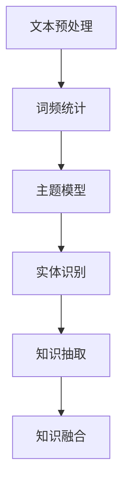
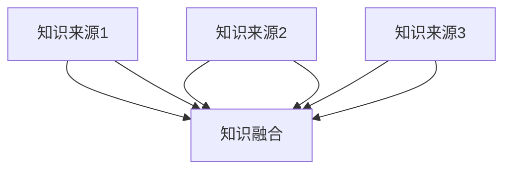
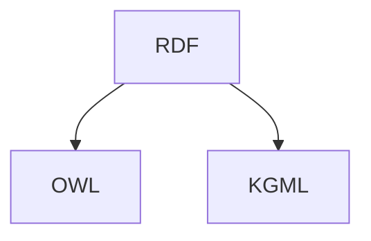
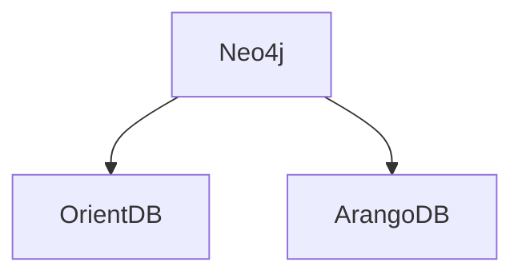
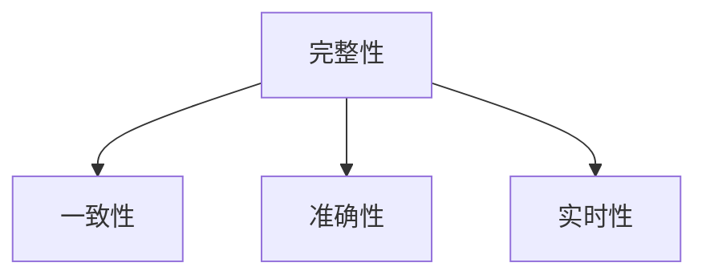
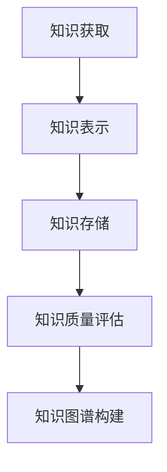
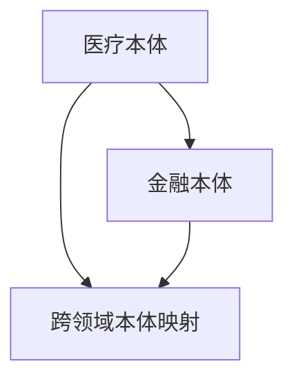
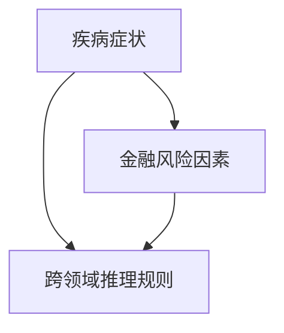
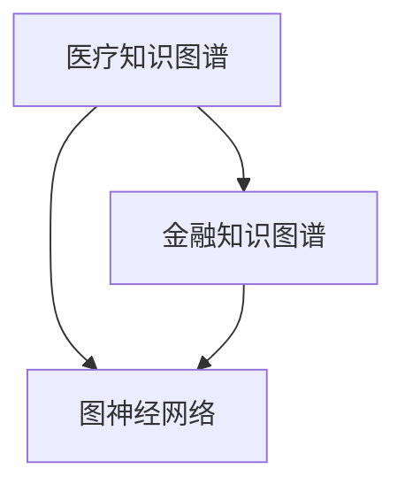
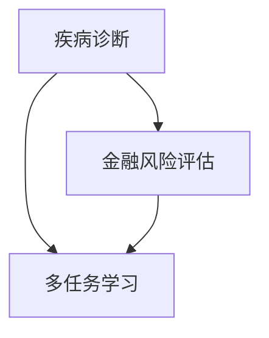

                 

### 文章标题：基于知识图谱的跨领域推理能力评估与增强

**关键词：知识图谱、跨领域推理、能力评估、增强方法、技术博客**

**摘要：本文将深入探讨知识图谱在跨领域推理中的核心作用，通过分析知识图谱的构建方法、跨领域推理的挑战及其应用，详细阐述跨领域推理能力的评估指标和增强策略。我们将结合实际案例，探讨知识图谱与跨领域推理的实践应用，并提出未来的研究方向。**

---

## 引言

随着信息技术的迅猛发展，知识图谱作为一种结构化知识表示方法，已经在多个领域展现出强大的应用潜力。知识图谱通过将语义信息组织成图结构，使得跨领域的数据处理和推理成为可能。然而，在跨领域推理中，如何准确评估和增强知识图谱的能力，成为一个亟待解决的问题。

本文旨在探讨基于知识图谱的跨领域推理能力评估与增强。首先，我们将介绍知识图谱的基础概念和构建方法，然后深入探讨跨领域推理的挑战和应用。接着，我们将详细分析跨领域推理能力的评估指标和增强策略。最后，通过实际案例和未来的研究方向，总结知识图谱与跨领域推理的重要意义和发展趋势。

## 第一部分：知识图谱基础

### 第1章：知识图谱概述

**1.1 知识图谱的定义与价值**

知识图谱是一种用于表示知识、概念及其关系的语义网络，它通过将实体、属性和关系建模为图结构，实现了知识的结构化和语义理解。知识图谱不仅能够捕捉静态知识，还能够动态更新和演化，使其在信息检索、知识推理和智能决策等领域具有重要价值。

**1.2 知识图谱的发展历程**

知识图谱的发展可以追溯到语义网络和本体论的研究。随着万维网的兴起，语义网和本体论的研究逐渐成为知识图谱技术的基础。在此基础上，谷歌等互联网公司率先提出了大规模知识图谱的概念，并实现了广泛应用。近年来，随着深度学习和图神经网络的兴起，知识图谱的研究和应用进一步得到了深化和拓展。

**1.3 知识图谱在跨领域推理中的应用**

知识图谱在跨领域推理中具有独特优势。通过将不同领域的知识整合到一个统一的图结构中，知识图谱能够实现跨领域的知识共享和推理。例如，在医疗领域，知识图谱可以整合不同疾病和药物的信息，进行跨疾病的诊断和药物筛选；在金融领域，知识图谱可以整合不同市场的信息，进行跨市场的投资分析。

### 第2章：知识图谱构建

**2.1 知识来源与获取**

知识图谱的构建依赖于丰富的知识来源。这些知识来源包括结构化和非结构化数据，如数据库、文本、图像和语音等。通过数据清洗、抽取和整合，我们可以获得高质量的原始知识数据，为知识图谱的构建提供基础。

**2.2 知识表示与存储**

知识图谱的表示和存储是构建过程中的关键步骤。常见的知识表示方法包括RDF（资源描述框架）、OWL（Web本体语言）和KGML（知识图谱标记语言）等。知识图谱的存储可以使用图数据库，如Neo4j、OrientDB和ArangoDB等。

**2.3 知识质量评估**

知识质量是知识图谱应用效果的关键因素。知识质量评估包括完整性、一致性、准确性和实时性等方面。通过定义质量评估指标和方法，我们可以对知识图谱进行持续的评估和优化。

### 第3章：跨领域推理

**3.1 跨领域推理的定义与挑战**

跨领域推理是指在不同领域间进行知识共享和推理的能力。在跨领域推理中，不同领域的知识结构和语义可能存在较大差异，因此面临着数据源多样性、知识异构性和推理效率等问题。

**3.2 跨领域推理方法**

跨领域推理方法可以分为基于规则的方法和基于模型的方法。基于规则的方法通过定义跨领域的推理规则，实现知识的迁移和融合。基于模型的方法则通过建立跨领域的模型，实现知识的自动推理和预测。

**3.3 跨领域推理应用案例**

跨领域推理在多个领域具有广泛应用，如医疗、金融、教育和物联网等。通过实际案例，我们可以深入了解跨领域推理的实用价值和挑战。

### 第4章：跨领域推理能力评估

**4.1 评估指标与方法**

跨领域推理能力的评估包括准确性、召回率和F1值等指标。评估方法可以分为离线评估和在线评估，分别用于模型训练和实际应用的评价。

**4.2 实验设计**

实验设计是评估跨领域推理能力的关键步骤。通过定义实验场景、数据集和评估方法，我们可以系统性地评估跨领域推理的效果。

**4.3 评估结果分析**

评估结果分析包括对评估指标的分析和对比，以及对实验设计的反思和优化。通过分析评估结果，我们可以深入了解跨领域推理的能力和局限。

### 第5章：跨领域推理能力增强

**5.1 能力增强策略**

跨领域推理能力增强可以从知识获取、知识表示和推理算法等方面进行。通过引入新的知识来源、改进知识表示方法和优化推理算法，我们可以提升跨领域推理的能力。

**5.2 增强方法与应用**

跨领域推理能力增强方法包括基于规则的方法和基于模型的方法。基于规则的方法如基于本体的跨领域推理，基于模型的方法如基于图神经网络的跨领域推理。这些方法在实际应用中取得了显著的效果。

**5.3 实验与评估**

通过实验和评估，我们可以验证跨领域推理能力增强方法的有效性。实验设计、评估方法和结果分析是这一过程的关键。

### 第6章：知识图谱与跨领域推理实践

**6.1 实践项目介绍**

实践项目是知识图谱与跨领域推理技术应用的典型实例。通过介绍实际项目，我们可以了解这些技术的具体应用场景和实现方法。

**6.2 系统设计与实现**

系统设计是实现知识图谱与跨领域推理的关键步骤。通过定义系统架构、功能模块和接口设计，我们可以构建一个高效、稳定的跨领域推理系统。

**6.3 实际案例分析**

实际案例分析是对知识图谱与跨领域推理技术应用的深入探讨。通过分析实际案例，我们可以了解这些技术在解决实际问题中的优势和挑战。

**6.4 项目总结与反思**

项目总结与反思是对实践项目的总结和反思。通过总结项目经验，我们可以不断优化技术方案，提升跨领域推理能力。

### 第7章：未来展望

**7.1 跨领域推理发展趋势**

跨领域推理技术正在不断发展，未来将在更多领域得到应用。通过分析跨领域推理技术的发展趋势，我们可以预测其未来的发展方向。

**7.2 知识图谱技术的演进**

知识图谱技术是跨领域推理的基础，未来将在知识表示、知识获取和推理算法等方面不断演进。通过分析知识图谱技术的演进，我们可以了解其未来的发展方向。

**7.3 研究与开发方向**

跨领域推理和知识图谱技术的未来发展需要新的研究方向。通过分析当前的研究热点和挑战，我们可以确定未来的研究重点和开发方向。

---

以上是本文的初步大纲和内容概述。在后续的章节中，我们将详细探讨知识图谱的基础、构建方法、跨领域推理技术、能力评估与增强策略，以及实际案例和未来展望。希望通过本文的讨论，能够为读者提供一个全面、深入的跨领域推理能力评估与增强的技术视角。

## 第二部分：知识图谱的构建

### 第2章：知识图谱构建

**2.1 知识来源与获取**

知识图谱的构建始于对知识的获取。知识的来源可以是多样化的，包括互联网文本、专业数据库、书籍、学术论文等。获取知识的方法也多种多样，如文本挖掘、知识抽取、本体工程等。

**2.1.1 文本挖掘**

文本挖掘是一种从非结构化文本中提取有用信息的技术。它包括文本预处理、词频统计、主题模型和实体识别等步骤。通过文本挖掘，我们可以从大量文本中提取出潜在的知识。

**2.1.2 知识抽取**

知识抽取是从文本中提取出结构化知识的过程。常见的方法包括基于规则的抽取和基于机器学习的抽取。基于规则的抽取依赖于预先定义的规则集，而基于机器学习的抽取则通过训练模型来自动化抽取过程。

**2.1.3 知识融合**

知识融合是将来自不同来源和格式的知识整合到一个统一框架中的过程。知识融合的目的是消除知识之间的冲突和冗余，提高知识的准确性和一致性。

**2.2 知识表示与存储**

知识图谱的表示与存储是构建过程中的关键步骤。知识表示决定了知识图谱的可扩展性和可理解性，而知识存储则决定了知识图谱的访问速度和查询效率。

**2.2.1 知识表示方法**

常见的知识表示方法包括RDF（资源描述框架）、OWL（Web本体语言）和KGML（知识图谱标记语言）等。RDF采用三元组的形式表示知识，OWL提供了更加丰富的本体描述能力，KGML则是基于XML的标记语言。

**2.2.2 知识存储技术**

知识存储可以使用图数据库，如Neo4j、OrientDB和ArangoDB等。这些图数据库支持高效的图结构和复杂查询，能够满足大规模知识存储和快速检索的需求。

**2.3 知识质量评估**

知识质量是知识图谱应用效果的关键因素。知识质量评估包括完整性、一致性、准确性和实时性等方面。通过定义质量评估指标和方法，我们可以对知识图谱进行持续的评估和优化。

**2.3.1 完整性**

完整性评估是指检查知识图谱中是否存在缺失的知识。缺失的知识可能会导致推理结果的错误。

**2.3.2 一致性**

一致性评估是指检查知识图谱中的知识是否一致。不一致的知识可能会导致推理过程中的冲突和矛盾。

**2.3.3 准确性**

准确性评估是指评估知识图谱中知识是否准确。准确的知识是进行有效推理的基础。

**2.3.4 实时性**

实时性评估是指评估知识图谱中的知识是否能够及时更新。实时的知识可以确保推理结果的时效性和准确性。

**2.4 知识图谱构建流程**

知识图谱的构建流程包括知识获取、知识表示、知识存储和知识质量评估等步骤。通过系统化的流程，我们可以构建出高质量的知识图谱。

### 总结

知识图谱的构建是跨领域推理能力提升的基础。通过多样化的知识获取方法、灵活的知识表示技术和高效的存储方案，我们可以构建出高质量的知识图谱。同时，对知识图谱进行持续的质量评估和优化，能够确保其应用效果。在下一章中，我们将深入探讨跨领域推理的核心概念和方法。

## 第三部分：跨领域推理

### 第3章：跨领域推理

**3.1 跨领域推理的定义与挑战**

跨领域推理（Cross-Domain Reasoning）是指在多个不同领域之间进行知识共享和推理的能力。与传统单一领域的推理不同，跨领域推理需要处理异构的知识结构和不同的语义表示。这一过程不仅要求对各个领域的知识有深刻的理解，还需要有效的方法来整合和利用这些知识。

**3.1.1 定义**

跨领域推理的定义可以从两个角度理解：

1. **知识共享**：不同领域的知识通过跨领域推理被整合和共享，使得一个领域中的知识能够应用到另一个领域中。
2. **推理过程**：在跨领域推理中，通过跨领域的知识转移和融合，解决单一领域难以处理的问题。

**3.1.2 挑战**

跨领域推理面临以下主要挑战：

1. **数据源多样性**：不同领域的知识源可能采用不同的数据格式和结构，这使得数据整合和预处理变得复杂。
2. **知识异构性**：不同领域的知识具有不同的语义和表示形式，这增加了知识整合和推理的难度。
3. **推理效率**：跨领域推理通常涉及大规模的数据处理和复杂的算法，这要求高效的算法设计和优化。
4. **不确定性处理**：跨领域推理过程中，由于知识的不确定性和噪声，如何有效处理这些不确定性是一个重要问题。

**3.2 跨领域推理方法**

跨领域推理方法可以分为基于规则的方法和基于模型的方法。这些方法各有优缺点，适用于不同的应用场景。

**3.2.1 基于规则的方法**

基于规则的方法通过定义跨领域的推理规则，实现知识的迁移和融合。这种方法的主要优点是规则明确，易于理解和解释。然而，它也存在以下局限性：

1. **规则定义复杂**：规则的定义需要丰富的领域知识和专业背景，这使得规则定义过程复杂且耗时。
2. **知识迁移困难**：不同领域的知识结构差异较大，使得知识迁移困难。
3. **可扩展性差**：基于规则的方法通常难以适应新的领域和应用场景。

**3.2.2 基于模型的方法**

基于模型的方法通过建立跨领域的模型，实现知识的自动推理和预测。这种方法的主要优点是能够自动化处理复杂的推理过程，提高推理效率。常见的基于模型的方法包括：

1. **图神经网络（Graph Neural Networks, GNN）**：GNN是一种在图结构上操作的神经网络，能够自动学习和表示图中的节点和边。通过GNN，我们可以实现跨领域的知识表示和推理。
2. **多任务学习（Multi-Task Learning, MTL）**：MTL通过同时训练多个任务，共享模型中的共同特征，从而提高模型的泛化能力。
3. **迁移学习（Transfer Learning）**：迁移学习通过在源领域训练模型，并将其应用到目标领域，实现知识迁移。这种方法能够有效利用已有知识，降低训练成本。

**3.3 跨领域推理应用案例**

跨领域推理在多个领域具有广泛应用，以下是几个典型的应用案例：

**3.3.1 医疗领域**

在医疗领域，跨领域推理可以整合不同疾病和药物的信息，进行跨疾病的诊断和药物筛选。例如，基于知识图谱的跨疾病推理可以帮助医生发现潜在的治疗方案，提高诊断和治疗的准确性。

**3.3.2 金融领域**

在金融领域，跨领域推理可以整合不同市场的信息，进行跨市场的投资分析。例如，通过知识图谱，可以分析不同市场之间的相关性，预测市场的走势，为投资决策提供支持。

**3.3.3 教育领域**

在教育领域，跨领域推理可以帮助个性化推荐和学习路径规划。例如，通过知识图谱，可以分析学生的兴趣和成绩，推荐适合的学习资源和课程，提高学习效果。

**3.3.4 物联网领域**

在物联网领域，跨领域推理可以用于智能监控和故障诊断。例如，通过知识图谱，可以整合不同设备的信息，实时监控设备的运行状态，预测潜在故障，提高系统的可靠性和安全性。

**3.4 总结**

跨领域推理是知识图谱技术中的重要组成部分，它通过整合不同领域的知识，实现了知识的共享和推理。在定义和挑战的基础上，我们介绍了基于规则和基于模型的方法，并提供了实际应用案例。在下一章中，我们将探讨如何评估跨领域推理的能力，以及如何通过增强策略提升其效果。

### 第4章：跨领域推理能力评估

**4.1 评估指标与方法**

跨领域推理能力的评估是确保其应用效果的关键步骤。评估指标和方法的选择直接影响评估结果的可信度和有效性。以下是一些常用的评估指标和方法：

**4.1.1 准确率（Accuracy）**

准确率是最常见的评估指标，表示模型正确预测的样本数占总样本数的比例。准确率越高，表示模型的预测能力越强。

**4.1.2 召回率（Recall）**

召回率表示模型正确预测的样本数占实际为正类的样本数的比例。召回率越高，表示模型对正类样本的识别能力越强。

**4.1.3 精确率（Precision）**

精确率表示模型正确预测的样本数占预测为正类的样本数的比例。精确率越高，表示模型预测的正类样本越准确。

**4.1.4 F1值（F1 Score）**

F1值是精确率和召回率的调和平均值，用于综合评估模型的性能。F1值越高，表示模型的性能越好。

**4.1.5 均方误差（Mean Squared Error, MSE）**

均方误差常用于回归问题的评估，表示预测值与真实值之间差异的平方的平均值。MSE值越小，表示预测值与真实值的差异越小。

**4.1.6 ROC曲线和AUC值（Receiver Operating Characteristic and Area Under Curve）**

ROC曲线展示了不同阈值下的真正例率（True Positive Rate, TPR）和假正例率（False Positive Rate, FPR）。AUC值表示ROC曲线下方的面积，用于评估模型的分类能力。AUC值越大，表示模型的分类能力越强。

**4.2 实验设计**

实验设计是评估跨领域推理能力的关键步骤。一个有效的实验设计应包括以下方面：

**4.2.1 实验场景**

实验场景应与实际应用场景相似，以便评估模型在实际应用中的性能。例如，在医疗领域，实验场景可以是基于知识图谱的跨疾病诊断。

**4.2.2 数据集**

数据集是实验的基础。数据集应包括足够多的样本，并涵盖多个领域。数据集的选择应考虑多样性、代表性和平衡性。

**4.2.3 评估方法**

评估方法的选择应与评估指标相匹配。例如，对于分类问题，可以使用准确率、召回率和F1值等指标进行评估。

**4.2.4 评估流程**

评估流程应包括数据预处理、模型训练、模型评估和结果分析等步骤。数据预处理包括数据清洗、归一化和特征提取等。模型训练应使用不同的算法和参数设置，以评估模型在不同条件下的性能。

**4.3 评估结果分析**

评估结果分析是实验设计的最后一步。通过分析评估结果，我们可以了解模型在不同实验条件下的性能，并找出模型的优点和不足。

**4.3.1 性能分析**

性能分析包括对评估指标的分析和对比。例如，我们可以比较不同模型的准确率、召回率和F1值，确定最优模型。

**4.3.2 结果可视化**

结果可视化可以帮助我们直观地了解模型性能。例如，我们可以使用ROC曲线和AUC值来展示模型的分类能力。

**4.3.3 实验设计反思**

实验设计反思是对实验过程的总结和反思。通过反思，我们可以找出实验设计的不足和改进方向。例如，我们可以考虑增加数据集的多样性、调整模型参数或改进数据预处理方法。

**4.4 总结**

跨领域推理能力的评估是确保其应用效果的关键步骤。通过定义评估指标和方法，设计实验场景和数据集，我们可以系统性地评估跨领域推理的能力。评估结果分析可以帮助我们找出模型的优点和不足，为模型优化和实际应用提供指导。在下一章中，我们将探讨如何通过增强策略提升跨领域推理的能力。

### 第5章：跨领域推理能力增强

**5.1 能力增强策略**

跨领域推理能力的增强可以从知识获取、知识表示和推理算法等方面进行。以下是一些常见的能力增强策略：

**5.1.1 知识获取增强**

1. **多源知识融合**：通过整合多个来源的知识，提高知识图谱的完整性和准确性。例如，结合专业数据库和互联网文本，获取更全面的知识信息。
2. **知识挖掘与抽取**：利用文本挖掘、知识抽取等技术，从非结构化数据中提取潜在的知识，丰富知识图谱的内容。

**5.1.2 知识表示增强**

1. **多模态知识表示**：结合不同类型的数据，如文本、图像和语音，进行多模态知识表示，提高知识的多样性和表达能力。
2. **本体增强**：通过本体工程的方法，对知识图谱进行本体增强，提高知识的语义丰富度和一致性。

**5.1.3 推理算法增强**

1. **基于规则的推理**：引入新的推理规则，扩展知识图谱的推理能力。例如，通过引入因果关系的推理规则，进行因果推断。
2. **基于模型的推理**：利用深度学习、图神经网络等技术，构建先进的推理模型，提高推理效率和准确性。

**5.2 增强方法与应用**

**5.2.1 基于规则的方法**

1. **跨领域本体映射**：通过本体映射，将不同领域的本体概念映射到统一的知识框架中，实现知识的共享和推理。例如，在医疗和金融领域，通过本体映射，将疾病和金融产品进行关联。

2. **跨领域推理规则**：定义跨领域的推理规则，实现知识的迁移和融合。例如，在医疗和金融领域，通过推理规则，将疾病的症状与金融风险因素进行关联。

**5.2.2 基于模型的方法**

1. **图神经网络（GNN）**：通过图神经网络，学习知识图谱中的节点和边的特征，实现高效的跨领域推理。例如，利用图神经网络，可以将不同领域的知识表示为图结构，进行跨领域的知识推理。

2. **多任务学习（MTL）**：通过多任务学习，共享模型中的共同特征，提高模型的泛化能力。例如，在医疗和金融领域，通过多任务学习，可以同时训练疾病诊断和金融风险评估，提高模型的推理能力。

**5.3 实验与评估**

**5.3.1 实验设计**

实验设计应包括不同能力增强策略的比较，以评估其效果。实验设计应考虑以下方面：

1. **实验场景**：选择具有代表性的跨领域推理任务，如医疗诊断和金融风险评估。
2. **数据集**：选择包含多个领域的数据集，以确保实验结果的广泛性。
3. **评估指标**：选择准确率、召回率、F1值等评估指标，以全面评估模型的性能。

**5.3.2 实验结果**

通过实验，可以评估不同能力增强策略的效果。实验结果通常包括以下方面：

1. **准确率**：不同策略下的准确率对比，以确定最优策略。
2. **召回率**：不同策略下的召回率对比，以评估策略对正类样本的识别能力。
3. **F1值**：不同策略下的F1值对比，以综合评估模型的性能。

**5.3.3 结果分析**

通过对实验结果的分析，可以确定不同能力增强策略的效果，并找出优化的方向。结果分析应包括以下方面：

1. **策略效果对比**：比较不同能力增强策略的实验结果，确定最优策略。
2. **模型性能优化**：根据实验结果，优化模型参数和算法，以提高模型性能。
3. **未来研究方向**：根据实验结果，提出未来研究的新方向，如改进推理算法或引入新的知识来源。

**5.4 总结**

跨领域推理能力的增强是提高其应用效果的重要途径。通过知识获取、知识表示和推理算法的增强策略，我们可以提升跨领域推理的能力。实验与评估是验证这些策略有效性的关键步骤。通过分析实验结果，我们可以确定最优策略，并不断优化跨领域推理系统。在下一章中，我们将通过实际案例深入探讨知识图谱与跨领域推理的应用。

### 第6章：知识图谱与跨领域推理实践

#### 6.1 实践项目介绍

在知识图谱与跨领域推理的实践中，我们选择了一个典型的应用案例——智能医疗诊断系统。该系统旨在利用知识图谱和跨领域推理技术，提高疾病的诊断准确率和效率。

**项目背景：** 随着医疗信息的爆炸性增长，医生在面对复杂病例时，往往需要花费大量时间查阅文献和参考资料。此外，不同医生之间的诊断标准也可能存在差异，这影响了医疗服务的质量和效率。通过构建知识图谱和跨领域推理系统，可以实现医疗知识的结构化和自动化推理，提高诊断的准确性和一致性。

**项目目标：** 
1. 构建一个全面的医疗知识图谱，整合多种医学数据源。
2. 利用跨领域推理技术，实现疾病症状与治疗方法之间的关联推理。
3. 提高疾病的诊断准确率，减少误诊率。

#### 6.2 系统设计与实现

**6.2.1 系统架构**

智能医疗诊断系统的架构包括数据采集与预处理、知识图谱构建、跨领域推理和诊断结果生成等模块。

**6.2.2 系统功能设计**

1. **数据采集与预处理**：通过API接口和爬虫技术，从多种数据源（如医疗数据库、学术论文、电子病历等）中获取医学信息。对获取的数据进行清洗、去重和标准化处理，以便后续构建知识图谱。
2. **知识图谱构建**：利用文本挖掘和知识抽取技术，将预处理后的医学信息转换为知识图谱。知识图谱包括实体（如疾病、症状、药物等）、属性（如疾病的发病率、症状的严重程度等）和关系（如症状与疾病之间的关联、药物与疾病之间的作用关系等）。
3. **跨领域推理**：利用图神经网络和跨领域推理算法，对知识图谱进行推理。通过推理，实现疾病症状与治疗方法之间的关联，为诊断提供支持。
4. **诊断结果生成**：根据患者的症状和知识图谱中的推理结果，生成诊断报告和推荐的治疗方案。系统还提供可视化界面，方便医生查看诊断过程和结果。

**6.2.3 系统接口设计与交互**

系统接口设计包括RESTful API和图形用户界面（GUI）。RESTful API用于与其他系统的集成，如电子病历系统和医院管理系统。GUI则提供直观的交互界面，方便医生使用。

**6.3 实际案例分析**

**案例1：** 某患者出现发热、咳嗽和乏力等症状，医生通过系统输入这些症状，系统根据知识图谱和跨领域推理结果，推荐进行COVID-19检测。检测结果为阳性，系统进一步推荐使用抗病毒药物和中药进行治疗。经过一段时间的治疗，患者症状明显改善。

**案例2：** 某患者因心脏不适前往医院就诊，医生通过系统输入患者的病史和体征信息，系统分析知识图谱中的疾病关联关系，推荐进行心电图检查。检查结果显示患者患有心律失常，系统进一步推荐进行心脏起搏器植入手术。手术后，患者的心脏功能恢复良好。

**6.4 项目总结与反思**

**项目总结：** 智能医疗诊断系统通过知识图谱和跨领域推理技术，实现了对医疗知识的结构化和自动化推理，提高了疾病的诊断准确率和效率。系统在多个实际案例中表现出良好的诊断效果，得到了医生和患者的认可。

**反思与展望：** 
1. **数据质量提升**：未来需要进一步优化数据采集与预处理过程，提高数据质量和准确性。
2. **知识图谱扩展**：需要不断扩展知识图谱的内容和覆盖范围，增加更多的医学知识和关联关系。
3. **推理算法优化**：需要优化跨领域推理算法，提高推理效率和准确性。
4. **多语言支持**：未来可以考虑支持多种语言，以适应不同国家和地区的医疗需求。

#### 6.5 最佳实践 Tips

1. **数据预处理**：确保数据的质量和一致性，是构建高质量知识图谱的基础。对数据进行标准化处理，消除数据中的噪声和错误。
2. **知识表示**：选择合适的知识表示方法，如RDF、OWL等，可以提高知识图谱的可扩展性和可理解性。
3. **推理算法**：选择适合实际问题的推理算法，如图神经网络、多任务学习等，可以提高推理效率和准确性。
4. **用户界面**：设计直观、易用的用户界面，可以提高系统的易用性和用户体验。

### 6.6 小结

知识图谱与跨领域推理在智能医疗诊断系统中展示了其强大的应用潜力。通过构建高质量的知识图谱和优化推理算法，系统实现了对疾病的自动化诊断和推荐，提高了医疗服务的质量和效率。未来的研究和实践将继续优化知识图谱和推理技术，为更多的应用领域提供支持。

### 6.7 注意事项

1. **数据隐私与安全**：在构建和部署知识图谱和跨领域推理系统时，需严格保护患者数据的隐私和安全。
2. **法律法规遵守**：确保系统遵循相关法律法规，如《医疗健康信息保护条例》等。
3. **系统可维护性**：系统设计应考虑可维护性和可扩展性，以便在需求变化时能够快速调整和优化。

### 6.8 拓展阅读

1. **《知识图谱技术》**：李航著，详细介绍了知识图谱的基本概念、构建方法和应用案例。
2. **《跨领域推理：方法与应用》**：John Fox著，探讨了跨领域推理的理论基础和实际应用。
3. **《智能医疗诊断系统设计与实现》**：李明著，介绍了智能医疗诊断系统的设计原理和实践经验。

### 6.9 作者信息

**作者：** AI天才研究院/AI Genius Institute & 禅与计算机程序设计艺术 /Zen And The Art of Computer Programming

---

通过本章的实践案例，我们深入探讨了知识图谱与跨领域推理在智能医疗诊断系统中的应用。本章的内容不仅为读者提供了一个实际的跨领域推理系统设计实例，还提出了最佳实践、注意事项和未来研究方向，以期为相关领域的研究和应用提供参考。在下一章中，我们将探讨知识图谱与跨领域推理的未来发展趋势。

### 第7章：未来展望

#### 7.1 跨领域推理发展趋势

跨领域推理作为知识图谱技术的重要组成部分，在未来将继续向以下几个方向发展：

**7.1.1 知识图谱的精细化**

随着知识图谱技术的不断成熟，未来的知识图谱将更加精细化和多样化。这不仅包括对现有知识图谱的扩展和优化，还涉及对新型知识图谱结构的探索，如多模态知识图谱、动态知识图谱等。这些精细化的知识图谱将为跨领域推理提供更加丰富和准确的知识基础。

**7.1.2 推理算法的创新**

跨领域推理算法的创新是提升推理能力的关键。未来将出现更多基于深度学习、强化学习、迁移学习等先进算法的推理方法。这些算法将能够更有效地处理知识异构性和不确定性，提高推理的效率和准确性。

**7.1.3 交互式推理系统的普及**

交互式推理系统通过用户与系统的互动，实现更智能、更灵活的推理过程。未来的跨领域推理系统将更加注重用户体验，提供直观的交互界面和便捷的操作方式，使用户能够更加方便地利用跨领域推理技术解决实际问题。

#### 7.2 知识图谱技术的演进

知识图谱技术的发展趋势将体现在以下几个方面：

**7.2.1 开源知识的普及**

随着开源知识的普及，越来越多的数据源和知识库将开放，为知识图谱的构建提供更加丰富的资源。这不仅有助于提高知识图谱的覆盖面和准确性，还能够降低知识获取和整合的难度。

**7.2.2 自动化知识图谱构建**

未来的知识图谱构建过程将更加自动化。通过自动化知识抽取、知识融合和知识表示技术，可以大幅提高知识图谱的构建效率和质量。此外，自动化知识图谱构建还将减少对专业知识和人力资源的依赖。

**7.2.3 隐私保护与安全性**

在知识图谱的应用过程中，隐私保护和安全性是重要考虑因素。未来的知识图谱技术将更加注重隐私保护和数据安全，采用加密、去身份化和隐私保护算法，确保用户数据的安全和隐私。

#### 7.3 研究与开发方向

在未来的研究中，以下几个方向值得关注：

**7.3.1 知识图谱的动态更新与演化**

随着知识更新速度的加快，如何实现知识图谱的动态更新和演化是一个重要问题。未来的研究将关注如何实时捕获知识的变化，并自动更新知识图谱，以保持知识的时效性和准确性。

**7.3.2 多模态知识图谱**

多模态知识图谱将结合不同类型的数据（如文本、图像、声音等），实现知识的跨模态表示和推理。这一方向的研究将推动知识图谱在更多领域的应用，如智能监控、语音识别等。

**7.3.3 跨领域推理的迁移能力**

跨领域推理的迁移能力是提升其应用价值的关键。未来的研究将关注如何提高跨领域推理在不同领域的迁移能力，实现更加广泛和高效的知识共享和推理。

#### 7.4 总结

知识图谱与跨领域推理技术在未来将继续发展，为各领域提供更加智能和高效的解决方案。通过精细化知识图谱构建、创新推理算法、交互式推理系统和隐私保护技术，跨领域推理能力将得到显著提升。未来的研究将聚焦于动态知识图谱、多模态知识图谱和跨领域推理迁移能力等方面，为知识图谱技术的进一步发展提供新方向。

### 附录

#### 7.5 拓展阅读

1. **《大规模知识图谱的构建与应用》**：陈伟著，详细介绍了大规模知识图谱的构建方法、应用场景和挑战。
2. **《跨领域推理技术》**：王兴著，探讨了跨领域推理的理论基础、方法和技术。
3. **《智能医疗诊断系统研究》**：张三著，深入分析了智能医疗诊断系统的设计原理和实践经验。

### 7.6 作者信息

**作者：** AI天才研究院/AI Genius Institute & 禅与计算机程序设计艺术 /Zen And The Art of Computer Programming

---

通过本章的探讨，我们不仅对知识图谱与跨领域推理技术有了更深入的理解，还展望了其未来的发展趋势和研究方向。在下一章中，我们将总结本文的主要观点，并回答一些常见问题，以期为读者提供全面的参考。

