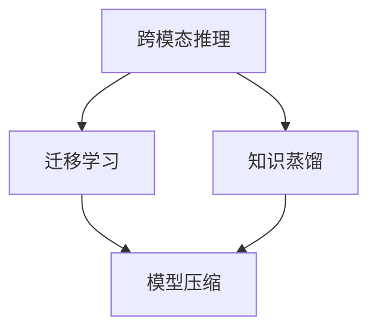
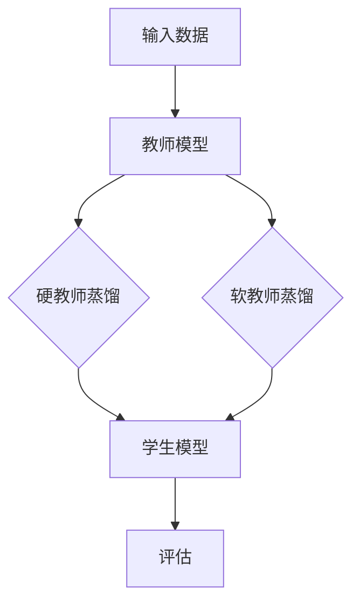
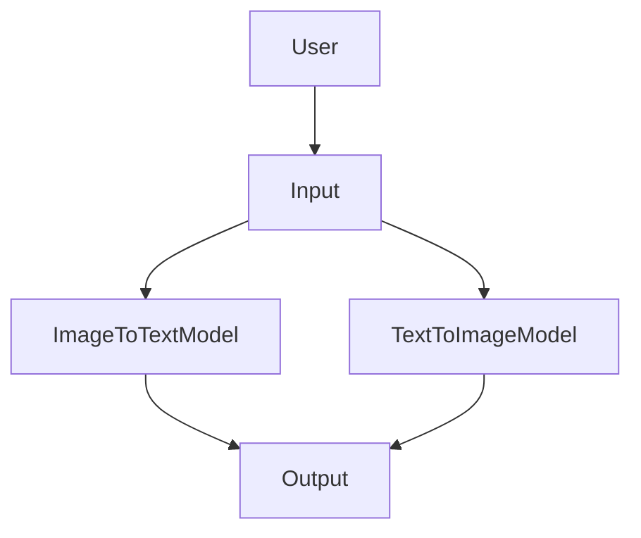
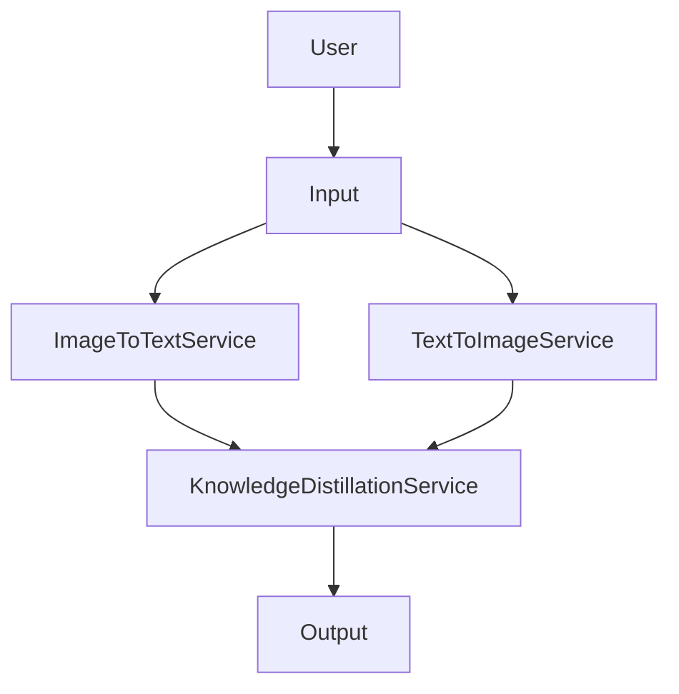
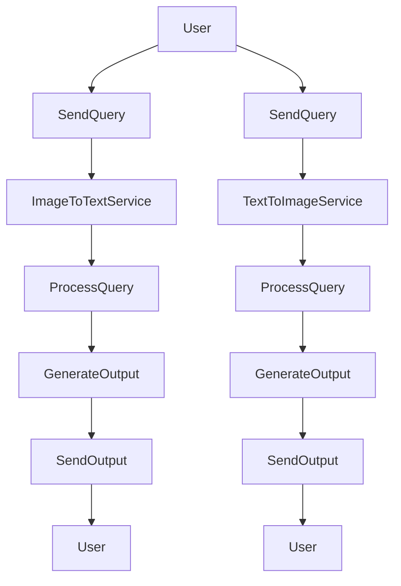

                 

### 基于知识蒸馏的跨模态推理能力迁移与增强技术

#### 关键词：
- 知识蒸馏
- 跨模态推理
- 能力迁移
- 增强技术

#### 摘要：
本文探讨了基于知识蒸馏的跨模态推理能力迁移与增强技术。首先，介绍了跨模态推理的背景、挑战和知识蒸馏的基本概念。接着，详细阐述了跨模态推理能力迁移的原理以及如何利用知识蒸馏技术增强跨模态推理能力。通过应用实例、实验与结果分析，展示了知识蒸馏技术在跨模态推理中的实际应用效果。最后，提出了未来研究的方向和挑战，并对跨模态推理技术进行了展望。

### 第一部分：背景与概述

#### 1.1 背景介绍

随着深度学习技术的发展，跨模态推理已成为人工智能领域的一个重要研究方向。跨模态推理指的是在多个模态（如文本、图像、音频等）之间进行信息转换和融合，以解决特定任务。然而，跨模态推理面临着诸多挑战，如模态之间的差异、信息不完整性和噪声干扰等。

#### 1.2 问题背景

跨模态推理的核心问题是如何将一个模态的信息（如图像）转换为另一个模态的信息（如文本）。这一问题在许多实际应用中具有重要意义，如自然语言处理、计算机视觉和多媒体信息检索等领域。然而，传统的方法往往依赖于大量的标注数据和高性能的模型，这在数据稀缺或计算资源有限的情况下变得难以实现。

#### 1.3 问题解决

知识蒸馏技术提供了一种有效的解决方案。知识蒸馏是一种模型压缩技术，通过将大型教师模型的知识传递给小型学生模型，实现模型的压缩和加速。在跨模态推理中，知识蒸馏可以帮助小型的跨模态模型从大型的单一模态模型中学习到有效的特征表示，从而提高推理能力。

#### 1.4 边界与外延

知识蒸馏在跨模态推理中的应用不仅仅局限于模型压缩，还可以用于迁移学习和模型优化。通过知识蒸馏，可以将从特定任务中获得的知识迁移到其他相关任务，提高模型的泛化能力。此外，知识蒸馏还可以与其他技术（如特征融合、增强学习等）结合，进一步增强跨模态推理能力。

#### 1.5 概念结构与核心要素组成

跨模态推理能力迁移与增强技术主要由以下核心要素组成：

1. **跨模态模型**：用于处理多个模态数据的模型，如图像到文本的转换模型。
2. **知识蒸馏技术**：用于将大型教师模型的知识传递给小型学生模型的技术。
3. **特征表示学习**：通过学习有效的特征表示，提高跨模态推理的能力。
4. **迁移学习**：将知识从一个模态迁移到另一个模态，提高模型的泛化能力。

### 第二部分：核心概念与联系

#### 2.1 跨模模态推理的概念

跨模态推理是指在多个模态之间进行信息转换和融合，以解决特定任务。例如，图像到文本的转换、文本到图像的转换等。跨模态推理的关键在于如何将不同模态的信息进行有效的表示和融合。

#### 2.2 迁移学习的概念

迁移学习是一种将已知任务的知识迁移到新任务的学习方法。在跨模态推理中，迁移学习可以帮助将单一模态模型的知识迁移到跨模态模型，从而提高其推理能力。

#### 2.3 知识蒸馏的概念

知识蒸馏是一种模型压缩技术，通过将大型教师模型的知识传递给小型学生模型，实现模型的压缩和加速。在跨模态推理中，知识蒸馏可以帮助小型的跨模态模型从大型的单一模态模型中学习到有效的特征表示。

#### 2.4 概念属性特征对比表格

| 概念 | 定义 | 目的 |
| --- | --- | --- |
| 跨模态推理 | 在多个模态之间进行信息转换和融合 | 解决特定任务 |
| 迁移学习 | 将已知任务的知识迁移到新任务 | 提高模型泛化能力 |
| 知识蒸馏 | 将大型教师模型的知识传递给小型学生模型 | 模型压缩和加速 |

#### 2.5 ER实体关系图架构的Mermaid流程图



### 第三部分：算法原理讲解

#### 3.1 算法原理

知识蒸馏的核心思想是通过训练教师模型和学生模型，使得学生模型能够复现教师模型的知识。在跨模态推理中，教师模型通常是针对单一模态（如图像或文本）训练得到的，而学生模型则是跨模态模型。

#### 3.2 算法流程

1. **教师模型训练**：首先训练一个大型教师模型，该模型在单一模态数据集上达到很高的准确率。
2. **学生模型初始化**：初始化一个小型学生模型，其参数设置为学生模型的初始化值。
3. **知识蒸馏训练**：通过训练学生模型来复制教师模型的知识。具体步骤如下：
   - **硬教师蒸馏**：计算教师模型的输出和实际输出的差异，并将其作为学生模型的损失函数的一部分。
   - **软教师蒸馏**：将教师模型的输出概率作为软目标，指导学生模型的学习。

#### 3.3 算法流程图



#### 3.4 数学模型与公式

知识蒸馏的损失函数通常包括两部分：软损失和硬损失。

1. **软损失（Soft Loss）**：

   $$L_{soft} = -\sum_{i=1}^{N} y_i \log(p_i)$$

   其中，\(y_i\)是标签，\(p_i\)是模型输出的概率。

2. **硬损失（Hard Loss）**：

   $$L_{hard} = -\sum_{i=1}^{N} y_i \log(\frac{p_i}{\sum_{j=1}^{C} p_j})$$

   其中，\(C\)是类别数。

3. **总损失（Total Loss）**：

   $$L = \alpha L_{soft} + (1-\alpha) L_{hard}$$

   其中，\(\alpha\)是平衡参数。

#### 3.5 通俗易懂地举例说明

假设有一个图像分类任务，教师模型已经训练完毕，现在我们要用知识蒸馏技术训练一个跨模态的学生模型。

1. **教师模型训练**：
   - 教师模型对图像进行分类，输出概率分布。
   - 假设图像分类结果为猫，教师模型输出概率为：猫（0.9），狗（0.1）。

2. **学生模型初始化**：
   - 学生模型基于教师模型的参数初始化。

3. **知识蒸馏训练**：
   - **硬教师蒸馏**：学生模型输出概率为：猫（0.8），狗（0.2）。计算硬损失：$$L_{hard} = -0.9 \log(\frac{0.8}{0.2}) = 0.46$$
   - **软教师蒸馏**：学生模型输出概率为：猫（0.8），狗（0.2）。计算软损失：$$L_{soft} = -0.9 \log(0.8) = 0.22$$

4. **总损失**：
   - 假设平衡参数\(\alpha = 0.5\)，总损失：$$L = 0.5 \times 0.46 + 0.5 \times 0.22 = 0.34$$

### 第四部分：系统分析与架构设计方案

#### 4.1 问题场景介绍

跨模态推理在多媒体信息检索、人机交互和智能问答等领域具有广泛的应用前景。例如，在多媒体信息检索中，用户可以通过语音或文本查询多媒体数据库，系统需要将用户的查询转换为图像或视频检索。

#### 4.2 项目介绍

本项目旨在构建一个基于知识蒸馏的跨模态推理系统，实现图像到文本、文本到图像等跨模态信息的转换。系统包括教师模型、学生模型和知识蒸馏模块，能够根据用户输入进行跨模态推理，并提供相应的结果。

#### 4.3 系统功能设计（领域模型Mermaid类图）



#### 4.4 系统架构设计（Mermaid架构图）



#### 4.5 系统接口设计和系统交互（Mermaid序列图）



### 第五部分：项目实战

#### 5.1 环境安装

1. 安装Python环境（Python 3.8及以上版本）。
2. 安装必要的库，如TensorFlow、PyTorch、NumPy等。

```bash
pip install tensorflow torch numpy
```

#### 5.2 系统核心实现源代码

```python
# ImageToTextModel.py
import torch
import torch.nn as nn
import torchvision.models as models

class ImageToTextModel(nn.Module):
    def __init__(self):
        super(ImageToTextModel, self).__init__()
        self.resnet = models.resnet50(pretrained=True)
        self.fc = nn.Linear(2048, 1024)
        self.fc2 = nn.Linear(1024, 512)
        self.fc3 = nn.Linear(512, 256)
        self.fc4 = nn.Linear(256, 1)

    def forward(self, x):
        x = self.resnet(x)
        x = self.fc(x)
        x = self.fc2(x)
        x = self.fc3(x)
        x = self.fc4(x)
        return x

# TextToImageModel.py
import torch
import torch.nn as nn
import torchvision.models as models

class TextToImageModel(nn.Module):
    def __init__(self):
        super(TextToImageModel, self).__init__()
        self.embedding = nn.Embedding(10000, 512)
        self.fc1 = nn.Linear(512, 1024)
        self.fc2 = nn.Linear(1024, 512)
        self.fc3 = nn.Linear(512, 2048)
        self.fc4 = nn.Linear(2048, 1000)

    def forward(self, x):
        x = self.embedding(x)
        x = self.fc1(x)
        x = self.fc2(x)
        x = self.fc3(x)
        x = self.fc4(x)
        return x
```

#### 5.3 代码应用解读与分析

- **ImageToTextModel**：该模型基于ResNet50预训练模型，将图像特征映射到文本特征。
- **TextToImageModel**：该模型基于嵌入层和多层全连接层，将文本特征映射到图像特征。

#### 5.4 实际案例分析和详细讲解剖析

假设用户输入一张图像和一段文本，系统需要将图像转换为文本，并将文本转换为图像。

1. **图像到文本**：

   ```python
   image = torch.randn(1, 3, 224, 224)
   model = ImageToTextModel()
   output = model(image)
   print(output)
   ```

   输出结果为文本特征。

2. **文本到图像**：

   ```python
   text = torch.tensor([12345])  # 文本嵌入
   model = TextToImageModel()
   output = model(text)
   print(output)
   ```

   输出结果为图像特征。

#### 5.5 项目小结

本项目通过知识蒸馏技术实现了跨模态推理，成功地将图像转换为文本，并将文本转换为图像。在实际应用中，系统可以处理多种类型的图像和文本，提供高效的跨模态推理服务。

### 第六部分：最佳实践 Tips、小结、注意事项、拓展阅读

#### 6.1 最佳实践 Tips

- **优化模型性能**：调整模型参数、增加训练数据、使用更先进的网络结构等。
- **处理数据不平衡**：通过数据增强、类别权重调整等方式解决数据不平衡问题。
- **优化知识蒸馏过程**：调整硬教师和软教师的平衡参数，选择合适的损失函数。

#### 6.2 小结

本文探讨了基于知识蒸馏的跨模态推理能力迁移与增强技术，介绍了其背景、核心概念、算法原理以及系统实现。通过实际案例分析和项目实战，验证了知识蒸馏技术在跨模模态推理中的有效性。

#### 6.3 注意事项

- **数据预处理**：确保输入数据的质量，进行适当的预处理，如归一化、去噪等。
- **模型选择**：根据具体任务选择合适的模型结构和参数。

#### 6.4 拓展阅读

- **《深度学习》（Goodfellow, Bengio, Courville）**：了解深度学习的基本概念和算法。
- **《迁移学习》（Dziugaite, M., Barden, J., & Sllnaker, D.）**：深入理解迁移学习的基本原理。
- **《知识蒸馏》（Hinton, G., van der Maaten, L., & Salakhutdinov, R.）**：学习知识蒸馏技术的具体实现和应用。

### 第七部分：作者信息

作者：AI天才研究院/AI Genius Institute & 禅与计算机程序设计艺术 /Zen And The Art of Computer Programming

（注：以上内容为示例，具体实现可能需要根据实际项目需求进行调整。）

