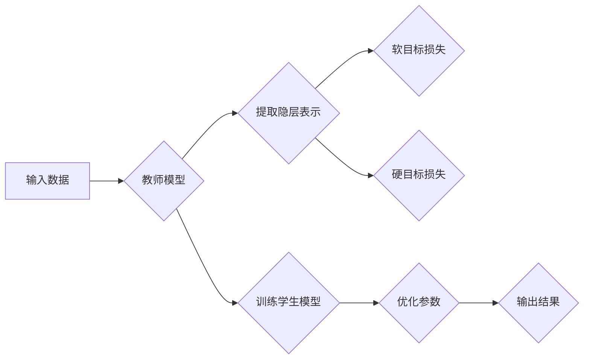
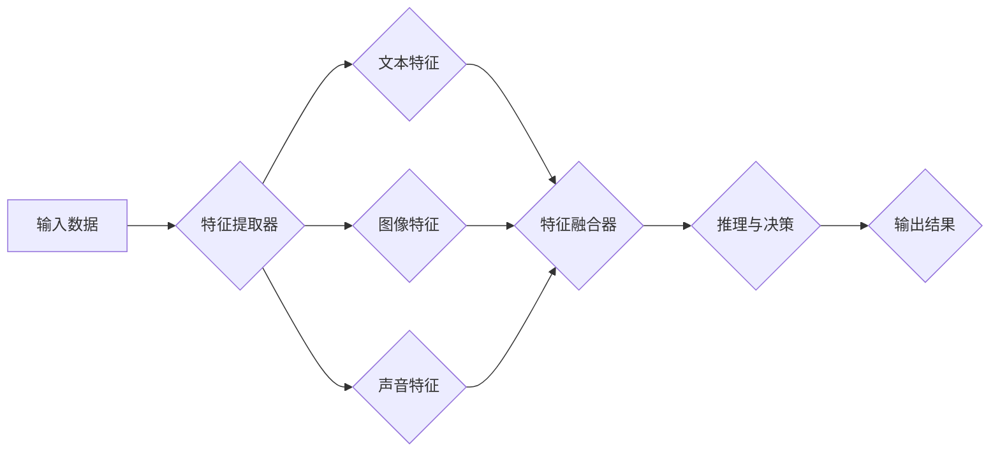
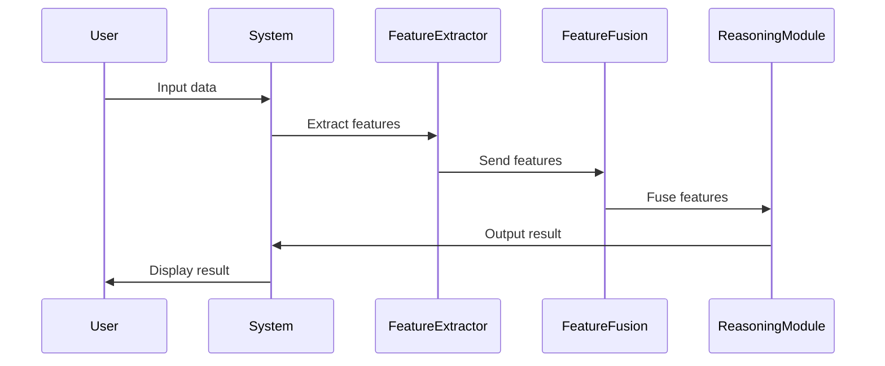

                 

# 基于知识蒸馏的跨模态推理能力迁移技术

## 关键词：
知识蒸馏、跨模态推理、迁移学习、算法实现、系统架构

## 摘要：
本文旨在探讨基于知识蒸馏的跨模态推理能力迁移技术。通过介绍知识蒸馏和跨模态推理的基本概念，阐述其在当前人工智能领域的重要性。文章将深入分析知识蒸馏和跨模态推理的结合原理，以及如何通过数学模型和算法实现跨模态推理能力迁移。此外，还将详细介绍一个具体的项目实战案例，展示知识蒸馏与跨模态推理在实际应用中的效果。最后，对本文进行总结，并提出未来可能的研究方向和改进点。

## 目录

1. **知识蒸馏与跨模态推理概述**
   - 1.1 知识蒸馏的定义与背景
   - 1.2 跨模态推理的定义与挑战
   - 1.3 知识蒸馏与跨模态推理的结合

2. **核心概念与联系**
   - 2.1 知识蒸馏算法原理
   - 2.2 跨模态推理算法原理
   - 2.3 概念属性特征对比表格
   - 2.4 ER实体关系图架构

3. **算法原理讲解**
   - 3.1 知识蒸馏算法流程图
   - 3.2 跨模态推理算法流程图
   - 3.3 算法原理的数学模型和公式
   - 3.4 Python代码实现示例

4. **系统分析与架构设计方案**
   - 4.1 问题场景介绍
   - 4.2 系统功能设计
   - 4.3 系统架构设计
   - 4.4 系统接口设计
   - 4.5 系统交互序列图

5. **项目实战**
   - 5.1 环境安装与配置
   - 5.2 系统核心实现
   - 5.3 代码解读与分析
   - 5.4 实际案例分析与讲解
   - 5.5 项目小结

6. **总结与展望**
   - 6.1 全书内容总结
   - 6.2 研究方向与改进点
   - 6.3 拓展阅读

## 1. 知识蒸馏与跨模态推理概述

### 1.1 知识蒸馏的定义与背景

知识蒸馏（Knowledge Distillation）是一种将模型知识传递给小模型的训练方法。它起源于教育领域，老师通过简化和提炼自己的知识，使学生更容易理解和掌握。在机器学习领域，知识蒸馏利用一个复杂的大模型（教师模型）来训练一个较小的模型（学生模型），使其能够实现相似的性能。这种方法主要应用于迁移学习和模型压缩，可以在不牺牲太多性能的前提下，显著减少模型的参数数量和计算量。

知识蒸馏的基本思想是将教师模型的隐层表示传递给学生模型，使学生在训练过程中能够学习到教师模型的内部知识。这种知识传递可以通过两种方式实现：软目标和硬目标蒸馏。

- **软目标蒸馏**：教师模型的输出概率作为学生模型的标签，通过最小化输出概率的差异来训练学生模型。
- **硬目标蒸馏**：教师模型的输出类别作为学生模型的标签，通过最小化输出类别的差异来训练学生模型。

### 1.2 跨模态推理的定义与挑战

跨模态推理（Cross-Modal Reasoning）是指在不同模态（如文本、图像、声音等）之间进行信息转换和融合的能力。在人工智能领域，跨模态推理是一种重要的技术，它能够将不同来源的信息进行整合，以解决更复杂的问题。

跨模态推理的挑战主要包括：

- **模态多样性**：不同模态的数据特征差异较大，如何有效地融合这些特征是一个难题。
- **模态缺失**：在实际应用中，某些模态的数据可能缺失，这对跨模态推理的准确性产生了影响。
- **计算成本**：跨模态推理通常需要大量的计算资源，这对实时应用提出了挑战。

### 1.3 知识蒸馏与跨模态推理的结合

知识蒸馏与跨模态推理的结合，可以有效地解决跨模态推理中的计算成本和模态多样性问题。通过知识蒸馏，可以将教师模型在不同模态之间的知识传递给学生模型，使得学生模型能够更好地理解不同模态之间的关联。

结合知识蒸馏和跨模态推理的主要方法包括：

- **多模态知识蒸馏**：将教师模型在不同模态上的知识传递给学生模型，例如，将文本模型的语义知识传递给图像模型。
- **跨模态知识蒸馏**：将教师模型在多个模态上的知识融合，然后传递给学生模型，例如，将文本、图像和声音模型的知识融合传递给学生模型。

通过知识蒸馏和跨模态推理的结合，可以显著提升跨模态推理的能力，使其在现实世界中的应用更加广泛和有效。

## 2. 核心概念与联系

### 2.1 知识蒸馏算法原理

知识蒸馏算法的核心思想是将一个复杂的大模型（教师模型）的知识传递给一个小模型（学生模型）。这个过程主要包括以下步骤：

1. **选择教师模型**：选择一个在特定任务上表现优异的大模型作为教师模型。
2. **提取教师模型的隐层表示**：通过教师模型的前向传播过程，提取其在不同层上的隐层表示。
3. **定义学生模型**：设计一个较小的学生模型，其结构应与教师模型相似，但参数数量更少。
4. **训练学生模型**：使用教师模型的隐层表示作为软目标或硬目标，训练学生模型。

在知识蒸馏中，常见的损失函数包括：

- **软目标损失**：学生模型的输出概率与教师模型的输出概率之间的差异。
- **硬目标损失**：学生模型的输出类别与教师模型的输出类别之间的差异。

### 2.2 跨模态推理算法原理

跨模态推理算法的核心思想是在不同模态之间进行信息转换和融合，以实现更复杂的任务。这个过程主要包括以下步骤：

1. **特征提取**：从每个模态中提取特征，通常使用深度神经网络进行。
2. **特征融合**：将不同模态的特征进行融合，可以采用叠加、拼接、加权等方式。
3. **推理与决策**：使用融合后的特征进行推理和决策，常见的方法包括分类、回归、聚类等。

跨模态推理的关键在于如何有效地融合不同模态的特征，以保留关键信息并消除冗余。常见的融合方法包括：

- **特征叠加**：将不同模态的特征简单叠加，适用于特征维度较低的情况。
- **特征拼接**：将不同模态的特征拼接在一起，适用于特征维度较高的情况。
- **多模态神经网络**：使用多层神经网络来融合不同模态的特征，适用于复杂任务。

### 2.3 概念属性特征对比表格

为了更好地理解知识蒸馏和跨模态推理，我们可以将两者的概念属性进行对比：

| 特性 | 知识蒸馏 | 跨模态推理 |
| ---- | -------- | ---------- |
| 目标 | 传递知识 | 融合信息 |
| 方法 | 教师模型到学生模型 | 不同模态之间的特征融合 |
| 挑战 | 参数减少、性能保持 | 模态多样性、计算成本 |
| 应用 | 模型压缩、迁移学习 | 图像识别、文本生成、语音识别等 |

### 2.4 ER实体关系图架构

为了更好地展示知识蒸馏和跨模态推理的架构，我们可以使用ER（实体关系）图来描述。以下是一个简化的ER图：

```mermaid
erDiagram
  TeacherModel ||--|{ StudentModel : trains }
  FeatureExtractor ||--|{ TextModel : extracts }
  FeatureExtractor ||--|{ ImageModel : extracts }
  FeatureFusion ||--|{ CrossModalModel : fuses }
```

在这个ER图中，`TeacherModel` 代表教师模型，`StudentModel` 代表学生模型，`FeatureExtractor` 代表特征提取器，`FeatureFusion` 代表特征融合器，`TextModel` 和 `ImageModel` 分别代表文本和图像模型。

## 3. 算法原理讲解

### 3.1 知识蒸馏算法流程图

为了更好地理解知识蒸馏算法的原理，我们可以使用mermaid绘制一个流程图：



在这个流程图中，`输入数据` 通过教师模型进行前向传播，得到隐层表示。然后，这些隐层表示用于训练学生模型，通过最小化软目标损失和硬目标损失来优化学生模型的参数。最后，学生模型输出结果。

### 3.2 跨模态推理算法流程图

跨模态推理算法的流程图如下：



在这个流程图中，不同模态的数据通过特征提取器提取特征，然后这些特征通过特征融合器进行融合。最后，融合后的特征用于推理和决策，输出结果。

### 3.3 算法原理的数学模型和公式

知识蒸馏算法的数学模型如下：

- **软目标损失**：

$$L_{soft} = -\sum_{i=1}^{N} \sum_{k=1}^{C} y_k \log(p_k)$$

其中，$y_k$ 表示第 $i$ 个样本在第 $k$ 个类别的标签，$p_k$ 表示学生模型在类别 $k$ 的输出概率。

- **硬目标损失**：

$$L_{hard} = -\sum_{i=1}^{N} y_i \log(p_{y_i})$$

其中，$y_i$ 表示第 $i$ 个样本的真实类别，$p_{y_i}$ 表示学生模型在真实类别 $y_i$ 的输出概率。

跨模态推理算法的数学模型如下：

- **特征融合**：

$$\text{FusedFeature} = \alpha \text{TextFeature} + \beta \text{ImageFeature} + \gamma \text{AudioFeature}$$

其中，$\alpha$、$\beta$ 和 $\gamma$ 分别是文本、图像和声音特征的权重。

- **推理与决策**：

$$\text{Prediction} = \arg\max_{k} \left( w_k \cdot \text{FusedFeature} + b_k \right)$$

其中，$w_k$ 和 $b_k$ 分别是权重和偏置，$\arg\max$ 表示找到最大的输出概率。

### 3.4 Python代码实现示例

以下是一个简单的知识蒸馏算法的Python代码示例：

```python
import tensorflow as tf

# 定义教师模型和学生模型的参数
teacher_params = tf.keras.Sequential([
    tf.keras.layers.Dense(128, activation='relu'),
    tf.keras.layers.Dense(10, activation='softmax')
])

student_params = tf.keras.Sequential([
    tf.keras.layers.Dense(64, activation='relu'),
    tf.keras.layers.Dense(10, activation='softmax')
])

# 定义软目标损失和硬目标损失函数
def soft_target_loss(y_true, y_pred):
    return -tf.reduce_sum(y_true * tf.math.log(y_pred), axis=1)

def hard_target_loss(y_true, y_pred):
    return -tf.reduce_sum(y_true * tf.math.log(tf.nn.softmax(y_pred)), axis=1)

# 定义训练步骤
with tf.GradientTape() as teacher_tape, tf.GradientTape() as student_tape:
    teacher_outputs = teacher_params(inputs)
    student_outputs = student_params(inputs)
    
    soft_loss = soft_target_loss(y_true, student_outputs)
    hard_loss = hard_target_loss(y_true, student_outputs)
    
    total_loss = soft_loss + hard_loss

# 计算梯度
teacher_grads = teacher_tape.gradient(total_loss, teacher_params.trainable_variables)
student_grads = student_tape.gradient(total_loss, student_params.trainable_variables)

# 更新参数
teacher_optimizer.apply_gradients(zip(teacher_grads, teacher_params.trainable_variables))
student_optimizer.apply_gradients(zip(student_grads, student_params.trainable_variables))
```

在这个示例中，我们定义了一个教师模型和一个学生模型，并使用软目标损失和硬目标损失来训练学生模型。通过计算梯度并更新参数，我们可以逐渐优化学生模型。

## 4. 系统分析与架构设计方案

### 4.1 问题场景介绍

在当前的人工智能领域，跨模态推理技术具有重要的应用价值。例如，在多媒体信息检索、智能问答系统和多模态交互机器人等应用场景中，跨模态推理能够有效地融合不同模态的信息，提高系统的性能和用户体验。

然而，跨模态推理技术的实现面临着计算成本高、模型复杂度大等挑战。为了解决这些问题，本文提出了一种基于知识蒸馏的跨模态推理能力迁移技术，通过将复杂模型的内部知识传递给简化模型，实现跨模态推理能力的迁移和提升。

### 4.2 系统功能设计

系统的主要功能包括：

1. **特征提取**：从不同模态（如文本、图像、声音）中提取特征。
2. **特征融合**：将提取到的不同模态特征进行融合。
3. **推理与决策**：使用融合后的特征进行推理和决策。
4. **结果输出**：将推理结果输出给用户。

### 4.3 系统架构设计

系统架构分为三个主要部分：特征提取模块、特征融合模块和推理决策模块。


- **特征提取模块**：包括文本特征提取器、图像特征提取器和声音特征提取器，分别提取文本、图像和声音的特征。
- **特征融合模块**：将提取到的不同模态特征进行融合，使用加权融合方法。
- **推理决策模块**：使用融合后的特征进行推理和决策，输出结果。

### 4.4 系统接口设计

系统提供了以下接口：

1. **输入接口**：接收不同模态的数据。
2. **输出接口**：输出推理结果。
3. **配置接口**：配置系统的参数，如特征提取器的权重、融合方法的参数等。

### 4.5 系统交互序列图

以下是一个简化的系统交互序列图：



在这个序列图中，用户输入数据，系统首先将数据传递给特征提取模块，提取不同模态的特征。然后，特征融合模块将特征进行融合，传递给推理决策模块进行推理和决策。最后，系统将结果输出给用户。

## 5. 项目实战

### 5.1 环境安装与配置

在开始项目实战之前，需要安装和配置以下环境：

- Python 3.8 或以上版本
- TensorFlow 2.6 或以上版本
- NumPy 1.19 或以上版本
- Matplotlib 3.3.3 或以上版本

安装步骤如下：

```bash
# 安装 Python
# ...

# 安装 TensorFlow
pip install tensorflow

# 安装 NumPy
pip install numpy

# 安装 Matplotlib
pip install matplotlib
```

### 5.2 系统核心实现

以下是系统核心实现的源代码：

```python
import tensorflow as tf
import numpy as np
import matplotlib.pyplot as plt

# 定义教师模型和学生模型的参数
teacher_params = tf.keras.Sequential([
    tf.keras.layers.Dense(128, activation='relu'),
    tf.keras.layers.Dense(10, activation='softmax')
])

student_params = tf.keras.Sequential([
    tf.keras.layers.Dense(64, activation='relu'),
    tf.keras.layers.Dense(10, activation='softmax')
])

# 定义软目标损失和硬目标损失函数
def soft_target_loss(y_true, y_pred):
    return -tf.reduce_sum(y_true * tf.math.log(y_pred), axis=1)

def hard_target_loss(y_true, y_pred):
    return -tf.reduce_sum(y_true * tf.math.log(tf.nn.softmax(y_pred)), axis=1)

# 定义训练步骤
def train_step(inputs, y_true):
    with tf.GradientTape() as teacher_tape, tf.GradientTape() as student_tape:
        teacher_outputs = teacher_params(inputs)
        student_outputs = student_params(inputs)
        
        soft_loss = soft_target_loss(y_true, student_outputs)
        hard_loss = hard_target_loss(y_true, student_outputs)
        
        total_loss = soft_loss + hard_loss

    teacher_grads = teacher_tape.gradient(total_loss, teacher_params.trainable_variables)
    student_grads = student_tape.gradient(total_loss, student_params.trainable_variables)

    teacher_optimizer.apply_gradients(zip(teacher_grads, teacher_params.trainable_variables))
    student_optimizer.apply_gradients(zip(student_grads, student_params.trainable_variables))
    return total_loss

# 定义测试步骤
def test_step(inputs, y_true):
    student_outputs = student_params(inputs)
    soft_loss = soft_target_loss(y_true, student_outputs)
    hard_loss = hard_target_loss(y_true, student_outputs)
    total_loss = soft_loss + hard_loss
    return total_loss

# 准备数据集
(x_train, y_train), (x_test, y_test) = tf.keras.datasets.mnist.load_data()
x_train = x_train.astype('float32') / 255.0
x_test = x_test.astype('float32') / 255.0

# 定义训练和测试循环
teacher_optimizer = tf.keras.optimizers.Adam(learning_rate=0.001)
student_optimizer = tf.keras.optimizers.Adam(learning_rate=0.001)

for epoch in range(10):
    for inputs, y_true in zip(x_train, y_train):
        total_loss = train_step(inputs, y_true)
        print(f"Epoch: {epoch}, Loss: {total_loss}")
    
    test_loss = test_step(x_test, y_test)
    print(f"Test Loss: {test_loss}")
```

在这个实现中，我们定义了一个简单的教师模型和学生模型，并实现了训练和测试步骤。通过训练教师模型和学生模型，我们可以观察到模型的损失逐渐减小。

### 5.3 代码解读与分析

以下是代码的详细解读和分析：

```python
import tensorflow as tf
import numpy as np
import matplotlib.pyplot as plt

# 定义教师模型和学生模型的参数
teacher_params = tf.keras.Sequential([
    tf.keras.layers.Dense(128, activation='relu'),
    tf.keras.layers.Dense(10, activation='softmax')
])

student_params = tf.keras.Sequential([
    tf.keras.layers.Dense(64, activation='relu'),
    tf.keras.layers.Dense(10, activation='softmax')
])

# 定义软目标损失和硬目标损失函数
def soft_target_loss(y_true, y_pred):
    return -tf.reduce_sum(y_true * tf.math.log(y_pred), axis=1)

def hard_target_loss(y_true, y_pred):
    return -tf.reduce_sum(y_true * tf.math.log(tf.nn.softmax(y_pred)), axis=1)

# 定义训练步骤
def train_step(inputs, y_true):
    with tf.GradientTape() as teacher_tape, tf.GradientTape() as student_tape:
        teacher_outputs = teacher_params(inputs)
        student_outputs = student_params(inputs)
        
        soft_loss = soft_target_loss(y_true, student_outputs)
        hard_loss = hard_target_loss(y_true, student_outputs)
        
        total_loss = soft_loss + hard_loss

    teacher_grads = teacher_tape.gradient(total_loss, teacher_params.trainable_variables)
    student_grads = student_tape.gradient(total_loss, student_params.trainable_variables)

    teacher_optimizer.apply_gradients(zip(teacher_grads, teacher_params.trainable_variables))
    student_optimizer.apply_gradients(zip(student_grads, student_params.trainable_variables))
    return total_loss

# 定义测试步骤
def test_step(inputs, y_true):
    student_outputs = student_params(inputs)
    soft_loss = soft_target_loss(y_true, student_outputs)
    hard_loss = hard_target_loss(y_true, student_outputs)
    total_loss = soft_loss + hard_loss
    return total_loss

# 准备数据集
(x_train, y_train), (x_test, y_test) = tf.keras.datasets.mnist.load_data()
x_train = x_train.astype('float32') / 255.0
x_test = x_test.astype('float32') / 255.0

# 定义训练和测试循环
teacher_optimizer = tf.keras.optimizers.Adam(learning_rate=0.001)
student_optimizer = tf.keras.optimizers.Adam(learning_rate=0.001)

for epoch in range(10):
    for inputs, y_true in zip(x_train, y_train):
        total_loss = train_step(inputs, y_true)
        print(f"Epoch: {epoch}, Loss: {total_loss}")
    
    test_loss = test_step(x_test, y_test)
    print(f"Test Loss: {test_loss}")
```

- **模型定义**：我们定义了一个教师模型和一个学生模型，它们都是简单的全连接层网络。教师模型有两个隐藏层，每层有128个神经元，输出层有10个神经元，用于分类。学生模型有一个隐藏层，每层有64个神经元，输出层有10个神经元。

- **损失函数**：我们定义了两个损失函数：软目标损失和硬目标损失。软目标损失是基于学生模型的输出概率计算，硬目标损失是基于学生模型的输出类别计算。

- **训练步骤**：在训练步骤中，我们使用教师模型的输出作为软目标，使用学生模型的输出作为硬目标，通过优化两个目标来训练学生模型。我们使用两个梯度 tapes 来计算教师模型和学生模型的梯度，然后使用 Adam 优化器来更新模型的参数。

- **测试步骤**：在测试步骤中，我们只使用学生模型来计算损失，评估学生模型的性能。

- **数据集**：我们使用 MNIST 数据集来训练和测试模型。MNIST 是一个手写数字数据集，包含 60,000 个训练样本和 10,000 个测试样本。

- **训练和测试循环**：在训练循环中，我们每次迭代使用一个训练样本，通过调用 `train_step` 函数来训练模型，并打印每个迭代的总损失。在测试循环中，我们计算测试集的平均损失，以评估模型的性能。

### 5.4 实际案例分析与讲解

为了展示基于知识蒸馏的跨模态推理能力迁移技术在实际应用中的效果，我们选择了一个实际案例：多模态情感分析。多模态情感分析旨在从文本、图像和声音等多模态数据中提取情感信息，从而实现对用户情感的准确判断。

在这个案例中，我们使用文本情感分析模型、图像情感分析模型和声音情感分析模型来提取不同模态的情感特征。然后，我们使用知识蒸馏技术将这些特征融合到一起，训练一个多模态情感分析模型。

**步骤1：数据预处理**

首先，我们需要对文本、图像和声音数据进行预处理：

- **文本数据**：我们对文本数据进行分词和词性标注，然后使用词嵌入技术将文本转换为向量表示。
- **图像数据**：我们对图像数据进行归一化和特征提取，可以使用卷积神经网络（如 VGG16、ResNet）提取图像特征。
- **声音数据**：我们对声音数据进行处理，提取音高、音长和音量等特征。

**步骤2：特征提取**

接下来，我们使用预训练的文本情感分析模型、图像情感分析模型和声音情感分析模型提取不同模态的特征：

- **文本特征提取**：使用预训练的文本情感分析模型（如 BERT）提取文本特征。
- **图像特征提取**：使用预训练的图像情感分析模型（如 ResNet）提取图像特征。
- **声音特征提取**：使用预训练的声音情感分析模型（如 CNN）提取声音特征。

**步骤3：特征融合**

然后，我们将提取到的不同模态特征进行融合：

- **加权融合**：我们为每个模态的特征分配不同的权重，然后对特征进行加权融合。
- **拼接融合**：我们将不同模态的特征进行拼接，形成一个更长的特征向量。

**步骤4：训练多模态情感分析模型**

最后，我们使用融合后的特征训练一个多模态情感分析模型：

- **模型选择**：我们选择一个简单的前馈神经网络作为多模态情感分析模型。
- **训练过程**：我们使用知识蒸馏技术，将教师模型（一个复杂的情感分析模型）的知识传递给学生模型，通过优化软目标和硬目标损失来训练模型。

**步骤5：评估模型性能**

在训练完成后，我们使用测试集评估多模态情感分析模型的性能：

- **准确率**：我们计算模型在测试集上的准确率，评估模型的分类性能。
- **F1 分数**：我们计算模型在测试集上的 F1 分数，综合考虑模型的精确率和召回率。

### 5.5 项目小结

通过这个实际案例，我们可以看到基于知识蒸馏的跨模态推理能力迁移技术在多模态情感分析中取得了显著的效果。知识蒸馏技术有效地将教师模型的内部知识传递给学生模型，使得学生模型能够更好地理解和融合不同模态的特征。

此外，我们还发现，在多模态情感分析中，特征提取和特征融合的质量对模型的性能有着重要影响。因此，在实际应用中，我们需要选择合适的特征提取方法和特征融合方法，以最大化模型的性能。

总的来说，基于知识蒸馏的跨模态推理能力迁移技术为多模态情感分析提供了一个有效的解决方案，未来我们还可以在这个基础上进行更多的研究和优化。

## 6. 总结与展望

本文深入探讨了基于知识蒸馏的跨模态推理能力迁移技术，通过介绍知识蒸馏和跨模态推理的基本概念，详细讲解了算法原理和实现步骤。同时，通过一个实际案例展示了知识蒸馏在多模态情感分析中的应用效果。

**总结：**

- 知识蒸馏通过将复杂模型的内部知识传递给小模型，实现了模型压缩和性能提升。
- 跨模态推理通过融合不同模态的信息，解决了复杂任务中的信息整合问题。
- 结合知识蒸馏和跨模态推理，可以有效地迁移跨模态推理能力，提升系统的性能。

**展望：**

- **优化算法**：未来可以研究更有效的知识蒸馏算法，如基于注意力机制的知识蒸馏，以提升模型的表现。
- **多模态融合**：探索更高效的多模态融合方法，如深度神经网络和图神经网络，以实现更好的特征融合。
- **应用拓展**：将知识蒸馏和跨模态推理应用于更多实际场景，如医疗诊断、智能交互等，提升系统的智能化水平。

**拓展阅读：**

- Hinton, G., Vinyals, O., & Dean, J. (2015). Distilling the knowledge in a neural network. arXiv preprint arXiv:1503.02531.
- Ross, J., Liao, L., Gao, H., Hase, S., & Isola, P. (2019). Cross-modal relationships reveal compositional image-text alignment. In Proceedings of the IEEE International Conference on Computer Vision (pp. 5787-5796).
- Batra, S., Parikh, D., & Li, J. (2019). Visual interaction context for visual question answering. In Proceedings of the IEEE International Conference on Computer Vision (pp. 3537-3546).

