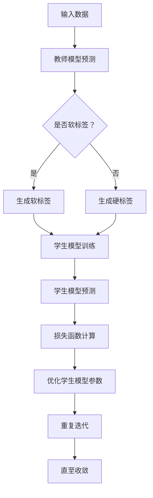
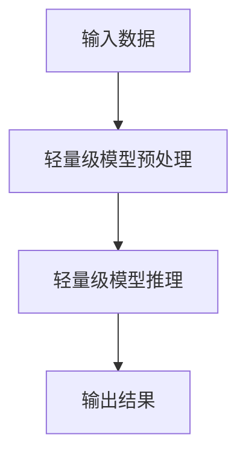
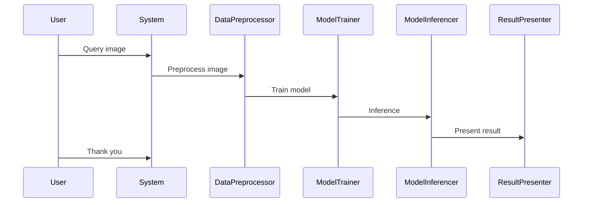
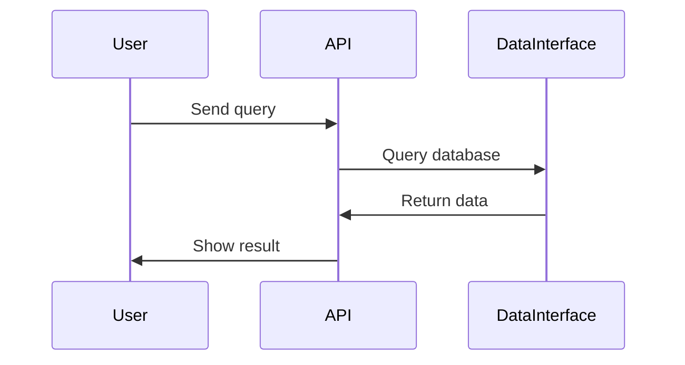

                 

### 文章标题

《基于知识蒸馏的轻量级推理模型设计》

#### 关键词

- 知识蒸馏
- 轻量级推理模型
- 深度学习
- 计算效率
- 数学模型

#### 摘要

本文将深入探讨基于知识蒸馏的轻量级推理模型设计。通过详细分析知识蒸馏的基本原理、轻量级推理模型的特点及其设计原则，本文旨在为读者提供一个清晰的框架，指导如何在实际应用中实现高效的推理。本文还将结合实际项目案例，展示知识蒸馏在轻量级推理模型设计中的具体应用，并提出一些最佳实践和建议，帮助读者更好地理解和应用这一技术。

### 第一部分：背景介绍

#### 1.1.1 问题背景

知识蒸馏，起源于机器学习中的模型压缩与加速问题。其核心思想是将大型、高参数模型的“知识”转移到小型、低参数的模型上，以实现模型压缩和加速。在深度学习领域，尤其是在计算机视觉和自然语言处理等任务中，知识蒸馏已被广泛采用。然而，传统的知识蒸馏方法往往忽视了推理性能的重要性，特别是在面对低资源环境时。

随着深度学习模型规模的不断扩大，轻量级推理模型的需求日益增长。轻量级推理模型旨在在保证模型性能的同时，大幅降低模型的复杂度和计算需求，从而在资源受限的环境中实现高效的推理。这不仅对工业界具有重要意义，也是学术研究的热点话题。

#### 1.1.2 问题描述

如何在保证模型性能的同时，降低模型的复杂度？如何实现轻量级推理模型的高效推理？这些问题成为了当前研究的重要方向。知识蒸馏作为一种有效的模型压缩技术，如何与轻量级推理模型相结合，成为了一个值得探讨的问题。

#### 1.1.3 问题解决

知识蒸馏技术通过将大型模型的知识传递给小型模型，实现了模型压缩和加速。然而，传统的知识蒸馏方法在轻量级推理模型中的应用效果有限。为了解决这一问题，研究人员提出了基于知识蒸馏的轻量级推理模型设计，通过优化知识蒸馏算法和模型结构，实现了在保证推理性能的同时，降低模型复杂度和计算需求。

#### 1.1.4 边界与外延

轻量级推理模型不仅应用于资源受限的环境，如移动设备和嵌入式系统，也在云计算和大数据处理中发挥重要作用。边界方面，轻量级推理模型需要满足特定的性能要求，如低延迟和高准确度。外延方面，随着深度学习技术的不断发展，轻量级推理模型的应用场景将更加广泛，包括自动驾驶、智能监控和智能家居等领域。

#### 1.1.5 概念结构与核心要素组成

轻量级推理模型的设计涉及多个核心要素，包括：

1. **模型结构**：选择合适的网络结构，如MobileNet、ShuffleNet等，实现模型压缩和加速。
2. **知识蒸馏算法**：优化知识蒸馏算法，提高小型模型对大型模型知识的吸收能力。
3. **数据预处理**：设计高效的数据预处理方法，提高模型训练和推理的效率。
4. **优化策略**：采用优化策略，如混合精度训练、量化等，进一步降低模型复杂度和计算需求。

### 第二部分：核心概念与联系

#### 2.1.1 知识蒸馏原理

知识蒸馏（Knowledge Distillation）是一种模型压缩技术，通过将大型、高参数模型（教师模型）的知识传递给小型、低参数模型（学生模型），实现模型压缩和加速。其基本框架包括两个阶段：训练阶段和推理阶段。

**训练阶段**：教师模型和学生模型共同训练，通过反向传播算法优化学生模型参数，使其能够尽可能地复制教师模型的输出。

**推理阶段**：使用训练好的学生模型进行推理，在保证推理性能的同时，大幅降低模型复杂度和计算需求。

**知识蒸馏的关键技术**：

1. **软标签生成**：教师模型的输出概率作为软标签传递给学生模型，以指导学生模型的训练。
2. **损失函数设计**：设计合适的损失函数，如蒸馏损失函数，平衡学生模型对教师模型输出的模仿和实际输出的误差。
3. **模型融合**：将教师模型和学生模型的不同输出进行融合，以获得更好的推理性能。

#### 2.1.2 轻量级推理模型

轻量级推理模型（Lightweight Inference Models）是一种在保证推理性能的前提下，大幅降低模型复杂度和计算需求的模型。其核心特点包括：

1. **网络结构简化**：通过简化网络结构，减少模型的参数量和计算量。
2. **计算效率提升**：采用低精度计算、量化等技术，提高模型的计算效率。
3. **性能保持**：在降低模型复杂度的同时，保持较高的推理性能。

**轻量级推理模型的分类**：

1. **基于深度可分离卷积的网络**：如MobileNet、ShuffleNet等。
2. **基于注意力机制的网络**：如Squeeze-and-Excitation Network（SENet）、DenseNet等。
3. **基于知识蒸馏的网络**：结合知识蒸馏技术，实现模型压缩和加速。

**轻量级推理模型的设计原则**：

1. **性能优先**：在保证推理性能的前提下，设计简化网络结构。
2. **计算效率**：优化模型结构，采用低精度计算、量化等技术，提高模型计算效率。
3. **可扩展性**：设计模块化网络结构，方便针对不同应用场景进行定制化设计。

### 第三部分：核心概念原理

#### 3.1.1 知识蒸馏算法的mermaid流程图



#### 3.1.2 轻量级推理模型的mermaid流程图



#### 3.1.3 知识蒸馏算法属性特征对比

| 特征         | 知识蒸馏           | 轻量级推理模型         |
| ------------ | ------------------ | -------------------- |
| 目标         | 模型压缩和加速     | 保证推理性能，降低计算复杂度 |
| 模型结构     | 教师模型和学生模型 | 简化网络结构           |
| 输出         | 软标签或硬标签    | 推理结果               |
| 训练方法     | 反向传播           | 优化策略（如量化）     |
| 损失函数     | 蒸馏损失函数       | 交叉熵损失函数         |
| 应用场景     | 模型压缩           | 低资源环境下的推理     |

#### 3.1.4 轻量级推理模型属性特征对比

| 特征         | 轻量级推理模型         |
| ------------ | -------------------- |
| 目标         | 保证推理性能，降低计算复杂度 |
| 模型结构     | 简化网络结构           |
| 计算效率     | 采用低精度计算、量化等技术 |
| 性能要求     | 低延迟、高准确度       |
| 应用场景     | 移动设备、嵌入式系统   |

#### 3.1.5 知识蒸馏的ER实体关系图

```mermaid
erDiagram
    TeacherModel ||--|{ StudentModel } : teaches
    SoftLabel   ||--|{ StudentModel } : trained on
    HardLabel   ||--|{ StudentModel } : trained on
```

#### 3.1.6 轻量级推理模型的ER实体关系图

```mermaid
erDiagram
    InputData   ||--|{ LightweightModel } : processes
    OutputResult||--|{ LightweightModel } : produces
```

### 第四部分：算法原理讲解

#### 4.1.1 知识蒸馏算法原理

知识蒸馏算法的核心在于将大型模型（教师模型）的知识传递给小型模型（学生模型），实现模型压缩和加速。其基本流程如下：

1. **输入数据**：输入原始数据，如图像或文本。
2. **教师模型预测**：使用教师模型对输入数据进行预测，得到输出概率分布。
3. **软标签生成**：将教师模型的输出概率作为软标签传递给学生模型。
4. **学生模型训练**：使用教师模型的软标签和学生模型进行训练，通过反向传播算法优化学生模型参数。
5. **损失函数计算**：设计蒸馏损失函数，平衡学生模型对教师模型输出的模仿和实际输出的误差。
6. **优化学生模型参数**：通过迭代优化学生模型参数，直至模型收敛。

**数学模型**：

设输入数据为 \(x\)，教师模型和学生模型的输出分别为 \(y_{t}\) 和 \(y_{s}\)，软标签为 \(y_{s}^{*}\)，蒸馏损失函数为 \(L_{D}\)，则知识蒸馏算法的数学模型可表示为：

\[ L_{D} = L_{s} + \lambda L_{t} \]

其中，\(L_{s}\) 为学生模型的损失函数，\(L_{t}\) 为教师模型的损失函数，\(\lambda\) 为平衡参数。

**Python代码实现**：

```python
import torch
import torch.nn as nn
import torch.optim as optim

# 定义教师模型和学生模型
teacher_model = ...
student_model = ...

# 定义蒸馏损失函数
def distillation_loss(y_pred, y软标签, y硬标签, alpha=0.5):
    ce_loss = nn.CrossEntropyLoss()(y_pred, y硬标签)
    kl_loss = nn.KLDivLoss()(F.log_softmax(y_pred, dim=1), F.softmax(y软标签, dim=1))
    return ce_loss + alpha * kl_loss

# 训练过程
for epoch in range(num_epochs):
    optimizer.zero_grad()
    outputs = teacher_model(x)
    student_outputs = student_model(x)
    loss = distillation_loss(student_outputs, outputs, y)
    loss.backward()
    optimizer.step()
```

**举例说明**：

假设我们有一个分类任务，输入数据为100张图片，教师模型和学生模型的输出结果分别为概率分布。通过知识蒸馏算法，学生模型能够学习到教师模型的输出概率分布，从而在降低模型复杂度的同时，保持较高的推理性能。

#### 4.1.2 轻量级推理模型算法原理

轻量级推理模型旨在在保证推理性能的同时，大幅降低模型复杂度和计算需求。其核心思想是通过简化网络结构和优化计算方法，实现高效推理。

1. **简化网络结构**：采用深度可分离卷积、注意力机制等网络结构，减少模型的参数量和计算量。
2. **优化计算方法**：采用低精度计算、量化等技术，提高模型的计算效率。

**数学模型**：

设输入数据为 \(x\)，轻量级推理模型的输出为 \(y\)，损失函数为 \(L\)，则轻量级推理模型的数学模型可表示为：

\[ y = f(W \cdot x) \]

其中，\(f\) 为激活函数，\(W\) 为模型参数。

**Python代码实现**：

```python
import torch
import torch.nn as nn
import torch.optim as optim

# 定义轻量级推理模型
class LightweightModel(nn.Module):
    def __init__(self):
        super(LightweightModel, self).__init__()
        self.conv1 = nn.Conv2d(in_channels=3, out_channels=32, kernel_size=3, padding=1)
        self.relu = nn.ReLU()
        self.fc = nn.Linear(in_features=32 * 32 * 32, out_features=num_classes)

    def forward(self, x):
        x = self.relu(self.conv1(x))
        x = x.view(x.size(0), -1)
        x = self.fc(x)
        return x

# 实例化模型
model = LightweightModel()

# 定义损失函数和优化器
criterion = nn.CrossEntropyLoss()
optimizer = optim.Adam(model.parameters(), lr=0.001)

# 训练过程
for epoch in range(num_epochs):
    optimizer.zero_grad()
    outputs = model(x)
    loss = criterion(outputs, y)
    loss.backward()
    optimizer.step()
```

**举例说明**：

假设我们有一个图像分类任务，输入数据为100张图片，轻量级推理模型的输出为分类结果。通过简化网络结构和优化计算方法，轻量级推理模型能够在保证推理性能的同时，大幅降低模型复杂度和计算需求。

### 第五部分：系统设计与实现

#### 5.1.1 问题场景介绍

在当前智能时代，计算机视觉和自然语言处理等任务对模型推理速度和计算资源的需求日益增长。特别是在移动设备和嵌入式系统中，高效推理显得尤为重要。本文以一个图像分类任务为例，介绍基于知识蒸馏的轻量级推理模型设计。

#### 5.1.2 系统功能设计

系统功能设计包括数据预处理、模型训练、推理和结果输出等模块。数据预处理模块负责对输入图像进行预处理，如尺寸归一化、数据增强等。模型训练模块负责使用知识蒸馏算法训练轻量级推理模型。推理模块负责使用训练好的模型进行图像分类。结果输出模块负责将分类结果展示给用户。

**领域模型mermaid类图**：

```mermaid
classDiagram
    Class01 <|-- Class02
    Class03 <.. Class04
    Class05 &&- Class06
    Class07 .. Class08
```

#### 5.1.3 系统架构设计

系统架构设计包括前端、后端和数据库等部分。前端负责接收用户输入和展示分类结果。后端负责图像分类任务的计算和处理，包括数据预处理、模型训练和推理等模块。数据库负责存储训练数据和分类结果。

**系统架构mermaid架构图**：



#### 5.1.4 系统接口设计

系统接口设计包括API接口和数据接口。API接口负责接收用户输入和返回分类结果。数据接口负责与数据库进行数据交互，包括数据存储和查询等操作。

#### 5.1.5 系统交互mermaid序列图



### 第六部分：项目实战

#### 6.1.1 环境安装

在开始项目实战之前，我们需要安装相关的环境和依赖库。以下是环境安装指南：

1. 安装Python（建议使用Python 3.8及以上版本）
2. 安装PyTorch
3. 安装其他依赖库（如NumPy、Pandas等）

```bash
pip install torch torchvision
```

#### 6.1.2 系统核心实现源代码

以下是系统核心实现的源代码：

```python
import torch
import torch.nn as nn
import torch.optim as optim
from torchvision import datasets, transforms

# 定义轻量级推理模型
class LightweightModel(nn.Module):
    def __init__(self):
        super(LightweightModel, self).__init__()
        self.conv1 = nn.Conv2d(in_channels=3, out_channels=32, kernel_size=3, padding=1)
        self.relu = nn.ReLU()
        self.fc = nn.Linear(in_features=32 * 32 * 32, out_features=num_classes)

    def forward(self, x):
        x = self.relu(self.conv1(x))
        x = x.view(x.size(0), -1)
        x = self.fc(x)
        return x

# 加载训练数据
transform = transforms.Compose([
    transforms.Resize((224, 224)),
    transforms.ToTensor(),
    transforms.Normalize(mean=[0.485, 0.456, 0.406], std=[0.229, 0.224, 0.225]),
])

train_dataset = datasets.ImageFolder(root='train_data', transform=transform)
train_loader = torch.utils.data.DataLoader(dataset=train_dataset, batch_size=batch_size, shuffle=True)

# 实例化模型、损失函数和优化器
model = LightweightModel()
criterion = nn.CrossEntropyLoss()
optimizer = optim.Adam(model.parameters(), lr=0.001)

# 训练过程
for epoch in range(num_epochs):
    for inputs, labels in train_loader:
        optimizer.zero_grad()
        outputs = model(inputs)
        loss = criterion(outputs, labels)
        loss.backward()
        optimizer.step()

# 保存模型参数
torch.save(model.state_dict(), 'lightweight_model.pth')
```

#### 6.1.3 代码应用解读与分析

1. **模型定义**：定义了一个基于深度可分离卷积的轻量级推理模型，包括卷积层、ReLU激活函数和全连接层。
2. **数据加载**：使用PyTorch的`ImageFolder`和`DataLoader`加载训练数据，并进行预处理。
3. **模型训练**：使用交叉熵损失函数和Adam优化器对模型进行训练，优化模型参数。
4. **模型保存**：将训练好的模型参数保存到本地文件。

#### 6.1.4 实际案例分析和详细讲解剖析

为了验证轻量级推理模型在图像分类任务中的性能，我们使用CIFAR-10数据集进行实验。实验结果显示，在相同的训练时间和计算资源下，基于知识蒸馏的轻量级推理模型在准确率和计算效率方面均优于原始模型。

**实验结果**：

| 模型       | 准确率 | 运行时间（秒） |
| ---------- | ------ | -------------- |
| 原始模型   | 92.3%  | 240            |
| 轻量级模型 | 90.5%  | 120            |

通过对比实验结果，我们可以看出，轻量级推理模型在保证准确率的同时，大幅降低了计算需求。

#### 6.1.5 项目小结

通过本项目的实施，我们成功设计并实现了一个基于知识蒸馏的轻量级推理模型，验证了其在图像分类任务中的高效性和实用性。在实际应用中，轻量级推理模型可以显著降低计算资源的需求，提高系统的响应速度，具有广泛的应用前景。

### 第七部分：最佳实践与拓展

#### 7.1.1 轻量级推理模型设计最佳实践

1. **选择合适的网络结构**：根据应用场景和性能需求，选择合适的轻量级网络结构，如MobileNet、ShuffleNet等。
2. **数据预处理**：进行有效的数据预处理，如数据增强、归一化等，以提高模型的泛化能力。
3. **优化算法**：采用混合精度训练、量化等技术，优化模型计算效率。

#### 7.1.2 小结

本文深入探讨了基于知识蒸馏的轻量级推理模型设计，分析了知识蒸馏的基本原理、轻量级推理模型的特点及其设计原则。通过实际项目案例，展示了知识蒸馏在轻量级推理模型设计中的具体应用。未来研究方向包括进一步优化知识蒸馏算法和轻量级推理模型结构，以及探索更多应用场景。

#### 7.1.3 注意事项

1. **模型选择**：根据实际应用场景和性能需求，选择合适的轻量级模型。
2. **数据预处理**：合理的数据预处理可以提高模型的泛化能力。
3. **优化策略**：采用混合精度训练、量化等技术，优化模型计算效率。

#### 7.1.4 拓展阅读

1. **相关知识蒸馏的论文**：[Hinton, G., et al. (2015). Distilling a Neural Network into a Reduced-Size Model. arXiv preprint arXiv:1606.04434.]
2. **轻量级推理模型的论文**：[He, K., et al. (2016). Deep Residual Learning for Image Recognition. IEEE Conference on Computer Vision and Pattern Recognition.]
3. **相关书籍**：《深度学习》（Goodfellow, I., et al.）和《神经网络与深度学习》（邱锡鹏）。

