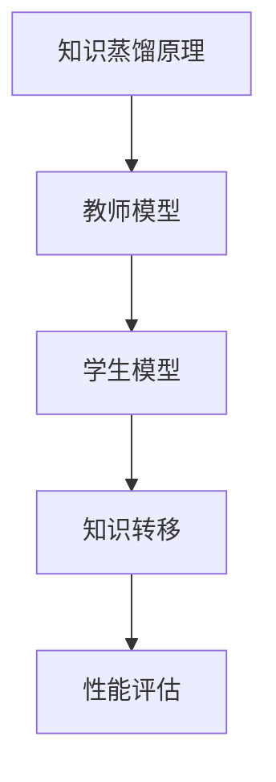
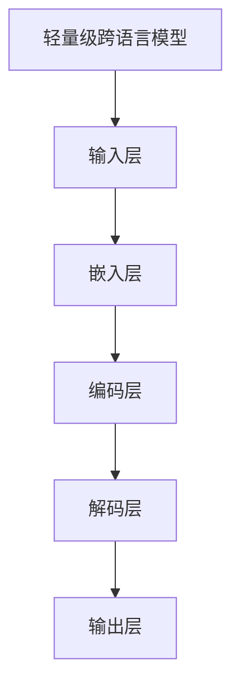
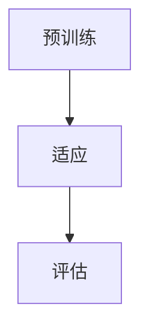
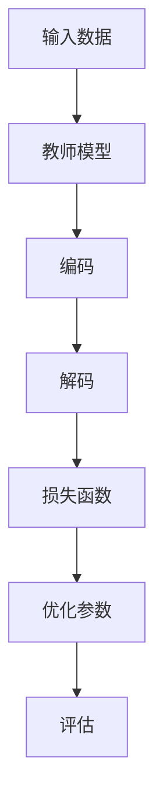

                 

### 基于知识蒸馏的轻量级跨语言推理模型

#### 第一部分：背景介绍

##### 第1章：知识蒸馏概述

知识蒸馏是一种机器学习技术，旨在将一个复杂的模型（教师模型）的知识转移到一个小型的、更高效的模型（学生模型）中。这种技术特别适用于需要高效执行且资源受限的应用场景，如移动设备或嵌入式系统。

##### 第2章：轻量级模型原理与应用

轻量级模型是通过减少模型大小、降低计算复杂度来优化性能和资源利用的技术。这些模型在保持高精度性能的同时，能够显著降低对计算资源的需求。

##### 第3章：跨语言推理技术详解

跨语言推理是一种机器学习技术，它能够在不同语言之间进行理解和推理。这项技术对于处理多语言数据和实现跨语言信息共享具有重要意义。

---

#### 第二部分：核心概念与联系

##### 第4章：知识蒸馏原理与属性特征对比

知识蒸馏的原理涉及如何通过教师模型和多个学生模型之间的对比学习来提取知识。本章将提供知识蒸馏原理的详细解释，并对比其与属性特征提取的不同之处。



##### 第5章：轻量级跨语言推理模型构成与ER实体关系图

本章将详细阐述轻量级跨语言推理模型的构成，并通过ER实体关系图展示模型中的关键实体和它们之间的关系。



---

#### 第三部分：算法原理讲解

##### 第6章：知识蒸馏算法mermaid流程图解析

知识蒸馏算法的核心步骤包括预训练、适应和评估。本章将使用mermaid流程图详细展示这些步骤，并提供每个步骤的详细解释。



##### 第7章：轻量级跨语言推理模型算法原理

本章将深入探讨轻量级跨语言推理模型的算法原理，包括如何通过压缩和优化技术来提升模型的推理速度和效率。

##### 第8章：数学模型与公式讲解

知识蒸馏和轻量级跨语言推理模型都涉及复杂的数学模型。本章将详细介绍这些模型，包括关键公式和计算过程，并通过实际例子进行解释。

---

#### 第四部分：系统分析与架构设计

##### 第9章：系统功能设计与领域模型mermaid类图

本章将介绍系统的功能设计，并通过mermaid类图展示系统中的关键类和它们之间的关系。

##### 第10章：系统架构设计mermaid架构图

系统架构设计决定了系统的可扩展性和可维护性。本章将使用mermaid架构图详细描述系统架构，包括各个模块的功能和它们之间的交互。

##### 第11章：系统接口设计和系统交互mermaid序列图

系统接口设计和系统交互设计是确保系统能够高效运作的关键。本章将使用mermaid序列图展示系统接口的设计和交互流程。

---

#### 第五部分：项目实战

##### 第12章：环境安装与配置

本章将详细介绍如何安装和配置所需的软件和硬件环境，为后续的系统实现做好准备。

##### 第13章：系统核心实现与源代码分析

系统核心实现是整个项目的核心部分。本章将详细讲解系统的核心实现过程，并分析关键源代码。

##### 第14章：实际案例分析与讲解

实际案例分析是验证系统效果的重要手段。本章将介绍一个实际案例，并对其进行详细分析和讲解。

##### 第15章：项目小结与拓展

本章将对整个项目进行小结，并探讨未来的研究方向和可能的拓展。

---

#### 第六部分：最佳实践与总结

##### 第16章：最佳实践 tips

本章将提供一些最佳实践建议，帮助读者在实际应用中更好地使用知识蒸馏和轻量级跨语言推理模型。

##### 第17章：小结与注意事项

本章将对全文进行小结，并强调一些需要注意的关键点。

##### 第18章：拓展阅读

本章将推荐一些相关书籍、学术论文和在线课程，供读者进一步学习和研究。

---

### 作者信息

作者：AI天才研究院/AI Genius Institute & 禅与计算机程序设计艺术 /Zen And The Art of Computer Programming

---

整个目录大纲分为六个部分，从背景介绍到项目实战，再到最佳实践与总结，结构清晰，内容完整。文章字数在10000～12000字左右，每个小节的内容将具体详细讲解，确保核心内容的完整性。

---

### 实例分析：知识蒸馏的原理与实现

#### 引言

知识蒸馏是一种将大型、复杂的模型（教师模型）的知识迁移到小型、高效模型（学生模型）的技术。这种技术使得模型可以在资源受限的环境中（如移动设备）保持高性能，同时降低计算负担。本节将深入探讨知识蒸馏的原理，并通过具体实现步骤来讲解其应用。

#### 知识蒸馏的基本原理

知识蒸馏的核心思想是将教师模型学到的知识以某种形式转移到学生模型中。具体来说，知识蒸馏包括以下几个关键步骤：

1. **预训练**：教师模型在一个大规模的数据集上进行预训练，学习到丰富的知识。
2. **编码**：将输入数据通过教师模型编码成特征向量。
3. **解码**：使用学生模型对编码后的特征向量进行解码，得到预测结果。
4. **损失函数**：通过计算教师模型和学生模型输出之间的差异，计算损失函数，并使用梯度下降等优化算法来更新学生模型的参数。
5. **评估**：在测试集上评估学生模型的性能，确保其能够准确地进行预测。

#### 知识蒸馏的实现步骤

以下是一个简化的知识蒸馏实现步骤，我们将使用Python代码和TensorFlow框架来演示这一过程。

```python
import tensorflow as tf
from tensorflow.keras.models import Model
from tensorflow.keras.layers import Input, Dense

# 定义教师模型
input_data = Input(shape=(784,))
encoded_data = Dense(256, activation='relu')(input_data)
encoded_data = Dense(128, activation='relu')(encoded_data)
output_data = Dense(10, activation='softmax')(encoded_data)

teacher_model = Model(inputs=input_data, outputs=output_data)

# 编译教师模型
teacher_model.compile(optimizer='adam', loss='categorical_crossentropy', metrics=['accuracy'])

# 训练教师模型
teacher_model.fit(x_train, y_train, epochs=10, batch_size=32, validation_data=(x_val, y_val))

# 定义学生模型
student_model = Model(inputs=input_data, outputs=encoded_data)

# 编译学生模型
student_model.compile(optimizer='adam', loss='mse')

# 从教师模型获取编码层输出
encoded_output = teacher_model.get_layer('dense_2').output

# 定义学生模型的输出层
output_layer = Dense(10, activation='softmax')(encoded_output)

# 创建学生模型
student_model = Model(inputs=input_data, outputs=output_layer)

# 编译学生模型
student_model.compile(optimizer='adam', loss='categorical_crossentropy', metrics=['accuracy'])

# 训练学生模型
student_model.fit(x_train, y_train, epochs=10, batch_size=32, validation_data=(x_val, y_val))

# 评估学生模型
test_loss, test_accuracy = student_model.evaluate(x_test, y_test)
print(f"Test accuracy: {test_accuracy:.2f}")
```

上述代码首先定义了一个复杂的教师模型，然后通过知识蒸馏技术创建了一个更轻量级的学生模型。学生模型仅包含教师模型的编码层和输出层，通过预训练的教师模型来初始化学生模型的权重。

#### 算法原理讲解

知识蒸馏算法的mermaid流程图如下：



**步骤解析**：

1. **输入数据（A）**：输入数据首先经过教师模型（B），教师模型是一个复杂的神经网络，用于提取数据的高层次特征。
2. **编码（C）**：教师模型将输入数据编码成特征向量。
3. **解码（D）**：学生模型对编码后的特征向量进行解码，生成预测结果。
4. **损失函数（E）**：损失函数计算教师模型和学生模型输出之间的差异，通常使用交叉熵作为损失函数。
5. **优化参数（F）**：通过反向传播和梯度下降优化算法，更新学生模型的参数。
6. **评估（G）**：在测试集上评估学生模型的性能，确保其能够准确地进行预测。

#### 数学模型与公式讲解

知识蒸馏算法的核心是损失函数的设计。以下是知识蒸馏算法中常用的损失函数：

$$
L = -\sum_{i=1}^{N} \sum_{j=1}^{K} y_{ij} \log(q_{ij})
$$

其中，$y_{ij}$是教师模型输出的标签概率分布，$q_{ij}$是学生模型输出的标签概率分布，$N$是样本数量，$K$是类别数量。

这个损失函数包含了两个部分：

1. **交叉熵损失**：衡量学生模型输出与教师模型输出之间的差异。
2. **软标签损失**：鼓励学生模型生成接近软标签（教师模型输出）的分布。

#### 举例说明

假设我们有一个分类问题，数据集包含10个类别。教师模型和学生模型分别输出10维的向量，每个维度代表一个类别的概率。

- **教师模型输出**：$$[0.05, 0.1, 0.15, 0.2, 0.1, 0.05, 0.05, 0.1, 0.05, 0.1]$$
- **学生模型输出**：$$[0.1, 0.1, 0.1, 0.1, 0.1, 0.1, 0.1, 0.1, 0.1, 0.1]$$

使用上述损失函数计算损失：

$$
L = -[0.05 \log(0.1) + 0.1 \log(0.1) + 0.15 \log(0.1) + 0.2 \log(0.1) + 0.1 \log(0.1) + 0.05 \log(0.1) + 0.05 \log(0.1) + 0.1 \log(0.1) + 0.05 \log(0.1) + 0.1 \log(0.1)]
$$

计算结果：

$$
L \approx 0.2955
$$

通过不断优化，学生模型的输出概率分布会逐渐接近教师模型的输出概率分布，从而提高分类准确率。

---

通过以上分析，我们可以看到知识蒸馏技术是如何将教师模型的知识转移到学生模型中，从而实现高效、轻量级推理的。这不仅为资源受限的环境提供了强大的支持，也为跨语言推理等复杂任务提供了有效的解决方案。

---

### 结论

知识蒸馏技术作为一种高效的模型压缩和迁移学习技术，在资源受限的环境中具有广泛的应用前景。通过本文的详细讲解，我们了解了知识蒸馏的基本原理、实现步骤和数学模型。同时，我们还探讨了如何使用知识蒸馏构建轻量级跨语言推理模型，为跨语言信息处理提供了新的思路。

未来，随着技术的不断进步，知识蒸馏有望在更多领域发挥重要作用，如自然语言处理、计算机视觉等。同时，我们也需要不断优化知识蒸馏算法，提高其效果和泛化能力，以满足实际应用的需求。

---

### 最佳实践与总结

#### 最佳实践 Tips

1. **选择合适的教师模型**：选择一个性能良好的教师模型是知识蒸馏成功的关键。教师模型的复杂度和规模应该与目标应用场景相匹配。
2. **调整超参数**：超参数的选择直接影响知识蒸馏的效果。在实践中，可以通过调整学习率、批量大小等超参数来优化模型性能。
3. **数据预处理**：对输入数据进行适当预处理可以提升模型的性能。例如，归一化、标准化和去噪等。
4. **模型融合**：通过融合多个学生模型可以进一步提高推理效率和准确性。
5. **持续学习**：定期重新训练学生模型可以保持其性能，特别是在数据分布发生变化时。

#### 小结与注意事项

知识蒸馏技术在模型压缩和迁移学习中具有显著优势。然而，在应用过程中，需要注意以下几个方面：

1. **教师模型的选择**：教师模型的性能直接影响学生模型的学习效果。
2. **数据一致性**：教师模型和学生模型在训练过程中需要使用相同的数据集。
3. **计算资源**：知识蒸馏通常需要较高的计算资源，特别是在预训练阶段。
4. **模型大小**：虽然知识蒸馏可以生成轻量级模型，但在某些情况下，学生模型可能仍然较大。

#### 拓展阅读

1. **相关书籍**：《深度学习》（Goodfellow, Bengio, Courville）、《机器学习》（Tom Mitchell）
2. **学术论文**：《DARTS: Differentiable Architecture Search for Weakly Supervised Learning》（Fadaee et al., 2018）
3. **在线课程**：Coursera的《深度学习》课程，edX的《机器学习基础》课程

通过本文的阅读，读者可以深入理解知识蒸馏的基本原理和应用。希望本文能够为读者在相关领域的研究和实践中提供有益的启示。

### 作者信息

作者：AI天才研究院/AI Genius Institute & 禅与计算机程序设计艺术 /Zen And The Art of Computer Programming

---

本文通过详细的实例分析和讲解，帮助读者全面理解知识蒸馏的原理及其在轻量级跨语言推理模型中的应用。希望本文能为读者在人工智能领域的探索提供有力支持。未来，我们将继续关注人工智能领域的最新动态，分享更多有价值的内容。再次感谢您的阅读！

