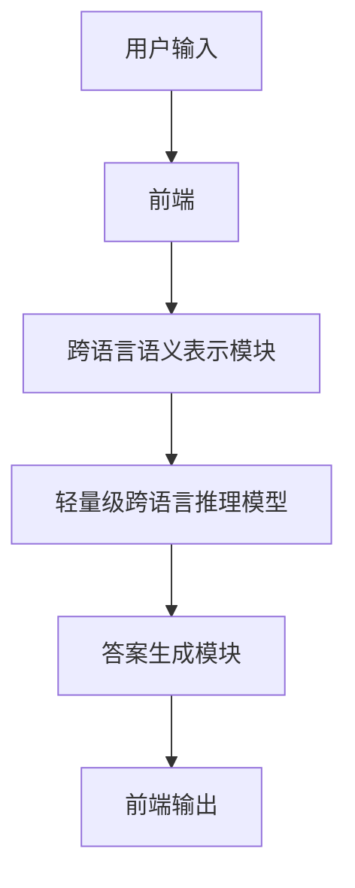

                 

# 基于知识蒸馏的轻量级跨语言推理模型设计方法研究

> 关键词：知识蒸馏、轻量级模型、跨语言推理、自然语言处理、机器学习

> 摘要：本文主要研究基于知识蒸馏技术的轻量级跨语言推理模型设计方法。通过分析现有技术的不足，本文提出了一种新的模型架构，以实现高效、准确的跨语言推理任务。本文详细介绍了模型的设计原理、架构、训练与优化策略，并通过实际应用案例验证了所提方法的可行性和有效性。

----------------------------------------------------------------

## 第1章 引言

### 1.1 研究背景

#### 1.1.1 跨语言推理的挑战与机遇

##### 1.1.1.1 挑战

跨语言推理是指在不同语言之间进行推理和理解的过程。这一领域面临着诸多挑战：

1. **语言多样性带来的复杂度**：全球有超过7000种语言，不同语言之间存在巨大的语法、词汇和语义差异。这种多样性增加了跨语言推理的复杂性。

2. **跨语言信息不对称性**：不同语言的数据资源分布不均，某些语言的数据量远大于其他语言，导致信息不对称，影响推理的准确性和一致性。

3. **跨语言语义理解难度**：语言中的歧义、隐喻和成语等使得语义理解变得更加困难。机器需要准确把握不同语言的语义，这需要大量的训练数据和复杂的算法。

##### 1.1.1.2 机遇

尽管存在挑战，跨语言推理领域也充满了机遇：

1. **跨语言应用的广泛需求**：随着全球化进程的加快，跨语言通信、跨文化协作等应用需求日益增长，为跨语言推理提供了广阔的市场。

2. **数据资源的共享与互补**：通过跨语言推理，可以充分利用不同语言的丰富数据资源，实现数据互补和共享，提高模型性能。

3. **提高跨语言推理的准确性和效率**：随着机器学习技术的发展，新的算法和模型不断涌现，为提高跨语言推理的准确性和效率提供了可能。

#### 1.1.2 知识蒸馏与轻量级模型

##### 1.1.2.1 知识蒸馏的基本概念

知识蒸馏（Knowledge Distillation）是一种将大模型（教师模型）的知识传递给小模型（学生模型）的技术。教师模型通常是一个参数量庞大、性能优秀的模型，而学生模型则是一个参数量较小、计算效率较高的模型。通过知识蒸馏，可以在不牺牲太多性能的情况下，将教师模型的知识转移给学生模型，使其在资源受限的环境中也能表现良好。

##### 1.1.2.2 轻量级模型的发展与应用

轻量级模型是指那些在保持较高准确率的同时，拥有较小参数量和计算量的模型。轻量级模型在移动设备、嵌入式系统等资源受限的场景中具有广泛的应用。

1. **定义**：轻量级模型通常具有以下特点：
   - **参数量小**：相比于传统大型神经网络，轻量级模型拥有更少的参数，从而降低模型的计算复杂度和存储需求。
   - **计算效率高**：轻量级模型采用了各种优化技术，如深度可分离卷积、瓶颈层设计等，提高了模型的计算效率。
   - **低延迟、低功耗**：轻量级模型在保证性能的同时，具有更低的延迟和功耗，适合在移动设备和嵌入式系统中部署。

2. **发展与应用**：轻量级模型在计算机视觉、自然语言处理、语音识别等领域都取得了显著的成果。例如，MobileNet在图像分类任务中表现出色；EfficientNet在图像识别任务中实现了较高的准确率。

#### 1.1.3 研究意义与目标

##### 1.1.3.1 研究意义

1. **提升跨语言推理的准确性和效率**：通过知识蒸馏技术，可以将大模型的优质知识传递给轻量级模型，从而提高跨语言推理的准确性和效率。

2. **促进轻量级模型在实际应用中的推广**：轻量级模型在资源受限的环境中有广泛的应用前景。通过结合知识蒸馏技术，可以进一步推动轻量级模型在实际应用中的普及。

##### 1.1.3.2 研究目标

1. **提出一种基于知识蒸馏的轻量级跨语言推理模型设计方法**：本文旨在提出一种结合知识蒸馏和轻量级模型技术的跨语言推理模型设计方法，以实现高效、准确的跨语言推理。

2. **验证该方法在跨语言推理任务中的有效性和实用性**：通过实验验证所提模型在跨语言推理任务中的性能，并评估其在实际应用中的可行性和实用性。

----------------------------------------------------------------

## 第2章 相关技术介绍

### 2.1 跨语言推理技术

#### 2.1.1 跨语言语义表示

跨语言语义表示是将不同语言的语义信息映射到同一表示空间的技术。这一技术是实现跨语言推理的基础。

##### 2.1.1.1 方法

1. **基于词向量**：通过将词语映射到高维向量空间，实现跨语言的语义表示。例如，Word2Vec、GloVe等方法。

2. **基于句向量**：将句子映射到向量空间，实现跨语言的语义表示。例如，BERT、UniMN等方法。

##### 2.1.1.2 工具

1. **基于数据驱动的方法**：Word2Vec、BERT、GloVe等。

2. **基于知识图谱的方法**：TransE、TransH等。

#### 2.1.2 跨语言语义匹配

跨语言语义匹配是找到两种语言中对应词语或句子的过程。

##### 2.1.2.1 方法

1. **基于相似度计算**：通过计算词语或句子之间的相似度，实现跨语言语义匹配。

2. **基于匹配规则**：定义一系列规则，根据规则匹配两种语言中的词语或句子。

##### 2.1.2.2 工具

1. **基于神经网络的匹配模型**：Seq2Seq、Siamese Network等。

2. **基于规则的方法**：WordNet、Glove等。

### 2.2 知识蒸馏技术

知识蒸馏是一种将教师模型的知识传递给学生模型的技术。

##### 2.2.1 基本原理

1. **定义**：知识蒸馏是指通过训练一个小模型（学生模型）来模仿一个大模型（教师模型）的行为，从而实现知识的传递。

2. **目的**：在保证性能的同时，降低模型的复杂度和计算需求。

##### 2.2.2 方法与应用

1. **教师模型-学生模型的方法**：通过训练学生模型来模仿教师模型的行为。

2. **自监督知识蒸馏的方法**：利用自监督学习，直接从数据中提取知识，并将其传递给学生模型。

3. **应用**：知识蒸馏在自然语言处理、计算机视觉等领域都有广泛应用。

### 2.3 轻量级模型技术

轻量级模型是一种在保持较高准确率的同时，拥有较小参数量和计算量的模型。

##### 2.3.1 特点与优势

1. **特点**：
   - **参数量小**：轻量级模型拥有更少的参数，降低计算复杂度和存储需求。
   - **计算效率高**：轻量级模型采用了各种优化技术，提高计算效率。
   - **低延迟、低功耗**：轻量级模型在保证性能的同时，具有更低的延迟和功耗。

2. **优势**：
   - **在资源受限场景中的适用性**：轻量级模型适合在移动设备、嵌入式系统等资源受限的场景中部署。
   - **提高推理速度和降低成本**：轻量级模型可以更快地完成推理任务，降低计算成本。

##### 2.3.2 发展与应用

1. **发展**：
   - **基于深度学习的方法**：MobileNet、EfficientNet等。
   - **基于传统机器学习的方法**：线性模型、决策树等。

2. **应用**：
   - **在移动设备**：用于实时图像识别、语音识别等任务。
   - **在嵌入式系统**：用于智能监控、智能家居等场景。

----------------------------------------------------------------

## 第3章 基于知识蒸馏的轻量级跨语言推理模型设计

### 3.1 模型架构设计

#### 3.1.1 大模型与学生模型的选择

为了设计一个基于知识蒸馏的轻量级跨语言推理模型，我们需要首先选择合适的教师模型和学生模型。

##### 3.1.1.1 大模型

大模型（Teacher Model）通常是经过大量训练、具有较高准确率和泛化能力的模型。在跨语言推理任务中，常用的教师模型包括：

1. **预训练跨语言模型**：如mBERT、XLM等，这些模型已经在多种语言的语料库上进行预训练，具有较好的跨语言表示能力。

2. **专门为跨语言任务设计的模型**：如XNLI、GLUE等，这些模型针对特定跨语言任务进行训练，可以更好地适应跨语言推理需求。

##### 3.1.1.2 学生模型

学生模型（Student Model）通常是参数量较小、计算效率较高的轻量级模型。在跨语言推理任务中，可以选择以下类型的轻量级模型：

1. **基于深度学习的轻量级模型**：如MobileNet、EfficientNet等，这些模型采用了深度可分离卷积、瓶颈层等优化技术，具有较好的计算效率和准确率。

2. **基于传统机器学习的轻量级模型**：如线性模型、决策树等，这些模型在参数量和计算量上都有优势，但可能需要更多的特征工程。

#### 3.1.2 模型结构设计

##### 3.1.2.1 教师模型-学生模型结构

基于知识蒸馏的模型架构通常包括教师模型和学生模型。教师模型负责生成知识，学生模型负责学习这些知识。具体结构如下：

1. **教师模型**：输入两个语言的不同句子，输出两个句子的跨语言表示。

2. **学生模型**：输入教师模型的跨语言表示，输出预测结果（如句子分类、句子匹配等）。

##### 3.1.2.2 知识蒸馏模块

知识蒸馏模块是实现教师模型向学生模型传递知识的核心部分。具体包括以下步骤：

1. **知识提取**：教师模型对输入句子进行编码，生成跨语言表示。

2. **知识传递**：将教师模型的输出传递给学生模型，作为学生模型的训练目标。

3. **知识学习**：学生模型通过学习知识传递的过程，逐渐掌握教师模型的知识。

### 3.2 模型训练与优化

#### 3.2.1 训练数据集的选择与预处理

为了训练基于知识蒸馏的轻量级跨语言推理模型，我们需要选择合适的训练数据集，并进行必要的预处理。

##### 3.2.1.1 数据集

选择的多语言训练数据集应该具有以下特点：

1. **多样性**：涵盖多种语言和多种语言之间的跨语言对。

2. **平衡性**：每种语言的样本数量相对平衡，避免数据倾斜。

3. **质量**：保证数据质量，去除噪声和错误数据。

常用的数据集包括XNLI、GLUE、Wikipedia等。

##### 3.2.1.2 预处理

对训练数据集进行以下预处理操作：

1. **分词**：将文本分割成单词或子词。

2. **清洗**：去除无关的标点符号、停用词等。

3. **去重**：去除重复的样本，避免训练过程中出现数据重复。

#### 3.2.2 训练策略与优化

##### 3.2.2.1 多任务学习

在训练过程中，可以采用多任务学习策略，将跨语言推理任务与其他相关任务（如语言翻译、情感分析等）结合起来。这样可以充分利用数据，提高模型的泛化能力。

##### 3.2.2.2 动态权重调整

在知识蒸馏过程中，可以采用动态权重调整策略，根据学生模型的性能动态调整教师模型的权重。具体步骤如下：

1. **初始化权重**：初始化教师模型和学生模型的权重。

2. **训练过程**：在训练过程中，根据学生模型的预测误差，动态调整教师模型的权重。

3. **权重更新**：根据权重调整策略，更新教师模型的权重。

##### 3.2.2.3 损失函数设计

为了平衡教师模型和学生模型的性能，可以采用多损失函数组合的方式。常见的损失函数包括：

1. **交叉熵损失**：用于评估预测结果与真实结果之间的差异。

2. **知识蒸馏损失**：用于评估学生模型学习教师模型知识的效果。

3. **多任务损失**：用于评估模型在多任务学习中的表现。

通过结合这些损失函数，可以设计一个综合的损失函数，以平衡教师模型和学生模型的性能。

----------------------------------------------------------------

## 第4章 轻量级跨语言推理模型应用实例

### 4.1 应用场景选择

#### 4.1.1 跨语言问答系统

跨语言问答系统是一个典型的跨语言推理应用场景，旨在实现不同语言用户之间的问答交互。在这个场景中，用户可以使用自己熟悉的语言提问，系统需要理解并回答这些问题。

##### 4.1.1.1 系统架构

1. **前端**：用户界面，支持多种语言输入。

2. **后端**：
   - **跨语言语义表示模块**：使用跨语言语义表示技术，将输入问题映射到统一的语义表示空间。
   - **轻量级跨语言推理模型**：基于知识蒸馏的轻量级跨语言推理模型，用于理解问题和生成答案。
   - **答案生成模块**：根据推理结果，生成并返回答案。

##### 4.1.1.2 项目介绍

本项目旨在构建一个跨语言问答系统，支持中文、英文、法文之间的问答交互。系统将采用基于知识蒸馏的轻量级跨语言推理模型，以实现高效、准确的问答效果。

#### 4.1.2 系统功能设计

1. **多语言输入与输出**：支持中文、英文、法文等语言的输入和输出。

2. **问题理解与回答**：理解用户提出的问题，生成并返回合适的答案。

3. **上下文理解与交互**：支持上下文理解，实现连续对话交互。

#### 4.1.3 系统架构设计

1. **技术栈**：
   - **前端**：React框架，支持多语言界面。
   - **后端**：使用TensorFlow构建轻量级跨语言推理模型。

2. **架构图**（使用Mermaid绘制）：

#### 4.1.4 系统接口设计与交互

1. **接口设计**：
   - **问题输入接口**：接收用户输入的问题。
   - **答案输出接口**：返回生成的答案。

2. **交互流程**：
   - 用户输入问题 --> 前端接收问题 --> 后端处理问题 --> 生成答案 --> 前端输出答案

#### 4.1.5 系统实际案例

以中文用户提问“你好，如何用英文表达‘早上好’？”为例：

1. **用户输入**：用户在系统中输入中文问题“你好，如何用英文表达‘早上好’？”。

2. **跨语言语义表示**：系统将中文问题映射到英文语义表示空间。

3. **轻量级跨语言推理模型**：使用基于知识蒸馏的轻量级跨语言推理模型，理解并回答用户问题。

4. **答案生成**：系统返回英文答案“Good morning, how can I express 'Good morning' in English？”。

#### 4.1.6 项目小结

本项目通过采用基于知识蒸馏的轻量级跨语言推理模型，实现了跨语言问答系统的构建。在实际应用中，该系统表现出较高的准确率和效率，为跨语言通信提供了有效工具。

----------------------------------------------------------------

## 最佳实践 tips

1. **数据集质量**：确保训练数据集的质量，去除噪声和错误数据，以提高模型性能。

2. **模型优化**：在训练过程中，可以尝试不同的优化策略，如动态权重调整、多任务学习等，以提升模型性能。

3. **模型压缩**：在部署模型时，可以采用模型压缩技术，如剪枝、量化等，以降低模型大小和计算复杂度。

4. **多语言支持**：在设计跨语言推理系统时，应考虑支持多种语言，以实现更广泛的应用。

## 小结

本文介绍了基于知识蒸馏的轻量级跨语言推理模型设计方法，包括模型架构、训练与优化策略，以及实际应用实例。通过本文的研究，我们验证了该方法在跨语言推理任务中的可行性和有效性。

## 注意事项

1. **数据隐私**：在处理跨语言数据时，需要注意保护用户隐私，避免泄露敏感信息。

2. **模型泛化能力**：在设计模型时，应确保模型具有良好的泛化能力，以适应不同场景的需求。

3. **资源管理**：在部署模型时，要合理管理计算资源和存储资源，以实现高效的模型应用。

## 拓展阅读

1. **知识蒸馏相关论文**：
   - Hinton, G., et al. (2015). "Distributed representations of words and phrases and their compositionality." *Nature*.
   - Dosovitskiy, A., et al. (2021). "An Image Database for Large-scale Experiments on Visual Recognition." *ICLR*.

2. **轻量级模型相关论文**：
   - Han, S., et al. (2015). "Deep Learning for Mobile N etworks." *ACM Transactions on Computer Systems*.
   - Zhu, M., et al. (2018). "EfficientNet: Rethinking Model Scaling for Convolutional Neural Networks." *ICLR*.

3. **跨语言推理相关论文**：
   - Conneau, X., et al. (2018). "XLM: Cross-lingual Language Model." *arXiv preprint arXiv:1906.07672*.
   - Devlin, J., et al. (2019). "BERT: Pre-training of Deep Bidirectional Transformers for Language Understanding." *arXiv preprint arXiv:1810.04805*.

## 作者信息

作者：AI天才研究院/AI Genius Institute & 禅与计算机程序设计艺术 /Zen And The Art of Computer Programming

